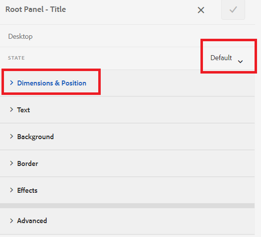

# 添加图标以指示活动和已完成的选项卡

当您有带左侧选项卡导航的自适应表单时，您可能希望显示图标以指示选项卡的状态。 例如，您希望显示一个图标来指示活动选项卡，显示图标来指示已完成的选项卡，如下面的屏幕快照所示。

## 创建自适应表单

基于基本模板和画布3.0主题的简单自适应表单用于创建示例表单。
此 [本文中使用的图标](assets/icons.zip) 可以从此处下载。

## 设置默认状态的样式

在编辑模式下打开窗体确保您在样式图层中，然后选择任意选项卡（例如“常规”选项卡）。
打开选项卡的样式编辑器时，您处于默认状态，如下面的屏幕快照所示

将CSS属性设置为默认状态，如下所示 |类别 |属性名称 |属性值 | |：—|：—|：—| |Dimension和位置 |宽度 | 50像素 | |文本 |字体粗体|粗体 | |文本 |颜色 |青瓦#FFF | |文本 |行高| 3 | |文本 |文本对齐 |左侧 | |背景|颜色 |青瓦#056dae |

保存更改

## 设置活动状态的样式

确保您处于“活动”状态并设置以下CSS属性的样式

| 类别 | 属性名称 | 属性值 |
|:---|:---|:---|
| Dimension和位置 | 宽度 | 50px |
| 文本 | 字体粗细 | 粗体 |
| 文本 | 颜色 | #FFF |
| 文本 | 行高 | 3 |
| 文本 | 文本对齐 | 左 |
| 背景 | 颜色 | #056dae |

设置背景图像的样式，如下面的屏幕快照所示

保存更改。

## 为访问状态设置样式

确保您处于已访问状态，并为以下属性设置样式

| 类别 | 属性名称 | 属性值 |
|:---|:---|:---|
| Dimension和位置 | 宽度 | 50px |
| 文本 | 字体粗细 | 粗体 |
| 文本 | 颜色 | #FFF |
| 文本 | 行高 | 3 |
| 文本 | 文本对齐 | 左 |
| 背景 | 颜色 | #056dae |

设置背景图像的样式，如下面的屏幕快照所示

保存更改

预览表单并测试图标是否按预期工作。
