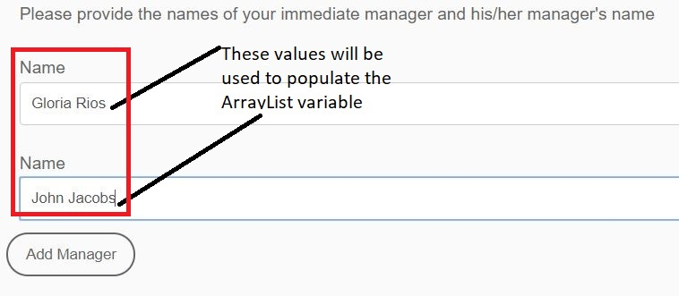

# AEM Workflow中的ArrayList变量

AEM Forms 6.5中引入了ArrayList类型的变量。使用ArrayList变量的常见用例是定义要在AssignTask中使用的自定义路由。

要在AEM Workflow中使用ArrayList变量，您需要创建一个自适应表单，该表单会在提交的数据中生成重复元素。 一种常见做法是定义包含数组元素的架构。 出于本文的目的，我创建了一个包含数组元素的简单JSON架构。 用例是员工填写费用报表。 在费用报表中，我们将捕获提交者的经理姓名和经理姓名。 管理器的名称存储在名为managerchain的数组中。 以下屏幕截图显示了费用报表表单和自适应Forms提交的数据。



以下是来自自适应表单提交的数据。 自适应表单基于JSON架构，绑定到架构的数据存储在afBoundData元素的数据元素下。 managerchain是一个数组，我们需要使用managerchain数组内对象的name元素填充ArrayList。

```json
{
    "afData": {
        "afUnboundData": {
            "data": {
                "numericbox_2762582281554154833426": 700
            }
        },
        "afBoundData": {
            "data": {
                "Employee": {
                    "Name": "Conrad Simms",
                    "Department": "IT",
                    "managerchain": [{
                        "name": "Gloria Rios"
                    }, {
                        "name": "John Jacobs"
                    }]
                },
                "expense": [{
                    "description": "Hotel",
                    "amount": 300
                }, {
                    "description": "Air Fare",
                    "amount": 400
                }]
            }
        },
        "afSubmissionInfo": {
            "computedMetaInfo": {},
            "stateOverrides": {},
            "signers": {},
            "afPath": "/content/dam/formsanddocuments/helpx/travelexpensereport",
            "afSubmissionTime": "20190402102953"
            }
        }
}
```

要初始化子类型字符串的ArrayList变量，您可以使用JSON点表示法或XPath映射模式。 以下屏幕截图显示了使用JSON点表示法填充名为CustomRoutes的ArrayList变量。 确保指向数组对象中的元素，如下面的屏幕快照所示。 我们将使用managerchain数组对象的名称填充CustomRoutes ArrayList。
然后，使用CustomRoutes ArrayList填充AssignTask组件中的路由

使用来自提交数据的值初始化CustomRoutes ArrayList变量后，将使用CustomRoutes变量填充AssignTask组件的路由。 下面的屏幕截图显示了AssignTask中的自定义路由


要在系统上测试此工作流，请执行以下步骤

* 将ArrayListVariable.zip文件下载并保存到您的文件系统
* [使用AEM包管理器导入zip文件](assets/arraylistvariable.zip)
* [打开TravelExpenseReport表单](http://localhost:4502/content/dam/formsanddocuments/helpx/travelexpensereport/jcr:content?wcmmode=disabled)
* 输入一些费用和2名经理的姓名
* 点击提交按钮
* [打开您的收件箱](http://localhost:4502/aem/inbox)
* 您应该会看到标题为“分配给费用管理员”的新任务
* 打开与任务关联的表单
* 您应该会看到两个具有管理器名称的自定义路由
  [浏览ReviewExpenseReportWorkflow。](http://localhost:4502/editor.html/conf/global/settings/workflow/models/ReviewExpenseReport.html)此工作流使用Or-Split组件中的ArrayList变量、JSON类型变量和规则编辑器
