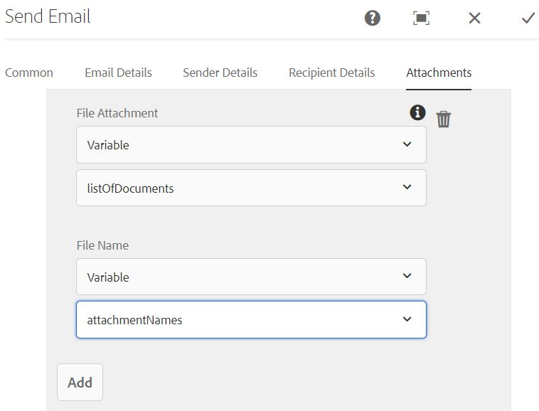

# 简介

常见用例是在AEM工作流中使用发送电子邮件组件发送自适应表单附件。
客户通常会使用发送电子邮件组件压缩表单附件或将附件作为单个文件发送。

## 以zip文件发送表单附件

为完成用例，编写了自定义工作流流程步骤。 在此自定义流程步骤中，会创建一个zip文件，其中的表单附件将存储在名为 *zipped_attachments.zip*

## 单独发送表单附件

为完成此用例，编写了自定义工作流流程步骤。 在此自定义流程步骤中，我们会填充“文档数组列表”和“字符串数组列表”类型的工作流变量。

## 后续步骤

[Zip表单附件](./custom-process-step.md)
