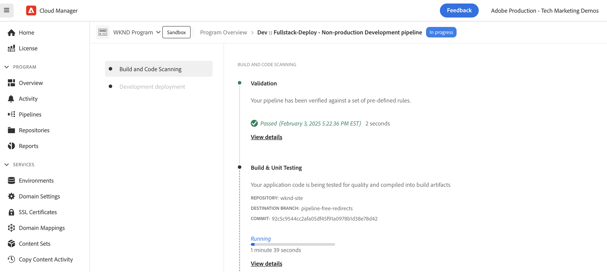

# 实施无管道URL重定向

了解如何在AEM as a Cloud Service中实施[管道免费的URL重定向](https://experienceleague.adobe.com/zh-hans/docs/experience-manager-cloud-service/content/implementing/content-delivery/pipeline-free-url-redirects)，以使营销团队无需开发人员即可管理重定向。

在AEM中有多个管理URL重定向的选项，有关详细信息，请参阅[URL重定向](url-redirection.md)。

本教程重点介绍如何在文本文件（如[Apache RewriteMap](https://httpd.apache.org/docs/2.4/rewrite/rewritemap.html)）中将URL重定向创建为键值对，并使用AEM as a Cloud Service特定的配置将它们加载到Apache/Dispatcher模块中。

## 先决条件

要完成本教程，您需要：

- 版本为&#x200B;**或更高18311**&#x200B;的AEM as a Cloud Service环境。

- 必须在其上部署示例[WKND Sites](https://github.com/adobe/aem-guides-wknd)项目。

## 教程用例

出于演示目的，假设WKND营销团队正在启动新的滑雪活动。 他们希望为滑雪冒险页面创建简短URL，并像管理内容一样自行管理这些页面。 他们决定使用[管道免费的URL重定向](https://experienceleague.adobe.com/zh-hans/docs/experience-manager-cloud-service/content/implementing/content-delivery/pipeline-free-url-redirects)方法管理URL重定向。

根据营销团队的要求，需要创建URL重定向如下。

| SOURCE URL | 目标 URL |
|------------|------------|
| /ski | /us/en/adventures.html |
| /ski/northamerica | /us/en/adventures/downhill-skiing-wyoming.html |
| /ski/westcoast | /us/en/adventures/tahoe-skiing.html |
| /ski/欧洲 | /us/en/adventures/ski-touring-mont-blanc.html |

现在，我们来看看如何在AEM as a Cloud Service环境中管理这些URL重定向和所需的一次性Dispatcher配置。

## 如何管理URL重定向{#manage-redirects}

要管理URL重定向，有多个可用选项，让我们来探索它们。

### DAM中的文本文件

URL重定向可以作为文本文件中的键值对进行管理，并上传到AEM数字资产管理(DAM)。

例如，上述URL重定向可以保存在名为`skicampaign.txt`的文本文件中，并上传到DAM @ `/content/dam/wknd/redirects`文件夹。 审核和批准后，营销团队可以发布文本文件。

```
# Ski Campaign Redirects separated by the TAB character
/ski      /us/en/adventures.html
/ski/northamerica  /us/en/adventures/downhill-skiing-wyoming.html
/ski/westcoast   /us/en/adventures/tahoe-skiing.html
/ski/europe          /us/en/adventures/ski-touring-mont-blanc.html
```

DAM中的

### ACS Commons — 重定向映射管理器

[ACS Commons — 重定向映射管理器](https://adobe-consulting-services.github.io/acs-aem-commons/features/redirect-map-manager/index.html)提供了一个用户友好的界面来管理URL重定向。

例如，营销团队可以创建名为`SkiCampaign`的新&#x200B;*重定向映射*&#x200B;页面，并使用&#x200B;**编辑条目**&#x200B;选项卡添加上述URL重定向。 URL重定向位于`/etc/acs-commons/redirect-maps/skicampaign/jcr:content.redirectmap.txt`。


>[!IMPORTANT]
>
>需要ACS Commons版本&#x200B;**6.7.0或更高版本**&#x200B;才能使用重定向映射管理器，有关详细信息，请参阅[ACS Commons — 重定向管理器](https://adobe-consulting-services.github.io/acs-aem-commons/features/redirect-manager/index.html)。

### ACS Commons — 重定向管理器

或者，[ACS Commons — 重定向管理器](https://adobe-consulting-services.github.io/acs-aem-commons/features/redirect-manager/index.html)还提供了用户友好的界面来管理URL重定向。

例如，营销团队可以创建名为`/conf/wknd`的新配置，并使用&#x200B;**+重定向配置**&#x200B;按钮添加上述URL重定向。 URL重定向位于`/conf/wknd/settings/redirects.txt`。


>[!IMPORTANT]
>
>需要ACS Commons版本&#x200B;**6.10.0或更高版本**&#x200B;才能使用重定向管理器，有关详细信息，请参阅[ACS Commons — 重定向管理器](https://adobe-consulting-services.github.io/acs-aem-commons/features/redirect-manager/subpages/rewritemap.html)。

## 如何配置Dispatcher

要将URL重定向加载为RewriteMap并将其应用于传入请求，需要以下Dispatcher配置。

### 为灵活模式启用Dispatcher模块

首先，验证是否已为&#x200B;_灵活模式_&#x200B;启用Dispatcher模块。 `dispatcher/src/opt-in`文件夹中存在`USE_SOURCES_DIRECTLY`文件表示Dispatcher处于灵活模式。

### 将URL重定向加载为RewriteMap

接下来，在`dispatcher/src/opt-in`文件夹创建一个新的配置文件`managed-rewrite-maps.yaml`，该文件的结构如下。

```yaml
maps:
- name: <MAPNAME>.map # e.g. skicampaign.map
    path: <ABSOLUTE_PATH_TO_URL_REDIRECTS_FILE> # e.g. /content/dam/wknd/redirects/skicampaign.txt, /etc/acs-commons/redirect-maps/skicampaign/jcr:content.redirectmap.txt, /conf/wknd/settings/redirects.txt
    wait: false # Optional, default is false, when true, the Apache waits for the map to be loaded before starting
    ttl: 300 # Optional, default is 300 seconds, the reload interval for the map
```

在部署期间，Dispatcher在`/tmp/rewrites`文件夹中创建`<MAPNAME>.map`文件。

>[!IMPORTANT]
>
> 文件名(`managed-rewrite-maps.yaml`)和位置(`dispatcher/src/opt-in`)应与上面完全相同，请将其视为要遵循的约定。

### 将URL重定向应用于传入请求

最后，创建或更新Apache重写配置文件以使用上述映射(`<MAPNAME>.map`)。 例如，让我们使用`dispatcher/src/conf.d/rewrites`文件夹中的`rewrite.rules`文件来应用URL重定向。

```
...
# Use the RewriteMap to define the URL redirects
RewriteMap <MAPALIAS> dbm=sdbm:/tmp/rewrites/<MAPNAME>.map

RewriteCond ${<MAPALIAS>:$1} !=""
RewriteRule ^(.*)$ ${<MAPALIAS>:$1|/} [L,R=301]    
...
```

### 示例配置

让我们查看上面提到的[的每个URL重定向管理选项的Dispatcher配置](#manage-redirects)。

>[!BEGINTABS]
>[!TAB DAM中的 文本文件]

当URL重定向在文本文件中作为键值对进行管理，并上传到DAM时，配置如下。

[!BADGE dispatcher/src/opt-in/managed-rewrite-maps.yaml]{type=Neutral tooltip="下面代码示例的文件名。"}

```yaml
maps:
- name: skicampaign.map
  path: /content/dam/wknd/redirects/skicampaign.txt
```

[!BADGE dispatcher/src/conf.d/rewrites/rewrite.rules]{type=Neutral tooltip="下面代码示例的文件名。"}

```
...

# The DAM-managed skicampaign.txt file as skicampaign.map
RewriteMap skicampaign dbm=sdbm:/tmp/rewrites/skicampaign.map

# Apply the RewriteMap for matching request URIs
RewriteCond ${skicampaign:$1} !=""
RewriteRule ^(.*)$ ${skicampaign:$1|/} [L,R=301]

...
```

>[!TAB ACS Commons — 重定向映射管理器]

使用ACS Commons — 重定向映射管理器管理URL重定向时，配置如下。

[!BADGE dispatcher/src/opt-in/managed-rewrite-maps.yaml]{type=Neutral tooltip="下面代码示例的文件名。"}

```yaml
maps:
- name: skicampaign.map
  path: /etc/acs-commons/redirect-maps/skicampaign/jcr:content.redirectmap.txt
```

[!BADGE dispatcher/src/conf.d/rewrites/rewrite.rules]{type=Neutral tooltip="下面代码示例的文件名。"}

```
...

# The Redirect Map Manager-managed skicampaign.map
RewriteMap skicampaign dbm=sdbm:/tmp/rewrites/skicampaign.map

# Apply the RewriteMap for matching request URIs
RewriteCond ${skicampaign:$1} !=""
RewriteRule ^(.*)$ ${skicampaign:$1|/} [L,R=301]

...
```

>[!TAB ACS Commons — 重定向管理器]

使用ACS Commons — 重定向管理器管理URL重定向时，配置如下。

[!BADGE dispatcher/src/opt-in/managed-rewrite-maps.yaml]{type=Neutral tooltip="下面代码示例的文件名。"}

```yaml
maps:
- name: skicampaign.map
  path: /conf/wknd/settings/redirects.txt
```

[!BADGE dispatcher/src/conf.d/rewrites/rewrite.rules]{type=Neutral tooltip="下面代码示例的文件名。"}

```
...

# The Redirect Manager-managed skicampaign.map
RewriteMap skicampaign dbm=sdbm:/tmp/rewrites/skicampaign.map

# Apply the RewriteMap for matching request URIs
RewriteCond ${skicampaign:$1} !=""
RewriteRule ^(.*)$ ${skicampaign:$1|/} [L,R=301]

...
```

>[!ENDTABS]

## 如何部署配置

>[!IMPORTANT]
>
>*无管道*&#x200B;术语用于强调&#x200B;*配置仅部署一次*，营销团队可以通过更新文本文件来管理URL重定向。

要部署配置，请使用[Cloud Manager](https://my.cloudmanager.adobe.com/)中的[全栈栈](https://experienceleague.adobe.com/zh-hans/docs/experience-manager-cloud-service/content/implementing/using-cloud-manager/cicd-pipelines/introduction-ci-cd-pipelines#full-stack-pipeline)或[Web层配置](https://experienceleague.adobe.com/zh-hans/docs/experience-manager-cloud-service/content/implementing/using-cloud-manager/cicd-pipelines/introduction-ci-cd-pipelines#web-tier-config-pipelines)管道。




部署成功后，URL重定向将处于活动状态，营销团队无需开发人员即可管理它们。

## 如何测试URL重定向

让我们使用浏览器或`curl`命令测试URL重定向。 访问`/ski/westcoast` URL并确认它重定向到`/us/en/adventures/tahoe-skiing.html`。

## 摘要

在本教程中，您已了解如何使用AEM as a Cloud Service环境中的无管道配置管理URL重定向。

营销团队可以将URL重定向作为文本文件中的键值对进行管理，并将其上传到DAM或使用ACS Commons — 重定向映射管理器或重定向管理器。 Dispatcher配置已更新，以作为RewriteMap加载URL重定向，并将其应用于传入请求。

## 其他资源

- [无管道URL重定向](https://experienceleague.adobe.com/zh-hans/docs/experience-manager-cloud-service/content/implementing/content-delivery/pipeline-free-url-redirects)
- [URL重定向](url-redirection.md)
