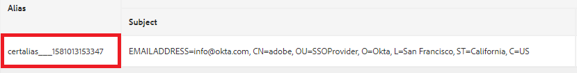

# 使用OKTA验证AEM作者

> 请参阅 [SAML 2.0身份验证](https://experienceleague.adobe.com/docs/experience-manager-learn/cloud-service/authentication/saml-2-0.html) 有关如何使用AEMas a Cloud Service设置OKTA的说明。

第一步是在OKTA门户上配置您的应用程序。 您的应用程序获得OKTA管理员批准后，您将有权访问IdP证书和单点登录URL。 以下是注册新应用程序时通常使用的设置。

* **应用程序名称：** 这是您的应用程序名称。 请确保为应用程序提供一个唯一的名称。
* **SAML收件人：** 在从OKTA进行身份验证后，这是将通过SAML响应命中您的AEM实例的URL。 SAML身份验证处理程序通常会使用/saml_login拦截所有URL，但最好将其附加到应用程序根之后。
* **SAML受众**：这是应用程序的域URL。 请勿在域URL中使用协议（http或https）。
* **SAML名称ID：** 从下拉列表中选择电子邮件。
* **环境**：选择适当的环境。
* **属性**：这些是您在SAML响应中获取的有关用户的属性。 根据需要指定它们。

## 将OKTA (IdP)证书添加到AEM Trust Store

由于SAML声明是加密的，我们需要将IdP (OKTA)证书添加到AEM信任存储区，以允许OKTA和AEM之间的安全通信。
[初始化信任存储区](http://localhost:4502/libs/granite/security/content/truststore.html)，如果尚未初始化。
记住信任存储区密码。 我们稍后需要在此过程中使用此密码。

* 导航到 [全局信任存储区](http://localhost:4502/libs/granite/security/content/truststore.html).
* 单击“从CER文件添加证书”。 添加由OKTA提供的IdP证书，然后单击提交。

  >[!NOTE]
  >
  >请勿将证书映射到任何用户

将证书添加到信任存储区时，您应该获取如下面的屏幕快照中所示的证书别名。 您的案例中，别名可能不同。

**记下证书别名。 您需要在后面的步骤中执行此操作。**

### 配置SAML身份验证处理程序

导航到 [configMgr](http://localhost:4502/system/console/configMgr).
搜索并打开“AdobeGranite SAML 2.0身份验证处理程序”。
提供如下指定的以下属性。以下是需要指定的键属性：

* **路径**  — 这是触发身份验证处理程序的路径
* **IdP Url**：这是您的IdP url，由OKTA提供
* **IDP证书别名**：这是您将IdP证书添加到AEM信任存储区时获得的别名
* **服务提供商实体ID**：这是您的AEM Server的名称
* **密钥存储的密码**：这是您使用的信任存储区密码
* **默认重定向**：这是成功身份验证时要重定向到的URL
* **用户ID属性**：uid
* **使用加密**：false
* **自动创建CRX用户**：true
* **添加到组**：true
* **默认组**：oktausers(这是将用户添加到其中的组。 您可以在AEM中提供任意现有组)
* **NamedIDPolicy**：指定要用于表示所请求主体的名称标识符的约束。 复制并粘贴以下高亮显示的字符串 **urn:oasis:名称:tc:SAML：2.0:nameidformat:电子邮件地址**
* **已同步属性**  — 这些是从AEM配置文件中的SAML断言存储的属性

### 配置Apache Sling引用过滤器

导航到 [configMgr](http://localhost:4502/system/console/configMgr).
搜索并打开“Apache Sling引用过滤器”。按照以下指定设置以下属性：

* **允许为空**： false
* **允许主机**：IdP的主机名（在您的情况中此情况不同）
* **允许正则表达式主机**：IdP的主机名（您的情况不同） Sling反向链接筛选反向链接属性屏幕截图

#### 为OKTA集成配置DEBUG日志记录

在AEM上设置OKTA集成时，查看AEM SAML身份验证处理程序的DEBUG日志会很有用。 要将日志级别设置为DEBUG，请通过AEM OSGi Web控制台创建新的Sling记录器配置。

请记得在“暂存和生产”中移除或禁用此日志记录器以减少日志噪音。

在AEM上设置OKTA集成时，查看AEM SAML身份验证处理程序的DEBUG日志会很有用。 要将日志级别设置为DEBUG，请通过AEM OSGi Web控制台创建新的Sling记录器配置。
**请记得在“暂存和生产”中移除或禁用此日志记录器以减少日志噪音。**
* 导航到 [configMgr](http://localhost:4502/system/console/configMgr)

* 搜索并打开“Apache Sling日志记录器配置”
* 使用以下配置创建日志程序：
   * **日志级别**：调试
   * **日志文件**： logs/saml.log
   * **Logger**： com.adobe.granite.auth.saml
* 单击保存以保存您的设置

#### 测试OKTA配置

注销AEM实例。 尝试访问链接。 您应该会看到OKTA SSO的实际操作。
