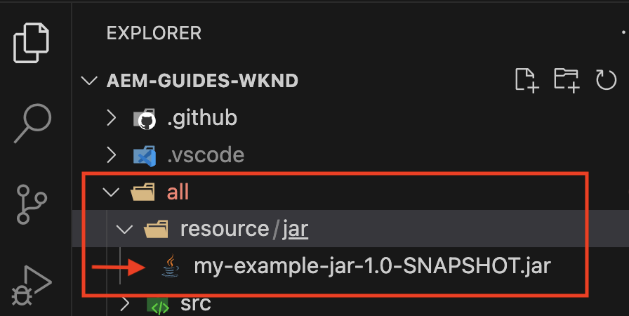

# 安装第三方工件 — 在公共Maven存储库中不可用

了解如何在生成和部署AEM项目时安装公共Maven存储库&#x200B;*中不可用的*&#x200B;第三方工件。

**第三方工件**&#x200B;可以是：

- [OSGi捆绑包](https://www.osgi.org/resources/architecture/)： OSGi捆绑包是一个Java™存档文件，它包含Java类、资源以及描述捆绑包及其依赖项的清单。
- [Java jar](https://docs.oracle.com/javase/tutorial/deployment/jar/basicsindex.html)：包含Java类和资源的Java™存档文件。
- [包](https://experienceleague.adobe.com/en/docs/experience-manager-65/content/sites/administering/contentmanagement/package-manager#what-are-packages)：包是包含文件系统序列化形式的存储库内容的zip文件。

## 标准方案

AEM通常，您会安装&#x200B;*在公共Maven存储库中作为依赖项`pom.xml`文件提供的第三方包*。

例如：

- [AEM WCM核心组件](https://github.com/adobe/aem-core-wcm-components) **包**&#x200B;已添加为[WKND项目的](https://github.com/adobe/aem-guides-wknd/blob/main/pom.xml#L747-L753) `pom.xml`文件中的依赖项。 此处`provided`范围用作AEM运行时提供的AEM WCM核心组件包。 如果AEM运行时未提供该捆绑包，则您将使用`compile`作用域，并且它是默认作用域。

- [WKND共享](https://github.com/adobe/aem-guides-wknd-shared) **包**&#x200B;已添加为[WKND项目的](https://github.com/adobe/aem-guides-wknd/blob/main/pom.xml#L767-L773) `pom.xml`文件中的依赖项。


## 罕见场景

有时，在生成和部署AEM项目时，您可能需要安装第三方捆绑包、jar或包&#x200B;**，这些捆绑包或在[Maven中央存储库](https://mvnrepository.com/)或[Adobe公共存储库](https://repo.adobe.com/index.html)中不可用**。

原因可能是：

- 捆绑包或包由内部团队或第三方供应商提供，_在公共Maven存储库_&#x200B;中不可用。

- Java™ jar文件&#x200B;_不是OSGi捆绑包_，并且在公共Maven存储库中可能可用，也可能不可用。

- 您需要的功能尚未在公共Maven存储库中提供的最新版第三方软件包中发布。 您决定安装本地构建的RELEASE或SNAPSHOT版本。

## 先决条件

要学习本教程，您需要：

- [本地AEM开发环境](https://experienceleague.adobe.com/en/docs/experience-manager-learn/cloud-service/local-development-environment-set-up/overview)或[快速开发环境(RDE)](https://experienceleague.adobe.com/en/docs/experience-manager-learn/cloud-service/developing/rde/overview)安装程序。

- [AEM WKND项目](https://github.com/adobe/aem-guides-wknd) _用于添加第三方包或jar或包_&#x200B;并验证更改。

## 设置

- 设置AEM 6.X、AEM as a Cloud Service (AEMCS)本地开发环境或RDE环境。

- 克隆和部署AEM WKND项目。

  ```
  $ git clone git@github.com:adobe/aem-guides-wknd.git
  $ cd aem-guides-wknd
  $ mvn clean install -PautoInstallPackage 
  ```

  验证WKND网站页面是否正确呈现。

## 在AEM项目中安装第三方捆绑包{#install-third-party-bundle}

让我们将公共Maven存储库&#x200B;_中不可用的_&#x200B;演示OSGi [my-example-bundle](./assets/install-third-party-articafcts/my-example-bundle.zip)安装并用于AEM WKND项目。

**my-example-bundle**&#x200B;导出`HelloWorldService` OSGi服务，其`sayHello()`方法返回`Hello Earth!`消息。

有关详细信息，请参阅[my-example-bundle.zip](./assets/install-third-party-articafcts/my-example-bundle.zip)文件中的README.md文件。

### 将包添加到`all`模块

第一步是将`my-example-bundle`添加到AEM WKND项目的`all`模块。

- 下载并解压缩[my-example-bundle.zip](./assets/install-third-party-articafcts/my-example-bundle.zip)文件。

- 在AEM WKND项目的`all`模块中，创建`all/src/main/content/jcr_root/apps/wknd-vendor-packages/container/install`目录结构。 `/all/src/main/content`目录存在，您只需要创建`jcr_root/apps/wknd-vendor-packages/container/install`目录。

- 将`my-example-bundle-1.0-SNAPSHOT.jar`文件从提取的`target`目录复制到上述`all/src/main/content/jcr_root/apps/wknd-vendor-packages/container/install`目录。

  所有模块中的

### 使用捆绑包中的服务

让我们使用AEM WKND项目中`my-example-bundle`的`HelloWorldService` OSGi服务。

- 在AEM WKND项目的`core`模块中，创建`SayHello.java` Sling servlet @ `core/src/main/java/com/adobe/aem/guides/wknd/core/servlet`。

  ```java
  package com.adobe.aem.guides.wknd.core.servlet;
  
  import java.io.IOException;
  
  import javax.servlet.Servlet;
  import javax.servlet.ServletException;
  
  import org.apache.sling.api.SlingHttpServletRequest;
  import org.apache.sling.api.SlingHttpServletResponse;
  import org.apache.sling.api.servlets.HttpConstants;
  import org.apache.sling.api.servlets.ServletResolverConstants;
  import org.apache.sling.api.servlets.SlingSafeMethodsServlet;
  import org.osgi.service.component.annotations.Component;
  import org.osgi.service.component.annotations.Reference;
  import com.example.services.HelloWorldService;
  
  @Component(service = Servlet.class, property = {
      ServletResolverConstants.SLING_SERVLET_PATHS + "=/bin/sayhello",
      ServletResolverConstants.SLING_SERVLET_METHODS + "=" + HttpConstants.METHOD_GET
  })
  public class SayHello extends SlingSafeMethodsServlet {
  
          private static final long serialVersionUID = 1L;
  
          // Injecting the HelloWorldService from the `my-example-bundle` bundle
          @Reference
          private HelloWorldService helloWorldService;
  
          @Override
          protected void doGet(SlingHttpServletRequest request, SlingHttpServletResponse response) throws ServletException, IOException {
              // Invoking the HelloWorldService's `sayHello` method
              response.getWriter().write("My-Example-Bundle service says: " + helloWorldService.sayHello());
          }
  }
  ```

- 在AEM WKND项目的根`pom.xml`文件中，将`my-example-bundle`添加为依赖项。

  ```xml
  ...
  <!-- My Example Bundle -->
  <dependency>
      <groupId>com.example</groupId>
      <artifactId>my-example-bundle</artifactId>
      <version>1.0-SNAPSHOT</version>
      <scope>system</scope>
      <systemPath>${maven.multiModuleProjectDirectory}/all/src/main/content/jcr_root/apps/wknd-vendor-packages/container/install/my-example-bundle-1.0-SNAPSHOT.jar</systemPath>
  </dependency>
  ...
  ```

  此处：
   - `system`范围表示不应在公共Maven存储库中查找依赖项。
   - `systemPath`是AEM WKND项目的`all`模块中`my-example-bundle`文件的路径。
   - `${maven.multiModuleProjectDirectory}`是一个指向多模块项目根目录的Maven属性。

- 在AEM WKND项目的`core`模块的`core/pom.xml`文件中，将`my-example-bundle`添加为依赖项。

  ```xml
  ...
  <!-- My Example Bundle -->
  <dependency>
      <groupId>com.example</groupId>
      <artifactId>my-example-bundle</artifactId>
  </dependency>
  ...
  ```

- 使用以下命令生成和部署AEM WKND项目：

  ```
  $ mvn clean install -PautoInstallPackage
  ```

- 通过访问浏览器中的URL `http://localhost:4502/bin/sayhello`，验证`SayHello` servlet是否按预期工作。

- 将以上更改提交到AEM WKND项目的存储库。 然后通过运行Cloud Manager管道来验证RDE或AEM环境中的更改。

  

AEM WKND项目的[tutorial/install-3rd-party-bundle](https://github.com/adobe/aem-guides-wknd/compare/main...tutorial/install-3rd-party-bundle)分支具有上述更改以供您参考。

### 重要学习{#key-learnings-bundle}

可通过以下步骤在AEM项目中安装公共Maven存储库中不可用的OSGi包：

- 将OSGi包复制到`all`模块的`jcr_root/apps/<PROJECT-NAME>-vendor-packages/container/install`目录。 要打包捆绑包并将其部署到AEM实例，必须执行此步骤。

- 更新根和核心模块的`pom.xml`文件，将OSGi包添加为具有`system`作用域和`systemPath`指向包文件的依赖项。 此步骤是编译项目所必需的。

## 在AEM项目中安装第三方jar

在此示例中，`my-example-jar`不是OSGi捆绑包，而是Java jar文件。

让我们安装并使用演示[my-example-jar](./assets/install-third-party-articafcts/my-example-jar.zip)，该演示&#x200B;_在公共Maven存储库_&#x200B;中不可用于AEM WKND项目。

**my-example-jar**&#x200B;是一个Java jar文件，该文件包含带有`sayHello()`方法的`MyHelloWorldService`类，并返回`Hello World!`消息。

有关详细信息，请参阅[my-example-jar.zip](./assets/install-third-party-articafcts/my-example-jar.zip)文件中的README.md文件。

### 将jar添加到`all`模块

第一步是将`my-example-jar`添加到AEM WKND项目的`all`模块。

- 下载并解压缩[my-example-jar.zip](./assets/install-third-party-articafcts/my-example-jar.zip)文件。

- 在AEM WKND项目的`all`模块中，创建`all/resource/jar`目录结构。

- 将`my-example-jar-1.0-SNAPSHOT.jar`文件从提取的`target`目录复制到上述`all/resource/jar`目录。

  所有模块中的

### 使用jar中的服务

让我们在AEM WKND项目中使用`my-example-jar`中的`MyHelloWorldService`。

- 在AEM WKND项目的`core`模块中，创建`SayHello.java` Sling servlet @ `core/src/main/java/com/adobe/aem/guides/wknd/core/servlet`。

  ```java
  package com.adobe.aem.guides.wknd.core.servlet;
  
  import java.io.IOException;
  
  import javax.servlet.Servlet;
  import javax.servlet.ServletException;
  
  import org.apache.sling.api.SlingHttpServletRequest;
  import org.apache.sling.api.SlingHttpServletResponse;
  import org.apache.sling.api.servlets.HttpConstants;
  import org.apache.sling.api.servlets.ServletResolverConstants;
  import org.apache.sling.api.servlets.SlingSafeMethodsServlet;
  import org.osgi.service.component.annotations.Component;
  
  import com.my.example.MyHelloWorldService;
  
  @Component(service = Servlet.class, property = {
          ServletResolverConstants.SLING_SERVLET_PATHS + "=/bin/sayhello",
          ServletResolverConstants.SLING_SERVLET_METHODS + "=" + HttpConstants.METHOD_GET
  })
  public class SayHello extends SlingSafeMethodsServlet {
  
      private static final long serialVersionUID = 1L;
  
      @Override
      protected void doGet(SlingHttpServletRequest request, SlingHttpServletResponse response)
              throws ServletException, IOException {
  
          // Creating an instance of MyHelloWorldService
          MyHelloWorldService myHelloWorldService = new MyHelloWorldService();
  
          // Invoking the MyHelloWorldService's `sayHello` method
          response.getWriter().write("My-Example-JAR service says: " + myHelloWorldService.sayHello());
      }
  }    
  ```

- 在AEM WKND项目的根`pom.xml`文件中，将`my-example-jar`添加为依赖项。

  ```xml
  ...
  <!-- My Example JAR -->
  <dependency>
      <groupId>com.my.example</groupId>
      <artifactId>my-example-jar</artifactId>
      <version>1.0-SNAPSHOT</version>
      <scope>system</scope>
      <systemPath>${maven.multiModuleProjectDirectory}/all/resource/jar/my-example-jar-1.0-SNAPSHOT.jar</systemPath>
  </dependency>            
  ...
  ```

  此处：
   - `system`范围表示不应在公共Maven存储库中查找依赖项。
   - `systemPath`是AEM WKND项目的`all`模块中`my-example-jar`文件的路径。
   - `${maven.multiModuleProjectDirectory}`是一个指向多模块项目根目录的Maven属性。

- 在AEM WKND项目的`core`模块的`core/pom.xml`文件中，进行两项更改：

   - 将`my-example-jar`添加为依赖项。

     ```xml
     ...
     <!-- My Example JAR -->
     <dependency>
         <groupId>com.my.example</groupId>
         <artifactId>my-example-jar</artifactId>
     </dependency>
     ...
     ```

   - 更新`bnd-maven-plugin`配置以将`my-example-jar`包含在正在构建的OSGi捆绑包(aem-guides-wknd.core)中。

     ```xml
     ...
     <plugin>
         <groupId>biz.aQute.bnd</groupId>
         <artifactId>bnd-maven-plugin</artifactId>
         <executions>
             <execution>
                 <id>bnd-process</id>
                 <goals>
                     <goal>bnd-process</goal>
                 </goals>
                 <configuration>
                     <bnd><![CDATA[
                 Import-Package: javax.annotation;version=0.0.0,*
                 <!-- Include the 3rd party jar as inline resource-->
                 -includeresource: \
                 lib/my-example-jar.jar=my-example-jar-1.0-SNAPSHOT.jar;lib:=true
                         ]]></bnd>
                 </configuration>
             </execution>
         </executions>
     </plugin>        
     ...
     ```

- 使用以下命令生成和部署AEM WKND项目：

  ```
  $ mvn clean install -PautoInstallPackage
  ```

- 通过访问浏览器中的URL `http://localhost:4502/bin/sayhello`，验证`SayHello` servlet是否按预期工作。

- 将以上更改提交到AEM WKND项目的存储库。 然后通过运行Cloud Manager管道来验证RDE或AEM环境中的更改。

  

AEM WKND项目的[tutorial/install-3rd-party-jar](https://github.com/adobe/aem-guides-wknd/compare/main...tutorial/install-3rd-party-jar)分支具有上述更改以供您参考。

如果Java jar文件&#x200B;_在公共Maven存储库中可用，但不是OSGi捆绑包_，则可以按照上述步骤操作，但`<dependency>`的`system`作用域和`systemPath`元素不是必需的。

### 重要学习{#key-learnings-jar}

可以按照以下步骤在AEM项目中安装非OSGi捆绑包并且可能在公共Maven存储库中提供的Java Jar：

- 更新核心模块`pom.xml`文件中的`bnd-maven-plugin`配置，以将Java jar作为内联资源包含在正在生成的OSGi包中。

仅当Java jar在公共Maven存储库中不可用时，才需要执行以下步骤：

- 将Java jar复制到`all`模块的`resource/jar`目录。

- 更新根和核心模块的`pom.xml`文件，将Java jar添加为具有`system`作用域和`systemPath`指向jar文件的依赖项。

## 在AEM项目中安装第三方软件包

让我们安装从主分支本地构建的[ACS AEM Commons](https://adobe-consulting-services.github.io/acs-aem-commons/) _SNAPSHOT_&#x200B;版本。

它只是为了演示安装公共Maven存储库中没有的AEM包的步骤。

ACS AEM Commons包在公共Maven存储库中可用。 请参阅[将ACS AEM Commons添加到您的AEM Maven项目](https://adobe-consulting-services.github.io/acs-aem-commons/pages/maven.html)，以将其添加到AEM项目。

### 将包添加到`all`模块

第一步是将包添加到AEM WKND项目的`all`模块。

- 从POM文件中注释或删除ACS AEM Commons版本依赖项。 请参阅[将ACS AEM Commons添加到您的AEM Maven项目](https://adobe-consulting-services.github.io/acs-aem-commons/pages/maven.html)以确定依赖关系。

- 将[ACS AEM Commons存储库](https://github.com/Adobe-Consulting-Services/acs-aem-commons)的`master`分支克隆到本地计算机。

- 使用以下命令构建ACS AEM Commons SNAPSHOT版本：

  ```
  $mvn clean install
  ```

- 本地生成的包位于@ `all/target`，有两个.zip文件，一个以`-cloud`结尾，适用于AEM as a Cloud Service，另一个适用于AEM 6.X。

- 在AEM WKND项目的`all`模块中，创建`all/src/main/content/jcr_root/apps/wknd-vendor-packages/container/install`目录结构。 `/all/src/main/content`目录存在，您只需要创建`jcr_root/apps/wknd-vendor-packages/container/install`目录。

- 将本地生成的包(.zip)文件复制到`/all/src/main/content/jcr_root/apps/mysite-vendor-packages/container/install`目录。

- 使用以下命令生成和部署AEM WKND项目：

  ```
  $ mvn clean install -PautoInstallPackage
  ```

- 验证已安装的ACS AEM Commons包：

   - CRX包管理器@ `http://localhost:4502/crx/packmgr/index.jsp`

     

   - OSGi控制台@ `http://localhost:4502/system/console/bundles`

     

- 将以上更改提交到AEM WKND项目的存储库。 然后通过运行Cloud Manager管道来验证RDE或AEM环境中的更改。

### 重要学习{#key-learnings-package}

可通过以下步骤将公共Maven存储库中不可用的AEM包安装到AEM项目中：

- 将包复制到`all`模块的`jcr_root/apps/<PROJECT-NAME>-vendor-packages/container/install`目录。 要将包打包并部署到AEM实例，必须执行此步骤。


## 摘要

在本教程中，您已了解如何在生成和部署AEM项目时安装公共Maven存储库中不可用的第三方工件（捆绑包、Java jar和包）。
