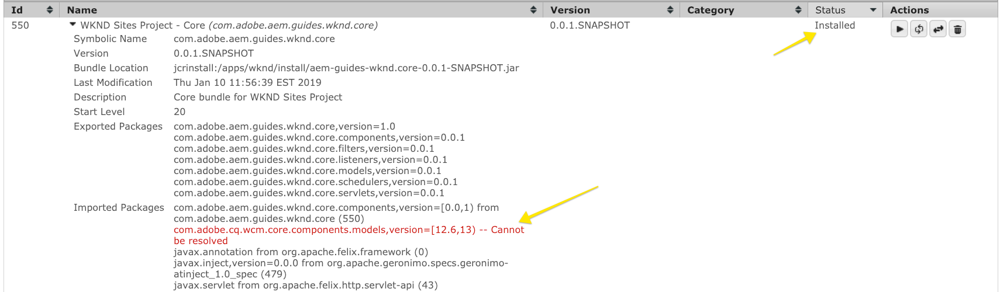

# 设置本地AEM开发环境

为Adobe Experience Manager、AEM设置本地开发的指南。 涵盖本地安装、Apache Maven、集成开发环境和调试/故障排除等重要主题。 讨论了使用&#x200B;**Eclipse IDE、CRXDE Lite、Visual Studio Code和IntelliJ**&#x200B;进行开发。

## 概述

设置本地开发环境是为Adobe Experience Manager或AEM进行开发的第一步。 请花些时间来设置一个高质量的开发环境，以提高您的工作效率并更快地编写更好的代码。 我们可以将AEM本地开发环境分为四个方面：

* 本地AEM实例
* [!DNL Apache Maven]项目
* 集成开发环境(IDE)
* 疑难解答

## 安装本地AEM实例

当我们提及本地AEM实例时，我们谈论的是在开发人员个人计算机上运行的Adobe Experience Manager的副本。 ***所有*** AEM开发应从针对本地AEM实例编写并运行代码开始。

如果您是AEM的新用户，则可以安装两种基本运行模式：***创作***&#x200B;和&#x200B;***发布***。 ***作者*** [运行模式](https://experienceleague.adobe.com/docs/experience-manager-65/deploying/configuring/configure-runmodes.html?lang=zh-Hans)是数字营销人员用于创建和管理内容的环境。 在大多数开发过程中，您要将代码部署到Author实例。 这允许您创建页面并添加和配置组件。 AEM Sites是WYSIWYG创作CMS，因此，大多数CSS和JavaScript都可以针对创作实例进行测试。

对于本地&#x200B;***Publish***&#x200B;实例，它也是&#x200B;*关键*&#x200B;测试代码。 ***Publish***&#x200B;实例是访问您网站的访客与之交互的AEM环境。 虽然&#x200B;***Publish***&#x200B;实例与&#x200B;***Author***&#x200B;实例的技术栈栈相同，但配置和权限有一些主要区别。 代码必须先在本地&#x200B;***Publish***&#x200B;实例中进行测试，然后才能提升到更高级别的环境。

### 步骤

1. 确保已安装Java™。
   * 首选适用于AEM 6.5+的[Java™ JDK 11](https://experience.adobe.com/#/downloads/content/software-distribution/en/general.html?1_group.propertyvalues.property=.%2Fjcr%3Acontent%2Fmetadata%2Fdc%3AsoftwareType&1_group.propertyvalues.operation=equals&1_group.propertyvalues.0_values=software-type%3Atooling&orderby=%40jcr%3Acontent%2Fjcr%3AlastModified&orderby.sort=desc&layout=list&p.offset=0&p.limit=14)
   * 适用于AEM 6.5之前的AEM版本的[Java™ JDK 8](https://www.oracle.com/java/technologies/downloads/)
1. 获取[AEM QuickStart Jar和a [!DNL license.properties]](https://experienceleague.adobe.com/docs/experience-manager-65/deploying/deploying/deploy.html?lang=zh-Hans)的副本。
1. 在计算机上创建文件夹结构，如下所示：

```plain
~/aem-sdk
    /author
    /publish
```

1. 将[!DNL QuickStart] JAR重命名为&#x200B;***aem-author-p4502.jar***，并将其放在`/author`目录下。 在`/author`目录下添加&#x200B;***[!DNL license.properties]***&#x200B;文件。

1. 创建[!DNL QuickStart] JAR的副本，将其重命名为&#x200B;***aem-publish-p4503.jar***，并将其放在`/publish`目录下。 在`/publish`目录下添加&#x200B;***[!DNL license.properties]***&#x200B;文件的副本。

```plain
~/aem-sdk
    /author
        + aem-author-p4502.jar
        + license.properties
    /publish
        + aem-publish-p4503.jar
        + license.properties
```

1. 双击&#x200B;***aem-author-p4502.jar***&#x200B;文件以安装&#x200B;**创作**&#x200B;实例。 这将启动创作实例，该实例在本地计算机上的端口&#x200B;**4502**&#x200B;上运行。

双击&#x200B;***aem-publish-p4503.jar***&#x200B;文件以安装&#x200B;**发布**&#x200B;实例。 这将启动在本地计算机上的端口&#x200B;**4503**&#x200B;上运行的发布实例。

>[!NOTE]
>
>根据开发计算机的硬件，可能很难同时运行&#x200B;**创作实例和发布**&#x200B;实例。 很少需要在本地设置上同时运行这两个程序。

### 使用命令行

双击JAR文件的替代方法是从命令行启动AEM或创建脚本（`.bat`或`.sh`），具体取决于您的本地操作系统风格。 以下是示例命令的示例：

```shell
$ java -Xmx2048M -Xdebug -Xnoagent -Djava.compiler=NONE -Xrunjdwp:transport=dt_socket,server=y,suspend=n,address=30303 -jar aem-author-p4502.jar -gui -r"author,localdev"
```

此处，`-X`是JVM选项，`-D`是其他框架属性，有关详细信息，请参阅[部署和维护AEM实例](https://experienceleague.adobe.com/docs/experience-manager-65/deploying/deploying/deploy.html?lang=zh-Hans)和[快速入门文件中提供的其他选项](https://experienceleague.adobe.com/docs/experience-manager-65/deploying/deploying/custom-standalone-install.html?lang=zh-Hans#further-options-available-from-the-quickstart-file)。

## 安装Apache Maven

***[!DNL Apache Maven]***&#x200B;是一个用于管理基于Java的项目的生成和部署过程的工具。 AEM是一个基于Java的平台，[!DNL Maven]是管理AEM项目代码的标准方法。 当我们说&#x200B;***AEM Maven项目***&#x200B;或只是您的&#x200B;***AEM项目***&#x200B;时，我们引用的Maven项目包含您网站的所有&#x200B;*自定义*&#x200B;代码。

所有AEM项目应基于&#x200B;**[!DNL AEM Project Archetype]**&#x200B;的最新版本构建： [https://github.com/adobe/aem-project-archetype](https://github.com/adobe/aem-project-archetype)。 [!DNL AEM Project Archetype]提供了AEM项目的引导程序，其中包含一些示例代码和内容。 [!DNL AEM Project Archetype]还包括配置为在您的项目中使用的&#x200B;**[!DNL AEM WCM Core Components]**。

>[!CAUTION]
>
>在启动新项目时，最佳实践是使用原型的最新版本。 请记住，原型有多个版本，并非所有版本都与AEM的早期版本兼容。

### 步骤

1. 下载[Apache Maven](https://maven.apache.org/download.cgi)
2. 安装[Apache Maven](https://maven.apache.org/install.html)，并确保已将安装添加到命令行`PATH`。
   * [!DNL macOS]用户可以使用[Homebrew](https://brew.sh/)安装Maven
3. 通过打开新的命令行终端并执行以下命令，验证是否已安装&#x200B;**[!DNL Maven]**：

```shell
$ mvn --version
Apache Maven 3.3.9
Maven home: /Library/apache-maven-3.3.9
Java version: 1.8.0_111, vendor: Oracle Corporation
Java home: /Library/Java/JavaVirtualMachines/jdk1.8.0_111.jdk/Contents/Home/jre
Default locale: en_US, platform encoding: UTF-8
```

>[!NOTE]
>
> 在过去，需要添加`adobe-public` Maven配置文件来指向`nexus.adobe.com`以下载AEM项目。 现在，所有AEM工件均可通过Maven Central使用，并且不需要`adobe-public`配置文件。

## 设置集成开发环境

集成开发环境或IDE是一种结合文本编辑器、语法支持和构建工具的应用程序。 根据正在执行的开发类型，一个IDE可能比另一个IDE更可取。 不论IDE如何，能够定期&#x200B;***将***&#x200B;代码推送到本地AEM实例以进行测试都非常重要。 为了持续到源代码控制管理系统（如Git），偶尔将&#x200B;***配置***&#x200B;从本地AEM实例拉入AEM项目很重要。

下面是一些与AEM开发一起使用的更流行的IDE，它们具有相应的视频，其中显示了与本地AEM实例的集成。

>[!NOTE]
>
> 已更新WKND项目，默认可在AEM as a Cloud Service上使用。 已更新为[向后兼容6.5/6.4](https://github.com/adobe/aem-guides-wknd#building-for-aem-6xx)。 如果使用AEM 6.5或6.4，请将`classic`配置文件附加到任何Maven命令。

```shell
$ mvn clean install -PautoInstallSinglePackage -Pclassic
```

使用IDE时，请确保在Maven配置文件选项卡中检查`classic`。


*IntelliJ Maven配置文件*

### [!DNL Eclipse] IDE

**[[!DNL Eclipse] IDE](https://www.eclipse.org/ide/)**&#x200B;是用于Java™开发的较常用的IDE之一，这在很大程度上是因为它是开源的，并且&#x200B;***可用***！ Adobe为[!DNL Eclipse]提供了一个插件&#x200B;**[[!DNL AEM Developer Tools]](https://experienceleague.adobe.com/docs/experience-manager-65/developing/devtools/aem-eclipse.html?lang=zh-Hans)**，以便更轻松地使用GUI进行开发，从而将代码与本地AEM实例同步。 主要由于[!DNL AEM Developer Tools]支持GUI，因此建议将[!DNL Eclipse] IDE用于不熟悉AEM的开发人员。

#### 安装和设置

1. 下载并安装[!DNL Java™ EE Developers]的[!DNL Eclipse] IDE： [https://www.eclipse.org](https://www.eclipse.org/)
1. 按照说明安装[!DNL AEM Developer Tools]插件： [https://experienceleague.adobe.com/docs/experience-manager-65/developing/devtools/aem-eclipse.html?lang=zh-Hans](https://experienceleague.adobe.com/docs/experience-manager-65/developing/devtools/aem-eclipse.html?lang=zh-Hans)

>[!VIDEO](https://video.tv.adobe.com/v/25906?quality=12&learn=on)

* 00:30 — 导入Maven项目
* 01:24 — 使用Maven构建和部署源代码
* 04:33 — 使用AEM开发人员工具更改推送代码
* 10:55 — 使用AEM开发人员工具更改拉取代码
* 13:12 — 使用Eclipse的集成调试工具

### IntelliJ IDEA

**[IntelliJ IDEA](https://www.jetbrains.com/idea/)**&#x200B;是一个功能强大的IDE，可用于专业Java™开发。 [!DNL IntelliJ IDEA]有两种风格，***免费*** [!DNL Community]版本和商业（付费） [!DNL Ultimate]版本。 可用的[!DNL Community]版本的[!DNL IntellIJ IDEA]足以进行更多AEM开发，但[!DNL Ultimate] [扩展了其功能集](https://www.jetbrains.com/idea/download)。

#### [!DNL Installation and Setup]

1. 下载并安装[!DNL IntelliJ IDEA]： [https://www.jetbrains.com/idea/download](https://www.jetbrains.com/idea/download)
1. 安装[!DNL Repo] （命令行工具）： [https://github.com/Adobe-Marketing-Cloud/tools/tree/master/repo](https://github.com/Adobe-Marketing-Cloud/tools/tree/master/repo#installation)

>[!VIDEO](https://video.tv.adobe.com/v/39743?quality=12&learn=on&captions=chi_hans)

* 00:00 — 导入Maven项目
* 05:47 — 使用Maven构建和部署源代码
* 08:17 — 使用存储库推送更改
* 14:39 — 使用存储库提取更改
* 17:25 — 使用IntelliJ IDEA集成调试工具

### [!DNL Visual Studio Code]

**[Visual Studio Code](https://code.visualstudio.com/)**&#x200B;已快速成为&#x200B;***前端开发人员***&#x200B;最喜爱的工具，具有增强的JavaScript支持、[!DNL Intellisense]和浏览器调试支持。 **[!DNL Visual Studio Code]**&#x200B;是开源、免费的，具有许多功能强大的扩展。 可以将[!DNL Visual Studio Code]设置为在Adobe工具&#x200B;**[repo](https://github.com/Adobe-Marketing-Cloud/tools/tree/master/repo#integration-into-visual-studio-code)的帮助下与AEM集成。**&#x200B;还可以安装多个社区支持的扩展以与AEM集成。

对于主要编写CSS/LESS和JavaScript代码以创建AEM客户端库的前端开发人员而言，[!DNL Visual Studio Code]是一个很好的选择。 此工具可能不是新AEM开发人员的最佳选择，因为节点定义（对话框、组件）需要以原始XML进行编辑。 有几个Java™扩展可用于[!DNL Visual Studio Code]，但是，如果主要执行Java™开发，则可能首选开发[!DNL Eclipse IDE]或[!DNL IntelliJ]。

#### 重要链接

* [**下载**](https://code.visualstudio.com/Download) **Visual Studio代码**
* **[存储库](https://github.com/Adobe-Marketing-Cloud/tools/tree/master/repo#integration-into-visual-studio-code)** — 用于JCR内容的类似FTP的工具
* **[AEM Sync](https://marketplace.visualstudio.com/items?itemName=Yinkai15.aemsync)** — 社区支持&#42; Visual Studio Code扩展
* **[WKND项目](https://github.com/adobe/aem-guides-wknd)** — 此视频中显示的AEM项目示例。

>[!VIDEO](https://video.tv.adobe.com/v/25907?quality=12&learn=on)

* 00:30 — 导入Maven项目
* 00:53 — 使用Maven构建和部署源代码
* 04:03 — 使用Repo命令行工具更改推送代码
* 08:29 — 使用Repo命令行工具更改拉取代码
* 10:32 — 故障排除，重建客户端库

### [!DNL CRXDE Lite]

[CRXDE Lite](https://experienceleague.adobe.com/docs/experience-manager-65/developing/devtools/developing-with-crxde-lite.html?lang=zh-Hans)是AEM存储库的基于浏览器的视图。 [!DNL CRXDE Lite]嵌入到AEM中，允许开发人员执行标准开发任务，如编辑文件、定义组件、对话框和模板。 [!DNL CRXDE Lite]是&#x200B;***，不是***，旨在作为完整开发环境，但可用作调试工具。 在扩展或只是了解代码库之外的产品代码时，[!DNL CRXDE Lite]很有用。 [!DNL CRXDE Lite]提供了存储库的强大视图，以及有效测试和管理权限的方法。

[!DNL CRXDE Lite]应与其他IDE一起使用来测试和调试代码，但绝不能作为主要开发工具。 它对语法的支持有限，没有自动完成功能，而且与源代码管理系统的集成也有限。

>[!VIDEO](https://video.tv.adobe.com/v/25917?quality=12&learn=on)

## 疑难解答

***帮助！***&#x200B;我的代码不起作用！ 与所有开发一样，有时候（可能有多次）会出现代码无法按预期工作的情况。 AEM是一个功能强大的平台，但凭借强大的功能……会变得非常复杂。 以下是排除故障和跟踪问题时的几个高级起点（远非可出错的详尽列表）：

### 验证代码部署

遇到问题时，正确的第一步是验证代码是否已成功部署和安装到AEM。

1. **检查[!UICONTROL 包管理器]**&#x200B;以确保已上载并安装代码包： [http://localhost:4502/crx/packmgr/index.jsp](http://localhost:4502/crx/packmgr/index.jsp)。 检查时间戳以验证最近是否安装了软件包。
1. 如果使用诸如[!DNL Repo]或[!DNL AEM Developer Tools]之类的工具执行增量文件更新，**请检查[!DNL CRXDE Lite]**&#x200B;该文件是否已推送到本地AEM实例，以及文件内容是否已更新： [http://localhost:4502/crx/de/index.jsp](http://localhost:4502/crx/de/index.jsp)
1. **如果看到与OSGi捆绑包中的Java™代码相关的问题，请检查该捆绑包是否已上传**。 打开[!UICONTROL Adobe Experience Manager Web控制台]： [http://localhost:4502/system/console/bundles](http://localhost:4502/system/console/bundles)并搜索您的捆绑包。 请确保该捆绑包具有&#x200B;**[!UICONTROL 活动]**&#x200B;状态。 有关对&#x200B;**[!UICONTROL 已安装]**&#x200B;状态的捆绑包进行故障排除的详细信息，请参阅下文。

#### 检查日志

AEM是一个聊天平台，在&#x200B;**error.log**&#x200B;中记录有用的信息。 可以在已安装AEM的位置找到&#x200B;**error.log**： &lt; `aem-installation-folder>/crx-quickstart/logs/error.log`。

跟踪问题的一种有效方法是在Java™代码中添加日志语句：

```java
import org.slf4j.Logger;
import org.slf4j.LoggerFactory;
...

public class MyClass {
    private final Logger log = LoggerFactory.getLogger(getClass());

    ...

    String myVariable = "My Variable";

    log.debug("Debug statement of myVariable {}", myVariable);

    log.info("Info statement of myVariable {}", myVariable);
}
```

默认情况下，**error.log**&#x200B;配置为记录&#x200B;*[!DNL INFO]*&#x200B;语句。 如果要更改日志级别，可以转到[!UICONTROL 日志支持]： [http://localhost:4502/system/console/slinglog](http://localhost:4502/system/console/slinglog)。 您还可能会发现&#x200B;**error.log**&#x200B;过于废话。 您可以使用[!UICONTROL 日志支持]为指定的Java™包配置日志语句。 这是项目的最佳实践，用于轻松地将自定义代码问题与OOTB AEM平台问题区分开。


#### 捆绑包处于已安装状态 {#bundle-active}

所有包（不包括片段）都应处于&#x200B;**[!UICONTROL 活动]**&#x200B;状态。 如果您看到代码包处于[!UICONTROL Installed]状态，则表示存在需要解决的问题。 大多数情况下，这是一个依赖性问题：

AEM中的

在上述屏幕快照中，[!DNL WKND Core bundle]是[!UICONTROL 已安装]状态。 这是因为该捆绑包预期的`com.adobe.cq.wcm.core.components.models`版本与AEM实例上可用的版本不同。

一个有用的工具是[!UICONTROL 依赖项查找器]： [http://localhost:4502/system/console/depfinder](http://localhost:4502/system/console/depfinder)。 添加Java™包名称以检查AEM实例上可用的版本：


继续上面的示例，我们可以看到AEM实例上安装的版本是&#x200B;**12.2**&#x200B;与包期望的&#x200B;**12.6**。 从该位置，您可以向后工作，查看AEM上的[!DNL Maven]依赖项是否与AEM项目中的[!DNL Maven]依赖项匹配。 在中，上述示例[!DNL Core Components] **v2.2.0**&#x200B;安装在AEM实例上，但生成代码捆绑包时依赖于&#x200B;**v2.2.2**，因此存在依赖性问题的原因。

#### 验证Sling模型注册 {#osgi-component-sling-models}

AEM组件必须由[!DNL Sling Model]支持，才能封装任何业务逻辑并确保HTL渲染脚本保持干净。 如果遇到无法找到Sling模型的问题，则从控制台[http://localhost:4502/system/console/status-slingmodels](http://localhost:4502/system/console/status-slingmodels)中查看[!DNL Sling Models]可能会有所帮助。 这可告知您是否已注册Sling模型以及它绑定的资源类型（组件路径）。


显示绑定到组件资源类型`wknd/components/content/byline`的[!DNL Sling Model]、`BylineImpl`的注册。

#### CSS或JavaScript问题

对于大多数CSS和JavaScript问题，使用浏览器的开发工具是进行故障排除的最有效方法。 在针对AEM创作实例进行开发时，要缩小问题范围，查看“已发布”页面将会很有帮助。


打开[!UICONTROL 页面属性]菜单，然后单击[!UICONTROL 以发布的形式查看]。 此操作将打开页面，但不包含AEM编辑器，且查询参数设置为&#x200B;**wcmmode=disabled**。 这可以有效地禁用AEM创作UI，并使前端问题的疑难解答/调试更加容易。

开发前端代码时遇到的另一个常见问题为旧代码或正在加载过期的CSS/JS。 作为第一步，请确保已清除浏览器历史记录，并在必要时启动无痕浏览器或刷新会话。

#### 调试客户端库

使用不同的类别和嵌入方法以包含多个客户端库，进行故障排除可能会比较麻烦。 AEM公开了多种工具来帮助解决此问题。 最重要的工具之一是[!UICONTROL 重建客户端库]，它强制AEM重新编译任何LESS文件并生成CSS。

* [转储库](http://localhost:4502/libs/granite/ui/content/dumplibs.html) — 列出在AEM实例中注册的所有客户端库。 &lt;host>/libs/granite/ui/content/dumplibs.html
* [测试输出](http://localhost:4502/libs/granite/ui/content/dumplibs.test.html) — 允许用户根据类别查看clientlib include的预期HTML输出。 &lt;host>/libs/granite/ui/content/dumplibs.test.html
* [库依赖项验证](http://localhost:4502/libs/granite/ui/content/dumplibs.validate.html) — 突出显示任何无法找到的依赖项或嵌入类别。 &lt;host>/libs/granite/ui/content/dumplibs.validate.html
* [重建客户端库](http://localhost:4502/libs/granite/ui/content/dumplibs.rebuild.html) — 允许用户强制AEM重建所有客户端库或使客户端库的缓存失效。 在使用LESS进行开发时，此工具有效，因为这会强制AEM重新编译生成的CSS。 通常，使缓存失效然后执行页面刷新比重新生成所有库更有效。 &lt;host>/libs/granite/ui/content/dumplibs.rebuild.html


>[!NOTE]
>
>如果您必须经常使用[!UICONTROL Rebuild Client Libraries]工具使缓存失效，则一次重建所有客户端库可能值得这样做。 这可能需要大约15分钟，但通常消除未来任何缓存问题。
