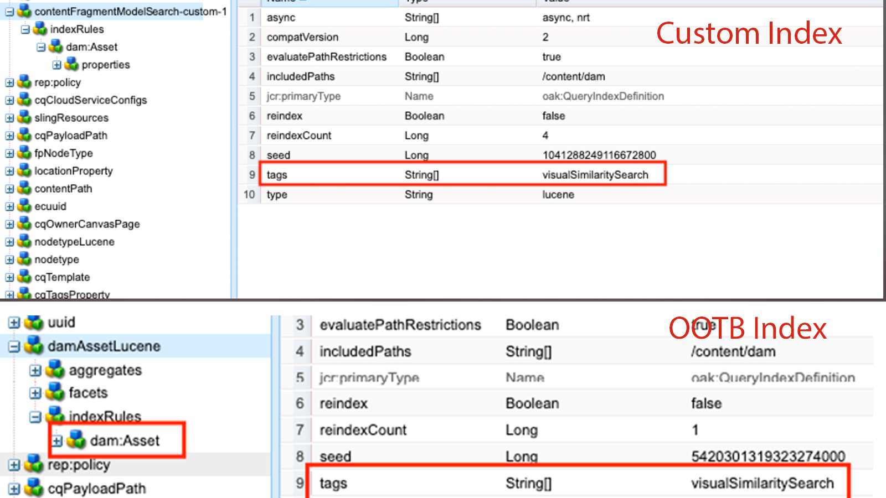
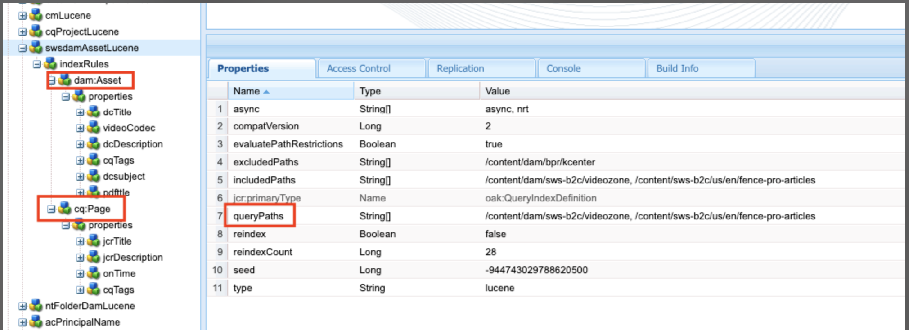

# 在AEM中索引最佳实践

了解如何在Adobe Experience Manager (AEM)中索引最佳实践。 Apache [Jackrabbit Oak](https://jackrabbit.apache.org/oak/docs/query/query.html) 为AEM中的内容搜索提供支持，以下是要点：

- AEM现成提供各种索引来支持搜索和查询功能，例如 `damAssetLucene`， `cqPageLucene` 等等。
- 所有索引定义都存储在下的存储库中 `/oak:index` 节点。
- AEMas a Cloud Service仅支持Oak Lucene索引。
- 索引配置应在AEM项目代码库中管理，并使用Cloud Manager CI/CD管道进行部署。
- 如果给定查询有多个索引可用，则 **使用估计成本最低的索引**.
- 如果给定的查询没有可用的索引，则会遍历内容树以查找匹配的内容。 但是，默认限制来自 `org.apache.jackrabbit.oak.query.QueryEngineSettingsService` 是只遍历10,0000个节点。
- 查询的结果为 **最后已筛选** 以确保当前用户具有读取权限。 这意味着查询结果可能小于索引节点数。
- 在索引定义更改后重新索引存储库需要时间，这取决于存储库的大小。

要拥有高效、正确的搜索功能且不会影响AEM实例的性能，请务必了解索引最佳实践。

## 自定义与OOTB索引

有时，必须创建自定义索引来支持您的搜索要求。 但是，在创建自定义索引之前，请遵循以下准则：

- 了解搜索要求，并检查OOTB索引是否支持搜索要求。 使用 **查询性能工具**，位于 [本地SDK](http://localhost:4502/libs/granite/operations/content/diagnosistools/queryPerformance.html) 和AEM CS通过开发人员控制台或 `https://author-pXXXX-eYYYY.adobeaemcloud.com/ui#/aem/libs/granite/operations/content/diagnosistools/queryPerformance.html?appId=aemshell`.

- 定义最佳查询，使用 [优化查询](https://experienceleague.adobe.com/docs/experience-manager-cloud-service/content/operations/query-and-indexing-best-practices.html?#optimizing-queries) 流程图和 [JCR查询备忘单](https://experienceleague.adobe.com/docs/experience-manager-65/assets/JCR_query_cheatsheet-v1.1.pdf?lang=en) 以供参考。

- 如果OOTB索引不支持搜索要求，您有两个选择。 但是，请查看 [创建高效索引的提示](https://experienceleague.adobe.com/docs/experience-manager-65/content/implementing/deploying/practices/best-practices-for-queries-and-indexing.html?#should-i-create-an-index)
   - 自定义OOTB索引：首选选项，因为它易于维护和升级。
   - 完全自定义索引：仅当上述选项无效时。

### 自定义OOTB索引

- 在 **AEMCS**，在自定义OOTB索引时使用 **\&lt;ootbindexname>-\&lt;productversion>-custom-\&lt;customversion>** 命名约定。 例如， `cqPageLucene-custom-1` 或 `damAssetLucene-8-custom-1`. 这有助于在更新OOTB索引时合并自定义索引定义。 请参阅 [对开箱即用索引的更改](https://experienceleague.adobe.com/docs/experience-manager-cloud-service/content/operations/indexing.html?#changes-to-out-of-the-box-indexes) 以了解更多详细信息。

- 在 **AEM 6.X**，上述命名 _不起作用_，但只需使用 `indexRules` 节点。

- 始终使用CRX DE包管理器(/crx/packmgr/)从AEM实例复制最新的OOTB索引定义，对其进行重命名并在XML文件中添加自定义项。

- 将索引定义存储到AEM项目，位于 `ui.apps/src/main/content/jcr_root/_oak_index` 并使用Cloud Manager CI/CD管道部署它。 请参阅 [部署自定义索引定义](https://experienceleague.adobe.com/docs/experience-manager-cloud-service/content/operations/indexing.html?#deploying-custom-index-definitions) 以了解更多详细信息。

### 完全自定义索引

创建完全自定义索引必须是您的最后一个选项，并且前提是上述选项不起作用。

- 创建完全自定义索引时，使用 **\&lt;prefix>.\&lt;customindexname>-\&lt;version>-custom-\&lt;customversion>** 命名约定。 例如，`wknd.adventures-1-custom-1`。这有助于避免命名冲突。 此处， `wknd` 是前缀和 `adventures` 是自定义索引名称。 此约定适用于AEM 6.X和AEMCS，并有助于为将来迁移到AEMCS做好准备。

- AEMCS仅支持Lucene索引，因此为了准备将来迁移到AEMCS，请始终使用Lucene索引。 请参阅 [Lucene索引与属性索引](https://experienceleague.adobe.com/docs/experience-manager-65/content/implementing/deploying/practices/best-practices-for-queries-and-indexing.html?#lucene-or-property-indexes) 以了解更多详细信息。

- 避免在与OOTB索引相同的节点类型上创建自定义索引。 请改为使用以下内容自定义OOTB索引： `indexRules` 节点。 例如，请勿在 `dam:Asset` 节点类型但自定义OOTB `damAssetLucene` 索引。 _它一直是性能和功能问题的常见根本原因_.

- 此外，请避免添加多个节点类型，例如 `cq:Page` 和 `cq:Tag` 在索引规则下(`indexRules`)节点。 相反，请为每个节点类型创建单独的索引。

- 如上节所述，将索引定义存储在AEM项目的 `ui.apps/src/main/content/jcr_root/_oak_index` 并使用Cloud Manager CI/CD管道部署它。 请参阅 [部署自定义索引定义](https://experienceleague.adobe.com/docs/experience-manager-cloud-service/content/operations/indexing.html?#deploying-custom-index-definitions) 以了解更多详细信息。

- 索引定义准则为：
   - 节点类型(`jcr:primaryType`)应为 `oak:QueryIndexDefinition`
   - 索引类型(`type`)应为 `lucene`
   - 异步属性(`async`)应为 `async,nrt`
   - 使用 `includedPaths` 并避免 `excludedPaths` 属性。 始终设置 `queryPaths` 值与的值相同 `includedPaths` 值。
   - 要强制实施路径限制，请使用 `evaluatePathRestrictions` 属性并将其设置为 `true`.
   - 使用 `tags` 属性以标记索引，在查询时指定此标记值以使用索引。 一般查询语法为 `<query> option(index tag <tagName>)`.

  ```xml
  /oak:index/wknd.adventures-1-custom-1
      - jcr:primaryType = "oak:QueryIndexDefinition"
      - type = "lucene"
      - compatVersion = 2
      - async = ["async", "nrt"]
      - includedPaths = ["/content/wknd"]
      - queryPaths = ["/content/wknd"]
      - evaluatePathRestrictions = true
      - tags = ["customAdvSearch"]
  ...
  ```

### 示例

要了解最佳实践，请查看几个示例。

#### 标记属性的使用不当

下图显示了自定义和OOTB索引定义，突出显示 `tags` 属性，两个索引使用相同的 `visualSimilaritySearch` 值。



##### 分析

这是不当使用 `tags` 属性。 Oak查询引擎在OOTB索引上选取自定义索引，因为这样估计的成本最低。

正确的方法是自定义OOTB索引并在 `indexRules` 节点。 请参阅 [自定义OOTB索引](#customize-the-ootb-index) 以了解更多详细信息。

#### 索引位置 `dam:Asset` 节点类型

下图显示了 `dam:Asset` 具有的节点类型 `includedPaths` 属性设置为特定路径。


##### 分析

如果对资产执行Omnisearch，它将返回错误结果，因为自定义索引的估计成本较低。

请勿在上创建自定义索引 `dam:Asset` 节点类型但自定义OOTB `damAssetLucene` 索引中其他属性 `indexRules` 节点。

#### 索引规则下的多个节点类型

下图显示具有多个节点类型的自定义索引 `indexRules` 节点。



##### 分析

不建议在单个索引中添加多个节点类型，但是，如果节点类型密切相关(例如， `cq:Page` 和 `cq:PageContent`.

一个有效的解决方案是自定义OOTB `cqPageLucene` 和 `damAssetLucene` 索引，在现有 `indexRules` 节点。

#### 缺席 `queryPaths` 属性

下图显示了自定义索引（也不遵循命名约定），但 `queryPaths` 属性。


##### 分析

始终设置 `queryPaths` 值与的值相同 `includedPaths` 值。 此外，要强制实施路径限制，请设置 `evaluatePathRestrictions` 属性至 `true`.

#### 使用索引标记进行查询

下图显示了自定义索引 `tags` 属性，以及如何在查询时使用它。


```
/jcr:root/content/dam//element(*,dam:Asset)[(jcr:content/@contentFragment = 'true' and jcr:contains(., '/content/sitebuilder/test/mysite/live/ja-jp/mypage'))]order by @jcr:created descending option (index tag assetPrefixNodeNameSearch)
```

##### 分析

演示如何设置无冲突且正确无误 `tags` 索引上的属性值，并在查询时使用它。 一般查询语法为 `<query> option(index tag <tagName>)`. 另请参阅 [查询选项索引标记](https://jackrabbit.apache.org/oak/docs/query/query-engine.html#query-option-index-tag)

#### 自定义索引

下图显示了自定义索引 `suggestion` 节点来实现高级搜索功能。


##### 分析

为创建自定义索引是有效的用例 [高级搜索](https://jackrabbit.apache.org/oak/docs/query/lucene.html#advanced-search-features) 功能。 但是，索引名称应跟在 **\&lt;prefix>.\&lt;customindexname>-\&lt;version>-custom-\&lt;customversion>** 命名约定。


## 实用工具

让我们看一看能够帮助您定义、分析和优化索引的少数工具。

### 索引创建工具

此 [Oak索引定义生成器](https://oakutils.appspot.com/generate/index) 工具有帮助 **生成索引定义** 基于输入查询。 这是创建自定义索引的良好起点。

### 分析索引工具

此 [索引定义分析器](https://oakutils.appspot.com/analyze/index) 工具有帮助 **分析索引定义** 并提供了改进索引定义的建议。

### 查询性能工具

OOTB _查询性能工具_ 可用位置 [本地SDK](http://localhost:4502/libs/granite/operations/content/diagnosistools/queryPerformance.html) 和AEM CS通过开发人员控制台或 `https://author-pXXXX-eYYYY.adobeaemcloud.com/ui#/aem/libs/granite/operations/content/diagnosistools/queryPerformance.html?appId=aemshell` 帮助 **分析查询性能** 和 [JCR查询备忘单](https://experienceleague.adobe.com/docs/experience-manager-65/assets/JCR_query_cheatsheet-v1.1.pdf?lang=en) 以定义最佳查询。

### 疑难解答工具和提示

以下大多数适用于AEM 6.X和本地故障排除。

- 索引管理器位于 `http://host:port/libs/granite/operations/content/diagnosistools/indexManager.html` 用于获取索引信息，如类型、上次更新时间和大小。

- 详细记录Oak查询和与索引相关的Java™包，如 `org.apache.jackrabbit.oak.plugins.index`， `org.apache.jackrabbit.oak.query`、和 `com.day.cq.search` via `http://host:port/system/console/slinglog` 以进行疑难解答。

- 的JMX MBean _IndexStat_ 类型位于 `http://host:port/system/console/jmx` 用于获取与异步索引相关的索引信息，如状态、进度或统计信息。 它还提供 _FailingIndexStats_，如果此处没有结果，则表示没有索引损坏。 AsyncIndexerService将任何更新失败30分钟（可配置）的索引标记为已损坏，并停止对其进行索引。 如果查询没有提供预期的结果，开发人员在继续重新索引之前查看此内容会很有帮助，因为重新索引在计算上成本较高且耗时。

- 的JMX MBean _LuceneIndex_ 类型位于 `http://host:port/system/console/jmx` 用于Lucene索引统计数据，如大小、每个索引定义的文档数。

- 的JMX MBean _QueryStat_ 类型位于 `http://host:port/system/console/jmx` 用于Oak查询统计数据，包括慢速查询和常用查询，详细信息如查询、执行时间。

## 其他资源

有关更多信息，请参阅以下文档：

- [Oak查询和索引](https://experienceleague.adobe.com/docs/experience-manager-65/content/implementing/deploying/deploying/queries-and-indexing.html)
- [查询和索引最佳实践](https://experienceleague.adobe.com/docs/experience-manager-cloud-service/content/operations/query-and-indexing-best-practices.html)
- [有关查询和索引的最佳实践](https://experienceleague.adobe.com/docs/experience-manager-65/content/implementing/deploying/practices/best-practices-for-queries-and-indexing.html)
