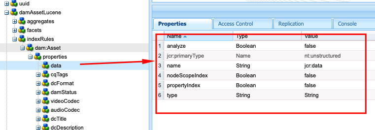

# 在AEM中索引最佳实践

了解如何在Adobe Experience Manager (AEM)中索引最佳实践。 Apache [Jackrabbit Oak](https://jackrabbit.apache.org/oak/docs/query/query.html)为AEM中的内容搜索提供支持，以下是关键点：

- AEM开箱即用地提供各种索引来支持搜索和查询功能，例如`damAssetLucene`、`cqPageLucene`等。
- 所有索引定义都存储在`/oak:index`节点下的存储库中。
- AEM as a Cloud Service仅支持Oak Lucene索引。
- 索引配置应在AEM项目代码库中进行管理，并使用Cloud Manager CI/CD管道进行部署。
- 如果给定查询有多个索引可用，则使用估计开销最低的&#x200B;**索引**。
- 如果给定的查询没有可用的索引，则会遍历内容树以查找匹配的内容。 但是，通过`org.apache.jackrabbit.oak.query.QueryEngineSettingsService`的默认限制是仅遍历100,000个节点。
- 查询结果最后&#x200B;**被**&#x200B;过滤，以确保当前用户具有读取权限。 这意味着查询结果可能小于索引节点数。
- 在索引定义更改后重新索引存储库需要时间，这取决于存储库的大小。

要拥有高效、正确的搜索功能且不会影响AEM实例的性能，请务必了解索引最佳实践。

## 自定义与OOTB索引

有时，必须创建自定义索引来支持您的搜索要求。 但是，在创建自定义索引之前，请遵循以下准则：

- 了解搜索要求，并检查OOTB索引是否支持搜索要求。 通过Developer Console或&#x200B;**使用**&#x200B;查询性能工具[，该工具位于](http://localhost:4502/libs/granite/operations/content/diagnosistools/queryPerformance.html)本地SDK`https://author-pXXXX-eYYYY.adobeaemcloud.com/ui#/aem/libs/granite/operations/content/diagnosistools/queryPerformance.html?appId=aemshell`和AEMCS。

- 定义最佳查询，使用[优化查询](https://experienceleague.adobe.com/zh-hans/docs/experience-manager-cloud-service/content/operations/query-and-indexing-best-practices)流程图和[JCR查询备忘表](https://experienceleague.adobe.com/docs/experience-manager-65/assets/JCR_query_cheatsheet-v1.1.pdf?lang=zh-Hans)以供参考。

- 如果OOTB索引不支持搜索要求，您有两个选择。 但是，查看有关创建有效索引的[提示](https://experienceleague.adobe.com/zh-hans/docs/experience-manager-65/content/implementing/deploying/practices/best-practices-for-queries-and-indexing)
   - 自定义OOTB索引：首选选项，因为它易于维护和升级。
   - 完全自定义索引：仅当上述选项无效时。

### 自定义OOTB索引

- 在&#x200B;**AEMCS**&#x200B;中，当自定义OOTB索引时，使用&#x200B;**\&lt;OOTBIndexName>-\&lt;productVersion>-custom-\&lt;customVersion>**&#x200B;命名约定。 例如，`cqPageLucene-custom-1`或`damAssetLucene-8-custom-1`。 这有助于在更新OOTB索引时合并自定义索引定义。 有关更多详细信息，请参阅[对现成索引的更改](https://experienceleague.adobe.com/zh-hans/docs/experience-manager-cloud-service/content/operations/indexing)。

- 在&#x200B;**AEM 6.X**&#x200B;中，上述命名&#x200B;_不起作用_，只是在`indexRules`节点中使用必要的属性更新OOTB索引即可。

- 始终使用CRX DE包管理器(/crx/packmgr/)从AEM实例复制最新的OOTB索引定义，对其进行重命名并在XML文件中添加自定义项。

- 将索引定义存储在`ui.apps/src/main/content/jcr_root/_oak_index`的AEM项目中，并使用Cloud Manager CI/CD管道进行部署。 有关详细信息，请参阅[部署自定义索引定义](https://experienceleague.adobe.com/zh-hans/docs/experience-manager-cloud-service/content/operations/indexing)。

### 完全自定义索引

创建完全自定义索引必须是您的最后一个选项，并且前提是上述选项不起作用。

- 创建完全自定义索引时，请使用&#x200B;**\&lt;前缀>。\&lt;customIndexName>-\&lt;version>-custom-\&lt;customVersion>**&#x200B;命名约定。 例如，`wknd.adventures-1-custom-1`。这有助于避免命名冲突。 其中，`wknd`是前缀，`adventures`是自定义索引名称。 此约定适用于AEM 6.X和AEMCS，并有助于为将来迁移到AEMCS做好准备。

- AEMCS仅支持Lucene索引，因此为了准备将来迁移到AEMCS，请始终使用Lucene索引。 有关详细信息，请参阅[Lucene索引与属性索引](https://experienceleague.adobe.com/zh-hans/docs/experience-manager-65/content/implementing/deploying/practices/best-practices-for-queries-and-indexing)。

- 避免在与OOTB索引相同的节点类型上创建自定义索引。 请改为使用`indexRules`节点中的必要属性自定义OOTB索引。 例如，不要在`dam:Asset`节点类型上创建自定义索引，而是自定义OOTB `damAssetLucene`索引。 _这是导致性能和功能问题的常见根本原因_。

- 另外，避免在索引规则(`cq:Page`)节点下添加多个节点类型，例如`cq:Tag`和`indexRules`。 相反，请为每个节点类型创建单独的索引。

- 如上节所述，将索引定义存储在`ui.apps/src/main/content/jcr_root/_oak_index`的AEM项目中，并使用Cloud Manager CI/CD管道进行部署。 有关详细信息，请参阅[部署自定义索引定义](https://experienceleague.adobe.com/zh-hans/docs/experience-manager-cloud-service/content/operations/indexing)。

- 索引定义准则为：
   - 节点类型(`jcr:primaryType`)应为`oak:QueryIndexDefinition`
   - 索引类型(`type`)应为`lucene`
   - 异步属性(`async`)应为`async,nrt`
   - 使用`includedPaths`并避免`excludedPaths`属性。 始终将`queryPaths`值设置为与`includedPaths`值相同的值。
   - 要强制实施路径限制，请使用`evaluatePathRestrictions`属性并将其设置为`true`。
   - 使用`tags`属性标记索引，并在查询时指定此标记值以使用索引。 常规查询语法为`<query> option(index tag <tagName>)`。

  ```xml
  /oak:index/wknd.adventures-1-custom-1
      - jcr:primaryType = "oak:QueryIndexDefinition"
      - type = "lucene"
      - compatVersion = 2
      - async = ["async", "nrt"]
      - includedPaths = ["/content/wknd"]
      - queryPaths = ["/content/wknd"]
      - evaluatePathRestrictions = true
      - tags = ["customAdvSearch"]
  ...
  ```

### 示例

要了解最佳实践，请查看几个示例。

#### 标记属性的使用不当

下图显示了自定义和OOTB索引定义，突出显示`tags`属性，两个索引使用相同的`visualSimilaritySearch`值。


##### 分析

这是对自定义索引的`tags`属性的不正确使用。 Oak查询引擎在OOTB索引上选取自定义索引，这样估计的成本最低。

正确的方法是自定义OOTB索引并在`indexRules`节点中添加必要的属性。 有关详细信息，请参阅[自定义OOTB索引](#customize-the-ootb-index)。

#### `dam:Asset`节点类型上的索引

下图显示了`dam:Asset`节点类型的自定义索引，其中`includedPaths`属性设置为特定路径。


##### 分析

如果在Assets上执行Omnisearch，它返回错误的结果，这是因为自定义索引的估计成本较低。

不要在`dam:Asset`节点类型上创建自定义索引，而是使用`damAssetLucene`节点中的必要属性自定义OOTB `indexRules`索引。

#### 索引规则下的多个节点类型

下图显示了`indexRules`节点下具有多个节点类型的自定义索引。

在索引规则下

##### 分析

不建议在单个索引中添加多个节点类型，但是，如果节点类型紧密相关（例如`cq:Page`和`cq:PageContent`），则可以在同一索引中索引节点类型。

有效的解决方案是自定义OOTB `cqPageLucene`和`damAssetLucene`索引，在现有`indexRules`节点下添加必要的属性。

#### 缺少`queryPaths`属性

下图显示没有`queryPaths`属性的自定义索引（也不遵循命名约定）。


##### 分析

始终将`queryPaths`值设置为与`includedPaths`值相同的值。 此外，要强制实施路径限制，请将`evaluatePathRestrictions`属性设置为`true`。

#### 使用索引标记进行查询

下图显示了具有`tags`属性的自定义索引以及查询时如何使用该索引。


```
/jcr:root/content/dam//element(*,dam:Asset)[(jcr:content/@contentFragment = 'true' and jcr:contains(., '/content/sitebuilder/test/mysite/live/ja-jp/mypage'))]order by @jcr:created descending option (index tag assetPrefixNodeNameSearch)
```

##### 分析

演示如何在索引上设置无冲突并更正`tags`属性值，并在查询时使用它。 常规查询语法为`<query> option(index tag <tagName>)`。 另请参阅[查询选项索引标记](https://jackrabbit.apache.org/oak/docs/query/query-engine.html#query-option-index-tag)

#### 自定义索引

下图显示了用于实现高级搜索功能的自定义索引（包含`suggestion`节点）。


##### 分析

为[高级搜索](https://jackrabbit.apache.org/oak/docs/query/lucene.html#advanced-search-features)功能创建自定义索引是有效的用例。 但是，索引名称应跟在&#x200B;**\&lt;prefix>之后。\&lt;customIndexName>-\&lt;version>-custom-\&lt;customVersion>**&#x200B;命名约定。

## 通过禁用Apache Tika进行索引优化

AEM使用[Apache Tika](https://tika.apache.org/)从文件&#x200B;_类型(如PDF、Word、Excel等)提取元数据和文本内容_。 提取的内容存储在存储库中，并按Oak Lucene索引编制索引。

有时，用户不需要在文件/资源的内容中搜索的能力，在这种情况下，您可以通过禁用Apache Tika来提高索引性能。 其优点是：

- 更快的索引
- 索引大小缩减
- 更少的硬件使用

>[!CAUTION]
>
>在禁用Apache Tika之前，请确保搜索要求不要求在资产内容中搜索的功能。


### 按MIME类型禁用

要按mime类型禁用Apache Tika，请执行以下步骤：

- 在自定义或OOBT索引定义下添加`tika`类型的`nt:unstructured`节点。 在以下示例中，对OOTB `damAssetLucene`索引禁用了PDF MIME类型。

```xml
/oak:index/damAssetLucene
    - jcr:primaryType = "oak:QueryIndexDefinition"
    - type = "lucene"
    ...
    <tika jcr:primaryType="nt:unstructured">
        <config.xml/>
    </tika>
```

- 在`config.xml`节点下添加包含以下详细信息的`tika`。

```xml
<properties>
  <parsers>
    <parser class="org.apache.tika.parser.EmptyParser">
      <mime>application/pdf</mime>
      <!-- Add more mime types to disable -->
  </parsers>
</properties>
```

- 要刷新存储的索引，请在索引定义节点下将`refresh`属性设置为`true`，有关详细信息，请参阅[索引定义属性](https://jackrabbit.apache.org/oak/docs/query/lucene.html#index-definition:~:text=Defaults%20to%2010000-,refresh,-Optional%20boolean%20property)。

下图显示了包含`damAssetLucene`节点和`tika`文件的OOTB `config.xml`索引，该文件禁用了PDF和其他mime类型。

具有tika节点的

### 完全禁用

要完全禁用Apache Tika，请执行以下步骤：

- 在`includePropertyTypes`处添加`/oak:index/<INDEX-NAME>/indexRules/<NODE-TYPE>`属性并将值设置为`String`。 例如，在下图中，为OOBT `includePropertyTypes`索引的`dam:Asset`节点类型添加了`damAssetLucene`属性。


- 在`data`节点下添加具有以下属性的`properties`，确保它是属性定义上方的第一个节点。 例如，请参阅以下图像：

```xml
/oak:index/<INDEX-NAME>/indexRules/<NODE-TYPE>/properties/data
    - jcr:primaryType = "nt:unstructured"
    - type = "String"
    - name = "jcr:data"
    - nodeScopeIndex = false
    - propertyIndex = false
    - analyze = false
```



- 通过在索引定义节点下将`reindex`属性设置为`true`来重新索引更新的索引定义。

## 实用工具

让我们看一看能够帮助您定义、分析和优化索引的少数工具。

### 索引创建工具

[Oak索引定义生成器](https://oakutils.appspot.com/generate/index)工具可帮助&#x200B;**基于输入查询生成索引定义**。 这是创建自定义索引的良好起点。

### 分析索引工具

[索引定义分析器](https://oakutils.appspot.com/analyze/index)工具可帮助&#x200B;**分析索引定义**&#x200B;并提供改进索引定义的建议。

### 查询性能工具

通过Developer Console或&#x200B;_在_&#x200B;本地SDK[和AEMCS上提供的OOTB ](http://localhost:4502/libs/granite/operations/content/diagnosistools/queryPerformance.html)查询性能工具`https://author-pXXXX-eYYYY.adobeaemcloud.com/ui#/aem/libs/granite/operations/content/diagnosistools/queryPerformance.html?appId=aemshell`可帮助&#x200B;**分析查询性能**&#x200B;和[JCR查询备忘表](https://experienceleague.adobe.com/docs/experience-manager-65/assets/JCR_query_cheatsheet-v1.1.pdf?lang=zh-Hans)以定义最佳查询。

### 疑难解答工具和提示

以下大多数适用于AEM 6.X和本地故障排除。

- `http://host:port/libs/granite/operations/content/diagnosistools/indexManager.html`上可用于获取索引信息（如类型、上次更新时间和大小）的索引管理器。

- 通过`org.apache.jackrabbit.oak.plugins.index`详细记录Oak查询和索引相关的Java™包（如`org.apache.jackrabbit.oak.query`、`com.day.cq.search`和`http://host:port/system/console/slinglog`）以进行疑难解答。

- _IndexStats_&#x200B;类型的JMX MBean可在`http://host:port/system/console/jmx`处使用，以获取与异步索引相关的索引信息，如状态、进度或统计信息。 它还提供了&#x200B;_FailingIndexStats_，如果此处没有结果，则表示没有索引损坏。 AsyncIndexerService将任何更新失败30分钟（可配置）的索引标记为已损坏，并停止对其进行索引。 如果查询没有提供预期的结果，开发人员在继续重新索引之前查看此内容会很有帮助，因为重新索引在计算上成本较高且耗时。

- _LuceneIndex_&#x200B;类型的JMX MBean在`http://host:port/system/console/jmx`可用于Lucene索引统计数据，如大小、每个索引定义的文档数。

- 在&#x200B;_上为Oak查询统计信息提供了_ QueryStat`http://host:port/system/console/jmx`类型的JMX MBean，该查询统计信息包括包含查询、执行时间等详细信息的慢速查询和常用查询。

## 其他资源

有关更多信息，请参阅以下文档：

- [Oak查询和索引](https://experienceleague.adobe.com/zh-hans/docs/experience-manager-65/content/implementing/deploying/deploying/queries-and-indexing)
- [查询和索引最佳实践](https://experienceleague.adobe.com/zh-hans/docs/experience-manager-cloud-service/content/operations/query-and-indexing-best-practices)
- [查询和索引的最佳实践](https://experienceleague.adobe.com/zh-hans/docs/experience-manager-65/content/implementing/deploying/practices/best-practices-for-queries-and-indexing)

