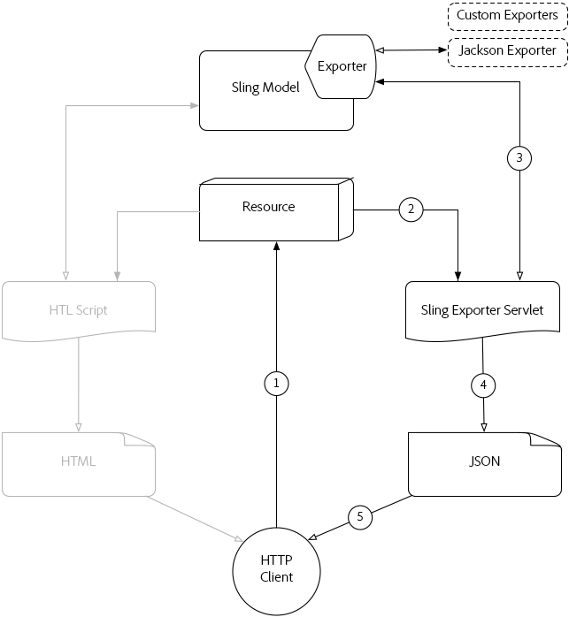

# 了解 [!DNL Sling Model Exporter]

Apache [!DNL Sling Models] 1.3.0引入 [!DNL Sling Model Exporter]，一种导出或序列化的优雅方式 [!DNL Sling Model] 对象转换为自定义抽象。 本文并列了传统使用案例 [!DNL Sling Models] 以利用 [!DNL Sling Model Exporter] 序列化框架 [!DNL Sling Model] 到JSON中。

## 传统Sling模型HTTP请求流程

传统用例 [!DNL Sling Models] 是为资源或请求提供业务抽象，它为HTL脚本（或以前的JSP）提供用于访问业务函数的接口。

共同模式正在形成 [!DNL Sling Models] 表示AEM组件或页面，并使用 [!DNL Sling Model] 对象，用于向HTL脚本提供数据，且HTML的结束结果显示在浏览器中。

### Sling模型HTTP请求流程

1. [!DNL HTTP GET] 在AEM中请求资源。

   示例: `HTTP GET /content/my-resource.html`

1. 基于请求资源的 `sling:resourceType`，则会解析相应的脚本。

1. 脚本会根据需要调整请求或资源 [!DNL Sling Model].

1. 脚本使用 [!DNL Sling Model] 对象来生成HTML呈现版本。

1. 脚本生成的HTML在HTTP响应中返回。

这种传统模式在生成HTML为 [!DNL Sling Model] 可以通过HTL轻松利用。 创建更结构化的数据（如JSON或XML）是一项更为繁琐的工作，因为HTL并不自然地适合这些格式的定义。

## [!DNL Sling Model Exporter] HTTP请求流程

Apache [!DNL Sling Model Exporter] 附带一个Sling，Jackson Exporter提供自动序列化“普通” [!DNL Sling Model] 对象。 Jackson导出程序虽然可以进行配置，但其核心是检查 [!DNL Sling Model] 对象，并使用任何“getter”方法（作为JSON键）生成JSON，而getter返回值（作为JSON值）。

直接序列化 [!DNL Sling Models] 允许他们通过使用传统方法创建的HTML响应来为普通Web请求提供服务 [!DNL Sling Model] 请求流程（请参阅上文），但也会显示Web服务或JavaScript应用程序可使用的JSON演绎版。

*此流描述使用提供的Jackson导出程序生成JSON输出的流。 自定义导出程序的使用遵循相同的流程，但其输出格式相同。*

1. 在AEM中为资源发出HTTPGET请求，该资源的选择器和扩展已在中注册 [!DNL Sling Model]的导出程序。

   示例: `HTTP GET /content/my-resource.model.json`

1. Sling解析请求的资源的 `sling:resourceType`、选择器和扩展，以及动态生成的Sling导出程序Servlet，该Servlet已映射到 [!DNL Sling Model] 与导出程序。
1. 已解析的Sling导出程序Servlet将调用 [!DNL Sling Model Exporter] 反对 [!DNL Sling Model] 根据请求或资源调整的对象（由Sling模型适配器确定）。
1. 导出程序会序列化 [!DNL Sling Model] 基于导出器选项和特定于导出器的Sling模型批注，并将结果返回给Sling导出器Servlet。
1. Sling导出程序Servlet返回 [!DNL Sling Model] 在HTTP响应中。

>[!NOTE]
>
>而Apache Sling项目会提供可序列化的Jackson导出程序 [!DNL Sling Models] 对于JSON，导出程序框架还支持自定义导出程序。 例如，项目可以实施可序列化 [!DNL Sling Model] 到XML中。

>[!NOTE]
>
>不仅如此 [!DNL Sling Model Exporter] *序列化* [!DNL Sling Models]，也可以将它们导出为Java对象。 导出到其他Java对象在HTTP请求流中不起作用，因此不会显示在上图中。

## 辅助材料

* [Apache [!DNL Sling Model Exporter] 框架文档](https://sling.apache.org/documentation/bundles/models.html#exporter-framework-since-130)
