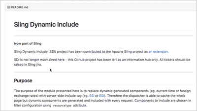

# AEM Foundation视频和教程 {#overview}

Adobe Experience Manager为AEM Sites、资产和Forms的用户提供了一组通用功能。

## 新增功能

* **[使用工作流AEM（视频）](./workflow/use-workflow.md)**

   *AEM工作流提供了一种在AEM中协作、管理和处理内容的方式。*

* **[了解Cloud Manager for AEM（视频）](./cloud-manager/understand-cloud-manager-for-aem.md)**\
   *AEM版Cloud Manager允许轻松管理、检查和自助服务AEM环境。*

* **[使用Cloud Manager CI/CD管线（视频）](./cloud-manager/use-the-cicd-pipeline-in-cloud-manager-for-aem.md)**\
   *了解如何使用Cloud Manager的CI/CD管道来确保部署安全一致。*

## 员工挑选

<table>
<tr>
  <td>
    
    

     <a href="./cloud-manager/understand-cloud-manager-for-aem.md">
    <strong>了解Cloud Manager for AEM</strong>
    </a>
    

    

    <em>Cloud Manager for AEM提供了一个简单而强大的解决方案，允许轻松管理、检查和自助服务AEM环境。</em>
    

  </td>
   <td>
    
     

     <a href="./development/set-up-sling-dynamic-include.md">
    <strong>设置Sling动态包含(SDI)</strong>
    </a>
    

    

    <em>了解如何设置Sling动态包含(SDI)并允许动态AEM组件始终提供新内容。</em>
    

  </td>
  <td>
    
    

    <a href="./administration/understand-reasons-to-upgrade.md">
    <strong>了解升级AEM的原因</strong>
    </a>
    

    

    <em>在考虑升级到最新版本的AEM时，简要列出要了解的主要功能。</em>
    

  </td>
</tr>
</table>

## 其他资源

* [AEMas a Cloud Service教程](/help/cloud-service/overview.md)
* [AEM Sites视频和教程](/help/sites/overview.md)
* [AEM Assets视频和教程](/help/assets/overview.md)
* [AEM Forms视频和教程](/help/forms/overview.md)
