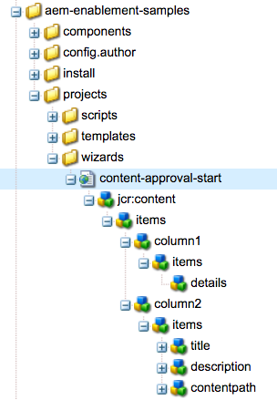

# 在AEM中开发项目

这是一个开发教程，它说明了如何为进行开发 [!DNL AEM Projects]。  在本教程中，我们将创建一个自定义项目模板，它可用于在AEM内创建新项目，以管理内容创作工作流和任务。

>[!VIDEO](https://video.tv.adobe.com/v/16904/?quality=12&learn=on)

*此视频简要介绍了在以下教程中创建的已完成工作流。*

## 简介 {#introduction}

[[!DNL AEM项目]是AEM的一项功能](https://helpx.adobe.com/experience-manager/6-5/sites/authoring/using/projects.html) ，旨在简化与内容创建相关的所有工作流和任务的管理和分组，作为AEM Sites或资产实施的一部分。

AEM Projects附带几个 [OOTB项目模板](https://helpx.adobe.com/experience-manager/6-5/sites/authoring/using/projects.html#ProjectTemplates)。 创建新项目时，作者可以从这些可用模板中进行选择。 具有独特业务需求的大型AEM实施将希望创建定制的项目模板，以满足其需求。 通过创建自定义项目模板，开发人员可以配置项目仪表板、与自定义工作流挂钩，以及为项目创建其他业务角色。 我们将查看项目模板的结构并创建示例模板。


## 设置

本教程将逐步介绍创建自定义项目模板所需的代码。 您可以将附加的包 [下载并安装](./assets/develop-aem-projects/projects-tasks-guide.ui.apps-0.0.1-SNAPSHOT.zip) 到本地环境，以便与教程一起学习。 您还可以访问托管在GitHub上的完整Maven [项目](https://github.com/Adobe-Marketing-Cloud/aem-guides/tree/feature/projects-tasks-guide)。

* [完成的教程包](./assets/develop-aem-projects/projects-tasks-guide.ui.apps-0.0.1-SNAPSHOT.zip)
* [GitHub上的完整代码存储库](https://github.com/Adobe-Marketing-Cloud/aem-guides/tree/feature/projects-tasks-guide)

本教程假定您对AEM开发实践 [有一些基本知](https://helpx.adobe.com/experience-manager/6-5/sites/developing/using/the-basics.html) 识，并且对AEM [Maven项目设置有一定的熟悉](https://helpx.adobe.com/experience-manager/6-5/sites/developing/using/ht-projects-maven.html)。 所有提及的代码都将用作引用，并且只应部署到本地 [开发AEM实例](https://helpx.adobe.com/experience-manager/6-5/sites/deploying/using/deploy.html#GettingStarted)。

## 项目模板的结构

项目模板应置于源代码控制下，并应位于/apps下的应用程序文件夹下。 理想情况下，应将它们放置在子文件夹中，其命名约 **定为*/projects/templates/**&lt;my-template>。 通过遵循此命名规范，作者在创建项目时会自动使用任何新的自定义模板。 可用项目模板的配置设置为： **/content/projects/jcr:content** node by **cq:allowedTemplates** property 默认情况下，这是常规表达式: **/(apps|libs)/。*/projects/templates/.***

项目模板的根节点将具有 **jcr:primaryType** **cq:Template**。 在其根节点下有3个节点： **小工具**、 **角色**&#x200B;和 **工作流**。 这些节点都是 **nt:unstructured**。 根节点下方也可以是在“创建项目”向导中选择模板时显示的thumbnail.png文件。

完整节点结构：

```shell
/apps/<my-app>
    + projects (nt:folder)
         + templates (nt:folder)
              + <project-template-root> (cq:Template)
                   + gadgets (nt:unstructured)
                   + roles (nt:unstructured)
                   + workflows (nt:unstructured)
```

### 项目模板根

项目模板的根节点的类型将 **为cq:Template**。 在此节点上，您可以配 **置将在创建项** 目向导中显示的 **jcr** :title和jcr:description属性。 还有一个名为向导 **的属性** ，该属性指向将填充项目属性的表单。 默认值为： **/libs/cq/core/content/projects/wizard/steps/defaultproject.html在** 大多数情况下应能正常工作，因为它允许用户填充基本项目属性并添加用户组成员。

**请注意，创建项目向导不使用SlingPOSTservlet。 而是将值发布到自定义servlet:**com.adobe.cq.projects.impl.servlet.ProjectServlet**。 添加自定义字段时应考虑这一点。*

可以找到翻译项目模板的自定义向导示例： **/libs/cq/core/content/projects/wizard/translationproject/defaultproject**。

### 小工具 {#gadgets}

此节点上没有其他属性，但小工具节点的子项控制在创建新项目时填充项目仪表板的项目拼贴。 [项目拼贴](https://helpx.adobe.com/experience-manager/6-5/sites/authoring/using/projects.html#ProjectTiles) （也称为小工具或窗格）是填充项目工作区的简单卡。 在以下位置可以找到完整的列表ootb拼贴：**/libs/cq/gui/components/projects/admin/pod。 **项目所有者始终可以在创建项目后添加／删除拼贴。

### 角色 {#roles}

每个项目 [有3个默](https://helpx.adobe.com/experience-manager/6-5/sites/authoring/using/projects.html#UserRolesinaProject) 认角色： **观察**&#x200B;者 **、编辑**&#x200B;和 **所有者**。 通过在角色节点下添加子节点，您可以为模板添加其他特定于业务的项目角色。 然后，您可以将这些角色绑定到与项目关联的特定工作流。

### 工作流 {#workflows}

创建自定义项目模板的最诱人的原因之一是，它允许您配置可用工作流以与项目一起使用。 这些工作流可以是OOTB工作流或自定义数据。 在工作流 **节点** 下方，需要有一个模 **型节点** （也是），在 `nt:unstructured`指定可用工作流模型下方的子节点。 属性**modelId **指向/etc/workflow下的工作流模型，属性向导 **指向** 启动工作流时使用的对话框。 项目的一大优势在于能够添加自定义对话框（向导），在工作流的开始捕获业务特定元数据，从而驱动工作流中的进一步操作。

```shell
<projects-template-root> (cq:Template)
    + workflows (nt:unstructured)
         + models (nt:unstructured)
              + <workflow-model> (nt:unstructured)
                   - modelId = points to the workflow model
                   - wizard = dialog used to start the workflow
```

## Creating a project template {#creating-project-template}

由于我们将主要复制／配置节点，因此我们将使用CRXDE Lite。 在您的本地AEM实例中打开 [CRXDE Lite](http://localhost:4502/crx/de/index.jsp)。

1. 开始，方法是在名称下创建新 `/apps/&lt;your-app-folder&gt;` 文件夹 `projects`。 在该名称下方创建另一个文件 `templates`夹。

   ```shell
   /apps/aem-guides/projects-tasks/
                       + projects (nt:folder)
                                + templates (nt:folder)
   ```

1. 为了简化操作，我们将从现有的“简单项目”模板开始我们的自定义模板。

   1. 复制并粘贴在 **步骤1中创建的模板文件夹下的节点** /libs */cq/core/content/projects/templates* /default。

   ```shell
   /apps/aem-guides/projects-tasks/
                + templates (nt:folder)
                     + default (cq:Template)
   ```

1. 您现在应该有一 **个路径，如/apps/aem-guides/projects-任务/projects/templates/authoring-project**。

   1. 将作者 **项目节点的jcr** :title **和jcr:description** 属性编辑为自定义标题和说明值。

      1. 保留指 **向默** 认项目属性的向导属性。

   ```shell
   /apps/aem-guides/projects-tasks/projects/
            + templates (nt:folder)
                 + authoring-project (cq:Template)
                      - jcr:title = "Authoring Project"
                      - jcr:description = "A project to manage approval and publish process for AEM Sites or Assets"
                      - wizard = "/libs/cq/core/content/projects/wizard/steps/defaultproject.html"
   ```

1. 对于此项目模板，我们希望利用任务。
   1. 在authoring-project/ **gadgets(称为** 任务)下添加一个新的nt:unstructured节 **点**。
   1. 为cardWeight **= &quot;100&quot;、** jcr:title **=&quot;任务&quot;和** sling:resourceType ****=&quot;cq/gui/components/projects/admin/pod/taskpod&quot;向任务节点添加字符串属性。

   现在， [默认情况下](https://docs.adobe.com/docs/en/aem/6-3/author/projects.html#Tasks) ，创建新项目时将显示任务拼贴。

   ```shell
   ../projects/templates/authoring-project
       + gadgets (nt:unstructured)
            + team (nt:unstructured)
            + asset (nt:unstructured)
            + work (nt:unstructured)
            + experiences (nt:unstructured)
            + projectinfo (nt:unstructured)
            ..
            + tasks (nt:unstructured)
                 - cardWeight = "100"
                 - jcr:title = "Tasks"
                 - sling:resourceType = "cq/gui/components/projects/admin/pod/taskpod"
   ```

1. 我们将向项目模板添加自定义审批者角色。

   1. 在项目模板（创作项目）节点下，添加一个标 **记为角色的新** nt:unstructured **节点**。
   1. 添加另 **一个nt:** unstructured节点，标签为批准者的节点作为角色节点的子节点。
   1. 添加字符串 **属性jcr:** = &quot;**Approvers**&quot;, **roleclass** =&quot;所有者&#x200B;**ID&quot;,********** roleclassID=&quot;批准者&quot;。
      1. 批准者节点的名称以及jcr:title和roleid可以是任何字符串值（只要roleid是唯一的）。
      1. **角色** 类根据3个OOTB角色(https://docs.adobe.com/docs/en/aem/6-3/author/projects.html#User [项目中的角色])控制为该角色应用的权限： **所有者**、 **编辑者**&#x200B;和观 **察者**。
      1. 一般来说，如果定制角色更像管理角色，则角色类可以是所 **有者；** 如果它是更具体的创作角色（如摄影师或设计人员），则 **编辑** 角色应该足够。 所有者与编辑 **者之** 间的 **最大区别** 在于，项目所有者可以更新项目属性并向项目添加新用户。

   ```shell
   ../projects/templates/authoring-project
       + gadgets (nt:unstructured)
       + roles (nt:unstructured)
           + approvers (nt:unstructured)
                - jcr:title = "Approvers"
                - roleclass = "owner"
                - roleid = "approver"
   ```

1. 通过复制“简单项目”模板，您将配置4个OOTB工作流。 工作流/模型下的每个节点都指向特定工作流和该工作流的开始对话框向导。 在本教程的稍后部分，我们将为此项目创建一个自定义工作流。 目前，请删除工作流／模型下的节点：

   ```shell
   ../projects/templates/authoring-project
       + gadgets (nt:unstructured)
       + roles (nt:unstructured)
       + workflows (nt:unstructured)
            + models (nt:unstructured)
               - (remove ootb models)
   ```

1. 为了使内容作者能够轻松识别项目模板，您可以添加自定义缩略图。 建议大小为319x319像素。
   1. 在CRXDE Lite中，将新文件创建为小工具、角色和工作流节点的同级文件，该节点名 **为thumbnail.png**。
   1. 保存，然后导航到节 `jcr:content` 点并多次，单 `jcr:data` 击属性(避免单击“视图”)。
      1. 这应会通过编辑文件对 `jcr:data` 话框提示您，并可以上传自定义缩略图。

   ```shell
   ../projects/templates/authoring-project
       + gadgets (nt:unstructured)
       + roles (nt:unstructured)
       + workflows (nt:unstructured)
       + thumbnail.png (nt:file)
   ```

项目模板的已完成XML表示：

```xml
<?xml version="1.0" encoding="UTF-8"?>
<jcr:root xmlns:sling="http://sling.apache.org/jcr/sling/1.0" xmlns:cq="http://www.day.com/jcr/cq/1.0" xmlns:jcr="http://www.jcp.org/jcr/1.0" xmlns:nt="http://www.jcp.org/jcr/nt/1.0"
    jcr:description="A project to manage approval and publish process for AEM Sites or Assets"
    jcr:primaryType="cq:Template"
    jcr:title="Authoring Project"
    ranking="{Long}1"
    wizard="/libs/cq/core/content/projects/wizard/steps/defaultproject.html">
    <jcr:content
        jcr:primaryType="nt:unstructured"
        detailsHref="/projects/details.html"/>
    <gadgets jcr:primaryType="nt:unstructured">
        <team
            jcr:primaryType="nt:unstructured"
            jcr:title="Team"
            sling:resourceType="cq/gui/components/projects/admin/pod/teampod"
            cardWeight="60"/>
        <tasks
            jcr:primaryType="nt:unstructured"
            jcr:title="Tasks"
            sling:resourceType="cq/gui/components/projects/admin/pod/taskpod"
            cardWeight="100"/>
        <work
            jcr:primaryType="nt:unstructured"
            jcr:title="Workflows"
            sling:resourceType="cq/gui/components/projects/admin/pod/workpod"
            cardWeight="80"/>
        <experiences
            jcr:primaryType="nt:unstructured"
            jcr:title="Experiences"
            sling:resourceType="cq/gui/components/projects/admin/pod/channelpod"
            cardWeight="90"/>
        <projectinfo
            jcr:primaryType="nt:unstructured"
            jcr:title="Project Info"
            sling:resourceType="cq/gui/components/projects/admin/pod/projectinfopod"
            cardWeight="100"/>
    </gadgets>
    <roles jcr:primaryType="nt:unstructured">
        <approvers
            jcr:primaryType="nt:unstructured"
            jcr:title="Approvers"
            roleclass="owner"
            roleid="approvers"/>
    </roles>
    <workflows
        jcr:primaryType="nt:unstructured"
        tags="[]">
        <models jcr:primaryType="nt:unstructured">
        </models>
    </workflows>
</jcr:root>
```

## 测试自定义项目模板

现在，我们可以通过创建新项目来测试项目模板。

1. 您应将自定义模板视为项目创建选项之一。

   

1. 选择自定义模板后，单击“下一步”，然后注意，在填充项目成员时，您可以将他们添加为审批者角色。

   

1. 单击“创建”以根据自定义模板完成项目创建。 您将在“项目”仪表板卡中注意到任务拼贴和在小工具下配置的其他拼贴会自动显示。

   


## 为什么选择工作流？

通常以批准流程为中心的AEM工作流都使用参加者工作流步骤。 AEM收件箱包含有关任务和工作流的详细信息，以及与AEM项目的增强集成。 这些功能使使用“项目创建”任务流程步骤更具吸引力。

### 为什么是任务?

使用任务创建步骤而不是传统的参与者步骤优惠了以下几个优势：

* **开始和到期日** -使作者能够轻松管理其时间，新的日历功能利用了这些日期。
* **优先级** -内置“低”、“正常”和“高”优先级，使作者能够排定工作的优先级
* **线程化注释** -当作者在任务上工作时，他们能够留下注释，从而增加协作
* **可见性** -任务拼贴和项目视图允许经理视图时间的使用方式
* **项目集成** -任务已与项目角色和仪表板集成

与参加者步骤一样，任务可以动态分配和路由。 任务元数据（如标题、优先级）也可以根据以前的操作动态设置，如下面的教程所示。

虽然任务比参加者步骤具有一些优势，但它们确实会带来额外的开销，在项目之外则不如此有用。 此外，必须使用ecma脚本对任务的所有动态行为进行编码，这些脚本具有自己的限制。

## 示例用例要求 {#goals-tutorial}


上图概述了我们的示例批准工作流程的高级要求。

第一步是创建任务以完成对内容的编辑。 我们将允许工作流启动器选择第一个任务的被分派人。

第一个任务完成后，被分派人将有三个选项用于路由工作流：

**正常**-正常路由创建分配给项目批准者组的任务，以便审核和批准。 任务的优先级为正常，到期日为创建日期后的5天。

**冲** -冲刺路由还创建分配给项目审批者组的任务。 任务的优先级为“高”，到期日仅为1天。

**绕过** -在此示例工作流中，初始参加者可以选择绕过审批组。 (是的，这可能会挫败“批准”工作流的目的，但它允许我们说明其他路由功能)

审批人组可以批准内容或将其发回给初始的被分派人进行重新工作。 在被送回以供重新工作的情况下，会创建新任务并相应地标记为“发回以供重新工作”。

工作流的最后一步利用ootb激活页面／资产流程步骤并复制有效负荷。

## 创建工作流模型

1. 从AEM开始菜单，导航到工具->工作流->模型。 单击右上角的“创建”以创建新的工作流模型。

   为新模型提供一个标题：“内容审批工作流”和url名称：“content-approval-workflow”。

   

   有关创建工作流的详 [细信息，请阅读此处](https://helpx.adobe.com/experience-manager/6-5/sites/developing/using/workflows-models.html)。

1. 作为最佳实践，自定义工作流应分组在/etc/workflow/models下其自己的文件夹中。 在CRXDE Lite中，在名 **为“aem-guides”的** /etc/workflow/models下 **新建“nt:folder”**。 添加子文件夹可确保自定义工作流不会在升级或Service Pack安装过程中意外被覆盖。

   *请注意，永远不要将文件夹或自定义工作流放在ootb子文件夹（如/etc/workflow/models/dam或/etc/workflow/models/projects）下，因为整个子文件夹也可能被升级或服务包覆盖。

   

   工作流模型在6.3中的位置

   >[!NOTE]
   >
   >如果使用AEM 6.4+，则工作流的位置已更改。 请参 [阅此处了解更多详细信息。](https://helpx.adobe.com/experience-manager/6-5/sites/developing/using/workflows-best-practices.html#LocationsWorkflowModels)

   如果使用AEM 6.4+，则将在下面创建工作流模型 `/conf/global/settings/workflow/models`。 在/conf目录中重复上述步骤，并添加一个名为的子文件夹， `aem-guides` 并在其下 `content-approval-workflow` 方移动。

   义位置6.4+中工作流模型的位置

1. AEM 6.3中引入了将工作流阶段添加到给定工作流的功能。 这些阶段将从“工作流信息”选项卡的“收件箱”中显示给用户。 它将向用户显示工作流中的当前阶段以及之前和之后的阶段。

   要配置舞台，请从SideKick打开页面属性对话框。 第四个选项卡标为“阶段”。 添加以下值以配置此工作流的三个阶段：

   1. 编辑内容
   1. 批准
   1. 发布

   

   从页面属性对话框中配置工作流阶段。

   

   从AEM收件箱中看到的工作流进度栏。

   （可选）您可以将 **图像** 上传到页面属性，当用户选择图像时，这些属性将用作工作流缩略图。 图像尺寸应为319x319像素。 向页 **面属** 性添加描述时，用户转到选择工作流时也会显示该描述。

1. 创建项目任务工作流流程设计为将任务创建为工作流中的一个步骤。 只有在完成任务后，工作流才会向前移动。 “创建项目”任务步骤的一个强大方面是它可以读取工作流元数据值并使用这些值动态创建任务。

   首先删除默认创建的参与者步骤。 从组件菜单中的Sidekick展开 **“项目** ”子标题，并将“创建项 **目任务”拖放到模型上** 。

   多次并单击“创建项目任务”步骤以打开工作流对话框。 配置以下属性：

   此选项卡对所有工作流进程步骤都是通用的，我们将设置标题和说明（最终用户将看不到这些标题和说明）。 我们将设置的重要属性是从下拉菜单 **中“编辑内容** ”的工作流阶段。

   ```shell
   Common Tab
   -----------------
       Title = "Start Task Creation"
       Description = "This the first task in the Workflow"
       Workflow Stage = "Edit Content"
   ```

   创建项目任务工作流流程设计为将任务创建为工作流中的一个步骤。 任务选项卡允许我们设置任务的所有值。 在我们的案例中，我们希望受让人保持动态，因此我们将其留空。 其余属性值：

   ```shell
   Task Tab
   -----------------
       Name* = "Edit Content"
       Task Priority = "Medium"
       Description = "Edit the content and finalize for approval. Once finished submit for approval."
       Due In - Days = "2"
   ```

   路由选项卡是可选对话框，可为完成任务的用户指定可用操作。 这些操作只是字符串值，将保存到工作流的元数据中。 这些值可由脚本和／或稍后在工作流中处理步骤来读取，以动态地“路由”工作流。 根据工作 [流目标](#goals-tutorial) ，我们将向此选项卡添加三个操作：

   ```shell
   Routing Tab
   -----------------
       Actions =
           "Normal Approval"
           "Rush Approval"
           "Bypass Approval"
   ```

   此选项卡允许我们配置“预创建任务脚本”，在创建任务之前，我们可以通过编程方式确定该脚本的各种值。 我们可以选择将脚本指向外部文件或直接在对话框中嵌入短脚本。 在我们的情况下，我们将指向外部文件“预创建任务脚本”。 在步骤5中，我们将创建该脚本。

   ```shell
   Advanced Settings Tab
   -----------------
      Pre-Create Task Script = "/apps/aem-guides/projects/scripts/start-task-config.ecma"
   ```

1. 在上一步中，我们引用了“预创建任务脚本”。 我们现在将创建该脚本，在该脚本中，我们将根据工作流元数据值“被分派人”的值设置任务的被&#x200B;**分派人**。 启动 **工作流时** ，将设置“被分派人”值。 我们还将读取工作流元数据，以动态选择任务的优先级，方法&#x200B;**是** ，读取工作流元数据的“taskPriority”值以及**&quot;taskDueDate&quot; **，以在第一个任务到期时动态设置。

   出于组织目的，我们在应用程序文件夹下创建了一个文件夹，用于保存所有与项目相关的脚本： **/apps/aem-guides/projects-任务/projects/scripts**。 在此文件夹下创建一个名 **为“开始-任务-config.ecma”的新文件**。 *请注意，确保开始任务配置。ecma文件的路径与步骤4中高级设置选项卡中设置的路径匹配。

   添加以下内容作为文件内容：

   ```
   // start-task-config.ecma
   // Populate the task using values stored as workflow metadata originally posted by the start workflow wizard
   
   // set the assignee based on start workflow wizard
   var assignee = workflowData.getMetaDataMap().get("assignee", Packages.java.lang.String);
   task.setCurrentAssignee(assignee);
   
   //Set the due date for the initial task based on start workflow wizard
   var dueDate = workflowData.getMetaDataMap().get("taskDueDate", Packages.java.util.Date);
   if (dueDate != null) {
       task.setProperty("taskDueDate", dueDate);
   }
   
   //Set the priority based on start workflow wizard
   var taskPriority = workflowData.getMetaDataMap().get("taskPriority", "Medium");
   task.setProperty("taskPriority", taskPriority);
   ```

1. 导航回内容审批工作流。 拖放“或 **拆分** ”组件(位于“工作流”类别下的Sidekick中) **开始任务步** 骤下。 在“常用对话框”上，为“3个分支”选择单选按钮。 OR Split将读取工作流元数据值 **“lastTaskAction** ”，以确定工作流的路由。 “ **lastTaskAction** ”属性将设置为步骤4中配置的“路由”选项卡中的一个值。 对于每个“分支”选项卡，都 **使用** 以下值填写“脚本”文本区域：

   ```
   function check() {
   var lastAction = workflowData.getMetaDataMap().get("lastTaskAction","");
   
   if(lastAction == "Normal Approval") {
       return true;
   }
   
   return false;
   }
   ```

   ```
   function check() {
   var lastAction = workflowData.getMetaDataMap().get("lastTaskAction","");
   
   if(lastAction == "Rush Approval") {
       return true;
   }
   
   return false;
   }
   ```

   ```
   function check() {
   var lastAction = workflowData.getMetaDataMap().get("lastTaskAction","");
   
   if(lastAction == "Bypass Approval") {
       return true;
   }
   
   return false;
   }
   ```

   *请注意，我们正在进行直接字符串匹配以确定路由，因此分支脚本中设置的值与步骤4中设置的路由值匹配很重要。

1. 将另一个“创&#x200B;**建项目任务**”步骤拖放到OR拆分下最左边的（分支1）。 使用以下属性填写对话框：

   ```
   Common Tab
   -----------------
       Title = "Approval Task Creation"
       Description = "Create a an approval task for Project Approvers. Priority is Medium."
       Workflow Stage = "Approval"
   
   Task Tab
   ------------
       Name* = "Approve Content for Publish"
       Task Priority = "Medium"
       Description = "Approve this content for publication."
       Days = "5"
   
   Routing Tab - Actions
   ----------------------------
       "Approve and Publish"
       "Send Back for Revision"
   ```

   由于这是正常批准路由，因此任务的优先级设置为中。 此外，我们为批准者组提供5天的时间来完成任务。 在“任务”选项卡上，被分派人留空，因为我们将在“高级设置”选项卡中动态分配此任务。 完成此任务时，我们为批准者组提供两条可能的路由： **“批准并发布”** （如果他们批准内容，并且可以发布该内容），如果原始编辑 **器需要更正的问题，则可以“发** 送回以供修订”（如果存在问题）。 审批者可以保留原始编辑将看到的工作流是否返回给其的评论。

在本教程的前面，我们创建了一个包含批准者角色的项目模板。 每次从此模板创建新项目时，都将为“批准者”角色创建特定于项目的组。 就像参与者步骤一样，任务只能分配给用户或用户组。 我们要将此任务分配给与批准者组对应的项目组。 从项目中启动的所有工作流都将具有将项目角色映射到项目特定组的元数据。

复制并粘贴**高级 **设置** *选项卡的“脚本”文本区域中的以下代码。 此代码将读取工作流元数据并将任务分配给项目的批准者组。 如果找不到批准者组值，则会返回给管理员组分配任务。

```
var projectApproverGrp = workflowData.getMetaDataMap().get("project.group.approvers","administrators");

task.setCurrentAssignee(projectApproverGrp);
```

1. 将另一个“创&#x200B;**建项目任务**”步骤拖放到模型中，到OR拆分下的中间分支（分支2）。 使用以下属性填写对话框：

   ```
   Common Tab
   -----------------
       Title = "Rush Approval Task Creation"
       Description = "Create a an approval task for Project Approvers. Priority is High."
       Workflow Stage = "Approval"
   
   Task Tab
   ------------
       Name* = "Rush Approve Content for Publish"
       Task Priority = "High"
       Description = "Rush approve this content for publication."
       Days = "1"
   
   Routing Tab - Actions
   ----------------------------
       "Approve and Publish"
       "Send Back for Revision"
   ```

   由于这是紧急批准路由，因此任务的优先级设置为“高”。 此外，我们仅为批准者组提供一天完成任务。 在“任务”选项卡上，被分派人留空，因为我们将在“高级设置”选项卡中动态分配此任务。

   我们可以重复使用与步骤7中相同的脚本片 **段** ，在**高级设置**选项卡上填充脚本文本区域。 复制并粘贴以下代码：

   ```
   var projectApproverGrp = workflowData.getMetaDataMap().get("project.group.approvers","administrators");
   
   task.setCurrentAssignee(projectApproverGrp);
   ```

1. 拖放a**无操作**组件到最右边的分支（分支3）。 “无操作”组件不执行任何操作，它将立即进行高级处理，表示原始编辑希望跳过审批步骤。 从技术上讲，我们可以离开此分支，而无需执行任何工作流步骤，但作为最佳实践，我们将添加一个“无操作”步骤。 这向其他开发者表明了Branch 3的用途。

   多次单击工作流步骤并配置标题和说明：

   ```
   Common Tab
   -----------------
       Title = "Bypass Approval"
       Description = "Placeholder step to indicate that the original editor decided to bypass the approver group."
   ```

   

   在配置了OR拆分中的所有三个分支后，工作流模型应当如此。

1. 由于“批准者”组可以选择将工作流发送回原始编辑器进行进一步修订，因此我们将依靠“跳转 **** ”步骤来读取执行的最后一个操作，并将工作流发送到开始或继续。

   将跳转步骤组件（位于“工作流”下的Sidekick中）拖放到OR拆分下，重新连接到该组件。 多次在对话框中单击并配置以下属性：

   ```
   Common Tab
   ----------------
       Title = "Goto Step"
       Description = "Based on the Approver groups action route the workflow to the beginning or continue and publish the payload."
   
   Process Tab
   ---------------
       The step to go to. = "Start Task Creation"
   ```

   我们将配置的最后一段是作为跳转进程步骤的一部分的脚本。 “脚本”值可以通过对话框进行嵌入，也可以配置为指向外部文件。 如果工作流应转到指 **定的步骤** ，则跳转脚本必须包含函数check()并返回true。 在工作流中返回错误结果。

   如果审批者组选 **择“发回以供修订** ”操作（在步骤7和8中配置），则我们要将工作流返回到“ **开始任务创建”步骤** 。

   在“进程”选项卡上，将以下代码片断添加到“脚本”文本区域：

   ```
   function check() {
   var lastAction = workflowData.getMetaDataMap().get("lastTaskAction","");
   
   if(lastAction == "Send Back for Revision") {
       return true;
   }
   
   return false;
   }
   ```

1. 要发布有效负荷，我们将使用ootb **激活页面／资产流程** 步骤。 此过程步骤需要很少的配置，并将工作流的有效负荷添加到复制队列以进行激活。 我们将在跳转步骤下方添加步骤，这样，只有在批准者组批准要发布的内容或原始编辑选择绕过批准路由时，才能到达该步骤。

   拖放模型 **中跳转步骤下方的** “激活页面／资产流程”步骤（位于“WCM工作流”下的Sidekick中）。

   

   添加跳转步骤和激活页面／资产步骤后，工作流模型的外观。

1. 如果审批者组将内容发回以进行修订，我们会告知原始编辑。 我们可以通过动态更改任务创建属性来完成此操作。 我们将关闭“发回以供修 **订”的lastActionTakef属性值**。 如果存在该值，我们将修改标题和说明，以指明此任务是内容被发回以进行修订的结果。 我们还将优先级更新 **为“高** ”，以便它是编辑工作的第一个项目。 最后，我们将任务截止日期设置为从工作流发回以进行修订的一天开始。

   将开始脚 `start-task-config.ecma` 本（在步骤5中创建）替换为：

   ```
   // start-task-config.ecma
   // Populate the task using values stored as workflow metadata originally posted by the start workflow wizard
   
   // set the assignee based on start workflow wizard
   var assignee = workflowData.getMetaDataMap().get("assignee", Packages.java.lang.String);
   task.setCurrentAssignee(assignee);
   
   //Set the due date for the initial task based on start workflow wizard
   var dueDate = workflowData.getMetaDataMap().get("taskDueDate", Packages.java.util.Date);
   if (dueDate != null) {
       task.setProperty("taskDueDate", dueDate);
   }
   
   //Set the priority based on start workflow wizard
   var taskPriority = workflowData.getMetaDataMap().get("taskPriority", "Medium");
   task.setProperty("taskPriority", taskPriority);
   
   var lastAction = workflowData.getMetaDataMap().get("lastTaskAction","");
   
   //change the title and priority if the approver group sent back the content
   if(lastAction == "Send Back for Revision") {
     var taskName = "Review and Revise Content";
   
     //since the content was rejected we will set the priority to High for the revison task
     task.setProperty("taskPriority", "High"); 
   
     //set the Task name (displayed as the task title in the Inbox) 
     task.setProperty("name", taskName);
     task.setProperty("nameHierarchy", taskName);
   
     //set the due date of this task 1 day from current date
     var calDueDate = Packages.java.util.Calendar.getInstance();
     calDueDate.add(Packages.java.util.Calendar.DATE, 1);
     task.setProperty("taskDueDate", calDueDate.getTime());
   
   }
   ```

## 创建“开始工作流”向导 {#start-workflow-wizard}

从项目中启动工作流时，必须指定一个向导来开始工作流。 默认向导： `/libs/cq/core/content/projects/workflowwizards/default_workflow` 允许用户输入工作流标题、开始注释和要运行的工作流的有效负荷路径。 还有以下几个其他示例： `/libs/cq/core/content/projects/workflowwizards`.

创建自定义向导的功能非常强大，因为您可以在工作流开始之前收集关键信息。 数据存储为工作流的元数据的一部分，工作流进程可以读取该数据并根据输入的值动态更改行为。 我们将创建一个自定义向导，根据任务向导值动态分配工作流中的第一个开始。

1. 在CRXDE-Lite中，我们将在名为“向导”的 `/apps/aem-guides/projects-tasks/projects` 文件夹下创建一个子文件夹。 从以下位置复制默认向导： `/libs/cq/core/content/projects/workflowwizards/default_workflow` 在新创建的向导文件夹下，将其重 **命名为content-approval-开始**。 完整路径现在应为： `/apps/aem-guides/projects-tasks/projects/wizards/content-approval-start`.

   默认向导是一个2列向导，第一列显示选定工作流模型的标题、说明和缩略图。 第二列包括工作流标题、开始注释和有效负荷路径的字段。 该向导是标准的触屏UI表单，它使用标准的 [Granite UI表单组件](https://docs.adobe.com/docs/en/aem/6-5/develop/ref/granite-ui/api/jcr_root/libs/granite/ui/components/coral/foundation/form/index.html) 来填充字段。

   

1. 我们将向向导中添加一个额外字段，用于设置工作流中第一个任务的被分派人(请参 [阅创建工作流模型](#create-workflow-model):第5步)。

   在下 `../content-approval-start/jcr:content/items/column2/items` 面创建名为“assign” `nt:unstructured` 的 **新节点**。 我们将使用项目用户选取器组件(基于Granite用户选 [取器组件](https://docs.adobe.com/docs/en/aem/6-5/develop/ref/granite-ui/api/jcr_root/libs/granite/ui/components/coral/foundation/form/userpicker/index.html))。 通过此表单字段，可轻松将用户和用户组选择限制为仅限于属于当前项目的用户和用户组。

   以下是指定节点的XML **表示** :

   ```xml
   <assign
       granite:class="js-cq-project-user-picker"
       jcr:primaryType="nt:unstructured"
       sling:resourceType="cq/gui/components/projects/admin/userpicker"
       fieldLabel="Assign To"
       hideServiceUsers="{Boolean}true"
       impersonatesOnly="{Boolean}true"
       showOnlyProjectMembers="{Boolean}true"
       name="assignee"
       projectPath="${param.project}"
       required="{Boolean}true"/>
   ```

1. 我们还将添加一个优先级选择字段，该字段将确定工作流中第一个任务的优先级(请 [参阅创建工作流模型](#create-workflow-model):第5步)。

   在下 `/content-approval-start/jcr:content/items/column2/items` 面，创建一个名为优先级 `nt:unstructured` 的新 **节点**。 我们将使用Granite [UI选择组件](https://docs.adobe.com/docs/en/aem/6-2/develop/ref/granite-ui/api/jcr_root/libs/granite/ui/components/coral/foundation/form/select/index.html) 来填充表单字段。

   在优 **先级节** 点下，我们将添加 **nt** :unstructured **的** items节点。 在项目 **节点下** ，添加3个节点以填充“高”、“中”和“低”的选择选项。 每个节点的类型 **为nt:unstructured** ，应具有 **text****和** value属性。 文本和值应该是相同的值：

   1. 高
   1. 中
   1. 低

   对于“中”节点，添加一个名为“selected”的&#x200B;**附加布尔** 属性，并将值设置 **为true**。 这将确保“中”是选择字段中的默认值。

   以下是节点结构和属性的XML表示形式：

   ```xml
   <priority
       jcr:primaryType="nt:unstructured"
       sling:resourceType="granite/ui/components/coral/foundation/form/select"
       fieldLabel="Task Priority"
       name="taskPriority">
           <items jcr:primaryType="nt:unstructured">
               <high
                   jcr:primaryType="nt:unstructured"
                   text="High"
                   value="High"/>
               <medium
                   jcr:primaryType="nt:unstructured"
                   selected="{Boolean}true"
                   text="Medium"
                   value="Medium"/>
               <low
                   jcr:primaryType="nt:unstructured"
                   text="Low"
                   value="Low"/>
               </items>
   </priority>
   ```

1. 我们将允许工作流启动器设置初始任务的到期日。 我们将使用Granite [UI DatePicker](https://docs.adobe.com/docs/en/aem/6-5/develop/ref/granite-ui/api/jcr_root/libs/granite/ui/components/coral/foundation/form/datepicker/index.html) 表单字段捕获此输入。 我们还将添加一个包含TypeHint的 [隐藏字段](https://sling.apache.org/documentation/bundles/manipulating-content-the-slingpostservlet-servlets-post.html#typehint) ，以确保输入内容作为日期类型属性存储在JCR中。

   添加两个 **nt:unstructured** nodes，其属性如下所示：

   ```xml
   <duedate
       granite:rel="project-duedate"
       jcr:primaryType="nt:unstructured"
       sling:resourceType="granite/ui/components/coral/foundation/form/datepicker"
       displayedFormat="YYYY-MM-DD HH:mm"
       fieldLabel="Due Date"
       minDate="today"
       name="taskDueDate"
       type="datetime"/>
   <duedatetypehint
       jcr:primaryType="nt:unstructured"
       sling:resourceType="granite/ui/components/coral/foundation/form/hidden"
       name="taskDueDate@TypeHint"
       type="datetime"
       value="Calendar"/>
   ```

1. 您可以在此处视图开始向导对话框的完整 [代码](https://github.com/Adobe-Marketing-Cloud/aem-guides/blob/master/projects-tasks-guide/ui.apps/src/main/content/jcr_root/apps/aem-guides/projects-tasks/projects/wizards/content-approval-start/.content.xml)。

## 连接工作流和项目模板 {#connecting-workflow-project}

我们最不需要做的就是确保可以从其中一个项目中启动工作流模型。 为此，我们需要重新访问我们在本系列第1部分中创建的项目模板。

工作流配置是项目模板的一个区域，它指定要与该项目一起使用的可用工作流。 该配置还负责在启动工作流时指定开始工作流向导(我们在前面的步骤中创建 [了该工作流)](#start-workflow-wizard)。 项目模板的工作流配置是“实时”的，这意味着更新工作流配置将影响创建的新项目以及使用该模板的现有项目。

1. 在CRXDE-Lite中，导航到之前在创建的创作项目模板 `/apps/aem-guides/projects-tasks/projects/templates/authoring-project/workflows/models`。

   在“模型”节点下，添加一个名为 **contentapproval的新节点** ，其节点类型 **为nt:unstructured**。 向节点添加以下属性：

   ```xml
   <contentapproval
       jcr:primaryType="nt:unstructured"
       modelId="/etc/workflow/models/aem-guides/content-approval-workflow/jcr:content/model"
       wizard="/apps/aem-guides/projects-tasks/projects/wizards/content-approval-start.html"
   />
   ```

   >[!NOTE]
   >
   >如果使用AEM 6.4，则工作流的位置已更改。 将属性 `modelId` 指向以下运行时工作流模型的位置： `/var/workflow/models/aem-guides/content-approval-workflow`
   >
   >
   >有关 [工作流位置更改的更多详细信息，请参阅此处。](https://helpx.adobe.com/experience-manager/6-5/sites/developing/using/workflows-best-practices.html#LocationsWorkflowModels)

   ```xml
   <contentapproval
       jcr:primaryType="nt:unstructured"
       modelId="/var/workflow/models/aem-guides/content-approval-workflow"
       wizard="/apps/aem-guides/projects-tasks/projects/wizards/content-approval-start.html"
   />
   ```

1. 将内容审批工作流添加到项目模板后，应可以从项目的工作流拼贴中开始。 继续，启动并播放我们创建的各种路由。

## 支持材料

* [下载完成的教程包](./assets/develop-aem-projects/projects-tasks-guide.ui.apps-0.0.1-SNAPSHOT.zip)
* [GitHub上的完整代码存储库](https://github.com/Adobe-Marketing-Cloud/aem-guides/tree/feature/projects-tasks-guide)
* [AEM项目文档](https://helpx.adobe.com/experience-manager/6-5/sites/authoring/using/projects.html)
