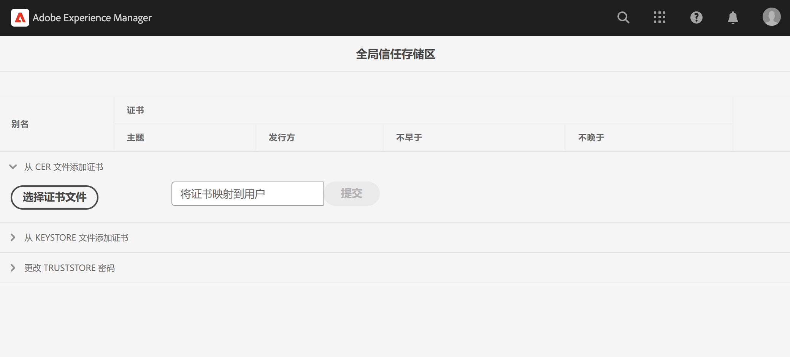

# 调用具有私有证书的内部 API

了解如何使用私有或自签名证书从 AEM 向 Web API 进行 HTTPS 调用。

>[!VIDEO](https://video.tv.adobe.com/v/3424853?quality=12&learn=on)

默认情况下，当尝试与使用自签名证书的 Web API 建立 HTTPS 连接时，连接会失败，并出现以下错误：

```
PKIX path building failed: sun.security.provider.certpath.SunCertPathBuilderException: unable to find valid certification path to requested target
```

此问题通常发生在 **API 的 SSL 证书不是由公认的证书颁发机构 (CA)** 颁发，且 Java™ 应用程序无法验证 SSL/TLS 证书时。

让我们学习如何使用 [Apache HttpClient](https://hc.apache.org/httpcomponents-client-4.5.x/index.html) 和 **AEM 的全局 TrustStore**，成功调用具有私有或自签名证书的 API。


## 使用 HttpClient 的原型 API 调用代码

以下代码会建立一个到 Web API 的 HTTPS 连接：

```java
...
String API_ENDPOINT = "https://example.com";

// Create HttpClientBuilder
HttpClientBuilder httpClientBuilder = HttpClientBuilder.create();

// Create HttpClient
CloseableHttpClient httpClient = httpClientBuilder.build();

// Invoke API
CloseableHttpResponse closeableHttpResponse = httpClient.execute(new HttpGet(API_ENDPOINT));

// Code that reads response code and body from the 'closeableHttpResponse' object
...
```

该代码使用了 [Apache HttpComponent](https://hc.apache.org/) 的 [HttpClient](https://hc.apache.org/httpcomponents-client-4.5.x/index.html) 库类及其方法。


## HttpClient 与加载 AEM TrustStore 材料

要调用带有&#x200B;_私有或自签名证书_&#x200B;的 API 端点，必须使用 AEM 的 TrustStore 加载 [HttpClient](https://hc.apache.org/httpcomponents-client-4.5.x/index.html) 的 `SSLContextBuilder`，并用于促进连接。

按照下面的步骤进行操作：

1. 以&#x200B;**管理员**&#x200B;身份登录&#x200B;**AEM Author**。
1. 导航至 **AEM Author > 工具 > 安全性 > 信任存储区**，然后打开&#x200B;**全局信任存储区**。如果第一次访问，请为全局信任存储区设置密码。

   

1. 要导入私有证书，请点击&#x200B;**选择证书文件**&#x200B;按钮，并选择带有 `.cer` 扩展名的所需证书文件。点击&#x200B;**提交**&#x200B;按钮进行导入。

1. 更新 Java™ 代码如下。请注意，要使用 `@Reference` 来获取 AEM 的 `KeyStoreService` 服务，调用代码必须是 OSGi 组件/服务，或 Sling 模型（且在那里使用了 `@OsgiService`）。

   ```java
   ...
   
   // Get AEM's KeyStoreService reference
   @Reference
   private com.adobe.granite.keystore.KeyStoreService keyStoreService;
   
   ...
   
   // Get AEM TrustStore using KeyStoreService
   KeyStore aemTrustStore = getAEMTrustStore(keyStoreService, resourceResolver);
   
   if (aemTrustStore != null) {
   
       // Create SSL Context
       SSLContextBuilder sslbuilder = new SSLContextBuilder();
   
       // Load AEM TrustStore material into above SSL Context
       sslbuilder.loadTrustMaterial(aemTrustStore, null);
   
       // Create SSL Connection Socket using above SSL Context
       SSLConnectionSocketFactory sslsf = new SSLConnectionSocketFactory(
               sslbuilder.build(), NoopHostnameVerifier.INSTANCE);
   
       // Create HttpClientBuilder
       HttpClientBuilder httpClientBuilder = HttpClientBuilder.create();
       httpClientBuilder.setSSLSocketFactory(sslsf);
   
       // Create HttpClient
       CloseableHttpClient httpClient = httpClientBuilder.build();
   
       // Invoke API
       closeableHttpResponse = httpClient.execute(new HttpGet(API_ENDPOINT));
   
       // Code that reads response code and body from the 'closeableHttpResponse' object
       ...
   } 
   
   /**
    * 
    * Returns the global AEM TrustStore
    * 
    * @param keyStoreService OOTB OSGi service that makes AEM based KeyStore
    *                         operations easy.
    * @param resourceResolver
    * @return
    */
   private KeyStore getAEMTrustStore(KeyStoreService keyStoreService, ResourceResolver resourceResolver) {
   
       // get AEM TrustStore from the KeyStoreService and ResourceResolver
       KeyStore aemTrustStore = keyStoreService.getTrustStore(resourceResolver);
   
       return aemTrustStore;
   }
   
   ...
   ```

   * 将 OOTB `com.adobe.granite.keystore.KeyStoreService` OSGi 服务注入到您的 OSGi 组件中。
   * 使用 `KeyStoreService` 和 `ResourceResolver` 获取全局 AEM TrustStore，`getAEMTrustStore(...)` 方法可以实现此操作。
   * 创建一个 `SSLContextBuilder`的对象，查看 Java™ [API 详情](https://javadoc.io/static/org.apache.httpcomponents/httpcore/4.4.8/index.html?org/apache/http/ssl/SSLContextBuilder.html)。
   * 使用 `loadTrustMaterial(KeyStore truststore,TrustStrategy trustStrategy)` 方法将全局 AEM TrustStore 加载到 `SSLContextBuilder` 中。
   * 在上述方法中为 `TrustStrategy` 传递 `null`，它确保在 API 执行期间只有 AEM 信任的证书才会有效。


>[!CAUTION]
>
>当使用上述方法执行时，带有有效 CA 颁发的证书的 API 调用会失败。按照此方法，只有使用 AEM 可信证书的 API 调用才会有效。
>
>使用[标准方法](#prototypical-api-invocation-code-using-httpclient)来执行有效的 CA 颁发的证书的 API 调用，这意味着只有与私有证书关联的 API 才应使用前述方法执行。

## 避免更改 JVM 密钥库

使用私有证书有效调用内部 API 的传统方法涉及修改 JVM 密钥库。这是通过使用 Java™ 的 [keytool](https://docs.oracle.com/en/java/javase/11/tools/keytool.html#GUID-5990A2E4-78E3-47B7-AE75-6D1826259549) 命令导入私有证书来实现的。

然而，这种方法并不符合安全最佳实践，而 AEM 通过使用&#x200B;**全局信任存储区**&#x200B;以及 [KeyStoreService](https://javadoc.io/doc/com.adobe.aem/aem-sdk-api/latest/com/adobe/granite/keystore/KeyStoreService.html)，提供了一种更优的选择。


## 解决方案包

视频中演示的示例 Node.js 项目可以从[此处](assets/internal-api-call/REST-APIs.zip)下载。

AEM servlet 代码可在 WKND Sites 项目的 `tutorial/web-api-invocation` 分支中找到，请[参阅](https://github.com/adobe/aem-guides-wknd/tree/tutorial/web-api-invocation/core/src/main/java/com/adobe/aem/guides/wknd/core/servlets)。
