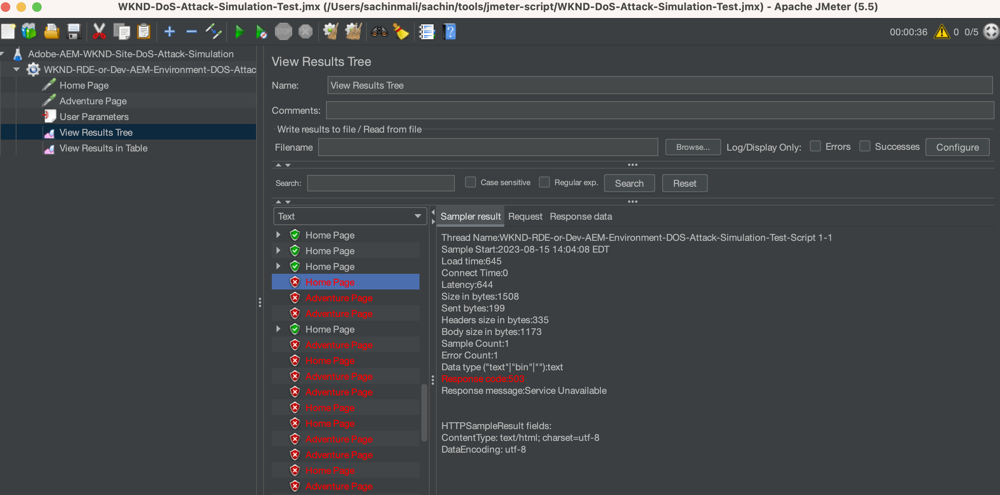

# 使用ModSecurity保护AEM站点免受DoS攻击

了解如何使用，启用ModSecurity保护您的站点免受拒绝服务(DoS)攻击 **OWASP ModSecurity核心规则集(CRS)** 在Adobe Experience Manager (AEM)发布Dispatcher上。


>[!VIDEO](https://video.tv.adobe.com/v/3422976?quality=12&learn=on)

## 概述

此 [打开Web应用程序安全项目® (OWASP)](https://owasp.org/) foundation提供 [**OWASP前10名**](https://owasp.org/www-project-top-ten/) 概述了Web应用程序十大最关键的安全问题。

ModSecurity是一种开源、跨平台的解决方案，可针对针对Web应用程序的一系列攻击提供保护。 它还支持HTTP流量监控、日志记录和实时分析。

OWSAP®还提供 [OWASP® ModSecurity核心规则集(CRS)](https://github.com/coreruleset/coreruleset). CRS是一组通用 **攻击检测** 与ModSecurity一起使用的规则。 因此，CRS旨在保护Web应用程序免受各种攻击，包括OWASP Top Ten攻击，同时尽量减少虚假警报。

本教程将演示如何启用和配置 **DOS保护** CRS规则保护您的站点免受可能的DoS攻击。

>[!TIP]
>
>请注意，AEMas a Cloud Service的 [托管的CDN](https://experienceleague.adobe.com/docs/experience-manager-cloud-service/content/implementing/content-delivery/cdn.html) 满足大多数客户的性能和安全性要求。 但是， ModSecurity提供了额外的安全层，并允许使用特定于客户的规则和配置。

## 将CRS添加到Dispatcher项目模块

1. 下载并解压缩 [最新的OWASP ModSecurity核心规则集](https://github.com/coreruleset/coreruleset/releases).

   ```shell
   # Replace the X.Y.Z with relevent version numbers.
   $ wget https://github.com/coreruleset/coreruleset/archive/refs/tags/vX.Y.Z.tar.gz
   
   # For version v3.3.5 when this tutorial is published
   $ wget https://github.com/coreruleset/coreruleset/archive/refs/tags/v3.3.5.tar.gz
   
   # Extract the downloaded file
   $ tar -xvzf coreruleset-3.3.5.tar.gz
   ```

1. 创建 `modsec/crs` 文件夹范围 `dispatcher/src/conf.d/` 在您的AEM项目代码中。 例如，在 [AEM WKND站点项目](https://github.com/adobe/aem-guides-wknd).

   {width="200" zoomable="yes"}

1. 复制 `coreruleset-X.Y.Z/rules` 将下载的CRS发行包中的文件夹移至 `dispatcher/src/conf.d/modsec/crs` 文件夹。
1. 复制 `coreruleset-X.Y.Z/crs-setup.conf.example` 文件从下载的CRS发行版软件包下载到 `dispatcher/src/conf.d/modsec/crs` 文件夹并将其重命名为 `crs-setup.conf`.
1. 禁用从复制的所有CRS规则 `dispatcher/src/conf.d/modsec/crs/rules` 将它们重命名为 `XXXX-XXX-XXX.conf.disabled`. 可以使用以下命令一次重命名所有文件。

   ```shell
   # Go inside the newly created rules directory within the dispathcher module
   $ cd dispatcher/src/conf.d/modsec/crs/rules
   
   # Rename all '.conf' extension files to '.conf.disabled'
   $ for i in *.conf; do mv -- "$i" "$i.disabled"; done
   ```

   请参阅WKND项目代码中重命名的CRS规则和配置文件。

   {width="200" zoomable="yes"}

## 启用和配置拒绝服务(DoS)保护规则

要启用和配置拒绝服务(DoS)保护规则，请执行以下步骤：

1. 通过重命名 `REQUEST-912-DOS-PROTECTION.conf.disabled` 到 `REQUEST-912-DOS-PROTECTION.conf` (或删除 `.disabled` （从rulename扩展） `dispatcher/src/conf.d/modsec/crs/rules` 文件夹。
1. 通过定义  **DOS_COUNTER_THRESHOLD， DOS_BURST_TIME_SLICE， DOS_BLOCK_TIMEOUT** 变量。
   1. 创建 `crs-setup.custom.conf` 中的文件 `dispatcher/src/conf.d/modsec/crs` 文件夹。
   1. 将以下规则片段添加到新创建的文件。

   ```
   # The Denial of Service (DoS) protection against clients making requests too quickly.
   # When a client is making more than 25 requests (excluding static files) within
   # 60 seconds, this is considered a 'burst'. After two bursts, the client is
   # blocked for 600 seconds.
   SecAction \
       "id:900700,\
       phase:1,\
       nolog,\
       pass,\
       t:none,\
       setvar:'tx.dos_burst_time_slice=60',\
       setvar:'tx.dos_counter_threshold=25',\
       setvar:'tx.dos_block_timeout=600'"    
   ```

在此示例规则配置中， **DOS_COUNTER_THRESHOLD** 是25 **DOS_BURST_TIME_SLICE** 是60秒，而且 **DOS_BLOCK_TIMEOUT** 超时为600秒。 此配置标识在60秒内出现的25个请求（不包括静态文件）中有两次以上符合DoS攻击条件，从而导致请求客户端被阻止600秒（或10分钟）。

>[!WARNING]
>
>要根据您的需求定义适当的值，请与Web安全团队协作。

## 初始化CRS

要初始化CRS，请删除常见的误报并为站点添加本地例外，请执行以下步骤：

1. 要初始化CRS，请删除 `.disabled` 从 **REQUEST-901-INITIALIZATION** 文件。 换言之，重命名 `REQUEST-901-INITIALIZATION.conf.disabled` 文件到 `REQUEST-901-INITIALIZATION.conf`.
1. 要删除常见的误报(如本地IP (127.0.0.1) ping)，请删除 `.disabled` 从 **REQUEST-905-COMMON-EXCEPTIONS** 文件。
1. 要添加本地例外(如AEM平台或网站特定的路径)，请重命名 `REQUEST-900-EXCLUSION-RULES-BEFORE-CRS.conf.example` 到 `REQUEST-900-EXCLUSION-RULES-BEFORE-CRS.conf`
   1. 将特定于AEM平台的路径异常添加到新重命名的文件。

   ```
   ########################################################
   # AEM as a Cloud Service exclusions                    #
   ########################################################
   # Ignoring AEM-CS Specific internal and reserved paths
   
   SecRule REQUEST_URI "@beginsWith /systemready" \
       "id:1010,\
       phase:1,\
       pass,\
       nolog,\
       ctl:ruleEngine=Off"    
   
   SecRule REQUEST_URI "@beginsWith /system/probes" \
       "id:1011,\
       phase:1,\
       pass,\
       nolog,\
       ctl:ruleEngine=Off"
   
   SecRule REQUEST_URI "@beginsWith /gitinit-status" \
       "id:1012,\
       phase:1,\
       pass,\
       nolog,\
       ctl:ruleEngine=Off"
   
   ########################################################
   # ADD YOUR SITE related exclusions                     #
   ########################################################
   ...
   ```

1. 另外，请移除 `.disabled` 从 **REQUEST-910-IP-PRESENTATION.conf.disabled** 用于IP信誉块检查和 `REQUEST-949-BLOCKING-EVALUATION.conf.disabled` 用于异常分数检查。

>[!TIP]
>
>在AEM 6.5上配置时，请确保将以上路径替换为验证AEM运行状况的相应AMS或内部部署路径（也称为心率路径）。

## 添加ModSecurity Apache配置

启用ModSecurity (又称 `mod_security` Apache模块)，请执行以下步骤：

1. 创建 `modsecurity.conf` 在 `dispatcher/src/conf.d/modsec/modsecurity.conf` 具有以下关键配置。

   ```
   # Include the baseline crs setup
   Include conf.d/modsec/crs/crs-setup.conf
   
   # Include your customizations to crs setup if exist
   IncludeOptional conf.d/modsec/crs/crs-setup.custom.conf
   
   # Select all available CRS rules:
   #Include conf.d/modsec/crs/rules/*.conf
   
   # Or alternatively list only specific ones you want to enable e.g.
   Include conf.d/modsec/crs/rules/REQUEST-900-EXCLUSION-RULES-BEFORE-CRS.conf
   Include conf.d/modsec/crs/rules/REQUEST-901-INITIALIZATION.conf
   Include conf.d/modsec/crs/rules/REQUEST-905-COMMON-EXCEPTIONS.conf
   Include conf.d/modsec/crs/rules/REQUEST-910-IP-REPUTATION.conf
   Include conf.d/modsec/crs/rules/REQUEST-912-DOS-PROTECTION.conf
   Include conf.d/modsec/crs/rules/REQUEST-949-BLOCKING-EVALUATION.conf
   
   # Start initially with engine off, then switch to detection and observe, and when sure enable engine actions
   #SecRuleEngine Off
   #SecRuleEngine DetectionOnly
   SecRuleEngine On
   
   # Remember to use relative path for logs:
   SecDebugLog logs/httpd_mod_security_debug.log
   
   # Start with low debug level
   SecDebugLogLevel 0
   #SecDebugLogLevel 1
   
   # Start without auditing
   SecAuditEngine Off
   #SecAuditEngine RelevantOnly
   #SecAuditEngine On
   
   # Tune audit accordingly:
   SecAuditLogRelevantStatus "^(?:5|4(?!04))"
   SecAuditLogParts ABIJDEFHZ
   SecAuditLogType Serial
   
   # Remember to use relative path for logs:
   SecAuditLog logs/httpd_mod_security_audit.log
   
   # You might still use /tmp for temporary/work files:
   SecTmpDir /tmp
   SecDataDir /tmp
   ```

1. 选择所需的 `.vhost` 从AEM项目的Dispatcher模块 `dispatcher/src/conf.d/available_vhosts`例如， `wknd.vhost`，在外部添加以下条目 `<VirtualHost>` 封锁。

   ```
   # Enable the ModSecurity and OWASP CRS
   <IfModule mod_security2.c>
       Include conf.d/modsec/modsecurity.conf
   </IfModule>
   
   ...
   
   <VirtualHost *:80>
       ServerName    "publish"
       ...
   </VirtualHost>
   ```

以上全部 _ModSecurity CRS_ 和 _DOS保护_ 可在AEM WKND Sites项目的 [tutorial/enable-modsecurity-crs-dos-protection](https://github.com/adobe/aem-guides-wknd/tree/tutorial/enable-modsecurity-crs-dos-protection) 分支供您审阅。

### 验证Dispatcher配置

使用AEMas a Cloud Service时，在部署之前 _Dispatcher配置_ 更改，建议使用在本地验证这些更改 `validate` 的脚本 [AEM SDK的Dispatcher工具](https://experienceleague.adobe.com/docs/experience-manager-learn/cloud-service/local-development-environment-set-up/dispatcher-tools.html).

```
# Go inside Dispatcher SDK 'bin' directory
$ cd <YOUR-AEM-SDK-DIR>/<DISPATCHER-SDK-DIR>/bin

# Validate the updated Dispatcher configurations
$ ./validate.sh <YOUR-AEM-PROJECT-CODE-DIR>/dispatcher/src
```

## 部署

使用Cloud Manager部署本地验证的Dispatcher配置 [Web层](https://experienceleague.adobe.com/docs/experience-manager-cloud-service/content/implementing/using-cloud-manager/cicd-pipelines/configuring-production-pipelines.html?#web-tier-config) 或 [全栈](https://experienceleague.adobe.com/docs/experience-manager-cloud-service/content/implementing/using-cloud-manager/cicd-pipelines/configuring-production-pipelines.html?#full-stack-code) 管道。 您也可以使用 [快速开发环境](https://experienceleague.adobe.com/docs/experience-manager-learn/cloud-service/developing/rde/overview.html) 以加快周转时间。

## 验证

为了验证DoS保护，在此示例中，我们将在60秒的范围内发送超过50个请求（25个请求阈值乘以两次发生次数）。 但是，这些请求应通过AEMas a Cloud Service [内置](https://experienceleague.adobe.com/docs/experience-manager-cloud-service/content/implementing/content-delivery/cdn.html) 或任何 [其他CDN](https://experienceleague.adobe.com/docs/experience-manager-cloud-service/content/implementing/content-delivery/cdn.html?#point-to-point-CDN) 在您的网站前面。

实现CDN传递的一种技术是通过以下方式添加查询参数： **每个网站页面请求的新随机值**.

为了在短时间（如60秒）内触发大量请求（50个或更多），Apache [JMet](https://jmeter.apache.org/) 或 [基准或标记工具](https://httpd.apache.org/docs/2.4/programs/ab.html) 可以使用。

### 使用JMeter脚本模拟DoS攻击

要使用JMeter模拟DoS攻击，请执行以下步骤：

1. [下载Apache JMet](https://jmeter.apache.org/download_jmeter.cgi) 和 [安装](https://jmeter.apache.org/usermanual/get-started.html#install) 它在本地
1. [运行](https://jmeter.apache.org/usermanual/get-started.html#running) 它在本地使用 `jmeter` 脚本来自 `<JMETER-INSTALL-DIR>/bin` 目录。
1. 打开示例 [WKND-DoS-Attack-Simulation-Test](assets/modsecurity-crs/WKND-DoS-Attack-Simulation-Test.jmx) 使用JMX脚本进入JMeter **打开** 工具菜单。

   

1. 更新 **服务器名称或IP** 中的字段值 _主页_ 和 _冒险页面_ 与您的测试AEM环境URL匹配的HTTP请求取样器。 查看示例JMeter脚本的其他详细信息。

   

1. 通过按 **开始** 工具菜单中的按钮。 该脚本针对WKND站点的 _主页_ 和 _冒险页面_. 因此，对于总共100个对非静态文件的请求，它根据以下条件来确定DoS攻击 **DOS保护** CRS规则自定义配置。

   

1. 此 **在表中查看结果** JMeter侦听器显示 **失败** 请求编号~ 53及以上的响应状态。

   

1. 此 **503 HTTP响应代码** 对于失败的请求返回，您可以使用查看详细信息 **查看结果树** JMeter侦听器。

   

### 查看日志

ModSecurity记录器配置会记录DoS攻击事件的详细信息。 要查看详细信息，请执行以下步骤：

1. 下载并打开 `httpderror` 的日志文件 **发布调度程序**.
1. 搜索单词 `burst` 在日志文件中，查看 **错误** 线条

   ```
   Tue Aug 15 15:19:40.229262 2023 [security2:error] [pid 308:tid 140200050567992] [cm-p46652-e1167810-aem-publish-85df5d9954-bzvbs] [client 192.150.10.209] ModSecurity: Warning. Operator GE matched 2 at IP:dos_burst_counter. [file "/etc/httpd/conf.d/modsec/crs/rules/REQUEST-912-DOS-PROTECTION.conf"] [line "265"] [id "912170"] [msg "Potential Denial of Service (DoS) Attack from 192.150.10.209 - # of Request Bursts: 2"] [ver "OWASP_CRS/3.3.5"] [tag "application-multi"] [tag "language-multi"] [tag "platform-multi"] [tag "paranoia-level/1"] [tag "attack-dos"] [tag "OWASP_CRS"] [tag "capec/1000/210/227/469"] [hostname "publish-p46652-e1167810.adobeaemcloud.com"] [uri "/content/wknd/us/en/adventures.html"] [unique_id "ZNuXi9ft_9sa85dovgTN5gAAANI"]
   
   ...
   
   Tue Aug 15 15:19:40.515237 2023 [security2:error] [pid 309:tid 140200051428152] [cm-p46652-e1167810-aem-publish-85df5d9954-bzvbs] [client 192.150.10.209] ModSecurity: Access denied with connection close (phase 1). Operator EQ matched 0 at IP. [file "/etc/httpd/conf.d/modsec/crs/rules/REQUEST-912-DOS-PROTECTION.conf"] [line "120"] [id "912120"] [msg "Denial of Service (DoS) attack identified from 192.150.10.209 (1 hits since last alert)"] [ver "OWASP_CRS/3.3.5"] [tag "application-multi"] [tag "language-multi"] [tag "platform-multi"] [tag "paranoia-level/1"] [tag "attack-dos"] [tag "OWASP_CRS"] [tag "capec/1000/210/227/469"] [hostname "publish-p46652-e1167810.adobeaemcloud.com"] [uri "/us/en.html"] [unique_id "ZNuXjAN7ZtmIYHGpDEkmmwAAAQw"]
   ```

1. 查看详细信息，如 _客户端IP地址_、操作、错误消息和请求详细信息。

## ModSecurity的性能影响

启用ModSecurity和相关规则会对性能产生影响，因此请注意哪些规则是必需的、多余的以及已跳过。 与您的Web安全专家合作，共同启用和自定义CRS规则。

### 其他规则

本教程仅启用和自定义 **DOS保护** 用于演示的CRS规则。 建议与Web安全专家合作，了解、审查和配置适当的规则。
