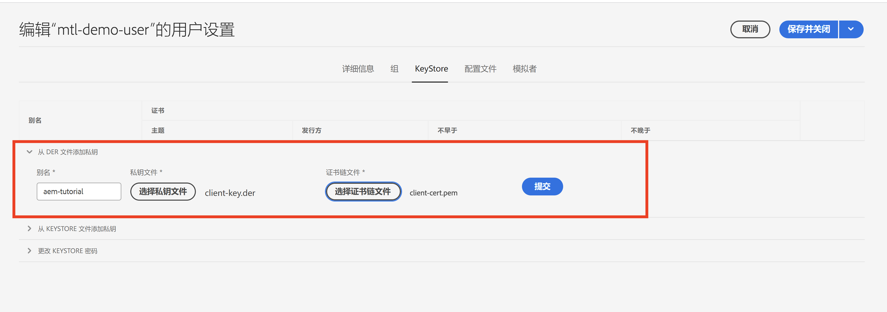

# 来自AEM的双向传输层安全性(mTLS)身份验证

了解如何从AEM对需要相互传输层安全性(mTLS)身份验证的Web API进行HTTPS调用。

>[!VIDEO](https://video.tv.adobe.com/v/3424855?quality=12&learn=on)

mTLS或双向TLS身份验证通过要求 **客户端和服务器相互进行身份验证**. 此身份验证通过使用数字证书来完成。 它通常用于高度安全性和身份验证至关重要的场景。

默认情况下，在尝试与需要mTLS身份验证的Web API建立HTTPS连接时，连接会失败，并出现以下错误：

```
javax.net.ssl.SSLHandshakeException: Received fatal alert: certificate_required
```

当客户端不提供证书来验证自身时，会出现此问题。

让我们了解如何使用成功调用需要mTLS身份验证的API [Apache HttpClient](https://hc.apache.org/httpcomponents-client-4.5.x/index.html) 和 **AEM密钥库和TrustStore**.


## HttpClient和加载AEM KeyStore资料

从较高层面来看，需要执行以下步骤才能从AEM中调用受mTLS保护的API。

### AEM证书生成

与贵组织的安全团队合作，请求AEM证书。 安全团队提供或询问与证书相关的详细信息，例如密钥、证书签名请求(CSR)，并使用CSR颁发证书。

出于演示目的，请生成与证书相关的详细信息，例如密钥、证书签名请求(CSR)。 在以下示例中，自签名CA用于颁发证书。

- 首先，生成内部证书颁发机构(CA)证书。

  ```shell
  # Create an internal Certification Authority (CA) certificate
  openssl req -new -x509 -days 9999 -keyout internal-ca-key.pem -out internal-ca-cert.pem
  ```

- 生成AEM证书。

  ```shell
  # Generate Key
  openssl genrsa -out client-key.pem
  
  # Generate CSR
  openssl req -new -key client-key.pem -out client-csr.pem
  
  # Generate certificate and sign with internal Certification Authority (CA)
  openssl x509 -req -days 9999 -in client-csr.pem -CA internal-ca-cert.pem -CAkey internal-ca-key.pem -CAcreateserial -out client-cert.pem
  
  # Verify certificate
  openssl verify -CAfile internal-ca-cert.pem client-cert.pem
  ```

- 将AEM私钥转换为DER格式，AEM KeyStore需要DER格式的私钥。

  ```shell
  openssl pkcs8 -topk8 -inform PEM -outform DER -in client-key.pem -out client-key.der -nocrypt
  ```

>[!TIP]
>
>自签名CA证书仅用于开发目的。 对于生产，请使用受信任的证书颁发机构(CA)来颁发证书。


### 证书交换

如果对AEM证书使用自签名CA（如上所述），请将证书或内部证书颁发机构(CA)证书发送到API提供程序。

此外，如果API提供商使用自签名CA证书，则从API提供商接收证书或内部证书颁发机构(CA)证书。

### 证书导入

要导入AEM证书，请执行以下步骤：

1. 登录 **AEM创作** 作为 **管理员**.

1. 导航到 **AEM Author >工具>安全>用户>创建或选择现有用户**.

   

   出于演示目的，新用户名为 `mtl-demo-user` 创建。

1. 打开 **用户属性**，单击用户名。

1. 单击 **密钥库** 选项卡，然后单击 **创建密钥库** 按钮。 然后在 **设置KeyStore访问密码** 对话框，为此用户的密钥库设置密码，然后单击保存。

   

1. 在新屏幕中的 **从DER文件添加私钥** 部分，请执行以下步骤：

   1. 输入别名

   1. 以DER格式导入上面生成的AEM私钥。

   1. 导入上面生成的证书链文件。

   1. 单击提交

      

1. 验证是否已成功导入证书。

   

如果API提供程序使用自签名CA证书，请将收到的证书导入AEM TrustStore，请按照中的步骤操作 [此处](https://experienceleague.adobe.com/docs/experience-manager-learn/foundation/security/call-internal-apis-having-private-certificate.html#httpclient-and-load-aem-truststore-material).

同样，如果AEM使用自签名CA证书，请请求API提供商导入它。

### 使用HttpClient的典型mTLS API调用代码

更新Java™代码，如下所示。 使用 `@Reference` 用于获取AEM的注释 `KeyStoreService` 服务调用代码必须是OSGi组件/服务或Sling模型(以及 `@OsgiService` 在该处使用)。


```java
...

// Get AEM's KeyStoreService reference
@Reference
private com.adobe.granite.keystore.KeyStoreService keyStoreService;

...

// Get AEM KeyStore using KeyStoreService
KeyStore aemKeyStore = getAEMKeyStore(keyStoreService, resourceResolver);

if (aemKeyStore != null) {

    // Create SSL Context
    SSLContextBuilder sslbuilder = new SSLContextBuilder();

    // Load AEM KeyStore material into above SSL Context with keystore password
    // Ideally password should be encrypted and stored in OSGi config
    sslbuilder.loadKeyMaterial(aemKeyStore, "admin".toCharArray());

    // If API provider cert is self-signed, load AEM TrustStore material into above SSL Context
    // Get AEM TrustStore
    KeyStore aemTrustStore = getAEMTrustStore(keyStoreService, resourceResolver);
    sslbuilder.loadTrustMaterial(aemTrustStore, null);

    // Create SSL Connection Socket using above SSL Context
    SSLConnectionSocketFactory sslsf = new SSLConnectionSocketFactory(
            sslbuilder.build(), NoopHostnameVerifier.INSTANCE);

    // Create HttpClientBuilder
    HttpClientBuilder httpClientBuilder = HttpClientBuilder.create();
    httpClientBuilder.setSSLSocketFactory(sslsf);

    // Create HttpClient
    CloseableHttpClient httpClient = httpClientBuilder.build();

    // Invoke API
    closeableHttpResponse = httpClient.execute(new HttpGet(MTLS_API_ENDPOINT));

    // Code that reads response code and body from the 'closeableHttpResponse' object
    ...
} 

/**
 * Returns the AEM KeyStore of a user. In this example we are using the
 * 'mtl-demo-user' user.
 * 
 * @param keyStoreService
 * @param resourceResolver
 * @return AEM KeyStore
 */
private KeyStore getAEMKeyStore(KeyStoreService keyStoreService, ResourceResolver resourceResolver) {

    // get AEM KeyStore of 'mtl-demo-user' user, you can create a user or use an existing one. 
    // Then create keystore and upload key, certificate files.
    KeyStore aemKeyStore = keyStoreService.getKeyStore(resourceResolver, "mtl-demo-user");

    return aemKeyStore;
}

/**
 * 
 * Returns the global AEM TrustStore
 * 
 * @param keyStoreService OOTB OSGi service that makes AEM based KeyStore
 *                         operations easy.
 * @param resourceResolver
 * @return
 */
private KeyStore getAEMTrustStore(KeyStoreService keyStoreService, ResourceResolver resourceResolver) {

    // get AEM TrustStore from the KeyStoreService and ResourceResolver
    KeyStore aemTrustStore = keyStoreService.getTrustStore(resourceResolver);

    return aemTrustStore;
}

...
```

- 插入OOTB `com.adobe.granite.keystore.KeyStoreService` 将OSGi服务插入您的OSGi组件中。
- 使用以下方式获取用户的AEM KeyStore `KeyStoreService` 和 `ResourceResolver`， `getAEMKeyStore(...)` 方法可做到这一点。
- 如果API提供程序使用自签名CA证书，则获取全局AEM TrustStore， `getAEMTrustStore(...)` 方法可做到这一点。
- 创建对象 `SSLContextBuilder`，请参阅Java™ [API详细信息](https://javadoc.io/static/org.apache.httpcomponents/httpcore/4.4.8/index.html?org/apache/http/ssl/SSLContextBuilder.html).
- 将用户的AEM KeyStore加载到 `SSLContextBuilder` 使用 `loadKeyMaterial(final KeyStore keystore,final char[] keyPassword)` 方法。
- 密钥库密码是在创建密钥库时设置的密码，应存储在OSGi配置中，请参见 [密码配置值](https://experienceleague.adobe.com/docs/experience-manager-cloud-service/content/implementing/deploying/configuring-osgi.html#secret-configuration-values).

## 避免JVM密钥库更改

使用私有证书有效调用mTLS API的传统方法涉及修改JVM密钥库。 通过使用Java导入私有证书来实现这一点™ [keytool](https://docs.oracle.com/en/java/javase/11/tools/keytool.html#GUID-5990A2E4-78E3-47B7-AE75-6D1826259549) 命令。

但是，此方法不符合安全最佳实践，AEM通过利用 **用户特定的KeyStore和全局TrustStore** 和 [KeyStoreService](https://javadoc.io/doc/com.adobe.aem/aem-sdk-api/latest/com/adobe/granite/keystore/KeyStoreService.html).

## 解决方案包

可以从下载视频中降级的Node.js示例项目 [此处](assets/internal-api-call/REST-APIs.zip).

AEM servlet代码在WKND站点项目的 `tutorial/web-api-invocation` 分支， [请参阅](https://github.com/adobe/aem-guides-wknd/tree/tutorial/web-api-invocation/core/src/main/java/com/adobe/aem/guides/wknd/core/servlets).
