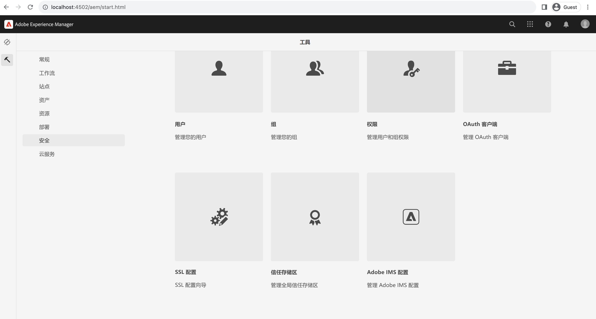
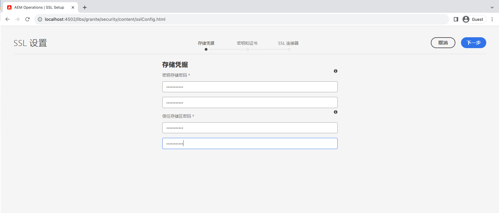
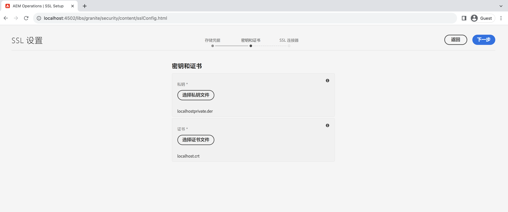
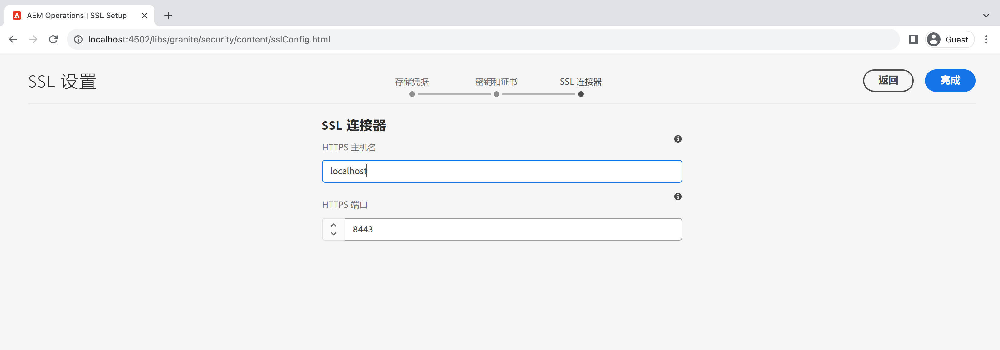
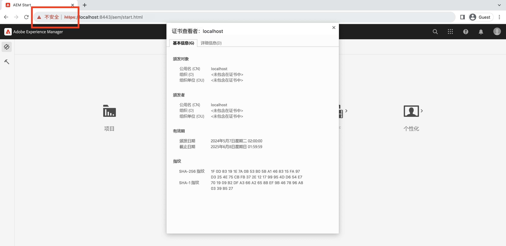

# 在AEM中使用“SSL向导”

了解如何在Adobe Experience Manager中设置SSL，以使其使用内置的SSL向导通过HTTPS运行。

>[!VIDEO](https://video.tv.adobe.com/v/17993?quality=12&learn=on)


>[!NOTE]
>
>对于托管环境，最好由IT部门提供CA信任的证书和密钥。
>
>自签名证书仅用于开发目的。

## 使用SSL配置向导

导航到 __AEM作者>工具>安全> SSL配置__，然后打开 __SSL配置向导__.



### 创建商店凭据

创建 _密钥存储_ 与关联 `ssl-service` 系统用户和全局用户 _信任存储区_，使用 __存储凭据__ 向导步骤。

1. 输入密码并确认密码 __密钥存储__ 与关联 `ssl-service` 系统用户。
1. 输入全局的密码和确认密码 __信任存储区__. 请注意，它是系统范围的Trust Store，如果已创建，则忽略输入的密码。

   

### 上传私钥和证书

上传 _私钥_ 和 _SSL证书_，使用 __密钥和证书__ 向导步骤。

通常，您的IT部门会提供CA信任的证书和密钥，但自签名证书可用于 __开发__ 和 __测试__ 目的。

要创建或下载自签名证书，请参阅 [自签名私钥和证书](#self-signed-private-key-and-certificate).

1. 上传 __私钥__ DER（唯一编码规则）格式。 与PEM不同，DER编码文件不包含纯文本语句，例如 `-----BEGIN CERTIFICATE-----`
1. 上传关联的 __SSL证书__ 在 `.crt` 格式。

   

### 更新SSL连接器详细信息

要更新 _主机名_ 和 _端口_ 使用 __SSL连接器__ 向导步骤。

1. 更新或验证 __HTTPS主机名__ 值，它应匹配 `Common Name (CN)` 从证书中。
1. 更新或验证 __HTTPS端口__ 值。

   

### 验证SSL设置

1. 要验证SSL，请单击 __转到HTTPS URL__ 按钮。
1. 如果使用自签名证书，您会看到 `Your connection is not private` 错误。

   

## 自签名私钥和证书

以下zip文件包含 [!DNL DER] 和 [!DNL CRT] 在本地设置AEM SSL所需的文件，并且仅供本地开发使用。

此 [!DNL DER] 和 [!DNL CERT] 为方便起见，提供了文件，并使用下面的“生成私钥和自签名证书”部分中概述的步骤生成文件。

如果需要，证书密码短语为 **管理员**.

此localhost — 私钥和自签名的certificate.zip（2028年7月到期）

[下载证书文件](assets/use-the-ssl-wizard/certificate.zip)

### 私钥和自签名证书生成

上视频描述了AEM创作实例上使用自签名证书的SSL的设置和配置。 以下命令使用 [[!DNL OpenSSL]](https://www.openssl.org/) 可以生成要在向导的步骤2中使用的私钥和证书。

```shell
### Create Private Key
$ openssl genrsa -aes256 -out localhostprivate.key 4096

### Generate Certificate Signing Request using private key
$ openssl req -sha256 -new -key localhostprivate.key -out localhost.csr -subj '/CN=localhost'

### Generate the SSL certificate and sign with the private key, will expire one year from now
$ openssl x509 -req -extfile <(printf "subjectAltName=DNS:localhost") -days 365 -in localhost.csr -signkey localhostprivate.key -out localhost.crt

### Convert Private Key to DER format - SSL wizard requires key to be in DER format
$ openssl pkcs8 -topk8 -inform PEM -outform DER -in localhostprivate.key -out localhostprivate.der -nocrypt
```
