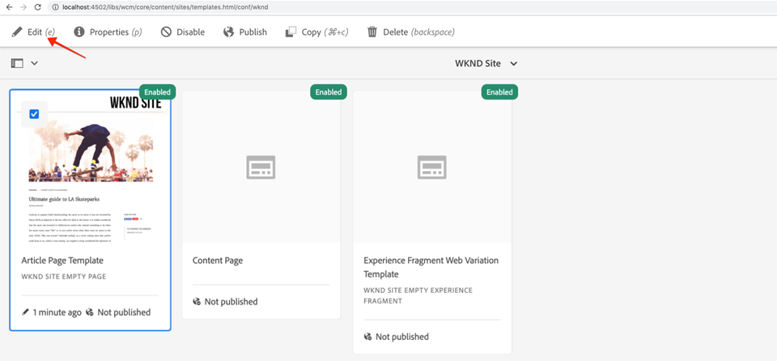

# 客户端库和前端工作流{#client-side-libraries}

了解如何使用客户端库或客户端库为Adobe Experience Manager(AEM)站点实施部署和管理CSS和Javascript。 本教程还将介绍如何将解耦的[ui.frontend](https://docs.adobe.com/content/help/zh-Hans/experience-manager-core-components/using/developing/archetype/uifrontend.html)模块（[webpack](https://webpack.js.org/)项目）集成到端到端构建过程中。

## 前提条件 {#prerequisites}

查看设置[本地开发环境](overview.md#local-dev-environment)所需的工具和说明。

还建议阅读[组件基础知识](component-basics.md#client-side-libraries)教程，了解客户端库和AEM的基础知识。

### 入门项目

查看教程构建的基线代码：

1. 克隆[github.com/adobe/aem-guides-wknd](https://github.com/adobe/aem-guides-wknd)存储库。
1. 检查`client-side-libraries/start`分支

   ```shell
   $ git clone git@github.com:adobe/aem-guides-wknd.git ~/code/aem-guides-wknd
   $ cd ~/code/aem-guides-wknd
   $ git checkout client-side-libraries/start
   ```

1. 使用Maven技能将代码库部署到本地AEM实例：

   ```shell
   $ cd ~/code/aem-guides-wknd
   $ mvn clean install -PautoInstallSinglePackage
   ```

您始终可以在[GitHub](https://github.com/adobe/aem-guides-wknd/tree/client-side-libraries/solution)上视图完成的代码，或通过切换到分支`client-side-libraries/solution`在本地签出代码。

## 目标

1. 了解如何通过可编辑的模板将客户端库包含在页面上。
1. 了解如何使用UI.Frontend Module和Webpack开发服务器进行专用前端开发。
1. 了解将编译的CSS和JavaScript交付到站点实现的端到端工作流程。

## 您将构建的{#what-you-will-build}

在本章中，您将为WKND站点和文章页面模板添加一些基线样式，以使实现更接近[UI设计模型](assets/pages-templates/wknd-article-design.xd)。 您将使用高级前端工作流将webpack项目集成到AEM客户端库中。

>[!VIDEO](https://video.tv.adobe.com/v/30359/?quality=12&learn=on)

## 背景 {#background}

客户端库提供了组织和管理AEM Sites实施所需的CSS和JavaScript文件的机制。 客户端库或客户端库的基本目标是：

1. 将CSS/JS存储在小型离散文件中，以便更轻松地进行开发和维护
1. 以有组织的方式管理对第三方框架的依赖性
1. 通过将CSS/JS连接到一个或两个请求中，最大限度地减少客户端请求数。

有关使用[客户端库的详细信息，请访问此处。](https://docs.adobe.com/content/help/en/experience-manager-65/developing/introduction/clientlibs.html)

客户端库确实存在一些限制。 最突出的是对Sass、LESS和TypeScript等流行前端语言的有限支持。 在教程中，我们将了解&#x200B;**ui.frontend**&#x200B;模块如何帮助解决此问题。

将起始代码库部署到本地AEM实例并导航到[http://localhost:4502/editor.html/content/wknd/us/en/magazine/guide-la-skateparks.html](http://localhost:4502/editor.html/content/wknd/us/en/magazine/guide-la-skateparks.html)。 此页面当前未设置样式。 接下来，我们将为WKND品牌实施客户端库，以向页面添加CSS和Javascript。

## 客户端库组织{#organization}

接下来，我们将探索[AEM Project Archetype](https://docs.adobe.com/content/help/zh-Hans/experience-manager-core-components/using/developing/archetype/overview.html)生成的clientlibs的组织。


*高级图客户端库组织和页面包含*

>[!NOTE]
>
> 以下客户端库组织由AEM Project Archetype生成，但仅代表一个起点。 项目最终如何管理CSS和Javascript并将它们交付到站点实施可能会因资源、技能和要求而大大不同。

1. 使用Eclipse或其他IDE打开&#x200B;**ui.apps**&#x200B;模块。
1. 展开路径`/apps/wknd/clientlibs`以视图原型生成的clientlibs。

   

   我们将在下面详细检查这些客户端库。

1. Inspect`clientlibs/clientlib-base`的属性。

   **clientlib-** base表示WKND站点正常工作所需的CSS和JavaScript的基级。请注意设置为`wknd.base`的属性`categories`。 `categories` 是客户端库的标记机制，也是如何引用这些库的。

   注意`embed`属性和`String[]`值。 `embed`属性根据其类别嵌入其他clientlib。 **clientlib-** base将包括所需的所有AEM Core Component clientlibaries。这包括诸如传送的javascript等项目，以及要运行的快速搜索组件。 **clientlib-** base将不包括其自己的任何CSS和Javascript，而只是嵌入其他客户端库。**clientlib-** baseembeds  **clientlib-** gridclientlib with the类别 `wknd.grid`。

   请注意设置为`true`的`allowProxy`属性。 始终在clientlibs上设置`allowProxy=true`是最佳做法。 `allowProxy`属性允许我们将客户端与应用程序代码存储在`/apps` **下，但**&#x200B;随后通过以`/etc.clientlibs`前缀的路径传送客户端，以避免向最终用户公开任何应用程序代码。 有关[allowProxy属性的详细信息，请访问此处。](https://docs.adobe.com/content/help/en/experience-manager-65/developing/introduction/clientlibs.html#locating-a-client-library-folder-and-using-the-proxy-client-libraries-servlet)。

1. Inspect`clientlibs/clientlib-grid`的属性。

   **clientlib-** gridis负责包含／生成布局模型与AEM Sites [编](https://docs.adobe.com/content/help/en/experience-manager-65/authoring/siteandpage/responsive-layout.html) 辑器配合使用所需的CSS。**clientlib-gridhad** 类别集设置为并 `wknd.grid` 通过clientlib-base **进行嵌入**。

   可以自定义网格以使用不同数量的列和断点。 接下来，我们将更新生成的默认断点。

1. 更新文件`/apps/wknd/clientlibs/clientlib-grid/less/grid.less`:

   ```css
   @import (once) "/libs/wcm/foundation/clientlibs/grid/grid_base.less";
   
   /* maximum amount of grid cells to be provided */
   @max_col: 12;
   @screen-small: 767px;
   @screen-medium: 1024px;
   @screen-large: 1200px;
   @gutter-padding: 14px;
   
   /* default breakpoint */
   .aem-Grid {
       .generate-grid(default, @max_col);
   }
   
   /* phone breakpoint */
   @media (max-width: @screen-small) {
       .aem-Grid {
           .generate-grid(phone, @max_col);
       }
   }
   /* tablet breakpoint */
   @media (min-width: (@screen-small + 1)) and (max-width: @screen-medium) {
       .aem-Grid {
           .generate-grid(tablet, @max_col);
       }
   }
   
   .aem-GridColumn {
       padding: 0 @gutter-padding;
   }
   
   .responsivegrid.aem-GridColumn {
       padding-left: 0;
       padding-right: 0;
   }
   ```

   这将更改断点，使其与我们在`/ui.content/src/main/content/jcr_root/conf/wknd/settings/wcm/templates/article-page-template/structure/.content.xml`中设置的“模板”断点相对应。

   请注意，此文件实际引用`/libs`下的`grid_base.less`文件，该文件包含生成网格的自定义混音。

1. Inspect`clientlibs/clientlib-site`的属性。

   **clientlib-** sitewill将包含WKND品牌的所有站点特定样式。请注意`wknd.site`的类别。 生成此clientlib的CSS和Javascript实际上将保留在`ui.frontend`模块中。 我们接下来将探索此集成。

1. Inspect`clientlibs/clientlib-dependencies`的属性。

   **clientlib-** dependenciesis旨在嵌入任何第三方依赖关系。它是单独的clientlib，因此可以根据需要将其加载到HTML页面的顶部。 请注意`wknd.dependencies`的类别。 生成此clientlib的CSS和Javascript实际上将保留在`ui.frontend`模块中。 我们将在教程的稍后部分探索此集成。

## 使用ui.frontend模块{#ui-frontend}

接下来，我们将探索&#x200B;**[ui.frontend](https://docs.adobe.com/content/help/en/experience-manager-core-components/using/developing/archetype/uifrontend.html)**&#x200B;模块的使用。

### 动机

在支持[Sass](https://sass-lang.com/)或[TypeScript](https://www.typescriptlang.org/)等语言方面，客户端库有一些限制。 开放源工具（如[NPM](https://www.npmjs.com/)和[webpack](https://webpack.js.org/)）也大量涌现，它们加速和优化了前端开发。

**ui.frontend**&#x200B;模块的基本思想是能够使用像NPM和Webpack这样的出色工具管理大多数前端开发。 内置到&#x200B;**ui.frontend**&#x200B;模块中的关键集成部分[aem-clientlib-generator](https://github.com/wcm-io-frontend/aem-clientlib-generator)从webpack/npm项目获取已编译的CSS和JS伪像，并将它们转换为AEM客户端库。 这为前端开发者提供了更大的自由，让他们能够选择不同的工具和技术。


### 用法

现在，我们将通过&#x200B;**ui.frontend**&#x200B;模块添加一些Sass文件（`.scss`扩展），为WKND品牌添加一些基本样式。

1. 打开&#x200B;**ui.frontend**&#x200B;模块并导航到`src/main/webpack/base/sass`。

   

1. 在文件夹`src/main/webpack/base/sass`下新建一个名为`_variables.scss`的文件。
1. 使用以下内容填充`_variables.scss`:

   ```scss
   //== Colors
   //
   //## Gray and brand colors for use across theme.
   
   $black:                  #202020;
   $gray:                   #696969;
   $gray-light:             #EBEBEB;
   $gray-lighter:           #F7F7F7;
   $white:                  #ffffff;
   $yellow:                 #FFE900;
   $blue:                   #0045FF;
   $pink:                   #FF0058;
   
   $brand-primary:           $yellow;
   
   //== Layout
   $gutter-padding: 14px;
   $max-width: 1164px;
   $max-body-width: 1680px;
   $screen-xsmall: 475px;
   $screen-small: 767px;
   $screen-medium: 1024px;
   $screen-large: 1200px;
   
   //== Scaffolding
   //
   //## Settings for some of the most global styles.
   $body-bg:                   $white;
   $text-color:                $black;
   $text-color-inverse:        $gray-light;
   
   $brand-secondary:           $black;
   
   $brand-third:               $gray-light;
   $link-color:                $blue;
   $link-hover-color:          $link-color;
   $link-hover-decoration:     underline;
   $nav-link:                  $black;
   $nav-link-inverse:          $gray-light;
   
   //== Typography
   //
   //## Font, line-height, and color for body text, headings, and more.
   
   $font-family-sans-serif:  "Source Sans Pro", "Helvetica Neue", Helvetica, Arial, sans-serif;
   $font-family-serif:       "Asar",Georgia, "Times New Roman", Times, serif;
   $font-family-base:        $font-family-sans-serif;
   
   $font-size-base:          18px;
   $font-size-large:         24px;
   $font-size-xlarge:        48px;
   $font-size-medium:        18px;
   $font-size-small:         14px;
   $font-size-xsmall:        12px;
   
   $font-size-h1:            40px;
   $font-size-h2:            36px;
   $font-size-h3:            24px;
   $font-size-h4:            16px;
   $font-size-h5:            14px;
   $font-size-h6:            10px;
   
   $line-height-base:        1.5;
   $line-height-computed:    floor(($font-size-base * $line-height-base)); // ~20px
   
   $font-weight-light:      300;
   $font-weight-normal:     normal;
   $font-weight-semi-bold:  400;
   $font-weight-bold:       600;
   ```

   Sass允许我们创建变量，然后这些变量可以用于不同的文件，以确保一致性。 注意字体系列。 在本教程的稍后部分，我们将了解如何包含对Google Web字体的调用，以便使用这些字体。

1. 在`src/main/webpack/base/sass`下创建另一个名为`_elements.scss`的文件，并用以下内容填充该文件：

   ```scss
   body {
       background-color: $body-bg;
       font-family: $font-family-base;
       margin: 0;
       padding: 0;
       font-size: $font-size-base;
       text-align: left;
       color: $text-color;
       line-height: $line-height-base;
   
       .root {
           max-width: $max-width;
           margin: 0 auto;
       }
   }
   
   // Headings
   // -------------------------
   
   h1, h2, h3, h4, h5, h6,
   .h1, .h2, .h3, .h4, .h5, .h6 {
       line-height: $line-height-base;
       color: $text-color;
   }
   
   h1, .h1,
   h2, .h2,
   h3, .h3 {
       font-family: $font-family-serif;
       font-weight: $font-weight-normal;
       margin-top: $line-height-computed;
       margin-bottom: ($line-height-computed / 2);
   }
   
   h4, .h4,
   h5, .h5,
   h6, .h6 {
       font-family: $font-family-sans-serif;
       text-transform: uppercase;
       font-weight: $font-weight-bold;
   }
   
   h1, .h1 { font-size: $font-size-h1; }
   h2, .h2 { font-size: $font-size-h2; }
   h3, .h3 { font-size: $font-size-h3; }
   h4, .h4 { font-size: $font-size-h4; }
   h5, .h5 { font-size: $font-size-h5; }
   h6, .h6 { font-size: $font-size-h6; }
   
   a {
       color: $link-color;
       text-decoration: none;
   }
   
   h1 a, h2 a, h3 a {
       color: $pink; /* for wednesdays :-) */
   }
   
   // Body text
   // -------------------------
   
   p {
       margin: 0 0 ($line-height-computed / 2);
       font-size: $font-size-base;
       line-height: $line-height-base + 1;
       text-align: justify;
   }
   ```

   请注意，`_elements.scss`文件使用`_variables.scss`中的变量。

1. 更新`src/main/webpack/base/sass`下的`_shared.scss`以包含`_elements.scss`和`_variables.scss`文件。

   ```css
   @import './variables';
   @import './elements';
   ```

1. 打开命令行终端，然后使用`npm install`命令安装&#x200B;**ui.frontend**&#x200B;模块：

   ```shell
   $ cd ~/code/aem-guides-wknd/ui.frontend
   $ npm install
   ```

   >[!NOTE]
   >
   >`npm install` 只需在新克隆或生成项目后运行一次。

1. 在同一终端中，使用`npm run dev`命令构建和部署&#x200B;**ui.frontend**&#x200B;模块：

   ```shell
   $ npm run dev
   ...
   Entrypoint site = clientlib-site/css/site.css clientlib-site/js/site.js
   Entrypoint dependencies = clientlib-dependencies/js/dependencies.js
   start aem-clientlib-generator
   ...
   copy: dist/clientlib-site/css/site.css ../ui.apps/src/main/content/jcr_root/apps/wknd/clientlibs/clientlib-site/css/site.css
   ```

   命令`npm run dev`应构建并编译Webpack项目的源代码，并最终在&#x200B;**ui.apps**&#x200B;模块中填充&#x200B;**clientlib-site**&#x200B;和&#x200B;**clientlib-dependencies**。

   >[!NOTE]
   >
   >还有一个`npm run prod`用户档案，将最小化JS和CSS。 只要通过Maven触发Webpack构建，这就是标准编译。 有关[ui.frontend模块的更多详细信息，请访问](https://docs.adobe.com/content/help/en/experience-manager-core-components/using/developing/archetype/uifrontend.html)。

1. Inspect`ui.frontend/dist/clientlib-site/css/site.css`下的文件`site.css`。 请注意，CSS主要由之前创建的`_elements.scss`文件的内容组成，但变量已被实际值替换。

   

1. Inspect文件`ui.frontend/clientlib.config.js`。 这是npm插件[aem-clientlib-generator](https://github.com/wcm-io-frontend/aem-clientlib-generator)的配置文件。 **aem-clientlib-generator是** 负责转换已编译的CSS/JavaScript并将其复制到ui.appsmodule **的工** 具。

1. Inspect **ui.apps**&#x200B;模块`ui.apps/src/main/content/jcr_root/apps/wknd/clientlibs/clientlib-site/css/site.css`中的文件`site.css`。 这应该是&#x200B;**ui.frontend**&#x200B;模块中`site.css`文件的相同副本。 现在它位于&#x200B;**ui.apps**&#x200B;模块中，可将其部署到AEM。

   

   >[!NOTE]
   >
   > 由于&#x200B;**clientlib-site**&#x200B;实际是在构建时间内编译的，因此使用&#x200B;**npm**&#x200B;或&#x200B;**maven**，实际上可以从&#x200B;**ui.apps**&#x200B;模块的源代码控件中忽略它。 Inspect **ui.apps**&#x200B;下的`.gitignore`文件。

>[!CAUTION]
>
> 并非所有项目都需要使用&#x200B;**ui.frontend**&#x200B;模块。 **ui.frontend**&#x200B;模块增加了额外的复杂性，如果不需要／希望使用这些高级前端工具(Sass、webpack、npm...)，则可能会过度关闭。 因此，它被视为AEM Project Archetype的可选部分，并且继续完全支持使用标准客户端库以及vanilla CSS和JavaScript。

## 页面和模板包含{#page-inclusion}

接下来，我们将检查项目设置如何将clientlibs包含在AEM模板／页面中。 在Web开发中，通常的最佳实践是在结束`</body>`标记之前，在HTML Header `<head>`和JavaScript中包含CSS。

1. 在&#x200B;**ui.apps**&#x200B;模块中，导航到`ui.apps/src/main/content/jcr_root/apps/wknd/components/structure/page`。

   

   这是用于呈现WKND实现中所有页面的`page`组件。

1. 打开文件`customheaderlibs.html`。 注意行`${clientlib.css @ categories='wknd.base'}`。 这表示类别为`wknd.base`的clientlib的CSS将通过此文件包含在内，有效地将&#x200B;**clientlib-base**&#x200B;包含在我们所有页面的标题中。

1. 更新`customheaderlibs.html`以包含对之前在&#x200B;**ui.frontend**&#x200B;模块中指定的Google字体样式的引用。 我们还将暂时注释掉ContextHub...

   ```html
   <link href="//fonts.googleapis.com/css?family=Source+Sans+Pro:400,600|Asar&display=swap" rel="stylesheet">
   <sly data-sly-use.clientLib="/libs/granite/sightly/templates/clientlib.html"
    data-sly-call="${clientlib.css @ categories='wknd.base'}"/>
   
   <!--/* Include Context Hub
   <sly data-sly-resource="${'contexthub' @ resourceType='granite/contexthub/components/contexthub'}"/>
   */-->
   ```

1. Inspect文件`customfooterlibs.html`。 此文件（如`customheaderlibs.html`）应被实施项目覆盖。 此处，行`${clientlib.js @ categories='wknd.base'}`表示来自&#x200B;**clientlib-base**&#x200B;的JavaScript将包含在我们所有页面的底部。

1. 使用Maven构建项目并将其部署到本地AEM实例：

   ```shell
   $ cd ~/code/aem-guides-wknd
   $ mvn clean install -PautoInstallSinglePackage
   ```

1. 浏览至位于[http://localhost:4502/libs/wcm/core/content/sites/templates.html/conf/wknd](http://localhost:4502/libs/wcm/core/content/sites/templates.html/conf/wknd)的WKND模板。

1. 选择并打开模板编辑器中的&#x200B;**文章页面模板**。

   

1. 单击&#x200B;**页面信息**&#x200B;图标，在菜单中选择&#x200B;**页面策略**&#x200B;以打开&#x200B;**页面策略**&#x200B;对话框。

   

   *页面信息>页面策略*

1. 请注意，`wknd.dependencies`和`wknd.site`的类别列在此处。 默认情况下，通过页面策略配置的客户端库将进行拆分，以在页面标题中包含CSS，在正文结尾包含JavaScript。 如果需要，您可以显式列表将clientlib JavaScript加载到页面标题中。 `wknd.dependencies`的情况如此。

   

   >[!NOTE]
   >
   > 也可以使用`customheaderlibs.html`或`customfooterlibs.html`脚本直接从页面组件中引用`wknd.site`或`wknd.dependencies`，就像我们在早期的`wknd.base` clientlib中看到的那样。 使用模板可提供一定的灵活性，您可以选择每个模板使用的客户端库。 例如，如果您有一个非常重的JavaScript库，它将仅用于选定模板。

1. 导航到使用&#x200B;**文章页面模板**&#x200B;创建的&#x200B;**LA Skateparks**&#x200B;页面：[http://localhost:4502/editor.html/content/wknd/us/en/magazine/guide-la-skateparks.html](http://localhost:4502/editor.html/content/wknd/us/en/magazine/guide-la-skateparks.html)。 您应当看到字体和应用的一些基本样式有所不同，以指示在&#x200B;**ui.frontend**&#x200B;模块中创建的CSS正在工作。

1. 单击&#x200B;**页面信息**&#x200B;图标，在菜单中选择&#x200B;**视图为已发布**&#x200B;以在AEM编辑器外打开文章页面。

   

1. 视图[http://localhost:4502/content/wknd/us/en/magazine/guide-la-skateparks.html?wcmmode=disabled](http://localhost:4502/content/wknd/us/en/magazine/guide-la-skateparks.html?wcmmode=disabled)的页面源，您应能在`<head>`中看到以下clientlib引用：

   ```html
   <head>
   ...
   <link rel="stylesheet" href="/etc.clientlibs/wknd/clientlibs/clientlib-base.css" type="text/css">
   <script type="text/javascript" src="/etc.clientlibs/wknd/clientlibs/clientlib-dependencies.js"></script>
   <link rel="stylesheet" href="/etc.clientlibs/wknd/clientlibs/clientlib-dependencies.css" type="text/css">
   <link rel="stylesheet" href="/etc.clientlibs/wknd/clientlibs/clientlib-site.css" type="text/css">
   ...
   </head>
   ```

   请注意，clientlibs正在使用代理`/etc.clientlibs`端点。 您还应当在页面底部看到以下clientlib:

   ```html
   ...
   <script type="text/javascript" src="/etc.clientlibs/wknd/clientlibs/clientlib-site.js"></script>
   <script type="text/javascript" src="/etc.clientlibs/wknd/clientlibs/clientlib-base.js"></script>
   ...
   </body>
   ```

   >[!WARNING]
   >
   >在发布端，客户端库&#x200B;**不**&#x200B;是从&#x200B;**/apps**&#x200B;提供的，这一点至关重要，因为使用[调度程序过滤器部分](https://docs.adobe.com/content/help/en/experience-manager-dispatcher/using/configuring/dispatcher-configuration.html#example-filter-section)时，应出于安全原因限制此路径。 客户端库的[allowProxy属性](https://docs.adobe.com/content/help/en/experience-manager-65/developing/introduction/clientlibs.html#locating-a-client-library-folder-and-using-the-proxy-client-libraries-servlet)可确保从&#x200B;**/etc.clientlibs**&#x200B;提供CSS和JS。

## Webpack DevServer {#webpack-dev-server}

在前几个练习中，我们能够更新&#x200B;**ui.frontend**&#x200B;模块中的多个Sass文件，并通过构建过程最终看到AEM中反映的这些更改。 接下来，我们将研究如何利用[webpack-dev-server](https://webpack.js.org/configuration/dev-server/)快速开发我们的前端样式。

>[!VIDEO](https://video.tv.adobe.com/v/30352/?quality=12&learn=on)

以下是视频中显示的高级步骤：

1. 从&#x200B;**ui.frontend**&#x200B;模块中运行以下命令开始webpack dev服务器：

   ```shell
   $ cd ~/code/aem-guides-wknd/ui.frontend/
   $ npm start
   
   > aem-maven-archetype@1.0.0 start code/aem-guides-wknd/ui.frontend
   > webpack-dev-server --open --config ./webpack.dev.js
   ```

1. 这应打开一个位于[http://localhost:8080/](http://localhost:8080/)的新浏览器窗口，其中带有静态标记。
1. 在[http://localhost:4502/content/wknd/us/en/magazine/guide-la-skateparks.html?wcmmode=disabled](http://localhost:4502/content/wknd/us/en/magazine/guide-la-skateparks.html?wcmmode=disabled)复制LA skatepark文章页面的页面源。
1. 将复制的标记从AEM粘贴到&#x200B;**ui.frontend**&#x200B;模块`src/main/webpack/static`下的`index.html`中。
1. 编辑复制的标记并删除对&#x200B;**clientlib-site**&#x200B;和&#x200B;**clientlib-dependencies**&#x200B;的任何引用：

   ```html
   <!-- remove -->
   <script type="text/javascript" src="/etc.clientlibs/wknd/clientlibs/clientlib-dependencies.js"></script>
   <link rel="stylesheet" href="/etc.clientlibs/wknd/clientlibs/clientlib-dependencies.css" type="text/css">
   <link rel="stylesheet" href="/etc.clientlibs/wknd/clientlibs/clientlib-site.css" type="text/css">
   ...
   <script type="text/javascript" src="/etc.clientlibs/wknd/clientlibs/clientlib-site.js"></script>
   ```

   我们可以删除这些引用，因为webpack dev服务器将自动生成这些对象。

1. 编辑`.scss`文件并查看浏览器中自动反映的更改。
1. 查看`/aem-guides-wknd.ui.frontend/webpack.dev.js`文件。 它包含用于开始webpack-dev-server的webpack配置。 请注意，它代理来自本地运行的AEM实例的路径`/content`和`/etc.clientlibs`。 这是图像和其他客户端库（不由&#x200B;**ui.frontend**&#x200B;代码管理）的可用方式。

   >[!CAUTION]
   >
   > 静态标记的图像src指向本地AEM实例上的实时图像组件。 如果图像路径发生更改、AEM未启动或浏览器使用的未登录到本地AEM实例，则图像将显示为中断。
1. 可以通过键入&#x200B;**从命令行停止Webpack服务器。**`CTRL+C`

## 将它放在一起{#putting-it-together}

本教程的重点是客户端库和与AEM集成的潜在前端工作流。 考虑到这一点，我们将通过安装[client-side-libraries-final-styles.zip](assets/client-side-libraries/client-side-libraries-final-styles.zip)来加快实施，它为文章页面模板上使用的核心组件提供一些默认样式：

* [痕迹导航](https://docs.adobe.com/content/help/en/experience-manager-core-components/using/components/breadcrumb.html)
* [下载](https://docs.adobe.com/content/help/en/experience-manager-core-components/using/components/download.html)
* [图像](https://docs.adobe.com/content/help/zh-Hans/experience-manager-core-components/using/components/image.html)
* [列表](https://docs.adobe.com/content/help/en/experience-manager-core-components/using/components/list.html)
* [导航](https://docs.adobe.com/content/help/en/experience-manager-core-components/using/components/navigation.html)
* [快速搜索](https://docs.adobe.com/content/help/en/experience-manager-core-components/using/components/quick-search.html)
* [分隔符](https://docs.adobe.com/content/help/en/experience-manager-core-components/using/components/separator.html)

>[!VIDEO](https://video.tv.adobe.com/v/30351/?quality=12&learn=on)

以下是视频中显示的高级步骤：

1. 下载[client-side-libraries-final-styles.zip](assets/client-side-libraries/client-side-libraries-final-styles.zip)并解压缩`ui.frontend/src/main/webpack`下的内容。 zip的内容应覆盖以下文件夹：

   ```plain
   /src/main/webpack
            /base
            /components
            /resources
   ```

1. 预览使用webpack dev server的新样式：

   ```shell
    $ cd ~/code/aem-guides-wknd/ui.frontend/
    $ npm start
   
    > aem-maven-archetype@1.0.0 start code/aem-guides-wknd/ui.frontend
    > webpack-dev-server --open --config ./webpack.dev.js
   ```

1. 将代码库部署到本地AEM实例，查看应用于LA滑板公园文章的新样式：

   ```shell
    $ cd ~/code/aem-guides-wknd
    $ mvn -PautoInstallSinglePackage clean install
   ```

## 恭喜！{#congratulations}

恭喜，文章页面现在具有与WKND品牌匹配的一致样式，您已熟悉&#x200B;**ui.frontend**&#x200B;模块！

### 后续步骤{#next-steps}

了解如何使用Experience Manager的样式系统实施个别样式并重复使用核心组件。 [使用样式系统进](style-system.md) 行开发包括使用样式系统以使用模板编辑器的品牌特定CSS和高级策略配置扩展核心组件。

在[GitHub](https://github.com/adobe/aem-guides-wknd)上视图完成的代码，或在Git brach `client-side-libraries/solution`上本地查看并部署代码。

1. 克隆[github.com/adobe/aem-wknd-guides](https://github.com/adobe/aem-guides-wknd)存储库。
1. 查看`client-side-libraries/solution`分支。

## 其他工具和资源{#additional-resources}

### aemfed {#develop-aemfed}

[**Aemfedis**](https://aemfed.io/) 是一款可用于加快前端开发的开源命令行工具。它由[aemsync](https://www.npmjs.com/package/aemsync)、[Browsersync](https://www.npmjs.com/package/browser-sync)和[Sling日志跟踪器](https://sling.apache.org/documentation/bundles/log-tracers.html)提供支持。

高级&#x200B;**aemfed**&#x200B;设计为监听&#x200B;**ui.apps**&#x200B;模块中的文件更改，并将它们直接同步到正在运行的AEM实例。 根据这些更改，本地浏览器将自动刷新，从而加快前端开发。 它还可以与Sling Log跟踪器配合使用，直接在终端中自动显示任何服务器端错误。

如果您在&#x200B;**ui.apps**&#x200B;模块中进行大量工作，修改HTL脚本并创建自定义组件，**aemfed**&#x200B;可以成为非常强大的使用工具。 [可在此处找到完整文档](https://github.com/abmaonline/aemfed)。

### 调试客户端库{#debugging-clientlibs}

使用&#x200B;**类别**&#x200B;和&#x200B;**的不同方法嵌入**&#x200B;以包含多个客户端库，可能难以进行疑难解答。 AEM提供了多种工具来帮助解决此问题。 最重要的工具之一是&#x200B;**重建客户端库**，它将强制AEM重新编译任何LESS文件并生成CSS。

* [**转储库**](http://localhost:4502/libs/granite/ui/content/dumplibs.html) -列表AEM实例中注册的所有客户端库。  `<host>/libs/granite/ui/content/dumplibs.html`

* [**测试输出**](http://localhost:4502/libs/granite/ui/content/dumplibs.test.html) -允许用户根据类别查看clientlib的预期HTML输出。  `<host>/libs/granite/ui/content/dumplibs.test.html`

* [**库依赖项验证**](http://localhost:4502/libs/granite/ui/content/dumplibs.validate.html) -突出显示找不到的任何依赖项或嵌入类别。  `<host>/libs/granite/ui/content/dumplibs.validate.html`

* [**重建客户端库**](http://localhost:4502/libs/granite/ui/content/dumplibs.rebuild.html) -允许用户强制AEM重建所有客户端库或使客户端库的缓存失效。此工具在使用LESS进行开发时特别有效，因为这会迫使AEM重新编译生成的CSS。 通常，使缓存失效，然后执行页面刷新与重建所有库相比更有效。`<host>/libs/granite/ui/content/dumplibs.rebuild.html`


