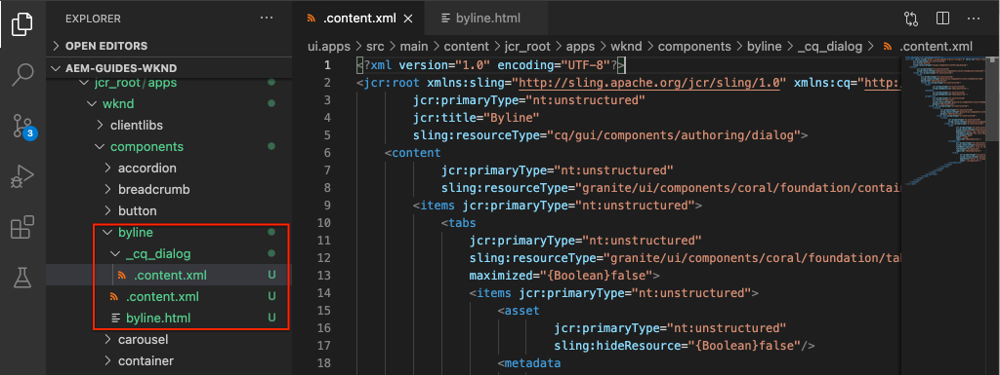

# 自定义组件 {#custom-component}

本教程涵盖自定义AEM Byline组件的端到端创建，该组件显示在对话框中创作的内容，并探索开发Sling模型以封装填充组件HTL的业务逻辑。

## 前提条件 {#prerequisites}

查看设置本地开发环境所需的工 [具和说明](overview.md#local-dev-environment)。

### 入门项目

>[!NOTE]
>
> 如果您在教程的前几部分中也进行了学习，您会注意到本章的入门项目加快了实施过程。 它包含多个模板和更多内容。 作为奖励，您可以在自定义组件开发之外自由探索新内容和实施的其他方面。

查看教程构建的基线代码：

1. 克隆 [github.com/adobe/aem-guides-wknd](https://github.com/adobe/aem-guides-wknd) repository。
1. 检查分 `custom-component/start` 支

   ```shell
   $ git clone git@github.com:adobe/aem-guides-wknd.git ~/code/aem-guides-wknd
   $ cd ~/code/aem-guides-wknd
   $ git checkout custom-component/start
   ```

1. 使用Maven技能将代码库部署到本地AEM实例：

   ```shell
   $ cd ~/code/aem-guides-wknd
   $ mvn clean install -PautoInstallSinglePackage
   ```

您始终可以在GitHub上视图完 [成的代码](https://github.com/adobe/aem-guides-wknd/tree/custom-component/solution) ，或通过切换到分支在本地签出代码 `custom-component/solution`。

## 目标

1. 了解如何构建自定义AEM组件
1. 学习将业务逻辑与Sling模型结合起来
1. 了解如何从HTL脚本中使用Sling模型

## 您将构建的内容 {#byline-component}

>[!VIDEO](https://video.tv.adobe.com/v/30181/?quality=12&learn=on)

在WKND教程的这一部分中，将创建一个署名组件，用于显示有关文章的作者的创作信息。


*由WKND设计团队提供的Byline组件可视设计*

Byline组件的实现包括收集署名内容的对话框和检索署名的自定义Sling模型：

* 名称
* 图像
* 职业

由HTL脚本显示，该脚本渲染浏览器最终显示的HTML。


*Byline分解*

## 创建署名组件 {#create-byline-component}

首先，创建Byline Component节点结构并定义一个对话框。 它表示AEM中的组件，并按组件在JCR中的位置隐式定义组件的资源类型。

该对话框显示内容作者可以提供的界面。 对于此实施，将利用AEM WCM **核心** Component的Image组件来处理Byline图像的创作和渲染，因此它将设置为我们组件的 `sling:resourceSuperType`。

### 创建组件节点 {#create-component-node}

1. 在ui. **apps模块中** ，导航到并 `/apps/wknd/components/content` 创建一个名为byline **的类型** 的新节点 `cq:Component`。

   

1. 将以下属性添加到Byline组件的节 `cq:Component` 点。

   ```plain
   jcr:title = Byline
   jcr:description = Displays a contributor's byline.
   componentGroup = WKND.Content
   sling:resourceSuperType =  core/wcm/components/image/v2/image
   ```

   

   这将产生此 `.content.xml` XML:

   ```xml
   <?xml version="1.0" encoding="UTF-8"?>
   <jcr:root
       xmlns:sling="https://sling.apache.org/jcr/sling/1.0" xmlns:jcr="https://www.jcp.org/jcr/1.0"
       jcr:primaryType="cq:Component"
       jcr:title="Byline"
       jcr:description="Displays a contributor's byline."
       componentGroup="WKND.Content"
       sling:resourceSuperType="core/wcm/components/image/v2/image"/>
   ```

### 创建HTL脚本 {#create-the-htl-script}

1. 在节 `byline` 点下，添加一个 `byline.html`新文件，该文件负责组件的HTML演示。 命名文件与节点相同 `cq:Component` 很重要，因为它将成为Sling用于呈现此资源类型的默认脚本。

1. 将以下代码添加到 `byline.html`。

   ```xml
   <!--/* byline.html */-->
   <div data-sly-use.placeholderTemplate="core/wcm/components/commons/v1/templates.html">
   </div>
   <sly data-sly-call="${placeholderTemplate.placeholder @ isEmpty=true}"></sly>
   ```

`byline.html` 在 [创建Sling](#byline-htl)Model后将重新访问。 HTL文件的当前状态允许组件在拖放到页面上时以空状态显示在AEM站点的页面编辑器中。

### 创建对话框定义 {#create-the-dialog-definition}

接下来，为Byline组件定义一个包含以下字段的对话框：

* **名称**:一个文本字段，该字段是参与者的姓名。
* **图像**:参考投稿人的生物图片。
* **职业**:一列表由贡献者贡献的职业。 职业应按字母顺序按升序（a至z）排序。

1. 在组件 `byline` 节点下，创建一个名为类型 `cq:dialog` 的新节 `nt:unstructured`点。
1. 使用以 `cq:dialog` 下XML更新。 最容易打开以下XML `.content.xml` 并将其复制／粘贴到其中。

   ```xml
   <?xml version="1.0" encoding="UTF-8"?>
   <jcr:root xmlns:sling="http://sling.apache.org/jcr/sling/1.0" xmlns:jcr="http://www.jcp.org/jcr/1.0"
           xmlns:nt="http://www.jcp.org/jcr/nt/1.0"
           jcr:primaryType="nt:unstructured"
           jcr:title="Byline"
           sling:resourceType="cq/gui/components/authoring/dialog">
       <content
               jcr:primaryType="nt:unstructured"
               sling:resourceType="granite/ui/components/coral/foundation/container">
           <items jcr:primaryType="nt:unstructured">
               <tabs
                       jcr:primaryType="nt:unstructured"
                       sling:resourceType="granite/ui/components/coral/foundation/tabs"
                       maximized="{Boolean}false">
                   <items jcr:primaryType="nt:unstructured">
                       <asset
                               jcr:primaryType="nt:unstructured"
                               sling:hideResource="{Boolean}false"/>
                       <metadata
                               jcr:primaryType="nt:unstructured"
                               sling:hideResource="{Boolean}true"/>
                       <properties
                               jcr:primaryType="nt:unstructured"
                               jcr:title="Properties"
                               sling:resourceType="granite/ui/components/coral/foundation/container"
                               margin="{Boolean}true">
                           <items jcr:primaryType="nt:unstructured">
                               <columns
                                       jcr:primaryType="nt:unstructured"
                                       sling:resourceType="granite/ui/components/coral/foundation/fixedcolumns"
                                       margin="{Boolean}true">
                                   <items jcr:primaryType="nt:unstructured">
                                       <column
                                               jcr:primaryType="nt:unstructured"
                                               sling:resourceType="granite/ui/components/coral/foundation/container">
                                           <items jcr:primaryType="nt:unstructured">
                                               <name
                                                       jcr:primaryType="nt:unstructured"
                                                       sling:resourceType="granite/ui/components/coral/foundation/form/textfield"
                                                       emptyText="Enter the contributor's name to display."
                                                       fieldDescription="The contributor's name to display."
                                                       fieldLabel="Name"
                                                       name="./name"
                                                       required="{Boolean}true"/>
                                               <occupations
                                                       jcr:primaryType="nt:unstructured"
                                                       sling:resourceType="granite/ui/components/coral/foundation/form/multifield"
                                                       fieldDescription="A list of the contributor's occupations."
                                                       fieldLabel="Occupations"
                                                       required="{Boolean}false">
                                                   <field
                                                           jcr:primaryType="nt:unstructured"
                                                           sling:resourceType="granite/ui/components/coral/foundation/form/textfield"
                                                           emptyText="Enter an occupation"
                                                           name="./occupations"/>
                                               </occupations>
                                           </items>
                                       </column>
                                   </items>
                               </columns>
                           </items>
                       </properties>
                   </items>
               </tabs>
           </items>
       </content>
   </jcr:root>
   ```

   这些节点定义 [使用Sling Resource Mergare](https://sling.apache.org/documentation/bundles/resource-merger.html) （Sling资源合并）来控制从组件继承的 `sling:resourceSuperType` 对话框选项卡，在此例中为 **核心组件的图像组件**。

   

### 创建策略对话框 {#create-the-policy-dialog}

按照与创建对话框相同的方法，创建策略对话框（以前称为设计对话框），以隐藏从核心组件的图像组件继承的策略配置中不需要的字段。

1. 在该节 `byline` 点下， `cq:Component` 创建一个名为类型的 `cq:design_dialog` 新节点 `nt:unstructured`。
1. 使用以 `cq:design_dialog` 下XML更新。 打开并复制／粘 `.content.xml` 贴下面的XML最简单。

   ```xml
   <?xml version="1.0" encoding="UTF-8"?>
   <jcr:root xmlns:sling="http://sling.apache.org/jcr/sling/1.0" xmlns:granite="http://www.adobe.com/jcr/granite/1.0" xmlns:cq="http://www.day.com/jcr/cq/1.0" xmlns:jcr="http://www.jcp.org/jcr/1.0" xmlns:nt="http://www.jcp.org/jcr/nt/1.0"
       jcr:primaryType="nt:unstructured"
       jcr:title="Byline"
       sling:resourceType="cq/gui/components/authoring/dialog">
       <content
               jcr:primaryType="nt:unstructured">
           <items jcr:primaryType="nt:unstructured">
               <tabs
                       jcr:primaryType="nt:unstructured">
                   <items jcr:primaryType="nt:unstructured">
                       <properties
                               jcr:primaryType="nt:unstructured">
                           <items jcr:primaryType="nt:unstructured">
                               <content
                                       jcr:primaryType="nt:unstructured">
                                   <items jcr:primaryType="nt:unstructured">
                                       <decorative
                                               jcr:primaryType="nt:unstructured"
                                               sling:hideResource="{Boolean}true"/>
                                       <altValueFromDAM
                                               jcr:primaryType="nt:unstructured"
                                               sling:hideResource="{Boolean}true"/>
                                       <titleValueFromDAM
                                               jcr:primaryType="nt:unstructured"
                                               sling:hideResource="{Boolean}true"/>
                                       <displayCaptionPopup
                                               jcr:primaryType="nt:unstructured"
                                               sling:hideResource="{Boolean}true"/>
                                       <disableUuidTracking
                                               jcr:primaryType="nt:unstructured"
                                               sling:hideResource="{Boolean}true"/>
                                   </items>
                               </content>
                           </items>
                       </properties>
                       <features
                               jcr:primaryType="nt:unstructured">
                           <items jcr:primaryType="nt:unstructured">
                               <content
                                       jcr:primaryType="nt:unstructured">
                                   <items jcr:primaryType="nt:unstructured">
                                       <accordion
                                               jcr:primaryType="nt:unstructured">
                                           <items jcr:primaryType="nt:unstructured">
                                               <orientation
                                                       jcr:primaryType="nt:unstructured"
                                                       sling:hideResource="{Boolean}true"/>
                                               <crop
                                                       jcr:primaryType="nt:unstructured"
                                                       sling:hideResource="{Boolean}true"/>
                                           </items>
                                       </accordion>
                                   </items>
                               </content>
                           </items>
                       </features>
                   </items>
               </tabs>
           </items>
       </content>
   </jcr:root>
   ```

   前面的策略对 **话框** XML的基础是从核心组 [件图像组件获取的](https://github.com/adobe/aem-core-wcm-components/blob/master/content/src/content/jcr_root/apps/core/wcm/components/image/v2/image/_cq_design_dialog/.content.xml)。

   与对话框配置中一样， [Sling Resource Mergare](https://sling.apache.org/documentation/bundles/resource-merger.html) （Sling资源合并）用于隐藏从中继承的不相关字段 `sling:resourceSuperType`，如带属性的节点定义所 `sling:hideResource="{Boolean}true"` 示。

### 部署代码 {#deploy-the-code}

1. 使用Maven技能将更新的代码库部署到本地AEM实例：

   ```shell
   $ cd ~/code/aem-guides-wknd
   $ mvn clean install -PautoInstallPackage
   ```

### Add the component to a page {#add-the-component-to-a-page}

为了使开发过程保持简单并专注于AEM组件开发，我们将将处于当前状态的Byline组件添加到文章页面，以验证节点定义已部署并正确，AEM可以识别新组件定义，并且组件的对话框可用于创作。 `cq:Component`

由于我 [们将Byline组件添加到 **WKND.Content** Component Group](#create-component-node)，因此通过属性，它可以自动用于任何LayoutPolicy允许其WKND.Content `/apps/wknd/components/content/byline@componentGroup=WKND.Content`************ 组件的容器布局，该布局是文章页面的容器的布局。

#### Drag and drop the component onto the page {#drag-and-drop-the-component-onto-the-page}

1. **在AEM** > Sites > WKND Site > Language **主控 > English > Magazine > Ultimate Guide to LA Skateparks中编辑文章页**。
1. 从左侧提要栏中，将一个 **Byline组件** 拖放 **到已打开文** 章页面的布局容器的底部。

   

#### 创作组件 {#author-the-component}

AEM作者通过对话框配置和创作组件。 此时，在Byline组件的开发中，将包含用于收集数据的对话框，但渲染创作内容的逻辑尚未添加。

1. 确保左侧 **提要栏处于打开** 、可见状态，并 **且资产查找器已** 被选中。

   

1. 选择 **Byline组件占位符**，它依次显示操作栏和点 **按扳手图** 标以打开对话框。

   

1. 在对话框打开且第一个选项卡（资产）处于活动状态时，打开左侧提要栏，并从资产查找器中将图像拖入图像拖放区。 搜索“stacey”以查找WKND ui.content包中提供的Stacey Roswells生物图片。

   **[stacey-roswells.jpg](assets/custom-component/stacey-roswells.jpg)**

   

1. 添加图像后，单击“属性” **选项卡** ，输入“名 **称** ”和 **“职**&#x200B;业”。

   输入职业时，按反向 **字母顺序** 输入，这样我们在Sling模型中将执行的按字母顺序排列的业务逻辑就显而易见了。

   点按右 **下方** 的“完成”按钮以保存更改。

   

1. 保存对话框后，导航到 [CRXDE Lite](http://localhost:4502/crx/de/index.jsp#/content/wknd/language-masters/en/magazine/guide-la-skateparks/jcr:content/root/responsivegrid/responsivegrid/byline) ，并查看组件内容在AEM页面下的byline组件内容节点上的存储方式。

   在节点（即，“AE”）下找 `jcr:content/root/responsivegrid/responsivegrid` 到Byline组件内容节点 `/content/wknd/language-masters/en/magazine/guide-la-skateparks/jcr:content/root/responsivegrid/responsivegrid/byline`

   注意属性名 `name`称 `occupations`、和 `fileReference` 存储在byline节 **点上**。

   另外，请注 `sling:resourceType` 意，节点的设置是将 `wknd/components/content/byline` 此内容节点绑定到Byline组件实现的内容。

   

   */content/wknd/language-masters/cn/magazine/guide-la-skateparks/jcr:content/root/root/responsivegrid/responsivegrid/byline*

## 创建署名Sling模型 {#create-sling-model}

接下来，我们将创建一个Sling模型来充当数据模型，并为Byline组件提供业务逻辑。

Sling Models是注释驱动的Java“POJO”(Plain Old Java Objects)，它有助于将数据从JCR映射到Java变量，并在AEM环境中进行开发时提供许多其他细节。

### 查看Maven依赖项 {#maven-dependency}

Byline Sling Model将依赖AEM提供的多个Java API。 这些API通过模块 `dependencies` 的POM文 `core` 件中列出的可用。

1. 打开下方 `pom.xml` 的文件 `<src>/aem-guides-wknd/core/pom.xml`。
1. 在pom文件的 `uber-jar` 依赖关系部分中查找依赖关系：

   ```xml
   ...
       <dependency>
           <groupId>com.adobe.aem</groupId>
           <artifactId>uber-jar</artifactId>
           <classifier>apis</classifier>
       </dependency>
   ...
   ```

   uber- [jar包含AEM](https://docs.adobe.com/content/help/en/experience-manager-65/developing/devtools/ht-projects-maven.html#experience-manager-api-dependencies) 公开的所有公共Java API。 请注意，文件中未指定版 `core/pom.xml` 本。 而是将版本保留在位于项目根的父反应器pom中 `aem-guides-wknd/pom.xml`。

1. 查找以下对象的依 `core.wcm.components.core`赖关系：

   ```xml
    <!-- Core Component Dependency -->
       <dependency>
           <groupId>com.adobe.cq</groupId>
           <artifactId>core.wcm.components.core</artifactId>
       </dependency>
   ```

   这是AEM核心组件公开的所有公共Java API。 AEM核心组件是在AEM外维护的项目，因此具有单独的发布周期。 因此，它是需要单独包含的依赖项，不 **包含** 在uber-jar中。

   与uber-jar一样，此依赖关系的版本会保留在位于的父级反应器pom文件中 `aem-guides-wknd/pom.xml`。

   在本教程的稍后部分，我们将使用核心组件图像类在Byline组件中显示图像。 为了构建和编译我们的Sling模型，必须具有核心组件依赖性。

### Byline接口 {#byline-interface}

为Byline创建公共Java接口。 `Byline.java` 定义驱动HTL脚本所需的公 `byline.html` 用方法。

1. 在下方 `aem-guides-wknd.core` 的模块 `src/main/java,` 中，通过右键单击“包”>“新建”>“界面”来创建一个名 `Byline.java` 为的新的Java `com.adobe.aem.guides.wknd.core.models`****&#x200B;接口。 输入 **Byline** 作为接口名称，然后单击“完成”。

   

1. 使用 `Byline.java` 以下方法进行更新：

   ```java
   package com.adobe.aem.guides.wknd.core.models;
   
   import java.util.List;
   
   /**
   * Represents the Byline AEM Component for the WKND Site project.
   **/
   public interface Byline {
       /***
       * @return a string to display as the name.
       */
       String getName();
   
       /***
       * Occupations are to be sorted alphabetically in a descending order.
       *
       * @return a list of occupations.
       */
       List<String> getOccupations();
   
       /***
       * @return a boolean if the component has enough content to display.
       */
       boolean isEmpty();
   }
   ```

   前两种方法显示Byline组件 **的名****称和职** 业的值。

   该方 `isEmpty()` 法用于确定组件是否包含任何要渲染的内容，或是否正在等待配置。

   请注意，图像没有任何方法； [我们稍后会看看为什么](#tackling-the-image-problem)。

### 署名实施 {#byline-implementation}

`BylineImpl.java` 是实现先前定义的接口的 `Byline.java` Sling Model的实现。 此部分的 `BylineImpl.java` 底部可找到完整的代码。

1. 在下面 `core` 的模块 `src/main/java`中，通过右键单击包并选择“新建”>“类”，创 **建一个名为BylineImpl** .java的新类文 `com.adobe.aem.guides.wknd.core.models.impl` 件 ****。

   对于名称，输入 **BylineImpl**。 将Byline **接口添加** 为实现接口。

   

1. 打开 `BylineImpl.java`. 它会自动填充在界面中定义的所有方法 `Byline.java`。 通过更新以下类级批注 `BylineImpl.java` 来添加Sling Model注释。 此注 `@Model(..)`释将类转换为Sling模型的内容。

   ```java
   import org.apache.sling.api.SlingHttpServletRequest;
   import org.apache.sling.models.annotations.Model;
   import org.apache.sling.models.annotations.DefaultInjectionStrategy;
   ...
   @Model(
           adaptables = {SlingHttpServletRequest.class},
           adapters = {Byline.class},
           resourceType = {BylineImpl.RESOURCE_TYPE},
           defaultInjectionStrategy = DefaultInjectionStrategy.OPTIONAL
   )
   public class BylineImpl implements Byline {
       protected static final String RESOURCE_TYPE = "wknd/components/content/byline";
       ...
   }
   ```

   让我们查看此注释及其参数：

   * 当注 `@Model` 释部署到AEM时，注释将BylineImpl注册为Sling模型。
   * 参 `adaptables` 数指定此模型可由请求调整。
   * 该 `adapters` 参数允许在Byline接口下注册实现类。 这允许HTL脚本通过接口调用Sling Model（而不是直接调用）。 [有关适配器的更多详细信息，请参阅此处](https://sling.apache.org/documentation/bundles/models.html#specifying-an-alternate-adapter-class-since-110)。
   * 该 `resourceType` 组件指向Byline组件资源类型（以前创建），如果存在多个实现，则有助于解析正确的模型。 [有关将模型类与资源类型关联的更多详细信息，请参阅此处](https://sling.apache.org/documentation/bundles/models.html#associating-a-model-class-with-a-resource-type-since-130)。

### Sling模型方法的实现 {#implementing-the-sling-model-methods}

#### getName() {#implementing-get-name}

我们要解决的第一个方 `getName()` 法是，它只将存储到署名的JCR内容节点的值返回到属性下 `name`。

对于此， `@ValueMapValue` Sling Model注释用于使用请求资源的ValueMap将值注入Java字段。

```java
...
import org.apache.sling.models.annotations.injectorspecific.ValueMapValue;
...
public class BylineImpl implements Byline {
    ...

    @ValueMapValue
    private String name;

    ...
    @Override
    public String getName() {
        return name;
    }
    ...
}
```

由于JCR属性与Java字段的名称相同（两者均为“名称”），因此 `@ValueMapValue` 会自动解析此关联并将属性的值注入Java字段。

#### getSchrops() {#implementing-get-occupations}

下一个实现方法是 `getOccupations()`。 此方法会收集JCR属性中存储的所 `occupations` 有职业，并返回其按字母顺序排序的集合。

使用在属性值中探 `getName()` 索的相同技术，可以注入Sling模型的场。

一旦JCR属性值通过注入的Java字段在Sling Model中可 `occupations`用，排序业务逻辑便可应用于该方 `getOccupations()` 法。

```java
import java.util.ArrayList;
import java.util.Collections;
...

public class BylineImpl implements Byline {
    ...
    @ValueMapValue
    private List<String> occupations;
    ...
    public List<String> getOccupations() {
        if (occupations != null) {
            Collections.sort(occupations);
            return new ArrayList<String>(occupations);
        } else {
            return Collections.emptyList();
        }
    }
    ...
}
...
```

#### isEmpty() {#implementing-is-empty}

最后一个公共方法 `isEmpty()` 确定组件何时应考虑“创作足够”进行渲染。

对于此组件，我们有业务要求，规定必须填写所有三个字段、名称、图像和职 *业* ，才能渲染组件。

```java
import org.apache.commons.lang3.StringUtils;
...
public class BylineImpl implements Byline {
    ...
    @Override
    public boolean isEmpty() {
        if (StringUtils.isBlank(name)) {
            // Name is missing, but required
            return true;
        } else if (occupations == null || occupations.isEmpty()) {
            // At least one occupation is required
            return true;
        } else if (/* image is not null, logic to be determined */) {
            // A valid image is required
            return true;
        } else {
            // Everything is populated, so this component is not considered empty
            return false;
        }
    }
    ...
}
```

#### 解决&quot;形象问题&quot; {#tackling-the-image-problem}

检查名称和占用条件很琐碎(Apache Commons Lang3提供始终方便的 [StringUtils](https://commons.apache.org/proper/commons-lang/apidocs/org/apache/commons/lang3/StringUtils.html) 类)，但是，由于使用核心组件图像组件来显示图像，因此不清楚如何 **验证图像的存在** 。

有两种方法可以解决这个问题：

1. 检查JCR属 `fileReference` 性是否解析为资产。
1. 将此资源转换为核心组件图像Sling模型并确保 `getSrc()` 该方法不为空。

   我们选择第二 **种方** 法。 第一种方法可能已足够，但在本教程中，后一种方法将用于允许我们探索Sling Models的其他功能。

1. 创建获取图像的专用方法。 此方法保留为私有，因为我们无需在HTL本身中公开Image对象，它只用于驱动 `isEmpty().`

   以下专用方法 `getImage()`:

   ```java
   import com.adobe.cq.wcm.core.components.models.Image;
   ...
   private Image getImage() {
       Image image = null;
       // Figure out how to populate the image variable!
       return image;
   }
   ```

   如上所述，获取图像Sling模型还有两 **种方法**:

   第一个组件使 `@Self` 用注释，自动将当前请求调整为核心组件的 `Image.class`

   ```java
   @Self
   private Image image;
   ```

   第二种方法使 [用Apache Sling ModelFactory](https://sling.apache.org/apidocs/sling10/org/apache/sling/models/factory/ModelFactory.html) OSGi服务，这是一项非常方便的服务，它帮助我们以Java代码创建其他类型的Sling模型。

   我们将选择第二种方法。

   >[!NOTE]
   >
   >在实际实施中，首选方法为“一”, `@Self` 因为它是更简单、更优雅的解决方案。 在本教程中，我们将使用第二种方法，因为它要求我们探索Sling模型的更多方面，这些方面非常有用，是更复杂的组件！

   由于Sling Models是Java POJO的，而不是OSGi Services，因此不能使 `@Reference` 用 **通常的** OSGi注入注释，而Sling Models提供了提供类似功能 **[的特殊@OSGiService](https://sling.apache.org/documentation/bundles/models.html#injector-specific-annotations)** 。

1. 更新 `BylineImpl.java` 以包含注 `OSGiService` 释以插入 `ModelFactory`:

   ```java
   import org.apache.sling.models.factory.ModelFactory;
   import org.apache.sling.models.annotations.injectorspecific.OSGiService;
   ...
   public class BylineImpl implements Byline {
       ...
       @OSGiService
       private ModelFactory modelFactory;
   }
   ```

   有了这 `ModelFactory` 些功能，可以使用以下方式创建核心组件图像Sling模型：

   ```java
   modelFactory.getModelFromWrappedRequest(SlingHttpServletRequest request, Resource resource, java.lang.Class<T> targetClass)
   ```

   但是，此方法需要请求和资源，但Sling模型中均不提供。 要获得这些注释，请使用更多Sling Model注释！

   要获取当前请求， **[@Self](https://sling.apache.org/documentation/bundles/models.html#injector-specific-annotations)** annotation可用于将(在 `adaptable` “为”中定义) `@Model(..)` 注入 `SlingHttpServletRequest.class`到Java类字段中。

1. 添加 **@Self** 批注以获取 **SlingHttpServletRequest请求**:

   ```java
   import org.apache.sling.models.annotations.injectorspecific.Self;
   ...
   @Self
   private SlingHttpServletRequest request;
   ```

   请记住， `@Self Image image` 使用插入核心组件图像Sling模型是上述选项——注释会尝试 `@Self` 插入可调整的对象（在我们的例子中为SlingHttpServletRequest）并适应注释字段类型。 由于核心组件图像Sling模型可以从SlingHttpServletRequest对象进行调整，因此这样会起作用，并且代码比我们更探索的方法少。

   现在，我们已经注入了通过ModelFactory API实例化我们的映像模型所需的变量。 在Sling模型实例化后， **[我们将使用](https://sling.apache.org/documentation/bundles/models.html#postconstruct-methods)** Sling Model的@PostConstruct注释来获取此对象。

   `@PostConstruct` 它非常有用，并且其作用容量与构造函数类似，但是，在类被实例化并注入所有注释的Java字段后，将调用它。 其他Sling Model注释注释Java类字段（变量） `@PostConstruct` ，注释一个void，零参数方法，通常命 `init()` 名（但可以命名任何内容）。

1. 添加 **@PostConstruct** 方法：

   ```java
   import javax.annotation.PostConstruct;
   ...
   public class BylineImpl implements Byline {
       ...
       private Image image;
   
       @PostConstruct
       private void init() {
           image = modelFactory.getModelFromWrappedRequest(request,
                                                           request.getResource(),
                                                           Image.class);
       }
       ...
   }
   ```

   请记住，Sling Models **不是** OSGi Services，因此维护类状态是安全的。 通常 `@PostConstruct` 派生并设置Sling Model类状态供以后使用，这与普通构造函数的操作类似。

   请注意，如果 `@PostConstruct` 方法引发异常，Sling Model将不会实例化（它将为null）。

1. **现在可更新** getImage()以只返回图像对象。

   ```java
   /**
       * @return the Image Sling Model of this resource, or null if the resource cannot create a valid Image Sling Model.
   */
   private Image getImage() {
       return image;
   }
   ```

1. 让我们回到并 `isEmpty()` 完成实施：

   ```java
   @Override
   public boolean isEmpty() {
       ...
       } else if (getImage() == null || StringUtils.isBlank(getImage().getSrc())) {
           // A valid image is required
           return true;
       } else {
       ...
   }
   ```

   请注意，多次调 `getImage()` 用并不成问题，因为返回已初始 `image` 化的类变量，并且不调用 `modelFactory.getModelFromWrappedRequest(...)` 它不会过于昂贵，但值得避免不必要的调用。

1. 最后一 `BylineImpl.java` 项应该如下：

   ```java
   package com.adobe.aem.guides.wknd.core.models.impl;
   
   import java.util.ArrayList;
   import java.util.Collections;
   import java.util.List;
   
   import javax.annotation.PostConstruct;
   
   import org.apache.commons.lang3.StringUtils;
   import org.apache.sling.api.SlingHttpServletRequest;
   import org.apache.sling.models.annotations.DefaultInjectionStrategy;
   import org.apache.sling.models.annotations.Model;
   import org.apache.sling.models.annotations.injectorspecific.OSGiService;
   import org.apache.sling.models.annotations.injectorspecific.Self;
   import org.apache.sling.models.annotations.injectorspecific.ValueMapValue;
   import org.apache.sling.models.factory.ModelFactory;
   
   import com.adobe.aem.guides.wknd.core.models.Byline;
   import com.adobe.cq.wcm.core.components.models.Image;
   
   @Model(
           adaptables = {SlingHttpServletRequest.class},
           adapters = {Byline.class},
           resourceType = {BylineImpl.RESOURCE_TYPE},
           defaultInjectionStrategy = DefaultInjectionStrategy.OPTIONAL
   )
   public class BylineImpl implements Byline {
       protected static final String RESOURCE_TYPE = "wknd/components/content/byline";
   
       @Self
       private SlingHttpServletRequest request;
   
       @OSGiService
       private ModelFactory modelFactory;
   
       @ValueMapValue
       private String name;
   
       @ValueMapValue
       private List<String> occupations;
   
       private Image image;
   
       @PostConstruct
       private void init() {
           image = modelFactory.getModelFromWrappedRequest(request, request.getResource(), Image.class);
       }
   
       @Override
       public String getName() {
           return name;
       }
   
       @Override
       public List<String> getOccupations() {
           if (occupations != null) {
               Collections.sort(occupations);
               return new ArrayList<String>(occupations);
           } else {
               return Collections.emptyList();
           }
       }
   
       @Override
       public boolean isEmpty() {
           final Image image = getImage();
   
           if (StringUtils.isBlank(name)) {
               // Name is missing, but required
               return true;
           } else if (occupations == null || occupations.isEmpty()) {
               // At least one occupation is required
               return true;
           } else if (image == null || StringUtils.isBlank(image.getSrc())) {
               // A valid image is required
               return true;
           } else {
               // Everything is populated, so this component is not considered empty
               return false;
           }
       }
   
       /**
       * @return the Image Sling Model of this resource, or null if the resource cannot create a valid Image Sling Model.
       */
       private Image getImage() {
           return image;
       }
   }
   ```

## Byline HTL {#byline-htl}

在模 `ui.apps` 块中，打 `/apps/wknd/components/content/byline/byline.html` 开我们在之前设置的AEM组件中创建的。

```html
<div data-sly-use.placeholderTemplate="core/wcm/components/commons/v1/templates.html">
</div>
<sly data-sly-call="${placeholderTemplate.placeholder @ isEmpty=false}"></sly>
```

我们来看一下此HTL脚本到目前为止的功能：

* 该 `placeholderTemplate` 指向核心组件的占位符，当组件未完全配置时显示该占位符。 如上所述，在AEM Sites页面编辑器中，该编辑器呈现为带有组件标题的框 `cq:Component`，如属 `jcr:title` 性。

* 加载 `data-sly-call="${placeholderTemplate.placeholder @ isEmpty=false}` 上面定 `placeholderTemplate` 义的代码，并将布尔值（当前硬编码为）传递 `false`到占位符模板。 如果 `isEmpty` 为true，占位符模板将呈现灰色框，否则将不呈现任何内容。

### 更新Byline HTL

1. 使用 **以下框架** HTML结构更新byline.html:

   ```xml
   <div data-sly-use.placeholderTemplate="core/wcm/components/commons/v1/templates.html"
       class="cmp-byline">
           <div class="cmp-byline__image">
               <!-- Include the Core Components Image Component -->
           </div>
           <h2 class="cmp-byline__name"><!-- Include the name --></h2>
           <p class="cmp-byline__occupations"><!-- Include the occupations --></p>
   </div>
   <sly data-sly-call="${placeholderTemplate.placeholder @ isEmpty=true}"></sly>
   ```

   请注意，CSS类遵循BEM [命名规范](https://getbem.com/naming/)。 虽然使用BEM约定不是强制性的，但建议使用BEM，因为它在核心组件CSS类中使用，并且通常会生成清晰、可读的CSS规则。

#### 在HTL中实例化Sling模型对象 {#instantiating-sling-model-objects-in-htl}

使用 [块语句](https://github.com/adobe/htl-spec/blob/master/SPECIFICATION.md#221-use) ，将Sling Model对象实例化到HTL脚本中，并将其指定给HTL变量。

`data-sly-use.byline="com.adobe.aem.guides.wknd.models.Byline"` 使用由BylineImpl实现的Byline接口(com.adobe.aem.guides.wknd.models.Byline)并将当前SlingHttpServletRequest调整为它，结果将存储在HTL变量名byline( `data-sly-use.<variable-name>`)中。

1. 更新外部 `div` 以通过 **其公共接口引** 用Byline Sling模型：

   ```xml
   <div data-sly-use.byline="com.adobe.aem.guides.wknd.core.models.Byline"
       data-sly-use.placeholderTemplate="core/wcm/components/commons/v1/templates.html"
       class="cmp-byline">
       ...
   </div>
   ```

#### Sling模型的访问方法 {#accessing-sling-model-methods}

HTL从JSTL中借入，并使用相同的缩短Java getter方法名称。

例如，调用Byline Sling Model的方 `getName()` 法可以缩短为 `byline.name`，而不是 `byline.isEmpty`缩短为 `byline.empty`。 使用全方法名 `byline.getName` 或 `byline.isEmpty`，同样有效。 请注 `()` 意，HTL中从不使用调用方法（与JSTL相似）。

HTL中不能使用需 **要** 参数的Java方法。 这是为了使HTL中的逻辑保持简单而设计的。

1. 可以通过在Byline Sling Model上或在HTL中调 `getName()` 用方法将Byline名称添加到组件： `${byline.name}`.

   更新标 `h2` 记：

   ```xml
   <h2 class="cmp-byline__name">${byline.name}</h2>
   ```

#### 使用HTL表达式选项 {#using-htl-expression-options}

[HTL表达式选项](https://github.com/adobe/htl-spec/blob/master/SPECIFICATION.md#12-available-expression-options) 在HTL中的内容上充当修饰符，范围从日期格式到i18n转换。 表达式还可用于加入列表或数值数组，这是以逗号分隔的格式显示占领区所需的。

表达式通过HTL表达式 `@` 中的运算符进行添加。

1. 要使用“, ”加入职业列表，使用以下代码：

   ```html
   <p class="cmp-byline__occupations">${byline.occupations @ join=', '}</p>
   ```

#### 有条件地显示占位符 {#conditionally-displaying-the-placeholder}

AEM组件的大多数HTL脚本都利用占 **位符范** ，为作者提供可视提示， **表明某个组件创作不正确，并且不会在AEM发布上显示**。 推动此决定的惯例是对组件的支持Sling Model实施一种方法，在我们的案例中： `Byline.isEmpty()`.

`isEmpty()` 在Byline Sling Model上调用，结果(或者，它的负值，通过运 `!``hasContent`算符)将保存到名为：

1. 更新外部 `div` 以保存名为：的HTL变 `hasContent`量

   ```html
    <div data-sly-use.byline="com.adobe.aem.guides.wknd.core.models.Byline"
         data-sly-use.placeholderTemplate="core/wcm/components/commons/v1/templates.html"
         data-sly-test.hasContent="${!byline.empty}"
         class="cmp-byline">
         ...
   </div>
   ```

   请注意， `data-sly-test`HTL块的使 `test` 用有趣之处在于，它都设置了HTL变量，并且根据HTL表达式的结果是否真实来呈现／不呈现它所基于的HTML元素。 如果为“truthy”，则HTML元素渲染，否则不渲染。

   现在，可 `hasContent` 以重新使用此HTL变量有条件地显示／隐藏占位符。

1. 使用以下代码将条 `placeholderTemplate` 件调用更新到文件底部：

   ```html
   <sly data-sly-call="${placeholderTemplate.placeholder @ isEmpty=!hasContent}"></sly>
   ```

#### 使用核心组件显示图像 {#using-the-core-components-image}

HTL脚本现 `byline.html` 在几乎已完成，只缺少图像。

```html
<!--/* current progress of byline.html */-->
<div data-sly-use.byline="com.adobe.aem.guides.wknd.core.models.Byline"
     data-sly-use.placeholderTemplate="core/wcm/components/commons/v1/templates.html"
     data-sly-test.hasContent="${!byline.empty}"
     class="cmp-byline">
    <div class="cmp-byline__image">
        <!-- Include the Core Components Image component -->
    </div>
    <h2 class="cmp-byline__name">${byline.name}</h2>
    <p class="cmp-byline__occupations">${byline.occupations @ join=', '}</p>
</div>
<sly data-sly-call="${placeholderTemplate.placeholder @ isEmpty=!hasContent}"></sly>
```

由于我们 `sling:resourceSuperType` 使用核心组件图像组件来提供图像的创作，因此我们还可以使用核心组件图像组件来渲染图像！

为此，我们需要包含当前的署名资源，但使用资源类型强制使用核心组件图像组件的资源类型 `core/wcm/components/image/v2/image`。 这是一种强大的组件重用模式。 为此，使用HTL `data-sly-resource` 的块。

1. 使用 `div` 以下类替 `cmp-byline__image` 换该类：

   ```html
   <div class="cmp-byline__image"
       data-sly-resource="${ '.' @ resourceType = 'core/wcm/components/image/v2/image' }"></div>
   ```

   这 `data-sly-resource`通过相对路径包括当前资源，并 `'.'`强制将当前资源（或署名内容资源）包含在资源类型中 `core/wcm/components/image/v2/image`。

   核心组件资源类型是直接使用的，而不是通过代理使用的，因为这是脚本内使用的，它永远不会保留到我们的内容中。

2. 完成 `byline.html` 时间如下：

   ```html
   <div data-sly-use.byline="com.adobe.aem.guides.wknd.core.models.Byline"
       data-sly-use.placeholderTemplate="core/wcm/components/commons/v1/templates.html"
       data-sly-test.hasContent="${!byline.empty}"
       class="cmp-byline">
       <div class="cmp-byline__image"
            data-sly-resource="${ '.' @ resourceType = 'core/wcm/components/image/v2/image' }">
       </div>
           <h2 class="cmp-byline__name">${byline.name}</h2>
           <p class="cmp-byline__occupations">${byline.occupations @ join=','}</p>
   </div>
   <sly data-sly-call="${placeholderTemplate.placeholder @ isEmpty=!hasContent}"></sly>
   ```

3. 将代码库部署到本地AEM实例。 由于对POM文件进行了重大更改，因此从项目的根目录执行完全Maven内部版本。

   >[!WARNING]
   >
   > 请注意，WKND项目已设置为 `ui.content` 将覆盖JCR中的任何更改，因此，我们希望确保仅部署项目，以避免擦除之前添加到文章页面的 `ui.apps` Byline组件。

   ```shell
   $ cd ~/code/aem-guides-wknd/ui.apps
   $ mvn -PautoInstallPackage clean install
   ...
   Package imported.
   Package installed in 338ms.
   [INFO] ------------------------------------------------------------------------
   [INFO] BUILD SUCCESS
   [INFO] ------------------------------------------------------------------------
   ```

#### 查看未设置样式的Byline组件 {#reviewing-the-unstyled-byline-component}

1. 部署更新后，导航到Ultimate [Guide to LA Skateparks页 ](http://localhost:4502/editor.html/content/wknd/language-masters/en/magazine/guide-la-skateparks.html) 面，或在本章前面添加Byline组件的任何地方。

1. 图 **像**、名 **称和职**&#x200B;业现在出现 **** ，我们有一个未设置样式但正在工作的Byline组件。

   

#### 查看Sling Model注册 {#reviewing-the-sling-model-registration}

AEM [Web控制台的Sling Models状态视图显示AEM中](http://localhost:4502/system/console/status-slingmodels) ，所有已注册的Sling模型。 通过查看此列表，可以验证Byline Sling模型是否已安装并已识别。

如果 **此列表** 中未显示BylineImpl，则可能存在Sling模型的注释问题，或者Sling模型未添加到核心项目中注册的Sling模型包(com.adobe.aem.guides.wknd.core.models)。


*http://localhost:4502/system/console/status-slingmodels*

## 署名样式 {#byline-styles}

Byline组件需要设置样式以与Byline组件的创意设计保持一致。 这将通过使用SCSS来实现，AEM通过ui. **frontend Maven子项目** 提供SCSS支持。

设计样式后，Byline组件应采用以下美感。


*由WKND创意团队定义的署名组件设计*

### 添加默认样式

为Byline组件添加默认样式。 在ui. **frontend项目中** ，位于 `/src/main/webpack/components/content`:

1. 创建名为的新文件夹 `byline`。
1. 在名为的文件夹下新建 `byline` 一个文件 `scss`夹。
1. 在名为的文件夹下 `byline/scss` 创建新文 `byline.scss`件。
1. 在名为的文件夹下新建 `byline/scss` 一个文件 `styles`夹。
1. 在名为的文件夹下 `byline/scss/styles` 创建新文 `default.scss`件。

   

1. 开始, **通过填充byline** .scss来包含默认样式：

   ```scss
    /* WKND Byline styles */
   @import 'styles/default';
   ```

1. 将Byline实现CSS（写作为SCSS）添加到 `default.scss`:

   ```scss
   .cmp-byline {
       $imageSize: 60px;
   
       .cmp-byline__image {
           float: left;
   
       /* This class targets a Core Component Image CSS class */
       .cmp-image__image {
           width: $imageSize;
           height: $imageSize;
           border-radius: $imageSize / 2;
           object-fit: cover;
           }
       }
   
       .cmp-byline__name {
           font-size: $font-size-large;
           font-family: $font-family-serif;
           padding-top: 0.5rem;
           margin-left: $imageSize + 25px;
           margin-bottom: .25rem;
           margin-top:0rem;
       }
   
       .cmp-byline__occupations {
           margin-left: $imageSize + 25px;
           color: $gray;
           font-size: $font-size-xsmall;
           text-transform: uppercase;
       }
   }
   ```

1. 在ui. `main.scss` frontend项 **目下打开文件** , `/src/main/webpack/site` 并在部分中添加以下 `/* Components */` 行：

   ```scss
   @import '../components/content/byline/scss/byline.scss';
   ```

1. 使用NPM构建 `ui.frontend` 和编译模块：

   ```shell
    $ cd ~/code/aem-guides-wknd/ui.frontend
    $ npm run dev
   ```

1. 使用Maven构建并 `ui.apps` 部署项目(该项目将转 `ui.frontend` 移包含项目)到本地AEM实例：

   ```shell
    $ cd ~/code/aem-guides-wknd/ui.apps
    $ mvn clean install -PautoInstallPackage
   ```

   >[!TIP]
   >
   >您可能需要清除浏览器缓存以确保不提供旧版CSS，并使用Byline组件刷新页面以获得完整样式。

## 整合 {#putting-it-together}

下面是完全创作和设置样式的Byline组件在AEM页面上的外观。


观看以下视频，快速了解本教程中构建的功能。

>[!VIDEO](https://video.tv.adobe.com/v/30174/?quality=12&learn=on)

## 恭喜！ {#congratulations}

祝贺您，您刚刚使用Adobe Experience Manager从头开始创建了自定义组件！

### 后续步骤 {#next-steps}

通过探索如何为Byline Java代码编写JUnit测试，确保一切正确开发，并实现的业务逻辑正确完整，继续了解AEM组件开发。

* [编写单元测试或AEM组件](unit-testing.md)

在GitHub上视图完 [成的代码](https://github.com/adobe/aem-guides-wknd) ，或在Git浏览器中本地查看并部署代码 `custom-component/solution`。

1. 克隆 [github.com/adobe/aem-guides-wknd](https://github.com/adobe/aem-guides-wknd) repository。
1. 检查分 `custom-component/solution` 支

## 疑难解答 {#troubleshooting}

### 缺少源文件夹

如果在Eclipse中看不到 `src/main/java` 源文件夹，可以通过右键单击“src”并添加主文件夹和java文件夹来添加文件夹。 添加文件夹后，将显示 `src/main/java` 包。

### 未解析的包


>[!NOTE]
>
> 如果您尚未解析为某些添加到核心项目的新依赖关系导入的包，请尝试更新aem-guides-wknd maven项目，这反过来将更新所有子项目。 您可以通过右键单击aem-guides-wknd > **Maven >更新项目来执行此操作**。
