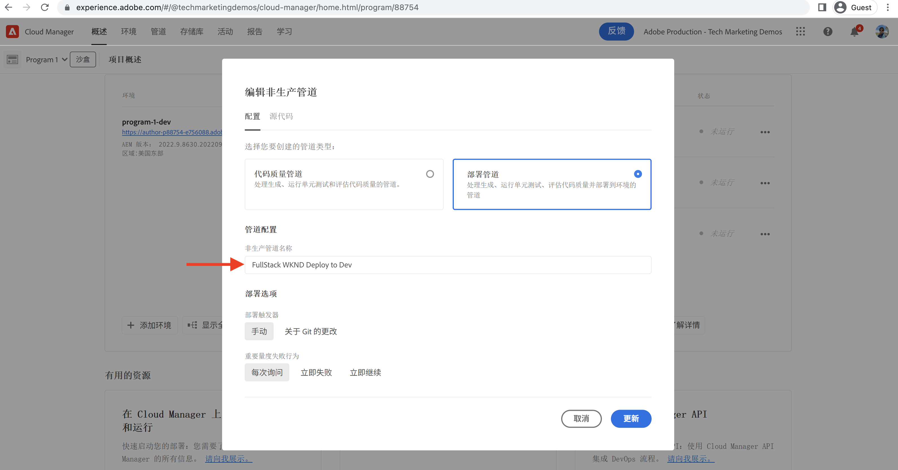
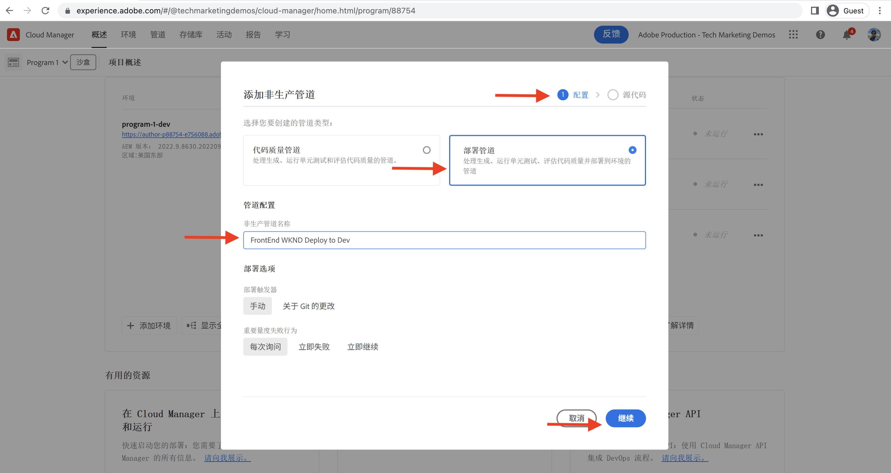
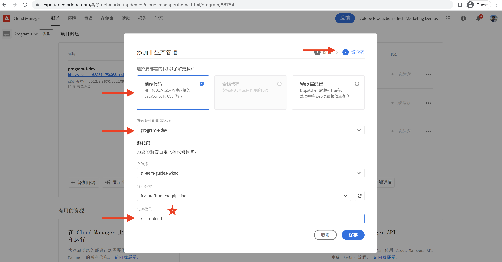
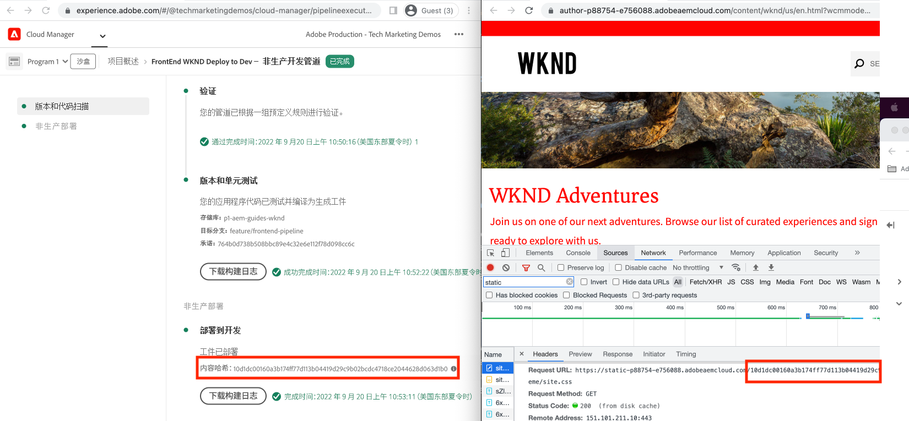

# 使用前端管道部署

在本章中，我们将在AdobeCloud Manager中创建并运行前端管道。 它仅从构建文件 `ui.frontend` 模块并将它们部署到AEMas a Cloud Service中的内置CDN。 因此从  `/etc.clientlibs` 基于前端资源的交付。

## 目标 {#objectives}

* 创建并运行前端管道。
* 验证前端资源是否未从 `/etc.clientlibs` 但是从以开头的新主机名 `https://static-`

## 使用前端管道

>[!VIDEO](https://video.tv.adobe.com/v/3409420?quality=12&learn=on)

## 前提条件 {#prerequisites}

这是一个多部分教程，假定其中包含了 [更新标准AEM项目](./update-project.md) 已完成。

确保您拥有 [在Cloud Manager中创建和部署管道的权限](https://experienceleague.adobe.com/docs/experience-manager-cloud-manager/content/requirements/users-and-roles.html?lang=en#role-definitions) 和 [访问AEMas a Cloud Service环境](https://experienceleague.adobe.com/docs/experience-manager-cloud-service/content/implementing/using-cloud-manager/manage-environments.html).

## 重命名现有管道

重命名现有管道，从 __部署到开发__ 到  __FullStack WKND部署到开发__ 通过转到 __配置__ 选项卡 __非生产管道名称__ 字段。 这是为了通过查看管道名称来明确说明管道是全栈管道还是前端管道。

同时在 __源代码__ 选项卡中，确保存储库和Git分支字段值正确，并且分支包含您对前端管道合同所做的更改。

## 创建前端管道

至 __仅__ 从构建和部署前端资源 `ui.frontend` 模块中，执行以下步骤：

1. 在Cloud Manager UI中，从 __管道__ 部分，单击 __添加__ 按钮，然后选择 __添加非生产管道__ (或 __添加生产管道__)根据要部署到的AEMas a Cloud Service环境。

1. 在 __添加非生产管道__ 对话框，作为 __配置__ 步骤，选择 __部署管道__ 选项，将其命名为 __前端WKND部署到开发环境__，然后单击 __继续__

1. 作为 __源代码__ 步骤，选择 __前端代码__ 选项，然后从中选择环境 __符合条件的部署环境__. 在 __源代码__ 部分确保“存储库”和“Git分支”字段值正确，并且分支具有您前端管道合同更改。
和 __最重要的是__ 对于 __代码位置__ 字段的值为 `/ui.frontend` 最后，单击 __保存__.

## 部署序列

* 首先运行新重命名的 __FullStack WKND部署到开发__ 用于从AEM存储库中删除WKND clientlib文件的管道。 最重要的是，通过添加以下内容为AEM做好准备以签订前端管道合同 __Sling配置__ 文件(`SiteConfig`， `HtmlPageItemsConfig`)。

>[!WARNING]
>
>之后， __FullStack WKND部署到开发__ 管道完成您将拥有 __无样式__ WKND站点，它可能已损坏。 请计划停机或在奇数小时进行部署，这是您必须在从使用单个全栈管道到前端管道的初始切换期间计划的一次性中断。

* 最后，运行 __前端WKND部署到开发环境__ 仅要构建的管道 `ui.frontend` 模块并将前端资源直接部署到CDN。

>[!IMPORTANT]
>
>您注意到 __无样式__ WKND站点已恢复正常，而且这一次 __前端__ 管道执行比全栈管道快得多。

## 验证样式更改和新投放模式

* 打开WKND网站的任何页面，您会看到文本颜色 __Adobe红__ 和前端资源(CSS、JS)文件从CDN交付。 资源请求主机名开头为 `https://static-pXX-eYY.p123-e456.adobeaemcloud.com/$HASH_VALUE$/theme/site.css` 同样，也可以使用site.js或您在 `HtmlPageItemsConfig` 文件。

>[!TIP]
>
>此 `$HASH_VALUE$` 以下内容与您在“ ”中看到的内容相同 __前端WKND部署到开发环境__  管道的 __内容哈希__ 字段。 AEM会收到有关前端资源的CDN URL的通知，该值将存储在 `/conf/wknd/sling:configs/com.adobe.cq.wcm.core.components.config.HtmlPageItemsConfig/jcr:content` 下 __前缀路径__ 属性。

## 恭喜！ {#congratulations}

恭喜，您已创建、运行并验证仅构建和部署WKND Sites项目的“ui.frontend”模块的前端管道。 现在，您的前端团队可以在整个AEM项目生命周期之外快速迭代站点的设计和前端行为。

## 后续步骤 {#next-steps}

在下一章中， [注意事项](considerations.md)，您将了解对前端和后端开发过程的影响。
