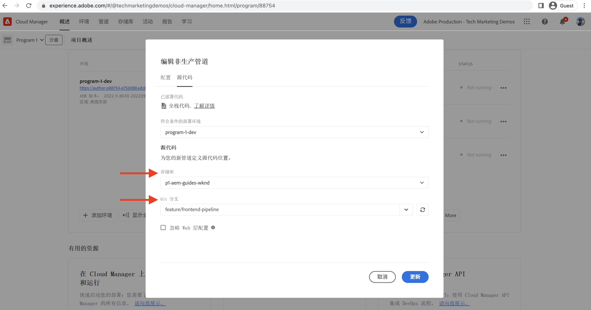

# 使用前端管道进行部署

在本章中，我们将在 Adobe Cloud Manager 中创建并运行前端管道。它仅构建 `ui.frontend` 模块的文件，并将它们部署到 AEM as a Cloud Service 中的内置内容传递网络。这样就不再使用基于 `/etc.clientlibs` 的前端资源交付。

## 目标 {#objectives}

* 创建和运行前端管道。
* 验证前端资源不是从 `/etc.clientlibs` 提供，而是通过一个以 `https://static-` 开头的新主机名交付。

## 使用前端管道

>[!VIDEO](https://video.tv.adobe.com/v/3409420?quality=12&learn=on)

## 先决条件 {#prerequisites}

这是一个多段式教程，并且假设您已完成[更新标准 AEM 项目](./update-project.md)中概述的步骤。

确保您具有[在 Cloud Manager 中创建和部署管道的权限](https://experienceleague.adobe.com/docs/experience-manager-cloud-manager/content/requirements/users-and-roles.html?lang=zh-hans#role-definitions)以及[对 AEM as a Cloud Service 环境的访问权限](https://experienceleague.adobe.com/docs/experience-manager-cloud-service/content/implementing/using-cloud-manager/manage-environments.html)。

## 重命名现有管道

前往&#x200B;__配置__&#x200B;选项卡的&#x200B;__非生产管道名称__&#x200B;字段，将现有管道从&#x200B;__部署到开发__&#x200B;重命名为&#x200B;__全栈 WKND 部署到开发__。这是为了仅通过查看其名称就可以明确知道管道是全栈的还是前端的。

另外，在&#x200B;__源代码__&#x200B;选项卡中，确保存储库和 Git 分支字段值正确，并且分支里包含了您的前端管道契约变更。

## 创建前端管道

要&#x200B;__仅__&#x200B;从 `ui.frontend` 模块构建和部署前端资源，请执行以下步骤：

1. 在 Cloud Manager UI 中，在&#x200B;__管道__&#x200B;部分点击&#x200B;__添加__&#x200B;按钮，然后根据您要部署到那里的 AEM as a Cloud Service 环境，选择&#x200B;__添加非生产管道__（或&#x200B;__添加生产管道__）。

1. 在&#x200B;__添加非生产管道__&#x200B;对话框中，作为&#x200B;__配置__&#x200B;步骤的一部分，选择&#x200B;__部署管道__&#x200B;选项，将其命名为&#x200B;__前端 WKND 部署到开发__，然后点击&#x200B;__继续__

1. 作为&#x200B;__源代码__&#x200B;步骤的一部分，选择&#x200B;__前端代码__&#x200B;选项，并从&#x200B;__合格部署环境__&#x200B;中选取环境。在&#x200B;__源代码__&#x200B;部分，确保存储库和 Git 分支字段值正确，并且分支里包含了您的前端管道契约变更。对于&#x200B;__代码位置__&#x200B;字段&#x200B;__最重要的是__&#x200B;确保值为 `/ui.frontend`，最后点击&#x200B;__保存__。

## 部署序列

* 首先运行刚刚重命名的&#x200B;__全栈 WKND 部署到开发__&#x200B;管道，从 AEM 存储库中移除 WKND 客户端库文件。最重要的是，通过添加 __Sling 配置__&#x200B;文件（`SiteConfig`、`HtmlPageItemsConfig`），准备 AEM 符合前端管道契约。

>[!WARNING]
>
>__全栈 WKND 部署到开发__&#x200B;管道完成后，您将获得一个&#x200B;__无样式的__ WKND 网站，可能无法正确显示。请计划安排停机或在非常规时间进行部署，这是从使用单个全栈管道到使用前端管道的首次切换过程中必须计划安排的一次性中断。

* 最后，运行&#x200B;__前端 WKND 部署到开发__&#x200B;管道，仅构建 `ui.frontend` 模块，然后将前端资源直接部署到内容传递网络。

>[!IMPORTANT]
>
>您会看到&#x200B;__无样式的__ WKND 网站恢复正常，这一次，__前端__&#x200B;管道执行速度比全栈管道快得多。

## 验证样式变化和新的交付范式

* 打开 WKND 网站的任何页面，您都可以看到文字颜色为 __Adobe 红色__，并且前端资源（CSS、JS）文件来自内容传递网络。资源请求主机名以 `https://static-pXX-eYY.p123-e456.adobeaemcloud.com/$HASH_VALUE$/theme/site.css` 开头，site.js 或您在 `HtmlPageItemsConfig` 文件中引用的任何其他静态资源也是类似。

>[!TIP]
>
>这里的 `$HASH_VALUE$` 和您在&#x200B;__前端 WKND 部署到开发__&#x200B;管道的 __CONTENT HASH__ 字段中看到的一样。前端资源的内容传递网络 URL 告知 AEM，此值存储在 `/conf/wknd/sling:configs/com.adobe.cq.wcm.core.components.config.HtmlPageItemsConfig/jcr:content` 的 __prefixPath__ 属性中。

## 恭喜！ {#congratulations}

祝贺您创建、运行并验证了仅构建和部署 WKND 网站项目的“ui.frontend”模块的前端管道。现在，您的前端团队可以在完整的 AEM 项目生命周期之外快速迭代网站的设计和前端行为。

## 后续步骤 {#next-steps}

在下一章[考虑事项](considerations.md)中，您将了解对前端和后端开发过程的影响。
