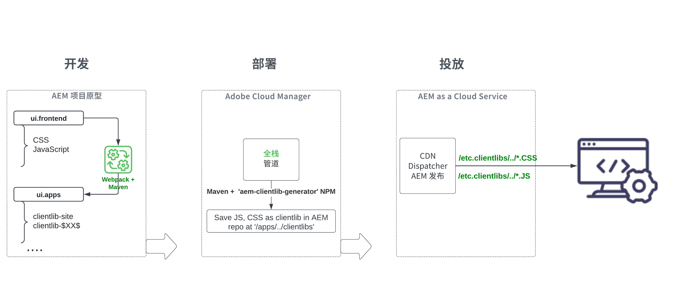

# 查看全栈AEM项目的“ui.frontend”模块 {#aem-full-stack-ui-frontent}

在本章中，我们回顾了全栈AEM项目的前端工件的开发、部署和交付，重点是的“ui.frontend”模块 __WKND站点项目__.


## 目标 {#objective}

* 了解AEM全栈项目中前端工件的生成和部署流程
* 查看AEM全栈项目的 `ui.frontend` 模块的 [webpack](https://webpack.js.org/) 配置
* AEM客户端库（也称为clientlibs）生成过程

## AEM全栈和快速站点创建项目的前端部署流程

>[!IMPORTANT]
>
>本视频说明并演示了这两种应用程序的前端流程 **全栈和快速站点创建** 项目概述前端资源构建、部署和交付模型中的细微差异。

>[!VIDEO](https://video.tv.adobe.com/v/3409344?quality=12&learn=on)

## 前提条件 {#prerequisites}


* 克隆 [AEM WKND站点项目](https://github.com/adobe/aem-guides-wknd)
* 构建克隆的AEM WKND Sites项目并将其部署到AEMas a Cloud Service。

请参阅AEM WKND站点项目 [README.md](https://github.com/adobe/aem-guides-wknd/blob/main/README.md) 以了解更多详细信息。

## AEM全栈项目前端构件流 {#flow-of-frontend-artifacts}

以下是 __开发、部署和交付__ 全栈AEM项目中的前端工件流。




在开发阶段，通过更新中的CSS、JS文件来执行前端更改，如样式更改和重新品牌化 `ui.frontend/src/main/webpack` 文件夹。 然后，在构建期间， [webpack](https://webpack.js.org/) module-bundler和maven插件将这些文件转换为下面优化的AEM clientlibs `ui.apps` 模块。

运行时，将前端更改部署到AEMas a Cloud Service环境 [__全栈__ Cloud Manager中的管道](https://experienceleague.adobe.com/docs/experience-manager-cloud-service/content/implementing/using-cloud-manager/cicd-pipelines/introduction-ci-cd-pipelines.html).

前端资源通过以开头的URI路径交付给Web浏览器 `/etc.clientlibs/`和通常都会缓存在AEM Dispatcher和CDN上。


>[!NOTE]
>
> 同样地，在 __AEM快速站点创建历程__， [前端更改](https://experienceleague.adobe.com/docs/experience-manager-cloud-service/content/sites/administering/site-creation/quick-site/customize-theme.html) AEM as a Cloud Service通过运行 __前端__ 管道，请参见 [设置您的管道](https://experienceleague.adobe.com/docs/experience-manager-cloud-service/content/sites/administering/site-creation/quick-site/pipeline-setup.html)

### 查看WKND站点项目中的Webpack配置 {#development-frontend-webpack-clientlib}

* 有三个 __webpack__ 用于捆绑WKND站点前端资源的配置文件。

   1. `webpack.common`  — 这包含 __公共__ 用于指示WKND资源捆绑和优化的配置。 此 __输出__ 属性指明在何处发出它创建的统一文件(也称为JavaScript捆绑包，但不要与AEM OSGi捆绑包混淆)。 默认名称设置为 `clientlib-site/js/[name].bundle.js`.

  ```javascript
      ...
      output: {
              filename: 'clientlib-site/js/[name].bundle.js',
              path: path.resolve(__dirname, 'dist')
          }
      ...    
  ```

   1. `webpack.dev.js` 包含 __开发__ webpack-dev-serve的配置并指向要使用的HTML模板。 它还包含在上运行的AEM实例的代理配置 `localhost:4502`.

  ```javascript
      ...
      devServer: {
          proxy: [{
              context: ['/content', '/etc.clientlibs', '/libs'],
              target: 'http://localhost:4502',
          }],
      ...    
  ```

   1. `webpack.prod.js` 包含 __生产__ 并使用插件将开发文件转换为优化的包。

  ```javascript
      ...
      module.exports = merge(common, {
          mode: 'production',
          optimization: {
              minimize: true,
              minimizer: [
                  new TerserPlugin(),
                  new CssMinimizerPlugin({ ...})
          }
      ...    
  ```


* 捆绑的资源将移至 `ui.apps` 模块使用 [aem-clientlib-generator](https://www.npmjs.com/package/aem-clientlib-generator) 插件，使用在中管理的配置 `clientlib.config.js` 文件。

```javascript
    ...
    const BUILD_DIR = path.join(__dirname, 'dist');
    const CLIENTLIB_DIR = path.join(
    __dirname,
    '..',
    'ui.apps',
    'src',
    'main',
    'content',
    'jcr_root',
    'apps',
    'wknd',
    'clientlibs'
    );
    ...
```

* 此 __frontend-maven-plugin__ 从 `ui.frontend/pom.xml` 在AEM项目构建期间编排webpack捆绑包和clientlib生成。

`$ mvn clean install -PautoInstallSinglePackage`

### 部署到AEMas a Cloud Service {#deployment-frontend-aemaacs}

此 [__全栈__ 管道](https://experienceleague.adobe.com/docs/experience-manager-cloud-service/content/implementing/using-cloud-manager/cicd-pipelines/introduction-ci-cd-pipelines.html?#full-stack-pipeline) 将这些更改部署到AEMas a Cloud Service环境。


### 从AEMas a Cloud Service投放 {#delivery-frontend-aemaacs}

通过全栈管道部署的前端资源将作为从AEM站点交付到Web浏览器 `/etc.clientlibs` 文件。 您可以通过访问 [公开托管的WKND站点](https://wknd.site/content/wknd/us/en.html) 和查看网页源。

```html
    ....
    <link rel="stylesheet" href="/etc.clientlibs/wknd/clientlibs/clientlib-site.lc-181cd4102f7f49aa30eea548a7715c31-lc.min.css" type="text/css">

    ...

    <script async src="/etc.clientlibs/wknd/clientlibs/clientlib-site.lc-d4e7c03fe5c6a405a23b3ca1cc3dcd3d-lc.min.js"></script>
    ....
```

## 恭喜！ {#congratulations}

恭喜，您已查看全栈项目的ui.frontend模块

## 后续步骤 {#next-steps}

在下一章中， [更新项目以使用前端管道](update-project.md)中，您将更新AEM WKND Sites项目以便为前端管道合同启用它。
