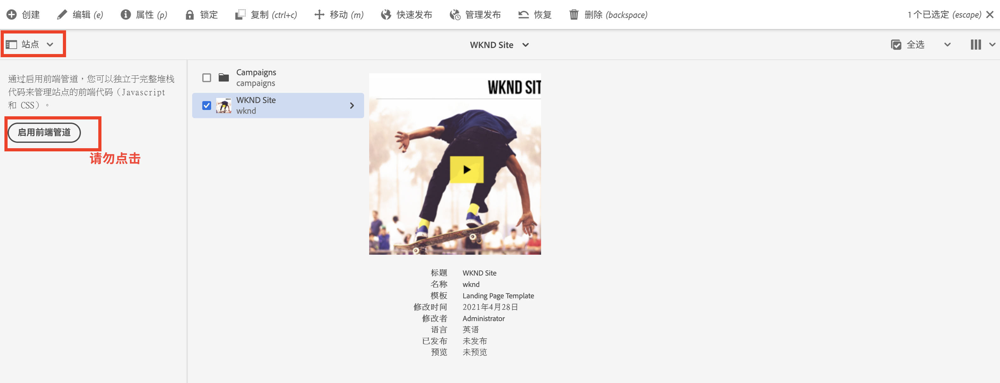

# 更新全栈AEM项目以使用前端管道 {#update-project-enable-frontend-pipeline}

在本章中，我们对&#x200B;__WKND Sites项目__&#x200B;进行了配置更改，以使用前端管道部署JavaScript和CSS，而不是要求完全的全栈管道执行。 这将前端和后端工件的开发和部署生命周期分离，从而允许在整个开发过程中实现更快速、迭代的开发过程。

## 目标 {#objectives}

* 更新全栈项目以使用前端管道

## 全栈AEM项目中的配置更改概述

>[!VIDEO](https://video.tv.adobe.com/v/3453619?quality=12&learn=on&captions=chi_hans)

## 先决条件 {#prerequisites}

这是一个多部分教程，假定您已查看[&#39;ui.frontend&#39;模块](./review-uifrontend-module.md)。


## 对全栈AEM项目的更改

有三项与项目相关的配置更改和一项要为测试运行部署的样式更改，因此WKND项目中总共有四项特定的更改，以便为前端管道合同启用它。

1. 从全栈构建周期中删除`ui.frontend`模块

   * 在中，WKND Sites项目的根`pom.xml`注释了`<module>ui.frontend</module>`子模块条目。

   ```xml
       ...
       <modules>
       <module>all</module>
       <module>core</module>
       <!--
       <module>ui.frontend</module>
       -->                
       <module>ui.apps</module>
       ...
   ```

   * 来自`ui.apps/pom.xml`的与注释相关的依赖项

   ```xml
       ...
       <!-- ====================================================================== -->
       <!-- D E P E N D E N C I E S                                                -->
       <!-- ====================================================================== -->
           ...
       <!--
           <dependency>
               <groupId>com.adobe.aem.guides</groupId>
               <artifactId>aem-guides-wknd.ui.frontend</artifactId>
               <version>${project.version}</version>
               <type>zip</type>
           </dependency>
       -->    
       ...
   ```

1. 通过添加两个新的webpack配置文件为前端管道合同准备`ui.frontend`模块。

   * 将现有`webpack.common.js`复制为`webpack.theme.common.js`，并更改`output`属性和`MiniCssExtractPlugin`、`CopyWebpackPlugin`插件配置参数，如下所示：

   ```javascript
   ...
   output: {
           filename: 'theme/js/[name].js', 
           path: path.resolve(__dirname, 'dist')
       }
   ...
   
   ...
       new MiniCssExtractPlugin({
               filename: 'theme/[name].css'
           }),
       new CopyWebpackPlugin({
           patterns: [
               { from: path.resolve(__dirname, SOURCE_ROOT + '/resources'), to: './clientlib-site' }
           ]
       })
   ...
   ```

   * 将现有`webpack.prod.js`复制为`webpack.theme.prod.js`，并将`common`变量的位置更改为上述文件的位置

   ```javascript
   ...
       const common = require('./webpack.theme.common.js');
   ...
   ```

   >[!NOTE]
   >
   >以上两个“webpack”配置更改将具有不同的输出文件和文件夹名称，因此我们可以轻松区分clientlib（全栈）和生成的主题（前端）管道前端工件。
   >
   >如您所知，也可以跳过上述更改以使用现有Webpack配置，但需要以下更改。
   >
   >这取决于您想要如何命名或组织它们。


   * 在`package.json`文件中，确保`name`属性值与`/conf`节点中的站点名称相同。 在`scripts`属性下，有一个`build`脚本指示如何从此模块构建前端文件。

   ```javascript
       {
       "name": "wknd",
       "version": "1.0.0",
       ...
   
       "scripts": {
           "build": "webpack --config ./webpack.theme.prod.js"
       }
   
       ...
       }
   ```

1. 通过添加两个Sling配置为前端管道准备`ui.content`模块。

   * 在`com.adobe.cq.wcm.core.components.config.HtmlPageItemsConfig`处创建文件 — 这包括`ui.frontend`模块使用webpack生成过程在`dist`文件夹下生成的所有前端文件。

   ```xml
   ...
       <css
       jcr:primaryType="nt:unstructured"
       element="link"
       location="header">
       <attributes
           jcr:primaryType="nt:unstructured">
           <as
               jcr:primaryType="nt:unstructured"
               name="as"
               value="style"/>
           <href
               jcr:primaryType="nt:unstructured"
               name="href"
               value="/theme/site.css"/>
   ...
   ```

   >[!TIP]
   >
   >    在&#x200B;__AEM WKND站点项目__&#x200B;中查看完整的[HtmlPageItemsConfig](https://github.com/adobe/aem-guides-wknd/blob/feature/frontend-pipeline/ui.content/src/main/content/jcr_root/conf/wknd/_sling_configs/com.adobe.cq.wcm.core.components.config.HtmlPageItemsConfig/.content.xml)。


   * 其次`com.adobe.aem.wcm.site.manager.config.SiteConfig`的`themePackageName`值与`package.json`和`name`属性值相同，`siteTemplatePath`指向`/libs/wcm/core/site-templates/aem-site-template-stub-2.0.0`存根路径值。

   ```xml
   ...
       <?xml version="1.0" encoding="UTF-8"?>
       <jcr:root xmlns:sling="http://sling.apache.org/jcr/sling/1.0" xmlns:jcr="http://www.jcp.org/jcr/1.0" xmlns:nt="http://www.jcp.org/jcr/nt/1.0"
               jcr:primaryType="nt:unstructured"
               siteTemplatePath="/libs/wcm/core/site-templates/aem-site-template-stub-2.0.0"
               themePackageName="wknd">
       </jcr:root>
   ...
   ```

   >[!TIP]
   >
   >    查看&#x200B;__AEM WKND站点项目__&#x200B;中的完整[SiteConfig](https://github.com/adobe/aem-guides-wknd/blob/feature/frontend-pipeline/ui.content/src/main/content/jcr_root/conf/wknd/_sling_configs/com.adobe.aem.wcm.site.manager.config.SiteConfig/.content.xml)。

1. 主题或样式更改为通过测试运行的前端管道进行部署，我们正在通过更新`ui.frontend/src/main/webpack/base/sass/_variables.scss`将`text-color`更改为Adobe红（或者您也可以自行选择）。

   ```css
       $black:     #a40606;
       ...
   ```

最后，将这些更改推送到您项目的Adobe Git存储库。


>[!AVAILABILITY]
>
> 这些更改在&#x200B;__AEM WKND Sites项目__&#x200B;的&#x200B;[__前端管道__](https://github.com/adobe/aem-guides-wknd/tree/feature/frontend-pipeline)分支内的GitHub上可用。


## 警告 — _启用前端管道_&#x200B;按钮

[边栏选择器](https://experienceleague.adobe.com/docs/experience-manager-cloud-service/content/sites/authoring/getting-started/basic-handling.html?lang=zh-Hans)的[站点](https://experienceleague.adobe.com/docs/experience-manager-cloud-service/content/sites/authoring/getting-started/basic-handling.html?lang=zh-Hans)选项在选择您的站点根或站点页面时显示&#x200B;**启用前端管道**&#x200B;按钮。 单击&#x200B;**启用前端管道**&#x200B;按钮将覆盖上述&#x200B;**Sling配置**，请确保在通过Cloud Manager管道执行部署上述更改后，**您未单击**&#x200B;此按钮。



如果错误地单击它，则必须重新运行管道，以确保前端管道合同和更改恢复。

## 恭喜！ {#congratulations}

恭喜，您已更新WKND Sites项目以便为前端管道合同启用它。

## 后续步骤 {#next-steps}

在下一章[使用前端管道部署](create-frontend-pipeline.md)中，您将创建并运行前端管道，并验证我们如何&#x200B;__离开__&#x200B;基于“/etc.clientlibs”的前端资源交付。
