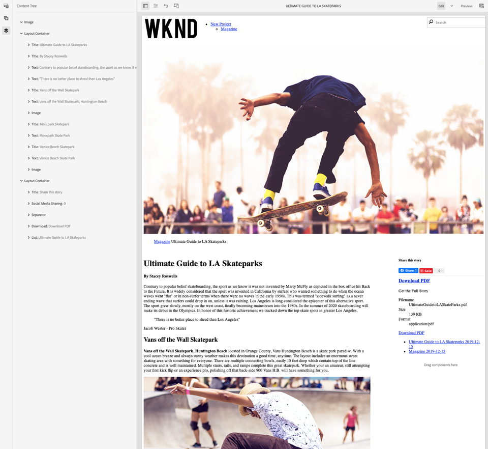
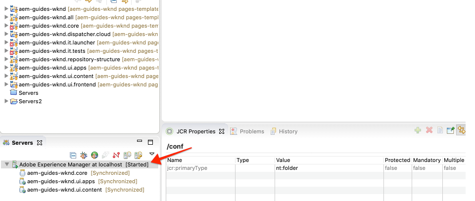

# 页面和模板 {#pages-and-template}

在本章中，我们将探讨基本页面组件与可编辑模板之间的关系。 我们将根据AdobeXD中的某些模型构建未设置样式的文章 [模板](https://www.adobe.com/products/xd.html)。 在构建模板的过程中，将介绍可编辑模板的核心组件和高级策略配置。

## 前提条件 {#prerequisites}

查看设置本地开发环境所需的工 [具和说明](overview.md#local-dev-environment)。

### 入门项目

查看教程构建的基线代码：

1. 克隆 [github.com/adobe/aem-guides-wknd](https://github.com/adobe/aem-guides-wknd) repository。
1. 看看那 `pages-templates/start` 个分支。

   ```shell
   $ git clone git@github.com:adobe/aem-guides-wknd.git ~/code/aem-guides-wknd
   $ cd ~/code/aem-guides-wknd
   $ git checkout pages-templates/start
   ```

1. 使用Maven技能将代码库部署到本地AEM实例：

   ```shell
   $ cd ~/code/aem-guides-wknd
   $ mvn clean install -PautoInstallSinglePackage
   ```

您始终可以在GitHub上视图完 [成的代码](https://github.com/adobe/aem-guides-wknd/tree/pages-templates/solution) ，或通过切换到分支在本地签出代码 `pages-templates/solution`。

## 目标

1. Inspect在Adobe XD创建的页面设计并将其映射到核心组件。
1. 了解可编辑模板的详细信息，以及如何使用策略来实施对页面内容的精细控制。
1. 了解模板和页面的链接方式

## 您将构建的内容 {#what-you-will-build}

在本教程的这一部分中，您将构建一个新的文章页面模板，该模板可用于创建新文章页面并与通用结构对齐。 文章页面模板将基于AdobeXD中生成的设计和UI套件。 本章只侧重于构建模板的结构或骨架。 将不实施样式，但模板和页面将正常工作。


## UI规划与Adobe XD {#adobexd}

在大多数情况下，利用模型和静态设计规划新网站开始。 [Adobe XD](https://www.adobe.com/products/xd.html) 是一种构建用户体验的设计工具。 接下来，我们将检查UI套件和模型，以帮助规划文章页面模板的结构。

>[!VIDEO](https://video.tv.adobe.com/v/30214/?quality=12&learn=on)

下载WKND [文章设计文件](https://github.com/adobe/aem-guides-wknd/releases/download/aem-guides-wknd-0.0.2/AEM_UI-kit-WKND-article-design.xd)。

## 使用体验片段创建页眉和页脚 {#experience-fragments}

创建全局内容（如页眉或页脚）时的常见做法是使用体验 [片段](https://docs.adobe.com/content/help/en/experience-manager-learn/sites/experience-fragments/experience-fragments-feature-video-use.html)。 体验片段，允许我们组合多个组件以创建单个可引用的组件。 体验片段具有支持多站点管理的优势，并允许我们按区域设置管理不同的页眉／页脚。

接下来，我们将更新要用作页眉和页脚的体验片段，以添加WKND徽标。

>[!VIDEO](https://video.tv.adobe.com/v/30215/?quality=12&learn=on)

>[!NOTE]
>
> 您的体验片段在视频中的外观是否与视频不同？ 尝试删除它们并重新安装启动项目代码库。

以下是在上述视频中执行的高级步骤。

1. 更新位于http://localhost:4502/editor.html/content/experience-fragments/wknd/us/en/site/header/master.html的Experience Fragment Header [](http://localhost:4502/editor.html/content/experience-fragments/wknd/us/en/site/header/master.html) ，以包含WKND Dark徽标。

   

   *WKND Dark徽标*

1. 更新位于http://localhost:4502/editor.html/content/experience-fragments/wknd/us/en/site/footer/master.html的体验片 [段头](http://localhost:4502/editor.html/content/experience-fragments/wknd/us/en/site/footer/master.html) ，以包含WKND Light徽标。

   

   *WKND Light徽标*

## 创建文章页面模板

创建页面时，您必须选择一个模板，以用作创建新页面的基础。模板可定义生成页面的结构、初始内容和允许的组件。

可编辑模板有3个主 [要区域](https://docs.adobe.com/content/help/en/experience-manager-65/developing/platform/templates/page-templates-editable.html):

1. **结构** -定义属于模板的组件。 内容作者将不能编辑这些内容。
1. **初始内容** -定义模板将与之开始的组件，内容作者可以编辑和／或删除这些组件
1. **策略** -定义有关组件行为方式以及作者将具有哪些选项的配置。

接下来我们将创建文章页面模板。 这将在AEM的本地实例中发生。

>[!VIDEO](https://video.tv.adobe.com/v/30217/?quality=12&learn=on)

以下是在上述视频中执行的高级步骤。

1. 导航到WKND Sites Template文件夹： **“工具** ”> **“常规** ” **>“模** 板” **>“WKND站点”**
1. 使用标题为文章页 **面模板的WKND站点** “空页面”模板类 **型创建新模板**
1. 在结 **构模** 式中，配置模板以包含以下元素：

   * 体验片段标题
   * 图像
   * 痕迹导航
   * 容器- 8列宽的桌面，12列宽的平板电脑，移动
   * 容器- 4列宽， 12列宽平板电脑，移动
   * 体验片段页脚

   

   *结构——文章页面模板*

1. 切换到“ **初始内容** ”模式，并添加以下组件作为启动内容：

   * **主容器**
      * 标题——默认大小H1
      * 标题- *“按作者姓名* ”，大小为H4
      * 文本——空
   * **侧容器**
      * 标题- *大小为H* 5的“分享此故事”
      * 社交媒体共享
      * 分隔符
      * 下载
      * 列表

   

   *初始内容——文章页面模板*

1. 更新“ **初始页面属性** ”以启用Facebook和Pinterest **的******“用户共享”。
1. 将图像上传到 **文章页面模板的属性** ，以便轻松识别它：

   

   *文章页面模板缩略图*

1. 在“WKND **站点模板”文件夹中** ，启 [用文章页面模板](http://localhost:4502/libs/wcm/core/content/sites/templates.html/conf/wknd/settings/wcm/templates)。

## 创建文章页面

既然我们有了模板，让我们使用该模板创建一个新页面。

1. 下载以下zip包 [WKND-PagesTemplates-DAM-Assets.zip](assets/pages-templates/WKND-PagesTemplates-DAM-Assets.zip) ，并通过CRX包管 [理器安装它](http://localhost:4502/crx/packmgr/index.jsp)。

   上述包将在下面安装多个图像和资 `/content/dam/wknd/en/magazine/la-skateparks` 产，以便在后续步骤中填充文章页面。

   *上述包中的图像和资源由Unsplash.com免[费提供许可](https://unsplash.com/)。*

   

1. 在“WKND”>“美国 **”>“Magazine”** 下面创建一 **个名为“Magazine** ”的 ********&#x200B;新页面。 使用内 **容页面** 模板。

   本页将为我们的站点添加一些结构，并允许我们查看痕迹导航组件的实际操作情况。

1. 然后，在“WKND”>“美国 **”>“Magazine** ”下方创 **建一**********&#x200B;个新页面。 使用文 **章页面** 模板。 使用LA Skateparks **的Ultimate指南** ，以及 **guide-la-skateparks的名称**。

   

1. 使用内容填充页面，以便与在UI Planning中检查的 [模型与AdobeXD部分](#adobexd) 匹配。 示例文章文本可在 [此处下载](assets/pages-templates/la-skateparks-copy.txt)。 您应该能够创建类似于以下内容的内容：

   

   >[!NOTE]
   >
   > 页面顶部的图像组件可以编辑但不能删除。 痕迹导航组件显示在页面上，但无法编辑或删除。

## Inspect节点结构 {#node-structure}

此时，文章页面显然未设置样式。 但基本结构已经到位。 接下来，我们将查看文章页面的节点结构，以便更好地了解模板的角色以及页面组件在呈现内容方面的责任。

我们可以在本地AEM实例上使用CRXDE-Lite工具来实现。

1. 打 [开CRXDE](http://localhost:4502/crx/de/index.jsp#/content/wknd/us/en/magazine/guide-la-skateparks/jcr%3Acontent) -Lite并使用树导航导航到 `/content/wknd/us/en/magazine/guide-la-skateparks`。

1. 单击页面 `jcr:content` 下方的节 `la-skateparks` 点并视图属性：

   

   请注意我们 `cq:template`之前创建的 `/conf/wknd/settings/wcm/templates/article-page`文章页面模板的值。

   另请注意的 `sling:resourceType`值，指向 `wknd/components/structure/page`。 这是AEM项目原型创建的页面组件，负责根据模板呈现页面。

1. 展开节 `jcr:content` 点下方 `/content/wknd/us/en/magazine/guide-la-skateparks/jcr:content` 的节点并视图节点层次结构：

   

   您应该能够松散地将每个节点映射到已创作的组件。 查看您是否可以通过检查前缀的节点来标识不同的布局容器 `responsivegrid`。

1. 接下来，在上检查页面组件 `/apps/wknd/components/structure/page`。 视图CRXDE Lite中的组件属性：

   

   请注意，页面组件位于名为structure的文件夹 **下方**。 这是与模板编辑器结构模式对应的约定，用于指示页面组件不是作者将直接与之交互的内容。

   请注意，页面组件下面只 `customfooterlibs.html` 有 `customheaderlibs.html` 2个HTL脚本。 此组件如何呈现页面？

   请注 `sling:resourceSuperType` 意属性和值 `core/wcm/components/page/v2/page`。 此属性允许WKND的页面组件继承核心组件页面组件的所有功能。 这是称为代理组件模式 [的第一个示例](https://docs.adobe.com/content/help/en/experience-manager-core-components/using/developing/guidelines.html#ProxyComponentPattern)。 更多信息可在 [此处找到](https://docs.adobe.com/content/help/en/experience-manager-core-components/using/developing/guidelines.html)。

1. InspectWKND组件中的另一个组件， `Breadcrumb` 该组件位于： `/apps/wknd/components/content/breadcrumb`. 请注意，可以 `sling:resourceSuperType` 找到相同的属性，但这次它指向 `core/wcm/components/breadcrumb/v2/breadcrumb`。 这是使用代理组件模式包含核心组件的另一个示例。 事实上，WKND代码库中的所有组件都是AEM核心组件的代理（我们著名的HelloWorld组件除外）。 在编写自定义代码之前，最好尝试尽可能多地重复使用核心组件 *的功* 能。

1. 下一步，使用CRXDE Lite检查核心组 `/apps/core/wcm/components/page/v2/page` 件页面：

   

   请注意，本页下面包含了更多脚本。 核心组件页面包含许多功能。 此功能被分解为多个脚本，以便于维护和可读性。 通过打开并查找以下内容，可以跟踪HTL脚 `page.html` 本的包含情 `data-sly-include`况：

   ```html
   <!--/* /apps/core/wcm/components/page/v2/page/page.html */-->
   <!DOCTYPE HTML>
   <html data-sly-use.page="com.adobe.cq.wcm.core.components.models.Page" lang="${page.language}"
           data-sly-use.head="head.html"
           data-sly-use.footer="footer.html"
           data-sly-use.redirect="redirect.html">
       <head data-sly-call="${head.head @ page = page}"></head>
       <body class="${page.cssClassNames}">
           <sly data-sly-test.isRedirectPage="${page.redirectTarget && (wcmmode.edit || wcmmode.preview)}"
               data-sly-call="${redirect.redirect @ redirectTarget = page.redirectTarget}"></sly>
           <sly data-sly-test="${!isRedirectPage}">
               <sly data-sly-include="body.socialmedia_begin.html"></sly>
               <sly data-sly-include="body.html"></sly>
               <sly data-sly-call="${footer.footer @ page = page}"></sly>
               <sly data-sly-include="body.socialmedia_end.html"></sly>
           </sly>
       </body>
   </html>
   ```

   将HTL分解为多个脚本的另一个原因是允许代理组件覆盖单个脚本以实现自定义业务逻辑。 创建HTL脚本 `customfooterlibs.html` 和 `customheaderlibs.html`的明确目的是通过实施项目覆盖。

   您可以阅读本文，进一步了解可编辑模板如何影响内 [容页面的呈现](https://docs.adobe.com/content/help/en/experience-manager-65/developing/platform/templates/page-templates-editable.html#resultant-content-pages)。

1. Inspect是另一个核心组件，如Breadcrumb `/apps/core/wcm/components/breadcrumb/v2/breadcrumb`。 视图 `breadcrumb.html` 脚本，了解如何最终生成痕迹导航组件的标记。

## 将配置保存到源代码控制 {#configuration-persistence}

在许多情况下，尤其是在AEM项目开始时，将配置（如模板和相关内容策略）保留到源代码控制非常有价值。 这可确保所有开发人员针对同一组内容和配置工作，并确保环境之间的更多一致性。 一旦一个项目达到一定的成熟度，管理模板的做法就可以交给一组特殊的高级用户。

目前，我们将像对待其他代码一样对待模板，并将文 **章页面模板向下同步** ，作为项目的一部分。 到目前为止，我们已 **将AEM** 项目的代码推送到AEM的本地实例。 文章 **页面模板是** 直接在AEM的本地实例上创建的，因此我们需要将 **模板拉入** 或导入AEM项目中。 AEM **项目中包含** ui.content模块，用于此特定用途。

接下来的几个步骤将使用Eclipse IDE进行，但可能是使用您配置为从AEM的本地实例 **拉** 或导入内容的任何IDE进行。

1. 在Eclipse IDE中，确保已启动将AEM开发人员工具插件连接到AEM本地实例的服务器，并且已将 **ui.content** 模块添加到服务器配置。

   

1. 在项目 **资源管理器中** ，展开ui.content模块。 展开文 `src` 件夹（带有小全局图标的文件夹），然后导航到 `/conf/wknd/settings/wcm/templates`。

1. [!UICONTROL 右键单击节] 点，然后选 `templates` 择“从服务器导入…… ****”:

   

   确认从存 **储库导入** ，然后单击 **完成**。 您现在应该可以看到 `article-page-template` 文件夹下 `templates` 方的。

1. 重复这些步骤以导入内容，但选择位 **于** 的策略节点 `/conf/wknd/settings/wcm/policies`。

   

1. Inspect, `filter.xml` 文件位于 `src/main/content/META-INF/vault/filter.xml`。

   ```xml
   <!--ui.content filter.xml-->
   <?xml version="1.0" encoding="UTF-8"?>
   <workspaceFilter version="1.0">
       <filter root="/conf/wknd" mode="merge"/>
       <filter root="/content/wknd" mode="merge"/>
       <filter root="/content/dam/wknd" mode="merge"/>
       <filter root="/content/experience-fragments/wknd" mode="merge"/>
   </workspaceFilter>
   ```

   文 `filter.xml` 件负责标识随软件包一起安装的节点的路径。 注意 `mode="merge"` 每个过滤器上的指示现有内容不会被修改，只会添加新内容。 由于内容作者可能正在更新这些路径，因此代码部署不会覆盖 **内容** ，这一点很重要。 有关使用 [筛选器元素的](https://jackrabbit.apache.org/filevault/filter.html) 更多详细信息，请参阅FileVault文档。

   比较 `ui.content/src/main/content/META-INF/vault/filter.xml` 并 `ui.apps/src/main/content/META-INF/vault/filter.xml` 了解每个模块管理的不同节点。

   >[!WARNING]
   >
   > 为确保WKND参考站点的部署一致，已设置项目的某些分支，以 `ui.content` 覆盖JCR中的任何更改。 这是出于设计目的，即针对解决方案分支，因为将为特定策略编写代码／样式。

## 恭喜！ {#congratulations}

祝贺您，您刚刚与Adobe Experience Manager Sites创建了新模板和页面。

### 后续步骤 {#next-steps}

此时，文章页面显然未设置样式。 按照客 [户端库和前端工作流程教程](client-side-libraries.md) ，学习包括CSS和Javascript的最佳实践，将全局样式应用到站点并集成专用的前端构建。

在GitHub上视图完 [成的代码](https://github.com/adobe/aem-guides-wknd) ，或在Git浏览器中本地查看并部署代码 `pages-templates/solution`。

1. 克隆 [github.com/adobe/aem-wknd-guides](https://github.com/adobe/aem-guides-wknd) repository。
1. 看看那 `pages-templates/solution` 个分支。
