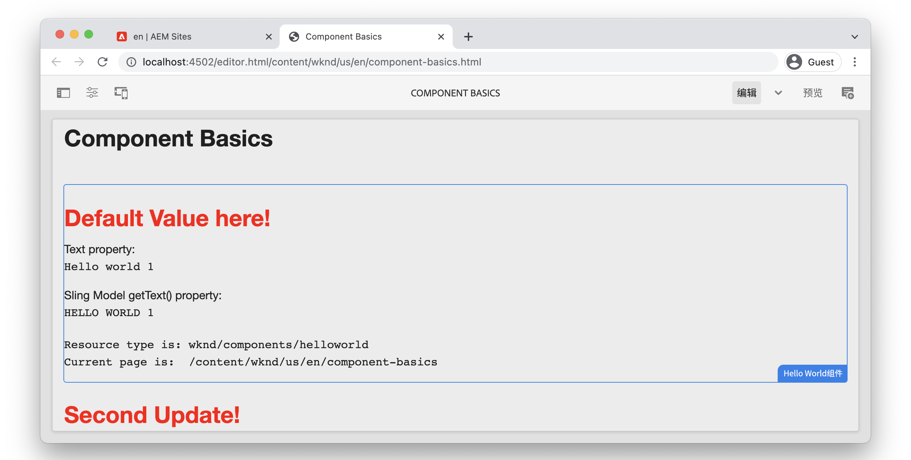

# 组件基础知识 {#component-basics}

在本章中，让我们通过一个简单的示例来探索Adobe Experience Manager (AEM) Sites组件的基础技术 `HelloWorld` 示例。 对现有组件进行了细微的修改，涉及的主题包括创作、HTL、Sling模型、客户端库。

## 前提条件 {#prerequisites}

查看所需的工具和设置说明 [本地开发环境](./overview.md#local-dev-environment).

视频中使用的IDE为 [Visual Studio代码](https://code.visualstudio.com/) 和 [VSCode AEM同步](https://marketplace.visualstudio.com/items?itemName=yamato-ltd.vscode-aem-sync) 插件。

## 目标 {#objective}

1. 了解HTL模板和Sling模型对于动态呈现HTML的作用。
1. 了解如何使用对话框促进内容创作。
1. 了解包含CSS和JavaScript以支持组件的客户端库的基础知识。

## 您即将构建的内容 {#what-build}

在本章中，您可以对简单的 `HelloWorld` 组件。 在对 `HelloWorld` 组件方面，您将了解AEM组件开发的关键领域。

## 章节起始项目 {#starter-project}

本章基于由生成的通用项目 [AEM项目原型](https://github.com/adobe/aem-project-archetype). 观看以下视频并查看 [先决条件](#prerequisites) 以开始使用！

>[!NOTE]
>
> 如果成功完成了上一章，则可以重用该项目并跳过签出入门项目的步骤。

>[!VIDEO](https://video.tv.adobe.com/v/330985?quality=12&learn=on)

打开新的命令行终端并执行以下操作。

1. 在空目录中，克隆 [aem-guides-wknd](https://github.com/adobe/aem-guides-wknd) 存储库：

   ```shell
   $ git clone git@github.com:adobe/aem-guides-wknd.git --branch tutorial/component-basics-start --single-branch
   ```

   >[!NOTE]
   >
   > 或者，您可以继续使用上一章中生成的项目， [项目设置](./project-setup.md).

1. 导航到  `aem-guides-wknd` 文件夹。

   ```shell
   $ cd aem-guides-wknd
   ```

1. 使用以下命令生成项目并将其部署到AEM的本地实例：

   ```shell
   $ mvn clean install -PautoInstallSinglePackage
   ```

   >[!NOTE]
   >
   > 如果使用AEM 6.5或6.4，请附加 `classic` 配置文件到任何Maven命令。

   ```shell
   $ mvn clean install -PautoInstallSinglePackage -Pclassic
   ```

1. 按照相关说明将项目导入您的首选IDE，以设置 [本地开发环境](overview.md#local-dev-environment).

## 组件创作 {#component-authoring}

组件可以被视为网页的小型模块化构建基块。 要重用组件，必须对组件进行配置。 这是通过创作对话框实现的。 接下来，我们创建一个简单的组件，并检查对话框中的值如何在AEM中保留。

>[!VIDEO](https://video.tv.adobe.com/v/330986?quality=12&learn=on)

以下是上述视频中执行的高层级步骤。

1. 创建名为的页面 **组件基础知识** 下 **WKND站点** `>` **US** `>` **en**.
1. 添加 **Hello World组件** 到新创建的页面。
1. 打开组件的对话框，然后输入一些文本。 保存更改以查看页面上显示的消息。
1. 切换到开发人员模式，并在CRXDE-Lite中查看内容路径并检查组件实例的属性。
1. 使用CRXDE-Lite查看 `cq:dialog` 和 `helloworld.html` 脚本来源 `/apps/wknd/components/content/helloworld`.

## HTL(HTML模板语言)和对话框 {#htl-dialogs}

HTML模板语言或 **[HTL](https://experienceleague.adobe.com/docs/experience-manager-htl/content/getting-started.html)** 是AEM组件用于呈现内容的轻型服务器端模板语言。

**对话框** 定义可以为组件进行的配置。

接下来，让我们更新 `HelloWorld` 用于在文本消息之前显示额外问候语的HTL脚本。

>[!VIDEO](https://video.tv.adobe.com/v/330987?quality=12&learn=on)

以下是上述视频中执行的高层级步骤。

1. 切换到IDE并将项目打开到 `ui.apps` 模块。
1. 打开 `helloworld.html` 并更新HTML标记。
1. 使用IDE工具，如 [VSCode AEM同步](https://marketplace.visualstudio.com/items?itemName=yamato-ltd.vscode-aem-sync) 将文件更改与本地AEM实例同步。
1. 返回到浏览器并观察组件渲染已更改。
1. 打开 `.content.xml` 用于定义对话框的文件 `HelloWorld` 组件位于：

   ```plain
   <code>/aem-guides-wknd/ui.apps/src/main/content/jcr_root/apps/wknd/components/helloworld/_cq_dialog/.content.xml
   ```

1. 更新对话框以添加名为的额外文本字段 **标题** 名称 `./title`：

   ```xml
   <?xml version="1.0" encoding="UTF-8"?>
   <jcr:root xmlns:sling="http://sling.apache.org/jcr/sling/1.0" xmlns:cq="http://www.day.com/jcr/cq/1.0" xmlns:jcr="http://www.jcp.org/jcr/1.0" xmlns:nt="http://www.jcp.org/jcr/nt/1.0"
       jcr:primaryType="nt:unstructured"
       jcr:title="Properties"
       sling:resourceType="cq/gui/components/authoring/dialog">
       <content
           jcr:primaryType="nt:unstructured"
           sling:resourceType="granite/ui/components/coral/foundation/fixedcolumns">
           <items jcr:primaryType="nt:unstructured">
               <column
                   jcr:primaryType="nt:unstructured"
                   sling:resourceType="granite/ui/components/coral/foundation/container">
                   <items jcr:primaryType="nt:unstructured">
                       <title
                           jcr:primaryType="nt:unstructured"
                           sling:resourceType="granite/ui/components/coral/foundation/form/textfield"
                           fieldLabel="Title"
                           name="./title"/>
                       <text
                           jcr:primaryType="nt:unstructured"
                           sling:resourceType="granite/ui/components/coral/foundation/form/textfield"
                           fieldLabel="Text"
                           name="./text"/>
                   </items>
               </column>
           </items>
       </content>
   </jcr:root>
   ```

1. 重新打开文件 `helloworld.html`，表示负责渲染 `HelloWorld` 以下路径中的组件：

   ```plain
       <code>/aem-guides-wknd.ui.apps/src/main/content/jcr_root/apps/wknd/components/helloworld/helloworld.html
   ```

1. 更新 `helloworld.html` 以呈现 **问候语** 文本字段作为的一部分 `H1` 标记：

   ```html
   <div class="cmp-helloworld" data-cmp-is="helloworld">
       <h1 class="cmp-helloworld__title">${properties.title}</h1>
       ...
   </div>
   ```

1. 使用开发人员插件或您的Maven技能将更改部署到AEM的本地实例。

## Sling 模型 {#sling-models}

Sling模型是注释驱动的Java™“POJO”(纯旧Java™对象)，便于将数据从JCR映射到Java™变量。 在AEM的上下文中进行开发时，它们还提供了其他一些细节。

接下来，我们对 `HelloWorldModel` Sling模型，以便在将存储在JCR中的值输出到页面之前对其进行应用某些业务逻辑。

>[!VIDEO](https://video.tv.adobe.com/v/330988?quality=12&learn=on)

1. 打开文件 `HelloWorldModel.java`，即与一起使用的Sling模型 `HelloWorld` 组件。

   ```plain
   <code>/aem-guides-wknd.core/src/main/java/com/adobe/aem/guides/wknd/core/models/HelloWorldModel.java
   ```

1. 添加以下import语句：

   ```java
   import org.apache.commons.lang3.StringUtils;
   import org.apache.sling.models.annotations.DefaultInjectionStrategy;
   ```

1. 更新 `@Model` 注释以使用 `DefaultInjectionStrategy`：

   ```java
   @Model(adaptables = Resource.class,
      defaultInjectionStrategy = DefaultInjectionStrategy.OPTIONAL)
      public class HelloWorldModel {
      ...
   ```

1. 将以下行添加到 `HelloWorldModel` 类来映射组件的JCR属性的值 `title` 和 `text` 到Java™变量：

   ```java
   ...
   @Model(adaptables = Resource.class,
   defaultInjectionStrategy = DefaultInjectionStrategy.OPTIONAL)
   public class HelloWorldModel {
   
       ...
   
       @ValueMapValue
       private String title;
   
       @ValueMapValue
       private String text;
   
       @PostConstruct
       protected void init() {
           ...
   ```

1. 添加以下方法 `getTitle()` 到 `HelloWorldModel` 类，返回名为的属性的值 `title`. 此方法添加其他逻辑以返回“此处为默认值！”的字符串值。 如果属性 `title` 为null或为空：

   ```java
   /***
   *
   * @return the value of title, if null or blank returns "Default Value here!"
   */
   public String getTitle() {
       return StringUtils.isNotBlank(title) ? title : "Default Value here!";
   }
   ```

1. 添加以下方法 `getText()` 到 `HelloWorldModel` 类，返回名为的属性的值 `text`. 此方法将字符串转换为所有大写字符。

   ```java
       /***
       *
       * @return All caps variation of the text value
       */
   public String getText() {
       return StringUtils.isNotBlank(this.text) ? this.text.toUpperCase() : null;
   }
   ```

1. 从构建和部署捆绑包 `core` 模块：

   ```shell
   $ cd core
   $ mvn clean install -PautoInstallBundle
   ```

   >[!NOTE]
   >
   > 用于AEM 6.4/6.5 `mvn clean install -PautoInstallBundle -Pclassic`

1. 更新文件 `helloworld.html` 在 `aem-guides-wknd.ui.apps/src/main/content/jcr_root/apps/wknd/components/content/helloworld/helloworld.html` 使用新创建的 `HelloWorld` 模型。

   此 `HelloWorld` 通过HTL指令为此组件实例实例化模型： `data-sly-use.model="com.adobe.aem.guides.wknd.core.models.HelloWorldModel"`，将实例保存到变量 `model`.

   此 `HelloWorld` 现在，通过在HTL中使用模型实例 `model` 变量使用 `HelloWord`. 例如，这些方法调用可以使用简短的方法语法： `${model.getTitle()}` 可以做空为 `${model.title}`.

   同样，所有HTL脚本都通过 [全局对象](https://experienceleague.adobe.com/docs/experience-manager-htl/content/global-objects.html) 可使用与Sling模型对象相同的语法进行访问。

   ```html
   <div class="cmp-helloworld" data-cmp-is="helloworld" 
       data-sly-use.model="com.adobe.aem.guides.wknd.core.models.HelloWorldModel">
       <h1 class="cmp-helloworld__title">${model.title}</h1>
       <div class="cmp-helloworld__item" data-sly-test="${properties.text}">
           <p class="cmp-helloworld__item-label">Text property:</p>
           <pre class="cmp-helloworld__item-output" data-cmp-hook-helloworld="property">${properties.text}</pre>
       </div>
       <div class="cmp-helloworld__item" data-sly-test="${model.text}">
           <p class="cmp-helloworld__item-label">Sling Model getText() property:</p>
           <pre class="cmp-helloworld__item-output" data-cmp-hook-helloworld="property">${model.text}</pre>
       </div>
   </div>
   ```

1. 使用Eclipse开发人员插件或您的Maven技能将更改部署到AEM的本地实例。

## 客户端库 {#client-side-libraries}

客户端库、 `clientlibs` 简而言之，提供了一种机制来整理和管理AEM Sites实施所需的CSS和JavaScript文件。 客户端库是在AEM的页面上包含CSS和JavaScript的标准方法。

此 [ui.frontend](https://experienceleague.adobe.com/docs/experience-manager-core-components/using/developing/archetype/uifrontend.html) 模块是解耦的 [webpack](https://webpack.js.org/) 集成到构建过程中的项目。 这允许使用常见的前端库，如Sass、LESS和TypeScript。 此 `ui.frontend` 在本模块中，我们将进行更深入的探讨 [客户端库章节](/help/getting-started-wknd-tutorial-develop/project-archetype/client-side-libraries.md).

接下来，更新以下内容的CSS样式： `HelloWorld` 组件。

>[!VIDEO](https://video.tv.adobe.com/v/340750?quality=12&learn=on)

以下是上述视频中执行的高层级步骤。

1. 打开终端窗口并导航到 `ui.frontend` 目录

1. 正在进入 `ui.frontend` 目录运行 `npm install npm-run-all --save-dev` 命令安装 [npm-run-all](https://www.npmjs.com/package/npm-run-all) 节点模块。 此步骤为 **在Archetype 39生成的AEM项目中需要**，在即将推出的原型版本中，不需要这样做。

1. 接下来，运行 `npm run watch` 命令：

   ```shell
   $ npm run watch
   ```

1. 切换到IDE并将项目打开到 `ui.frontend` 模块。
1. 打开文件 `ui.frontend/src/main/webpack/components/_helloworld.scss`.
1. 更新文件以显示红色标题：

   ```scss
   .cmp-helloworld {}
   .cmp-helloworld__title {
       color: red;
   }
   ```

1. 在终端中，您应该会看到活动，指示 `ui.frontend` 模块正在编译更改并将其与AEM的本地实例同步。

   ```shell
   Entrypoint site 214 KiB = clientlib-site/site.css 8.45 KiB clientlib-site/site.js 206 KiB
   2022-02-22 17:28:51: webpack 5.69.1 compiled successfully in 119 ms
   change:dist/index.html
   + jcr_root/apps/wknd/clientlibs/clientlib-site/css/site.css
   + jcr_root/apps/wknd/clientlibs/clientlib-site/css
   + jcr_root/apps/wknd/clientlibs/clientlib-site/js/site.js
   + jcr_root/apps/wknd/clientlibs/clientlib-site/js
   + jcr_root/apps/wknd/clientlibs/clientlib-site
   + jcr_root/apps/wknd/clientlibs/clientlib-dependencies/css.txt
   + jcr_root/apps/wknd/clientlibs/clientlib-dependencies/js.txt
   + jcr_root/apps/wknd/clientlibs/clientlib-dependencies
   ```

1. 返回到浏览器并观察标题颜色已更改。

   

## 恭喜！ {#congratulations}

恭喜，您已了解Adobe Experience Manager中组件开发的基础知识！

### 后续步骤 {#next-steps}

在下一章中熟悉Adobe Experience Manager页面和模板 [页面和模板](pages-templates.md). 了解如何将核心组件代理到项目中，并了解可编辑模板的高级策略配置，以构建结构良好的文章页面模板。

查看完成的代码 [GitHub](https://github.com/adobe/aem-guides-wknd) 或在Git分支上本地查看和部署代码 `tutorial/component-basics-solution`.
