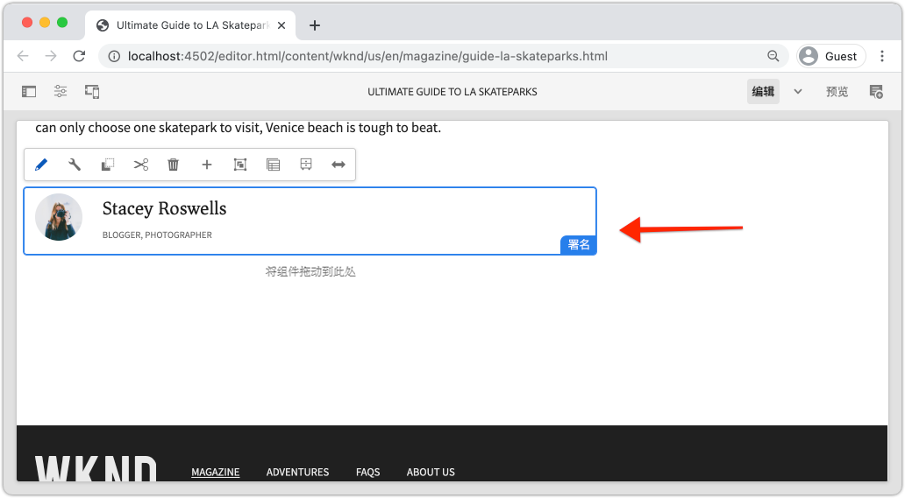
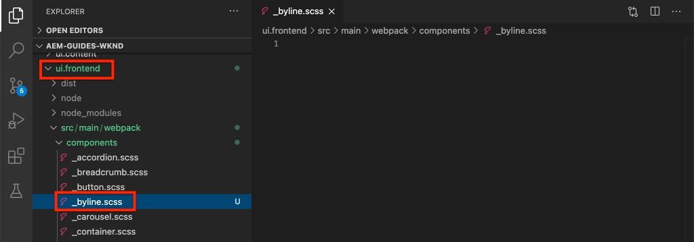

# 自定义组件 {#custom-component}

本教程涵盖自定义AEM Byline组件的端到端创建，该组件显示对话框中创作的内容，并探讨如何开发Sling模型以封装可填充组件HTL的业务逻辑。

## 前提条件 {#prerequisites}

查看设置[本地开发环境](overview.md#local-dev-environment)所需的工具和说明。

### 入门项目

>[!NOTE]
>
> 如果您成功完成了上一章，则可以重复使用该项目并跳过签出起始项目的步骤。

查看本教程构建的基行代码：

1. 查看[GitHub](https://github.com/adobe/aem-guides-wknd)中的`tutorial/custom-component-start`分支

   ```shell
   $ cd aem-guides-wknd
   $ git checkout tutorial/custom-component-start
   ```

1. 使用您的Maven技能将代码库部署到本地AEM实例：

   ```shell
   $ mvn clean install -PautoInstallSinglePackage
   ```

   >[!NOTE]
   >
   > 如果使用AEM 6.5或6.4，请将`classic`配置文件附加到任何Maven命令。

   ```shell
   $ mvn clean install -PautoInstallSinglePackage -Pclassic
   ```

您始终可以在[GitHub](https://github.com/adobe/aem-guides-wknd/tree/tutorial/custom-component-solution)上查看完成的代码，或通过切换到分支`tutorial/custom-component-solution`在本地签出代码。

## 目标

1. 了解如何构建自定义AEM组件
1. 了解如何使用Sling模型封装业务逻辑
1. 了解如何从HTL脚本中使用Sling模型

## 将构建的内容 {#byline-component}

在WKND教程的这一部分中，将创建一个署名组件，用于显示有关文章参与者的创作信息。



*署名组件*

署名组件的实施包括收集署名内容的对话框和检索署名的自定义Sling模型：

* 名称
* 图像
* 职业

## 创建署名组件 {#create-byline-component}

首先，创建署名组件节点结构并定义一个对话框。 这表示AEM中的组件，并通过组件在JCR中的位置隐式定义组件的资源类型。

该对话框公开了内容作者可以提供的界面。 对于此实施，将利用AEM WCM核心组件的&#x200B;**Image**&#x200B;组件来创作和渲染署名图像，因此它将设置为我们组件的`sling:resourceSuperType`。

### 创建组件定义 {#create-component-definition}

1. 在&#x200B;**ui.apps**&#x200B;模块中，导航到`/apps/wknd/components`并创建一个名为`byline`的新文件夹。
1. 在`byline`文件夹下，添加一个名为`.content.xml`的新文件

   

1. 使用以下内容填充`.content.xml`文件：

   ```xml
   <?xml version="1.0" encoding="UTF-8"?>
       <jcr:root xmlns:sling="http://sling.apache.org/jcr/sling/1.0" xmlns:cq="http://www.day.com/jcr/cq/1.0" xmlns:jcr="http://www.jcp.org/jcr/1.0"
       jcr:primaryType="cq:Component"
       jcr:title="Byline"
       jcr:description="Displays a contributor's byline."
       componentGroup="WKND Sites Project - Content"
       sling:resourceSuperType="core/wcm/components/image/v2/image"/>
   ```

   上述XML文件提供了组件的定义，包括标题、描述和组。 `sling:resourceSuperType`指向`core/wcm/components/image/v2/image`，即[核心图像组件](https://experienceleague.adobe.com/docs/experience-manager-core-components/using/components/image.html)。

### 创建HTL脚本 {#create-the-htl-script}

1. 在`byline`文件夹下，添加一个新文件`byline.html`，该文件负责组件的HTML显示。 使用与文件夹相同的方式命名文件很重要，因为它将成为Sling用于呈现此资源类型的默认脚本。

1. 将以下代码添加到`byline.html`中。

   ```html
   <!--/* byline.html */-->
   <div data-sly-use.placeholderTemplate="core/wcm/components/commons/v1/templates.html">
   </div>
   <sly data-sly-call="${placeholderTemplate.placeholder @ isEmpty=true}"></sly>
   ```

`byline.html` 稍后 [将重新查看](#byline-htl)，在创建Sling模型后。HTL文件的当前状态允许组件在拖放到页面上时以空状态在AEM Sites的页面编辑器中显示。

### 创建对话框定义 {#create-the-dialog-definition}

接下来，为署名组件定义一个对话框，其中包含以下字段：

* **名称**:参与者名称的文本字段。
* **图像**:参考投稿人的个人简介图片。
* **职业**:贡献者的职业列表。职业应按字母顺序升序（a到z）排序。

1. 在`byline`文件夹下，创建一个名为`_cq_dialog`的新文件夹。
1. 在`byline/_cq_dialog`下添加一个名为`.content.xml`的新文件。 这是对话框的XML定义。 添加以下XML:

   ```xml
   <?xml version="1.0" encoding="UTF-8"?>
   <jcr:root xmlns:sling="http://sling.apache.org/jcr/sling/1.0" xmlns:cq="http://www.day.com/jcr/cq/1.0" xmlns:jcr="http://www.jcp.org/jcr/1.0" xmlns:nt="http://www.jcp.org/jcr/nt/1.0"
           jcr:primaryType="nt:unstructured"
           jcr:title="Byline"
           sling:resourceType="cq/gui/components/authoring/dialog">
       <content
               jcr:primaryType="nt:unstructured"
               sling:resourceType="granite/ui/components/coral/foundation/container">
           <items jcr:primaryType="nt:unstructured">
               <tabs
                       jcr:primaryType="nt:unstructured"
                       sling:resourceType="granite/ui/components/coral/foundation/tabs"
                       maximized="{Boolean}false">
                   <items jcr:primaryType="nt:unstructured">
                       <asset
                               jcr:primaryType="nt:unstructured"
                               sling:hideResource="{Boolean}false"/>
                       <metadata
                               jcr:primaryType="nt:unstructured"
                               sling:hideResource="{Boolean}true"/>
                       <properties
                               jcr:primaryType="nt:unstructured"
                               jcr:title="Properties"
                               sling:resourceType="granite/ui/components/coral/foundation/container"
                               margin="{Boolean}true">
                           <items jcr:primaryType="nt:unstructured">
                               <columns
                                       jcr:primaryType="nt:unstructured"
                                       sling:resourceType="granite/ui/components/coral/foundation/fixedcolumns"
                                       margin="{Boolean}true">
                                   <items jcr:primaryType="nt:unstructured">
                                       <column
                                               jcr:primaryType="nt:unstructured"
                                               sling:resourceType="granite/ui/components/coral/foundation/container">
                                           <items jcr:primaryType="nt:unstructured">
                                               <name
                                                       jcr:primaryType="nt:unstructured"
                                                       sling:resourceType="granite/ui/components/coral/foundation/form/textfield"
                                                       emptyText="Enter the contributor's name to display."
                                                       fieldDescription="The contributor's name to display."
                                                       fieldLabel="Name"
                                                       name="./name"
                                                       required="{Boolean}true"/>
                                               <occupations
                                                       jcr:primaryType="nt:unstructured"
                                                       sling:resourceType="granite/ui/components/coral/foundation/form/multifield"
                                                       fieldDescription="A list of the contributor's occupations."
                                                       fieldLabel="Occupations"
                                                       required="{Boolean}false">
                                                   <field
                                                           jcr:primaryType="nt:unstructured"
                                                           sling:resourceType="granite/ui/components/coral/foundation/form/textfield"
                                                           emptyText="Enter an occupation"
                                                           name="./occupations"/>
                                               </occupations>
                                           </items>
                                       </column>
                                   </items>
                               </columns>
                           </items>
                       </properties>
                   </items>
               </tabs>
           </items>
       </content>
   </jcr:root>
   ```

   这些对话框节点定义使用[Sling资源合并器](https://sling.apache.org/documentation/bundles/resource-merger.html)来控制从`sling:resourceSuperType`组件继承的对话框选项卡，在本例中为&#x200B;**核心组件的图像组件**。

   

### 创建策略对话框 {#create-the-policy-dialog}

按照与创建对话框相同的方法，创建策略对话框（以前称为设计对话框）以隐藏从核心组件的图像组件继承的策略配置中的不需要字段。

1. 在`byline`文件夹下，创建一个名为`_cq_design_dialog`的新文件夹。
1. 在`byline/_cq_design_dialog`下面创建一个名为`.content.xml`的新文件。 使用以下方法更新文件：使用以下XML。 最简单的方法是打开`.content.xml`并将下面的XML复制/粘贴到其中。

   ```xml
   <?xml version="1.0" encoding="UTF-8"?>
   <jcr:root xmlns:sling="http://sling.apache.org/jcr/sling/1.0" xmlns:granite="http://www.adobe.com/jcr/granite/1.0" xmlns:cq="http://www.day.com/jcr/cq/1.0" xmlns:jcr="http://www.jcp.org/jcr/1.0" xmlns:nt="http://www.jcp.org/jcr/nt/1.0"
       jcr:primaryType="nt:unstructured"
       jcr:title="Byline"
       sling:resourceType="cq/gui/components/authoring/dialog">
       <content
               jcr:primaryType="nt:unstructured">
           <items jcr:primaryType="nt:unstructured">
               <tabs
                       jcr:primaryType="nt:unstructured">
                   <items jcr:primaryType="nt:unstructured">
                       <properties
                               jcr:primaryType="nt:unstructured">
                           <items jcr:primaryType="nt:unstructured">
                               <content
                                       jcr:primaryType="nt:unstructured">
                                   <items jcr:primaryType="nt:unstructured">
                                       <decorative
                                               jcr:primaryType="nt:unstructured"
                                               sling:hideResource="{Boolean}true"/>
                                       <altValueFromDAM
                                               jcr:primaryType="nt:unstructured"
                                               sling:hideResource="{Boolean}true"/>
                                       <titleValueFromDAM
                                               jcr:primaryType="nt:unstructured"
                                               sling:hideResource="{Boolean}true"/>
                                       <displayCaptionPopup
                                               jcr:primaryType="nt:unstructured"
                                               sling:hideResource="{Boolean}true"/>
                                       <disableUuidTracking
                                               jcr:primaryType="nt:unstructured"
                                               sling:hideResource="{Boolean}true"/>
                                   </items>
                               </content>
                           </items>
                       </properties>
                       <features
                               jcr:primaryType="nt:unstructured">
                           <items jcr:primaryType="nt:unstructured">
                               <content
                                       jcr:primaryType="nt:unstructured">
                                   <items jcr:primaryType="nt:unstructured">
                                       <accordion
                                               jcr:primaryType="nt:unstructured">
                                           <items jcr:primaryType="nt:unstructured">
                                               <orientation
                                                       jcr:primaryType="nt:unstructured"
                                                       sling:hideResource="{Boolean}true"/>
                                               <crop
                                                       jcr:primaryType="nt:unstructured"
                                                       sling:hideResource="{Boolean}true"/>
                                           </items>
                                       </accordion>
                                   </items>
                               </content>
                           </items>
                       </features>
                   </items>
               </tabs>
           </items>
       </content>
   </jcr:root>
   ```

   前面&#x200B;**策略对话框** XML的基础是从[核心组件图像组件](https://github.com/adobe/aem-core-wcm-components/blob/master/content/src/content/jcr_root/apps/core/wcm/components/image/v2/image/_cq_design_dialog/.content.xml)获取的。

   与对话框配置中一样，[Sling资源合并器](https://sling.apache.org/documentation/bundles/resource-merger.html)用于隐藏从`sling:resourceSuperType`继承的不相关字段，如`sling:hideResource="{Boolean}true"`属性的节点定义所示。

### 部署代码 {#deploy-the-code}

1. 使用您的Maven技能将更新的代码库部署到本地AEM实例：

   ```shell
   $ cd aem-guides-wknd
   $ mvn clean install -PautoInstallSinglePackage
   ```

## 将组件添加到页面 {#add-the-component-to-a-page}

为了保持AEM组件开发的简单性和重点，我们会将处于当前状态的Byline组件添加到文章页面，以验证`cq:Component`节点定义是否已部署和正确，AEM可识别新组件定义，并且组件的对话框可用于创作。

### 将图像添加到AEM Assets

首先，将头部拍摄示例上传到AEM Assets，以用于填充署名组件中的图像。

1. 导航到AEM Assets的LA Skateparks文件夹：[http://localhost:4502/assets.html/content/dam/wknd/en/magazine/la-skateparks](http://localhost:4502/assets.html/content/dam/wknd/en/magazine/la-skateparks)。

1. 将&#x200B;**[stacey-roswells.jpg](assets/custom-component/stacey-roswells.jpg)**&#x200B;的头部照片上传到文件夹。

   

### 创作组件 {#author-the-component}

接下来，将署名组件添加到AEM中的页面。 由于我们通过`ui.apps/src/main/content/jcr_root/apps/wknd/components/byline/.content.xml`定义将署名组件添加到&#x200B;**WKND站点项目 — 内容**&#x200B;组件组，因此它可自动供任何&#x200B;**容器**&#x200B;使用，其&#x200B;**Policy**&#x200B;允许&#x200B;**WKND站点项目 — 内容**&#x200B;组件组，文章页面的布局容器就是该组件组。

1. 导航到LA Skatepark文章：[http://localhost:4502/editor.html/content/wknd/us/en/magazine/guide-la-skateparks.html](http://localhost:4502/editor.html/content/wknd/us/en/magazine/guide-la-skateparks.html)

1. 从左侧边栏中，将&#x200B;**署名组件**&#x200B;拖放到已打开文章页面布局容器的&#x200B;**底部**&#x200B;上。

   

1. 确保左侧边栏已打开&#x200B;**且可见，并且已选择**&#x200B;资产查找器&#x200B;**。**

   

1. 选择&#x200B;**Byline组件占位符** ，这又显示操作栏并点按&#x200B;**扳手**&#x200B;图标以打开对话框。

   

1. 打开对话框，并且第一个选项卡（资产）处于活动状态，打开左侧边栏，然后从资产查找器中，将图像拖到图像拖放区域。 搜索“stacey”以查找WKND ui.content包中提供的Stacey Roswells生物图片。

   

1. 添加图像后，单击&#x200B;**属性**&#x200B;选项卡以输入&#x200B;**名称**&#x200B;和&#x200B;**职业**。

   进入职业时，请按&#x200B;**反向字母顺序**&#x200B;输入，这样我们在Sling模型中实施的按字母顺序排列的业务逻辑就显而易见了。

   点按右下方的&#x200B;**Done**&#x200B;按钮以保存更改。

   

   AEM作者通过对话框配置和创作组件。 在开发署名组件时，将包含用于收集数据的对话框，但尚未添加呈现创作内容的逻辑。 因此，只显示占位符。

1. 保存对话框后，导航到[CRXDE Lite](http://localhost:4502/crx/de/index.jsp#/content/wknd/us/en/magazine/guide-la-skateparks/jcr%3Acontent/root/container/container/byline)并查看组件内容在AEM页面下的署名组件内容节点上的存储方式。

   在“LA Skate Parks”页面下方找到Byline组件内容节点，即`/content/wknd/us/en/magazine/guide-la-skateparks/jcr:content/root/container/container/byline`。

   请注意，属性名称`name`、`occupations`和`fileReference`存储在&#x200B;**byline节点**&#x200B;上。

   此外，请注意节点的`sling:resourceType`设置为`wknd/components/content/byline`，这是将此内容节点绑定到Byline组件实现的内容。

   

## 创建署名Sling模型 {#create-sling-model}

接下来，我们将创建一个Sling模型以充当数据模型，并存储Byline组件的业务逻辑。

Sling模型是注释驱动的Java“POJO”（纯旧Java对象），它有助于将数据从JCR映射到Java变量，并在AEM上下文中进行开发时提供许多其他细节。

### 查看Maven依赖项 {#maven-dependency}

署名Sling模型将依赖于AEM提供的多个Java API。 这些API通过`core`模块POM文件中列出的`dependencies`提供。 已为AEM as a Cloud Service构建本教程所用的项目。 但是，它的独特之处在于，它向后兼容AEM 6.5/6.4。因此，它同时包含Cloud Service和AEM 6.x的依赖项。

1. 在`<src>/aem-guides-wknd/core/pom.xml`下打开`pom.xml`文件。
1. 查找`aem-sdk-api` - **AEM的依赖项，仅作为Cloud Service**

   ```xml
   <dependency>
       <groupId>com.adobe.aem</groupId>
       <artifactId>aem-sdk-api</artifactId>
   </dependency>
   ```

   [aem-sdk-api](https://experienceleague.adobe.com/docs/experience-manager-cloud-service/implementing/developing/aem-as-a-cloud-service-sdk.html?lang=en#building-for-the-sdk)包含由AEM公开的所有公共Java API。 默认情况下，在构建此项目时使用`aem-sdk-api`。 该版本将在位于`aem-guides-wknd/pom.xml`项目根的父反应器pom中维护。

1. 查找`uber-jar` - **AEM 6.5/6.4的依赖项仅**

   ```xml
   ...
       <dependency>
           <groupId>com.adobe.aem</groupId>
           <artifactId>uber-jar</artifactId>
           <classifier>apis</classifier>
       </dependency>
   ...
   ```

   只有在调用`classic`配置文件（即`mvn clean install -PautoInstallSinglePackage -Pclassic`）时，才会包含`uber-jar`。 同样，这是此项目特有的。 在从AEM项目原型生成的真实项目中，如果指定的AEM版本为6.5或6.4，则默认为`uber-jar`。

   [uber-jar](https://docs.adobe.com/content/help/en/experience-manager-65/developing/devtools/ht-projects-maven.html#experience-manager-api-dependencies)包含由AEM 6.x公开的所有公共Java API。该版本在位于项目`aem-guides-wknd/pom.xml`根的父反应器pom中进行维护。

1. 查找`core.wcm.components.core`的依赖项：

   ```xml
    <!-- Core Component Dependency -->
       <dependency>
           <groupId>com.adobe.cq</groupId>
           <artifactId>core.wcm.components.core</artifactId>
       </dependency>
   ```

   这是AEM核心组件公开的所有公共Java API。 AEM核心组件是在AEM外部维护的项目，因此具有单独的发行周期。 因此，它是需要单独包含的依赖项，**不**&#x200B;包含在`uber-jar`或`aem-sdk-api`中。

   与uber-jar一样，此依赖项的版本在位于`aem-guides-wknd/pom.xml`的父反应器pom文件中进行维护。

   在本教程的后面，我们将使用核心组件图像类在署名组件中显示图像。 要构建和编译我们的Sling模型，必须具有核心组件依赖关系。

### 署名界面 {#byline-interface}

为署名创建公共Java接口。 `Byline.java` 定义驱动HTL脚本所需的公 `byline.html` 共方法。

1. 在`core/src/main/java/com/adobe/aem/guides/wknd/core/models`下的`aem-guides-wknd.core`模块中，创建一个名为`Byline.java`的新文件

   

1. 使用以下方法更新`Byline.java`:

   ```java
   package com.adobe.aem.guides.wknd.core.models;
   
   import java.util.List;
   
   /**
   * Represents the Byline AEM Component for the WKND Site project.
   **/
   public interface Byline {
       /***
       * @return a string to display as the name.
       */
       String getName();
   
       /***
       * Occupations are to be sorted alphabetically in a descending order.
       *
       * @return a list of occupations.
       */
       List<String> getOccupations();
   
       /***
       * @return a boolean if the component has enough content to display.
       */
       boolean isEmpty();
   }
   ```

   前两种方法显示Byline组件&#x200B;**name**&#x200B;和&#x200B;**schrips**&#x200B;的值。

   `isEmpty()`方法用于确定组件是否包含要渲染的内容或组件是否正在等待配置。

   请注意，图像没有方法；[我们将查看为什么这是以后的](#tackling-the-image-problem)。

1. 包含公共Java类（本例中为Sling模型）的Java包必须使用包的`package-info.java`文件进行版本控制。

由于WKND源的Java包`com.adobe.aem.guides.wknd.core.models`声明为`2.0.0`版本，并且我们添加的是不中断的公共接口和方法，因此必须将该版本增加到`2.1.0`。 在`core/src/main/java/com/adobe/aem/guides/wknd/core/models/package-info.java`打开文件，并将`@Version("2.0.0")`更新为`@Version("2.1.0")`。

    &quot;&#39;
    @Version(&quot;2.1.0&quot;)
    包com.adobe.aem.guides.wknd.core.models;
    
    导入org.osgi.annotation.versioning.Version;
    &quot;

每当对此包中的文件进行更改时，必须从语义上](https://semver.org/)调整[包版本。 如果没有，则Maven项目的[bnd-baseline-maven-plugin](https://github.com/bndtools/bnd/tree/master/maven/bnd-baseline-maven-plugin)将检测到无效的包版本并中断构建。 幸运的是，Maven插件在失败时会报告无效的Java包版本以及该版本。 刚刚将违反Java包`package-info.java`中的`@Version("...")`声明更新为插件建议的要修复的版本。

### 署名实施 {#byline-implementation}

`BylineImpl.java` 是用于实现之前定义的接口 `Byline.java` 的Sling模型。`BylineImpl.java`的完整代码可在此部分的底部找到。

1. 在`core/src/main/java/com/adobe/aem/guides/core/models`下创建一个名为`impl`的新文件夹。
1. 在`impl`文件夹中，创建新文件`BylineImpl.java`。

   

1. 打开 `BylineImpl.java`. 指定它实现`Byline`接口。 使用IDE的自动完成功能或手动更新文件以包含实现`Byline`接口所需的方法：

   ```java
   package com.adobe.aem.guides.wknd.core.models.impl;
   import java.util.List;
   import com.adobe.aem.guides.wknd.core.models.Byline;
   
   public class BylineImpl implements Byline {
   
       @Override
       public String getName() {
           // TODO Auto-generated method stub
           return null;
       }
   
       @Override
       public List<String> getOccupations() {
           // TODO Auto-generated method stub
           return null;
       }
   
       @Override
       public boolean isEmpty() {
           // TODO Auto-generated method stub
           return false;
       }
   }
   ```

1. 通过使用以下类级别注释更新`BylineImpl.java`来添加Sling模型注释。 此`@Model(..)`注释可将类转换为Sling模型。

   ```java
   import org.apache.sling.api.SlingHttpServletRequest;
   import org.apache.sling.models.annotations.Model;
   import org.apache.sling.models.annotations.DefaultInjectionStrategy;
   ...
   @Model(
           adaptables = {SlingHttpServletRequest.class},
           adapters = {Byline.class},
           resourceType = {BylineImpl.RESOURCE_TYPE},
           defaultInjectionStrategy = DefaultInjectionStrategy.OPTIONAL
   )
   public class BylineImpl implements Byline {
       protected static final String RESOURCE_TYPE = "wknd/components/content/byline";
       ...
   }
   ```

   让我们查看此注释及其参数：

   * `@Model`注释在部署到AEM时，会将BylineImpl注册为Sling模型。
   * `adaptables`参数指定此模型可以根据请求进行修改。
   * `adapters`参数允许在Byline接口下注册实现类。 这允许HTL脚本通过界面调用Sling模型（而不是直接调用impl）。 [有关适配器的更多详细信息，请访问此处](https://sling.apache.org/documentation/bundles/models.html#specifying-an-alternate-adapter-class-since-110)。
   * `resourceType`指向Byline组件资源类型（之前创建），并且如果存在多个实施，则有助于解析正确的模型。 [有关将模型类与资源类型关联的更多详细信息，请参阅此处](https://sling.apache.org/documentation/bundles/models.html#associating-a-model-class-with-a-resource-type-since-130)。

### 实施Sling模型方法 {#implementing-the-sling-model-methods}

#### getName() {#implementing-get-name}

我们将处理的第一个方法是`getName()`，它只返回存储到署名的JCR内容节点中属性`name`下的值。

为此，可使用`@ValueMapValue` Sling模型注释，使用请求资源的ValueMap将值注入Java字段。


```java
import org.apache.sling.models.annotations.injectorspecific.ValueMapValue;

public class BylineImpl implements Byline {
    ...
    @ValueMapValue
    private String name;

    ...
    @Override
    public String getName() {
        return name;
    }
    ...
}
```

由于JCR属性与Java字段共享相同的名称（两者都是“name”），因此`@ValueMapValue`会自动解析此关联，并将属性的值插入Java字段。

#### getScriptions() {#implementing-get-occupations}

要实现的下一个方法是`getOccupations()`。 此方法将收集JCR属性`occupations`中存储的所有职业，并返回这些职业的排序（按字母顺序）集合。

使用`getName()`中探索的相同技术，属性值可以注入到Sling模型的字段中。

在JCR属性值通过插入的Java字段`occupations`在Sling模型中可用后，可以在`getOccupations()`方法中应用排序业务逻辑。


```java
import java.util.ArrayList;
import java.util.Collections;
  ...

public class BylineImpl implements Byline {
    ...
    @ValueMapValue
    private List<String> occupations;
    ...
    @Override
    public List<String> getOccupations() {
        if (occupations != null) {
            Collections.sort(occupations);
            return new ArrayList<String>(occupations);
        } else {
            return Collections.emptyList();
        }
    }
    ...
}
  ...
```


#### isEmpty() {#implementing-is-empty}

最后一个公共方法是`isEmpty()`，它确定组件何时应考虑“创作足够”来渲染。

对于此组件，我们的业务要求是，必须填写&#x200B;*的所有三个字段、名称、图像和职业，才能渲染组件*。


```java
import org.apache.commons.lang3.StringUtils;
  ...
public class BylineImpl implements Byline {
    ...
    @Override
    public boolean isEmpty() {
        if (StringUtils.isBlank(name)) {
            // Name is missing, but required
            return true;
        } else if (occupations == null || occupations.isEmpty()) {
            // At least one occupation is required
            return true;
        } else if (/* image is not null, logic to be determined */) {
            // A valid image is required
            return true;
        } else {
            // Everything is populated, so this component is not considered empty
            return false;
        }
    }
    ...
}
```


#### 解决&quot;形象问题&quot; {#tackling-the-image-problem}

检查名称和占用条件很琐碎（Apache Commons Lang3提供了始终方便使用的[StringUtils](https://commons.apache.org/proper/commons-lang/apidocs/org/apache/commons/lang3/StringUtils.html)类），但是，由于核心组件图像组件用于显示图像，因此不清楚如何验证图像&#x200B;**的**&#x200B;存在。

有两种方法可以解决此问题：

检查`fileReference` JCR属性是否解析为资产。 ** ORC将此资源转换为核心组件图像Sling模型，并确保 `getSrc()` 方法不为空。

我们将选择&#x200B;**second**&#x200B;方法。 第一种方法可能就足够了，但在本教程中，将使用后一种方法来探索Sling模型的其他功能。

1. 创建用于获取图像的专用方法。 此方法保留为私有，因为我们不需要在HTL本身中公开Image对象，它仅用于驱动`isEmpty().`

   `getImage()`的以下专用方法：

   ```java
   import com.adobe.cq.wcm.core.components.models.Image;
   ...
   private Image getImage() {
       Image image = null;
       // Figure out how to populate the image variable!
       return image;
   }
   ```

   如上所述，还有两种方法可获取&#x200B;**图像Sling模型**:

   第一个组件使用`@Self`注释，以自动将当前请求调整为核心组件的`Image.class`

   ```java
   @Self
   private Image image;
   ```

   第二种方法使用[Apache Sling ModelFactory](https://sling.apache.org/apidocs/sling10/org/apache/sling/models/factory/ModelFactory.html) OSGi服务，这项服务非常便于使用，可帮助我们在Java代码中创建其他类型的Sling模型。

   我们将选择第二种方法。

   >[!NOTE]
   >
   >在实际实施中，首选使用`@Self`的“One”方法，因为它是更简单、更优雅的解决方案。 在本教程中，我们将使用第二种方法，因为它要求我们探索更多方面的Sling模型，这些方面对于更复杂的组件非常有用！

   由于Sling模型是Java POJO，而不是OSGi服务，因此通常的OSGi注入批注`@Reference` **不能**&#x200B;使用，而Sling模型会提供特殊的&#x200B;**[@OSGiService](https://sling.apache.org/documentation/bundles/models.html#injector-specific-annotations)**&#x200B;注释，以提供类似的功能。

1. 更新`BylineImpl.java`以包含`OSGiService`注释以插入`ModelFactory`:

   ```java
   import org.apache.sling.models.factory.ModelFactory;
   import org.apache.sling.models.annotations.injectorspecific.OSGiService;
   ...
   public class BylineImpl implements Byline {
       ...
       @OSGiService
       private ModelFactory modelFactory;
   }
   ```

   提供`ModelFactory`后，可以使用以下方法创建核心组件图像Sling模型：

   ```java
   modelFactory.getModelFromWrappedRequest(SlingHttpServletRequest request, Resource resource, java.lang.Class<T> targetClass)
   ```

   但是，此方法既需要请求，又需要资源，在Sling模型中均不可用。 要获取这些标注，需要使用更多Sling模型批注！

   要获取当前请求，可使用&#x200B;**[@Self](https://sling.apache.org/documentation/bundles/models.html#injector-specific-annotations)**&#x200B;注释将`adaptable`（在`@Model(..)`中定义为`SlingHttpServletRequest.class`）注入Java类字段。

1. 添加&#x200B;**@Self**&#x200B;注释以获取&#x200B;**SlingHttpServletRequest请求**:

   ```java
   import org.apache.sling.models.annotations.injectorspecific.Self;
   ...
   @Self
   private SlingHttpServletRequest request;
   ```

   请记住，上面有一个选项，即使用`@Self Image image`插入核心组件图像Sling模型 — `@Self`注释尝试插入可调整的对象（在本例中为SlingHttpServletRequest），并适应注释字段类型。 由于核心组件图像Sling模型可以从SlingHttpServletRequest对象进行调整，因此它会起作用，而且代码少于我们探索性更强的方法。

   现在，我们已通过ModelFactory API插入实例化我们的图像模型所需的变量。 我们将使用Sling模型的&#x200B;**[@PostConstruct](https://sling.apache.org/documentation/bundles/models.html#postconstruct-methods)**&#x200B;注释在Sling模型实例化后获取此对象。

   `@PostConstruct` 非常有用，且作用容量与构造函数类似，但是，在实例化类并插入所有注释的Java字段后，将调用它。其他Sling模型注释在Java类字段（变量）中添加批注时，`@PostConstruct`会标注void，零参数方法，通常名为`init()`（但可以命名为任何内容）。

1. 添加&#x200B;**@PostConstruct**&#x200B;方法：

   ```java
   import javax.annotation.PostConstruct;
   ...
   public class BylineImpl implements Byline {
       ...
       private Image image;
   
       @PostConstruct
       private void init() {
           image = modelFactory.getModelFromWrappedRequest(request,
                                                           request.getResource(),
                                                           Image.class);
       }
       ...
   }
   ```

   请记住，Sling模型是&#x200B;**NOT** OSGi服务，因此维护类状态是安全的。 通常，`@PostConstruct`会派生并设置Sling Model类状态，供以后使用，与普通构造函数的功能类似。

   请注意，如果`@PostConstruct`方法引发异常，则Sling模型将不会实例化（它将为空）。

1. **现在可以更新getImage()** ，以仅返回图像对象。

   ```java
   /**
       * @return the Image Sling Model of this resource, or null if the resource cannot create a valid Image Sling Model.
   */
   private Image getImage() {
       return image;
   }
   ```

1. 让我们返回到`isEmpty()`并完成实施：

   ```java
   @Override
   public boolean isEmpty() {
      final Image componentImage = getImage();
   
       if (StringUtils.isBlank(name)) {
           // Name is missing, but required
           return true;
       } else if (occupations == null || occupations.isEmpty()) {
           // At least one occupation is required
           return true;
       } else if (componentImage == null || StringUtils.isBlank(componentImage.getSrc())) {
           // A valid image is required
           return true;
       } else {
           // Everything is populated, so this component is not considered empty
           return false;
       }
   }
   ```

   请注意，对`getImage()`进行多次调用不会产生问题，因为返回初始化的`image`类变量，并且不会调用`modelFactory.getModelFromWrappedRequest(...)`，这并不过于昂贵，但值得避免不必要的调用。

1. 最终的`BylineImpl.java`应该如下所示：


   ```java
   package com.adobe.aem.guides.wknd.core.models.impl;
   
   import java.util.ArrayList;
   import java.util.Collections;
   import java.util.List;
   import javax.annotation.PostConstruct;
   import org.apache.commons.lang3.StringUtils;
   import org.apache.sling.api.SlingHttpServletRequest;
   import org.apache.sling.models.annotations.DefaultInjectionStrategy;
   import org.apache.sling.models.annotations.Model;
   import org.apache.sling.models.annotations.injectorspecific.OSGiService;
   import org.apache.sling.models.annotations.injectorspecific.Self;
   import org.apache.sling.models.annotations.injectorspecific.ValueMapValue;
   import org.apache.sling.models.factory.ModelFactory;
   import com.adobe.aem.guides.wknd.core.models.Byline;
   import com.adobe.cq.wcm.core.components.models.Image;
   
   @Model(
           adaptables = {SlingHttpServletRequest.class},
           adapters = {Byline.class},
           resourceType = {BylineImpl.RESOURCE_TYPE},
           defaultInjectionStrategy = DefaultInjectionStrategy.OPTIONAL
   )
   public class BylineImpl implements Byline {
       protected static final String RESOURCE_TYPE = "wknd/components/content/byline";
   
       @Self
       private SlingHttpServletRequest request;
   
       @OSGiService
       private ModelFactory modelFactory;
   
       @ValueMapValue
       private String name;
   
       @ValueMapValue
       private List<String> occupations;
   
       private Image image;
   
       @PostConstruct
       private void init() {
           image = modelFactory.getModelFromWrappedRequest(request, request.getResource(), Image.class);
       }
   
       @Override
       public String getName() {
           return name;
       }
   
       @Override
       public List<String> getOccupations() {
           if (occupations != null) {
               Collections.sort(occupations);
               return new ArrayList<String>(occupations);
           } else {
               return Collections.emptyList();
           }
       }
   
       @Override
       public boolean isEmpty() {
           final Image componentImage = getImage();
   
           if (StringUtils.isBlank(name)) {
               // Name is missing, but required
               return true;
           } else if (occupations == null || occupations.isEmpty()) {
               // At least one occupation is required
               return true;
           } else if (componentImage == null || StringUtils.isBlank(componentImage.getSrc())) {
               // A valid image is required
               return true;
           } else {
               // Everything is populated, so this component is not considered empty
               return false;
           }
       }
   
       /**
       * @return the Image Sling Model of this resource, or null if the resource cannot create a valid Image Sling Model.
       */
       private Image getImage() {
           return image;
       }
   }
   ```


## 署名HTL {#byline-htl}

在`ui.apps`模块中，打开我们在AEM组件的前面设置中创建的`/apps/wknd/components/byline/byline.html`。

```html
<div data-sly-use.placeholderTemplate="core/wcm/components/commons/v1/templates.html">
</div>
<sly data-sly-call="${placeholderTemplate.placeholder @ isEmpty=false}"></sly>
```

让我们来查看一下此HTL脚本迄今为止的功能：

* `placeholderTemplate`指向核心组件占位符，当组件未完全配置时，将显示该占位符。 如上所述，在AEM Sites页面编辑器中，该编辑器将呈现为带有组件标题的框，具体如`cq:Component`的`jcr:title`属性中所定义。

* `data-sly-call="${placeholderTemplate.placeholder @ isEmpty=false}`加载上面定义的`placeholderTemplate`，并将布尔值（当前硬编码为`false`）传递到占位符模板。 当`isEmpty`为true时，占位符模板会呈现灰色框，否则不会呈现任何内容。

### 更新署名HTL

1. 使用以下骨架HTML结构更新&#x200B;**byline.html**:

   ```html
   <div data-sly-use.placeholderTemplate="core/wcm/components/commons/v1/templates.html"
       class="cmp-byline">
           <div class="cmp-byline__image">
               <!--/* Include the Core Components Image Component */-->
           </div>
           <h2 class="cmp-byline__name"><!--/* Include the name */--></h2>
           <p class="cmp-byline__occupations"><!--/* Include the occupations */--></p>
   </div>
   <sly data-sly-call="${placeholderTemplate.placeholder @ isEmpty=true}"></sly>
   ```

   请注意，CSS类遵循[BEM命名约定](https://getbem.com/naming/)。 虽然使用BEM约定并非强制性的，但建议使用BEM，因为它在核心组件CSS类中使用，并且通常会生成清晰易读的CSS规则。

### 在HTL中实例化Sling模型对象 {#instantiating-sling-model-objects-in-htl}

[Use block语句](https://github.com/adobe/htl-spec/blob/master/SPECIFICATION.md#221-use)用于实例化HTL脚本中的Sling模型对象，并将其分配给HTL变量。

`data-sly-use.byline="com.adobe.aem.guides.wknd.models.Byline"` 使用由BylineImpl实施的Byline接口(com.adobe.aem.guides.wknd.models.Byline)，并自适应当前的SlingHttpServletRequest，结果将逐行( `data-sly-use.<variable-name>`)存储在HTL变量名称中。

1. 更新外部`div`以通过其公共接口引用&#x200B;**Byline** Sling模型：

   ```xml
   <div data-sly-use.byline="com.adobe.aem.guides.wknd.core.models.Byline"
       data-sly-use.placeholderTemplate="core/wcm/components/commons/v1/templates.html"
       class="cmp-byline">
       ...
   </div>
   ```

### 访问Sling模型方法 {#accessing-sling-model-methods}

HTL从JSTL中借用，并使用与缩短Java getter方法名称相同的方法。

例如，可以将调用Byline Sling模型的`getName()`方法缩短为`byline.name`，类似地，可以将其缩短为`byline.empty`。 `byline.isEmpty`使用完整的方法名称（`byline.getName`或`byline.isEmpty`）也适用。 请注意，从未使用`()`在HTL中调用方法（与JSTL类似）。

HTL中使用需要参数&#x200B;**的Java方法不能**。 这是为了使HTL中的逻辑保持简单而设计的。

1. 可以通过在Byline Sling模型或HTL中调用`getName()`方法，将Byline名称添加到组件中：`${byline.name}`。

   更新`h2`标记：

   ```xml
   <h2 class="cmp-byline__name">${byline.name}</h2>
   ```

### 使用HTL表达式选项 {#using-htl-expression-options}

[HTL表达式](https://github.com/adobe/htl-spec/blob/master/SPECIFICATION.md#12-available-expression-options) 选项用作HTL中内容的修饰符，范围从日期格式转换到i18n转换。表达式还可用于连接列表或值数组，这是以逗号分隔格式显示职位所需的内容。

表达式通过HTL表达式中的`@`运算符添加。

1. 若要加入“， ”职业名单，请使用以下代码：

   ```html
   <p class="cmp-byline__occupations">${byline.occupations @ join=', '}</p>
   ```

### 有条件地显示占位符 {#conditionally-displaying-the-placeholder}

AEM组件的大多数HTL脚本都利用&#x200B;**占位符范例**&#x200B;为作者&#x200B;**提供一个可视提示，指示组件的创作不正确，且不会显示在AEM发布**&#x200B;中。 推动此决策的约定是对组件的支持Sling模型实施一种方法，在本例中为：`Byline.isEmpty()`。

`isEmpty()` 将在署名Sling模型上调用，结果(或者它的负值，通过运 `!` 算符)将保存到名为 `hasContent`的HTL变量中：

1. 更新外部`div`以保存名为`hasContent`的HTL变量：

   ```html
    <div data-sly-use.byline="com.adobe.aem.guides.wknd.core.models.Byline"
         data-sly-use.placeholderTemplate="core/wcm/components/commons/v1/templates.html"
         data-sly-test.hasContent="${!byline.empty}"
         class="cmp-byline">
         ...
   </div>
   ```

   请注意，使用`data-sly-test`时，HTL `test`块很有意思，因为它既设置了HTL变量，又根据HTL表达式的结果是否真实，呈现/不呈现其所基于的HTML元素。 如果为“truthy”，则HTML元素会呈现，否则不会呈现。

   现在，可以重新使用此HTL变量`hasContent`有条件地显示/隐藏占位符。

1. 使用以下内容更新对文件底部`placeholderTemplate`的条件调用：

   ```html
   <sly data-sly-call="${placeholderTemplate.placeholder @ isEmpty=!hasContent}"></sly>
   ```

### 使用核心组件显示图像 {#using-the-core-components-image}

`byline.html`的HTL脚本现在几乎已完成，并且只缺少图像。

由于我们使用`sling:resourceSuperType`核心组件图像组件来提供图像创作，因此我们还可以使用核心组件图像组件来渲染图像！

为此，我们需要包含当前的署名资源，但需使用资源类型`core/wcm/components/image/v2/image`强制核心组件图像组件的资源类型。 这是一种强大的组件重复使用模式。 为此，使用HTL的`data-sly-resource`块。

1. 将`div`替换为`cmp-byline__image`类，如下所示：

   ```html
   <div class="cmp-byline__image"
       data-sly-resource="${ '.' @ resourceType = 'core/wcm/components/image/v2/image' }"></div>
   ```

   此`data-sly-resource`通过相对路径`'.'`包含当前资源，并强制将当前资源（或署名内容资源）包含在`core/wcm/components/image/v2/image`资源类型中。

   核心组件资源类型是直接使用的，而不是通过代理使用，因为这是脚本内的用法，永远不会保留在我们的内容中。

2. 已完成以下`byline.html`:

   ```html
   <!--/* byline.html */-->
   <div data-sly-use.byline="com.adobe.aem.guides.wknd.core.models.Byline" 
       data-sly-use.placeholderTemplate="core/wcm/components/commons/v1/templates.html"
       data-sly-test.hasContent="${!byline.empty}"
       class="cmp-byline">
       <div class="cmp-byline__image"
           data-sly-resource="${ '.' @ resourceType = 'core/wcm/components/image/v2/image' }">
       </div>
       <h2 class="cmp-byline__name">${byline.name}</h2>
       <p class="cmp-byline__occupations">${byline.occupations @ join=', '}</p>
   </div>
   <sly data-sly-call="${placeholderTemplate.placeholder @ isEmpty=!hasContent}"></sly>
   ```

3. 将代码库部署到本地AEM实例。 由于对POM文件进行了重大更改，因此请从项目的根目录执行完整的Maven内部版本。

   ```shell
   $ cd aem-guides-wknd/
   $ mvn clean install -PautoInstallSinglePackage
   ```

   如果部署到AEM 6.5/6.4，请调用`classic`配置文件：

   ```shell
   $ mvn clean install -PautoInstallSinglePackage -Pclassic
   ```

### 查看未设置样式的署名组件 {#reviewing-the-unstyled-byline-component}

1. 部署更新后，导航到[Ultimate Guide to LA Skateparks ](http://localhost:4502/editor.html/content/wknd/us/en/magazine/guide-la-skateparks.html)页面，或在章节前面添加Byline组件的任何位置。

1. **图像**、**名称**&#x200B;和&#x200B;**职业**&#x200B;现在出现，我们有一个未设置样式但正在工作的Byline组件。

   

### 查看Sling模型注册 {#reviewing-the-sling-model-registration}

[AEM Web Console的“Sling模型状态”视图](http://localhost:4502/system/console/status-slingmodels)显示AEM中所有已注册的Sling模型。 可通过查看此列表，验证并识别署名Sling模型。

如果此列表中未显示&#x200B;**BylineImpl**，则可能会出现Sling模型批注问题，或者Sling模型未添加到核心项目中已注册的Sling模型包(com.adobe.aem.guides.wknd.core.models)中。


*http://localhost:4502/system/console/status-slingmodels*

## 署名样式 {#byline-styles}

署名组件需要设置样式，以与署名组件的创意设计保持一致。 这将通过使用SCSS来实现，AEM通过&#x200B;**ui.frontend** Maven子项目为SCSS提供支持。

### 添加默认样式

为署名组件添加默认样式。 在&#x200B;**ui.frontend**&#x200B;项目中，位于`/src/main/webpack/components`下：

1. 创建名为`_byline.scss`的新文件。

   

1. 将署名实施CSS（写为SCSS）添加到`default.scss`中：

   ```scss
   .cmp-byline {
       $imageSize: 60px;
   
       .cmp-byline__image {
           float: left;
   
       /* This class targets a Core Component Image CSS class */
       .cmp-image__image {
           width: $imageSize;
           height: $imageSize;
           border-radius: $imageSize / 2;
           object-fit: cover;
           }
       }
   
       .cmp-byline__name {
           font-size: $font-size-medium;
           font-family: $font-family-serif;
           padding-top: 0.5rem;
           margin-left: $imageSize + 25px;
           margin-bottom: .25rem;
           margin-top:0rem;
       }
   
       .cmp-byline__occupations {
           margin-left: $imageSize + 25px;
           color: $gray;
           font-size: $font-size-xsmall;
           text-transform: uppercase;
       }
   }
   ```

1. 在`ui.frontend/src/main/webpack/site/main.scss`查看`main.scss`:

   ```scss
   @import 'variables';
   @import 'wkndicons';
   @import 'base';
   @import '../components/**/*.scss';
   @import './styles/*.scss';
   ```

   `main.scss` 是模块所包含样式的主入口 `ui.frontend` 点。正则表达式`'../components/**/*.scss'`将包含`components/`文件夹下的所有文件。

1. 构建完整项目并将其部署到AEM:

   ```shell
   $ cd aem-guides-wknd/
   $ mvn clean install -PautoInstallSinglePackage
   ```

   如果使用AEM 6.4/6.5，请添加`-Pclassic`配置文件。

   >[!TIP]
   >
   >您可能需要清除浏览器缓存以确保不提供过时的CSS，并使用署名组件刷新页面以获得完整的样式。

## 拼合在一起 {#putting-it-together}

下面是完整创作且设置样式的署名组件在AEM页面上的样子。


## 恭喜！ {#congratulations}

恭喜，您刚刚使用Adobe Experience Manager从头开始创建了自定义组件！

### 下面的步骤 {#next-steps}

继续了解AEM组件开发，方法是探索如何为Byline Java代码编写JUnit测试，以确保所有内容都得到正确开发，并且实施的业务逻辑正确且完整。

* [编写单元测试或AEM组件](unit-testing.md)

在[GitHub](https://github.com/adobe/aem-guides-wknd)上查看完成的代码，或在Git浏览器`tutorial/custom-component-solution`上的本地查看并部署代码。

1. 克隆[github.com/adobe/aem-guides-wknd](https://github.com/adobe/aem-guides-wknd)存储库。
1. 查看`tutorial/custom-component-solution`分支
