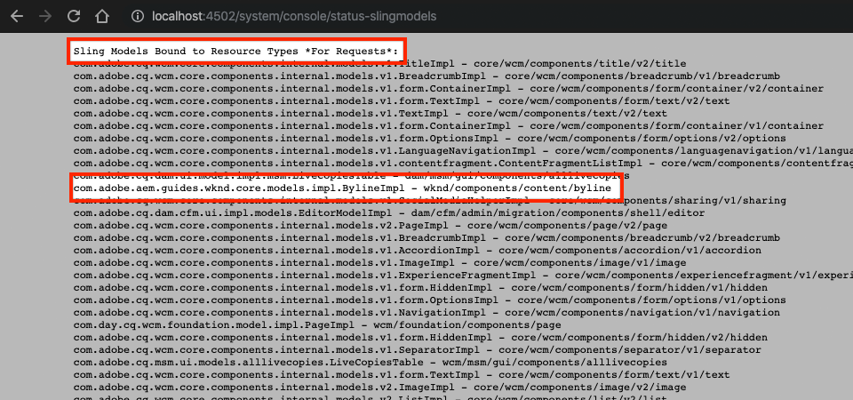

# 自定义组件 {#custom-component}

本教程涵盖了用于显示在对话框中所创作内容的自定义 `Byline` AEM 组件的端到端创建方法，并探讨了如何开发 Sling 模型来封装用于填充组件 HTL 的业务逻辑。

## 先决条件 {#prerequisites}

查看设置[本地开发环境](overview.md#local-dev-environment)所需的工具和说明。

### 入门项目 

>[!NOTE]
>
> 如果您成功完成了上一章的内容，您可以重复使用该项目，跳过签出入门项目的步骤。

签出作为本教程构建基础的基线代码：

1. 从 [GitHub](https://github.com/adobe/aem-guides-wknd) 签出 `tutorial/custom-component-start` 分支

   ```shell
   $ cd aem-guides-wknd
   $ git checkout tutorial/custom-component-start
   ```

1. 运用您的 Maven 技能将代码库部署到本地 AEM 实例：

   ```shell
   $ mvn clean install -PautoInstallSinglePackage
   ```

   >[!NOTE]
   >
   > 如果使用 AEM 6.5 或 6.4，请将 `classic` 配置文件附加到任何 Maven 命令。

   ```shell
   $ mvn clean install -PautoInstallSinglePackage -Pclassic
   ```

您可以随时在 [GitHub](https://github.com/adobe/aem-guides-wknd/tree/tutorial/custom-component-solution) 上查看完成的代码，或者切换到分支 `tutorial/custom-component-solution` 将代码签出到本地。

## 目标

1. 了解如何构建一个自定义 AEM 组件
1. 了解如何使用 Sling 模型封装业务逻辑
1. 了解如何在 HTL 脚本中使用 Sling 模型

## 您要构建什么 {#what-build}

WKND 教程的这个部分将创建一个署名组件，用于显示关于某个文章投稿人的创作信息。


*署名组件*

署名组件的实施包括一个收集署名内容的对话框和一个检索以下详细信息的自定义 Sling 模型：

* 名称
* 图像
* 职业

## 创建署名组件 {#create-byline-component}

首先，创建署名组件节点结构并定义一个对话框。这是 AEM 中的组件，通过其在 JCR 中的位置隐含定义了组件的资源类型。

对话框是内容作者可以提供的界面。在这个实施中，AEM WCM 核心组件的&#x200B;**图像**&#x200B;组件用于处理署名的图像的创作和渲染，因此必须将其设置为该组件的 `sling:resourceSuperType`。

### 创建组件定义 {#create-component-definition}

1. 在 **ui.apps** 模块中，导航至 `/apps/wknd/components`，然后创建一个名为 `byline` 的文件夹。
1. 在 `byline` 文件夹中添加一个名为 `.content.xml` 的文件

   

1. 如下填充 `.content.xml` 文件：

   ```xml
   <?xml version="1.0" encoding="UTF-8"?>
       <jcr:root xmlns:sling="http://sling.apache.org/jcr/sling/1.0" xmlns:cq="http://www.day.com/jcr/cq/1.0" xmlns:jcr="http://www.jcp.org/jcr/1.0"
       jcr:primaryType="cq:Component"
       jcr:title="Byline"
       jcr:description="Displays a contributor's byline."
       componentGroup="WKND Sites Project - Content"
       sling:resourceSuperType="core/wcm/components/image/v2/image"/>
   ```

   上述 XML 文件提供了组件的定义，包括标题、描述和组。`sling:resourceSuperType` 指向 `core/wcm/components/image/v2/image`，这是[核心图像组件](https://experienceleague.adobe.com/docs/experience-manager-core-components/using/wcm-components/image.html?lang=zh-Hans)。

### 创建 HTL 脚本 {#create-the-htl-script}

1. 在 `byline` 文件夹中添加文件 `byline.html`，它负责组件的 HTML 呈现。文件名称与文件夹名称必须相同，这非常重要，因为它会成为 Sling 用来渲染此资源类型的默认脚本。

1. 将以下代码添加到 `byline.html`。

   ```html
   <!--/* byline.html */-->
   <div data-sly-use.placeholderTemplate="core/wcm/components/commons/v1/templates.html">
   </div>
   <sly data-sly-call="${placeholderTemplate.placeholder @ isEmpty=true}"></sly>
   ```

Sling 模型创建以后，[稍后会重新访问](#byline-htl) `byline.html`。HTL 文件的当前状态允许组件在 AEM Sites 的页面编辑器中被拖放到页面上时显示为空状态。

### 创建对话框定义 {#create-the-dialog-definition}

接下来，使用以下字段为署名组件定义一个对话框：

* **姓名**：投稿人姓名的文本字段。
* **图像**：引用投稿人个人图片。
* **职业**：投稿人的职业属性列表。职业应按字母顺序（a 到 z）排列。

1. 在 `byline` 文件夹中创建一个名为 `_cq_dialog` 的文件夹。
1. 在 `byline/_cq_dialog` 中添加一个名为 `.content.xml` 的文件。这是对话框的 XML 定义。添加以下 XML：

   ```xml
   <?xml version="1.0" encoding="UTF-8"?>
   <jcr:root xmlns:sling="http://sling.apache.org/jcr/sling/1.0" xmlns:cq="http://www.day.com/jcr/cq/1.0" xmlns:jcr="http://www.jcp.org/jcr/1.0" xmlns:nt="http://www.jcp.org/jcr/nt/1.0"
           jcr:primaryType="nt:unstructured"
           jcr:title="Byline"
           sling:resourceType="cq/gui/components/authoring/dialog">
       <content
               jcr:primaryType="nt:unstructured"
               sling:resourceType="granite/ui/components/coral/foundation/container">
           <items jcr:primaryType="nt:unstructured">
               <tabs
                       jcr:primaryType="nt:unstructured"
                       sling:resourceType="granite/ui/components/coral/foundation/tabs"
                       maximized="{Boolean}false">
                   <items jcr:primaryType="nt:unstructured">
                       <asset
                               jcr:primaryType="nt:unstructured"
                               sling:hideResource="{Boolean}false"/>
                       <metadata
                               jcr:primaryType="nt:unstructured"
                               sling:hideResource="{Boolean}true"/>
                       <properties
                               jcr:primaryType="nt:unstructured"
                               jcr:title="Properties"
                               sling:resourceType="granite/ui/components/coral/foundation/container"
                               margin="{Boolean}true">
                           <items jcr:primaryType="nt:unstructured">
                               <columns
                                       jcr:primaryType="nt:unstructured"
                                       sling:resourceType="granite/ui/components/coral/foundation/fixedcolumns"
                                       margin="{Boolean}true">
                                   <items jcr:primaryType="nt:unstructured">
                                       <column
                                               jcr:primaryType="nt:unstructured"
                                               sling:resourceType="granite/ui/components/coral/foundation/container">
                                           <items jcr:primaryType="nt:unstructured">
                                               <name
                                                       jcr:primaryType="nt:unstructured"
                                                       sling:resourceType="granite/ui/components/coral/foundation/form/textfield"
                                                       emptyText="Enter the contributor's name to display."
                                                       fieldDescription="The contributor's name to display."
                                                       fieldLabel="Name"
                                                       name="./name"
                                                       required="{Boolean}true"/>
                                               <occupations
                                                       jcr:primaryType="nt:unstructured"
                                                       sling:resourceType="granite/ui/components/coral/foundation/form/multifield"
                                                       fieldDescription="A list of the contributor's occupations."
                                                       fieldLabel="Occupations"
                                                       required="{Boolean}false">
                                                   <field
                                                           jcr:primaryType="nt:unstructured"
                                                           sling:resourceType="granite/ui/components/coral/foundation/form/textfield"
                                                           emptyText="Enter an occupation"
                                                           name="./occupations"/>
                                               </occupations>
                                           </items>
                                       </column>
                                   </items>
                               </columns>
                           </items>
                       </properties>
                   </items>
               </tabs>
           </items>
       </content>
   </jcr:root>
   ```

   这些对话框节点定义使用 [Sling 资源合并器](https://sling.apache.org/documentation/bundles/resource-merger.html)控制哪些对话框选项卡从 `sling:resourceSuperType` 组件继承，在本例中为&#x200B;**核心组件的图像组件**。

   

### 创建策略对话框 {#create-the-policy-dialog}

按照与创建对话框相同的方法创建一个策略对话框（以前称为“设计对话框”），隐藏那些从核心组件的图像组件继承的策略配置中不需要的字段。

1. 在 `byline` 文件夹中创建一个名为 `_cq_design_dialog` 的文件夹。
1. 在 `byline/_cq_design_dialog` 中创建一个名为 `.content.xml` 的文件。使用以下 XML 更新文件。最简单的方法是打开 `.content.xml`，然后将下面的 XML 复制/粘贴到其中。

   ```xml
   <?xml version="1.0" encoding="UTF-8"?>
   <jcr:root xmlns:sling="http://sling.apache.org/jcr/sling/1.0" xmlns:granite="http://www.adobe.com/jcr/granite/1.0" xmlns:cq="http://www.day.com/jcr/cq/1.0" xmlns:jcr="http://www.jcp.org/jcr/1.0" xmlns:nt="http://www.jcp.org/jcr/nt/1.0"
       jcr:primaryType="nt:unstructured"
       jcr:title="Byline"
       sling:resourceType="cq/gui/components/authoring/dialog">
       <content
               jcr:primaryType="nt:unstructured">
           <items jcr:primaryType="nt:unstructured">
               <tabs
                       jcr:primaryType="nt:unstructured">
                   <items jcr:primaryType="nt:unstructured">
                       <properties
                               jcr:primaryType="nt:unstructured">
                           <items jcr:primaryType="nt:unstructured">
                               <content
                                       jcr:primaryType="nt:unstructured">
                                   <items jcr:primaryType="nt:unstructured">
                                       <decorative
                                               jcr:primaryType="nt:unstructured"
                                               sling:hideResource="{Boolean}true"/>
                                       <altValueFromDAM
                                               jcr:primaryType="nt:unstructured"
                                               sling:hideResource="{Boolean}true"/>
                                       <titleValueFromDAM
                                               jcr:primaryType="nt:unstructured"
                                               sling:hideResource="{Boolean}true"/>
                                       <displayCaptionPopup
                                               jcr:primaryType="nt:unstructured"
                                               sling:hideResource="{Boolean}true"/>
                                       <disableUuidTracking
                                               jcr:primaryType="nt:unstructured"
                                               sling:hideResource="{Boolean}true"/>
                                   </items>
                               </content>
                           </items>
                       </properties>
                       <features
                               jcr:primaryType="nt:unstructured">
                           <items jcr:primaryType="nt:unstructured">
                               <content
                                       jcr:primaryType="nt:unstructured">
                                   <items jcr:primaryType="nt:unstructured">
                                       <accordion
                                               jcr:primaryType="nt:unstructured">
                                           <items jcr:primaryType="nt:unstructured">
                                               <orientation
                                                       jcr:primaryType="nt:unstructured"
                                                       sling:hideResource="{Boolean}true"/>
                                               <crop
                                                       jcr:primaryType="nt:unstructured"
                                                       sling:hideResource="{Boolean}true"/>
                                           </items>
                                       </accordion>
                                   </items>
                               </content>
                           </items>
                       </features>
                   </items>
               </tabs>
           </items>
       </content>
   </jcr:root>
   ```

   上述&#x200B;**策略对话框** XML 的基础来自[核心组件的图像组件](https://github.com/adobe/aem-core-wcm-components/blob/main/content/src/content/jcr_root/apps/core/wcm/components/image/v2/image/_cq_design_dialog/.content.xml)。

   就像在对话框配置中一样，[Sling 资源合并器](https://sling.apache.org/documentation/bundles/resource-merger.html)用于隐藏以其他方式从 `sling:resourceSuperType` 继承的不相关字段，如 `sling:hideResource="{Boolean}true"` 属性的节点定义所示。

### 部署代码 {#deploy-the-code}

1. 通过您的 IDE 或运用您的 Maven 技能同步 `ui.apps` 中的更改。

   

## 在页面上添加组件 {#add-the-component-to-a-page}

为了简单起见并专注于 AEM 组件开发，我们将当前状态的署名组件添加到一个文章页面，以验证 `cq:Component` 节点定义是否正确。还要验证 AEM 能够识别新的组件定义以及组件的对话框能够在创作中正常工作。

### 将图像添加到 AEM Assets

首先将一个示例头像上传到 AEM Assets，用于填充署名组件中的图像。

1. 导航到 AEM Assets 中的洛杉矶滑板运动场文件夹：[http://localhost:4502/assets.html/content/dam/wknd/en/magazine/la-skateparks](http://localhost:4502/assets.html/content/dam/wknd/en/magazine/la-skateparks)。

1. 将 **[stacey-roswells.jpg](assets/custom-component/stacey-roswells.jpg)** 的头像上传到此文件夹。

   

### 创作组件 {#author-the-component}

接下来，将署名组件添加到 AEM 中的一个页面。由于署名组件已通过 `ui.apps/src/main/content/jcr_root/apps/wknd/components/byline/.content.xml` 定义添加到 **WKND Sites 项目 - 内容**&#x200B;组件组，因此该组件可自动提供给任何其&#x200B;**策略**&#x200B;允许使用 **WKND Sites 项目 - 内容**&#x200B;组件组的&#x200B;**容器**&#x200B;使用。因此它可以在文章页面的布局容器中使用。

1. 导航至洛杉矶滑板运动场文章：[http://localhost:4502/editor.html/content/wknd/us/en/magazine/guide-la-skateparks.html](http://localhost:4502/editor.html/content/wknd/us/en/magazine/guide-la-skateparks.html)

1. 从左侧边栏中，将&#x200B;**署名组件**&#x200B;拖放到打开的文章页面的布局容器的&#x200B;**底部**。

   

1. 确保左侧边栏已打开&#x200B;**且可见，并且**&#x200B;已选择资产查找器**。

1. 选择&#x200B;**署名组件占位符**，在显示的操作栏中点击&#x200B;**扳手**&#x200B;图标，打开对话框。

1. 对话框打开后，第一个选项卡（资产）是活跃的，打开左侧边栏，从资产查找器中将一个图像拖到图像放置区域中。搜索“stacey”，查找 WKND ui.content 包中提供的 Stacey Roswells 个人照片。

   

1. 添加图像后，点击&#x200B;**属性**&#x200B;选项卡，然后输入&#x200B;**姓名**&#x200B;和&#x200B;**职业**。

   输入职业时，请以&#x200B;**反向字母顺序**&#x200B;输入，以便验证 Sling 模型中实施的字母顺序业务逻辑。

   点击右下角的&#x200B;**完成**&#x200B;按钮，保存更改。

   

   AEM 作者通过对话框配置和创作组件。现在，在署名组件的开发中已包含了用于收集数据的对话框，但尚未添加用于渲染创作内容的逻辑。因此只显示占位符。

1. 保存对话框后，导航到 [CRXDE Lite](http://localhost:4502/crx/de/index.jsp#/content/wknd/us/en/magazine/guide-la-skateparks/jcr%3Acontent/root/container/container/byline)，查看组件内容如何存储在 AEM 页面下的署名组件内容节点上。

   找到洛杉矶滑板运动场页面下方的署名组件内容节点，即 `/content/wknd/us/en/magazine/guide-la-skateparks/jcr:content/root/container/container/byline`。

   请注意，属性名称 `name`、`occupations` 和 `fileReference` 存储在&#x200B;**署名节点**&#x200B;上。

   另外，请注意节点的 `sling:resourceType` 设置为 `wknd/components/content/byline`，将这个内容节点与署名组件实施绑定。

   

## 创建署名 Sling 模型 {#create-sling-model}

接下来，我们创建一个 Sling 模型作为数据模型，用于容纳署名组件的业务逻辑。

Sling 模型是注释驱动的 Java™ POJO（普通老式 Java™ 对象），帮助将数据从 JCR 映射到 Java™ 变量，并提高 AEM 上下文中开发时的效率。

### 查看 Maven 依赖项 {#maven-dependency}

署名 Sling 模型依赖于 AEM 提供的多个 Java™ API。这些 API 通过 `core` 模块的 POM 文件中列出的 `dependencies` 提供。本教程使用的项目是为 AEM as a Cloud Service 构建的。然而，它的独特之处在于它向后兼容 AEM 6.5/6.4。因此同时包含了 Cloud Service 和 AEM 6.x 的依赖项。

1. 打开 `<src>/aem-guides-wknd/core/pom.xml` 下面的 `pom.xml` 文件。
1. 找到 `aem-sdk-api` - **仅 AEM as a Cloud Service** 的依赖项

   ```xml
   <dependency>
       <groupId>com.adobe.aem</groupId>
       <artifactId>aem-sdk-api</artifactId>
   </dependency>
   ```

   [aem-sdk-api](https://experienceleague.adobe.com/docs/experience-manager-cloud-service/content/implementing/developing/aem-as-a-cloud-service-sdk.html?lang=zh-hans) 包含 AEM 公开的所有公共 Java™ API。构建此项目时默认使用 `aem-sdk-api`。此版本在项目根目录的父级 reactor pom 中进行维护，位于 `aem-guides-wknd/pom.xml`。

1. 找到 `uber-jar` - **仅 AEM 6.5/6.4** 的依赖项

   ```xml
   ...
       <dependency>
           <groupId>com.adobe.aem</groupId>
           <artifactId>uber-jar</artifactId>
           <classifier>apis</classifier>
       </dependency>
   ...
   ```

   只有在调用 `classic` 配置文件，也就是 `mvn clean install -PautoInstallSinglePackage -Pclassic` 的情况下会包含 `uber-jar`。这也是这个项目独有的。在由 AEM 项目原型生成的真实项目中，如果指定的 AEM 版本为 6.5 或 6.4，则 `uber-jar` 为默认值。

   [uber-jar](https://experienceleague.adobe.com/docs/experience-manager-65/developing/devtools/ht-projects-maven.html?lang=zh-Hans#experience-manager-api-dependencies) 包含 AEM 6.x 公开的所有公共 Java™ API。版本在项目根目录的父级 reactor pom 中进行维护，位于 `aem-guides-wknd/pom.xml`。

1. 找到 `core.wcm.components.core` 的依赖项：

   ```xml
    <!-- Core Component Dependency -->
       <dependency>
           <groupId>com.adobe.cq</groupId>
           <artifactId>core.wcm.components.core</artifactId>
       </dependency>
   ```

   这是 AEM 核心组件公开的完整的公共 Java™ API。AEM 核心组件是在 AEM 之外维护的项目，因此有单独的发布周期。因此，它是一个需要单独被包含的依赖项，**不**&#x200B;包含在 `uber-jar` 或 `aem-sdk-api` 中。

   与 uber-jar 类似，此依赖项的版本在 `aem-guides-wknd/pom.xml` 中的父级 reactor pom 文件中维护。

   在本教程的后面，会使用核心组件图像类在署名组件中显示图像。要构建和编译 Sling 模型，必须有核心组件依赖项。

### 署名接口 {#byline-interface}

为署名创建一个公共的 Java™ 接口。`Byline.java` 定义了驱动 `byline.html` HTL 脚本所需的公共方法。

1. `core/src/main/java/com/adobe/aem/guides/wknd/core/models` 文件夹中的 `core` 模块会创建一个名为 `Byline.java` 的文件。

   

1. 使用以下方法更新 `Byline.java`：

   ```java
   package com.adobe.aem.guides.wknd.core.models;
   
   import java.util.List;
   
   /**
   * Represents the Byline AEM Component for the WKND Site project.
   **/
   public interface Byline {
       /***
       * @return a string to display as the name.
       */
       String getName();
   
       /***
       * Occupations are to be sorted alphabetically in a descending order.
       *
       * @return a list of occupations.
       */
       List<String> getOccupations();
   
       /***
       * @return a boolean if the component has enough content to display.
       */
       boolean isEmpty();
   }
   ```

   前两种方法公开用于署名组件的&#x200B;**姓名**&#x200B;和&#x200B;**职业**&#x200B;的值。

   `isEmpty()` 方法用于确定组件是否有任何内容需要渲染或者是否在等待配置。

   请注意，没有针对图像的方法；[稍后将探讨这一点](#tackling-the-image-problem)。

1. 包含公共 Java™ 类的 Java™ 包，在本例中为 Sling 模型，必须使用包的 `package-info.java` 文件进行版本控制。

   由于 WKND 源的 Java™ 包 `com.adobe.aem.guides.wknd.core.models` 声明版本是 `1.0.0`，而且添加了非破坏性公共接口和方法，因此版本必须提高到 `1.1.0`。打开 `core/src/main/java/com/adobe/aem/guides/wknd/core/models/package-info.java` 处的文件，将 `@Version("1.0.0")` 更新为 `@Version("2.1.0")`。

   ```
   @Version("2.1.0")
   package com.adobe.aem.guides.wknd.core.models;
   
   import org.osgi.annotation.versioning.Version;
   ```

每当此包中的文件发生更改时，就[必须从语义上调整包的版本](https://semver.org/)。如果‍不调整，Maven 项目的 [bnd-baseline-maven-plugin](https://github.com/bndtools/bnd) 就会检测到无效的包版本，从而中断构建。幸运的是，如果失败了，Maven 插件就会报告无效的 Java™ 包版本以及应该是什么版本。将违反 Java™ 包的 `package-info.java` 中的 `@Version("...")` 声明更新为插件建议的版本，修复版本声明。

### 署名实施 {#byline-implementation}

`BylineImpl.java` 是 Sling 模型的实施，实施了先前定义的 `Byline.java` 接口。`BylineImpl.java` 的完整代码可以在本节末尾找到。

1. 在 `core/src/main/java/com/adobe/aem/guides/core/models` 下面创建一个名为 `impl` 的文件夹。
1. 在 `impl` 文件夹中创建一个文件 `BylineImpl.java`。

   

1. 打开 `BylineImpl.java`。指定它实施 `Byline` 接口。使用 IDE 的自动完成功能或手动更新文件，使其包含实施 `Byline` 接口所需的方法：

   ```java
   package com.adobe.aem.guides.wknd.core.models.impl;
   import java.util.List;
   import com.adobe.aem.guides.wknd.core.models.Byline;
   
   public class BylineImpl implements Byline {
   
       @Override
       public String getName() {
           // TODO Auto-generated method stub
           return null;
       }
   
       @Override
       public List<String> getOccupations() {
           // TODO Auto-generated method stub
           return null;
       }
   
       @Override
       public boolean isEmpty() {
           // TODO Auto-generated method stub
           return false;
       }
   }
   ```

1. 使用以下类级别注释更新 `BylineImpl.java`，添加 Sling 模型注释。`@Model(..)` 注释会将这个类转变为 Sling 模型。

   ```java
   import org.apache.sling.api.SlingHttpServletRequest;
   import org.apache.sling.models.annotations.Model;
   import org.apache.sling.models.annotations.DefaultInjectionStrategy;
   ...
   @Model(
           adaptables = {SlingHttpServletRequest.class},
           adapters = {Byline.class},
           resourceType = {BylineImpl.RESOURCE_TYPE},
           defaultInjectionStrategy = DefaultInjectionStrategy.OPTIONAL
   )
   public class BylineImpl implements Byline {
       protected static final String RESOURCE_TYPE = "wknd/components/byline";
       ...
   }
   ```

   我们来仔细看一下这个注释和它的参数：

   * 当部署到 AEM 时，`@Model` 注释会将 BylineImpl 注册为 Sling 模型。
   * `adaptables` 参数指定该模型可以根据请求进行调整。
   * `adapters` 参数允许在署名接口下注册这个实施类。这允许 HTL 脚本通过接口（而不是直接实施）调用 Sling 模型。[有关适配器的更多详细信息请参阅此处](https://sling.apache.org/documentation/bundles/models.html#specifying-an-alternate-adapter-class-since-110)。
   * `resourceType` 指向（之前创建的）署名组件资源类型，在有多个实施的情况下有助于解析正确的模型。[关于将模型类与资源类型关联的更多详细信息，请参见此处](https://sling.apache.org/documentation/bundles/models.html#associating-a-model-class-with-a-resource-type-since-130)。

### 实施 Sling 模型方法 {#implementing-the-sling-model-methods}

#### getName() {#implementing-get-name}

进行实施的第一个方法是 `getName()`，它返回署名 JCR 内容节点里存储在属性 `name` 中的值。

为此，使用 `@ValueMapValue` Sling 模型注释，通过请求资源的 ValueMap 将值注入一个 Java™ 字段。


```java
import org.apache.sling.models.annotations.injectorspecific.ValueMapValue;

public class BylineImpl implements Byline {
    ...
    @ValueMapValue
    private String name;

    ...
    @Override
    public String getName() {
        return name;
    }
    ...
}
```

由于 JCR 属性与 Java™ 字段共享名称（两者都是“name”），`@ValueMapValue` 会自动解析这个关联，将此属性的值注入 Java™ 字段。

#### getOccupations() {#implementing-get-occupations}

下一个要实施的方法是 `getOccupations()`。此方法会加载存储在 JCR 属性 `occupations` 中的职业，并返回一个（按字母顺序）排序的职业集合。

使用在 `getName()` 中探讨过的相同技术，可以将这个属性值注入到 Sling 模型的字段中。

通过注入 Java™ 字段 `occupations` 在 Sling 模型中提供了 JCR 属性值后，就可以在 `getOccupations()` 方法中应用排序业务逻辑。


```java
import java.util.ArrayList;
import java.util.Collections;
  ...

public class BylineImpl implements Byline {
    ...
    @ValueMapValue
    private List<String> occupations;
    ...
    @Override
    public List<String> getOccupations() {
        if (occupations != null) {
            Collections.sort(occupations);
            return new ArrayList<String>(occupations);
        } else {
            return Collections.emptyList();
        }
    }
    ...
}
  ...
```


#### isEmpty() {#implementing-is-empty}

最后一个公共方法是 `isEmpty()`，它决定了组件何时应认为自己“已经被充分创作”，可以进行渲染。

对于此组件，业务要求是必须先填充所有这三个字段 `name, image and occupations`，*然后*&#x200B;才能渲染该组件。


```java
import org.apache.commons.lang3.StringUtils;
  ...
public class BylineImpl implements Byline {
    ...
    @Override
    public boolean isEmpty() {
        if (StringUtils.isBlank(name)) {
            // Name is missing, but required
            return true;
        } else if (occupations == null || occupations.isEmpty()) {
            // At least one occupation is required
            return true;
        } else if (/* image is not null, logic to be determined */) {
            // A valid image is required
            return true;
        } else {
            // Everything is populated, so this component is not considered empty
            return false;
        }
    }
    ...
}
```


#### 处理“图像问题” {#tackling-the-image-problem}

检查姓名和职业条件很简单，Apache Commons Lang3 提供了方便的 [StringUtils](https://commons.apache.org/proper/commons-lang/apidocs/org/apache/commons/lang3/StringUtils.html) 类。然而，由于核心组件图像组件用于显示图像，因此不太清楚应如何验证&#x200B;**图像的存在**。

有两种方法可以解决这个问题：

检查 `fileReference` JCR 属性是否解析为资产。*或者*&#x200B;将这个资源转换为核心组件图像 Sling 模型，并确保 `getSrc()` 方法不为空。

我们使用&#x200B;**第二种**&#x200B;方法。第一种方法可能是足够的，但在本教程中，使用后一种方法可以让我们探索 Sling 模型的其他功能。

1. 创建一个获取图像的私有方法。这个方法采用私有，因为不需要在 HTL 本身中公开图像对象，它仅用于驱动 `isEmpty().`

   为 `getImage()` 添加以下私有方法：

   ```java
   import com.adobe.cq.wcm.core.components.models.Image;
   ...
   private Image getImage() {
       Image image = null;
       // Figure out how to populate the image variable!
       return image;
   }
   ```

   正如上面提到的，另外还有两种方法可以获取&#x200B;**图像 Sling 模型**：

   第一个使用 `@Self` 注释，自动将当前请求适配到核心组件的 `Image.class`

   第二个使用 [Apache Sling ModelFactory](https://sling.apache.org/apidocs/sling10/org/apache/sling/models/factory/ModelFactory.html) OSGi 服务，这项方便的服务可以帮助我们在 Java™ 代码中创建其他类型的 Sling 模型。

   我们使用第二种方法。

   >[!NOTE]
   >
   >在真实世界的实施中，使用 `@Self` 的“第一个”方法是首选，因为它是更简单、更优雅的解决方案。在本教程中使用第二种方法，因为它需要探索 Sling 模型的更多方面，这对于更复杂的组件来说很有用！

   由于 Sling 模型是 Java™ POJO，而不是 OSGi 服务，因此通常的 OSGi 注入注释 `@Reference` **不能**&#x200B;使用，为了取代这一点，Sling 模型提供一个专门的 **[@OSGiService](https://sling.apache.org/documentation/bundles/models.html#injector-specific-annotations)** 注释，可提供类似的功能。

1. 更新 `BylineImpl.java`，以包含 `OSGiService` 注释来注入 `ModelFactory`：

   ```java
   import org.apache.sling.models.factory.ModelFactory;
   import org.apache.sling.models.annotations.injectorspecific.OSGiService;
   ...
   public class BylineImpl implements Byline {
       ...
       @OSGiService
       private ModelFactory modelFactory;
   }
   ```

   通过可用的 `ModelFactory`，可以使用以下方法创建核心组件图像 Sling 模型：

   ```java
   modelFactory.getModelFromWrappedRequest(SlingHttpServletRequest request, Resource resource, java.lang.Class<T> targetClass)
   ```

   然而，这种方法需要一个请求和资源，而这两者在 Sling 模型中都不可用。为了获得它们，要使用更多的 Sling 模型注释！

   要获取当前请求，可以使用 **[@Self](https://sling.apache.org/documentation/bundles/models.html#injector-specific-annotations)** 注释将 `adaptable`（在 `@Model(..)` 中定义为 `SlingHttpServletRequest.class`）注入到 Java™ 类字段中。

1. 添加 **@Self** 注释，以获取 **SlingHttpServletRequest 请求**：

   ```java
   import org.apache.sling.models.annotations.injectorspecific.Self;
   ...
   @Self
   private SlingHttpServletRequest request;
   ```

   请记住，使用 `@Self Image image` 注入核心组件图像 Sling 模型是上述情况的一个选项，`@Self` 注释会尝试注入可调整对象（在本例中为 SlingHttpServletRequest），并会适应注释字段类型。由于核心组件图像 Sling 模型可从 SlingHttpServletRequest 对象进行调整，因此这是可行的，而且比更具探索性的 `modelFactory` 方法所需的代码更少。

   现在，通过 ModelFactory API 将图像模型实例化所需的变量已经注入。现在，在 Sling 模型实例化后，我们使用 Sling 模型的 **[@PostConstruct](https://sling.apache.org/documentation/bundles/models.html#postconstruct-methods)** 注释获取这个对象。

   `@PostConstruct` 非常有用，其作用与构造函数类似，但是，它是在类实例化并且所有带注释的 Java™ 字段都注入以后才被调用。其他 Sling 模型注释都注解 Java™ 类字段（变量），而 `@PostConstruct` 注解一个无参数、零参数方法，通常命名为 `init()`（但可以是任何名称）。

1. 添加 **@PostConstruct** 方法：

   ```java
   import javax.annotation.PostConstruct;
   ...
   public class BylineImpl implements Byline {
       ...
       private Image image;
   
       @PostConstruct
       private void init() {
           image = modelFactory.getModelFromWrappedRequest(request,
                                                           request.getResource(),
                                                           Image.class);
       }
       ...
   }
   ```

   请记住，Sling 模型&#x200B;**不是** OSGi 服务，因此维护类状态是安全的。通常 `@PostConstruct` 会派生并设置 Sling 模型类状态供以后使用，类似于普通构造函数的行为。

   如果 `@PostConstruct` 方法抛出异常，Sling 模型就不会被实例化，而是为 null。

1. **getImage()** 现在可以更新为返回图像对象。

   ```java
   /**
       * @return the Image Sling Model of this resource, or null if the resource cannot create a valid Image Sling Model.
   */
   private Image getImage() {
       return image;
   }
   ```

1. 现在我们回到 `isEmpty()` 并完成实施：

   ```java
   @Override
   public boolean isEmpty() {
      final Image componentImage = getImage();
   
       if (StringUtils.isBlank(name)) {
           // Name is missing, but required
           return true;
       } else if (occupations == null || occupations.isEmpty()) {
           // At least one occupation is required
           return true;
       } else if (componentImage == null || StringUtils.isBlank(componentImage.getSrc())) {
           // A valid image is required
           return true;
       } else {
           // Everything is populated, so this component is not considered empty
           return false;
       }
   }
   ```

   请注意多次调用 `getImage()` 没有问题，因为它返回初始化的 `image` 类变量，而且不调用 `modelFactory.getModelFromWrappedRequest(...)`，后者虽然并不太复杂，但还是应该避免不必要的调用。

1. 最后的 `BylineImpl.java` 看起来应该是这样的：


   ```java
   package com.adobe.aem.guides.wknd.core.models.impl;
   
   import java.util.ArrayList;
   import java.util.Collections;
   import java.util.List;
   import javax.annotation.PostConstruct;
   import org.apache.commons.lang3.StringUtils;
   import org.apache.sling.api.SlingHttpServletRequest;
   import org.apache.sling.models.annotations.DefaultInjectionStrategy;
   import org.apache.sling.models.annotations.Model;
   import org.apache.sling.models.annotations.injectorspecific.OSGiService;
   import org.apache.sling.models.annotations.injectorspecific.Self;
   import org.apache.sling.models.annotations.injectorspecific.ValueMapValue;
   import org.apache.sling.models.factory.ModelFactory;
   import com.adobe.aem.guides.wknd.core.models.Byline;
   import com.adobe.cq.wcm.core.components.models.Image;
   
   @Model(
           adaptables = {SlingHttpServletRequest.class},
           adapters = {Byline.class},
           resourceType = {BylineImpl.RESOURCE_TYPE},
           defaultInjectionStrategy = DefaultInjectionStrategy.OPTIONAL
   )
   public class BylineImpl implements Byline {
       protected static final String RESOURCE_TYPE = "wknd/components/byline";
   
       @Self
       private SlingHttpServletRequest request;
   
       @OSGiService
       private ModelFactory modelFactory;
   
       @ValueMapValue
       private String name;
   
       @ValueMapValue
       private List<String> occupations;
   
       private Image image;
   
       /**
       * @PostConstruct is immediately called after the class has been initialized
       * but BEFORE any of the other public methods. 
       * It is a good method to initialize variables that is used by methods in the rest of the model
       *
       */
       @PostConstruct
       private void init() {
           // set the image object
           image = modelFactory.getModelFromWrappedRequest(request, request.getResource(), Image.class);
       }
   
       @Override
       public String getName() {
           return name;
       }
   
       @Override
       public List<String> getOccupations() {
           if (occupations != null) {
               Collections.sort(occupations);
               return new ArrayList<String>(occupations);
           } else {
               return Collections.emptyList();
           }
       }
   
       @Override
       public boolean isEmpty() {
           final Image componentImage = getImage();
   
           if (StringUtils.isBlank(name)) {
               // Name is missing, but required
               return true;
           } else if (occupations == null || occupations.isEmpty()) {
               // At least one occupation is required
               return true;
           } else if (componentImage == null || StringUtils.isBlank(componentImage.getSrc())) {
               // A valid image is required
               return true;
           } else {
               // Everything is populated, so this component is not considered empty
               return false;
           }
       }
   
       /**
       * @return the Image Sling Model of this resource, or null if the resource cannot create a valid Image Sling Model.
       */
       private Image getImage() {
           return image;
       }
   }
   ```


## 署名 HTL {#byline-htl}

在 `ui.apps` 模块中打开 `/apps/wknd/components/byline/byline.html`，这是在 AEM 组件的早期设置中创建的。

```html
<div data-sly-use.placeholderTemplate="core/wcm/components/commons/v1/templates.html">
</div>
<sly data-sly-call="${placeholderTemplate.placeholder @ isEmpty=false}"></sly>
```

我们来回顾一下这个 HTL 脚本到目前为止所做的事情：

* `placeholderTemplate` 指向核心组件的占位符，在组件未完全配置的情况下显示。这会在 AEM Sites 页面编辑器中渲染为一个带有组件标题的方框，如上文在 `cq:Component` 的 `jcr:title` 属性中定义的那样。

* `data-sly-call="${placeholderTemplate.placeholder @ isEmpty=false}` 会加载上面定义的 `placeholderTemplate`，并将一个布尔值（目前硬编码为 `false`）传递到占位符模板中。如果 `isEmpty` 为真，占位符模板就渲染灰色框，否则不渲染任何内容。

### 更新署名 HTL

1. 用以下框架 HTML 结构更新 **byline.html**：

   ```html
   <div data-sly-use.placeholderTemplate="core/wcm/components/commons/v1/templates.html"
       class="cmp-byline">
           <div class="cmp-byline__image">
               <!--/* Include the Core Components Image Component */-->
           </div>
           <h2 class="cmp-byline__name"><!--/* Include the name */--></h2>
           <p class="cmp-byline__occupations"><!--/* Include the occupations */--></p>
   </div>
   <sly data-sly-call="${placeholderTemplate.placeholder @ isEmpty=true}"></sly>
   ```

   请注意 CSS 类遵循 [BEM 命名惯例](https://getbem.com/naming/)。虽然使用 BEM 惯例不是强制性的，但建议使用 BEM，因为它用于核心组件 CSS 类，并且通常会产生简洁、可读的 CSS 规则。

### 实例化 HTL 中的 Sling 模型对象 {#instantiating-sling-model-objects-in-htl}

[使用块语句](https://github.com/adobe/htl-spec/blob/master/SPECIFICATION.md#221-use)用于实例化 HTL 脚本中的 Sling 模型对象，并将其分配给 HTL 变量。

`data-sly-use.byline="com.adobe.aem.guides.wknd.models.Byline"` 使用 BylineImpl 实施的署名接口 (com.adobe.aem.guides.wknd.models.Byline)，使当前的 SlingHttpServletRequest 适应它，结果存储在一个 HTL 变量名 byline 中（`data-sly-use.<variable-name>`）。

1. 更新外层 `div`，通过其公共接口引用&#x200B;**署名** Sling 模型：

   ```xml
   <div data-sly-use.byline="com.adobe.aem.guides.wknd.core.models.Byline"
       data-sly-use.placeholderTemplate="core/wcm/components/commons/v1/templates.html"
       class="cmp-byline">
       ...
   </div>
   ```

### 访问 Sling 模型方法 {#accessing-sling-model-methods}

HTL 借鉴了 JSTL，使用与 Java™ getter 方法相同的名称简化。

例如，调用署名 Sling 模型的 `getName()` 方法可以简化为 `byline.name`，类似地，`byline.isEmpty` 可以简化为 `byline.empty`。使用完整的方法名称 `byline.getName` 或 `byline.isEmpty` 也同样有效。请注意，从不使用 `()` 来调用 HTL 中的方法（与 JSTL 类似）。

需要参数的 Java™ 方法&#x200B;**不能**&#x200B;在 HTL 中使用。这是特意设计的，为了保持 HTL 中的逻辑简单。

1. 要将署名姓名添加到组件中，可以调用署名 Sling 模型上的 `getName()` 方法，也可以使用 HTL 中的 `${byline.name}`。

   更新 `h2` 标记：

   ```xml
   <h2 class="cmp-byline__name">${byline.name}</h2>
   ```

### 使用 HTL 表达式选项 {#using-htl-expression-options}

[HTL 表达式选项](https://github.com/adobe/htl-spec/blob/master/SPECIFICATION.md#12-available-expression-options)用作 HTL 中内容的修饰符，涵盖范围从日期格式设置到 i18n 翻译。表达式还可用于连接值列表或值数组，以逗号分隔的格式显示职业时就需要表达式。

表达式通过 HTL 表达式中的 `@` 运算符添加。

1. 要连接职业列表与“，”，请使用以下代码：

   ```html
   <p class="cmp-byline__occupations">${byline.occupations @ join=', '}</p>
   ```

### 有条件地显示占位符 {#conditionally-displaying-the-placeholder}

AEM 组件的大多数 HTL 脚本都使用&#x200B;**占位符范式**&#x200B;来为作者提供一个&#x200B;**组件创作错误的视觉提示，但不显示在 AEM Publish 上**。推动这种决定的惯例做法是在支持组件的 Sling 模型上实施一个方法，在本例中是：`Byline.isEmpty()`。

在署名 Sling 模型上调用 `isEmpty()` 方法，结果（或者更确切地说，这是通过 `!` 运算符表示的负值）保存到名为 `hasContent` 的一个 HTL 变量中：

1. 更新外层 `div`，保存名为 `hasContent` 的 HTL 变量：

   ```html
    <div data-sly-use.byline="com.adobe.aem.guides.wknd.core.models.Byline"
         data-sly-use.placeholderTemplate="core/wcm/components/commons/v1/templates.html"
         data-sly-test.hasContent="${!byline.empty}"
         class="cmp-byline">
         ...
   </div>
   ```

   请注意 `data-sly-test` 的使用，这个 HTL `test` 块是关键，它既设置了 HTL 变量，又决定了渲染/不渲染它所在的 HTML 元素。它基于 HTL 表达式评估的结果。如果为“true”，HTML 元素就渲染，否则不渲染。

   现在，这个 HTL 变量 `hasContent` 可以重复用于有条件地显示/隐藏占位符。

1. 使用以下方法更新对文件末尾 `placeholderTemplate` 的有条件调用：

   ```html
   <sly data-sly-call="${placeholderTemplate.placeholder @ isEmpty=!hasContent}"></sly>
   ```

### 使用核心组件显示图像 {#using-the-core-components-image}

`byline.html` 的 HTL 脚本现在已基本完成，只缺少图像。

由于 `sling:resourceSuperType` 指向核心组件的图像组件来创作图像，因此可以使用核心组件的图像组件来渲染图像。

为此，我们现在来包含当前的署名资源，但使用资源类型 `core/wcm/components/image/v2/image` 来强制使用核心组件的图像组件的资源类型。这是一个强大的组件复用模式。为此使用 HTL 的 `data-sly-resource` 块。

1. 使用以下方法将 `div` 替换为 `cmp-byline__image` 的一个类：

   ```html
   <div class="cmp-byline__image"
       data-sly-resource="${ '.' @ resourceType = 'core/wcm/components/image/v2/image' }"></div>
   ```

   这个 `data-sly-resource` 通过相对路径 `'.'` 包含当前资源，并强制包含资源类型为 `core/wcm/components/image/v2/image` 的当前资源（或署名内容资源）。

   核心组件资源类型是直接使用，而不是通过代理，因为这是在脚本中使用，而且绝不会在内容中保留。

2. 完成的 `byline.html` 如下：

   ```html
   <!--/* byline.html */-->
   <div data-sly-use.byline="com.adobe.aem.guides.wknd.core.models.Byline" 
       data-sly-use.placeholderTemplate="core/wcm/components/commons/v1/templates.html"
       data-sly-test.hasContent="${!byline.empty}"
       class="cmp-byline">
       <div class="cmp-byline__image"
           data-sly-resource="${ '.' @ resourceType = 'core/wcm/components/image/v2/image' }">
       </div>
       <h2 class="cmp-byline__name">${byline.name}</h2>
       <p class="cmp-byline__occupations">${byline.occupations @ join=', '}</p>
   </div>
   <sly data-sly-call="${placeholderTemplate.placeholder @ isEmpty=!hasContent}"></sly>
   ```

3. 将代码库部署到本地 AEM 实例。由于对 `core` 和 `ui.apps` 都进行了更改，因此需要部署两个模块。

   ```shell
   $ cd aem-guides-wknd/ui.apps
   $ mvn clean install -PautoInstallPackage
   ```

   ```shell
   $ cd ../core
   $ mvn clean install -PautoInstallBundle
   ```

   要部署到 AEM 6.5/6.4，请调用 `classic` 配置文件：

   ```shell
   $ cd ../core
   $ mvn clean install -PautoInstallBundle -Pclassic
   ```

   >[!CAUTION]
   >
   > 您还可以使用 Maven 配置文件 `autoInstallSinglePackage` 从根目录构建整个项目，但这可能会覆盖页面上的内容更改。这是因为已为教程入门代码修改了 `ui.content/src/main/content/META-INF/vault/filter.xml`，以细致地覆盖现有的 AEM 内容。在真实世界场景中，这不是问题。

### 查看无样式的署名组件 {#reviewing-the-unstyled-byline-component}

1. 部署更新后，导航至[洛杉矶滑板运动场终极指南](http://localhost:4502/editor.html/content/wknd/us/en/magazine/guide-la-skateparks.html)页面，或者是您在本章上文添加署名组件的任何位置。

1. 现在，**图像**、**姓名**&#x200B;和&#x200B;**职业**&#x200B;都显示出来并且无样式，但是署名组件可以正常工作。

   

### 查看 Sling 模型注册 {#reviewing-the-sling-model-registration}

[AEM 网页控制台的 Sling 模型状态视图](http://localhost:4502/system/console/status-slingmodels)中显示了 AEM 中所有已注册的 Sling 模型。查看这个列表可以验证署名 Sling 模型已安装并被识别。

如果此列表中不显示 **BylineImpl**，则可能是 Sling 模型的注释有问题，或者模型未添加到核心项目的正确的包 (`com.adobe.aem.guides.wknd.core.models`) 中。



*<http://localhost:4502/system/console/status-slingmodels>*

## 署名样式 {#byline-styles}

要使署名组件与提供的创意设计保持一致，我们现在来设置样式。具体方法是使用 SCSS 文件并更新 **ui.frontend** 模块中的文件。

### 添加默认样式

为署名组件添加默认样式。

1. 返回到 IDE 和 `/src/main/webpack/components` 下的 **ui.frontend** 项目：
1. 创建名为 `_byline.scss` 的文件。

   

1. 将署名实施 CSS（写为 SCSS）添加到 `_byline.scss` 中：

   ```scss
   .cmp-byline {
       $imageSize: 60px;
   
       .cmp-byline__image {
           float: left;
   
       /* This class targets a Core Component Image CSS class */
       .cmp-image__image {
           width: $imageSize;
           height: $imageSize;
           border-radius: $imageSize / 2;
           object-fit: cover;
           }
       }
   
       .cmp-byline__name {
           font-size: $font-size-medium;
           font-family: $font-family-serif;
           padding-top: 0.5rem;
           margin-left: $imageSize + 25px;
           margin-bottom: .25rem;
           margin-top:0rem;
       }
   
       .cmp-byline__occupations {
           margin-left: $imageSize + 25px;
           color: $gray;
           font-size: $font-size-xsmall;
           text-transform: uppercase;
       }
   }
   ```

1. 打开一个终端，导航到 `ui.frontend` 模块。
1. 使用以下 npm 命令启动 `watch` 过程：

   ```shell
   $ cd ui.frontend/
   $ npm run watch
   ```

1. 返回到浏览器，导航至[洛杉矶滑板运动场文章](http://localhost:4502/editor.html/content/wknd/us/en/magazine/guide-la-skateparks.html)。您会看到组件的更新样式。

   

   >[!TIP]
   >
   > 您可能需要清除浏览器缓存，以确保不提供过时的 CSS，并使用署名组件刷新页面以获取完整的样式。

## 恭喜！ {#congratulations}

祝贺您使用 Adobe Experience Manager 从头开始创建了一个自定义组件！

### 后续步骤 {#next-steps}

继续了解 AEM 组件开发，探索如何为 Byline Java™ 代码编写 JUnit 测试，以确保所有内容开发正确，并且实施的业务逻辑正确且完整。

* [编写单元测试或 AEM 组件](unit-testing.md)

在 [GitHub](https://github.com/adobe/aem-guides-wknd) 上查看完成的代码，或者在本地 Git 分支 `tutorial/custom-component-solution` 上查看和部署代码。

1. 克隆 [github.com/adobe/aem-guides-wknd](https://github.com/adobe/aem-guides-wknd) 存储库。
1. 签出 `tutorial/custom-component-solution` 分支
