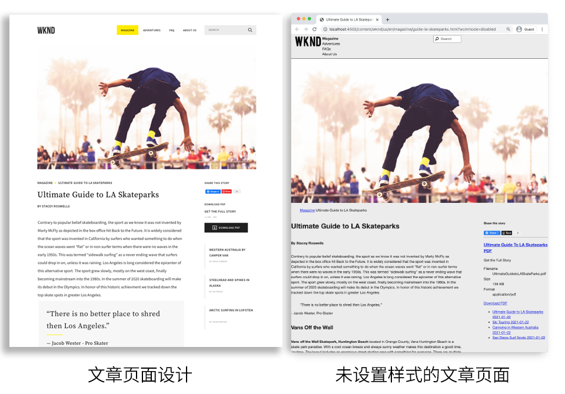
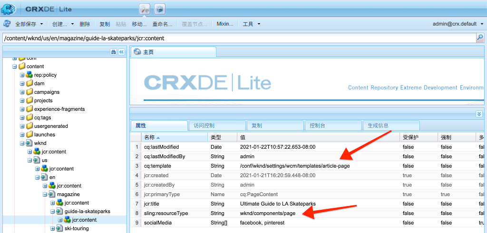
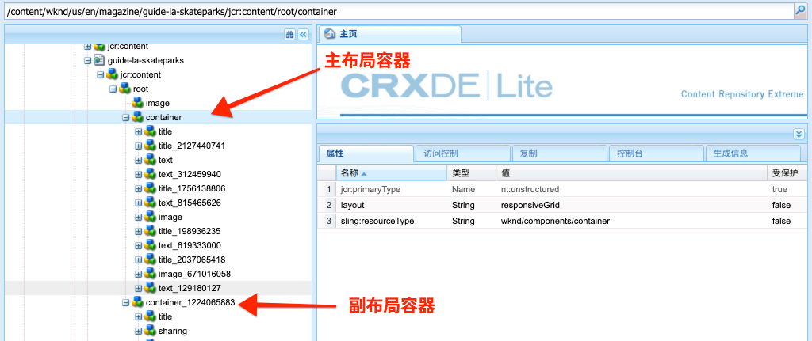
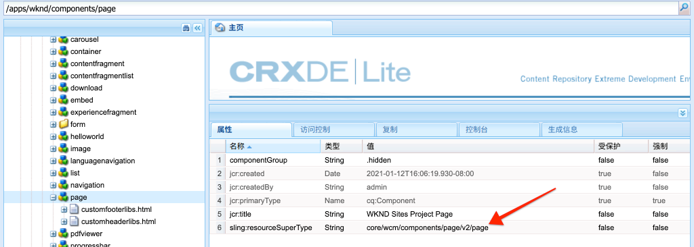
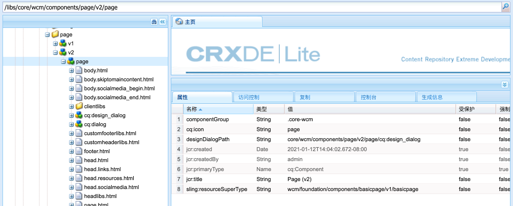

# 页面和模板 {#pages-and-template}

在本章中，我们将探讨基本页面组件与可编辑模板之间的关系。 我们将根据 [AdobeXD](https://www.adobe.com/products/xd.html). 在构建模板过程中，将介绍可编辑模板的核心组件和高级策略配置。

## 前提条件 {#prerequisites}

查看设置 [本地开发环境](overview.md#local-dev-environment).

### 入门项目

>[!NOTE]
>
> 如果您成功完成了上一章，则可以重复使用该项目并跳过签出起始项目的步骤。

查看本教程构建的基行代码：

1. 查看 `tutorial/pages-templates-start` 分支 [GitHub](https://github.com/adobe/aem-guides-wknd)

   ```shell
   $ cd ~/code/aem-guides-wknd
   $ git checkout tutorial/pages-templates-start
   ```

1. 使用您的Maven技能将代码库部署到本地AEM实例：

   ```shell
   $ mvn clean install -PautoInstallSinglePackage
   ```

   >[!NOTE]
   >
   > 如果使用AEM 6.5或6.4，请在 `classic` 配置文件。

   ```shell
   $ mvn clean install -PautoInstallSinglePackage -Pclassic
   ```

您始终可以在 [GitHub](https://github.com/adobe/aem-guides-wknd/tree/tutorial/pages-templates-solution) 或通过切换到分支在本地检出代码 `tutorial/pages-templates-solution`.

## 目标

1. Inspect在Adobe XD中创建的页面设计，并将其映射到核心组件。
1. 了解可编辑模板的详细信息以及如何使用策略来强制对页面内容进行精细控制。
1. 了解模板和页面的关联方式

## 将构建的内容 {#what-you-will-build}

在本教程的本部分中，您将构建一个新的文章页面模板，该模板可用于创建新文章页面，并与通用结构保持一致。 文章页面模板基于AdobeXD中生成的设计和UI Kit。 本章仅侧重于构建模板的结构或框架。 未实施样式，但模板和页面可正常工作。



## 使用Adobe XD规划UI {#adobexd}

在大多数情况下，首先会规划新网站的模型和静态设计。 [Adobe XD](https://www.adobe.com/products/xd.html) 是构建用户体验的设计工具。 接下来，我们将检查UI工具包和模型，以帮助规划文章页面模板的结构。

>[!VIDEO](https://video.tv.adobe.com/v/30214/?quality=12&learn=on)

**下载 [WKND文章设计文件](https://github.com/adobe/aem-guides-wknd/releases/download/aem-guides-wknd-0.0.2/AEM_UI-kit-WKND-article-design.xd)**.

>[!NOTE]
>
> 通用 [AEM核心组件UI Kit也可用](https://experienceleague.adobe.com/docs/experience-manager-learn/assets/AEM-CoreComponents-UI-Kit.xd) 作为自定义项目的起点。

## 创建文章页面模板

创建页面时，必须选择模板，以用作创建新页面的基础。 模板可定义生成页面的结构、初始内容和允许的组件。

有3个主要区域 [可编辑的模板](https://experienceleague.adobe.com/docs/experience-manager-65/developing/platform/templates/page-templates-editable.html):

1. **结构**  — 定义属于模板一部分的组件。 内容作者无法编辑这些内容。
1. **初始内容**  — 定义模板开头的组件，内容作者可以编辑和/或删除这些组件
1. **策略**  — 定义有关组件行为方式以及作者将拥有哪些选项的配置。

接下来，在AEM中创建与模型结构匹配的新模板。 这将在AEM的本地实例中发生。 按照以下视频中的步骤操作：

>[!VIDEO](https://video.tv.adobe.com/v/330991/?quality=12&learn=on)

以上视频的高级步骤：

### 结构配置

1. 使用 **页面模板类型**，已命名 **文章页面**.
1. 切换到 **结构** 模式。
1. 添加 **体验片段** 组件 **标题** 的双曲余切值。
   * 配置组件以指向 `/content/experience-fragments/wknd/us/en/site/header/master`.
   * 将策略设置为 **页眉** 确保 **默认元素** 设置为 `header`. 的 `header`元素会在下一章中与CSS一起定位。
1. 添加 **体验片段** 组件 **页脚** 模板底部。
   * 配置组件以指向 `/content/experience-fragments/wknd/us/en/site/footer/master`.
   * 将策略设置为 **页脚** 确保 **默认元素** 设置为 `footer`. 的 `footer` 元素会在下一章中与CSS一起定位。
1. 锁定 **main** 最初创建模板时包含的容器。
   * 将策略设置为 **主页** 确保 **默认元素** 设置为 `main`. 的 `main` 元素会在下一章中与CSS一起定位。
1. 添加 **图像** 组件 **main** 容器。
   * 解锁 **图像** 组件。
1. 添加 **痕迹导航** 组件下方 **图像** 组件。
   * 为 **痕迹导航** 组件已命名 **文章页面 — 痕迹导航**. 设置 **导航开始级别** to **4**.
1. 添加 **容器** 组件下方 **痕迹导航** 组件和内部 **main** 容器。 这将作为 **内容容器** 的上界。
   * 解锁 **内容** 容器。
   * 将策略设置为 **页面内容**.
1. 添加其他 **容器** 组件下方 **内容容器**. 这将作为 **侧边栏** 容器。
   * 解锁 **侧边栏** 容器。
   * 创建名为的新策略 **文章页面 — 侧边栏**.
   * 配置 **允许的组件** 在 **WKND Sites项目 — 内容** 要包括： **按钮**, **下载**, **图像**, **列表**, **分隔符**, **社交媒体共享**, **文本**&#x200B;和 **标题**.
1. 更新页面根容器的策略。 这是模板上最外部的容器。 将策略设置为 **页面根**.
   * 在 **容器设置**，请设置 **布局** to **响应式网格**.
1. 参与 **内容容器**. 从右向左拖动手柄，将容器缩小为8列宽。
1. 参与 **边栏容器**. 从右向左拖动手柄，将容器缩小为4列宽。 然后，将左手柄从左到右1列拖动，使容器3列变宽，并在 **内容容器**.
1. 打开移动模拟器并切换到移动断点。 再次参与布局模式，并 **内容容器** 和 **边栏容器** 页面的全宽。 这会在移动断点中垂直堆叠容器。
1. 更新 **文本** 组件 **内容容器**.
   * 将策略设置为 **内容文本**.
   * 在 **插件** > **段落样式**，勾选 **启用段落样式** 确保 **报价块** 启用。

### 初始内容配置

1. 切换到 **初始内容** 模式。
1. 添加 **标题** 组件 **内容容器**. 它用作文章标题。 当留空时，将自动显示当前页面的标题。
1. 添加秒 **标题** 组件。
   * 使用文本配置组件：“作者”。 这是文本占位符。
   * 将类型设置为 `H4`.
1. 添加 **文本** 组件下方 **按作者** 标题组件。
1. 添加 **标题** 组件 **侧边栏容器**.
   * 使用文本配置组件：“分享此故事”。
   * 将类型设置为 `H5`.
1. 添加 **社交媒体共享** 组件下方 **共享此文章** 标题组件。
1. 添加 **分隔符** 组件下方 **社交媒体共享** 组件。
1. 添加 **下载** 组件下方 **分隔符** 组件。
1. 添加 **列表** 组件下方 **下载** 组件。
1. 更新 **初始页面属性** 的上界。
   * 在 **社交媒体** > **社交媒体共享**，勾选 **Facebook** 和 **Pinterest**

### 启用模板并添加缩略图

1. 通过导航到 [http://localhost:4502/libs/wcm/core/content/sites/templates.html/conf/wknd](http://localhost:4502/libs/wcm/core/content/sites/templates.html/conf/wknd)
1. **启用** 文章页面模板。
1. 编辑文章页面模板的属性并上传以下缩略图，以快速识别使用文章页面模板创建的页面：

   

## 使用体验片段更新页眉和页脚 {#experience-fragments}

创建全局内容（如页眉或页脚）时，通常使用 [体验片段](https://experienceleague.adobe.com/docs/experience-manager-learn/sites/experience-fragments/experience-fragments-feature-video-use.html). 体验片段，允许用户合并多个组件以创建一个可引用的组件。 体验片段具有支持多站点管理和 [本地化](https://experienceleague.adobe.com/docs/experience-manager-core-components/using/components/experience-fragment.html?lang=en#localized-site-structure).

AEM项目原型生成了页眉和页脚。 接下来，更新体验片段以匹配模型。 按照以下视频中的步骤操作：

>[!VIDEO](https://video.tv.adobe.com/v/330992/?quality=12&learn=on)

以上视频的高级步骤：

1. 下载示例内容包 **[WKND-PagesTemplates-Content-Assets.zip](assets/pages-templates/WKND-PagesTemplates-Content-Assets-1.1.zip)**.
1. 使用包管理器(位于 [http://localhost:4502/crx/packmgr/index.jsp](http://localhost:4502/crx/packmgr/index.jsp)
1. 更新Web变体模板，该模板用于 [http://localhost:4502/editor.html/conf/wknd/settings/wcm/templates/xf-web-variation/structure.html](http://localhost:4502/editor.html/conf/wknd/settings/wcm/templates/xf-web-variation/structure.html)
   * 更新策略 **容器** 组件。
   * 将策略设置为 **XF根**.
   * 在 **允许的组件** 选择组件组 **WKND Sites项目 — 结构** 包含 **语言导航**, **导航**&#x200B;和 **快速搜索** 组件。

### 更新标题体验片段

1. 打开在中呈现标题的体验片段 [http://localhost:4502/editor.html/content/experience-fragments/wknd/us/en/site/header/master.html](http://localhost:4502/editor.html/content/experience-fragments/wknd/us/en/site/header/master.html)
1. 配置根 **容器** 片段的子集。 这是最外面的 **容器**.
   * 设置 **布局** to **响应式网格**
1. 添加 **WKND Dark徽标** 作为 **容器**. 徽标包含在上一步骤中安装的包中。
   * 修改 **WKND Dark徽标** 为 **2** 列宽。 从右向左拖动手柄。
   * 使用配置徽标 **替换文本** “WKND Logo”。
   * 将徽标配置为 **链接** to `/content/wknd/us/en` 主页。
1. 配置 **导航** 已放置在页面上的组件。
   * 设置 **排除根级别** to **1**.
   * 设置 **导航结构深度** to **1**.
   * 修改 **导航** 组件 **8** 列宽。 从右向左拖动手柄。
1. 删除 **语言导航** 组件。
1. 修改 **搜索** 组件 **2** 列宽。 从右向左拖动手柄。 现在，所有组件应在一行上水平对齐。

### 更新页脚体验片段

1. 打开在 [http://localhost:4502/editor.html/content/experience-fragments/wknd/us/en/site/footer/master.html](http://localhost:4502/editor.html/content/experience-fragments/wknd/us/en/site/footer/master.html)
1. 配置根 **容器** 片段的子集。 这是最外面的 **容器**.
   * 设置 **布局** to **响应式网格**
1. 添加 **WKND Light徽标** 作为 **容器**. 徽标包含在上一步骤中安装的包中。
   * 修改 **WKND Light徽标** 为 **2** 列宽。 从右向左拖动手柄。
   * 使用配置徽标 **替换文本** “WKND Logo Light”中的“WKND Logo Light”。
   * 将徽标配置为 **链接** to `/content/wknd/us/en` 主页。
1. 添加 **导航** 组件。 配置 **导航** 组件：
   * 设置 **排除根级别** to **1**.
   * 取消选中 **收集所有子页面**.
   * 设置 **导航结构深度** to **1**.
   * 修改 **导航** 组件 **8** 列宽。 从右向左拖动手柄。

## 创建文章页面

接下来，使用文章页面模板创建新页面。 创作页面内容以匹配网站模型。 按照以下视频中的步骤操作：

>[!VIDEO](https://video.tv.adobe.com/v/330993/?quality=12&learn=on)

以上视频的高级步骤：

1. 导航到站点控制台(位于 [http://localhost:4502/sites.html/content/wknd/us/en/magazine](http://localhost:4502/sites.html/content/wknd/us/en/magazine).
1. 在下面创建新页面 **WKND** > **美国** > **EN** > **杂志**.
   * 选择 **文章页面** 模板。
   * 在 **属性** 设置 **标题** 《洛杉矶滑板场终极指南》
   * 设置 **名称** 到&quot;指南 — 拉滑板场&quot;
1. 替换 **按作者** 标题，文本为“Stacey Roswells”。
1. 更新 **文本** 用于包含用于填充文章的段落的组件。 您可以使用以下文本文件作为副本： [la-skate-parks-copy.txt](assets/pages-templates/la-skateparks-copy.txt).
1. 添加其他 **文本** 组件。
   * 更新组件以包含报价：“没有比洛杉矶更好的地方可以粉碎。”
   * 以全屏模式编辑富文本编辑器，并修改上述引号以使用 **报价块** 元素。
1. 继续填充文章正文以匹配模型。
1. 配置 **下载** 组件来使用文章的PDF版本。
   * 在 **下载** > **属性**，请单击复选框以 **从DAM资产获取标题**.
   * 设置 **描述** 至：“获取完整的故事”。
   * 设置 **操作文本** 至：“下载PDF”。
1. 配置 **列表** 组件。
   * 在 **列表设置** > **生成列表使用**，选择 **子页面**.
   * 设置 **父页面** to `/content/wknd/us/en/magazine`.
   * 在 **项目设置** check **链接项目** 检查 **显示日期**.

## Inspect节点结构 {#node-structure}

此时，文章页面显然未设置样式。 但是，基本结构已经到位。 接下来，检查文章页面的节点结构，以更好地了解模板、页面和组件的角色。

在本地AEM实例上使用CRXDE-Lite工具来查看基础节点结构。

1. 打开 [CRXDE-Lite](http://localhost:4502/crx/de/index.jsp#/content/wknd/us/en/magazine/guide-la-skateparks/jcr%3Acontent) 并使用树导航导航导航到 `/content/wknd/us/en/magazine/guide-la-skateparks`.

1. 单击 `jcr:content` 节点下 `la-skateparks` 页面并查看属性：

   

   请注意 `cq:template`，指向 `/conf/wknd/settings/wcm/templates/article-page`，我们之前创建的文章页面模板。

   另请注意 `sling:resourceType`，指向 `wknd/components/page`. 这是由AEM项目原型创建的页面组件，负责根据模板渲染页面。

1. 展开 `jcr:content` 节点下方 `/content/wknd/us/en/magazine/guide-la-skateparks/jcr:content` 和查看节点层次结构：

   

   您应该能够将每个节点松散地映射到创作的组件。 查看您是否可以通过检查前缀为的节点来标识不同的布局容器 `container`.

1. 接下来，在 `/apps/wknd/components/page`. 在CRXDE Lite中查看组件属性：

   

   请注意，只有2个HTL脚本， `customfooterlibs.html` 和 `customheaderlibs.html` 页面组件下方。 *那么，此组件如何渲染页面？*

   的 `sling:resourceSuperType` 属性点到 `core/wcm/components/page/v2/page`. 此属性允许WKND的页面组件继承 **全部** 核心组件页面组件功能的详细信息。 这是第一个名为 [代理组件模式](https://experienceleague.adobe.com/docs/experience-manager-core-components/using/developing/guidelines.html#ProxyComponentPattern). 可以找到更多信息 [此处](https://experienceleague.adobe.com/docs/experience-manager-core-components/using/developing/guidelines.html).

1. Inspect WKND组件中的另一个组件， `Breadcrumb` 组件位于： `/apps/wknd/components/breadcrumb`. 请注意， `sling:resourceSuperType` 属性，但此时它指向 `core/wcm/components/breadcrumb/v2/breadcrumb`. 这是使用代理组件模式包含核心组件的另一个示例。 事实上，WKND代码库中的所有组件都是AEM核心组件的代理（我们著名的HelloWorld组件除外）。 最佳做法是尽可能多地尝试和重复使用核心组件的功能 *之前* 编写自定义代码。

1. 接下来，在 `/libs/core/wcm/components/page/v2/page` 使用CRXDE Lite:

   >[!NOTE]
   >
   > 在AEM 6.5/6.4中，核心组件位于 `/apps/core/wcm/components`. 在AEMas a Cloud Service中，核心组件位于 `/libs` 和会自动更新。

   

   请注意，此页面下方包含更多脚本。 核心组件页面包含许多功能。 此功能已划分为多个脚本，以便于维护和可读。 您可以通过打开 `page.html` 寻找 `data-sly-include`:

   ```html
   <!--/* /libs/core/wcm/components/page/v2/page/page.html */-->
   <!DOCTYPE HTML>
   <html data-sly-use.page="com.adobe.cq.wcm.core.components.models.Page" lang="${page.language}"
       data-sly-use.head="head.html"
       data-sly-use.footer="footer.html"
       data-sly-use.redirect="redirect.html">
       <head data-sly-call="${head.head @ page = page}"></head>
       <body class="${page.cssClassNames}"
           id="${page.id}"
           data-cmp-data-layer-enabled="${page.data ? true : false}">
           <script data-sly-test.dataLayerEnabled="${page.data}">
           window.adobeDataLayer = window.adobeDataLayer || [];
           adobeDataLayer.push({
               page: JSON.parse("${page.data.json @ context='scriptString'}"),
               event:'cmp:show',
               eventInfo: {
                   path: 'page.${page.id @ context="scriptString"}'
               }
           });
           </script>
           <sly data-sly-test.isRedirectPage="${page.redirectTarget && (wcmmode.edit || wcmmode.preview)}"
               data-sly-call="${redirect.redirect @ redirectTarget = page.redirectTarget}"></sly>
           <sly data-sly-test="${!isRedirectPage}">
               <sly data-sly-include="body.skiptomaincontent.html"></sly>
               <sly data-sly-include="body.socialmedia_begin.html"></sly>
               <sly data-sly-include="body.html"></sly>
               <sly data-sly-call="${footer.footer @ page = page}"></sly>
               <sly data-sly-include="body.socialmedia_end.html"></sly>
           </sly>
       </body>
   </html>
   ```

   将HTL划分为多个脚本的另一个原因是，允许代理组件覆盖单个脚本以实施自定义业务逻辑。 HTL脚本， `customfooterlibs.html` 和 `customheaderlibs.html`，其明确目的是通过实施项目来覆盖。

   您可以进一步了解可编辑模板如何影响渲染 [内容页面，阅读本文](https://experienceleague.adobe.com/docs/experience-manager-65/developing/platform/templates/page-templates-editable.html).

1. Inspect是另一个核心组件，如 `/libs/core/wcm/components/breadcrumb/v2/breadcrumb`. 查看 `breadcrumb.html` 脚本，以了解痕迹导航组件的标记最终如何生成。

## 将配置保存到源控件 {#configuration-persistence}

在很多情况下，特别是在AEM项目开始时，将配置（如模板和相关内容策略）保留到源控制中非常有价值。 这可确保所有开发人员针对同一组内容和配置开展工作，并可确保各环境之间具有额外的一致性。 一旦项目达到一定的成熟度，管理模板的做法就可以交给一组特定的高级用户。

目前，我们将像处理其他代码一样处理模板，并同步 **文章页面模板** 作为项目的一部分。 到现在为止 **推送** 代码从我们的AEM项目到AEM的本地实例。 的 **文章页面模板** 直接在AEM的本地实例上创建，因此我们需要 **导入** 模板。 的 **ui.content** 模块包含在AEM项目中，以用于此特定用途。

接下来的几个步骤将使用VSCode IDE在 [VSCode AEM同步](https://marketplace.visualstudio.com/items?itemName=yamato-ltd.vscode-aem-sync&amp;ssr=false#overview) 插件，但可以使用您配置为 **导入** 或从AEM的本地实例导入内容。

1. 在VSCode中，打开 `aem-guides-wknd` 项目。

1. 展开 **ui.content** 模块。 展开 `src` 文件夹，导航到 `/conf/wknd/settings/wcm/templates`.

1. [!UICONTROL 右键单击] the `templates` 文件夹，选择 **从AEM Server导入**:

   

   的 `article-page` 应导入， `page-content`, `xf-web-variation` 模板也应更新。

   

1. 重复导入内容的步骤，但选择 **策略** 位于 `/conf/wknd/settings/wcm/policies`.

   

1. Inspect `filter.xml` 位于 `ui.content/src/main/content/META-INF/vault/filter.xml`.

   ```xml
   <!--ui.content filter.xml-->
   <?xml version="1.0" encoding="UTF-8"?>
   <workspaceFilter version="1.0">
       <filter root="/conf/wknd" mode="merge"/>
       <filter root="/content/wknd" mode="merge"/>
       <filter root="/content/dam/wknd" mode="merge"/>
       <filter root="/content/experience-fragments/wknd" mode="merge"/>
   </workspaceFilter>
   ```

   的 `filter.xml` 文件负责标识随包一起安装的节点的路径。 请注意 `mode="merge"` 在指示不会修改现有内容的每个过滤器上，只会添加新内容。 由于内容作者可能正在更新这些路径，因此代码部署必须执行以下操作 **not** 覆盖内容。 请参阅 [FileVault文档](https://jackrabbit.apache.org/filevault/filter.html) 有关使用过滤器元素的更多详细信息。

   比较 `ui.content/src/main/content/META-INF/vault/filter.xml` 和 `ui.apps/src/main/content/META-INF/vault/filter.xml` 以了解每个模块管理的不同节点。

   >[!WARNING]
   >
   > 为确保WKND参考站点的一致部署，已设置项目的一些分支，以便 `ui.content` 覆盖JCR中的任何更改。 这是特意设计的，即解决方案分支，因为代码/样式是为特定策略编写的。

## 恭喜！ {#congratulations}

恭喜，您刚刚使用Adobe Experience Manager Sites创建了新模板和页面。

### 后续步骤 {#next-steps}

此时，文章页面显然未设置样式。 关注 [客户端库和前端工作流](client-side-libraries.md) 此教程将学习包括CSS和Javascript以将全局样式应用到站点并集成专用的前端内部版本的最佳实践。

在上查看完成的代码 [GitHub](https://github.com/adobe/aem-guides-wknd) 或在Git浏览器的本地查看和部署代码 `tutorial/pages-templates-solution`.

1. 克隆 [github.com/adobe/aem-wknd-guides](https://github.com/adobe/aem-guides-wknd) 存储库。
1. 查看 `tutorial/pages-templates-solution` 分支。
