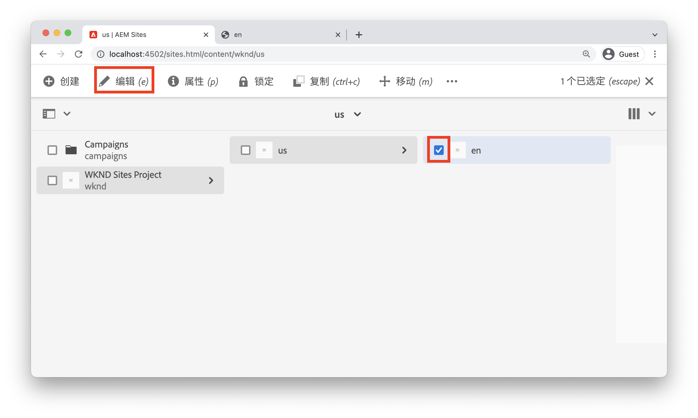
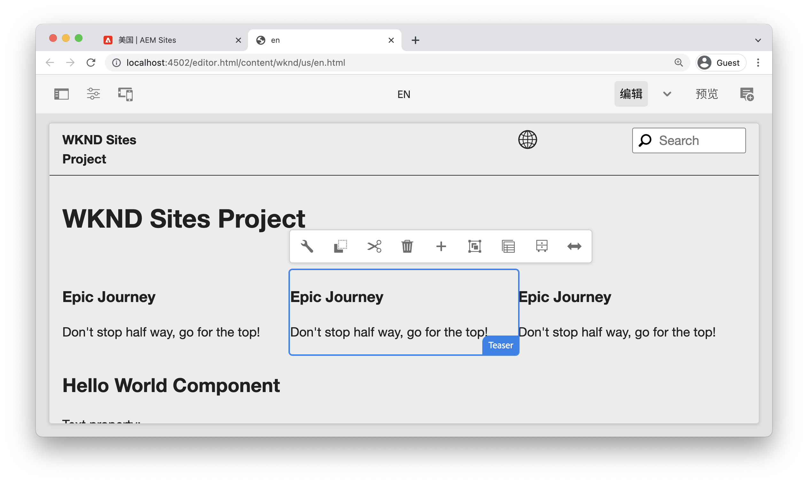
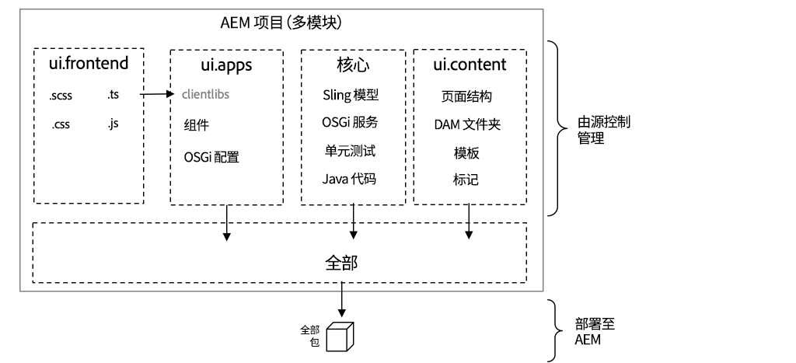
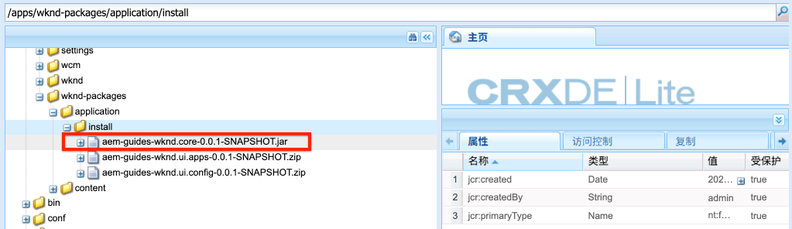
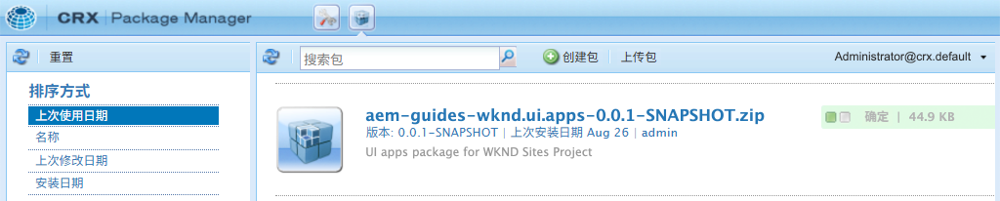

# 项目设置 {#project-setup}

本教程介绍如何创建 Maven 多模块项目来管理 Adobe Experience Manager 网站的代码和配置。

## 先决条件 {#prerequisites}

查看设置[本地开发环境](./overview.md#local-dev-environment)所需的工具和说明。确保您有一个本地的 Adobe Experience Manager 新实例，并且没有安装其他样本/演示包（所需的服务包除外）。

## 目标 {#objective}

1. 了解如何使用 Maven 原型生成新的 AEM 项目。
1. 了解 AEM 项目原型生成的不同模块以及它们如何协同工作。
1. 了解如何将 AEM 核心组件包含在 AEM 项目中。

## 您要构建什么 {#what-build}

>[!VIDEO](https://video.tv.adobe.com/v/36054?quality=12&learn=on&captions=chi_hans)

在本章中，您将使用 [AEM 项目原型](https://github.com/adobe/aem-project-archetype)生成一个新的 Adobe Experience Manager 项目。您的 AEM 项目包含用于网站实施的完整代码、内容和配置。本章中生成的这个项目将作为 WKND 网站实施的基础，在未来章节中将继续构建。

**什么是 Maven 项目？** - [Apache Maven](https://maven.apache.org/) 是用于构建项目的软件管理工具。*所有 Adobe Experience Manager* 实施都使用 Maven 项目在 AEM 上面构建、管理和部署自定义代码。

**什么是 Maven 原型？** - [Maven 原型](https://maven.apache.org/archetype/index.html)是用于生成新项目的模板或模式。AEM 项目原型帮助生成具有自定义命名空间的新项目，并包含遵循最佳实践的项目结构，从而大大加快项目开发速度。

## 创建项目 {#create}

为 AEM 创建 Maven 多模块项目有几个选项。本教程使用 [Maven AEM 项目原型 **35**](https://github.com/adobe/aem-project-archetype)。Cloud Manager 还[提供一个 UI 向导](https://experienceleague.adobe.com/docs/experience-manager-cloud-manager/content/getting-started/project-creation/using-the-wizard.html?lang=zh-Hans)，用于启动 AEM 应用程序项目的创建。通过 Cloud Manager UI 生成的基础项目与直接使用原型两种方法形成的结构是相同的。

>[!NOTE]
>
>本教程使用 **35** 版本的原型。使用&#x200B;**最新**&#x200B;版本的原型来生成新项目始终是最佳做法。

接下来的一系列步骤将使用基于 UNIX® 的命令行终端，如果使用 Windows 终端，这些步骤应该类似。

1. 打开命令行终端。验证 Maven 已安装：

   ```shell
   $ mvn --version
   Apache Maven 3.6.2
   Maven home: /Library/apache-maven-3.6.2
   Java version: 11.0.4, vendor: Oracle Corporation, runtime: /Library/Java/JavaVirtualMachines/jdk-11.0.4.jdk/Contents/Home
   ```

1. 导航到您想要生成 AEM 项目的目录。这可以是您想在其中保持项目源代码的任何目录。例如，用户主目录下名为 `code` 的目录：

   ```shell
   $ cd ~/code
   ```

1. 将以下内容粘贴到命令行中，[以批处理方式生成项目](https://maven.apache.org/archetype/maven-archetype-plugin/examples/generate-batch.html)：

   ```shell
   mvn -B org.apache.maven.plugins:maven-archetype-plugin:3.2.1:generate \
       -D archetypeGroupId=com.adobe.aem \
       -D archetypeArtifactId=aem-project-archetype \
       -D archetypeVersion=39 \
       -D appTitle="WKND Sites Project" \
       -D appId="wknd" \
       -D groupId="com.adobe.aem.guides" \
       -D artifactId="aem-guides-wknd" \
       -D package="com.adobe.aem.guides.wknd" \
       -D version="0.0.1-SNAPSHOT" \
       -D aemVersion="cloud"
   ```

   >[!NOTE]
   >
   > 如果目标是 AEM 6.5.14+，应将 `aemVersion="cloud"` 替换为 `aemVersion="6.5.14"`。
   >
   > 此外，应始终使用最新的 `archetypeVersion`，请参阅 [AEM 项目原型 > 使用](https://github.com/adobe/aem-project-archetype#usage)

   用于配置项目的可用属性的完整列表[请参阅此处](https://github.com/adobe/aem-project-archetype#available-properties)。

1. Maven 原型会在您的本地文件系统上生成以下文件夹和文件结构：

   ```plain
    ~/code/
       |--- aem-guides-wknd/
           |--- all/
           |--- core/
           |--- ui.apps/
           |--- ui.apps.structure/
           |--- ui.config/
           |--- ui.content/
           |--- ui.frontend/
           |--- ui.tests /
           |--- it.tests/
           |--- dispatcher/
           |--- pom.xml
           |--- README.md
           |--- .gitignore
   ```

## 部署并构建项目 {#build}

构建项目代码并将其部署到 AEM 的本地实例。

1. 确保您在端口 **4502** 上本地运行 AEM 的作者实例。
1. 从命令行导航到 `aem-guides-wknd` 项目目录。

   ```shell
   $ cd aem-guides-wknd
   ```

1. 运行以下命令，构建整个项目并将其部署到 AEM：

   ```shell
   $ mvn clean install -PautoInstallSinglePackage
   ```

   构建过程大约需要一分钟，结束时应显示以下消息：

   ```
   ...
   [INFO] ------------------------------------------------------------------------
   [INFO] Reactor Summary for WKND Sites Project 0.0.1-SNAPSHOT:
   [INFO] 
   [INFO] WKND Sites Project ................................. SUCCESS [  0.113 s]
   [INFO] WKND Sites Project - Core .......................... SUCCESS [  3.136 s]
   [INFO] WKND Sites Project - UI Frontend ................... SUCCESS [  4.461 s]
   [INFO] WKND Sites Project - Repository Structure Package .. SUCCESS [  0.359 s]
   [INFO] WKND Sites Project - UI apps ....................... SUCCESS [  1.732 s]
   [INFO] WKND Sites Project - UI content .................... SUCCESS [  0.956 s]
   [INFO] WKND Sites Project - UI config ..................... SUCCESS [  0.064 s]
   [INFO] WKND Sites Project - All ........................... SUCCESS [  8.229 s]
   [INFO] WKND Sites Project - Integration Tests ............. SUCCESS [  3.329 s]
   [INFO] WKND Sites Project - Dispatcher .................... SUCCESS [  0.027 s]
   [INFO] WKND Sites Project - UI Tests ...................... SUCCESS [  0.032 s]
   [INFO] ------------------------------------------------------------------------
   [INFO] BUILD SUCCESS
   [INFO] ------------------------------------------------------------------------
   [INFO] Total time:  23.189 s
   [INFO] Finished at: 2023-01-10T11:12:23-05:00
   [INFO] ------------------------------------------------------------------------    
   ```

   Maven 配置文件 `autoInstallSinglePackage` 会编译项目的各个模块，然后将一个包部署到 AEM 实例。默认情况下，此包被部署到在本地端口 **4502** 上运行的 AEM 实例，凭据为 `admin:admin`。

1. 导航到您本地 AEM 实例上的包管理器：[http://localhost:4502/crx/packmgr/index.jsp](http://localhost:4502/crx/packmgr/index.jsp)。您应该看到 `aem-guides-wknd.ui.apps`、`aem-guides-wknd.ui.config`、`aem-guides-wknd.ui.content` 和 `aem-guides-wknd.all` 的包。

1. 导航到 Sites 控制台：[http://localhost:4502/sites.html/content](http://localhost:4502/sites.html/content)。WKND 网站是其中一个网站。它包含一个有美国站点和源语言站点的网站层级结构。使用原型生成项目时，这个网站层级结构基于 `language_country` 和 `isSingleCountryWebsite` 的值。

1. 打开 **US** `>` **English** 页面，选择此页面并点击菜单栏中的&#x200B;**编辑**&#x200B;按钮：

   

1. 我们现在已创建了入门内容，有多个组件可供添加到页面上。试用这些组件，了解各种功能。您将在下一章中学习一个组件的基本知识。

   

   *通过原型生成的内容示例*

## 查看项目 {#project-structure}

所生成的 AEM 项目由单个 Maven 模块组成，每个模块都有不同的角色。本教程和大多数开发重点关注以下模块：

* [core](https://experienceleague.adobe.com/docs/experience-manager-core-components/using/developing/archetype/core.html?lang=zh-Hans) - Java 代码，主要是后端开发人员。
* [ui.frontend](https://experienceleague.adobe.com/docs/experience-manager-core-components/using/developing/archetype/uifrontend.html?lang=zh-Hans) - 包含 CSS、JavaScript、Sass、TypeScript 的源代码，主要面向前端开发人员。
* [ui.apps](https://experienceleague.adobe.com/docs/experience-manager-core-components/using/developing/archetype/uiapps.html?lang=zh-Hans) - 包含组件和对话框定义，嵌入已编译的 CSS 和 JavaScript 作为客户端库。
* [ui.content](https://experienceleague.adobe.com/docs/experience-manager-core-components/using/developing/archetype/uicontent.html?lang=zh-Hans) - 包含结构内容和配置，如可编辑模板、元数据架构（/content、/conf）。

* **all** - 这是一个空的 Maven 模块，它将上述模块组合成一个包，此包可以被部署到 AEM 环境。



查看 [AEM 项目原型文档](https://experienceleague.adobe.com/docs/experience-manager-core-components/using/developing/archetype/overview.html?lang=zh-Hans)，了解&#x200B;**所有** Maven 模块的更多详情。

### 包含核心组件 {#core-components}

[AEM 核心组件](https://experienceleague.adobe.com/docs/experience-manager-core-components/using/introduction.html?lang=zh-Hans)是一组 AEM 的标准化网站内容管理 (WCM) 组件。这些组件提供了一组基本功能，可为单个项目设置这些组件的样式、进行自定义和扩展。

AEM as a Cloud Service 环境包括最新版本的 [AEM 核心组件](https://experienceleague.adobe.com/docs/experience-manager-core-components/using/introduction.html?lang=zh-Hans)。因此，为 AEM as a Cloud Service 生成的项目&#x200B;**不**&#x200B;包含 AEM 核心组件的嵌入。

对于 AEM 6.5/6.4 生成的项目，原型会将 [AEM 核心组件](https://experienceleague.adobe.com/docs/experience-manager-core-components/using/introduction.html?lang=zh-Hans)自动嵌入项目。对于 AEM 6.5/6.4，最佳做法是嵌入 AEM 核心组件，以确保最新版本会随您的项目一起被部署。有关如何将核心组件[包含在项目中的更多信息请参阅这里](https://experienceleague.adobe.com/docs/experience-manager-core-components/using/developing/archetype/using.html?lang=zh-Hans#core-components)。

## 源控制管理 {#source-control}

使用某种形式的源控制来管理应用程序中的代码，这始终是一种好做法。本教程使用 git 和 GitHub。有几个文件是 Maven 和/或您选择的 IDE 生成的，应该被 SCM 忽略。

每当您构建和安装代码包时，Maven 都会创建一个目标文件夹。这个目标文件夹和内容应从 SCM 中排除。

在 `ui.apps` 模块下能看到创建了许多 `.content.xml` 文件。这些 XML 文件映射了 JCR 中安装的内容的节点类型和属性。这些文件非常重要，**不能**&#x200B;被忽略。

AEM 项目原型会生成一个 `.gitignore` 示例文件，它可以作为一个可以安全忽略文件的起点。该文件在这里生成：`<src>/aem-guides-wknd/.gitignore`。

## 恭喜！ {#congratulations}

祝贺您创建了您的第一个 AEM 项目！

### 后续步骤 {#next-steps}

在[组件基础知识](component-basics.md)教程中，通过简单的 `HelloWorld` 示例了解 Adobe Experience Manager (AEM) Sites 组件的底层技术。

## 高级 Maven 命令（额外材料） {#advanced-maven-commands}

在开发过程中，您可能只使用一个模块，并且为了节省时间，您可能希望避免构建整个项目。您可能还希望能直接部署到 AEM 发布实例，或者部署到不是在端口 4502 上运行的 AEM 实例。

接下来，我们来看一些额外的 Maven 配置文件和命令，您可以在开发过程中使用它们来获得更大的灵活性。

### 核心模块 {#core-module}

**[核心](https://experienceleague.adobe.com/docs/experience-manager-core-components/using/developing/archetype/core.html?lang=zh-Hans)**&#x200B;模块包含与项目相关的所有 Java™ 代码。**核心**&#x200B;模块的构建将 OSGi 捆绑包部署到 AEM。要构建这个模块：

1. 导航到 `core` 文件夹（`aem-guides-wknd` 下面）：

   ```shell
   $ cd core/
   ```

1. 运行以下命令：

   ```shell
   $ mvn clean install -PautoInstallBundle
   ...
   [INFO] --- sling-maven-plugin:2.4.0:install (install-bundle) @ aem-guides-wknd.core ---
   [INFO] Installing Bundle aem-guides-wknd.core(~/code/aem-guides-wknd/core/target/aem-guides-wknd.core-0.0.1-SNAPSHOT.jar) to http://localhost:4502/system/console via WebConsole
   [INFO] Bundle installed
   [INFO] ------------------------------------------------------------------------
   [INFO] BUILD SUCCESS
   [INFO] ------------------------------------------------------------------------
   [INFO] Total time:  8.558 s
   ```

1. 导航到 [http://localhost:4502/system/console/bundles](http://localhost:4502/system/console/bundles)。这是 OSGi 网页控制台，包含关于 AEM 实例上安装的所有捆绑包的信息。

1. 切换 **Id** 排序列，您会看到 WKND 捆绑包已安装并处于活跃状态。

   

1. 您可以在 [CRXDE-Lite](http://localhost:4502/crx/de/index.jsp#/apps/wknd-packages/application/install/aem-guides-wknd.core-1.0.0-SNAPSHOT.jar) 中看到 jar 的“物理”位置：

   

### Ui.apps 和 Ui.content 模块 {#apps-content-module}

**[ui.apps](https://experienceleague.adobe.com/docs/experience-manager-core-components/using/developing/archetype/uiapps.html?lang=zh-Hans)** maven 模块包含 `/apps` 下方的网站所需的所有渲染代码。这包括以 [clientlibs](https://experienceleague.adobe.com/docs/experience-manager-65/developing/introduction/clientlibs.html?lang=zh-Hans) 的 AEM 格式存储的 CSS/JS。这还包括用于渲染动态 HTML 的 [HTL](https://experienceleague.adobe.com/docs/experience-manager-htl/content/overview.html?lang=zh-Hans) 脚本。您可以将 **ui.apps** 模块视为一种 JCR 中结构的映射，但采用的格式可以存储在文件系统上并提交给源控制。**ui.apps** 模块仅包含代码。

要构建这个模块：

1. 从命令行开始。导航到 `ui.apps` 文件夹（`aem-guides-wknd` 下面）：

   ```shell
   $ cd ../ui.apps
   ```

1. 运行以下命令：

   ```shell
   $ mvn clean install -PautoInstallPackage
   ...
   Package installed in 70ms.
   [INFO] ------------------------------------------------------------------------
   [INFO] BUILD SUCCESS
   [INFO] ------------------------------------------------------------------------
   [INFO] Total time:  2.987 s
   [INFO] Finished at: 2023-01-10T11:35:28-05:00
   [INFO] ------------------------------------------------------------------------
   ```

1. 导航到 [http://localhost:4502/crx/packmgr/index.jsp](http://localhost:4502/crx/packmgr/index.jsp)。您会看到 `ui.apps` 包是第一个安装的包，它的时间戳应该比任何其他包都更新。

   

1. 返回到命令行，运行以下命令（在 `ui.apps` 文件夹中）：

   ```shell
   $ mvn -PautoInstallPackagePublish clean install
   ...
   [INFO] --- content-package-maven-plugin:1.0.2:install (install-package-publish) @ aem-guides-wknd.ui.apps ---
   [INFO] Installing aem-guides-wknd.ui.apps (/Users/sachinmali/Desktop/code/wknd-tutorial/aem-guides-wknd/ui.apps/target/aem-guides-wknd.ui.apps-0.0.1-SNAPSHOT.zip) to http://localhost:4503/crx/packmgr/service.jsp
   [INFO] I/O exception (java.net.ConnectException) caught when processing request: Connection refused (Connection refused)
   [INFO] Retrying request
   [INFO] I/O exception (java.net.ConnectException) caught when processing request: Connection refused (Connection refused)
   [INFO] Retrying request
   [INFO] I/O exception (java.net.ConnectException) caught when processing request: Connection refused (Connection refused)
   [INFO] Retrying request
   [INFO] ------------------------------------------------------------------------
   [INFO] BUILD FAILURE
   [INFO] ------------------------------------------------------------------------
   [INFO] Total time:  2.812 s
   [INFO] Finished at: 2023-01-10T11:37:28-05:00
   [INFO] ------------------------------------------------------------------------
   [ERROR] Failed to execute goal com.day.jcr.vault:content-package-maven-plugin:1.0.2:install (install-package-publish) on project aem-guides-wknd.ui.apps: Connection refused (Connection refused) -> [Help 1]
   ```

   配置文件 `autoInstallPackagePublish` 会将此包部署到一个在端口 **4503** 上运行的发布环境中。如果找不到在 http://localhost:4503 上运行的 AEM 实例，就会出现上面的错误。

1. 最后运行以下命令，将 `ui.apps` 包部署到 **4504** 端口：

   ```shell
   $ mvn -PautoInstallPackage clean install -Daem.port=4504
   ...
   [INFO] --- content-package-maven-plugin:1.0.2:install (install-package) @ aem-guides-wknd.ui.apps ---
   [INFO] Installing aem-guides-wknd.ui.apps (/Users/dgordon/code/aem-guides-wknd/ui.apps/target/aem-guides-wknd.ui.apps-0.0.1-SNAPSHOT.zip) to http://localhost:4504/crx/packmgr/service.jsp
   [INFO] I/O exception (java.net.ConnectException) caught when processing request: Connection refused (Connection refused)
   [INFO] Retrying request
   [INFO] I/O exception (java.net.ConnectException) caught when processing request: Connection refused (Connection refused)
   [INFO] Retrying request
   [INFO] I/O exception (java.net.ConnectException) caught when processing request: Connection refused (Connection refused)
   [INFO] Retrying request
   [INFO] ------------------------------------------------------------------------
   [INFO] BUILD FAILURE
   [INFO] --------------------------------------------------------------------
   ```

   如果端口 **4504** 上没有 AEM 实例运行，就又会发生构建失败的错误。参数 `aem.port` 在位于 `aem-guides-wknd/pom.xml` 的 POM 文件中定义。

**[ui.content](https://experienceleague.adobe.com/docs/experience-manager-core-components/using/developing/archetype/uicontent.html?lang=zh-Hans)** 模块的结构与 **ui.apps** 模块相同。唯一的区别是 **ui.content** 模块包含&#x200B;**可变**&#x200B;内容。**可变**&#x200B;内容主要是指非代码配置，例如模板、策略或文件夹结构，这些都存储在源控制中，**但是**&#x200B;可以在 AEM 实例上直接更改。“页面和模板”一章对此进行了更详细的说明。

用于构建 **ui.apps** 模块的相同 Maven 命令可用于构建 **ui.content** 模块。您可以随意在 **ui.content** 文件夹中重复上述步骤。

## 疑难解答

如果使用 AEM 项目原型生成项目时出现问题，请参阅[已知问题](https://github.com/adobe/aem-project-archetype#known-issues)列表和未解决[问题](https://github.com/adobe/aem-project-archetype/issues)列表。

## 再次祝贺您！ {#congratulations-bonus}

祝贺您学习了额外材料。

### 后续步骤 {#next-steps-bonus}

在[组件基础知识](component-basics.md)教程中，通过简单的 `HelloWorld` 示例了解 Adobe Experience Manager (AEM) Sites 组件的底层技术。
