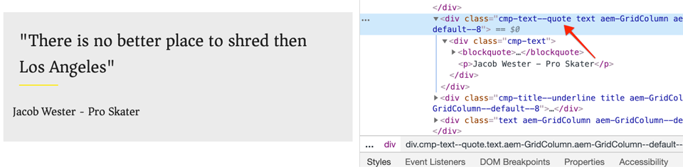

# 用风格体系发展 {#developing-with-the-style-system}

了解如何使用Experience Manager的样式系统实施单个样式并重复使用核心组件。 本教程涵盖开发样式系统以使用特定于品牌的CSS和模板编辑器的高级策略配置来扩展核心组件。

## 前提条件 {#prerequisites}

查看设置[本地开发环境](overview.md#local-dev-environment)所需的工具和说明。

另外，还建议查看[客户端库和前端工作流](client-side-libraries.md)教程，以了解客户端库的基础知识以及内置到AEM项目中的各种前端工具。

### 入门项目

>[!NOTE]
>
> 如果您成功完成了上一章，则可以重复使用该项目并跳过签出起始项目的步骤。

查看本教程构建的基行代码：

1. 查看[GitHub](https://github.com/adobe/aem-guides-wknd)中的`tutorial/style-system-start`分支

   ```shell
   $ cd aem-guides-wknd
   $ git checkout tutorial/style-system-start
   ```

1. 使用您的Maven技能将代码库部署到本地AEM实例：

   ```shell
   $ mvn clean install -PautoInstallSinglePackage
   ```

   >[!NOTE]
   >
   > 如果使用AEM 6.5或6.4，请将`classic`配置文件附加到任何Maven命令。

   ```shell
   $ mvn clean install -PautoInstallSinglePackage -Pclassic
   ```

您始终可以在[GitHub](https://github.com/adobe/aem-guides-wknd/tree/tutorial/style-system-solution)上查看完成的代码，或通过切换到分支`tutorial/style-system-solution`在本地签出代码。

## 目标

1. 了解如何使用样式系统将特定于品牌的CSS应用到AEM核心组件。
1. 了解BEM记数法，以及如何使用它仔细调整样式。
1. 使用可编辑的模板应用高级策略配置。

## 将构建的内容 {#what-you-will-build}

在本章中，我们将使用[样式系统功能](https://experienceleague.adobe.com/docs/experience-manager-learn/sites/page-authoring/style-system-feature-video-use.html)创建文章页面上使用的&#x200B;**标题**&#x200B;和&#x200B;**文本**&#x200B;组件的变体。


*可用于标题组件的下划线样式*

## 背景 {#background}

[样式系统](https://experienceleague.adobe.com/docs/experience-manager-65/authoring/siteandpage/style-system.html)允许开发人员和模板编辑器创建组件的多个可视化变量。 然后，作者可以决定在合成页面时使用哪种样式。 在本教程的其余部分中，我们将利用样式系统来实现多个独特的样式，同时以低代码方式利用核心组件。

样式系统的一般思想是，作者可以选择组件外观的各种样式。 “styles”由插入到组件外div中的其他CSS类作为后盾。 在客户端库中，会根据这些样式类添加CSS规则，以便组件更改外观。

您可以在此处](https://experienceleague.adobe.com/docs/experience-manager-cloud-service/sites/authoring/features/style-system.html)找到有关样式系统的详细文档。 [还有一个很棒的[技术视频，用于了解样式系统](https://experienceleague.adobe.com/docs/experience-manager-learn/sites/developing/style-system-technical-video-understand.html)。

## 下划线样式 — 标题 {#underline-style}

[标题组件](https://experienceleague.adobe.com/docs/experience-manager-core-components/using/components/title.html)已作为&#x200B;**ui.apps**&#x200B;模块的一部分，在`/apps/wknd/components/title`下被代理到项目中。 已在&#x200B;**ui.frontend**&#x200B;模块中实施了标题元素的默认样式(`H1`、`H2`、`H3`...)。

[WKND文章设计](assets/pages-templates/wknd-article-design.xd)包含带下划线的标题组件的唯一样式。 样式系统可用于允许作者使用选项添加下划线样式，而不是创建两个组件或修改组件对话框。


### Inspect标题标记

作为前端开发人员，为核心组件设置样式的第一步是了解组件生成的标记。

1. 打开新浏览器并在AEM核心组件库网站上查看标题组件：[https://www.aemcomponents.dev/content/core-components-examples/library/page-authoring/title.html](https://www.aemcomponents.dev/content/core-components-examples/library/page-authoring/title.html)

1. 以下是标题组件的标记：

   ```html
   <div class="cmp-title">
       <h1 class="cmp-title__text">Lorem Ipsum</h1>
   </div>
   ```

   标题组件的BEM符号：

   ```plain
   BLOCK cmp-title
       ELEMENT cmp-title__text
   ```

1. Style系统会向组件周围的外部div中添加CSS类。 因此，我们要定位的标记将类似于以下内容：

   ```html
   <div class="STYLE-SYSTEM-CLASS-HERE"> <!-- Custom CSS class - implementation gets to define this -->
       <div class="cmp-title">
           <h1 class="cmp-title__text">Lorem Ipsum</h1>
       </div>
   </div>
   ```

### 实施下划线样式 — ui.frontend

接下来，使用我们项目的&#x200B;**ui.frontend**&#x200B;模块实施下划线样式。 我们将使用与&#x200B;**ui.frontend**&#x200B;模块捆绑在一起的Webpack开发服务器，在部署到AEM本地实例的&#x200B;*之前预览样式*。

1. 从&#x200B;**ui.frontend**&#x200B;模块中运行以下命令，以启动Webpack开发服务器：

   ```shell
   $ cd ~/code/aem-guides-wknd/ui.frontend/
   $ npm start
   
   > aem-maven-archetype@1.0.0 start code/aem-guides-wknd/ui.frontend
   > webpack-dev-server --open --config ./webpack.dev.js
   ```

   这应该会在[http://localhost:8080](http://localhost:8080)处打开一个浏览器。

   >[!NOTE]
   >
   > 如果图像显示为已损坏，请确保将起始项目部署到AEM的本地实例（在端口4502上运行），并且使用的浏览器也登录到本地AEM实例。

   

1. 在IDE中，打开位于以下位置的文件`index.html`:`ui.frontend/src/main/webpack/static/index.html`。 这是WebPack开发服务器使用的静态标记。
1. 在`index.html`中，通过搜索文档&#x200B;*cmp-title*，找到标题组件的实例，以向添加下划线样式。 选择标题组件，其文本为&#x200B;*&quot;Vans oft the Wall Skatepark&quot;*（第218行）。 将类`cmp-title--underline`添加到周围的div中：

   ```diff
   - <div class="title aem-GridColumn--phone--12 aem-GridColumn aem-GridColumn--default--8">
   + <div class="cmp-title--underline title aem-GridColumn--phone--12 aem-GridColumn aem-GridColumn--default--8">
        <div data-cmp-data-layer="{&#34;title-8bea562fa0&#34;:{&#34;@type&#34;:&#34;wknd/components/title&#34;,&#34;repo:modifyDate&#34;:&#34;2021-01-22T18:54:20Z&#34;,&#34;dc:title&#34;:&#34;Vans Off the Wall&#34;}}" id="title-8bea562fa0" class="cmp-title">
            <h2 class="cmp-title__text">Vans Off the Wall</h2>
        </div>
    </div>
   ```

1. 返回到浏览器并验证额外的类是否反映在标记中。
1. 返回到&#x200B;**ui.frontend**&#x200B;模块，并更新位于以下位置的文件`title.scss`:`ui.frontend/src/main/webpack/components/_title.scss`:

   ```css
   /* Add Title Underline Style */
   .cmp-title--underline {
       .cmp-title__text {
           &:after {
           display: block;
               width: 84px;
               padding-top: 8px;
               content: '';
               border-bottom: 2px solid $brand-primary;
           }
       }
   }
   ```

   >[!NOTE]
   >
   >始终将样式严格限定在目标组件中，这被视为最佳实践。 这可确保额外的样式不会影响页面的其他区域。
   >
   >所有核心组件都遵循&#x200B;**[BEM符号](https://github.com/adobe/aem-core-wcm-components/wiki/css-coding-conventions)**。 最好在为组件创建默认样式时定位外部CSS类。 另一个最佳实践是定位由核心组件BEM符号而不是HTML元素指定的类名称。

1. 再次返回到浏览器，您应会看到添加的下划线样式：

   

1. 停止WebPack开发服务器。

### 添加标题策略

接下来，我们需要为标题组件添加新策略，以允许内容作者选择要应用于特定组件的下划线样式。 可使用AEM中的模板编辑器来完成此操作。

1. 使用您的Maven技能将代码库部署到本地AEM实例：

   ```shell
   $ cd ~/code/aem-guides-wknd
   $ mvn clean install -PautoInstallSinglePackage
   ```

1. 导航到位于以下位置的&#x200B;**文章页面**&#x200B;模板：[http://localhost:4502/editor.html/conf/wknd/settings/wcm/templates/article-page/structure.html](http://localhost:4502/editor.html/conf/wknd/settings/wcm/templates/article-page/structure.html)

1. 在&#x200B;**结构**&#x200B;模式下，在主&#x200B;**布局容器**&#x200B;中，选择&#x200B;**允许的组件&#x200B;*下列出的*标题**&#x200B;组件旁边的&#x200B;**策略**&#x200B;图标：

   

1. 为标题组件创建新策略，其值如下：

   *策略标题**: **WKND标题**

   *属性*  >  *样式选项卡*  >  *添加新样式*

   **下划线** :  `cmp-title--underline`

   

   单击&#x200B;**Done**&#x200B;以保存对标题策略所做的更改。

   >[!NOTE]
   >
   > 值`cmp-title--underline`与我们在&#x200B;**ui.frontend**&#x200B;模块中进行开发时之前定向的CSS类匹配。

### 应用下划线样式

最后，作为作者，我们可以选择将下划线样式应用于某些标题组件。

1. 在AEM Sites编辑器中，导航到&#x200B;**La Skateparks**&#x200B;文章：[http://localhost:4502/editor.html/content/wknd/us/en/magazine/guide-la-skateparks.html](http://localhost:4502/editor.html/content/wknd/us/en/magazine/guide-la-skateparks.html)
1. 在&#x200B;**编辑**&#x200B;模式中，选择标题组件。 单击&#x200B;**画笔**&#x200B;图标，然后选择&#x200B;**下划线**&#x200B;样式：

   

   作为作者，您应该能够打开/关闭样式。

1. 单击&#x200B;**页面信息**&#x200B;图标> **查看已发布的项目**&#x200B;以在AEM编辑器外检查页面。

   

   使用浏览器开发人员工具验证标题组件周围的标记是否将CSS类`cmp-title--underline`应用于外部div。

## 引号块样式 — 文本 {#text-component}

接下来，重复类似步骤以对[文本组件](https://experienceleague.adobe.com/docs/experience-manager-core-components/using/components/text.html)应用唯一样式。 文本组件已作为&#x200B;**ui.apps**&#x200B;模块的一部分被代理到`/apps/wknd/components/text`下的项目中。 段落元素的默认样式已在&#x200B;**ui.frontend**&#x200B;中实施。

[WKND文章设计](assets/pages-templates/wknd-article-design.xd)包含带有引号块的文本组件的唯一样式：


### Inspect文本组件标记

我们将再次检查文本组件的标记。

1. 在以下位置查看文本组件的标记：[https://www.aemcomponents.dev/content/core-components-examples/library/page-authoring/text.html](https://www.aemcomponents.dev/content/core-components-examples/library/page-authoring/text.html)

1. 以下是文本组件的标记：

   ```html
   <div class="text">
       <div class="cmp-text" data-cmp-data-layer="{&quot;text-2d9d50c5a7&quot;:{&quot;@type&quot;:&quot;core/wcm/components/text/v2/text&quot;,&quot;repo:modifyDate&quot;:&quot;2019-01-22T11:56:17Z&quot;,&quot;xdm:text&quot;:&quot;<p>Lorem ipsum dolor sit amet, consectetur adipiscing elit, sed do eiusmod tempor incididunt ut labore et dolore magna aliqua. Eu mi bibendum neque egestas congue quisque egestas. Varius morbi enim nunc faucibus a pellentesque. Scelerisque eleifend donec pretium vulputate sapien nec sagittis.</p>\n&quot;}}" id="text-2d9d50c5a7">
           <p>Lorem ipsum dolor sit amet, consectetur adipiscing elit, sed do eiusmod tempor incididunt ut labore et dolore magna aliqua. Eu mi bibendum neque egestas congue quisque egestas. Varius morbi enim nunc faucibus a pellentesque. Scelerisque eleifend donec pretium vulputate sapien nec sagittis.</p>
       </div>
   </div>
   ```

   文本组件的BEM符号：

   ```plain
   BLOCK cmp-text
       ELEMENT
   ```

1. Style系统会向组件周围的外部div中添加CSS类。 因此，我们要定位的标记将类似于以下内容：

   ```html
   <div class="text STYLE-SYSTEM-CLASS-HERE"> <!-- Custom CSS class - implementation gets to define this -->
       <div class="cmp-text" data-cmp-data-layer="{&quot;text-2d9d50c5a7&quot;:{&quot;@type&quot;:&quot;core/wcm/components/text/v2/text&quot;,&quot;repo:modifyDate&quot;:&quot;2019-01-22T11:56:17Z&quot;,&quot;xdm:text&quot;:&quot;<p>Lorem ipsum dolor sit amet, consectetur adipiscing elit, sed do eiusmod tempor incididunt ut labore et dolore magna aliqua. Eu mi bibendum neque egestas congue quisque egestas. Varius morbi enim nunc faucibus a pellentesque. Scelerisque eleifend donec pretium vulputate sapien nec sagittis.</p>\n&quot;}}" id="text-2d9d50c5a7">
           <p>Lorem ipsum dolor sit amet, consectetur adipiscing elit, sed do eiusmod tempor incididunt ut labore et dolore magna aliqua. Eu mi bibendum neque egestas congue quisque egestas. Varius morbi enim nunc faucibus a pellentesque. Scelerisque eleifend donec pretium vulputate sapien nec sagittis.</p>
       </div>
   </div>
   ```

### 实施引号块样式 — ui.frontend

接下来，我们将使用我们项目的&#x200B;**ui.frontend**&#x200B;模块实施引号块样式。

1. 从&#x200B;**ui.frontend**&#x200B;模块中运行以下命令，以启动Webpack开发服务器：

   ```shell
   $ cd ~/code/aem-guides-wknd/ui.frontend/
   $ npm start
   ```

1. 在IDE中，打开位于以下位置的文件`index.html`:`ui.frontend/src/main/webpack/static/index.html`。
1. 在`index.html`中，通过搜索文本&#x200B;*&quot;Jacob Wester&quot;*（第210行）来查找文本组件的实例。 将类`cmp-text--quote`添加到周围的div中：

   ```diff
   - <div class="text aem-GridColumn--phone--12 aem-GridColumn aem-GridColumn--default--8">
   + <div class="cmp-text--quote text aem-GridColumn--phone--12 aem-GridColumn aem-GridColumn--default--8">
        <div data-cmp-data-layer="{&#34;text-a15f39a83a&#34;:{&#34;@type&#34;:&#34;wknd/components/text&#34;,&#34;repo:modifyDate&#34;:&#34;2021-01-22T00:23:27Z&#34;,&#34;xdm:text&#34;:&#34;&lt;blockquote>&amp;quot;There is no better place to shred then Los Angeles.”&lt;/blockquote>\r\n&lt;p>- Jacob Wester, Pro Skater&lt;/p>\r\n&#34;}}" id="text-a15f39a83a" class="cmp-text">
            <blockquote>&quot;There is no better place to shred then Los Angeles.”</blockquote>
            <p>- Jacob Wester, Pro Skater</p>
        </div>
    </div>
   ```

1. 更新位于以下位置的文件`text.scss`:`ui.frontend/src/main/webpack/components/_text.scss`:

   ```css
   /* WKND Text Quote style */
   .cmp-text--quote {
       .cmp-text {
           background-color: $brand-third;
           margin: 1em 0em;
           padding: 1em;
   
           blockquote {
               border: none;
               font-size: $font-size-large;
               font-family: $font-family-serif;
               padding: 14px 14px;
               margin: 0;
               margin-bottom: 0.5em;
   
               &:after {
                   border-bottom: 2px solid $brand-primary; /*yellow border */
                   content: '';
                   display: block;
                   position: relative;
                   top: 0.25em;
                   width: 80px;
               }
           }
           p {
               font-family:  $font-family-serif;
           }
       }
   }
   ```

   >[!CAUTION]
   >
   > 在这种情况下，样式会定位原始HTML元素。 这是因为文本组件为内容作者提供了富文本编辑器。 应当谨慎地直接针对RTE内容创建样式，并且更重要的是要严格地限定样式范围。

1. 再次返回到浏览器，您应会看到已添加引号块样式：

   

1. 停止WebPack开发服务器。

### 添加文本策略

接下来，为文本组件添加新策略。

1. 使用您的Maven技能将代码库部署到本地AEM实例：

   ```shell
   $ cd ~/code/aem-guides-wknd
   $ mvn clean install -PautoInstallSinglePackage
   ```

1. 导航到位于以下位置的&#x200B;**文章页面模板**:[http://localhost:4502/editor.html/conf/wknd/settings/wcm/templates/article-page/structure.html](http://localhost:4502/editor.html/conf/wknd/settings/wcm/templates/article-page/structure.html))。

1. 在&#x200B;**结构**&#x200B;模式下，在主&#x200B;**布局容器**&#x200B;中，选择&#x200B;**允许的组件&#x200B;*下列出的*Text**&#x200B;组件旁边的&#x200B;**策略**&#x200B;图标：

   

1. 使用以下值更新文本组件策略：

   *策略标题**: **内容文本**

   *插件*  >  *段落样式*  >  *启用段落样式*

   *“样式”选项卡* > *添加新样式*

   **引用块** :  `cmp-text--quote`

   

   

   单击&#x200B;**Done**&#x200B;以保存对文本策略所做的更改。

### 应用引号块样式

1. 在AEM Sites编辑器中，导航到&#x200B;**La Skateparks**&#x200B;文章：[http://localhost:4502/editor.html/content/wknd/us/en/magazine/guide-la-skateparks.html](http://localhost:4502/editor.html/content/wknd/us/en/magazine/guide-la-skateparks.html)
1. 在&#x200B;**编辑**&#x200B;模式下，选择文本组件。 编辑组件以包含引号元素：

   

1. 选择文本组件，然后单击&#x200B;**画笔**&#x200B;图标，然后选择&#x200B;**引用块**&#x200B;样式：

   

   作为作者，您应该能够打开/关闭样式。

## 固定宽度 — 容器（附加） {#layout-container}

容器组件用于创建文章页面模板的基本结构，并为内容作者提供用于在页面上添加内容的拖放区域。 容器还可以利用样式系统，为内容作者提供更多用于设计布局的选项。

文章页模板的&#x200B;**主容器**&#x200B;包含两个可创作的容器，并具有固定的宽度。


*文章页面模板中的主容器*。

**主容器**&#x200B;的策略将默认元素设置为`main`:


修复&#x200B;**主容器**&#x200B;的CSS在`ui.frontend/src/main/webpack/site/styles/container_main.scss`的&#x200B;**ui.frontend**&#x200B;模块中设置：

```SCSS
main.container {
    padding: .5em 1em;
    max-width: $max-content-width;
    float: unset!important;
    margin: 0 auto!important;
    clear: both!important;
}
```

样式系统不能定位`main` HTML元素，而是可用于创建作为容器策略一部分的&#x200B;**Fixed width**&#x200B;样式。 样式系统可为用户提供在&#x200B;**固定宽度**&#x200B;和&#x200B;**流体宽度**&#x200B;容器之间切换的选项。

1. **附加练习**  — 使用从先前练习中学到的课程，并使用样式系统为容器组件 **实施** 固定 **宽** 度和流体宽度。

## 恭喜！ {#congratulations}

恭喜，文章页面的样式几乎完整，您在使用AEM样式系统时获得了实际操作经验。

### 后续步骤 {#next-steps}

了解端到端创建[自定义AEM组件](custom-component.md)以显示对话框中创作的内容的步骤，并探索开发Sling模型以封装可填充组件HTL的业务逻辑。

在[GitHub](https://github.com/adobe/aem-guides-wknd)上查看完成的代码，或在Git浏览器`tutorial/style-system-solution`上的本地查看并部署代码。

1. 克隆[github.com/adobe/aem-wknd-guides](https://github.com/adobe/aem-guides-wknd)存储库。
1. 查看`tutorial/style-system-solution`分支。
