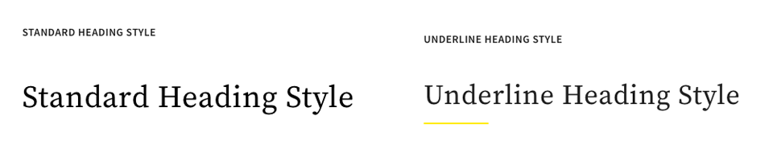
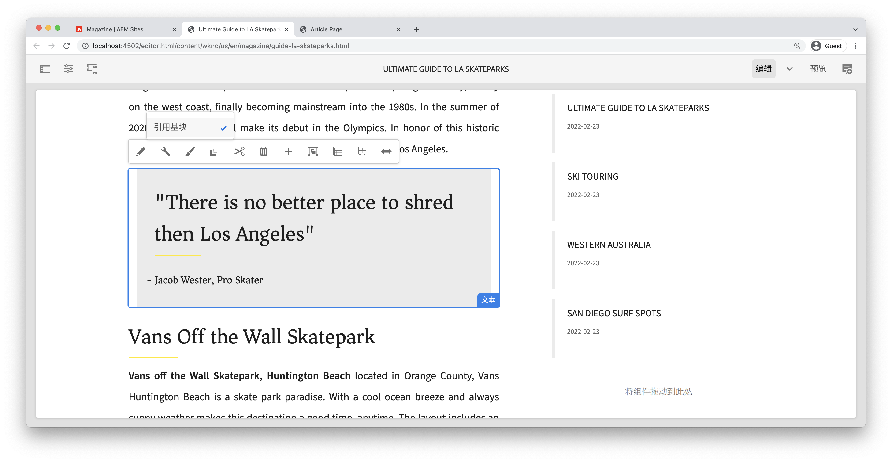

# 用样式系统进行开发 {#developing-with-the-style-system}

了解如何使用Experience Manager的样式系统实施单个样式并重用核心组件。 本教程介绍如何开发样式系统，以便通过模板编辑器的品牌特定CSS和高级策略配置来扩展核心组件。

## 前提条件 {#prerequisites}

查看所需的工具和设置说明 [本地开发环境](overview.md#local-dev-environment).

此外，还建议查看 [客户端库和前端工作流](client-side-libraries.md) 本教程将介绍客户端库的基础知识以及内置到AEM项目中的各种前端工具。

### 入门项目

>[!NOTE]
>
> 如果成功完成了上一章，则可以重用该项目并跳过签出入门项目的步骤。

查看本教程所基于的基本行代码：

1. 查看 `tutorial/style-system-start` 分支自 [GitHub](https://github.com/adobe/aem-guides-wknd)

   ```shell
   $ cd aem-guides-wknd
   $ git checkout tutorial/style-system-start
   ```

1. 使用您的Maven技能将代码库部署到本地AEM实例：

   ```shell
   $ mvn clean install -PautoInstallSinglePackage
   ```

   >[!NOTE]
   >
   > 如果使用AEM 6.5或6.4，请附加 `classic` 配置文件到任何Maven命令。

   ```shell
   $ mvn clean install -PautoInstallSinglePackage -Pclassic
   ```

您始终可以在上查看完成的代码 [GitHub](https://github.com/adobe/aem-guides-wknd/tree/tutorial/style-system-solution) 或者切换到分支机构在本地签出代码 `tutorial/style-system-solution`.

## 目标

1. 了解如何使用样式系统将品牌特定的CSS应用于AEM核心组件。
1. 了解BEM表示法以及如何将其用于仔细定义样式。
1. 使用可编辑模板应用高级策略配置。

## 您即将构建的内容 {#what-build}

本章使用 [样式系统功能](https://experienceleague.adobe.com/docs/experience-manager-learn/sites/page-authoring/style-system-feature-video-use.html) 创建变体 **标题** 和 **文本** 在文章页面上使用的组件。


*可用于标题组件的下划线样式*

## 背景 {#background}

此 [样式系统](https://experienceleague.adobe.com/docs/experience-manager-65/authoring/siteandpage/style-system.html) 允许开发人员和模板编辑器创建组件的多个可视化变量。 然后，作者可以在撰写页面时依次决定要使用哪种样式。 样式系统在本教程的其余部分中使用，以便在以低代码方法使用核心组件时实现多种独特样式。

样式系统的基本思想是，作者可以选择组件的各种样式。 “样式”由插入到组件的外部div中的其他CSS类支持。 在客户端库中，会根据这些样式类添加CSS规则，以便组件更改外观。

您可以找到 [此处提供了有关样式系统的详细文档](https://experienceleague.adobe.com/docs/experience-manager-cloud-service/content/sites/authoring/features/style-system.html). 还有个很棒的 [用于了解样式系统的技术视频](https://experienceleague.adobe.com/docs/experience-manager-learn/sites/developing/style-system-technical-video-understand.html).

## 下划线样式 — 标题 {#underline-style}

此 [标题组件](https://experienceleague.adobe.com/docs/experience-manager-core-components/using/wcm-components/title.html) 已代理到项目中的 `/apps/wknd/components/title` 作为 **ui.apps** 模块。 标题元素的默认样式(`H1`， `H2`， `H3`...)已在中实施 **ui.frontend** 模块。

此 [WKND文章设计](assets/pages-templates/wknd-article-design.xd) 为带有下划线的标题组件包含唯一的样式。 可以使用“样式系统”让作者可以选择添加下划线样式，而不是创建两个组件或修改组件对话框。



### 添加标题策略

让我们为标题组件添加一个策略，以允许内容作者选择要应用于特定组件的下划线样式。 可使用AEM中的模板编辑器完成此操作。

1. 导航至 **文章页面** 模板来源： [http://localhost:4502/editor.html/conf/wknd/settings/wcm/templates/article-page/structure.html](http://localhost:4502/editor.html/conf/wknd/settings/wcm/templates/article-page/structure.html)

1. 在 **结构** 模式，在主 **布局容器**，选择 **策略** 图标(位于 **标题** 下列出的组件 *允许的组件*：

   

1. 为标题组件创建具有以下值的策略：

   *策略标题&#42;*： **WKND标题**

   *属性* > *“样式”选项卡* > *添加新样式*

   **下划线** ： `cmp-title--underline`

   

   单击 **完成** 以保存对标题策略所做的更改。

   >[!NOTE]
   >
   > 值 `cmp-title--underline` 在组件的HTML标记的外部div上填充CSS类。

### 应用下划线样式

作为作者，让我们将下划线样式应用于某些标题组件。

1. 导航至 **洛杉矶滑板场** AEM Sites编辑器中的文章： [http://localhost:4502/editor.html/content/wknd/us/en/magazine/guide-la-skateparks.html](http://localhost:4502/editor.html/content/wknd/us/en/magazine/guide-la-skateparks.html)
1. 在 **编辑** 模式，选择标题组件。 单击 **画笔** 图标，然后选择 **下划线** 样式：

   

   >[!NOTE]
   >
   > 此时，不会发生任何可见更改，因为 `underline` 尚未实现样式。 在下一个练习中，将实施此样式。

1. 单击 **页面信息** 图标> **查看已发布的项目** 在AEM编辑器外部检查页面。
1. 使用浏览器开发人员工具验证Title组件周围的标记是否具有CSS类 `cmp-title--underline` 应用于外部div。

   

   ```html
   <div class="title cmp-title--underline">
       <div data-cmp-data-layer="{&quot;title-b6450e9cab&quot;:{&quot;@type&quot;:&quot;wknd/components/title&quot;,&quot;repo:modifyDate&quot;:&quot;2022-02-23T17:34:42Z&quot;,&quot;dc:title&quot;:&quot;Vans Off the Wall Skatepark&quot;}}" 
       id="title-b6450e9cab" class="cmp-title">
           <h2 class="cmp-title__text">Vans Off the Wall Skatepark</h2>
       </div>
   </div>
   ```

### 实施下划线样式 — ui.frontend

接下来，使用 **ui.frontend** AEM项目的模块。 与捆绑在一起的webpack开发服务器 **ui.frontend** 用于预览样式的模块 *早于* 使用部署到AEM的本地实例。

1. 启动 `watch` 从内部处理 **ui.frontend** 模块：

   ```shell
   $ cd ~/code/aem-guides-wknd/ui.frontend/
   $ npm run watch
   ```

   这将启动一个进程，用于监视 `ui.frontend` 模块并将更改同步到AEM实例。


1. 返回IDE并打开文件 `_title.scss` 从： `ui.frontend/src/main/webpack/components/_title.scss`.
1. 引入一项针对以下对象的新规则： `cmp-title--underline` class：

   ```scss
   /* Default Title Styles */
   .cmp-title {}
   .cmp-title__text {}
   .cmp-title__link {}
   
   /* Add Title Underline Style */
   .cmp-title--underline {
       .cmp-title__text {
           &:after {
           display: block;
               width: 84px;
               padding-top: 8px;
               content: '';
               border-bottom: 2px solid $brand-primary;
           }
       }
   }
   ```

   >[!NOTE]
   >
   >一般认为，最佳实践是始终将样式严格限定在目标组件中。 这可以确保额外的样式不会影响页面的其他区域。
   >
   >所有核心组件都遵守 **[BEM表示法](https://github.com/adobe/aem-core-wcm-components/wiki/css-coding-conventions)**. 为组件创建默认样式时，最佳做法是定位外部CSS类。 另一个最佳实践是定位由核心组件BEM表示法指定的类名，而不是HTML元素。

1. 返回到浏览器和AEM页面。 您应该会看到添加了下划线样式：

   

1. 在AEM编辑器中，您现在应该能够打开和关闭 **下划线** 样式，并查看更改在视觉上反映的情况。

## 引号块样式 — 文本 {#text-component}

接下来，重复类似的步骤，将唯一的样式应用于 [文本组件](https://experienceleague.adobe.com/docs/experience-manager-core-components/using/wcm-components/text.html). 文本组件已代理到下的项目中 `/apps/wknd/components/text` 作为 **ui.apps** 模块。 段落元素的默认样式已在中实施 **ui.frontend**.

此 [WKND文章设计](assets/pages-templates/wknd-article-design.xd) 为带有引号块的文本组件包含唯一的样式：


### 添加文本策略

接下来，为文本组件添加策略。

1. 导航至 **文章页面模板** 从： [http://localhost:4502/editor.html/conf/wknd/settings/wcm/templates/article-page/structure.html](http://localhost:4502/editor.html/conf/wknd/settings/wcm/templates/article-page/structure.html).

1. 在 **结构** 模式，在主 **布局容器**，选择 **策略** 图标(位于 **文本** 下列出的组件 *允许的组件*：

   

1. 使用以下值更新文本组件策略：

   *策略标题&#42;*： **内容文本**

   *插件* > *段落样式* > *启用段落样式*

   *“样式”选项卡* > *添加新样式*

   **报价块** ： `cmp-text--quote`

   

   

   单击 **完成** 保存对文本策略所做的更改。

### 应用引号块样式

1. 导航至 **洛杉矶滑板场** AEM Sites编辑器中的文章： [http://localhost:4502/editor.html/content/wknd/us/en/magazine/guide-la-skateparks.html](http://localhost:4502/editor.html/content/wknd/us/en/magazine/guide-la-skateparks.html)
1. 在 **编辑** 模式，选择文本组件。 编辑组件以包含报价元素：

   

1. 选择文本组件并单击 **画笔** 图标，然后选择 **报价块** 样式：

   

1. 使用浏览器的开发人员工具检查标记。 您应该会看到类名 `cmp-text--quote` 已添加到组件的外部div：

   ```html
   <!-- Quote Block style class added -->
   <div class="text cmp-text--quote">
       <div data-cmp-data-layer="{&quot;text-60910f4b8d&quot;:{&quot;@type&quot;:&quot;wknd/components/text&quot;,&quot;repo:modifyDate&quot;:&quot;2022-02-24T00:55:26Z&quot;,&quot;xdm:text&quot;:&quot;<blockquote>&amp;nbsp; &amp;nbsp; &amp;nbsp;&amp;quot;There is no better place to shred then Los Angeles&amp;quot;</blockquote>\r\n<p>- Jacob Wester, Pro Skater</p>\r\n&quot;}}" id="text-60910f4b8d" class="cmp-text">
           <blockquote>&nbsp; &nbsp; &nbsp;"There is no better place to shred then Los Angeles"</blockquote>
           <p>- Jacob Wester, Pro Skater</p>
       </div>
   </div>
   ```

### 实施引号块样式 — ui.frontend

接下来，我们使用 **ui.frontend** AEM项目的模块。

1. 如果尚未运行，请启动 `watch` 从内部处理 **ui.frontend** 模块：

   ```shell
   $ npm run watch
   ```

1. 更新文件 `text.scss` 从： `ui.frontend/src/main/webpack/components/_text.scss`：

   ```css
   /* Default text style */
   .cmp-text {}
   .cmp-text__paragraph {}
   
   /* WKND Text Quote style */
   .cmp-text--quote {
       .cmp-text {
           background-color: $brand-third;
           margin: 1em 0em;
           padding: 1em;
   
           blockquote {
               border: none;
               font-size: $font-size-large;
               font-family: $font-family-serif;
               padding: 14px 14px;
               margin: 0;
               margin-bottom: 0.5em;
   
               &:after {
                   border-bottom: 2px solid $brand-primary; /*yellow border */
                   content: '';
                   display: block;
                   position: relative;
                   top: 0.25em;
                   width: 80px;
               }
           }
           p {
               font-family:  $font-family-serif;
           }
       }
   }
   ```

   >[!CAUTION]
   >
   > 在本例中，原始HTML元素由样式定向。 这是因为文本组件为内容作者提供了一个富文本编辑器。 直接针对RTE内容创建样式时应小心谨慎，因此更加重要的是，应严格限定样式的范围。

1. 再次返回到浏览器，您应该会看到已添加Quote块样式：

   

1. 停止webpack开发服务器。

## 固定宽度 — 容器（附加） {#layout-container}

容器组件已用于创建文章页面模板的基本结构，并为内容作者在页面上添加内容提供放置区域。 容器也可以使用样式系统，从而为内容作者提供更多的布局设计选项。

此 **主容器** 的模板具有两个可创作容器，且其宽度固定。


*文章页面模板中的主容器*.

的政策 **主容器** 将默认元素设置为 `main`：


用于创建 **主容器** fixed在 **ui.frontend** 模块位于 `ui.frontend/src/main/webpack/site/styles/container_main.scss` ：

```SCSS
main.container {
    padding: .5em 1em;
    max-width: $max-content-width;
    float: unset!important;
    margin: 0 auto!important;
    clear: both!important;
}
```

不要定位 `main` HTML元素，样式系统可用于创建 **固定宽度** 样式作为容器策略的一部分。 样式系统可以为用户提供在样式系统与 **固定宽度** 和 **流体宽度** 容器。

1. **奖励质询**  — 使用从以前练习中吸取的经验教训并使用样式系统实施 **固定宽度** 和 **流体宽度** 容器组件的样式。

## 恭喜！ {#congratulations}

恭喜，文章页面几乎已设置样式，并且您获得了使用AEM样式系统的实践经验。

### 后续步骤 {#next-steps}

了解创建 [自定义AEM组件](custom-component.md) 可显示对话框中所创作的内容，并探索开发Sling模型以封装填充组件HTL的业务逻辑。

查看完成的代码 [GitHub](https://github.com/adobe/aem-guides-wknd) 或在Git分支上本地查看和部署代码 `tutorial/style-system-solution`.

1. 克隆 [github.com/adobe/aem-wknd-guides](https://github.com/adobe/aem-guides-wknd) 存储库。
1. 查看 `tutorial/style-system-solution` 分支。
