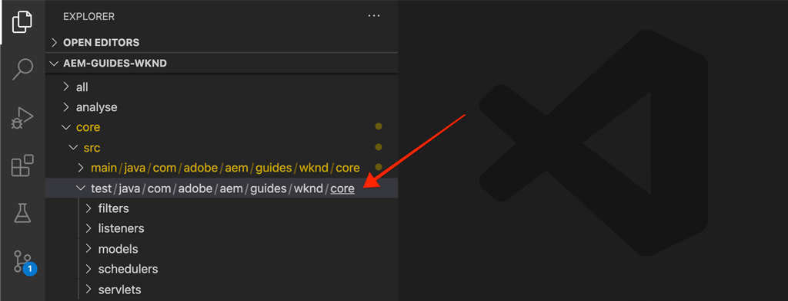
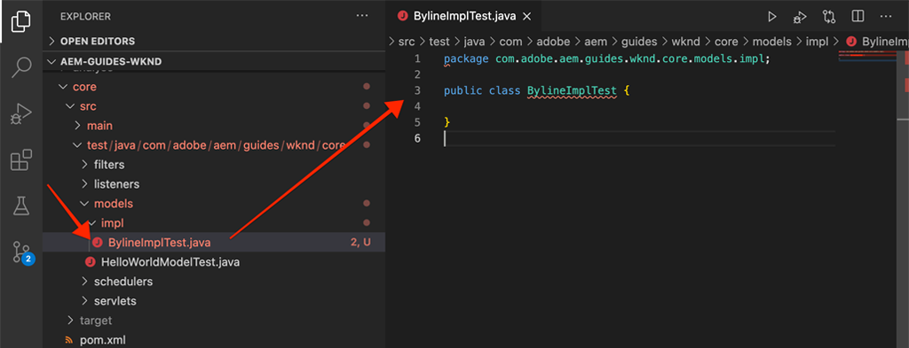

# 单元测试 {#unit-testing}

本教程介绍了如何实施单元测试，验证在[自定义组件](./custom-component.md)教程中创建的署名组件的 Sling 模型的行为。

## 先决条件 {#prerequisites}

查看设置[本地开发环境](overview.md#local-dev-environment)所需的工具和说明。

_如果系统上同时安装了 Java™ 8 和 Java™ 11，VS Code 测试运行程序在执行测试时可能会选择较低的 Java™ 运行时，这会导致测试失败。如果发生这种情况，请卸载 Java™ 8。_

### 入门项目 

>[!NOTE]
>
> 如果您成功完成了上一章的内容，您可以重复使用该项目，跳过签出入门项目的步骤。

签出作为本教程构建基础的基线代码：

1. 从 [GitHub](https://github.com/adobe/aem-guides-wknd) 签出 `tutorial/unit-testing-start` 分支

   ```shell
   $ cd aem-guides-wknd
   $ git checkout tutorial/unit-testing-start
   ```

1. 运用您的 Maven 技能将代码库部署到本地 AEM 实例：

   ```shell
   $ mvn clean install -PautoInstallSinglePackage
   ```

   >[!NOTE]
   >
   > 如果使用 AEM 6.5 或 6.4，请将 `classic` 配置文件附加到任何 Maven 命令。

   ```shell
   $ mvn clean install -PautoInstallSinglePackage -Pclassic
   ```

您可以随时在 [GitHub](https://github.com/adobe/aem-guides-wknd/tree/tutorial/unit-testing-start) 上查看完成的代码，或者切换到分支 `tutorial/unit-testing-start` 将代码签出到本地。

## 目标

1. 了解单元测试的基础知识。
1. 了解经常用于测试 AEM 代码的框架和工具。
1. 了解编写单元测试时模仿或模拟 AEM 资源的选项。

## 背景 {#unit-testing-background}

在本教程中，我们将探讨如何为署名组件的 [Sling 模型](https://sling.apache.org/documentation/bundles/models.html)（在[创建自定义 AEM 组件](custom-component.md)中创建）编写[单元测试](https://zh.wikipedia.org/wiki/Unit_testing)。单元测试是用 Java™ 编写的构建时测试，用于验证 Java™ 代码的预期行为。每个单元测试通常都很小，根据预期结果验证某个方法（或工作单元）的输出。

我们采用 AEM 最佳实践，部署：

* [JUnit 5](https://junit.org/junit5/)
* [Mockito 测试框架](https://site.mockito.org/)
* [wcm.io 测试框架](https://wcm.io/testing/)（建立在 [Apache Sling Mocks](https://sling.apache.org/documentation/development/sling-mock.html) 上）

## 单元测试和 Adobe Cloud Manager {#unit-testing-and-adobe-cloud-manager}

[Adobe Cloud Manager](https://experienceleague.adobe.com/docs/experience-manager-cloud-manager/content/introduction.html?lang=zh-Hans) 将单元测试执行和[代码覆盖率报告](https://experienceleague.adobe.com/docs/experience-manager-cloud-manager/content/using/code-quality-testing.html?lang=zh-Hans)集成到其 CI/CD 管道，以帮助鼓励和推广 AEM 代码单元测试的最佳实践。

单元测试代码对于任何代码库来说都是一种很好的做法，而在使用 Cloud Manager 时为 Cloud Manager 运行单元测试，充分利用其代码质量测试和报告功能，这一点非常重要。

## 更新测试 Maven 依赖项 {#inspect-the-test-maven-dependencies}

第一步是查看 Maven 依赖项，以支持编写和运行测试。需要四个依赖项：

1. JUnit5
1. Mockito 测试框架
1. Apache Sling Mocks
1. AEM Mocks 测试框架（通过 io.wcm）

在使用 [AEM Maven 原型](project-setup.md)进行设置的过程中，**JUnit5**、**Mockito 和 **AEM Mocks** 这几个测试依赖项会被自动添加到项目中。

1. 要查看这些依赖项，请打开位于 **aem-guides-wknd/pom.xml** 的 Parent Reactor POM，导航至 `<dependencies>..</dependencies>`，然后通过 `<!-- Testing -->` 中的 io.wcm 查看 JUnit、Mockito、Apache Sling Mocks 和 AEM Mock Tests 的依赖项。
1. 确保 `io.wcm.testing.aem-mock.junit5` 设置为 **4.1.0**：

   ```xml
   <dependency>
       <groupId>io.wcm</groupId>
       <artifactId>io.wcm.testing.aem-mock.junit5</artifactId>
       <version>4.1.0</version>
       <scope>test</scope>
   </dependency>
   ```

   >[!CAUTION]
   >
   > 原型 **35** 会生成 `io.wcm.testing.aem-mock.junit5` 版本 **4.1.8** 的项目。请降级至 **4.1.0**，以继续学习本章的其余部分。

1. 打开 **aem-guides-wknd/core/pom.xml**，查看相应的测试依赖项是否可用。

   **核心**&#x200B;项目中的并行源文件夹将包含单元测试和任何支持测试文件。此&#x200B;**测试**&#x200B;文件夹将测试类与源代码分离，但允许测试的行为好像它们与源代码位于同一个包中。

## 创建 JUnit 测试 {#creating-the-junit-test}

单元测试通常与 Java™ 类一对一映射。在本章中，我们将为支持署名组件的 Sling 模型 **BylineImpl.Java** 编写一个 JUnit 测试。



*存储单元测试的位置。*

1. 为 `BylineImpl.java` 创建一个单元测试，也就是在 `src/test/java` 中，在 Java™ 包文件夹结构中创建一个新的 Java™ 类，这个文件夹结构就是要测试的 Java™ 类的位置。

   

   由于我们测试

   * `src/main/java/com/adobe/aem/guides/wknd/core/models/impl/BylineImpl.java`

   因此创建一个相应的单元测试 Java™ 类，位于

   * `src/test/java/com/adobe/aem/guides/wknd/core/models/impl/BylineImplTest.java`

   单元测试文件 `BylineImplTest.java` 的 `Test` 后缀是一种惯例，它允许我们

   1. 轻松识别这是&#x200B;_针对_ `BylineImpl.java` 的测试文件
   1. 但也能将测试文件&#x200B;_与_&#x200B;被测试的类 `BylineImpl.java` 区分开来

## 查看 BylineImplTest.java {#reviewing-bylineimpltest-java}

现在，JUnit 测试文件是一个空的 Java™ 类。

1. 通过以下代码更新文件：

   ```java
   package com.adobe.aem.guides.wknd.core.models.impl;
   
   import static org.junit.jupiter.api.Assertions.*;
   
   import org.junit.jupiter.api.BeforeEach;
   import org.junit.jupiter.api.Test;
   
   public class BylineImplTest {
   
       @BeforeEach
       void setUp() throws Exception {
   
       }
   
       @Test 
       void testGetName() { 
           fail("Not yet implemented");
       }
   
       @Test 
       void testGetOccupations() { 
           fail("Not yet implemented");
       }
   
       @Test 
       void testIsEmpty() { 
           fail("Not yet implemented");
       }
   }
   ```

1. 第一种方法 `public void setUp() { .. }` 带有 JUnit 的 `@BeforeEach` 注释，它指示 JUnit 测试运行程序在运行这个类中的每个测试方法之前先执行这个方法。这里可以很方便地将所有测试都必需的常用测试状态进行初始化。

1. 后续测试方法的名称按照惯例都具有 `test` 前缀，并标有 `@Test` 注释。请注意，在默认情况下，我们所有的测试都设置为失败，因为我们还没有实施这些测试。

   首先，我们为待测试的类中的每一个公共方法使用一个测试方法：

   | BylineImpl.java |              | BylineImplTest.java |
   | ------------------|--------------|---------------------|
   | getName() | is tested by | testGetName() |
   | getOccupations() | is tested by | testGetOccupations() |
   | isEmpty() | is tested by | testIsEmpty() |

   这些方法可以根据需要进行扩展，我们将在本章稍后看到。

   运行这个 JUnit 测试类（也称为 JUnit 测试用例）时，每个标有 `@Test` 的方法将作为测试执行，结果可能会通过，也可能会失败。


*`core/src/test/java/com/adobe/aem/guides/wknd/core/models/impl/BylineImplTest.java`*

1. 右键单击 `BylineImplTest.java` 文件，然后点击&#x200B;**运行**，运行 JUnit 测试用例。正如预期的那样，所有测试都失败了，因为它们尚未实施。

   

   *右键单击 BylineImplTests.java > 运行*

## 查看 BylineImpl.java {#reviewing-bylineimpl-java}

编写单元测试时，主要有两种方法：

* [TDD 或测试驱动开发](https://zh.wikipedia.org/wiki/Test-driven_development)，这是指在即将编写实施之前逐步编写单元测试，写一个测试，就编写实施以使该测试通过。
* 实施优先型开发，这是指先开发工作代码，然后编写测试来验证此代码。

本教程中采用后一种方法（因为我们已经在上一章创建了一个可行的 **BylineImpl.java**）。因此，我们必须查看并理解其公共方法的行为，以及它的一些实施细节。这听起来可能有些矛盾，因为好的测试应该只关心输入和输出，但是在 AEM 中工作时，需要了解各种实施考虑事项才能构建正确有效的测试。

AEM 上下文中的 TDD 需要一定水平的专业知识，最好由精通 AEM 开发和 AEM 代码单元测试的 AEM 开发人员采用这种方法。

## 设置 AEM 测试上下文  {#setting-up-aem-test-context}

为 AEM 编写的大多数代码都依赖于 JCR、Sling 或 AEM API，而这些 API 又需要一个运行的 AEM 的上下文才能正确执行。

由于单元测试是在构建时执行的，也就是在运行的 AEM 实例的上下文之外，因此不存在这样的上下文。为了做到这一点，[wcm.io 的 AEM Mocks](https://wcm.io/testing/aem-mock/usage.html) 会创建模拟上下文，使这些 API _大部分时候_&#x200B;都表现得好像它们在 AEM 中运行一样。

1. 使用 **BylineImplTest.java** 中 **wcm.io 的** `AemContext` 创建 AEM 上下文，将其作为带 `@ExtendWith` 修饰的 JUnit 扩展添加到 **BylineImplTest.java** 文件中。该扩展负责处理所有必需的初始化和清理任务。为 `AemContext` 创建一个可用于所有测试方法的类变量。

   ```java
   import org.junit.jupiter.api.extension.ExtendWith;
   import io.wcm.testing.mock.aem.junit5.AemContext;
   import io.wcm.testing.mock.aem.junit5.AemContextExtension;
   ...
   
   @ExtendWith(AemContextExtension.class)
   class BylineImplTest {
   
       private final AemContext ctx = new AemContext();
   ```

   此变量  `ctx` 提供一个模拟 AEM 上下文，后者提供一些 AEM 和 Sling 抽象概念：

   * 在这个上下文中注册 BylineImpl Sling 模型
   * 在这个上下文中创建模拟 JCR 内容结构
   * 在这个上下文中可以注册自定义 OSGi 服务
   * 提供各种常见的必需模拟对象和助手，例如 SlingHttpServletRequest 对象、各种模拟 Sling 和 AEM OSGi 服务，例如 ModelFactory、PageManager、页面、模板、ComponentManager、组件、TagManager、标记等。
      * *并没有实施这些对象的所有方法！*
   * 以及[更多](https://wcm.io/testing/aem-mock/usage.html)！

   **`ctx`** 对象将作为我们大多数模拟上下文的入口点。

1. 在每个 `@Test` 方法之前执行的 `setUp(..)` 方法中，定义一个常用的模拟测试状态：

   ```java
   @BeforeEach
   public void setUp() throws Exception {
       ctx.addModelsForClasses(BylineImpl.class);
       ctx.load().json("/com/adobe/aem/guides/wknd/core/models/impl/BylineImplTest.json", "/content");
   }
   ```

   * **`addModelsForClasses`** 将要测试的 Sling 模型注册到模拟 AEM 上下文中，这样就可以在 `@Test` 方法中将其实例化。
   * **`load().json`** 将资源结构加载到模拟上下文中，允许代码与这些资源进行交互，就好像它们是由一个真实存储库提供的。文件 **`BylineImplTest.json`** 中的资源定义被加载到 **/content** 中的模拟 JCR 上下文中。
   * **`BylineImplTest.json`** 尚不存在，因此我们现在来创建它，并定义测试所需的 JCR 资源结构。

1. 表示模拟资源结构的 JSON 文件存储在 **core/src/test/resources**，遵循与 JUnit Java™ 测试文件相同的包路径。

   在 `core/test/resources/com/adobe/aem/guides/wknd/core/models/impl` 创建一个名为 **BylineImplTest.json** 的 JSON 文件，其内容如下：

   ```json
   {
       "byline": {
       "jcr:primaryType": "nt:unstructured",
       "sling:resourceType": "wknd/components/content/byline"
       }
   }
   ```

   

   此 JSON 为署名组件单元测试定义了一个模拟资源（JCR 节点）。现在，JSON 具有代表署名组件内容资源所需的最小属性集，即 `jcr:primaryType` 和 `sling:resourceType`。

   使用单元测试时的一个常用规则是创建满足每个测试所必需的模拟内容、上下文和代码的最小集合。避免尝试在编写测试之前构建完整的模拟上下文，因为这通常会导致产生不需要的工件。

   现在有了 **BylineImplTest.json** 后，在执行 `ctx.json("/com/adobe/aem/guides/wknd/core/models/impl/BylineImplTest.json", "/content")` 时，模拟资源定义就会被加载到路径 **/content.** 的上下文中

## 测试 getName() {#testing-get-name}

现在我们有了一个基本的模拟上下文设置，我们要为 **BylineImpl 的 getName()** 编写第一个测试。该测试必须确保方法 **getName()** 返回存储在资源的“**name”** 属性中的正确创作的名称。

1. 按照下面的操作，更新 **BylineImplTest.java** 中的 **testGetName**() 方法：

   ```java
   import com.adobe.aem.guides.wknd.core.models.Byline;
   ...
   @Test
   public void testGetName() {
       final String expected = "Jane Doe";
   
       ctx.currentResource("/content/byline");
       Byline byline = ctx.request().adaptTo(Byline.class);
   
       String actual = byline.getName();
   
       assertEquals(expected, actual);
   }
   ```

   * **`String expected`** 设置预期值。我们将其设置为“**Jane Done**”。
   * **`ctx.currentResource`** 设置模拟资源的上下文并以此来评估代码，因此将其设置为 **/content/byline**，因为模拟署名内容资源被加载到这里。
   * **`Byline byline`** 通过从模拟请求对象调整署名 Sling 模型来将其实例化。
   * **`String actual`** 在署名 Sling 模型对象上调用我们在测试的方法 `getName()`。
   * **`assertEquals`** 断言预期值与署名 Sling 模型对象返回的值相匹配。如果这两个值不相等，测试将失败。

1. 运行测试……失败，并显示 `NullPointerException`。

   这个测试并不是因为我们尚未在模拟 JSON 中定义 `name` 属性而失败，这个原因的确会导致测试失败，但测试执行现在还没有到达那一步！这个测试失败的原因是署名对象上有一个 `NullPointerException`。

1. 在 `BylineImpl.java` 中，如果 `@PostConstruct init()` 抛出异常，会阻止 Sling 模型实例化，导致 Sling 模型对象为 null。

   ```java
   @PostConstruct
   private void init() {
       image = modelFactory.getModelFromWrappedRequest(request, request.getResource(), Image.class);
   }
   ```

   结果表明，虽然 ModelFactory OSGi 服务是通过 `AemContext` 提供（通过 Apache Sling Context），但并没有实施所有方法，包括在 BylineImpl 的 `init()` 方法中调用的 `getModelFromWrappedRequest(...)`。这导致了 [AbstractMethodError](https://docs.oracle.com/en/java/javase/11/docs/api/java.base/java/lang/AbstractMethodError.html)，进一步导致 `init()` 失败，因此 `ctx.request().adaptTo(Byline.class)` 转换的结果是一个 null 对象。

   由于提供的模拟无法适应我们的代码，我们必须自己实施模拟上下文。为此，我们可以用 Mockito 创建一个模拟 ModelFactory 对象，调用 `getModelFromWrappedRequest(...)` 时该对象会返回一个模拟图像对象。

   为了将署名 Sling 模型实例化，这个模拟上下文必须在适当的位置，因此我们可以将它添加到 `@Before setUp()` 方法中。我们还需要将 `MockitoExtension.class` 添加到 **BylineImplTest** 类上面的 `@ExtendWith` 注释中。

   ```java
   package com.adobe.aem.guides.wknd.core.models.impl;
   
   import org.mockito.junit.jupiter.MockitoExtension;
   import org.mockito.Mock;
   
   import com.adobe.aem.guides.wknd.core.models.Byline;
   import com.adobe.cq.wcm.core.components.models.Image;
   
   import io.wcm.testing.mock.aem.junit5.AemContext;
   import io.wcm.testing.mock.aem.junit5.AemContextExtension;
   
   import org.apache.sling.models.factory.ModelFactory;
   import org.junit.jupiter.api.BeforeEach;
   import org.junit.jupiter.api.Test;
   import org.junit.jupiter.api.extension.ExtendWith;
   
   import static org.junit.jupiter.api.Assertions.*;
   import static org.mockito.Mockito.*;
   import org.apache.sling.api.resource.Resource;
   
   @ExtendWith({ AemContextExtension.class, MockitoExtension.class })
   public class BylineImplTest {
   
       private final AemContext ctx = new AemContext();
   
       @Mock
       private Image image;
   
       @Mock
       private ModelFactory modelFactory;
   
       @BeforeEach
       public void setUp() throws Exception {
           ctx.addModelsForClasses(BylineImpl.class);
   
           ctx.load().json("/com/adobe/aem/guides/wknd/core/models/impl/BylineImplTest.json", "/content");
   
           lenient().when(modelFactory.getModelFromWrappedRequest(eq(ctx.request()), any(Resource.class), eq(Image.class)))
                   .thenReturn(image);
   
           ctx.registerService(ModelFactory.class, modelFactory, org.osgi.framework.Constants.SERVICE_RANKING,
                   Integer.MAX_VALUE);
       }
   
       @Test
       void testGetName() { ...
   }
   ```

   * **`@ExtendWith({AemContextExtension.class, MockitoExtension.class})`** 标记了测试用例类要使用 [Mockito JUnit Jupiter 扩展](https://www.javadoc.io/static/org.mockito/mockito-junit-jupiter/4.11.0/org/mockito/junit/jupiter/MockitoExtension.html)运行，该扩展允许使用 @Mock 注释在类级别上定义模拟对象。
   * **`@Mock private Image`** 会创建一个类型为 `com.adobe.cq.wcm.core.components.models.Image` 的模拟对象。这是在类级别上定义的，以便 `@Test` 方法可以根据需要改变其行为。
   * **`@Mock private ModelFactory`** 会创建一个 ModelFactory 类型的模拟对象。这是一个纯 Mockito 模拟，没有实施任何方法。这是在类级别上定义的，以便 `@Test` 方法可以根据需要改变其行为。
   * **`when(modelFactory.getModelFromWrappedRequest(..)`** 会注册在调用模拟 ModelFactory 对象的 `getModelFromWrappedRequest(..)` 方法时的模拟行为。`thenReturn (..)` 中定义的结果是返回模拟图像对象。此行为仅在以下情况下调用：第一个参数等于 `ctx` 的请求对象，第二个参数是任意一个资源对象，第三个参数必须是核心组件图像类。我们接受任何资源，因为在整个测试过程中，我们将 `ctx.currentResource(...)` 设置为 **BylineImplTest.json** 中定义的各种模拟资源。请注意，我们添加 **lenient()** 严格性，因为我们稍后要覆盖 ModelFactory 的这个行为。
   * **`ctx.registerService(..)`。** 将模拟 ModelFactory 对象注册到 AemContext 中，具有最高的服务排名。这是必需的，因为 BylineImpl 的 `init()` 中使用的 ModelFactory 是通过 `@OSGiService ModelFactory model` 字段注入的。为了使 AemContext 注入&#x200B;**我们的**&#x200B;模拟对象后能够处理对 `getModelFromWrappedRequest(..)` 的调用，我们必须将其注册为该类型 (ModelFactory) 的最高排名服务。

1. 重新运行测试，再次失败，但这一次消息清楚地表明了失败的原因。

   

   *testGetName() 因断言而失败*

   我们获得一个 **AssertionError**，这意味着测试中的断言条件失败，它告诉我们&#x200B;**预期值是“Jane Doe”**，但&#x200B;**实际值为 null**。这是对的，因为“**name”**&#x200B;属性还没有添加到 **BylineImplTest.json** 中的模拟 **/content/byline** 资源定义中，我们现在来添加：

1. 更新 **BylineImplTest.json**，以定义 `"name": "Jane Doe".`

   ```json
   {
       "byline": {
       "jcr:primaryType": "nt:unstructured",
       "sling:resourceType": "wknd/components/content/byline",
       "name": "Jane Doe"
       }
   }
   ```

1. 重新运行测试，**`testGetName()`** 现在通过了！

   


## 测试 getOccupations() {#testing-get-occupations}

太好了！第一个测试通过了！现在我们继续测试 `getOccupations()`。由于模拟上下文的初始化是在 `@Before setUp()` 方法中完成的，因此它可用于这个测试用例中的所有 `@Test` 方法，包括 `getOccupations()`。

请记住，此方法必须返回一个存储在职业属性中的按字母顺序（降序）排列的职业列表。

1. 更新 **`testGetOccupations()`** 如下：

   ```java
   import java.util.List;
   import com.google.common.collect.ImmutableList;
   ...
   @Test
   public void testGetOccupations() {
       List<String> expected = new ImmutableList.Builder<String>()
                               .add("Blogger")
                               .add("Photographer")
                               .add("YouTuber")
                               .build();
   
       ctx.currentResource("/content/byline");
       Byline byline = ctx.request().adaptTo(Byline.class);
   
       List<String> actual = byline.getOccupations();
   
       assertEquals(expected, actual);
   }
   ```

   * **`List<String> expected`** 定义预期结果。
   * **`ctx.currentResource`** 设置当前资源，以根据 /content/byline 中的模拟资源定义评估上下文。这确保了 **BylineImpl.java** 会在我们的模拟资源上下文中执行。
   * **`ctx.request().adaptTo(Byline.class)`** 通过从模拟请求对象调整署名 Sling 模型来将其实例化。
   * **`byline.getOccupations()`** 在署名 Sling 模型对象上调用我们在测试的方法 `getOccupations()`。
   * **`assertEquals(expected, actual)`** 断言预期列表与实际列表相同。

1. 请记住，就像上面的 **`getName()`** 那样，**BylineImplTest.json** 没有定义职业，所以如果我们运行，这个测试会失败，因为 `byline.getOccupations()` 将返回一个空列表。

   更新 **BylineImplTest.json**，使其包含一个职业列表，并且这些职业按非字母顺序排列，以确保我们的测试会验证 **`getOccupations()`** 按字母顺序排列职业。

   ```json
   {
       "byline": {
       "jcr:primaryType": "nt:unstructured",
       "sling:resourceType": "wknd/components/content/byline",
       "name": "Jane Doe",
       "occupations": ["Photographer", "Blogger", "YouTuber"]
       }
   }
   ```

1. 现在运行测试，我们又通过了！看起来，职业排序正确！

   

   *testGetOccupations() 通过*

## 测试 isEmpty() {#testing-is-empty}

最后要测试方法 **`isEmpty()`**。

测试 `isEmpty()` 很有趣，因为它需要针对各种条件进行测试。检验 **BylineImpl.java** 的 `isEmpty()` 方法时，必须测试以下条件：

* 当名称为空时返回 true
* 当职业为 null 或为空时返回 true
* 当图像为 null 或没有源 URL 时返回 true
* 当姓名、职业和图像（带有源 URL）存在时返回 false

为此，我们需要创建测试方法，每个方法测试一个特定的条件，使用 `BylineImplTest.json` 中新的模拟资源结构来驱动这些测试。

这个检查使我们可以跳过 `getName()`、`getOccupations()` 和 `getImage()` 为空情况下的测试，因为这种状态的预期行为通过 `isEmpty()` 进行测试。

1. 第一个测试将测试未设置属性的一个全新组件的条件。

   在 `BylineImplTest.json` 中添加一个新的资源定义，为其赋予语义名称“**empty**”

   ```json
   {
       "byline": {
           "jcr:primaryType": "nt:unstructured",
           "sling:resourceType": "wknd/components/content/byline",
           "name": "Jane Doe",
           "occupations": ["Photographer", "Blogger", "YouTuber"]
       },
       "empty": {
           "jcr:primaryType": "nt:unstructured",
           "sling:resourceType": "wknd/components/content/byline"
       }
   }
   ```

   **`"empty": {...}`** 定义一个名为“empty”的新资源定义，其中仅包含 `jcr:primaryType` 和 `sling:resourceType`。

   请记住，我们在执行 `@setUp` 中的每个测试方法之前会将 `BylineImplTest.json` 加载到 `ctx` 中，这样我们就可以在 **/content/empty** 的测试中立即使用这个新的资源定义。

1. 更新 `testIsEmpty()` 如下，将当前资源设置为新的“**empty**”模拟资源定义。

   ```java
   @Test
   public void testIsEmpty() {
       ctx.currentResource("/content/empty");
       Byline byline = ctx.request().adaptTo(Byline.class);
   
       assertTrue(byline.isEmpty());
   }
   ```

   运行测试，确认通过。

1. 接下来创建一组方法来确保在任何必需的数据点（姓名、职业或图像）为空的情况下，`isEmpty()` 返回 true。

   为每个测试使用一个离散的模拟资源定义，并额外使用 **without-name** 和 **without-occupations** 的资源定义来更新 **BylineImplTest.json**。

   ```json
   {
       "byline": {
           "jcr:primaryType": "nt:unstructured",
           "sling:resourceType": "wknd/components/content/byline",
           "name": "Jane Doe",
           "occupations": ["Photographer", "Blogger", "YouTuber"]
       },
       "empty": {
           "jcr:primaryType": "nt:unstructured",
           "sling:resourceType": "wknd/components/content/byline"
       },
       "without-name": {
           "jcr:primaryType": "nt:unstructured",
           "sling:resourceType": "wknd/components/content/byline",
           "occupations": "[Photographer, Blogger, YouTuber]"
       },
       "without-occupations": {
           "jcr:primaryType": "nt:unstructured",
           "sling:resourceType": "wknd/components/content/byline",
           "name": "Jane Doe"
       }
   }
   ```

   创建以下测试方法来逐个测试这些状态。

   ```java
   @Test
   public void testIsEmpty() {
       ctx.currentResource("/content/empty");
   
       Byline byline = ctx.request().adaptTo(Byline.class);
   
       assertTrue(byline.isEmpty());
   }
   
   @Test
   public void testIsEmpty_WithoutName() {
       ctx.currentResource("/content/without-name");
   
       Byline byline = ctx.request().adaptTo(Byline.class);
   
       assertTrue(byline.isEmpty());
   }
   
   @Test
   public void testIsEmpty_WithoutOccupations() {
       ctx.currentResource("/content/without-occupations");
   
       Byline byline = ctx.request().adaptTo(Byline.class);
   
       assertTrue(byline.isEmpty());
   }
   
   @Test
   public void testIsEmpty_WithoutImage() {
       ctx.currentResource("/content/byline");
   
       lenient().when(modelFactory.getModelFromWrappedRequest(eq(ctx.request()),
           any(Resource.class),
           eq(Image.class))).thenReturn(null);
   
       Byline byline = ctx.request().adaptTo(Byline.class);
   
       assertTrue(byline.isEmpty());
   }
   
   @Test
   public void testIsEmpty_WithoutImageSrc() {
       ctx.currentResource("/content/byline");
   
       when(image.getSrc()).thenReturn("");
   
       Byline byline = ctx.request().adaptTo(Byline.class);
   
       assertTrue(byline.isEmpty());
   }
   ```

   **`testIsEmpty()`** 针对空的模拟资源定义进行测试，并断言 `isEmpty()` 为真。

   **`testIsEmpty_WithoutName()`** 针对有职业但没有名称的模拟资源定义进行测试。

   **`testIsEmpty_WithoutOccupations()`** 针对有名称但没有职业的模拟资源定义进行测试。

   **`testIsEmpty_WithoutImage()`** 针对有名称、有职业，但将模拟图像设置为返回 null 的模拟资源定义进行测试。请注意，我们要覆盖 `setUp()` 中定义的 `modelFactory.getModelFromWrappedRequest(..)` 行为，以确保这个调用所返回的图像对象为 null。Mockito 存根功能非常严格，不可以有重复的代码。因此，我们通过 **`lenient`** 设置来设置模拟，以明确表示我们要覆盖 `setUp()` 方法中的行为。

   **`testIsEmpty_WithoutImageSrc()`** 针对有名称、有职业的模拟资源定义进行测试，但设置模拟图像在调用 `getSrc()` 的情况下返回一个空白字符串。

1. 最后编写一个测试，确保在组件正确配置的情况下 **isEmpty()** 返回 false。对于这个条件，我们可以重复使用 **/content/byline**，它是一个完全配置好的署名组件。

   ```java
   @Test
   public void testIsNotEmpty() {
       ctx.currentResource("/content/byline");
       when(image.getSrc()).thenReturn("/content/bio.png");
   
       Byline byline = ctx.request().adaptTo(Byline.class);
   
       assertFalse(byline.isEmpty());
   }
   ```

1. 现在运行 BylineImplTest.Java 文件中的所有单元测试，然后查看 Java™ 测试报告输出。


## 作为构建的一部分运行单元测试 {#running-unit-tests-as-part-of-the-build}

作为 maven 构建的一部分，需要执行单元测试且必须通过。这样可以确保在应用程序部署之前所有测试都成功通过。执行 Maven 目标时，例如打包或安装，会自动调用项目中的所有单元测试并要求全部通过。

```shell
$ mvn package
```


```shell
$ mvn package
```

类似地，如果我们更改测试方法导致其失败，构建就会失败，并会报告哪个测试失败及原因。


## 查看代码 {#review-the-code}

在 [GitHub](https://github.com/adobe/aem-guides-wknd) 上查看完成的代码，或者在本地 Git 分支 `tutorial/unit-testing-solution` 上查看和部署代码。
