# 创作和发布简介 {#author-content-publish}

了解用户将如何更新网站内容非常重要。 在本章中，我们将采用&#x200B;**内容作者**&#x200B;的角色，并对上一章生成的网站进行编辑更新。 在本章末尾，我们将发布更改以了解如何更新实时网站。

## 先决条件 {#prerequisites}

这是一个多部分教程，并假定已完成[创建站点](./create-site.md)章节中概述的步骤。

## 目标 {#objective}

1. 了解AEM Sites中&#x200B;**Pages**&#x200B;和&#x200B;**Components**&#x200B;的概念。
1. 了解如何更新网站内容。
1. 了解如何将更改发布到实时网站。

## 创建新页面 {#create-page}

网站通常会划分为多个页面，以形成多页面体验。 AEM以相同的方式构建内容。 接下来，为站点创建新页面。

1. 登录到上一章中使用的AEM **作者**&#x200B;服务。
1. 从AEM开始屏幕中，单击&#x200B;**站点** > **WKND站点** > **英语** > **文章**
1. 单击右上角的&#x200B;**创建** > **页面**。

   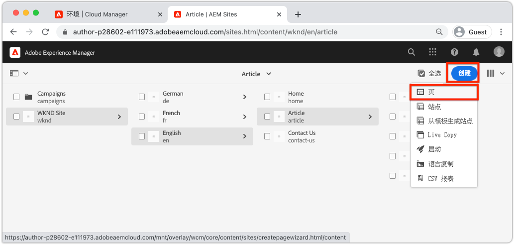

   这将显示&#x200B;**创建页面**&#x200B;向导。

1. 选择&#x200B;**文章页**&#x200B;模板，然后单击&#x200B;**下一步**。

   AEM中的页面是根据页面模板创建的。 在[页面模板](page-templates.md)章节中详细探讨了页面模板。

1. 在&#x200B;**属性**&#x200B;下，输入“Hello World”的&#x200B;**标题**。
1. 将&#x200B;**Name**&#x200B;设置为`hello-world`并单击&#x200B;**创建**。

   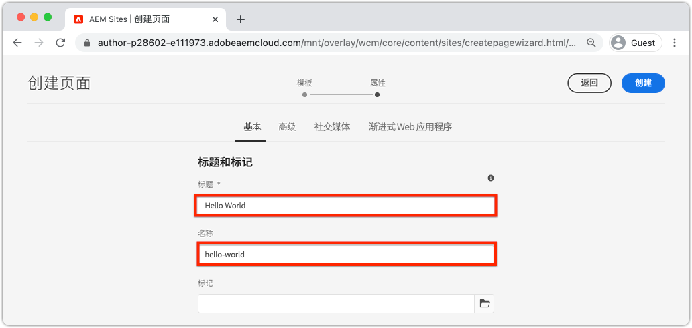

1. 在对话框弹出窗口中，单击&#x200B;**打开**&#x200B;以打开新创建的页面。

## 创作组件 {#author-component}

可以将AEM组件视为网页的小型模块化构建基块。 通过将UI分成逻辑块或组件，可以使其更易于管理。 要重用组件，必须对组件进行配置。 这是通过创作对话框实现的。

AEM提供一组[已生产就绪的核心组件](https://experienceleague.adobe.com/docs/experience-manager-core-components/using/introduction.html?lang=zh-Hans)。 **核心组件**&#x200B;的范围从基本元素（如[Text](https://experienceleague.adobe.com/docs/experience-manager-core-components/using/components/text.html)和[Image](https://experienceleague.adobe.com/docs/experience-manager-core-components/using/components/image.html)）到更复杂的UI元素（如[轮播](https://experienceleague.adobe.com/docs/experience-manager-core-components/using/components/carousel.html)）。

接下来，使用AEM页面编辑器创作一些组件。

1. 导航到上一个练习中创建的&#x200B;**Hello World**&#x200B;页面。
1. 确保您处于&#x200B;**编辑**&#x200B;模式并在左边栏中单击&#x200B;**组件**&#x200B;图标。

   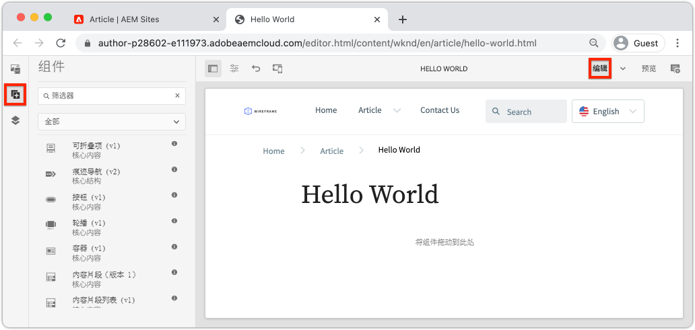

   这将打开组件库，并列出可在页面上使用的可用组件。

1. 向下滚动并将&#x200B;**文本(v2)**&#x200B;组件&#x200B;**拖放**&#x200B;到页面的主要可编辑区域。

   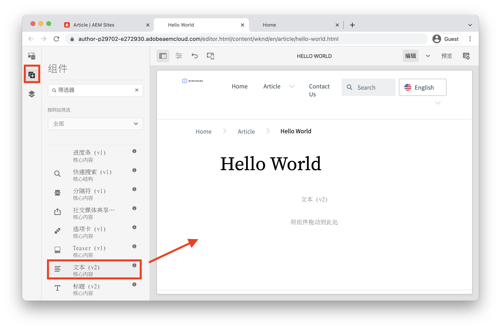

1. 单击要突出显示的&#x200B;**文本**&#x200B;组件，然后单击&#x200B;**扳手**&#x200B;图标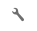以打开该组件的对话框。 输入一些文本并将更改保存到对话框。

   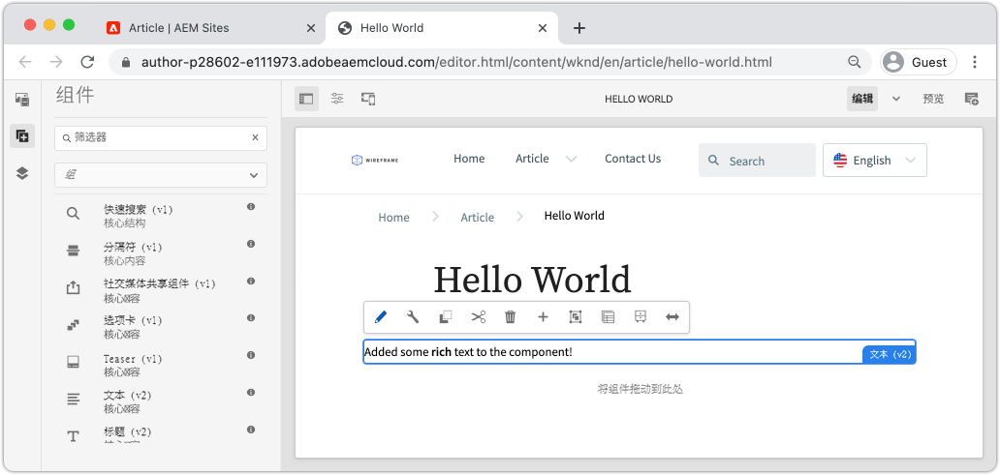

   **Text**&#x200B;组件现在应在页面上显示富文本。

1. 重复上述步骤，但将&#x200B;**Image(v2)**&#x200B;组件的实例拖动到页面上除外。 打开&#x200B;**图像**&#x200B;组件的对话框。

1. 在左边栏中，通过单击&#x200B;**Assets**&#x200B;图标切换到&#x200B;**资产查找器**。
1. **将图像拖放到组件的对话框中**，然后单击&#x200B;**完成**&#x200B;以保存更改。

   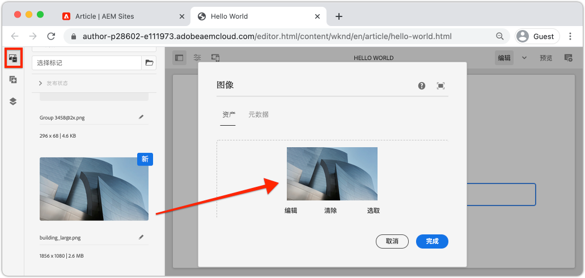

1. 请注意，页面上存在已修复的组件，如&#x200B;**标题**、**导航**、**搜索**。 这些区域配置为页面模板的一部分，无法在单个页面上修改。 下一章将对此进行详细探讨。

您可以随意尝试一些其他组件。 可在此处](https://experienceleague.adobe.com/docs/experience-manager-core-components/using/introduction.html?lang=zh-Hans)找到有关每个[核心组件的文档。 您可以在此处](https://experienceleague.adobe.com/docs/experience-manager-learn/sites/page-authoring/aem-sites-authoring-overview.html)找到有关[页面创作的详细视频系列。

## Publish更新 {#publish-updates}

AEM环境在&#x200B;**创作服务**&#x200B;和&#x200B;**Publish服务**&#x200B;之间拆分。 在本章中，我们对&#x200B;**作者服务**&#x200B;上的站点进行了多次修改。 为了让网站访客查看更改，我们需要将它们发布到&#x200B;**Publish服务**。

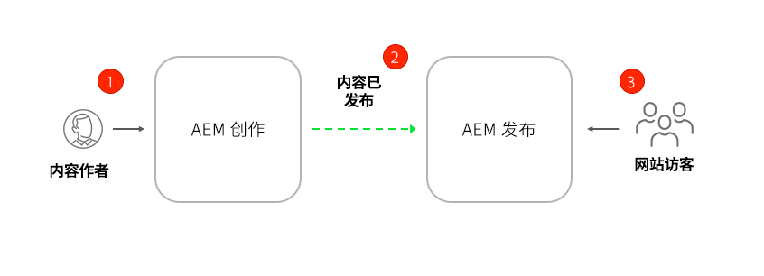

*从创作到Publish的高层内容流*

**1。**&#x200B;内容作者对网站内容进行了更新。 可以预览、审核和批准更新以将其推送到实时。

**2。**&#x200B;内容已发布。 可按需执行发布或计划在将来日期发布。

**3。**&#x200B;网站访客将看到更改反映在Publish服务中。

### Publish更改

接下来，让我们发布更改。

1. 从AEM开始屏幕导航到&#x200B;**站点**&#x200B;并选择&#x200B;**WKND站点**。
1. 单击菜单栏中的&#x200B;**管理发布**。

   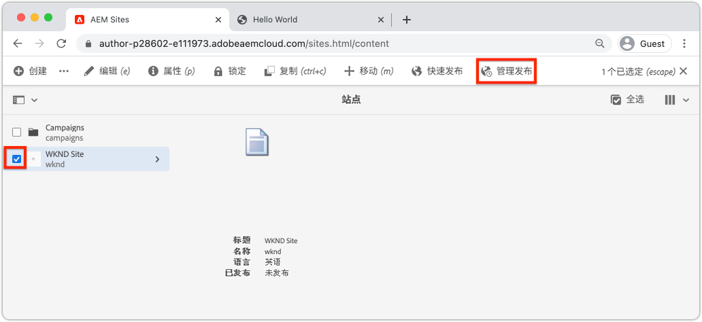

   由于这是一个全新的网站，因此我们希望发布所有页面，并且可以使用管理发布向导来定义需要发布的确切内容。

1. 在&#x200B;**选项**&#x200B;下，将默认设置保留为&#x200B;**Publish**，并将其计划为&#x200B;**立即**。 单击&#x200B;**下一步**。
1. 在&#x200B;**作用域**&#x200B;下，选择&#x200B;**WKND站点**，然后单击&#x200B;**包括子设置**。 在对话框中，选中&#x200B;**包括子项**。 取消选中其余框以确保发布整个站点。

   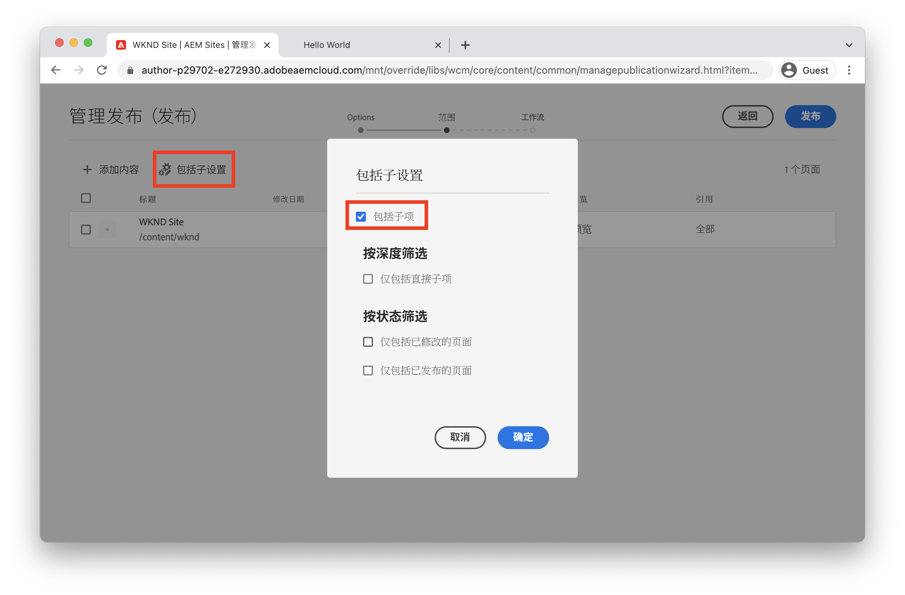

1. 单击&#x200B;**已发布引用**&#x200B;按钮。 在对话框中，验证是否已选中所有内容。 这将包括&#x200B;**标准站点模板**&#x200B;和站点模板生成的多个配置。 单击&#x200B;**完成**&#x200B;以进行更新。

   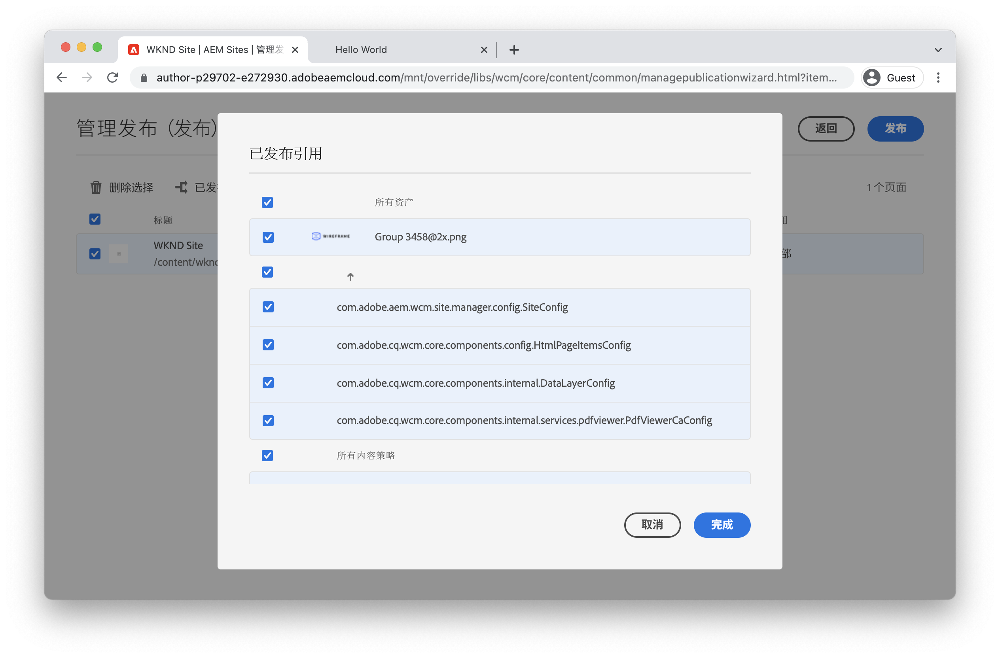

1. 最后，选中&#x200B;**WKND站点**&#x200B;旁边的框并单击右上角的&#x200B;**下一步**。
1. 在&#x200B;**工作流**&#x200B;步骤中，输入&#x200B;**工作流标题**。 这可以是任何文本，并且以后作为审核跟踪的一部分将会很有用。 输入“初始发布”并单击&#x200B;**Publish**。

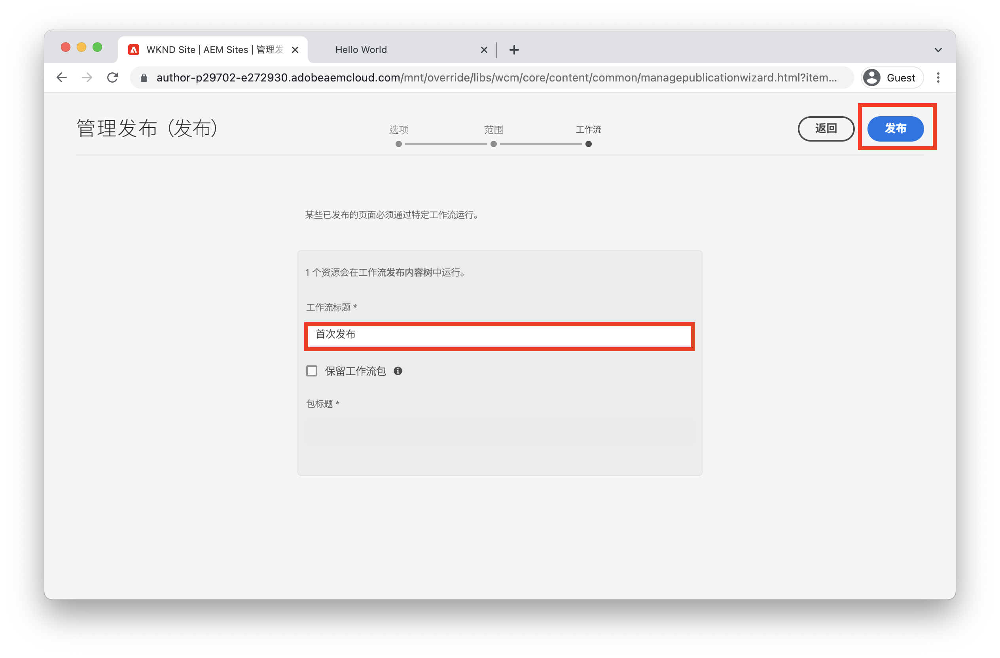

## 查看已发布的内容 {#publish}

接下来，导航到Publish服务以查看更改。

1. 获取Publish服务URL的简单方法是复制创作URL并将`author`字替换为`publish`。 例如：

   * **作者URL** - `https://author-pYYYY-eXXXX.adobeaemcloud.com/`
   * **Publish URL** - `https://publish-pYYYY-eXXXX.adobeaemcloud.com/`

1. 将`/content/wknd.html`添加到Publish URL，以便最终URL类似于： `https://publish-pYYYY-eXXXX.adobeaemcloud.com/content/wknd.html`。

   >[!NOTE]
   >
   > 更改`wknd.html`以匹配您的网站名称（如果您在[网站创建](create-site.md)期间提供了唯一的名称）。

1. 导航到Publish URL时，您应该会看到站点，而无需使用任何AEM创作功能。

   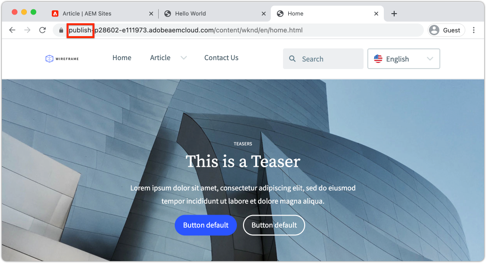

1. 使用&#x200B;**导航**&#x200B;菜单，单击&#x200B;**文章** > **Hello World**&#x200B;以导航到之前创建的Hello World页面。
1. 返回&#x200B;**AEM创作服务**，并在页面编辑器中进行一些其他内容更改。
1. 通过单击&#x200B;**页面属性**&#x200B;图标> **Publish页面**，直接从页面编辑器中Publish这些更改

   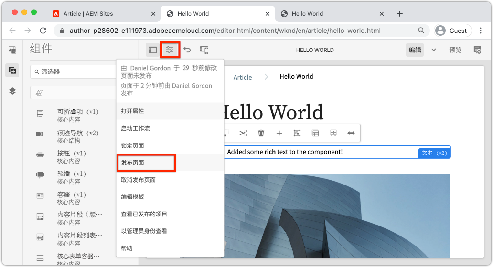

1. 返回&#x200B;**AEM Publish服务**&#x200B;以查看更改。 您很可能&#x200B;**不会**&#x200B;立即看到更新。 这是因为&#x200B;**AEM Publish服务**&#x200B;包括通过Apache Web服务器和CDN的[缓存](https://experienceleague.adobe.com/docs/experience-manager-cloud-service/implementing/content-delivery/caching.html)。 默认情况下，HTML内容的缓存时间约为5分钟。

1. 要绕过缓存以进行测试/调试，只需添加一个查询参数，如`?nocache=true`。 URL类似于`https://publish-pYYYY-eXXXX.adobeaemcloud.com/content/wknd/en/article/hello-world.html?nocache=true`。 有关可用的缓存策略和配置的更多详细信息[可在此处](https://experienceleague.adobe.com/docs/experience-manager-cloud-service/implementing/content-delivery/overview.html)找到。

1. 您还可以在Cloud Manager中找到指向Publish服务的URL。 导航到&#x200B;**Cloud Manager计划** > **环境** > **环境**。

   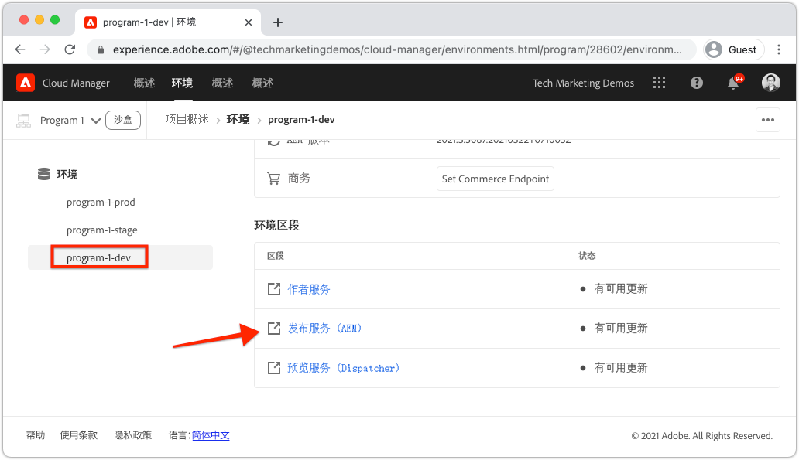

   在&#x200B;**环境区段**&#x200B;下，您可以找到指向&#x200B;**作者**&#x200B;和&#x200B;**Publish**&#x200B;服务的链接。

## 恭喜！ {#congratulations}

恭喜，您刚才已创作并发布对AEM站点的更改！

### 后续步骤 {#next-steps}

在现实实施中，通常在创建站点之前规划具有模型和UI设计的站点。 了解如何使用Adobe XD UI包在[使用Adobe XD进行UI规划](./ui-planning-adobe-xd.md)时设计和加速Adobe Experience Manager Sites实施。

想要继续探索AEM Sites的功能？ 请随时跳转到[页面模板](./page-templates.md)上的章节，以了解页面模板与页面之间的关系。

