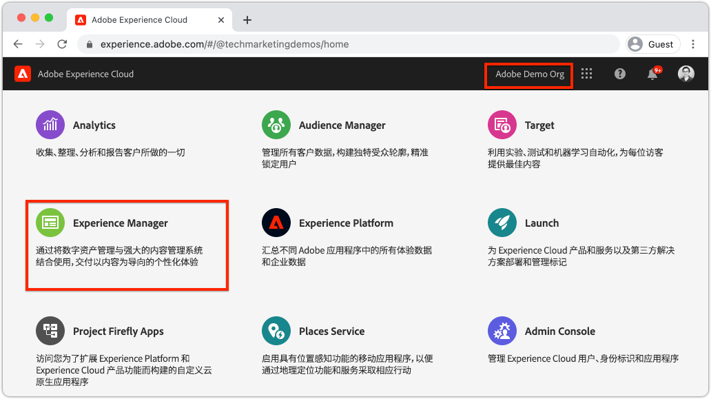
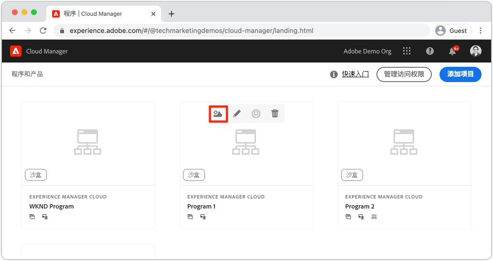
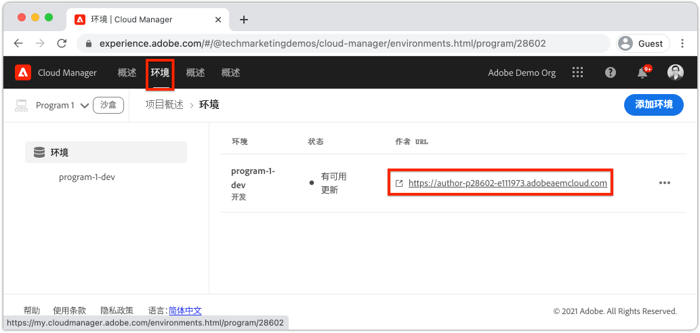
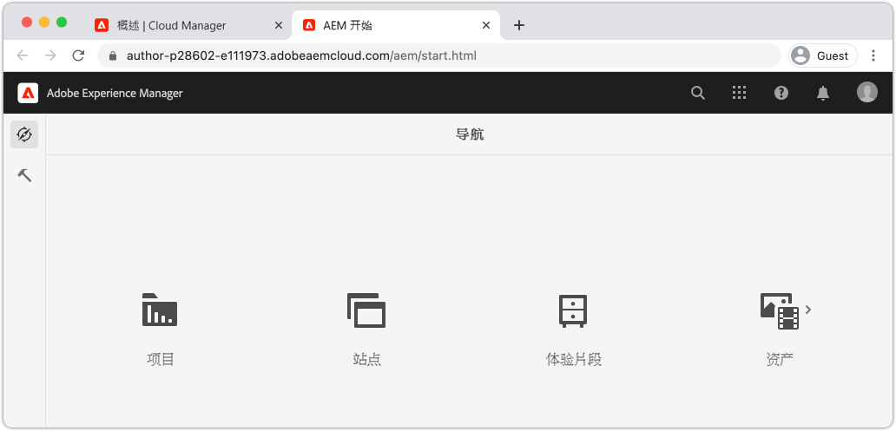
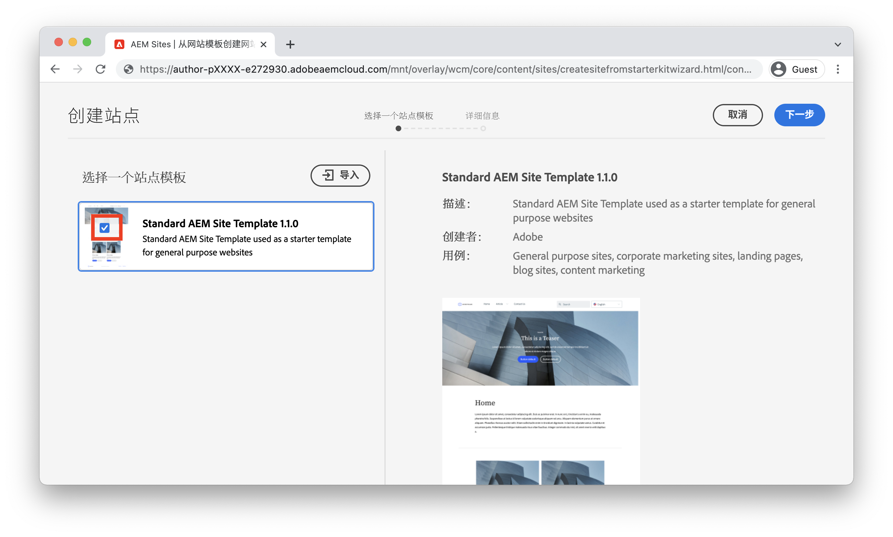
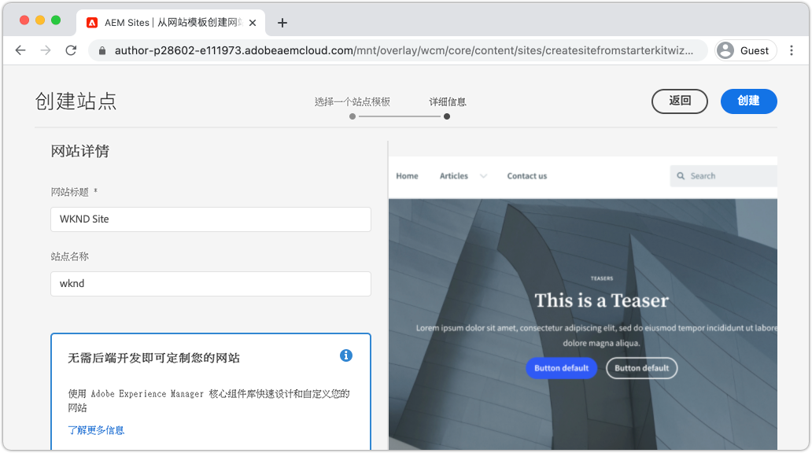
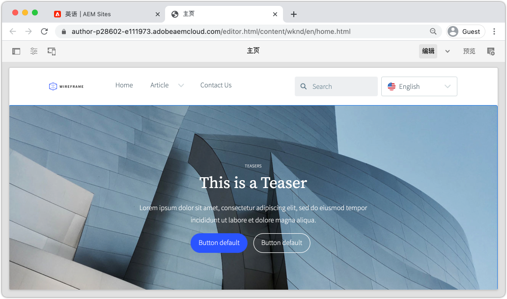

# 创建站点 {#create-site}

作为快速站点创建的一部分，请使用Adobe Experience Manager AEM中的“站点创建向导”来生成新网站。 由Adobe提供的标准站点模板用作新站点的起点。

## 前提条件 {#prerequisites}

本章中的步骤将在Adobe Experience Manager as a Cloud Service环境中进行。 确保您对AEM环境具有管理访问权限。 建议使用 [沙盒程序](https://experienceleague.adobe.com/docs/experience-manager-cloud-service/onboarding/getting-access/sandbox-programs/introduction-sandbox-programs.html) 和 [开发环境](https://experienceleague.adobe.com/docs/experience-manager-cloud-service/implementing/using-cloud-manager/manage-environments.html) 完成本教程时。

[生产程序](https://experienceleague.adobe.com/docs/experience-manager-cloud-service/content/implementing/using-cloud-manager/programs/introduction-production-programs.html) 环境也可以用于本教程；但是，请确保本教程的活动不会影响在目标环境中执行的工作，因为本教程会将内容和代码部署到目标AEM环境。

此 [AEM SDK](https://experienceleague.adobe.com/docs/experience-manager-learn/cloud-service/local-development-environment-set-up/aem-runtime.html) 可用于本教程的部分内容。 本教程依赖云服务的各个方面，例如 [使用Cloud Manager的前端管道部署主题](https://experienceleague.adobe.com/docs/experience-manager-learn/getting-started-wknd-tutorial-develop/site-template/theming.html)无法在AEM SDK上执行。

查看 [入门文档](https://experienceleague.adobe.com/docs/experience-manager-cloud-service/onboarding/home.html) 以了解更多详细信息。

## 目标 {#objective}

1. 了解如何使用站点创建向导生成新站点。
1. 了解站点模板的作用。
1. 浏览生成的AEM站点。

## 登录Adobe Experience Manager Author {#author}

第一步，登录到您的AEMas a Cloud Service环境。 AEM环境在 **作者服务** 和 **发布服务**.

* **作者服务**  — 在其中创建、管理和更新站点内容。 通常只有内部用户可以访问 **作者服务** 并且位于登录屏幕后面。
* **发布服务**  — 托管实时网站。 这是最终用户将看到的服务，通常公开可用。

大部分教程将使用 **作者服务**.

1. 导航到Adobe Experience Cloud [https://experience.adobe.com/](https://experience.adobe.com/). 使用您的个人帐户或公司/学校帐户登录。
1. 确保在菜单中选择正确的组织，然后单击 **Experience Manager**.

   

1. 下 **Cloud Manager** 单击 **Launch**.
1. 将鼠标悬停在要使用的程序上，然后单击 **Cloud Manager项目** 图标。

   

1. 在顶部菜单中，单击 **环境** 以查看已设置的环境。

1. 找到要使用的环境，然后单击 **作者URL**.

   

   >[!NOTE]
   >
   >建议使用 **开发** 环境。

1. 新选项卡将启动到AEM **作者服务**. 单击 **使用Adobe登录** 并且您应该使用相同的Experience Cloud凭据自动登录。

1. 在重定向并验证之后，您现在应该会看到AEM开始屏幕。

   

>[!NOTE]
>
> 访问Experience Manager时遇到问题？ 查看 [入门文档](https://experienceleague.adobe.com/docs/experience-manager-cloud-service/onboarding/home.html)

## 下载基本站点模板

站点模板为新站点提供起点。 站点模板包括一些基本主题、页面模板、配置和示例内容。 确切地说，站点模板中包含的内容取决于开发人员。 Adobe提供 **基本站点模板** 以加速新的实施。

1. 打开新的浏览器选项卡，并导航到GitHub上的基本站点模板项目： [https://github.com/adobe/aem-site-template-standard](https://github.com/adobe/aem-site-template-standard). 该项目是开放源码的，并许可任何人使用。
1. 单击 **版本** 并导航至 [最新版本](https://github.com/adobe/aem-site-template-standard/releases/latest).
1. 展开 **资产** 下拉菜单并下载模板zip文件：

   

   此zip文件将在下一个练习中使用。

   >[!NOTE]
   >
   > 本教程使用版本编写 **1.1.0** 基本站点模板的。 在启动新项目以供生产使用时，始终建议使用最新版本。

## 创建新站点

接下来，使用上一个练习中的站点模板生成新站点。

1. 返回到AEM环境。 从AEM开始屏幕导航到 **站点**.
1. 在右上角，单击 **创建** > **站点（模板）**. 这将显示 **创建站点向导**.
1. 下 **选择站点模板** 单击 **导入** 按钮。

   上传 **.zip** 从上一个练习下载的模板文件。

1. 选择 **基本AEM站点模板** 并单击 **下一个**.

   

1. 下 **网站详细信息** > **网站标题** 进入 `WKND Site`.

   在现实实施中，“WKND站点”将由您公司或组织的品牌名称替代。 在本教程中，我们模拟为一个虚构的生活方式品牌“WKND”创建站点。

1. 下 **站点名称** 进入 `wknd`.

   

   >[!NOTE]
   >
   > 如果使用共享AEM环境，请将唯一标识符附加到 **站点名称**. 例如 `wknd-site-johndoe`. 这将确保多个用户可以完成相同的教程，而不会产生任何冲突。

1. 单击 **创建** 以生成站点。 单击 **完成** 在 **成功** AEM对话框。

## 浏览新站点

1. 导航到AEM Sites控制台（如果尚未找到）。
1. 新 **WKND站点** 已生成。 它将包含一个具有多语言层次结构的站点结构。
1. 打开 **英语** > **主页** 选择页面并单击 **编辑** 菜单栏中的按钮：

   

1. 已创建入门内容，并且有多个组件可供添加到页面中。 尝试这些组件以了解其功能。 您将在下一章中学习组件的基础知识。

   

   *站点模板提供的示例内容*

## 恭喜！ {#congratulations}

恭喜，您刚刚创建了您的第一个AEM站点！

### 后续步骤 {#next-steps}

使用Adobe Experience Manager AEM中的页面编辑器，在中更新网站内容 [创作内容和发布](author-content-publish.md) 章节。 了解如何配置原子组件以更新内容。 了解AEM创作环境和发布环境之间的区别，并了解如何将更新发布到活动站点。
