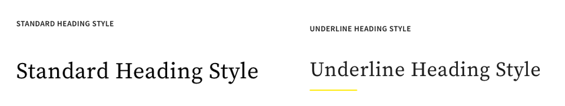
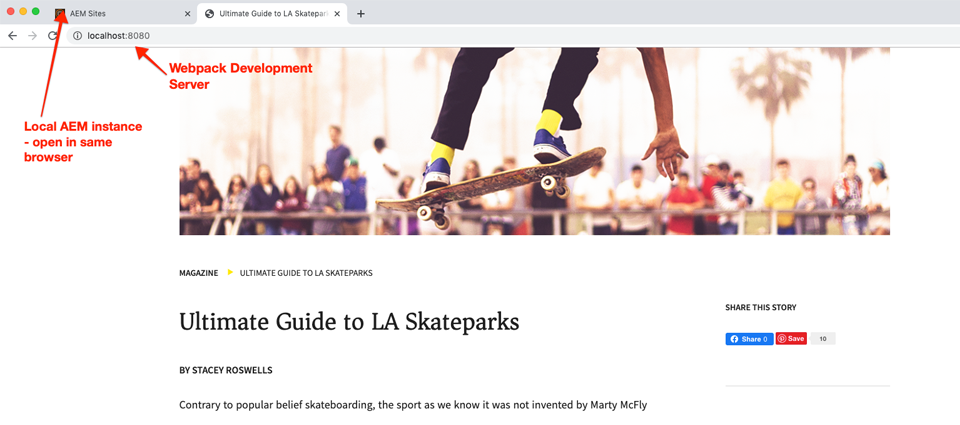
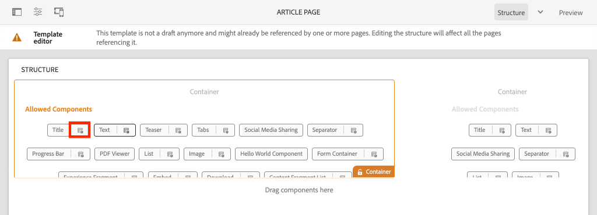
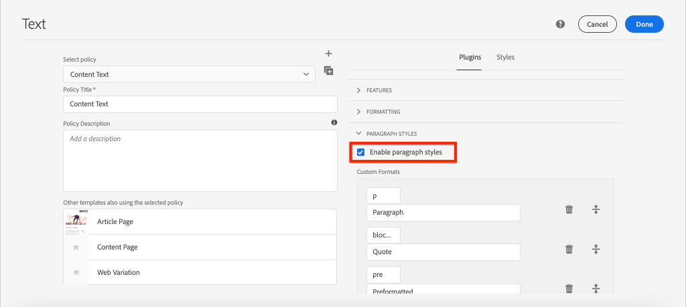

# 以风格体系发展 {#developing-with-the-style-system}

了解如何使用Experience Manager的样式系统实施个别样式并重复使用核心组件。 本教程涵盖为样式系统进行开发，以使用模板编辑器的品牌特定CSS和高级策略配置扩展核心组件。

## 前提条件 {#prerequisites}

查看设置本地开发环境所需的工 [具和说明](overview.md#local-dev-environment)。

此外，还建议阅读客 [户端库和前端工作流教程](client-side-libraries.md) ，以了解客户端库的基础知识以及AEM项目中内置的各种前端工具。

### 入门项目

查看教程构建的基线代码：

1. 克隆 [github.com/adobe/aem-guides-wknd](https://github.com/adobe/aem-guides-wknd) repository。
1. 检查分 `style-system/start` 支

   ```shell
   $ git clone git@github.com:adobe/aem-guides-wknd.git ~/code/aem-guides-wknd
   $ cd ~/code/aem-guides-wknd
   $ git checkout style-system/start
   ```

1. 使用Maven技能将代码库部署到本地AEM实例：

   ```shell
   $ cd ~/code/aem-guides-wknd
   $ mvn clean install -PautoInstallSinglePackage
   ```

您始终可以在GitHub上视图完 [成的代码](https://github.com/adobe/aem-guides-wknd/tree/style-system/solution) ，或通过切换到分支在本地签出代码 `style-system/solution`。

## 目标

1. 了解如何使用样式系统将特定于品牌的CSS应用于AEM核心组件。
1. 了解BEM记号以及如何用它仔细调整样式范围。
1. 使用可编辑模板应用高级策略配置。

## 您将构建的内容 {#what-you-will-build}

在本章中，我们将使用样 [式系统功能](https://docs.adobe.com/content/help/en/experience-manager-learn/sites/page-authoring/style-system-feature-video-use.html) ，创建文章页面上使用的多个组件变体。 我们还将使用样式系统为结构元素(如Header/Footer和布局容器)创建变体。

>[!VIDEO](https://video.tv.adobe.com/v/30386/?quality=12&learn=on)

## 背景 {#background}

样式 [系统允许](https://docs.adobe.com/content/help/en/experience-manager-65/developing/components/style-system.html) ，开发人员和模板编辑器创建组件的多个可视化变量。 然后，作者可决定在编写页面时使用哪种样式。 在教程的其余部分，我们将利用Style System来实现几种独特的样式，同时采用低代码方法来利用核心组件。

样式系统的一般思想是作者可以选择组件外观的各种样式。 “样式”由注入到组件外div中的其他CSS类作为后盾。 在客户端库中，会根据这些样式类添加CSS规则，以便组件更改外观。

您可以在此 [处找到样式系统的详细文档](https://docs.adobe.com/content/help/en/experience-manager-65/developing/components/style-system.html)。 此外，还有一个用于 [了解Style System的绝佳技术视频](https://docs.adobe.com/content/help/en/experience-manager-learn/sites/developing/style-system-technical-video-understand.html)。

## 标题组件样式 {#title-component}

此时，标 [题组件](https://docs.adobe.com/content/help/en/experience-manager-core-components/using/components/title.html) (作为ui.apps模块的一 `/apps/wknd/components/content/title` 部分)已 **代理到项目中** 。 “标题”元素的`H1`默认 `H2`样式( `H3`、、...)已在文件下 **的ui.frontend** 模块中实 `_elements.scss` 现 `ui.frontend/src/main/webpack/base/sass/_elements.scss`。

### 下划线样式

WKND [文章设计包含](assets/pages-templates/wknd-article-design.xd) “标题”组件的独特样式，并带有下划线。 样式系统可用于允许作者添加下划线样式，而不是创建两个组件或修改组件对话框。



### Inspect标题组件标记

作为前端开发者，设计核心组件样式的第一步是了解组件生成的标记。

作为生成项目的一部分，原型嵌入式核 **心组件示例项目** 。 对于开发人员和内容作者而言，此文档包含一个简单的参考，用于了解核心组件提供的所有功能。 还提供实时 [版本](https://opensource.adobe.com/aem-core-wcm-components/library.html)。

1. 打开新浏览器并视图标题组件：

   本地AEM实例： [http://localhost:4502/editor.html/content/core-components-examples/library/title.html](http://localhost:4502/editor.html/content/core-components-examples/library/title.html)

   实时示例： [https://opensource.adobe.com/aem-core-wcm-components/library/title.html](https://opensource.adobe.com/aem-core-wcm-components/library/title.html)

1. 以下是标题组件的标记：

   ```html
   <div class="cmp-title">
       <h1 class="cmp-title__text">Lorem Ipsum</h1>
   </div>
   ```

   标题组件的BEM记号：

   ```plain
   BLOCK cmp-title
       ELEMENT cmp-title__text
   ```

1. 样式系统将CSS类添加到组件周围的外div中。 因此，我们要定位的标记将类似于以下内容：

   ```html
   <div class="STYLE-SYSTEM-CLASS-HERE"> <!-- Custom CSS class - implementation gets to define this -->
       <div class="cmp-title">
           <h1 class="cmp-title__text">Lorem Ipsum</h1>
       </div>
   </div>
   ```

### 实施下划线样式- ui.frontend

接下来，我们将使用我们项目的ui. **frontend模块** ，实施下划线样式。 在部署到AEM的本地实例之前，我们将使用与 **ui.frontend** 模块绑定的 *webpack开发服* 务器来预览样式。

1. 从ui.frontend模块中运行以下命令开始webpack **dev服务器** :

   ```shell
   $ cd ~/code/aem-guides-wknd/ui.frontend/
   $ npm start
   
   > aem-maven-archetype@1.0.0 start code/aem-guides-wknd/ui.frontend
   > webpack-dev-server --open --config ./webpack.dev.js
   ```

   这应打开位于http://localhost:8080的浏 [览器](http://localhost:8080)。

   >[!NOTE]
   >
   > 如果映像出现中断，请确保启动项目已部署到AEM的本地实例（在端口4502上运行），且使用的浏览器也已登录到本地AEM实例。

   

1. 在Eclipse或您选择的IDE中，打开位于以下位置 `index.html` 的文件： `ui.frontend/src/main/webpack/static/index.html`. 这是Webpack开发服务器使用的静态标记。
1. 在 `index.html` 查找标题组件的实例中，通过搜索cmp-title文档向添加下划线 *样式*。 选择标题组件，其中 *文本为“Vans oft the Wall Skatepark* ”（第218行）。 将类添 `cmp-title--underline` 加到周围的div:

   ```html
    <!-- before -->
    <div class="title aem-GridColumn aem-GridColumn--default--8">
        <div class="cmp-title">
            <h2 class="cmp-title__text">Vans off the Wall Skatepark</h2>
        </div>
    </div>
   ```

   ```html
    <!-- After -->
    <div class="cmp-title--underline title aem-GridColumn aem-GridColumn--default--8">
        <div class="cmp-title">
            <h2 class="cmp-title__text">Vans off the Wall Skatepark</h2>
        </div>
    </div>
   ```

1. 返回浏览器并验证标记中是否反映了额外的类。
1. 返回ui. **frontend模块** ，并更新位于以下位置 `title.scss` 的文件： `ui.frontend/src/main/webpack/components/content/title/scss/title.scss`:

   ```css
   /* Add Title Underline Style */
   .cmp-title--underline {
   
       .cmp-title {
       }
   
       .cmp-title__text {
           &:after {
           display: block;
               width: 84px;
               padding-top: 8px;
               content: '';
               border-bottom: 2px solid $brand-primary;
           }
       }
   }
   ```

   >[!NOTE]
   >
   >始终将样式严格限制到目标组件，这被认为是一种最佳实践。 这可确保额外样式不会影响页面的其他区域。
   >
   >所有核心组件都遵循 **[BEM记法](https://github.com/adobe/aem-core-wcm-components/wiki/css-coding-conventions)**。 为组件创建默认样式时，最好目标外部CSS类。 另一种最佳做法是目标核心组件边界元记号（而非HTML元素）指定的类名。

1. 再次返回浏览器，您应该看到添加了下划线样式：

   

1. 停止Webpack开发服务器。

### 添加标题策略

接下来，我们需要为标题组件添加新策略，以允许内容作者选择下划线样式以应用于特定组件。 这是使用AEM中的模板编辑器完成的。

1. 使用Maven技能将代码库部署到本地AEM实例：

   ```shell
   $ cd ~/code/aem-guides-wknd
   $ mvn clean install -PautoInstallSinglePackage
   ```

1. 导航到位 **于的文章页面** 模板： [http://localhost:4502/editor.html/conf/wknd/settings/wcm/templates/article-page-template/structure.html](http://localhost:4502/editor.html/conf/wknd/settings/wcm/templates/article-page-template/structure.html)。

1. 在“ **结构** ”模式中，在主“布局” **容器中**，选择“允许的组件”下 **列出的“标** 题”组件旁边的“ ******&#x200B;策略”图标：

   

1. 为标题组件创建具有以下值的新策略：

   *策略标题**: **WKND标题**

   *“属性* ”>“ *样式”选项卡* >“ *添加新样式”*

   **下划线** : `cmp-title--underline`

   

   单击 **完成** ，以保存对标题策略所做的更改。

   >[!NOTE]
   >
   > 该值与 `cmp-title--underline` 我们在ui.frontend模块中开发时之前定 **向的CSS类匹配** 。

### 应用下划线样式

最后，作为作者，我们可以选择将下划线样式应用于某些标题组件。

1. 在以下网 **站导航至La** Skateparks文章： [http://localhost:4502/editor.html/content/wknd/us/en/magazine/guide-la-skateparks.html](http://localhost:4502/editor.html/content/wknd/us/en/magazine/guide-la-skateparks.html)
1. 在“ **编辑** ”模式下，选择标题组件。 单击画笔 **图标** ，然后选择“下划线 **样式** ”:

   

   作为作者，您应该能够打开／关闭样式。

1. 单击页 **面信息图** 标>发 **布时视图** ，以检查AEM编辑器外的页面。

   

   使用浏览器开发人员工具验证标题组件周围的标记是否将CSS类 `cmp-title--underline` 应用于外部div。

## 文本组件样式 {#text-component}

接下来，我们将重复类似步骤，以对文本组件应用唯 [一样式](https://docs.adobe.com/content/help/en/experience-manager-core-components/using/components/text.html)。 文本组件已代理到ui.apps模 `/apps/wknd/components/content/text` 块下的 **项目中** 。 段落元素的默认样式已在文件下 **的ui.frontend** 模块中 `_elements.scss` 实现 `ui.frontend/src/main/webpack/base/sass/_elements.scss`。

### 引号块样式

WKND [文章设计包含](assets/pages-templates/wknd-article-design.xd) 带有引号块的文本组件的唯一样式：


### Inspect文本组件标记

我们将再次检查文本组件的标记。

1. 打开新的浏览器并将文本组件作为核心组件库的一部分进行视图:本地AEM实例： [http://localhost:4502/editor.html/content/core-components-examples/library/text.html](http://localhost:4502/editor.html/content/core-components-examples/library/text.html)

   实时示例： [https://opensource.adobe.com/aem-core-wcm-components/library/text.html](https://opensource.adobe.com/aem-core-wcm-components/library/text.html)

1. 下面是文本组件的标记：

   ```html
   <div class="cmp-text">
       <p><b>Bold </b>can be used to emphasize a word or phrase, as can <u>underline</u> and <i>italics.&nbsp;</i><sup>Superscript</sup> and <sub>subscript</sub> are useful for mathematical (E = mc<sup>2</sup>) or scientific (h<sub>2</sub>O) expressions. Paragraph styles can provide alternative renderings, such as quote sections:</p>
       <blockquote>"<i>Be yourself; everyone else is already taken"</i></blockquote>
       <b>- Oscar Wilde</b>
   </div>
   ```

   标题组件的BEM记号：

   ```plain
   BLOCK cmp-text
       ELEMENT
   ```

1. 样式系统将CSS类添加到组件周围的外div中。 因此，我们要定位的标记将类似于以下内容：

   ```html
   <div class="STYLE-SYSTEM-CLASS-HERE"> <!-- Custom CSS class - implementation gets to define this -->
       <div class="cmp-text">
           <p><b>Bold </b>can be used to emphasize a word or phrase, as can <u>underline</u> and <i>italics.&nbsp;</i><sup>Superscript</sup> and <sub>subscript</sub> are useful for mathematical (E = mc<sup>2</sup>) or scientific (h<sub>2</sub>O) expressions. Paragraph styles can provide alternative renderings, such as quote sections:</p>
           <blockquote>"<i>Be yourself; everyone else is already taken"</i></blockquote>
           <b>- Oscar Wilde</b>
       </div>
   </div>
   ```

### 实施报价块样式- ui.frontend

接下来，我们将使用我们项目的ui. **frontend模块** ，实施报价块样式。

1. 从ui.frontend模块中运行以下命令开始webpack **dev服务器** :

   ```shell
   $ cd ~/code/aem-guides-wknd/ui.frontend/
   $ npm start
   
   > aem-maven-archetype@1.0.0 start code/aem-guides-wknd/ui.frontend
   > webpack-dev-server --open --config ./webpack.dev.js
   ```

1. 在Eclipse或您选择的IDE中，打开位于以下位置 `index.html` 的文件： `ui.frontend/src/main/webpack/static/index.html`. 这是Webpack开发服务器使用的静态标记。
1. 通过 `index.html` 搜索文本“Jacob Wester”（第210行） *来查找文本* 组件的实例。 将类添 `cmp-text--quote` 加到周围的div:

   ```html
    <!-- before -->
    <div class="text aem-GridColumn aem-GridColumn--default--8">
        <div class="cmp-text">
            <blockquote>"There is no better place to shred then Los Angeles"</blockquote>
            <p>Jacob Wester - Pro Skater</p>
        </div>
    </div>
   ```

   ```html
    <!-- After -->
    <div class="cmp-text--quote text aem-GridColumn aem-GridColumn--default--8">
        <div class="cmp-text">
            <blockquote>"There is no better place to shred then Los Angeles"</blockquote>
            <p>Jacob Wester - Pro Skater</p>
        </div>
    </div>
   ```

1. 返回浏览器并验证标记中是否反映了额外的类。
1. 返回ui. **frontend模块** ，并更新位于以下位置 `text.scss` 的文件： `ui.frontend/src/main/webpack/components/content/text/scss/text.scss`:

   ```css
   /* WKND Text Quote style */
   
   .cmp-text--quote {
   
       .cmp-text {
           background-color: $brand-third;
           margin: 1em 0em;
           padding: 1em;
   
           blockquote {
               border: none;
               font-size: $font-size-h2;
               font-family: $font-family-serif;
               padding: 14px 14px;
               margin: 0;
               margin-bottom: 0.5em;
   
               &:after {
                   border-bottom: 2px solid $brand-primary; /*yellow border */
                   content: '';
                   display: block;
                   position: relative;
                   top: 0.25em;
                   width: 80px;
               }
           }
   
           p {
               font-size:    $font-size-large;
               font-family:  $font-family-serif;
           }
       }
   }
   ```

   >[!CAUTION]
   >
   > 在这种情况下，原始HTML元素将按样式进行定位。 这是因为文本组件为内容作者提供富文本编辑器。 应谨慎地针对RTE内容直接创建样式，更重要的是要严格地调整样式范围。

1. 再次返回浏览器，您应会看到添加了引号块样式：

   

1. 停止Webpack开发服务器。

### 添加文本策略

然后为文本组件添加新策略。

1. 使用Maven技能将代码库部署到本地AEM实例：

   ```shell
   $ cd ~/code/aem-guides-wknd
   $ mvn clean install -PautoInstallSinglePackage
   ```

1. 导航到位 **于的文章页面** 模板： [http://localhost:4502/editor.html/conf/wknd/settings/wcm/templates/article-page-template/structure.html](http://localhost:4502/editor.html/conf/wknd/settings/wcm/templates/article-page-template/structure.html)。

1. 在“ **结构** ”模式中，在主“布局” **容器中**，选择“允许的文本组件”下 **列出的“** 策略”图标(位 ******&#x200B;于“允许的文本组件”下):

   

1. 为具有以下值的文本组件创建新策略：

   *策略标题**: **WKND文本**

   *插件* >段 *落样式* >启 *用段落样式*

   *“样式”选项卡* > *添加新样式*

   **报价块** : `cmp-text--quote`

   

   

   单击 **完成** ，以保存对文本策略所做的更改。

### 应用引号块样式

1. 在以下网 **站导航至La** Skateparks文章： [http://localhost:4502/editor.html/content/wknd/us/en/magazine/guide-la-skateparks.html](http://localhost:4502/editor.html/content/wknd/us/en/magazine/guide-la-skateparks.html)
1. 在编 **辑模** 式中，选择一个文本组件。 编辑组件以包含报价元素：

   

1. 选择文本组件，单击画笔 **图标** ，然后选择“引 **号块样式** ”:

   

   作为作者，您应该能够打开／关闭样式。

## 布局容器 {#layout-container}

布局容器已用于创建文章页面模板的基本结构，并为内容作者提供拖放区域以在页面上添加内容。 布局容器还可以利用样式系统，为内容作者提供更多布局设计选项。

当前，CSS规则应用于整个页面，强制使用固定宽度。 相反，更灵活的方法是创建内容作 **者可以打开** /关闭的固定宽度样式。

### 实施固定宽度样式- ui.frontend

我们将开始在项目的ui. **frontend模块中实** 施固定宽度样式。

1. 从ui.frontend模块中运行以下命令开始webpack **dev服务器** :

   ```shell
   $ cd ~/code/aem-guides-wknd/ui.frontend/
   $ npm start
   ```

1. 打开位于 `index.html` 的文件： `ui.frontend/src/main/webpack/static/index.html`.
1. 我们希望使文章页面模板的正文宽度固定，使页眉和页脚可自由扩展。 因此，我们希望在两个体验片 `<div class='responsivegrid aem-GridColumn aem-GridColumn--default--12'` 段之间目标第2个(布局容器)（第136行）

   

1. 将类添 `cmp-layout-container--fixed` 加到上 `div` 一步骤中标识的。

   ```html
   <!-- Experience Fragment Header -->
   <div class="experiencefragment aem-GridColumn aem-GridColumn--default--12">
       ...
   </div>
   <!-- Main body Layout Container -->
   <div class="responsivegrid cmp-layout-container--fixed aem-GridColumn aem-GridColumn--default--12">
       ...
   </div>
   <!-- Experience Fragment Footer -->
   <div class="experiencefragment aem-GridColumn aem-GridColumn--default--12">
       ...
   </div>
   ```

1. 更新位于 `container.scss` 的文件： `ui.frontend/src/main/webpack/components/content/container/scss/container.scss`:

   ```css
   /* WKND Layout Container - Fixed Width */
   
   .cmp-layout-container--fixed {
       @media (min-width: $screen-medium + 1) {
           display:block;
           max-width:  $max-width !important;
           float: unset !important;
           margin: 0 auto !important;
           padding: 0 $gutter-padding;
           clear: both !important;
       }
   }
   ```

1. 更新位于 `_elements.scss` 的文件： `ui.frontend/src/main/webpack/base/sass/_elements.scss` 并更改 `.root` 规则，将新的max width设置为变量 `$max-body-width`。

   ```css
    /* Before */
    body {
        ...
   
        .root {
            max-width: $max-width;
            margin: 0 auto;
            padding-top: 12px;
        }
    }
   ```

   ```css
    /* After */
    body {
        ...
   
        .root {
            max-width: $max-body-width;
            margin: 0 auto;
            padding-top: 12px;
        }
    }
   ```

   >[!NOTE]
   >
   > 变量和值的完整列表可在以下位置找到： `ui.frontend/src/main/webpack/base/sass/_variables.scss`.

1. 返回浏览器后，您会看到页面的主要内容显示相同，但页眉和页脚的延伸范围要广得多。 这是意料之中的。

   

### 更新布局容器策略

接下来，我们将通过更新AEM中的布局容器策略来添加固定宽度样式。

1. 使用Maven技能将代码库部署到本地AEM实例：

   ```shell
   $ cd ~/code/aem-guides-wknd
   $ mvn clean install -PautoInstallSinglePackage
   ```

1. 导航到位 **于的文章页面** 模板： [http://localhost:4502/editor.html/conf/wknd/settings/wcm/templates/article-page-template/structure.html](http://localhost:4502/editor.html/conf/wknd/settings/wcm/templates/article-page-template/structure.html)。

1. 在结 **构模式** 中，选择主布 **局容器** （在Experience Fragment Header和Footer之间），然后选择 **策略图标** 。

   

1. 更新WKND **站点默认** 策略，为“固定宽度”加入 **一个附加样式，其** 值为 `cmp-layout-container--fixed`:

   

   保存更改并刷新“文章页面模板”页面。

1. 再次选择主布 **局容器** （在Experience Fragment Header和Footer之间）。 此时应显 **示画笔** 图标，您可以从样式 **下拉菜单中选择** “固定宽度”。

   

   您应该可以打开／关闭样式。

1. 在以下网 **站导航至La** Skateparks文章： [http://localhost:4502/editor.html/content/wknd/us/en/magazine/guide-la-skateparks.html](http://localhost:4502/editor.html/content/wknd/us/en/magazine/guide-la-skateparks.html)。 您应当看到固定宽度容器的实际操作。

## 页眉／页脚——体验片段 {#experience-fragment}

接下来，我们将向Header和Footer添加样式，以完成文章页面模板。 Header和Footer都已作为体验片段实现，体验片段是容器内的组件组。 我们可以像样式系统中的其他核心组件组件一样，将唯一的CSS类应用于体验片段组件。

### 实施标题样式- ui.frontend

标题组件中的组件已设置了与AdobeXD设计相 [匹配的样式](assets/pages-templates/wknd-article-design.xd)，只需要对布局进行一些小的修改。

1. 从ui.frontend模块中运行以下命令开始webpack **dev服务器** :

   ```shell
   $ cd ~/code/aem-guides-wknd/ui.frontend/
   $ npm start
   ```

1. 打开位于 `index.html` 的文件： `ui.frontend/src/main/webpack/static/index.html`.
1. 通过 **搜索** class=&quot;experiencefragment *（第48行），查找体验片段组* 件的第一个实例。
1. 将类添 `cmp-experiencefragment--header` 加到上 `div` 一步骤中标识的。

   ```html
       ...
       <div class="root responsivegrid">
           <div class="aem-Grid aem-Grid--12 aem-Grid--default--12 ">
   
           <!-- add cmp-experiencefragment--header -->
           <div class="experiencefragment cmp-experiencefragment--header aem-GridColumn aem-GridColumn--default--12">
               ...
   ```

1. 打开位于 `experiencefragment.scss` 的文件： `ui.frontend/src/main/webpack/components/content/experiencefragment/scss/experiencefragment.scss`. 将以下样式追加到文件：

   ```css
   /* Header Style */
   .cmp-experiencefragment--header {
   
       .cmp-experiencefragment {
           max-width: $max-width;
           margin: 0 auto;
       }
   
       /* Logo Image */
       .cmp-image__image {
           max-width: 8rem;
           margin-top: $gutter-padding / 2;
           margin-bottom: $gutter-padding / 2;
       }
   
       @media (max-width: $screen-medium) {
   
           .cmp-experiencefragment {
               padding-top: 1rem;
               padding-bottom: 1rem;
           }
           /* Logo Image */
           .cmp-image__image {
               max-width: 6rem;
               margin-top: .75rem;
           }
       }
   }
   ```

   >[!CAUTION]
   >
   > 我们采用了一些快捷键来设计标题中Logo的样式。 徽标实际上只是碰巧位于体验片段中的图像组件。 假设稍后，我们需要在标题中添加另一个图像，我们无法区分这两个图像。 如果需要，始终可以在此处将“徽标”类添加到图像组件。

1. 返回浏览器并视图Webpack开发服务器。 您应当看到标题样式已更新，使其与其余内容更加一致。 将浏览器缩小为平板电脑／移动设备宽度时，您还应注意到徽标的大小更合适。

   

### 实施页脚样式- ui.frontend

AdobeXD设计中的 [Footer](assets/pages-templates/wknd-article-design.xd) 包含一个带浅文本的黑色背景。 我们需要在Experience Fragment Footer中设置内容样式，以反映这一点。

1. 打开位于 `index.html` 的文件： `ui.frontend/src/main/webpack/static/index.html`.

1. 通过 **搜索** class=&quot;experiencefragment *（第385行），查找体验片段组* 件的第二个实例。

1. 将类添 `cmp-experiencefragment--footer` 加到上 `div` 一步骤中标识的。

   ```html
   <!-- add cmp-experiencefragment--footer -->
   <div class="experiencefragment cmp-experiencefragment--footer aem-GridColumn aem-GridColumn--default--12">
   ```

1. 重新打开位于 `experiencefragment.scss` 的文件： `ui.frontend/src/main/webpack/components/content/experiencefragment/scss/experiencefragment.scss`. **在文件** 附加以下样式：

   ```css
   /* Footer Style */
   .cmp-experiencefragment--footer {
   
       background-color: $black;
       color: $gray-light;
       margin-top: 5rem;
   
       p {
           font-size: $font-size-small;
       }
   
       .cmp-experiencefragment {
           max-width: $max-width;
           margin: 0 auto;
           padding-bottom: 0rem;
       }
   
       /* Separator */
       .cmp-separator {
           margin-top: 2rem;
           margin-bottom: 2rem;
       }
   
       .cmp-separator__horizontal-rule {
           border: 0;
       }
   
       /* Navigation */
       .cmp-navigation__item-link {
           color: $nav-link-inverse;
           &:hover,
           &:focus {
               background-color: unset;
               text-decoration: underline;
           }
       }
   
       .cmp-navigation__item--level-1.cmp-navigation__item--active .cmp-navigation__item-link {
           background-color: unset;
           color: $gray-lighter;
           text-decoration: underline;
       }
   
   }
   ```

   >[!CAUTION]
   >
   > 同样，我们也会采取一些快捷方式，即从我们的Experience Fragment footer CSS中覆盖导航组件的默认样式。 页脚中不太可能有多个导航组件，而内容作者希望切换导航样式的可能性同样不大。 更好的做法是仅为导航组件创建页脚样式。

1. 返回到浏览器和Webpack开发服务器。 您应当看到页脚样式已更新以与XD设计更接近。

   

1. 停止Webpack开发服务器。

### 更新体验片段策略

接下来，我们将通过更新AEM中的体验片段组件策略来添加页眉和页脚样式。

1. 使用Maven技能将代码库部署到本地AEM实例：

   ```shell
   $ cd ~/code/aem-guides-wknd
   $ mvn clean install -PautoInstallSinglePackage
   ```

1. 导航到位 **于的文章页面** 模板： [http://localhost:4502/editor.html/conf/wknd/settings/wcm/templates/article-page-template/structure.html](http://localhost:4502/editor.html/conf/wknd/settings/wcm/templates/article-page-template/structure.html)。

1. 在结 **构模** 式中，选择标 **头体验片段**，然后选 **择策略** 图标。

   

1. 更新WKND **站点体验片段** -头策略以添加 **默认CSS类，其值为**`cmp-experiencefragment--header`:

   

   保存更改，您现在应看到应用了正确的标题CSS样式。

   >[!NOTE]
   >
   > 由于除了在模板上切换标题样式外，无需切换标题样式，我们只需将其设置为默认CSS样式。

1. 然后，选择页脚 **体验片段** ，并单击 **其策略图** 标，以打开策略配置。

1. 更新WKND **站点体验片段——页脚** ，以添加 **值为以下值的** 默认CSS类 `cmp-experiencefragment--footer`:

   

   保存更改，您应看到应用了Footer CSS样式。

   

1. 在以下网 **站导航至La** Skateparks文章： [http://localhost:4502/editor.html/content/wknd/us/en/magazine/guide-la-skateparks.html](http://localhost:4502/editor.html/content/wknd/us/en/magazine/guide-la-skateparks.html)。 您应当看到已应用更新的页眉和页脚。

## 审核 {#review}

查看作为本章的一部分实施的样式和功能。

>[!VIDEO](https://video.tv.adobe.com/v/30378/?quality=12&learn=on)

## 恭喜！ {#congratulations}

恭喜，文章页面的样式几乎完整，您使用AEM Style System获得了实践经验。

### 后续步骤 {#next-steps}

了解创建自定义AEM组件的端对端 [步骤](custom-component.md) ，该组件显示在对话框中创作的内容，并探索开发Sling模型以封装填充组件HTL的业务逻辑。

在GitHub上视图完 [成的代码](https://github.com/adobe/aem-guides-wknd) ，或在Git浏览器中本地查看并部署代码 `style-system/solution`。

1. 克隆 [github.com/adobe/aem-wknd-guides](https://github.com/adobe/aem-guides-wknd) repository。
1. 看看那 `style-system/solution` 个分支。
