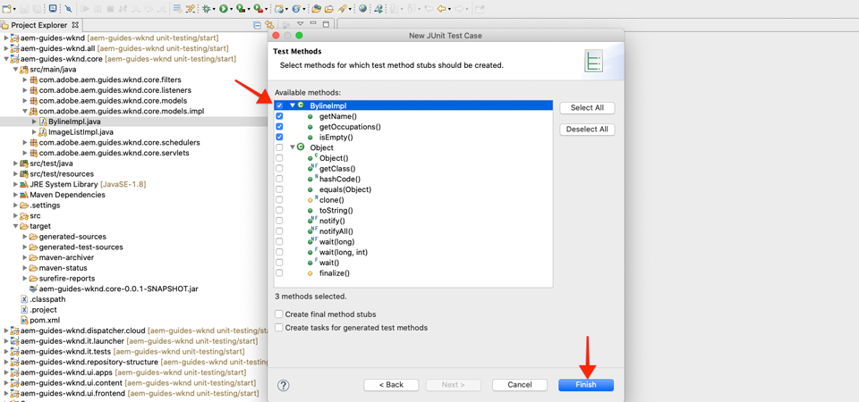
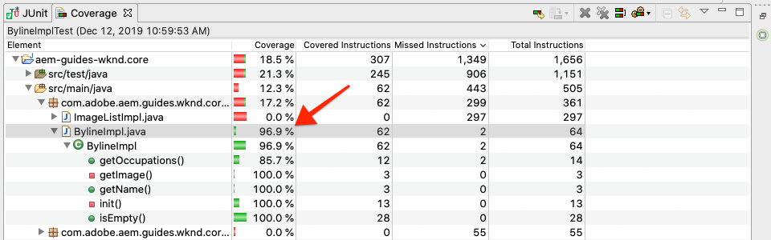
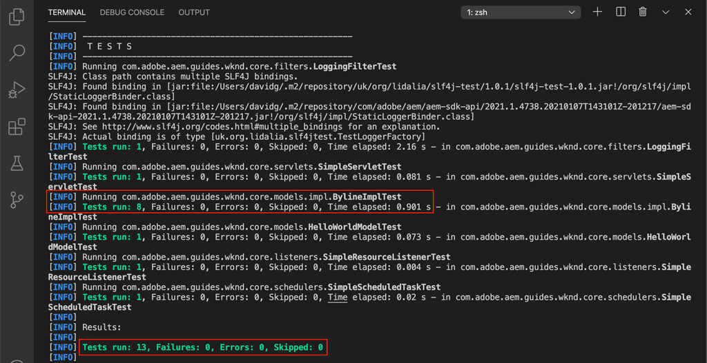

# 单元测试 {#unit-testing}

本教程涵盖单元测试的实现，该测试用于验证在自定义组件教程中创建的Byline组件的Sling [模型的行](./custom-component.md) 为。

## 前提条件 {#prerequisites}

查看教程构建的基线代码：

1. 克隆 [github.com/adobe/aem-guides-wknd](https://github.com/adobe/aem-guides-wknd) repository。
1. 检查分 `unit-testing/start` 支

```shell
$ git clone git@github.com:adobe/aem-guides-wknd.git ~/code/aem-guides-wknd
$ cd ~/code/aem-guides-wknd
$ git checkout unit-testing/start
```

您始终可以在GitHub上视图完 [成的代码](https://github.com/adobe/aem-guides-wknd/tree/unit-testing/solution) ，或通过切换到分支在本地签出代码 `unit-testing/solution`。

## 目标

1. 了解单元测试的基础知识。
1. 了解常用于测试AEM代码的框架和工具。
1. 了解编写单元测试时模仿或模拟AEM资源的选项。

## 背景 {#unit-testing-background}

在本教程中，我们将探索如何为Byline组 [件的](https://en.wikipedia.org/wiki/Unit_testing) Sling Model(在创建自定义AEM组件中创 [建](https://sling.apache.org/documentation/bundles/models.html) )编写单元测试 [](custom-component.md)。 单元测试是使用Java编写的内建时测试，用于验证Java代码的预期行为。 每个单元测试通常都很小，并根据预期结果验证方法（或工作单元）的输出。

我们将使用AEM最佳做法，并使用：

* [JUnit 5](https://junit.org/junit5/)
* [Mockito测试框架](https://site.mockito.org/)
* [wcm.io测试框架](https://wcm.io/testing/) (构建于Apache [Sling Mocks之上](https://sling.apache.org/documentation/development/sling-mock.html))

>[!VIDEO](https://video.tv.adobe.com/v/30207/?quality=12&learn=on)

## 单元测试和Adobe云管理器 {#unit-testing-and-adobe-cloud-manager}

[Adobe云管理器](https://docs.adobe.com/content/help/zh-Hans/experience-manager-cloud-manager/using/introduction-to-cloud-manager.html) 将单元测试执行和 [代码覆盖报告](https://docs.adobe.com/content/help/en/experience-manager-cloud-manager/using/how-to-use/understand-your-test-results.html#code-quality-testing) 集成到其CI/CD管道中，以帮助鼓励和促进单元测试AEM代码的最佳实践。

虽然单元测试代码是任何代码库的最佳实践，但在使用Cloud Manager时，通过提供Cloud Manager运行的单元测试，充分利用其代码质量测试和报告功能非常重要。

## Inspect测试马文依赖 {#inspect-the-test-maven-dependencies}

第一步是检查Maven依赖关系以支持编写和运行测试。 需要四个依赖关系：

1. JUnit5
1. 莫基托测试框架
1. Apache Sling Mocks
1. AEM Mocks Test Framework（由io.wcm提供）

在使 **用AEM****Maven原型设** 置过程中，JUnit **5、Mockito和AEM Mocks测试依赖项**[](project-setup.md)会自动添加到项目中。

1. 要视图这些依赖关系，请在aem-guides-wknd/pom.xml中打 **开父** Recator POM `<dependencies>..</dependencies>` ，导航到并确保定义以下依赖关系：

   ```xml
   <dependencies>
       ...
       <!-- Testing -->
       <dependency>
           <groupId>org.junit</groupId>
           <artifactId>junit-bom</artifactId>
           <version>5.5.2</version>
           <type>pom</type>
           <scope>import</scope>
       </dependency>
       <dependency>
           <groupId>org.slf4j</groupId>
           <artifactId>slf4j-simple</artifactId>
           <version>1.7.25</version>
           <scope>test</scope>
       </dependency>
       <dependency>
           <groupId>org.mockito</groupId>
           <artifactId>mockito-core</artifactId>
           <version>2.25.1</version>
           <scope>test</scope>
       </dependency>
       <dependency>
           <groupId>org.mockito</groupId>
           <artifactId>mockito-junit-jupiter</artifactId>
           <version>2.25.1</version>
           <scope>test</scope>
       </dependency>
       <dependency>
           <groupId>junit-addons</groupId>
           <artifactId>junit-addons</artifactId>
           <version>1.4</version>
           <scope>test</scope>
       </dependency>
       <dependency>
           <groupId>io.wcm</groupId>
           <artifactId>io.wcm.testing.aem-mock.junit5</artifactId>
           <!-- Prefer the latest version of AEM Mock Junit5 dependency -->
           <version>2.5.2</version>
           <scope>test</scope>
       </dependency>
       ...
   </dependencies>
   ```

1. 打开 **aem-guides-wknd/core/pom.xml** ，并视图相应的测试依赖关系可用：

   ```xml
   ...
   <dependency>
       <groupId>org.junit.jupiter</groupId>
       <artifactId>junit-jupiter</artifactId>
       <scope>test</scope>
   </dependency>
   <dependency>
       <groupId>org.mockito</groupId>
       <artifactId>mockito-core</artifactId>
       <scope>test</scope>
   </dependency>
   <dependency>
       <groupId>org.mockito</groupId>
       <artifactId>mockito-junit-jupiter</artifactId>
       <scope>test</scope>
   </dependency>
   <dependency>
       <groupId>junit-addons</groupId>
       <artifactId>junit-addons</artifactId>
   </dependency>
   <dependency>
       <groupId>io.wcm</groupId>
       <artifactId>io.wcm.testing.aem-mock.junit5</artifactId>
   </dependency>
   ...
   ```

   核心项目中的并行源 **文件夹** ，将包含单元测试和任何支持测试文件。 此 **test** 文件夹提供测试类与源代码的分离，但允许测试像它们与源代码位于同一包中一样工作。

## 创建JUnit测试 {#creating-the-junit-test}

单元测试通常使用Java类映射1对1。 在本章中，我们将为BylineImpl.java编写一 **个JUnit测试**，它是支持Byline组件的Sling模型。


*设备测试的存储位置。*

1. 在Eclipse中，我们可以这样做，方法是右键单击要测试的Java类，然后选择“ **新建”>“其他”>“Java”>“JUnit”>“JUnit测试用例**”。

   

1. 在第一个向导屏幕中，验证以下内容：

   * JUnit测试类型是 **New JUnit Jupiter测试** ，因为这些是在我们的pom.xml中 **设置的JUnit Maven依赖项**。
   * 该 **包** 是所测试类的java包(`BylineImpl.java`)
   * Source文件夹指向核 **心项** 目(`aem-guides-wknd.core/src/test/java`)，它指示Eclipse存储单元测试文件的位置。
   * 将手 `setUp()` 动创建方法存根；我们稍后会看到它是如何使用的。
   * 所测试的类是 `BylineImpl.java`，因为这是我们要测试的Java类。

   

   *JUnit测试用例向导——步骤2*

1. 单击 **向** 导底部的“下一步”按钮。

   下一步将帮助自动生成测试方法。 通常，Java类的每个公共方法都具有至少一个相应的测试方法，验证其行为。 通常，单元测试将有多种测试方法来测试单个公共方法，每种方法代表一组不同的输入或状态。

   在向导中，选择下面的所 `BylineImpl`有方法，但 `init()` Sling模型内部（通过）使用的方法 `@PostConstruct`除外。 通过测试其它方 `init()` 法，对其它方法进行有效测试，其它方法依靠 `init()` 成功执行。

   可以随时向JUnit测试类添加新的测试方法，向导的此页只是为了方便。

   

   *JUnit测试用例向导（续）*

1. 单击向导底部的“完成”按钮以生成JUnit5测试文件。
1. 验证是否已在aem-guides-wknd.core >/src/test **/java上的相应包结构中创建JUnit5测试文件，** 该文件名为 ****`BylineImplTest.java`。

## 查看BylineImplTest.java {#reviewing-bylineimpltest-java}

我们的测试文件有许多自动生成的方法。 此时，此JUnit测试文件没有任何AEM特定的内容。

第一种方法是 `public void setUp() { .. }` 用标注的 `@BeforeEach`。

注 `@BeforeEach` 释是一个JUnit注释，它指示运行的JUnit测试在运行此类中的每个测试方法之前执行此方法。

后续方法是测试方法本身，并在注释中进行 `@Test` 标记。 请注意，默认情况下，我们的所有测试都设置为失败。

当运行此JUnit测试类（也称为JUnit测试用例）时，标有该标记的每个方法都将 `@Test` 作为可以通过或失败的测试执行。


*`core/src/test/java/com/adobe/aem/guides/wknd/core/models/impl/BylineImplTest.java`*

1. 通过右键单击类名称运行JUnit测试用例，然后“运行 **方式”>“JUnit测试**”。

   

   *右键单击BylineImplTests.java >“运行方式”>“JUnit测试”*

1. 所有测试均按预期失败。

   

   *Eclipse处的JUnit视图>窗口>显示视图> Java > JUnit*

## 查看BylineImpl.java {#reviewing-bylineimpl-java}

编写单元测试时，主要有两种方法：

* [TDD或测试驱动型开发](https://en.wikipedia.org/wiki/Test-driven_development)，它涉及在开发实施之前立即以增量方式编写单元测试；编写测试，编写实现以使测试通过。
* 实施优先开发，包括先开发工作代码，然后编写验证该代码的测试。

在本教程中，使用了后一种方法(因为我们已在上一章 **中创建了一个可** 用的BylineImpl.java)。 因此，既要回顾和了解其公开方法的行为，又要了解其实施细节。 这听起来可能相反，因为良好的测试只应关注输入和输出，但在AEM工作时，需要了解各种实施考虑因素，才能构建运行测试。

在AEM环境中，TDD需要一定的专业知识水平，并且最能被精通AEM开发和AEM代码单元测试的AEM开发人员采用。

>[!VIDEO](https://video.tv.adobe.com/v/30208/?quality=12&learn=on)

## 设置AEM test context  {#setting-up-aem-test-context}

为AEM编写的大多数代码都依赖于JCR、Sling或AEM API，而JCR、Sling或API，这反过来又需要运行AEM的上下文才能正确执行。

由于设备测试是在内部版本执行的，因此在运行的AEM实例的上下文之外，不存在此类资源。 为了促进这 [一点，wcm.io的AEM Mocks创建了一个模拟上下文](https://wcm.io/testing/aem-mock/usage.html) ，使这些API能够像在AEM中运行一样大部分地发挥作用。

1. 在BylineImplTest.java **中使用wcm** .io的 `AemContext` JUnit扩展将它添加为用BylineImplTest.java AEM文 **文件装** 饰的JUnit扩展， `@ExtendWith`**** 创建上下文。 该扩展负责所有所需的初始化和清理任务。 为创建可用 `AemContext` 于所有测试方法的类变量。

   ```java
   import org.junit.jupiter.api.extension.ExtendWith;
   import io.wcm.testing.mock.aem.junit5.AemContext;
   import io.wcm.testing.mock.aem.junit5.AemContextExtension;
   ...
   
   @ExtendWith(AemContextExtension.class)
   class BylineImplTest {
   
       private final AemContext ctx = new AemContext();
   ```

   此变量 `ctx`公开了一个模拟AEM上下文，它提供了许多AEM和Sling抽象：

   * BylineImpl Sling模型将注册到此上下文中
   * 在此上下文中创建模拟JCR内容结构
   * 可在此上下文中注册自定义OSGi服务
   * 提供多种常见的必需模型对象和助手，如SlingHttpServletRequest对象、各种模型Sling和AEM OSGi服务，如ModelFactory、PageManager、Page、Template、ComponentManager、Component、TagManager、Tag等。
      * *请注意，并非这些对象的所有方法都已实现！*
   * And [much more](https://wcm.io/testing/aem-mock/usage.html)!

   该 **`ctx`** 对象将作为我们大多数模型上下文的入口点。

1. 在每个 `setUp(..)` 方法之前执行的方法中，定 `@Test` 义一个通用的模型测试状态：

   ```java
   @BeforeEach
   public void setUp() throws Exception {
       ctx.addModelsForClasses(BylineImpl.class);
       ctx.load().json("/com/adobe/aem/guides/wknd/core/models/impl/BylineImplTest.json", "/content");
   }
   ```

   * **`addModelsForClasses`** 将要测试的Sling模型注册到模型AEM上下文中，以便在方法中实例 `@Test` 化。
   * **`load().json`** 将资源结构加载到模型上下文中，使代码能够与这些资源进行交互，就像它们是由真实存储库提供的一样。 文件中的资源定义 **`BylineImplTest.json`** 将加载到/content下的模型JCR **上下文中**。
   * **`BylineImplTest.json`** 尚不存在，因此，我们创建它并定义测试所需的JCR资源结构。

1. 表示模拟资源结构的JSON文件存储在 **core/src/test/resources下** ，其路径与JUnit Java测试文件相同。

   在核心/test/ **resources/com/adobe/aem/guides/wknd/core/models/impl下新建一个名为BylineImplTest****** .json的JSON文件，其内容如下：

   ```json
   {
       "byline": {
       "jcr:primaryType": "nt:unstructured",
       "sling:resourceType": "wknd/components/content/byline"
       }
   }
   ```

   

   此JSON为Byline组件单元测试定义了模型资源定义。 此时，JSON具有表示Byline组件内容资源、和所需的最少属性 `jcr:primaryType` 集 `sling:resourceType`。

   处理单元测试时，它们的一般规则是创建满足每个测试所需的最少的模型内容、上下文和代码集。 避免在编写测试之前构建完整的模拟上下文的诱惑，因为这往往会导致不需要的文物。

   现在，随着 **BylineImplTest**.json的存在 `ctx.json("/com/adobe/aem/guides/wknd/core/models/impl/BylineImplTest.json", "/content")` ，执行时，模型资源定义将加载到路径／内容的上 **下文中。**

## 测试getName() {#testing-get-name}

既然我们有了一个基本的模型上下文设置，让我们为BylineImpl的getName() **编写我们的第一个测试**。 此测试必须确保 **方法getName** ()返回存储在资源的“name”属性&#x200B;**中的正确创作名** 称。

1. 按如 **下方**&#x200B;式更新BylineImplTest. **java中的testGetName** ()方法：

   ```java
   import com.adobe.aem.guides.wknd.core.components.Byline;
   import static org.junit.jupiter.api.Assertions.assertEquals;
   ...
   @Test
   public void testGetName() {
       final String expected = "Jane Doe";
   
       ctx.currentResource("/content/byline");
       Byline byline = ctx.request().adaptTo(Byline.class);
   
       String actual = byline.getName();
   
       assertEquals(expected, actual);
   }
   ```

   * **`String expected`** 设置预期值。 我们把这个设&#x200B;**置为“简**·完成”
   * **`ctx.currentResource`** 设置要评估代码的模型资源的上下文，因此将其设置为 **/content/byline** ，就像加载模型byline内容资源的位置一样。
   * **`Byline byline`** 通过从模型请求对象中调整Byline Sling模型来实例化它。
   * **`String actual`** 调用我们正在测试的 `getName()`Byline Sling Model对象方法。
   * **`assertEquals`** 断言预期值与署名Sling Model对象返回的值匹配。 如果这些值不相等，则测试将失败。

1. 运行测试，但失败 `NullPointerException`。

   请注意，此测试不会失败，因为我们从未在 `name` 模型JSON中定义属性，这将导致测试失败，但测试执行尚未达到该点！ 由于署名对象本身 `NullPointerException` 存在，此测试失败。

1. 在上面 [的ReviewingBylineImpl.java](#reviewing-bylineimpl-java) video中，我们讨论如 `@PostConstruct init()` 果引发异常，Sling模型将阻止实例化，这就是正在发生的情况。

   ```java
   @PostConstruct
   private void init() {
       image = modelFactory.getModelFromWrappedRequest(request, request.getResource(), Image.class);
   }
   ```

   结果表明，虽然ModelFactory OSGi服务是通过 `AemContext` （通过Apache Sling Context）提供的，但并非所有方法都得到实现，包括 `getModelFromWrappedRequest(...)` 在BylineImpl的方法中调用 `init()` 的方法。 这会导致 [AbstractMethodError](https://docs.oracle.com/javase/8/docs/api/java/lang/AbstractMethodError.html)，在术语中 `init()` 导致失败，而结果对该对象 `ctx.request().adaptTo(Byline.class)` 的适配是空对象。

   由于提供的吊床不能容纳我们的代码，因此我们必须自己实现模型上下文。为此，我们可以使用Mockito创建一个模型ModelFactory对象，当调用该对象时，该对象将返回 `getModelFromWrappedRequest(...)` 一个模型Image对象。

   因为为了甚至实例化Byline Sling模型，该模型上下文必须就位，我们可以将其添加到方 `@Before setUp()` 法中。 我们还需要将注释 `MockitoExtension.class` 添加 `@ExtendWith` 到BylineImplTest类 **的上方** 。

   ```java
   package com.adobe.aem.guides.wknd.core.models.impl;
   
   import org.mockito.junit.jupiter.MockitoExtension;
   import org.mockito.Mock;
   
   import com.adobe.aem.guides.wknd.core.models.Byline;
   import com.adobe.cq.wcm.core.components.models.Image;
   
   import io.wcm.testing.mock.aem.junit5.AemContext;
   import io.wcm.testing.mock.aem.junit5.AemContextExtension;
   
   import org.apache.sling.models.factory.ModelFactory;
   import org.junit.jupiter.api.BeforeEach;
   import org.junit.jupiter.api.Test;
   import org.junit.jupiter.api.extension.ExtendWith;
   
   import static org.junit.jupiter.api.Assertions.assertEquals;
   import static org.junit.jupiter.api.Assertions.fail;
   import static org.mockito.Mockito.*;
   import org.apache.sling.api.resource.Resource;
   
   @ExtendWith({ AemContextExtension.class, MockitoExtension.class })
   public class BylineImplTest {
   
       private final AemContext ctx = new AemContext();
   
       @Mock
       private Image image;
   
       @Mock
       private ModelFactory modelFactory;
   
       @BeforeEach
       public void setUp() throws Exception {
           ctx.addModelsForClasses(BylineImpl.class);
   
           ctx.load().json("/com/adobe/aem/guides/wknd/core/models/impl/BylineImplTest.json", "/content");
   
           lenient().when(modelFactory.getModelFromWrappedRequest(eq(ctx.request()), any(Resource.class), eq(Image.class)))
                   .thenReturn(image);
   
           ctx.registerService(ModelFactory.class, modelFactory, org.osgi.framework.Constants.SERVICE_RANKING,
                   Integer.MAX_VALUE);
       }
   
       @Test
       void testGetName() { ...
   }
   ```

   * **`@ExtendWith({AemContextExtension.class, MockitoExtension.class})`** 标记要使用Mockito JUnit Jupiter扩 [展运行的Test Case类](https://www.javadoc.io/page/org.mockito/mockito-junit-jupiter/latest/org/mockito/junit/jupiter/MockitoExtension.html) ，该类允许使用@Mock批注在类级别定义模型对象。
   * **`@Mock private Image`** 创建类型的模型对象 `com.adobe.cq.wcm.core.components.models.Image`。 请注意，它是在类级别定义的，这样，方法就可以根据 `@Test` 需要更改其行为。
   * **`@Mock private ModelFactory`** 创建ModelFactory类型的模型对象。 请注意，这是纯粹的Mockito模型，没有在其上实施任何方法。 请注意，它是在类级别定义的，这样，方法就可以 `@Test`根据需要更改其行为。
   * **`when(modelFactory.getModelFromWrappedRequest(..)`** 在模型ModelFactory对 `getModelFromWrappedRequest(..)` 象上注册调用时的模型行为。 中定义的结 `thenReturn (..)` 果是返回模型图像对象。 请注意，此行为仅在以下情况下才被调用：第1个参数等于请求 `ctx`对象，第2个参数是任何资源对象，第3个参数必须是核心组件图像类。 我们接受任何资源，因为在整个测试过程中，我们将 `ctx.currentResource(...)` 设置为BylineImplTest.json中定义的各 **种模型资源**。 请注意，我们添加 **了ensigne()** stricty，因为我们稍后将要覆盖ModelFactory的此行为。
   * **`ctx.registerService(..)`。** 在AemContext中注册模型ModelFactory对象，其服务级别最高。 这是必需的，因为BylineImpl中使用的ModelFactory `init()` 是通过字段注 `@OSGiService ModelFactory model` 入的。 为了使AemContext插入我们 **的** mock对象（处理调用）, `getModelFromWrappedRequest(..)`我们必须将其注册为该类型(ModelFactory)的最高级别服务。

1. 重新运行测试，再次失败，但这次的消息清楚其失败原因。

   

   *testGetName()失败，原因是断言*

   我们收到 **AssertionError** ，它表示测试中的assert条件失败，并告诉我 **们预期值为“Jane Doe** ”，但实 **际值为null**。 这很有意义，因&#x200B;**为** “name”属性尚未添加到BylineImplTest.json **中的mock** /content/byline资源定 ****&#x200B;义中，所以我们添加它：

1. 更 **新BylineImplTest.json** 以定义 `"name": "Jane Doe".`

   ```json
   {
       "byline": {
       "jcr:primaryType": "nt:unstructured",
       "sling:resourceType": "wknd/components/content/byline",
       "name": "Jane Doe"
       }
   }
   ```

1. 重新运行测试，现 **`testGetName()`** 在通过！

## 测试getSchroplies() {#testing-get-occupations}

很好！ 我们的第一个考试通过了！ 我们继续测试 `getOccupations()`。 由于模型上下文的初始化是在方法中 `@Before setUp()`进行的，因此此测试用例中的所 `@Test` 有方法都可以使用它，包括 `getOccupations()`。

请记住，此方法必须返回存储在职业属性中的职业（降序）的按字母顺序排序的列表。

1. 更新 **`testGetOccupations()`** 如下：

   ```java
   import java.util.List;
   import com.google.common.collect.ImmutableList;
   ...
   @Test
   public void testGetOccupations() {
       List<String> expected = new ImmutableList.Builder<String>()
                               .add("Blogger")
                               .add("Photographer")
                               .add("YouTuber")
                               .build();
   
       ctx.currentResource("/content/byline");
       Byline byline = ctx.request().adaptTo(Byline.class);
   
       List<String> actual = byline.getOccupations();
   
       assertEquals(expected, actual);
   }
   ```

   * **`List<String> expected`** 定义预期结果。
   * **`ctx.currentResource`** 将当前资源设置为根据/content/byline的模型资源定义评估上下文。 这可确保 **BylineImpl** .java在我们的模型资源上下文中执行。
   * **`ctx.request().adaptTo(Byline.class)`** 通过从模型请求对象中调整Byline Sling模型来实例化它。
   * **`byline.getOccupations()`** 调用我们正在测试的 `getOccupations()`Byline Sling Model对象方法。
   * **`assertEquals(expected, actual)`** 断言预期列表与实际列表相同。

1. 请记住，正如 **`getName()`** 上面所 **述，BylineImplTest.json不定义职业** ，因此，如果我们运行它，此测试将失败，因为 `byline.getOccupations()` 它将返回空的列表。

   更 **新BylineImplTest** .json以包含职业列表，这些职业将按非字母顺序设置，以确保我们的测试验证职业是否按顺序排 **`getOccupations()`**&#x200B;序。

   ```json
   {
       "byline": {
       "jcr:primaryType": "nt:unstructured",
       "sling:resourceType": "wknd/components/content/byline",
       "name": "Jane Doe",
       "occupations": ["Photographer", "Blogger", "YouTuber"]
       }
   }
   ```

1. 测试，我们又通过了！ 看来分类的职业都行！

   

   *testGetSchroplies()通过*

## 测试isEmpty() {#testing-is-empty}

最后一个测试方法 **`isEmpty()`**。

测试 `isEmpty()` 很有趣，因为它需要针对各种条件进行测试。 查 **看BylineImpl**.java `isEmpty()` 的方法，必须测试以下条件：

* 名称为空时返回true
* 当职业为空时，返回true
* 当图像为null或没有src URL时，返回true
* 当名称、职业和图像（带有src URL）存在时，返回false

为此，我们需要创建新的测试方法，每个测试都要测试特定条件以及新的模型资源结构，以 `BylineImplTest.json` 驱动这些测试。

请注意，此检查允许我们跳过测试时间 `getName()`, `getOccupations()` 并且 `getImage()` 为空，因为通过测试该状态的预期行为 `isEmpty()`。

1. 第一个测试将测试没有设置属性的全新组件的状态。

   为添加新的资源定 `BylineImplTest.json`义，为其提供语义名称“**空**”

   ```json
   {
       "byline": {
       "jcr:primaryType": "nt:unstructured",
       "sling:resourceType": "wknd/components/content/byline",
       "name": "Jane Doe",
       "occupations": ["Photographer", "Blogger", "YouTuber"]
       },
       "empty": {
       "jcr:primaryType": "nt:unstructured",
       "sling:resourceType": "wknd/components/content/byline"
       }
   }
   ```

   **`"empty": {...}`** 定义名为“empty”的新资源定义，该定义只具有 `jcr:primaryType` 和 `sling:resourceType`。

   请记住，在 `BylineImplTest.json` 执行 `ctx` 中的每个测试方法之前，我们会先加载 `@setUp`到中，因此在测试中，我们可以立即使用新的资源定 **义（位于/content/empty）。**

1. 按如 `testIsEmpty()` 下方式更新，将当前资源设置为新的“**空**”模型资源定义。

   ```java
   @Test
   public void testIsEmpty() {
       ctx.currentResource("/content/empty");
       Byline byline = ctx.request().adaptTo(Byline.class);
   
       assertTrue(byline.isEmpty());
   }
   ```

   运行测试并确保通过。

1. 然后，创建一组方法，以确保任何所需的数据点（名称、职业或图像）为空，则返回 `isEmpty()` true。

   对于每个测试，都会使用离散的模型资源定义， **使用无名和无职的其** 他资源定义更新 **** BylineImplTest.json ****。

   ```json
   {
       "byline": {
       "jcr:primaryType": "nt:unstructured",
       "sling:resourceType": "wknd/components/content/byline",
       "name": "Jane Doe",
       "occupations": ["Photographer", "Blogger", "YouTuber"]
       },
       "empty": {
       "jcr:primaryType": "nt:unstructured",
       "sling:resourceType": "wknd/components/content/byline"
       },
       "without-name": {
       "jcr:primaryType": "nt:unstructured",
       "sling:resourceType": "wknd/components/content/byline",
       "occupations": "[Photographer, Blogger, YouTuber]"
       },
       "without-occupations": {
       "jcr:primaryType": "nt:unstructured",
       "sling:resourceType": "wknd/components/content/byline",
       "name": "Jane Doe"
       }
   }
   ```

   创建以下测试方法以测试这些状态中的每个状态。

   ```java
   @Test
   public void testIsEmpty() {
       ctx.currentResource("/content/empty");
   
       Byline byline = ctx.request().adaptTo(Byline.class);
   
       assertTrue(byline.isEmpty());
   }
   
   @Test
   public void testIsEmpty_WithoutName() {
       ctx.currentResource("/content/without-name");
   
       Byline byline = ctx.request().adaptTo(Byline.class);
   
       assertTrue(byline.isEmpty());
   }
   
   @Test
   public void testIsEmpty_WithoutOccupations() {
       ctx.currentResource("/content/without-occupations");
   
       Byline byline = ctx.request().adaptTo(Byline.class);
   
       assertTrue(byline.isEmpty());
   }
   
   @Test
   public void testIsEmpty_WithoutImage() {
       ctx.currentResource("/content/byline");
   
       lenient().when(modelFactory.getModelFromWrappedRequest(eq(ctx.request()),
           any(Resource.class),
           eq(Image.class))).thenReturn(null);
   
       Byline byline = ctx.request().adaptTo(Byline.class);
   
       assertTrue(byline.isEmpty());
   }
   
   @Test
   public void testIsEmpty_WithoutImageSrc() {
       ctx.currentResource("/content/byline");
   
       when(image.getSrc()).thenReturn("");
   
       Byline byline = ctx.request().adaptTo(Byline.class);
   
       assertTrue(byline.isEmpty());
   }
   ```

   **`testIsEmpty()`** 针对空的模型资源定义进行测试，并声 `isEmpty()` 明为true。

   **`testIsEmpty_WithoutName()`** 测试对象是一个有职业却没有名字的模型资源定义。

   **`testIsEmpty_WithoutOccupations()`** 测试所依据的是一个名字，但没有职业的模型资源定义。

   **`testIsEmpty_WithoutImage()`** 对名称和职位的模型资源定义进行测试，但将模型图像设置为返回null。 请注意，我们希望覆盖中 `modelFactory.getModelFromWrappedRequest(..)`定义的行 `setUp()` 为，以确保此调用返回的Image对象为null。 莫基托小作品的特征很严格，不需要重复的代码。 因此，我们使用设置 **`lenient`** 设置模型以明确注意我们正在覆盖方法中的 `setUp()` 行为。

   **`testIsEmpty_WithoutImageSrc()`** 使用名称和职位对模型资源定义进行测试，但将模型图像设置为在调用时返回空 `getSrc()` 字符串。

1. 最后，编写一个测试，确保 **在正确配置组件时** ,isEmpty()返回false。 对于这种情况，我们可以重 **新使用/content** /byline，它表示完全配置的Byline组件。

   ```java
   @Test
   public void testIsNotEmpty() {
   ctx.currentResource("/content/byline");
   when(image.getSrc()).thenReturn("/content/bio.png");
   
   Byline byline = ctx.request().adaptTo(Byline.class);
   
   assertFalse(byline.isEmpty());
   }
   ```

## 代码覆盖 {#code-coverage}

代码覆盖率是单位测试所涵盖的源代码量。 现代IDE提供的工具可自动检查在单元测试过程中执行的源代码。 虽然代码覆盖率本身并不是代码质量的指标，但了解源代码是否存在未经单元测试测试的重要区域是很有帮助的。

1. 在Eclipse的项目资源管理器中，右键单击BylineImplTest.java **并选择** “覆盖 **方式”>“JUnit测试”**

   确保已打开“覆盖范围”摘要视图(“窗口”>“显示视图”>“其他”>“Java”>“覆盖范围”)。

   此操作将运行此文件中的设备测试并提供一个报告，指明代码覆盖范围。 对类和方法的深入研究可以更清晰地显示测试文件的哪些部分，哪些部分没有。

   

   *代码覆盖范围摘要*

   Eclipse提供了一个快速视图，可了解每个类和方法被单元测试覆盖了多少。 Eclipse甚至对代码行进行颜色编码：

   * **绿色** ，是由至少一个测试执行的代码
   * **黄色** 表示未由任何测试评估的分支
   * **红色** 表示未由任何测试执行的代码

1. 在保险报告中，已确定在职业字段为空并返回空列表时执行的分支，从不对其进行评估。 这由颜色为黄色的行571和86表示，指示不执行if/else的分支，以红色的行75表示从不执行代码行。

   

1. 可通过添加测试来修复这 `getOccupations()` 一问题，该测试声明当资源上没有占用值时返回空列表。 将以下新测试方法添 **加到BylineImplTests.java**。

   ```java
   @Test
   public void testGetOccupations_WithoutOccupations() {
       List<String> expected = Collections.emptyList();
   
       ctx.currentResource("/content/empty");
       Byline byline = ctx.request().adaptTo(Byline.class);
   
       List<String> actual = byline.getOccupations();
   
       assertEquals(expected, actual);
   }
   ```

   **`Collections.emptyList();`** 将预期值设置为空列表。

   **`ctx.currentResource("/content/empty")`** 将当前资源设置为/content/empty，我们知道该资源未定义职业属性。

1. 重新运行“覆盖为 **”时，它报告BylineImpl** .java现在覆盖率为100%，但仍有一个分支未在isEmpty()中评估，这又与职业有关。 在这种情况下，将评估占领==null，但sprocitions.isEmpty()不是因为没有设置的模型资源定义 `"occupations": []`。

   

   *涵盖testGetProchils_WithoutProchils()*

1. 通过创建另一测试方法可轻松解决此问题，该测试方法使用将占位设置为空数组的模型资源定义。

   将新的模型资源定 **义添加到BylineImplTest.json** ，它是“不占职”的副本 **，并将职业属性设置为空数组，并将其命** 名为“不占职”-空数组 ****。

   ```json
   "without-occupations-empty-array": {
      "jcr:primaryType": "nt:unstructured",
      "sling:resourceType": "wknd/components/content/byline",
      "name": "Jane Doe",
      "occupations": []
    }
   ```

   在中创建一 **个新的** @Test `BylineImplTest.java` 方法，它使用此新的模型资源，声明返回 `isEmpty()` true。

   ```java
   @Test
   public void testIsEmpty_WithEmptyArrayOfOccupations() {
       ctx.currentResource("/content/without-occupations-empty-array");
   
       Byline byline = ctx.request().adaptTo(Byline.class);
   
       assertTrue(byline.isEmpty());
   }
   ```

   

   *覆盖testIsEmpty_WithEmptyArrayOfPhorticles()*

1. 通过上一次添加， `BylineImpl.java` 您可以享受100%的代码覆盖，并评估所有其条件路径。

   测试无需依赖最少的实 `BylineImpl` 现详细信息集即可验证预期行为。

## 作为构建的一部分运行单元测试 {#running-unit-tests-as-part-of-the-build}

需要执行单元测试才能作为主版本的一部分进行传递。 这可确保在部署应用程序之前成功通过所有测试。 执行包或安装等主要目标会自动调用并要求通过项目中的所有单元测试。

```shell
$ mvn package
```



```shell
$ mvn package
```

同样，如果我们将测试方法更改为失败，则生成将失败并报告哪些测试失败以及原因。


## 查看代码 {#review-the-code}

在GitHub上视图完 [成的代码](https://github.com/adobe/aem-guides-wknd) ，或在Git浏览器中本地查看并部署代码 `unit-testing/solution`。
