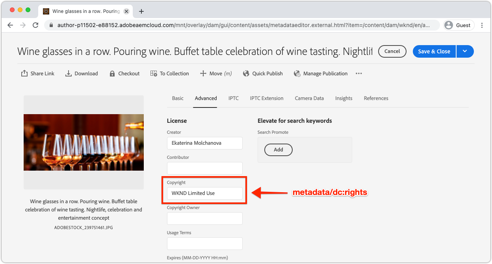

# 本地开发访问令牌

在构建需要以编程方式访问AEM as a Cloud Service的集成时，开发人员需要一种简单、快速的方式来获取AEM的临时访问令牌，以便利本地开发活动。 为了满足此需求，AEM的Developer Console允许开发人员自行生成可用于以编程方式访问AEM的临时访问令牌。

>[!VIDEO](https://video.tv.adobe.com/v/330477?quality=12&learn=on)

## 生成本地开发访问令牌


本地开发访问令牌允许作为生成令牌的用户访问AEM创作和发布服务，以及这些服务的权限。 尽管这是一个开发令牌，但请不要共享此令牌，或将其存储在源代码管理中。

1. 在[Adobe Admin Console](https://adminconsole.adobe.com/)中，确保作为开发人员的您是以下成员：
   + __Cloud Manager — 开发人员__ IMS产品配置文件(授予对AEM Developer Console的访问权限)
   + 访问令牌与之集成的AEM环境服务的&#x200B;__AEM管理员__&#x200B;或&#x200B;__AEM用户__ IMS产品配置文件
   + 沙盒AEM as a Cloud Service环境仅需要&#x200B;__AEM Administrators__&#x200B;或&#x200B;__AEM Users__&#x200B;产品配置文件的成员资格
1. 登录到[Adobe Cloud Manager](https://my.cloudmanager.adobe.com)
1. 打开包含AEM as a Cloud Service环境的项目以与集成
1. 点按&#x200B;__环境__&#x200B;分区中环境旁边的&#x200B;__省略号__，然后选择&#x200B;__Developer Console__
1. 点按&#x200B;__集成__&#x200B;选项卡
1. 点按&#x200B;__本地令牌__&#x200B;选项卡
1. 点按&#x200B;__获取本地开发令牌__&#x200B;按钮
1. 点按左上角的&#x200B;__下载按钮__&#x200B;以下载包含`accessToken`值的JSON文件，并将JSON文件保存到开发计算机上的安全位置。
   + 这是您的24小时AEM as a Cloud Service环境开发人员访问令牌。


## 已使用本地开发访问令牌{#use-local-development-access-token}


1. 从AEM Developer Console下载临时本地开发访问令牌
   + 本地开发访问令牌每24小时过期一次，因此开发人员需要每天下载新的访问令牌
1. 正在开发一个能够以编程方式与AEM as a Cloud Service交互的外部应用程序
1. 外部应用程序读取本地开发访问令牌
1. 外部应用程序构造对AEM as a Cloud Service的HTTP请求，将本地开发访问令牌作为持有者令牌添加到HTTP请求的授权标头
1. AEM as a Cloud Service接收HTTP请求、验证请求并执行HTTP请求所请求的工作，并将HTTP响应返回给外部应用程序

### 示例外部应用程序

我们将创建一个简单的外部JavaScript应用程序，以说明如何使用本地开发人员访问令牌通过HTTPS以编程方式访问AEM as a Cloud Service。 这说明了在AEM之外运行的&#x200B;_任何_&#x200B;应用程序或系统（无论框架或语言如何）如何使用访问令牌以编程方式向AEM as a Cloud Service进行身份验证和访问。 在[下一部分](./service-credentials.md)中，我们将更新此应用程序代码以支持生成令牌以供生产使用的方法。

此示例应用程序从命令行运行，并使用AEM HTTP API通过以下流程更新AEM Assets资源元数据：

1. 从命令行(`getCommandLineParams()`)读取参数
1. 获取用于向AEM as a Cloud Service进行身份验证的访问令牌(`getAccessToken(...)`)
1. 列出在命令行参数(`listAssetsByFolder(...)`)中指定的AEM资源文件夹中的所有资源
1. 使用命令行参数(`updateMetadata(...)`)中指定的值更新列出的资源元数据

使用访问令牌以编程方式向AEM进行身份验证的关键元素是，按照以下格式向向AEM发出的所有HTTP请求添加授权HTTP请求标头：

+ `Authorization: Bearer ACCESS_TOKEN`

## 运行外部应用程序

1. 确保已在本地开发计算机上安装[Node.js](/help/cloud-service/local-development-environment/development-tools.md?lang=en#node-js)，该计算机用于运行外部应用程序
1. 下载并解压缩[示例外部应用程序](./assets/aem-guides_token-authentication-external-application.zip)
1. 从命令行中，在此项目的文件夹中，运行`npm install`
1. 将[下载的本地开发访问令牌](#download-local-development-access-token)复制到项目根目录中名为`local_development_token.json`的文件
   + 但请记住，切勿向Git提交任何凭据！
1. 打开`index.js`并查看外部应用程序代码和注释。

   ```javascript
   const fetch = require('node-fetch');
   const fs = require('fs');
   const auth = require('@adobe/jwt-auth');
   
   // The root context of the Assets HTTP API
   const ASSETS_HTTP_API = '/api/assets';
   
   // Command line parameters
   let params = { };
   
   /**
   * Application entry point function
   */
   (async () => {
       console.log('Example usage: node index.js aem=https://author-p1234-e5678.adobeaemcloud.com propertyName=metadata/dc:rights "propertyValue=WKND Limited Use" folder=/wknd-shared/en/adventures/napa-wine-tasting file=credentials-file.json' );
   
       // Parse the command line parameters
       params = getCommandLineParams();
   
       // Set the access token to be used in the HTTP requests to be local development access token
       params.accessToken = await getAccessToken(params.developerConsoleCredentials);
   
       // Get a list of all the assets in the specified assets folder
       let assets = await listAssetsByFolder(params.folder);
   
       // For each asset, update it's metadata
       await assets.forEach(asset => updateMetadata(asset, { 
           [params.propertyName]: params.propertyValue 
       }));
   })();
   
   /**
   * Returns a list of Assets HTTP API asset URLs that reference the assets in the specified folder.
   * 
   * https://experienceleague.adobe.com/docs/experience-manager-cloud-service/assets/admin/mac-api-assets.html?lang=en#retrieve-a-folder-listing
   * 
   * @param {*} folder the Assets HTTP API folder path (less the /content/dam path prefix)
   */
   async function listAssetsByFolder(folder) {
       return fetch(`${params.aem}${ASSETS_HTTP_API}${folder}.json`, {
               method: 'get',
               headers: { 
                   'Content-Type': 'application/json',
                   'Authorization': 'Bearer ' + params.accessToken // Provide the AEM access token in the Authorization header
               },
           })
           .then(res => {
               console.log(`${res.status} - ${res.statusText} @ ${params.aem}${ASSETS_HTTP_API}${folder}.json`);
   
               // If success, return the JSON listing assets, otherwise return empty results
               return res.status === 200 ? res.json() : { entities: [] };
           })
           .then(json => { 
               // Returns a list of all URIs for each non-content fragment asset in the folder
               return json.entities
                   .filter((entity) => entity['class'].indexOf('asset/asset') === -1 && !entity.properties.contentFragment)
                   .map(asset => asset.links.find(link => link.rel.find(r => r === 'self')).href);
           });
   }
   
   /**
   * Update the metadata of an asset in AEM
   * 
   * https://experienceleague.adobe.com/docs/experience-manager-cloud-service/assets/admin/mac-api-assets.html?lang=en#update-asset-metadata
   * 
   * @param {*} asset the Assets HTTP API asset URL to update
   * @param {*} metadata the metadata to update the asset with
   */
   async function updateMetadata(asset, metadata) {        
       await fetch(`${asset}`, {
               method: 'put',
               headers: { 
                   'Content-Type': 'application/json',
                   'Authorization': 'Bearer ' + params.accessToken // Provide the AEM access token in the Authorization header
               },
               body: JSON.stringify({
                   class: 'asset',
                   properties: metadata
               })
           })
           .then(res => { 
               console.log(`${res.status} - ${res.statusText} @ ${asset}`);
           });
   }
   
   /**
   * Parse and return the command line parameters. Expected params are:
   * 
   * - aem = The AEM as a Cloud Service hostname to connect to.
   *              Example: https://author-p12345-e67890.adobeaemcloud.com
   * - folder = The asset folder to update assets in. Note that the Assets HTTP API do NOT use the JCR `/content/dam` path prefix.
   *              Example: '/wknd-shared/en/adventures/napa-wine-tasting'
   * - propertyName = The asset property name to update. Note this is relative to the [dam:Asset]/jcr:content node of the asset.
   *              Example: metadata/dc:rights
   * - propertyValue = The value to update the asset property (specified by propertyName) with.
   *              Example: "WKND Free Use"
   * - file = The path to the JSON file that contains the credentials downloaded from AEM Developer Console
   *              Example: local_development_token_cm_p1234-e5678.json 
   */
   function getCommandLineParams() {
       let parameters = {};
   
       // Parse the command line params, splitting on the = delimiter
       for (let i = 2; i < process.argv.length; i++) {
           let key = process.argv[i].split('=')[0];
           let value = process.argv[i].split('=')[1];
   
           parameters[key] = value;
       };
   
       // Read in the credentials from the provided JSON file
       if (parameters.file) {
           parameters.developerConsoleCredentials = JSON.parse(fs.readFileSync(parameters.file));
       }
   
       console.log(parameters);
   
       return parameters;
   }
   
   async function getAccessToken(developerConsoleCredentials) {s
       if (developerConsoleCredentials.accessToken) {
           // This is a Local Development access token
           return developerConsoleCredentials.accessToken;
       } 
   }
   ```

   查看`listAssetsByFolder(...)`和`updateMetadata(...)`中的`fetch(..)`调用，并注意`headers`定义值为`Bearer ACCESS_TOKEN`的`Authorization` HTTP请求标头。 这是源自外部应用程序的HTTP请求向AEM as a Cloud Service进行身份验证的方式。

   ```javascript
   ...
   return fetch(`${params.aem}${ASSETS_HTTP_API}${folder}.json`, {
               method: 'get',
               headers: { 
                   'Content-Type': 'application/json',
                   'Authorization': 'Bearer ' + params.accessToken // Provide the AEM access token in the Authorization header
               },
   })...
   ```

   对AEM as a Cloud Service的任何HTTP请求必须在授权标头中设置持有者访问令牌。 请记住，每个AEM as a Cloud Service环境都需要其自身的访问令牌。 开发的访问令牌不适用于暂存或生产，暂存的令牌不适用于开发或生产，生产的令牌不适用于开发或暂存！

1. 使用命令行，从项目的根目录执行应用程序，传入以下参数：

   ```shell
   $ node index.js \
       aem=https://author-p1234-e5678.adobeaemcloud.com \
       folder=/wknd-shared/en/adventures/napa-wine-tasting \
       propertyName=metadata/dc:rights \
       propertyValue="WKND Limited Use" \
       file=local_development_token.json
   ```

   以下参数在中传递：

   + `aem`：应用程序与之交互的AEM as a Cloud Service环境的方案和主机名（例如`https://author-p1234-e5678.adobeaemcloud.com`）。
   + `folder`：其资产已使用`propertyValue`更新的资产文件夹路径；请勿添加`/content/dam`前缀（例如`/wknd-shared/en/adventures/napa-wine-tasting`）
   + `propertyName`：要更新的资产属性名称，相对于`[dam:Asset]/jcr:content`（例如`metadata/dc:rights`）。
   + `propertyValue`：要将`propertyName`设置为的值；包含空格的值需要用`"`封装（例如`"WKND Limited Use"`）
   + `file`：从AEM Developer Console下载的JSON文件的相对文件路径。

   成功执行每个资源的应用程序结果输出已更新：

   ```shell
   200 - OK @ https://author-p1234-e5678.adobeaemcloud.com/api/assets/wknd-shared/en/adventures/napa-wine-tasting.json
   200 - OK @ https://author-p1234-e5678.adobeaemcloud.com/api/assets/wknd-shared/en/adventures/napa-wine-tasting/AdobeStock_277654931.jpg.json
   200 - OK @ https://author-p1234-e5678.adobeaemcloud.com/api/assets/wknd-shared/en/adventures/napa-wine-tasting/AdobeStock_239751461.jpg.json
   200 - OK @ https://author-p1234-e5678.adobeaemcloud.com/api/assets/wknd-shared/en/adventures/napa-wine-tasting/AdobeStock_280313729.jpg.json
   200 - OK @ https://author-p1234-e5678.adobeaemcloud.com/api/assets/wknd-shared/en/adventures/napa-wine-tasting/AdobeStock_286664352.jpg.json
   ```

### 在AEM中验证元数据更新

通过登录到AEM as a Cloud Service环境，验证元数据是否已更新（确保访问传递到`aem`命令行参数的同一主机）。

1. 登录到外部应用程序与之交互的AEM as a Cloud Service环境（使用`aem`命令行参数中提供的相同主机）
1. 导航到&#x200B;__Assets__ > __文件__
1. 导航到由`folder`命令行参数指定的资产文件夹，例如&#x200B;__WKND__ > __英语__ > __冒险__ > __Napa品酒__
1. 打开文件夹中任何（非内容片段）资产的&#x200B;__属性__
1. 点按&#x200B;__高级__&#x200B;选项卡
1. 查看更新属性的值，例如&#x200B;__Copyright__，它映射到更新的`metadata/dc:rights` JCR属性，它反映了`propertyValue`参数中提供的值，例如&#x200B;__WKND Limited Use__



## 后续步骤

现在，我们使用本地开发令牌以编程方式访问了AEM as a Cloud Service。 接下来，我们需要更新应用程序以使用服务凭据进行处理，以便在生产上下文中使用此应用程序。

+ [如何使用服务凭据](./service-credentials.md)
