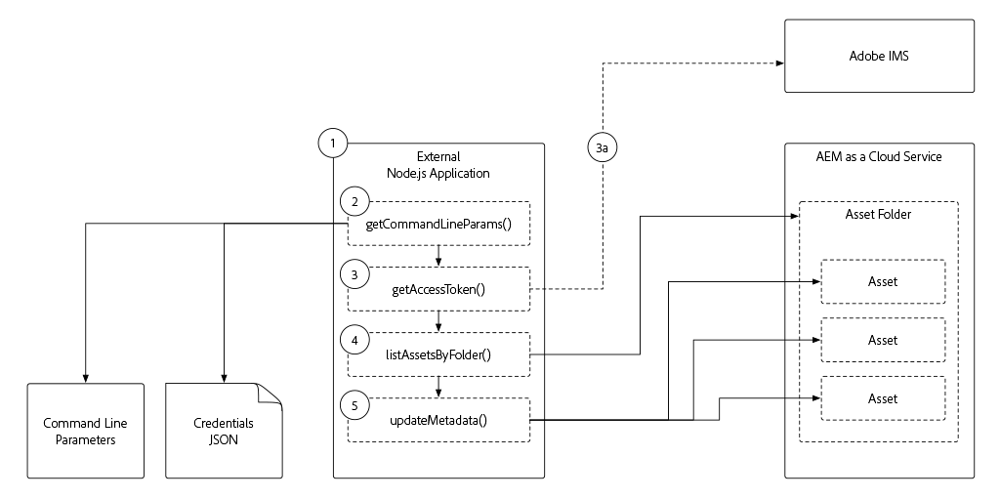

# 向AEM as a Cloud Service进行基于令牌的身份验证

AEM公开了各种可以以无头方式交互的HTTP端点，从GraphQL、AEM Content Services到Assets HTTP API。 通常，这些Headless使用者可能需要向AEM进行身份验证，才能访问受保护的内容或操作。 为此，AEM支持对来自外部应用程序、服务或系统的HTTP请求进行基于令牌的身份验证。

在本教程中，您将很好地探索外部应用程序可怎样使用访问令牌以编程方式通过HTTP向AEM as a Cloud Service进行身份验证和与之交互。

>[!VIDEO](https://video.tv.adobe.com/v/330460?quality=12&learn=on)

## 先决条件

在执行本教程之前，请确保已满足以下条件：

1. 访问AEM as a Cloud Service环境（最好是开发环境或沙盒程序）
1. AEM as a Cloud Service环境创作服务AEM管理员产品配置文件的成员资格
1. 成为您的Adobe IMS组织管理员的成员或访问权限（他们将必须执行[服务凭据](./service-credentials.md)的一次性初始化）
1. 最新的[WKND站点](https://github.com/adobe/aem-guides-wknd)已部署到您的Cloud Service环境

## 外部应用程序概述

本教程使用从命令行运行的[simple Node.js应用程序](./assets/aem-guides_token-authentication-external-application.zip)，通过[Assets HTTP API](https://experienceleague.adobe.com/docs/experience-manager-cloud-service/assets/admin/mac-api-assets.html)更新AEM as a Cloud Service上的资源元数据。

Node.js应用程序的执行流程如下所示：

1. 从命令行调用Node.js应用程序
1. 命令行参数定义：
   + 要连接到的AEM as a Cloud Service Author服务主机(`aem`)
   + 已更新其资源的AEM资源文件夹(`folder`)
   + 要更新的元数据属性和值（`propertyName`和`propertyValue`）
   + 提供访问AEM as a Cloud Service所需的凭据的文件的本地路径(`file`)
1. 用于对AEM进行身份验证的访问令牌派生自通过命令行参数`file`提供的JSON文件

   a.如果在JSON文件(`file`)中提供了用于非本地开发的服务凭据，则访问令牌将从Adobe IMS API中检索
1. 应用程序使用访问令牌访问AEM，并列出在命令行参数`folder`中指定的文件夹中的所有资源
1. 对于文件夹中的每个资产，应用程序会根据命令行参数`propertyName`和`propertyValue`中指定的属性名称和值更新其元数据

虽然此示例应用程序是Node.js，但这些交互可以使用不同的编程语言进行开发，并从其他外部系统中执行。

## 本地开发访问令牌

本地开发访问令牌是为特定的AEM as a Cloud Service环境生成的，用于提供对创作和发布服务的访问权限。  这些访问令牌是临时的，仅在开发通过HTTP与AEM交互的外部应用程序或系统期间使用。 开发人员无需获取和管理真正的服务凭据，而是可以快速轻松地自行生成临时访问令牌，以便开发集成。

+ [如何使用本地开发访问令牌](./local-development-access-token.md)

## 服务凭据

服务凭据是在任何非开发场景（最明显的是生产场景）中使用的真实凭据，有助于提高外部应用程序或系统通过HTTP向AEM as a Cloud Service进行身份验证以及与之交互的能力。 服务凭据本身不会发送到AEM进行身份验证，而是外部应用程序使用这些凭据生成JWT，与Adobe IMS的API _交换_&#x200B;访问令牌，然后该令牌可用于向AEM as a Cloud Service验证HTTP请求。

+ [如何使用服务凭据](./service-credentials.md)

## 其他资源

+ [下载示例应用程序](./assets/aem-guides_token-authentication-external-application.zip)
+ JWT创建和交换的其他代码示例
   + [Node.js、Java、Python、C#.NET和PHP代码示例](https://developer.adobe.com/developer-console/docs/guides/authentication/JWT/samples)
   + [基于JavaScript/Axios的代码示例](https://github.com/adobe/aemcs-api-client-lib)
