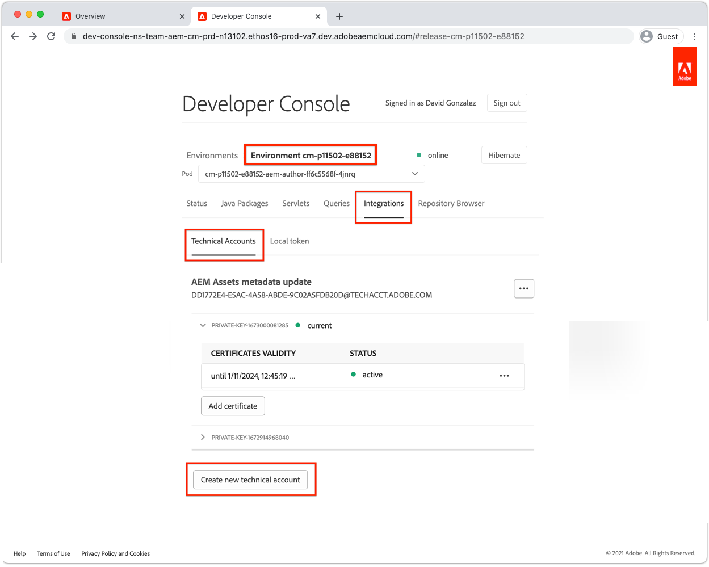

# 服务凭据

与Adobe Experience Manager (AEM)as a Cloud Service的集成必须能够安全地对AEM服务进行身份验证。 AEM开发人员控制台授予对服务凭据的访问权限，这些凭据用于促进外部应用程序、系统和服务通过HTTP以编程方式与AEM创作或发布服务交互。

>[!VIDEO](https://video.tv.adobe.com/v/330519?quality=12&learn=on)

服务凭据可能显示类似 [本地开发访问令牌](./local-development-access-token.md) 但在几个关键方面有所不同：

+ 服务凭据与技术帐户关联。 技术帐户可以激活多个服务凭据。
+ 服务凭据为 _非_ 访问令牌，而是用于 _获取_ 访问令牌。
+ 服务凭据更持久（其证书每365天过期一次），除非被吊销，否则不会更改，而本地开发访问令牌每天过期。
+ AEMas a Cloud Service环境的服务凭据映射到单个AEM技术帐户用户，而本地开发访问令牌作为生成访问令牌的AEM用户进行身份验证。
+ AEMas a Cloud Service环境最多可以有10个技术帐户，每个帐户都有自己的服务凭据，每个帐户都对应到离散的技术帐户AEM用户。

服务凭据及其生成的访问令牌以及本地开发访问令牌都应保密。 由于这三个组件都可以用于获取，因此可以访问它们各自的AEMas a Cloud Service环境。

## 生成服务凭据

服务凭据的生成分为两个步骤：

1. 由Adobe IMS组织管理员创建的一次性技术帐户
1. 下载和使用技术帐户的服务凭据JSON

### 创建技术帐户

与本地开发访问令牌不同，服务凭据要求技术帐户在下载之前由Adobe组织IMS管理员创建。 应为需要以编程方式访问AEM的每个客户端创建独立的技术帐户。


技术帐户只创建一次，但私钥用于管理与技术帐户关联的服务凭据可随着时间的推移进行管理。 例如，必须在当前私钥到期之前生成新的私钥/服务凭据，以允许用户不间断地访问服务凭据。

1. 确保您以下列身份登录：
   + __Adobe IMS组织的系统管理员__
   + 成员 __AEM管理员__ 上的IMS产品配置文件 __AEM创作__
1. 登录 [AdobeCloud Manager](https://my.cloudmanager.adobe.com)
1. 打开包含AEMas a Cloud Service环境的程序以集成为设置服务凭据
1. 点按中环境旁边的省略号 __环境__ 部分，然后选择 __开发人员控制台__
1. 点击 __集成__ 选项卡
1. 点按 __技术帐户__ 选项卡
1. 点按 __创建新的技术帐户__ 按钮
1. 技术帐户的服务凭据已初始化并显示为JSON



初始化AEM as aCloud Service环境的服务凭据后，Adobe IMS组织中的其他AEM开发人员可以下载它们。

### 下载服务凭据


下载服务凭据的步骤与初始化类似。

1. 确保您以下列身份登录：
   + __Adobe IMS组织管理员__
   + 成员 __AEM管理员__ 上的IMS产品配置文件 __AEM创作__
1. 登录 [AdobeCloud Manager](https://my.cloudmanager.adobe.com)
1. 打开包含要与集成的AEMas a Cloud Service环境的程序
1. 点按中环境旁边的省略号 __环境__ 部分，然后选择 __开发人员控制台__
1. 点击 __集成__ 选项卡
1. 点按 __技术帐户__ 选项卡
1. 展开 __技术帐户__ 将使用
1. 展开 __私钥__ 将下载其服务凭据，并验证状态为 __活动__
1. 点击 __...__ > __视图__ 与关联 __私钥__，其中显示服务凭据JSON
1. 点按左上角的下载按钮以下载包含服务凭据值的JSON文件，并将文件保存到安全位置

## 安装服务凭据

服务凭据提供生成JWT所需的详细信息，该JWT交换用于使用AEMas a Cloud Service进行身份验证的访问令牌。 服务凭据必须存储在可由其用于访问AEM的外部应用程序、系统或服务访问的安全位置。 每个客户的服务凭据的管理方式和位置都是唯一的。

为简单起见，本教程通过命令行在中传递服务凭据。 但是，请与您的IT安全团队合作，了解如何根据贵组织的安全指南存储和访问这些凭据。

1. 复制 [已下载服务凭据JSON](#download-service-credentials) 到名为的文件 `service_token.json` 在项目的根目录下
   + 记住，从不提交 _任何凭据_ 到Git！

## 使用服务凭据

服务凭据是一个完整格式的JSON对象，与JWT或访问令牌不同。 而是使用服务凭据（包含私钥）生成JWT，与Adobe IMS API交换访问令牌。


1. 从AEM开发人员控制台将服务凭据下载到一个安全位置
1. 外部应用程序需要以编程方式与AEMas a Cloud Service环境交互
1. 外部应用程序从安全位置读取服务身份证明
1. 外部应用程序使用服务凭据中的信息构建JWT令牌
1. JWT令牌会发送到Adobe IMS以交换访问令牌
1. Adobe IMS返回可用于访问AEMas a Cloud Service的访问令牌
   + 访问令牌无法更改过期时间。
1. 外部应用程序as a Cloud Service向AEM发出HTTP请求，将访问令牌作为持有者令牌添加到HTTP请求的授权标头
1. AEMas a Cloud Service接收HTTP请求，对请求进行身份验证，并执行HTTP请求所请求的工作，并将HTTP响应返回给外部应用程序

### 外部应用程序的更新

要使用服务凭据访问AEMas a Cloud Service，必须通过三种方式更新外部应用程序：

1. 读取服务凭据

+ 为简单起见，服务凭据将从下载的JSON文件中读取，但在实际使用场景中，服务凭据必须根据贵组织的安全指南进行安全存储

1. 从服务凭据生成JWT
1. 交换JWT以获取访问令牌

+ 当存在服务凭据时，当访问AEMas a Cloud Service时，外部应用程序使用此访问令牌，而不是本地开发访问令牌

在本教程中，Adobe `@adobe/jwt-auth` npm模块用于以下两者：(1)从服务凭据生成JWT，以及(2)在单个函数调用中将它交换为访问令牌。 如果您的应用程序不是基于JavaScript，请查看 [其他语言的示例代码](https://developer.adobe.com/developer-console/docs/guides/authentication/JWT/samples/) 了解如何从服务凭据创建JWT，并将其交换为与Adobe IMS的访问令牌。

## 读取服务凭据

查看 `getCommandLineParams()` 因此，请查看如何使用用于读取本地开发访问令牌JSON的相同代码读取服务凭据JSON文件。

```javascript
function getCommandLineParams() {
    ...

    // Read in the credentials from the provided JSON file
    // Since both the Local Development Access Token and Service Credentials files are JSON, this same approach can be re-used
    if (parameters.file) {
        parameters.developerConsoleCredentials = JSON.parse(fs.readFileSync(parameters.file));
    }

    ...
    return parameters;
}
```

## 创建JWT并交换访问令牌

读取服务凭据后，将使用这些凭据生成JWT，然后与Adobe IMS API交换访问令牌。 然后，可使用此访问令牌访问AEMas a Cloud Service。

此示例应用程序基于Node.js，因此最好使用 [@adobe/jwt-auth](https://www.npmjs.com/package/@adobe/jwt-auth) npm模块，以便(1) JWT的生成和(20)与Adobe IMS交换。 如果您的应用程序是使用其他语言开发的，请查阅 [相应的代码示例](https://developer.adobe.com/developer-console/docs/guides/authentication/JWT/samples/) 介绍如何使用其他编程语言构建针对Adobe IMS的HTTP请求。

1. 更新 `getAccessToken(..)` 检查JSON文件内容并确定它表示本地开发访问令牌还是服务凭据。 这可以通过检查是否存在 `.accessToken` 属性，对于本地开发访问令牌JSON仅存在该属性。

   如果提供了服务凭据，应用程序会生成JWT并将其与Adobe IMS交换访问令牌。 使用 [@adobe/jwt-auth](https://www.npmjs.com/package/@adobe/jwt-auth)的 `auth(...)` 函数生成JWT并在单个函数调用中将其交换为访问令牌。 要使用的参数 `auth(..)` 方法是 [JSON对象由特定信息组成](https://www.npmjs.com/package/@adobe/jwt-auth#config-object) 可从服务凭据JSON访问，如代码中的以下所述。

```javascript
 async function getAccessToken(developerConsoleCredentials) {

     if (developerConsoleCredentials.accessToken) {
         // This is a Local Development access token
         return developerConsoleCredentials.accessToken;
     } else {
         // This is the Service Credentials JSON object that must be exchanged with Adobe IMS for an access token
         let serviceCredentials = developerConsoleCredentials.integration;

         // Use the @adobe/jwt-auth library to pass the service credentials generated a JWT and exchange that with Adobe IMS for an access token.
         // If other programming languages are used, please see these code samples: https://www.adobe.io/authentication/auth-methods.html#!AdobeDocs/adobeio-auth/master/JWT/samples/samples.md
         let { access_token } = await auth({
             clientId: serviceCredentials.technicalAccount.clientId, // Client Id
             technicalAccountId: serviceCredentials.id,              // Technical Account Id
             orgId: serviceCredentials.org,                          // Adobe IMS Org Id
             clientSecret: serviceCredentials.technicalAccount.clientSecret, // Client Secret
             privateKey: serviceCredentials.privateKey,              // Private Key to sign the JWT
             metaScopes: serviceCredentials.metascopes.split(','),   // Meta Scopes defining level of access the access token should provide
             ims: `https://${serviceCredentials.imsEndpoint}`,       // IMS endpoint used to obtain the access token from
         });

         return access_token;
     }
 }
```

    现在，根据通过命令行参数传入的JSON文件（本地开发访问令牌JSON或服务凭据JSON），应用程序将派生访问令牌。
    
    请记住，虽然服务凭据每365天过期一次，但JWT和相应的访问令牌会频繁过期，并且需要在过期之前刷新。 可使用“refresh_token”[由Adobe IMS提供](https://www.adobe.io/authentication/auth-methods.html#!AdobeDocs/adobeio-auth/master/OAuth/OAuth.md#access-tokens)完成此操作。

1. 完成这些更改后，已从AEM开发人员控制台下载服务凭据JSON，为简化起见，另存为 `service_token.json` 在与此相同的文件夹中 `index.js`. 现在，让我们执行替换命令行参数的应用程序 `file` 替换为 `service_token.json`，并更新 `propertyValue` 转换为新值，以便在AEM中显现出明显效果。

   ```shell
   $ node index.js \
       aem=https://author-p1234-e5678.adobeaemcloud.com \
       folder=/wknd-shared/en/adventures/napa-wine-tasting \
       propertyName=metadata/dc:rights \
       propertyValue="WKND Restricted Use" \
       file=service_token.json
   ```

   输出到终端的外观如下所示：

   ```shell
   200 - OK @ https://author-p1234-e5678.adobeaemcloud.com/api/assets/wknd-shared/en/adventures/napa-wine-tasting.json
   403 - Forbidden @ https://author-p1234-e5678.adobeaemcloud.com/api/assets/wknd-shared/en/adventures/napa-wine-tasting/AdobeStock_277654931.jpg.json
   403 - Forbidden @ https://author-p1234-e5678.adobeaemcloud.com/api/assets/wknd-shared/en/adventures/napa-wine-tasting/AdobeStock_239751461.jpg.json
   403 - Forbidden @ https://author-p1234-e5678.adobeaemcloud.com/api/assets/wknd-shared/en/adventures/napa-wine-tasting/AdobeStock_280313729.jpg.json
   403 - Forbidden @ https://author-p1234-e5678.adobeaemcloud.com/api/assets/wknd-shared/en/adventures/napa-wine-tasting/AdobeStock_286664352.jpg.json
   ```

   此 __403 — 禁止访问__ 行，指示对AEMas a Cloud Service的HTTP API调用中有错误。 尝试更新资产的元数据时，会出现这403个禁止错误。

   原因是服务凭据派生的访问令牌使用自动创建的技术帐户AEM用户向AEM验证请求，默认情况下仅具有读取访问权限。 要提供应用程序对AEM的写入权限，必须在AEM中向与访问令牌关联的技术帐户AEM用户授予权限。

## 在AEM中配置访问权限

服务凭据派生的访问令牌使用的技术帐户AEM User在 __参与者__ AEM用户组。


一旦技术帐户AEM用户存在于AEM中（首先使用访问令牌进行HTTP请求后），就可以像管理其他AEM用户一样管理此AEM用户的权限。

1. 首先，通过打开从AEM开发人员控制台下载的服务凭据JSON找到技术帐户的AEM登录名，然后找到 `integration.email` 值，它应类似于： `12345678-abcd-9000-efgh-0987654321c@techacct.adobe.com`.
1. 以AEM管理员身份登录到相应的AEM环境的Author服务
1. 导航到 __工具__ > __安全性__ > __用户__
1. 找到具有的AEM用户 __登录名__ 已在步骤1中确定，并打开其 __属性__
1. 导航至 __组__ 选项卡，然后添加 __DAM用户__ 组（谁作为资产的写入权限）
   + [请参阅AEM提供的用户组的列表](https://experienceleague.adobe.com/docs/experience-manager-65/administering/security/security.html#built-in-users-and-groups) 以将服务用户添加到以获得最佳权限。 如果AEM提供的用户组不足以满足您的要求，请创建您自己的用户组，然后添加相应的权限。
1. 点按 __保存并关闭__

使用AEM中允许的技术帐户具有资产的写入权限，请重新运行应用程序：

```shell
$ node index.js \
    aem=https://author-p1234-e5678.adobeaemcloud.com \
    folder=/wknd-shared/en/adventures/napa-wine-tasting \
    propertyName=metadata/dc:rights \
    propertyValue="WKND Restricted Use" \
    file=service_token.json
```

输出到终端的外观如下所示：

```
200 - OK @ https://author-p1234-e5678.adobeaemcloud.com/api/assets/wknd-shared/en/adventures/napa-wine-tasting.json
200 - OK @ https://author-p1234-e5678.adobeaemcloud.com/api/assets/wknd-shared/en/adventures/napa-wine-tasting/AdobeStock_277654931.jpg.json
200 - OK @ https://author-p1234-e5678.adobeaemcloud.com/api/assets/wknd-shared/en/adventures/napa-wine-tasting/AdobeStock_286664352.jpg.json
200 - OK @ https://author-p1234-e5678.adobeaemcloud.com/api/assets/wknd-shared/en/adventures/napa-wine-tasting/AdobeStock_239751461.jpg.json
200 - OK @ https://author-p1234-e5678.adobeaemcloud.com/api/assets/wknd-shared/en/adventures/napa-wine-tasting/AdobeStock_280313729.jpg.json
```

## 验证更改

1. 登录到已更新的AEMas a Cloud Service环境（使用中提供的相同主机名） `aem` 命令行参数)
1. 导航至 __资产__ > __文件__
1. 导航到指定的资源文件夹。 `folder` 命令行参数，例如 __WKND__ > __英语__ > __冒险__ > __纳帕品酒会__
1. 打开 __属性__ 文件夹中的任何资产
1. 导航至 __高级__ 选项卡
1. 查看已更新属性的值，例如 __版权__ 映射到已更新的 `metadata/dc:rights` JCR属性，现在反映了 `propertyValue` 参数，例如 __WKND限制使用__


## 恭喜！

现在，我们使用本地开发访问令牌和可用于生产环境的服务到服务访问令牌以编程方式访问了AEMas a Cloud Service！
