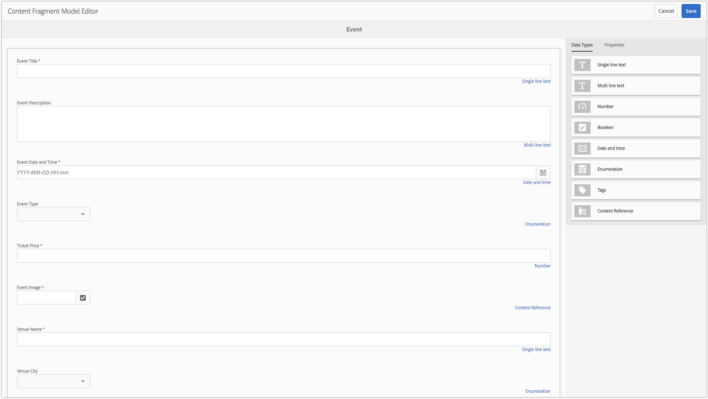

# 第2章 — 使用内容片段模型

AEM内容片段模型定义了内容架构，可用于模板AEM作者创建原始内容。 此方法与基架或基于表单的创作类似。 内容片段的关键概念是创作的内容与演示无关，这意味着创作内容专门用于多渠道使用，在这些使用中，无论是AEM、单页应用程序还是移动设备应用程序，内容都可控制向用户显示的方式。

内容片段的主要关注点是确保：

1. 从作者处收集正确的内容
2. 内容可以以结构化、易于理解的格式公开，以供使用应用程序。

本章介绍如何启用和定义内容片段模型，这些模型用于定义用于建模和创建“事件”的标准化数据结构和创作界面。

## 启用内容片段模型

内容片段模型 **必须** 通过启用 **[AEM [!UICONTROL 配置浏览器]](https://experienceleague.adobe.com/docs/experience-manager-cloud-service/implementing/developing/configurations.html)**.

如果内容片段模型为 **not** 为配置启用， **[!UICONTROL 创建] > [!UICONTROL 内容片段]** 按钮。

>[!NOTE]
>
>AEM配置表示一组 [上下文感知租户配置](https://sling.apache.org/documentation/bundles/context-aware-configuration/context-aware-configuration.html) 存储在 `/conf`. 通常，AEM配置会与AEM Sites中管理的特定网站或负责子集内容（资产、页面等）的业务部门关联 在AEM中。
>
>为了使配置影响内容层次结构，必须通过 `cq:conf` 属性。 (这是为 [!DNL WKND Mobile] 配置 **步骤5** )。
>
>当 `global` 使用配置时，配置适用于所有内容， `cq:conf` 无需设置。
>
>请参阅 [[!UICONTROL 配置浏览器] 文档](https://experienceleague.adobe.com/docs/experience-manager-cloud-service/implementing/developing/configurations.html) 以了解更多信息。

1. 以具有相应权限以用户身份登录AEM作者，以修改相关配置。
   * 在本教程中， **管理员** 用户。
1. 导航到 **[!UICONTROL 工具] > [!UICONTROL 常规] > [!UICONTROL 配置浏览器]**
1. 点按 **文件夹图标** 下一页 **[!DNL WKND Mobile]** ，然后点按 **[!UICONTROL 编辑] 按钮** 在左上角。
1. 选择 **[!UICONTROL 内容片段模型]**，然后点按 **[!UICONTROL 保存并关闭]** 在右上方。

   这样，就可以在具有 [!DNL WKND Mobile] 配置。

   >[!NOTE]
   >
   >此配置更改不可从 [!UICONTROL AEM配置] Web UI。 要撤消此配置，请执行以下操作：
   >    
   >    1. 打开 [CRXDE Lite](http://localhost:4502/crx/de)
   >    1. 导航至 `/conf/wknd-mobile/settings/dam/cfm`
   >    1. 删除 `models` 节点

   >    
   >在此配置下创建的任何现有内容片段模型都将被删除，并且其定义存储在 `/conf/wknd-mobile/settings/dam/cfm/models`.

1. 应用 **[!DNL WKND Mobile]** 配置 **[!DNL WKND Mobile]资产文件夹** 要允许在该Assets文件夹层次结构中创建内容片段模型中的内容片段，请执行以下操作：

   1. 导航到 **[!UICONTROL AEM] > [!UICONTROL 资产] > [!UICONTROL 文件]**
   1. 选择 **[!UICONTROL WKND Mobile] 文件夹**
   1. 点按 **[!UICONTROL 属性]** 按钮以打开 [!UICONTROL 文件夹属性]
   1. 在 [!UICONTROL 文件夹属性]，点按 **[!UICONTROL Cloud Services]** 选项卡
   1. 验证 **[!UICONTROL 云配置]** 字段设置为 **/conf/wknd-mobile**
   1. 点按 **[!UICONTROL 保存并关闭]** 用于保留更改的右上角

>[!VIDEO](https://video.tv.adobe.com/v/28336?quality=12&learn=on)

>[!WARNING]
>
> __内容片段模型__ 已从 __工具>资产__ to __工具>常规__.

## 了解要创建的内容片段模型

在定义内容片段模型之前，让我们先回顾一下我们将推动的体验，以确保捕获所有必需的数据点。 为此，我们将审阅移动应用程序设计，并将设计元素映射到要收集的内容。

我们可以按如下方式划分定义事件的数据点：

利用映射，我们可以定义用于收集和最终显示事件数据的内容片段。

## 创建内容片段模型

1. 导航到 **[!UICONTROL 工具] > [!UICONTROL 常规] > [!UICONTROL 内容片段模型]**.
1. 点按 **[!DNL WKND Mobile]** 文件夹。
1. 点按 **[!UICONTROL 创建]** 打开“内容片段模型”创建向导。
1. 输入 **[!DNL Event]** 作为 **[!UICONTROL 模型标题]** *（描述是可选的）* 点按 **[!UICONTROL 创建]** 保存。

>[!VIDEO](https://video.tv.adobe.com/v/28337?quality=12&learn=on)

## 定义内容片段模型的结构

1. 导航到 **[!UICONTROL 工具] > [!UICONTROL 常规] > [!UICONTROL 内容片段模型] >[!DNL WKND]**.
1. 选择 **[!DNL Event]** 内容片段模型并点按 **[!UICONTROL 编辑]** 中。
1. 从 **[!UICONTROL 数据类型] 选项卡** 在右侧，将 **[!UICONTROL 单行文本输入]** 放入左下拉区域以定义 **[!DNL Question]** 字段。
1. 确保新 **[!UICONTROL 单行文本输入]** ，并且 **[!UICONTROL 属性] 选项卡** 中，将选择该复选框。 按如下方式填充“属性”字段：

   * [!UICONTROL 呈现为] : `textfield`
   * [!UICONTROL 字段标签] : `Event Title`
   * [!UICONTROL 属性名称] : `eventTitle`
   * [!UICONTROL 最大长度] :25
   * [!UICONTROL 必需] : `Yes`

使用下面定义的输入定义重复这些步骤，以创建事件内容片段模型的其余部分。

>[!NOTE]
>
> 的 **属性名称** 字段必须完全匹配，因为Android应用程序已编程为关闭这些名称的键值。

### 事件描述

* [!UICONTROL 数据类型] : `Multi-line text`
* [!UICONTROL 字段标签] : `Event Description`
* [!UICONTROL 属性名称] : `eventDescription`
* [!UICONTROL 默认类型] : `Rich text`

### 事件日期和时间

* [!UICONTROL 数据类型] : `Date and time`
* [!UICONTROL 字段标签] : `Event Date and Time`
* [!UICONTROL 属性名称] : `eventDateAndTime`
* [!UICONTROL 必需] : `Yes`

### 事件类型

* [!UICONTROL 数据类型] : `Enumeration`
* [!UICONTROL 字段标签] : `Event Type`
* [!UICONTROL 属性名称] : `eventType`
* [!UICONTROL 选项] : `Art,Music,Performance,Photography`

### 票价

* [!UICONTROL 数据类型] : `Number`
* [!UICONTROL 呈现为] : `numberfield`
* [!UICONTROL 字段标签] : `Ticket Price`
* [!UICONTROL 属性名称] : `eventPrice`
* [!UICONTROL 类型] : `Integer`
* [!UICONTROL 必需] : `Yes`

### 事件图像

* [!UICONTROL 数据类型] : `Content Reference`
* [!UICONTROL 呈现为] : `contentreference`
* [!UICONTROL 字段标签] : `Event Image`
* [!UICONTROL 属性名称] : `eventImage`
* [!UICONTROL 根路径] : `/content/dam/wknd-mobile/images`
* [!UICONTROL 必需] : `Yes`

### 地点名称

* [!UICONTROL 数据类型] : `Single-line text`
* [!UICONTROL 呈现为] : `textfield`
* [!UICONTROL 字段标签] : `Venue Name`
* [!UICONTROL 属性名称] : `venueName`
* [!UICONTROL 最大长度] :20
* [!UICONTROL 必需] : `Yes`

### 文地市

* [!UICONTROL 数据类型] : `Enumeration`
* [!UICONTROL 字段标签] : `Venue City`
* [!UICONTROL 属性名称] : `venueCity`
* [!UICONTROL 选项] : `Basel,London,Los Angeles,Paris,New York,Tokyo`

>[!VIDEO](https://video.tv.adobe.com/v/28335?quality=12&learn=on)

>[!NOTE]
>
>的 **[!UICONTROL 属性名称]** 表示 **both** 存储此值的JCR属性名称以及JSON文件中的键。 这应该是一个在内容片段模型生命周期内不会发生更改的语义名称。

完成内容片段模型的创建后，您最终应该有一个如下的定义：

## 下一步

（可选）安装 [com.adobe.aem.guides.wknd-mobile.content.chapter-2.zip](https://github.com/adobe/aem-guides-wknd-mobile/releases/latest) AEM作者上的内容包(通过 [AEM包管理器](http://localhost:4502/crx/packmgr/index.jsp). 此包包含教程本部分中概述的配置和内容。

* [第3章 — 创作事件内容片段](./chapter-3.md)
