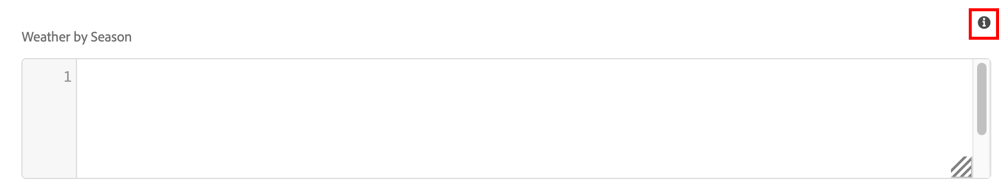

# 创作内容片段

在 [上一章](/help/headless-tutorial/graphql/advanced-graphql/create-content-fragment-models.md)，您已创建五个内容片段模型：人员、团队、位置、地址和联系信息。 本章将指导您完成基于这些模型创建内容片段的步骤。 它还探讨了如何创建文件夹策略以限制可在文件夹中使用的内容片段模型。

## 前提条件 {#prerequisites}

本文档是多部分教程的一部分。 请确保 [上一章](create-content-fragment-models.md) 已完成，然后再继续本章。

## 目标 {#objectives}

在本章中，了解如何：

* 使用文件夹策略创建文件夹并设置限制
* 直接从内容片段编辑器创建片段引用
* 使用选项卡、日期和JSON对象数据类型
* 将内容和片段引用插入到多行文本编辑器中
* 添加多个片段引用
* 嵌套内容片段

## 安装示例内容 {#sample-content}

安装一个AEM包，其中包含多个文件夹和用于加速教程的示例图像。

1. 下载 [Advanced-GraphQL-Tutorial-Starter-Package-1.1.zip](/help/headless-tutorial/graphql/advanced-graphql/assets/tutorial-files/Advanced-GraphQL-Tutorial-Starter-Package-1.1.zip)
1. 在AEM中，导航到 **工具** > **部署** > **包** 访问 **包管理器**.
1. 上载并安装在上一步中下载的软件包（zip文件）。

   

## 使用文件夹策略创建文件夹并设置限制

从AEM主页中，选择 **资产** > **文件** > **WKND已共享** > **英语**. 在这里，您可以看到各种内容片段类别，包括冒险和参与者。

### 创建文件夹 {#create-folders}

导航到 **冒险** 文件夹。 您可以看到已创建团队和位置文件夹来存储团队和位置内容片段。

为基于人员内容片段模型的讲师内容片段创建文件夹。

1. 从“冒险”页面中，选择 **创建** > **文件夹** 在右上角。

   

1. 在出现的创建文件夹模式中，在 **标题** 字段。 记下结尾的“s”。 包含多个片段的文件夹的标题必须为复数。 选择&#x200B;**创建**。

   

   您现在已创建用于存储冒险讲师的文件夹。

### 使用文件夹策略设置限制

AEM允许您定义内容片段文件夹的权限和策略。 通过使用权限，您可以仅向特定用户（作者）或作者组授予对特定文件夹的访问权限。 通过使用文件夹策略，您可以限制作者在这些文件夹中可以使用的内容片段模型。 在此示例中，我们将文件夹限制为人员和联系信息模型。 配置文件夹策略：

1. 选择 **讲师** 已创建的文件夹，然后选择 **属性** 从顶部导航栏中。

   

1. 选择 **策略** 选项卡，然后取消选择 **继承自/content/dam/wknd-shared**. 在 **按路径允许的内容片段模型** 字段中，选择文件夹图标。

   

1. 在打开的“选择路径”对话框中，按照路径进行操作 **会议** > **WKND已共享**. 在上一章中创建的人员内容片段模型包含对联系信息内容片段模型的引用。 必须在“讲师”文件夹中同时允许使用人员和联系信息模型，才能创建讲师内容片段。 选择 **人员** 和 **联系信息**，然后按键 **选择** 以关闭对话框。

   

1. 选择 **保存并关闭** 并选择 **确定** 在显示的成功对话框中。

1. 您现在已为“讲师”文件夹配置了文件夹策略。 导航到 **讲师** 文件夹并选择 **创建** > **内容片段**. 您现在可以选择的模型只有 **人员** 和 **联系信息**.

   

## 为讲师创作内容片段

导航到 **讲师** 文件夹。 从此处，我们创建一个嵌套文件夹来存储讲师的联系信息。

请按照 [创建文件夹](#create-folders) 创建名为“联系人信息”的文件夹。 嵌套文件夹继承父文件夹的文件夹策略。 请随意配置更具体的策略，以便新创建的文件夹仅允许使用联系信息模型。

### 创建讲师内容片段

让我们创建四个可以添加到冒险讲师团队中的人员。

1. 在“讲师”文件夹中，创建一个基于人员内容片段模型的内容片段，并将其标题命名为“Jacob Wester”。

   新创建的内容片段如下所示：

   

1. 在字段中输入以下内容：

   * **全名**：雅各布·韦斯特
   * **传记**：雅各布·韦斯特当了10年远足教练，喜欢这几乎每一分钟！ 雅各布是一名探险家，擅长攀岩和背包。 雅各布是攀岩比赛的赢家，包括海湾之战攀岩比赛。 雅各布现在住在加利福尼亚。
   * **讲师经验级别**：专家
   * **技能**：攀岩、冲浪、背包
   * **管理员详细信息**：雅各布·韦斯特三年来一直在协调背包冒险。

1. 在 **个人资料图片** 字段，添加对图像的内容引用。 浏览至 **WKND已共享** > **英语** > **参与者** > **jacob_wester.jpg** 创建图像的路径。

### 从内容片段编辑器创建片段引用 {#fragment-reference-from-editor}

AEM允许您直接从内容片段编辑器创建片段引用。 让我们创建一个引用Jacob的联系信息。

1. 选择 **新内容片段** 在 **联系信息** 字段。

   

1. 此时将打开新内容片段模式窗口。 在选择目标选项卡下，按照以下路径操作 **冒险** > **讲师** 并选中旁边的复选框 **联系信息** 文件夹。 选择 **下一个** 以继续访问“属性”选项卡。

   

1. 在属性选项卡下，在 **标题** 字段。 选择 **创建**，然后按键 **打开** 在显示的成功对话框中。

   

   显示的新字段允许您编辑联系人信息内容片段。

   

1. 在字段中输入以下内容：

   * **电话**：209-888-0000
   * **电子邮件**： jwester@wknd.com

   完成后，选择 **保存**. 您现在已创建了一个联系信息内容片段。

1. 要导航回讲师内容片段，请选择 **雅各布·韦斯特** 在编辑器的左上角。

   

   此 **联系信息** 字段现在包含引用的联系人信息片段的路径。 这是一个嵌套片段引用。 完成的讲师内容片段如下所示：

   

1. 选择 **保存并关闭** 以保存内容片段。 您现在有了一个新的讲师内容片段。

### 创建其他片段

遵循中概述的相同流程 [上一节](#fragment-reference-from-editor) 创建三个额外的讲师内容片段和三个联系信息内容片段。 在讲师片段中添加以下内容：

**史黛西·罗斯韦尔斯**

| 字段 | 值 |
| --- | --- |
| 内容片段标题 | 史黛西·罗斯韦尔斯 |
| 完整名称 | 史黛西·罗斯韦尔斯 |
| 联系信息 | /content/dam/wknd-shared/en/adventures/instructors/contact-info/stacey-roswells-contact-info |
| 个人资料图片 | /content/dam/wknd-shared/en/contributors/stacey-roswells.jpg |
| 传记 | 史黛西·罗斯威尔是一位高超的攀岩家和高山冒险家。 斯泰西出生于马里兰州巴尔的摩，是六个孩子中的老幺。 斯泰西的父亲是美国海军中校，母亲是一位现代舞蹈教练。 斯泰西的家人经常因父亲的职务任务而搬家，并在父亲驻泰国时拍摄了第一张照片。 这也是史黛西学会攀岩的地方。 |
| 讲师经验级别 | 高级 |
| 技能 | 攀岩 | 滑雪 | 背包 |

**Kumar Selvaraj**

| 字段 | 值 |
| --- | --- |
| 内容片段标题 | Kumar Selvaraj |
| 完整名称 | Kumar Selvaraj |
| 联系信息 | /content/dam/wknd-shared/en/adventures/instructors/contact-info/kumar-selvaraj-contact-info |
| 个人资料图片 | /content/dam/wknd-shared/en/contributors/kumar-selvaraj.jpg |
| 传记 | Kumar Selvaraj是一名经验丰富的AMGA认证专业讲师，其主要目标是帮助学生提高攀爬和徒步旅行技能。 |
| 讲师经验级别 | 高级 |
| 技能 | 攀岩 | 背包 |

**阿依奥·奥贡塞因德**

| 字段 | 值 |
| --- | --- |
| 内容片段标题 | 阿依奥·奥贡塞因德 |
| 完整名称 | 阿依奥·奥贡塞因德 |
| 联系信息 | /content/dam/wknd-shared/en/adventures/instructors/contact-info/ayo-ogunseinde-contact-info |
| 个人资料图片 | /content/dam/wknd-shared/en/contributors/ayo-ogunseinde-237739.jpg |
| 传记 | Ayo Ogunseinde是一名职业登山师和背包教练，居住在中加利福利亚州弗雷斯诺市。 Ayo的目标是引导徒步旅行者进行他们最壮观的国家公园冒险。 |
| 讲师经验级别 | 高级 |
| 技能 | 攀岩 | 循环 | 背包 |

离开 **其他信息** 字段为空。

在联系信息片段中添加以下信息：

| 内容片段标题 | 手机 | 电子邮件 |
| ------- | -------- | -------- |
| Stacey Roswells联系信息 | 209-888-0011 | sroswells@wknd.com |
| Kumar Selvaraj联系信息 | 209-888-0002 | kselvaraj@wknd.com |
| Ayo Ogunseinde联系信息 | 209-888-0304 | aogunseinde@wknd.com |

您现在可以创建团队！

## 创作位置的内容片段

导航到 **位置** 文件夹。 在这里，您会看到两个已创建的嵌套文件夹：约塞米蒂国家公园和约塞米蒂山谷旅馆。


暂时忽略Yosemite Valley Lodge文件夹。 在本节的后面部分，当我们创建一个位置作为讲师团队的Home Base时，我们又会返回到此位置。

导航到 **约塞米蒂国家公园** 文件夹。 目前，其中只包含约塞米蒂国家公园的图片。 让我们使用位置内容片段模型创建一个内容片段，并将其命名为“Yosemite National Park”。

### 制表符占位符

AEM允许您使用选项卡占位符对不同类型的内容进行分组，并使内容片段更易于阅读和管理。 在上一章中，您向“位置”模型添加了制表符占位符。 因此，位置内容片段现在包含两个选项卡部分： **位置详细信息** 和 **位置地址**.


此 **位置详细信息** 选项卡包含 **名称**， **描述**， **联系信息**， **位置图像**、和 **按季节显示天气** 字段，而 **位置地址** 选项卡包含对地址内容片段的引用。 通过选项卡，可以清楚了解必须填充的内容类型，因此创作内容更易于管理。

### JSON对象数据类型

此 **按季节显示天气** 字段是一种JSON对象数据类型，这意味着它接受JSON格式的数据。 此数据类型非常灵活，可用于要包含在内容中的任何数据。

您可以通过将鼠标悬停在字段右侧的信息图标上，查看在上一章中创建的字段说明。



在这种情况下，我们需要提供位置的平均天气。 输入以下数据：

```json
{
    "summer": "81 / 89°F",
    "fall": "56 / 83°F",
    "winter": "46 / 51°F",
    "spring": "57 / 71°F"
}
```

此 **按季节显示天气** 字段现在应当如下所示：


### 添加内容

让我们将其余内容添加到位置内容片段，以便在下一章中使用GraphQL查询信息。

1. 在 **位置详细信息** 选项卡，在字段中输入以下信息：

   * **名称**：约塞米蒂国家公园
   * **描述**：约塞米蒂国家公园位于加利福尼亚的内华达山脉。 它以华丽的瀑布、巨大的红杉树以及埃尔卡皮坦和半圆顶悬崖的标志性景色而闻名。 徒步旅行和露营是体验约塞米蒂的最佳方式。 许多小径为探险和探索提供了无穷无尽的机会。

1. 从 **联系信息** 字段中，根据联系信息模型创建内容片段，并将其标题为“Yosemite National Park Contact Info”。 遵循上一节中概述的相同流程 [从编辑器创建片段引用](#fragment-reference-from-editor) 并在字段中输入以下数据：

   * **电话**：209-999-0000
   * **电子邮件**： yosemite@wknd.com

1. 从 **位置图像** 字段，浏览至 **冒险** > **位置** > **约塞米蒂国家公园** > **约塞米蒂国家公园.jpeg** 创建图像的路径。

   请记住，在上一章中，您配置了图像验证，因此“位置”图像的尺寸必须小于2560 x 1800，并且其文件大小必须小于3 MB。

1. 在添加所有信息后， **位置详细信息** 选项卡现在看起来像这样：

   

1. 导航到 **位置地址** 选项卡。 从 **地址** 字段中，使用您在上一章中创建的地址内容片段模型创建标题为“Yosemite National Park Address”的内容片段。 遵循以下章节中概述的相同流程 [从编辑器创建片段引用](#fragment-reference-from-editor) 并在字段中输入以下数据：

   * **街道地址**：咖哩村路9010号
   * **城市**：约塞米蒂谷
   * **状态**： CA
   * **邮政编码**：95389
   * **国家/地区**：美国

1. 已完成 **位置地址** 约塞米蒂国家公园片段的选项卡如下所示：

   

1. 选择&#x200B;**保存并关闭**。

### 再创建一个片段

1. 导航到 **约塞米蒂谷旅馆** 文件夹。 使用位置内容片段模型创建内容片段，并将其命名为“Yosemite Valley Lodge”。

1. 在 **位置详细信息** 选项卡，在字段中输入以下信息：

   * **名称**：约塞米蒂谷旅馆
   * **描述**：约塞米蒂山谷旅舍是一个团体会议和各种活动（如购物、用餐、钓鱼、远足等）的中心。

1. 从 **联系信息** 字段中，根据联系人信息模型创建一个内容片段，并将其标题命名为“Yosemite Valley Lodge联系人信息”。 遵循以下章节中概述的相同流程 [从编辑器创建片段引用](#fragment-reference-from-editor) 并在新内容片段的字段中输入以下数据：

   * **电话**：209-992-0000
   * **电子邮件**： yosemitelodge@wknd.com

   保存新创建的内容片段。

1. 导航回到 **约塞米蒂谷旅馆** 然后转到 **位置地址** 选项卡。 从 **地址** 字段，使用您在上一章中创建的地址内容片段模型创建标题为“Yosemite Valley Lodge Address”的内容片段。 遵循以下章节中概述的相同流程 [从编辑器创建片段引用](#fragment-reference-from-editor) 并在字段中输入以下数据：

   * **街道地址**：约塞米蒂山庄通道9006号
   * **城市**：约塞米蒂国家公园
   * **状态**： CA
   * **邮政编码**：95389
   * **国家/地区**：美国

   保存新创建的内容片段。

1. 导航回到 **约塞米蒂谷旅馆**，然后选择 **保存并关闭**. 此 **约塞米蒂谷旅馆** 文件夹现在包含三个内容片段：Yosemite Valley Lodge、Yosemite Valley Lodge联系信息和Yosemite Valley Lodge地址。

   

## 创作团队内容片段

浏览文件夹到 **团队** > **Yosemite团队**. 您可以看到Yosemite Team文件夹当前仅包含团队徽标。


让我们使用团队内容片段模型创建一个内容片段，并将其命名为“Yosemite团队”。

### 多行文本编辑器中的内容和片段引用

AEM允许您直接将内容和片段引用添加到多行文本编辑器中，并在以后使用GraphQL查询检索它们。 让我们将内容和片段引用添加到 **描述** 字段。

1. 首先，将以下文本添加到 **描述** 球场： “在约塞米蒂国家公园工作的专业冒险家和登山指导员团队。”

1. 要添加内容引用，请选择 **插入资源** 图标（位于多行文本编辑器的工具栏中）。

   

1. 在显示的模式窗口中，选择 **team-yosemite-logo.png** 并按 **选择**.

   

   内容引用现已添加到 **描述** 字段。

请记住，在上一章中，您允许将片段引用添加到 **描述** 字段。 让我们在此处添加一个。

1. 选择 **插入内容片段** 图标（位于多行文本编辑器的工具栏中）。

   

1. 浏览至 **WKND已共享** > **英语** > **冒险** > **位置** > **约塞米蒂谷旅馆** > **约塞米蒂谷旅馆**. 按 **选择** 以插入内容片段。

   

   此 **描述** 字段现在如下所示：

   

现在，您已将内容和片段引用直接添加到多行文本编辑器中。

### 日期和时间数据类型

让我们看一下“日期和时间”数据类型。 选择 **日历** 图标（位于页面右侧） **团队创建日期** 用于打开日历视图的字段。


可以使用月份两侧的向前和向后箭头设置过去日期或未来日期。 比方说，约塞米蒂团队于2016年5月24日成立，因此我们将确定成立日期。

### 添加多个片段引用

让我们向团队成员片段引用添加讲师。

1. 选择 **添加** 在 **团队成员** 字段。

   

1. 在显示的新字段中，选择文件夹图标以打开“选择路径”模式窗口。 浏览文件夹至 **WKND已共享** > **英语** > **冒险** > **讲师**，然后选中旁边的复选框 **雅各韦斯特**. 按 **选择** 以保存路径。

   

1. 选择 **添加** 再按三下。 使用新字段将剩余的三个讲师添加到团队。 此 **团队成员** 字段现在如下所示：

   

1. 选择 **保存并关闭** 以保存团队内容片段。

### 向冒险内容片段添加片段引用

最后，让我们将新创建的内容片段添加到冒险。

1. 导航到 **冒险** > **Yosemite背包** 然后打开Yosemite背包内容片段。 在表单底部，您可以看到在上一章中创建的三个字段： **位置**， **讲师团队**、和 **管理员**.

1. 在中添加片段引用 **位置** 字段。 位置路径应引用您创建的Yosemite国家公园内容片段： `/content/dam/wknd-shared/en/adventures/locations/yosemite-national-park/yosemite-national-park`.

1. 在中添加片段引用 **讲师团队** 字段。 团队路径应引用您创建的Yosemite团队内容片段： `/content/dam/wknd-shared/en/adventures/teams/yosemite-team/yosemite-team`. 这是一个嵌套片段引用。 团队内容片段包含对人员模型的引用，其中引用了联系信息和地址模型。 因此，您的嵌套内容片段向下三层显示。

1. 在中添加片段引用 **管理员** 字段。 假设雅各布·韦斯特是Yosemite背包冒险活动的管理员。 路径应该指向Jacob Wester内容片段并显示如下： `/content/dam/wknd-shared/en/adventures/instructors/jacob-wester`.

1. 您现在为冒险内容片段添加了三个片段引用。 这些字段如下所示：

   

1. 选择 **保存并关闭** 以保存您的内容。

## 恭喜！

恭喜！您现在已根据上一章中创建的高级内容片段模型创建了内容片段。 您还创建了一个文件夹策略以限制可以在文件夹中选择哪些内容片段模型。

## 后续步骤

在 [下一章](/help/headless-tutorial/graphql/advanced-graphql/explore-graphql-api.md)，您将了解有关使用GraphiQL Integrated Development Environment (IDE)发送高级GraphQL查询的信息。 这些查询允许我们查看在本章中创建的数据，并最终将这些查询添加到WKND应用程序。
