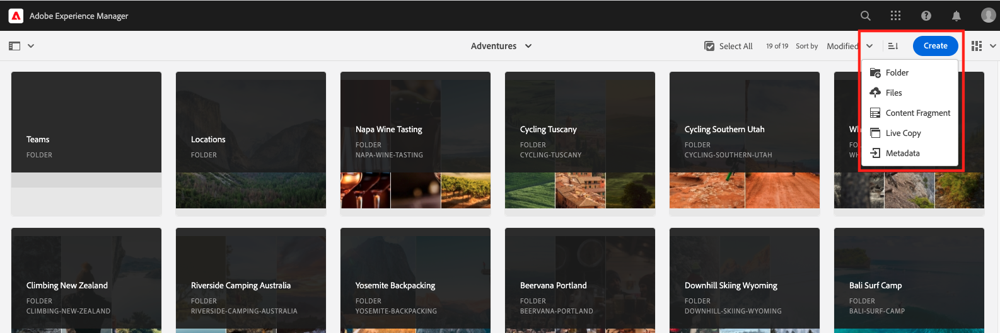

# 创作内容片段

在 [上一章节](/help/headless-tutorial/graphql/advanced-graphql/create-content-fragment-models.md)，则您创建了五个内容片段模型：人员、团队、位置、地址和联系信息。 本章将指导您完成根据这些模型创建内容片段的步骤。 它还探讨如何创建文件夹策略以限制可在文件夹中使用的内容片段模型。

## 前提条件 {#prerequisites}

本文档是多部分教程的一部分。 在继续处理本章之前，请确保已完成前几章。

## 目标 {#objectives}

在本章中，了解如何：

* 使用文件夹策略创建文件夹并设置限制
* 直接从内容片段编辑器创建片段引用
* 使用选项卡、日期和JSON对象数据类型
* 在多行文本编辑器中插入内容和片段引用
* 添加多个片段引用
* 嵌套内容片段

## 安装示例内容 {#sample-content}

安装一个AEM包，其中包含用于加速教程的多个文件夹和示例图像。

1. 下载 [Advanced-GraphQL-Tutorial-Starter-Package-1.0.zip](/help/headless-tutorial/graphql/advanced-graphql/assets/tutorial-files/Advanced-GraphQL-Tutorial-Starter-Package-1.0.zip)
1. 在AEM中，导航到 **工具** > **部署** > **包** 访问 **包管理器**.
1. 上载并安装在上一步中下载的包（zip文件）。

   

## 使用文件夹策略创建文件夹并设置限制

从AEM主页中，选择 **资产** > **文件** > **WKND站点** > **英语**. 在这里，您可以看到各种内容片段类别，包括在上一个版本中探索的冒险和参与者 [多步GraphQL教程](../multi-step/overview.md).

### 创建文件夹 {#create-folders}

导航到 **冒险** 文件夹。 您可以看到，已为团队和位置创建文件夹以存储团队和位置内容片段。

为基于人员内容片段模型的讲师内容片段创建文件夹。

1. 从历险记页面中，选择 **创建** > **文件夹** 中。

   

1. 在显示的“创建文件夹”模式中，在 **标题** 字段。 在末尾记下“s”。 包含多个片段的文件夹的标题必须是复数。 选择&#x200B;**创建**。

   

   您现在已创建一个文件夹来存储Adventure Auditors。

### 使用文件夹策略设置限制

AEM允许您为内容片段文件夹定义权限和策略。 通过使用权限，您只能授予特定用户（作者）或作者组对特定文件夹的访问权限。 通过使用文件夹策略，您可以限制作者在这些文件夹中可以使用的内容片段模型。 在本例中，我们将文件夹限制为“人员”和“联系信息”模型。 要配置文件夹策略，请执行以下操作：

1. 选择 **讲师** 已创建的文件夹，然后选择 **属性** 中。

   

1. 选择 **策略** 选项卡，然后取消选择 **继承自/content/dam/wknd**. 在 **允许的内容片段模型（按路径）** 字段中，选择文件夹图标。

   

1. 在打开的“选择路径”对话框中，按照路径 **conf** > **WKND站点**. 在上一章中创建的人员内容片段模型包含对联系信息内容片段模型的引用。 必须在Aditors文件夹中允许使用“人员”和“联系信息”模型，才能创建教师内容片段。 选择 **人员** 和 **联系信息**，然后按 **选择** 来关闭对话框。

   

1. 选择 **保存并关闭** 选择 **确定** 在显示的成功对话框中。

1. 您现在为Aditors文件夹配置了文件夹策略。 导航到 **讲师** 文件夹，选择 **创建** > **内容片段**. 现在，您只能选择 **人员** 和 **联系信息**.

   

## 为讲师创作内容片段

导航到 **讲师** 文件夹。 从此处，让我们创建一个嵌套文件夹来存储讲师的联系信息。

按照 [创建文件夹](#create-folders) 创建标题为“联系信息”的文件夹。 请注意，嵌套文件夹会继承父文件夹的文件夹策略。 请随时配置更具体的策略，以便新创建的文件夹仅允许使用联系信息模型。

### 创建讲师内容片段

让我们创建四个可添加到冒险指导团队的人员。 重复使用在上一版本中创建的参与者内容片段的图像和名称 [多步GraphQL教程](../multi-step/author-content-fragments.md). 虽然上一个教程概述了如何创建基本内容片段，但本教程重点介绍了更高级的功能。

1. 从指导者文件夹中，根据人员内容片段模型创建新的内容片段，并为其提供“Jacob Wester”标题。

   新创建的内容片段如下所示：

   

1. 在字段中输入以下内容：

   * **全名**:雅各布·韦斯特
   * **传记**:雅各布·韦斯特是徒步教练10年了，每时每刻都很喜欢！ 他是个探险家，有攀岩和背包的天赋。 雅各布是攀岩比赛的胜者，包括海湾巨石竞赛。 他目前住在加州。
   * **讲师体验级别**:专家
   * **技能**:攀岩、冲浪、背包
   * **管理员详细信息**:雅各布·韦斯特已经协调了三年的背包冒险。

1. 在 **配置文件图片** 字段中，添加对图像的内容引用。 浏览到 **WKND站点** > **英语** > **参与者** > **jacob_wester.jpg** 创建图像路径。

### 从内容片段编辑器中创建新片段引用 {#fragment-reference-from-editor}

AEM允许您直接从内容片段编辑器创建片段引用。 让我们创建Jacob的联系方式。

1. 选择 **新内容片段** 下面 **联系信息** 字段。

   

1. 将打开新内容片段模式。 在选择目标选项卡下，按照路径 **冒险** > **讲师** 并选中 **联系信息** 文件夹。 选择 **下一个** ，以转到属性选项卡。

   

1. 在“属性”选项卡下，在 **标题** 字段。 选择 **创建**，然后按 **打开** 在显示的成功对话框中。

   

   此时会显示新字段，用于编辑联系信息内容片段。

   

1. 在字段中输入以下内容：

   * **电话**:209-888-0000
   * **电子邮件**:jwester@wknd.com

   完成后，选择 **保存**. 您现在已创建新的联系信息内容片段。

1. 要导航回教师内容片段，请选择 **雅各布·韦斯特** 中。

   

   的 **联系信息** 字段现在包含引用的联系信息片段的路径。 这是嵌套的片段引用。 完成的教师内容片段如下所示：

   

1. 选择 **保存并关闭** 以保存内容片段。 您现在有新的讲师内容片段。

### 创建其他片段

按照 [上一部分](#fragment-reference-from-editor) 为这些讲师创建三个指导员内容片段和三个联系信息内容片段。 在指导者片段中添加以下内容：

**史黛西·罗斯威尔斯**

| 字段 | 值 |
| --- | --- |
| 内容片段标题 | 史黛西·罗斯威尔斯 |
| 完整名称 | 史黛西·罗斯威尔斯 |
| 联系信息 | /content/dam/wknd/en/adventures/auditers/contact-info/stacey-roswells-contact-info |
| 配置文件图片 | /content/dam/wknd/en/contributors/stacey-roswells.jpg |
| 传记 | 史黛西·罗斯威尔斯是一位杰出的攀岩者和高山探险家。 斯泰西出生于马里兰州巴尔的摩，是六个孩子中的老幺。 她父亲是美国海军中校，母亲是现代舞教师。 她的家人经常随父亲的任务搬走，她在泰国驻扎时照了第一张照片。 这也是史黛西学会攀岩的地方。 |
| 讲师体验级别 | 高级 |
| 技能 | 攀岩 |滑雪 |回装 |

**库马尔·塞尔瓦拉伊**

| 字段 | 值 |
| --- | --- |
| 内容片段标题 | 库马尔·塞尔瓦拉伊 |
| 完整名称 | 库马尔·塞尔瓦拉伊 |
| 联系信息 | /content/dam/wknd/en/adventures/auditers/contact-info/kumar-selvaraj-contact-info |
| 配置文件图片 | /content/dam/wknd/en/contributors/Kumar_Selvaraj.JPG |
| 传记 | Kumar Selvaraj是一名经验丰富的AMGA认证专业讲师，主要目标是帮助学生提高攀岩和徒步技能。 |
| 讲师体验级别 | 高级 |
| 技能 | 攀岩 |回装 |

**奥贡辛德代**

| 字段 | 值 |
| --- | --- |
| 内容片段标题 | 奥贡辛德代 |
| 完整名称 | 奥贡辛德代 |
| 联系信息 | /content/dam/wknd/en/adventures/auditors/contact-info/ayo-ogunseinde contact-info |
| 配置文件图片 | /content/dam/wknd/en/contributors/ayo-ogunseinde-237739.jpg |
| 传记 | Ayo Ogunseinde是一名职业登山者和背包教练，住在加州中部弗雷斯诺。 她的目标是引导徒步旅行者进行他们最伟大的国家公园冒险。 |
| 讲师体验级别 | 高级 |
| 技能 | 攀岩 |循环 |回装 |

离开 **其他信息** 字段为空。

在联系信息片段中添加以下信息：

| 内容片段标题 | 手机 | 电子邮件 |
| ------- | -------- | -------- |
| Stacey Roswells联系信息 | 209-888-0011 | sroswells@wknd.com |
| 库马尔·塞尔瓦拉伊联系信息 | 209-888-0002 | kselvaraj@wknd.com |
| Ayo Ogunseinde联系信息 | 209-888-0304 | aogunseinde@wknd.com |

您现在可以创建团队了！

## 位置的创作内容片段

导航到 **位置** 文件夹。 在此，您会看到两个已创建的嵌套文件夹：约塞米蒂国家公园和约塞米蒂谷旅馆。


暂时忽略Yosemite Valley Lodge文件夹。 当我们创建一个新位置以作为我们讲师团队的主基地时，我们将在本节的稍后部分中返回到该位置。

导航到 **约塞米蒂国家公园** 文件夹。 目前，它只包含约塞米蒂国家公园的一幅图片。 让我们使用位置内容片段模型创建一个新的内容片段，并将其命名为“Yosemite National Park”。

### 制表符占位符

AEM允许您使用选项卡占位符对不同类型的内容进行分组，并使内容片段更易于读取和管理。 在上一章中，您向位置模型添加了选项卡占位符。 因此，位置内容片段现在具有两个选项卡部分： **位置详细信息** 和 **位置地址**.


的 **位置详细信息** 选项卡 **名称**, **描述**, **联系信息**, **位置图像**&#x200B;和 **各季天气** 字段，而 **位置地址** 选项卡包含对地址内容片段的引用。 通过选项卡可明确必须填写哪些类型的内容，因此创作内容更易于管理。

### JSON对象数据类型

的 **各季天气** 字段是JSON对象数据类型，这意味着它接受JSON格式的数据。 此数据类型非常灵活，可用于要包含在内容中的任何数据。

您可以将鼠标悬停在字段右侧的信息图标上，以查看在上一章中创建的字段描述。


在这种情况下，我们需要提供该位置的平均天气。 输入以下数据：

```json
{
    "summer": "81 / 89°F",
    "fall": "56 / 83°F",
    "winter": "46 / 51°F",
    "spring": "57 / 71°F"
}
```

的 **各季天气** 字段现在应如下所示：


### 添加内容

让我们将其余内容添加到位置内容片段，以便在下一章中使用GraphQL查询信息。

1. 在 **位置详细信息** 选项卡，在字段中输入以下信息：

   * **名称**:约塞米蒂国家公园
   * **描述**:约塞米蒂国家公园位于加州内华达山脉。 酒店以其华丽的瀑布、巨大的红杉树以及El Capitan和Half Dome悬崖的标志性景致而闻名。 徒步旅行和露营是体验约塞米蒂的最佳方式。 无数的小径为探险和探索提供无尽的机会。

1. 从 **联系信息** 字段中，根据“联系信息”模型创建新的“内容片段”，并将其命名为“Yosemite National Park联系信息”。 遵循上一节中所述的相同流程 [从编辑器中创建新片段引用](#fragment-reference-from-editor) 并在字段中输入以下数据：

   * **电话**:209-999-0000
   * **电子邮件**:yosemite@wknd.com

1. 从 **位置图像** 字段，浏览 **冒险** > **位置** > **约塞米蒂国家公园** > **yosemite-national-park.jpeg** 创建图像路径。

   请记住，在上一章中您配置了图像验证，因此位置图像的尺寸必须小于2560 x 1800，并且其文件大小必须小于3 MB。

1. 添加所有信息后， **位置详细信息** 选项卡现在如下所示：

   

1. 导航到 **位置地址** 选项卡。 从 **地址** 字段中，使用您在上一章中创建的地址内容片段模型，创建标题为“Yosemite国家公园地址”的新内容片段。 按照 [从编辑器中创建新片段引用](#fragment-reference-from-editor) 并在字段中输入以下数据：

   * **街道地址**:柯里村路9010号
   * **城市**:约塞米蒂谷
   * **州**:CA
   * **邮政编码**:95389
   * **国家/地区**:美国

1. 已完成 **位置地址** 约塞米蒂国家公园片段的选项卡如下所示：

   

1. 选择&#x200B;**保存并关闭**。

### 创建其他片段

1. 导航到 **约塞米蒂谷旅馆** 文件夹。 使用位置内容片段模型创建新的内容片段，并将其命名为“Yosemite Valley Lodge”。

1. 在 **位置详细信息** 选项卡，在字段中输入以下信息：

   * **名称**:约塞米蒂谷旅馆
   * **描述**:Yosemite Valley Lodge酒店是集体会议和各种活动的中心，例如购物、餐饮、钓鱼、远足等。

1. 从 **联系信息** 字段中，根据“联系信息”模型创建新的“内容片段”，并将其命名为“Yosemite Valley Lodge联系信息”。 按照 [从编辑器中创建新片段引用](#fragment-reference-from-editor) ，然后在新内容片段的字段中输入以下数据：

   * **电话**:209-992-0000
   * **电子邮件**:yosemitelodge@wknd.com

   保存新创建的内容片段。

1. 导航回 **约塞米蒂谷旅馆** 然后转到 **位置地址** 选项卡。 从 **地址** 字段中，使用您在上一章中创建的地址内容片段模型，创建标题为“Yosemite Valley Lodge Address”的新内容片段。 按照 [从编辑器中创建新片段引用](#fragment-reference-from-editor) 并在字段中输入以下数据：

   * **街道地址**:约塞米蒂山庄路9006号
   * **城市**:约塞米蒂国家公园
   * **州**:CA
   * **邮政编码**:95389
   * **国家/地区**:美国

   保存新创建的内容片段。

1. 导航回 **约塞米蒂谷旅馆**，然后选择 **保存并关闭**. 的 **约塞米蒂谷旅馆** 文件夹现在包含三个内容片段：Yosemite Valley Lodge旅馆、Yosemite Valley Lodge旅馆联系信息和Yosemite Valley Lodge旅馆地址。

   

## 创作团队内容片段

将文件夹浏览到 **团队** > **优胜美地队**. 您可以看到Yosemite Team文件夹当前仅包含团队徽标。


让我们使用团队内容片段模型创建新的内容片段，并将其命名为“Yosemite团队”。

### 多行文本编辑器中的内容和片段引用

AEM允许您将内容和片段引用直接添加到多行文本编辑器中，并稍后使用GraphQL查询检索它们。 让我们将内容和片段引用都添加到 **描述** 字段。

1. 首先，将以下文本添加到 **描述** 字段：“在约塞米蒂国家公园工作的专业冒险家和徒步教练团队。”

1. 要添加内容引用，请选择 **插入资产** 图标。

   

1. 在显示的模式窗口中，选择 **team-yosemite-logo.png** 按 **选择**.

   

   内容引用现已添加到 **描述** 字段。

请记住，在上一章中，您允许将片段引用添加到 **描述** 字段。 让我们在此处添加一个。

1. 选择 **插入内容片段** 图标。

   

1. 浏览到 **WKND站点** > **英语** > **冒险** > **位置** > **约塞米蒂谷旅馆** > **约塞米蒂谷旅馆**. 按 **选择** 来插入内容片段。

   

   的 **描述** 字段现在如下所示：

   

现在，您已将内容和片段引用直接添加到多行文本编辑器中。

### 日期和时间数据类型

让我们看看日期和时间数据类型。 选择 **日历** 图标 **团队创建日期** 字段打开日历视图。


可以使用月中任一侧的向前和向后箭头设置过去或未来日期。 假设约塞米蒂队是2016年5月24日成立的，那么我们将为此确定日期。

### 添加多个片段引用

让我们将指导者添加到“团队成员”片段引用中。

1. 选择 **添加** 在 **团队成员** 字段。

   

1. 在显示的新字段中，选择文件夹图标以打开“选择路径”模式。 浏览文件夹以 **WKND站点** > **英语** > **冒险** > **讲师**，然后选中旁边的复选框 **雅各布 — 韦斯特**. 按 **选择** 来保存路径。

   

1. 选择 **添加** 按了三次。 使用新字段将其余三名讲师添加到团队中。 的 **团队成员** 字段现在如下所示：

   

1. 选择 **保存并关闭** 以保存团队内容片段。

### 向冒险内容片段添加片段引用

最后，让我们将新创建的内容片段添加到冒险中。

1. 导航到 **冒险** > **约塞米蒂背包** 并打开“Yosemite回包内容片段”。 在表单底部，您可以看到在上一章中创建的三个字段： **位置**, **讲师团队**&#x200B;和 **管理员**.

1. 在 **位置** 字段。 位置路径应引用您创建的Yosemite国家公园内容片段： `/content/dam/wknd/en/adventures/locations/yosemite-national-park/yosemite-national-park`.

1. 在 **讲师团队** 字段。 团队路径应引用您创建的Yosemite团队内容片段： `/content/dam/wknd/en/adventures/teams/yosemite-team/yosemite-team`. 这是嵌套的片段引用。 团队内容片段包含引用联系信息和地址模型的人员模型的引用。 因此，您在三个级别下设置了嵌套内容片段。

1. 在 **管理员** 字段。 比如说，雅各布·韦斯特是约塞米蒂背包冒险的管理员。 该路径应会导向Jacob Wester内容片段，并如下所示： `/content/dam/wknd/en/adventures/instructors/jacob-wester`.

1. 您现在已向冒险内容片段添加了三个片段引用。 字段如下所示：

   

1. 选择 **保存并关闭** 来保存您的内容。

## 恭喜！

恭喜！ 现在，您已基于在上一章中创建的高级内容片段模型来创建内容片段。 您还创建了文件夹策略以限制可在文件夹中选择的内容片段模型。

## 下面的步骤

在 [下一章](/help/headless-tutorial/graphql/advanced-graphql/explore-graphql-api.md)，您将了解如何使用GraphiQL集成开发环境(IDE)发送高级GraphQL查询。 这些查询将允许我们查看本章中创建的数据，并最终将这些查询添加到WKND应用程序。

虽然在本教程中它是可选的，但请确保在实际生产环境中发布所有内容。 有关创作和发布环境的更多详细信息，请参阅 [无头视频系列](/help/headless-tutorial/graphql/video-series/author-publish-architecture.md)
