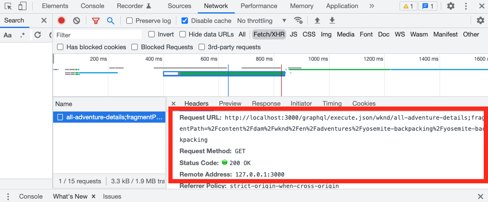

# 客户端应用程序集成

在上一章中，您使用HTTPPUT和POST请求创建并更新了持久查询。

本章将指导您完成以下步骤，在五个React组件中使用HTTPGET请求将这些持久化查询与WKND应用程序集成：

* 位置
* 地址
* 讲师
* 管理员
* 团队

## 前提条件 {#prerequisites}

本文档是多部分教程的一部分。 在继续处理本章之前，请确保已完成前几章。 完成 [基本教程](/help/headless-tutorial/graphql/multi-step/overview.md) 。

_本章中的IDE屏幕截图来自 [Visual Studio代码](https://code.visualstudio.com/)_

### 第1-4章解决方案包（可选） {#solution-package}

可以安装一个解决方案包，以完成AEM UI中章节1-4中的步骤。 此包是 **不需要** 如果前几章已经完成。

1. 下载 [Advanced-GraphQL-Tutorial-Solution-Package-1.1.zip](/help/headless-tutorial/graphql/advanced-graphql/assets/tutorial-files/Advanced-GraphQL-Tutorial-Solution-Package-1.1.zip).
1. 在AEM中，导航到 **工具** > **部署** > **包** 访问 **包管理器**.
1. 上载并安装在上一步中下载的包（zip文件）。

## 目标 {#objectives}

在本教程中，您将了解如何使用AEM Headless JavaScript将持久查询请求集成到示例WKND GraphQl React应用程序中 [SDK](https://github.com/adobe/aem-headless-client-js).

## 安装并运行示例客户端应用程序 {#install-client-app}

为了加快教程的进度，我们提供了一个React JS入门应用程序。

>[!NOTE]
> 
> 下面的说明是将React应用程序连接到 **作者** AEMas a Cloud Service中的环境使用 [本地开发访问令牌](/help/headless-tutorial/authentication/local-development-access-token.md). 也可以将应用程序连接到 [使用AEMaaCS SDK的本地创作实例](/help/headless-tutorial/graphql/quick-setup/local-sdk.md) 使用基本身份验证。

1. 下载 **[aem-guides-wknd-headless-start-tutorial.zip](/help/headless-tutorial/graphql/advanced-graphql/assets/tutorial-files/aem-guides-wknd-headless-start-tutorial.zip)**.
1. 解压缩文件，并在IDE中打开项目。
1. 获取 [本地开发令牌](/help/headless-tutorial/authentication/local-development-access-token.md) 的AEM环境。
1. 在项目中，打开文件 `.env.development`.
   1. 已设置 `REACT_APP_DEV_TOKEN` 等于 `accessToken` 值。 （不是整个JSON文件）
   1. 已设置 `REACT_APP_HOST_URI` 到AEM的url **作者** 环境。

   
1. 打开新终端并导航到项目文件夹。 运行以下命令：

   ```shell
   $ npm install
   $ npm start
   ```

1. 新浏览器应会在 `http://localhost:3000/aem-guides-wknd-pwa`.
1. 点按 **露营** > **约塞米蒂背包** 查看Yosemite Backpacking探险详情。

   

1. 打开浏览器的开发人员工具并检查 `XHR` 请求

   

   您应会看到 `POST` 到GraphQL端点。 查看 `Payload`，则可以查看已发送的完整GraphQL查询。 在接下来的部分中，将更新应用程序以使用 **持久保留** 查询。


## 入门

在基本教程中，使用参数化的GraphQl查询来请求单个内容片段并渲染冒险详细信息。 接下来，更新 `adventureDetailQuery` 以包含新字段，并使用在上一章中创建的持久查询。

创建了五个组件：

| React组件 | 位置 |
|-------|------|
| 管理员 | `src/components/Administrator.js` |
| 团队 | `src/components/Team.js` |
| 位置 | `src/components/Location.js` |
| 讲师 | `src/components/Instructors.js` |
| 地址 | `src/components/Address.js` |

## 更新useGraphQL挂接

自定义 [反应效果挂钩](https://reactjs.org/docs/hooks-overview.html#effect-hook) 已创建，用于侦听对应用程序的更改 `query`，且发生更改时，会向AEM GraphQL端点发出HTTPPOST请求，并将JSON响应返回到应用程序。

创建新挂接以使用 **持久保留** 查询。 然后，该应用程序可以发起HTTPGET请求，以获取Adventure详细信息。 的 `runPersistedQuery` 的 [AEM Headless Client SDK](https://github.com/adobe/aem-headless-client-js) 用于更轻松地执行持久查询。

1. 打开文件 `src/api/useGraphQL.js`
1. 添加新挂接 `useGraphQLPersisted`:

   ```javascript
   /**
   * Custom React Hook to perform a GraphQL query to a persisted query endpoint
   * @param persistedPath - the short path to the persisted query
   * @param fragmentPathParam - optional parameters object that can be passed in for parameterized persistent queries
   */
   export function useGraphQLPersisted(persistedPath, fragmentPathVariable) {
       let [data, setData] = useState(null);
       let [errors, setErrors] = useState(null);
   
       useEffect(() => {
           let queryVariables = {};
   
           // we pass in a primitive fragmentPathVariable (String) and then construct the object {fragmentPath: fragmentPathParam} to pass as query params to the persisted query
           // It is simpler to pass a primitive into a React hooks, as comparing the state of a dependent object can be difficult. see https://reactjs.org/docs/hooks-faq.html#can-i-skip-an-effect-on-updates
           if(fragmentPathVariable) {
               queryVariables = {fragmentPath: fragmentPathVariable};
           }
   
           // execute a persisted query using the given path and pass in variables (if needed)
           sdk.runPersistedQuery(persistedPath, queryVariables)
               .then(({ data, errors }) => {
               if (errors) setErrors(mapErrors(errors));
               if (data) setData(data);
           })
           .catch((error) => {
           setErrors(error);
           });
   }, [persistedPath, fragmentPathVariable]);
   
   return { data, errors }
   }
   ```
1. 保存对文件所做的更改。

## 更新冒险详细信息组件

文件 `src/api/queries.js` 包含用于为应用程序提供支持的GraphQL查询 `adventureDetailQuery` 使用标准POSTGraphQL请求返回单个冒险的详细信息。 接下来，更新 `AdventureDetail` 使用保留的组件 `wknd/all-adventure-details` 查询。

1. 打开 `src/screens/AdventureDetail.js`.
1. 首先，注释以下行：

   ```javascript
   export default function AdventureDetail() {
   
       ...
   
       //const { data, errors } = useGraphQL(adventureDetailQuery(adventureFragmentPath));
   ```

   以上版本使用标准的GraphQLPOST，根据 `adventureFragmentPath`

1. 使用 `useGraphQLPersisted` 挂接，添加以下行：

   ```javascript
   export default function AdventureDetail() {
   
      //const { data, errors } = useGraphQL(adventureDetailQuery(adventureFragmentPath));
       const {data, errors} = useGraphQLPersisted("wknd/all-adventure-details", adventureFragmentPath);
   ```

   观察路径 `wknd/all-adventure-details` 是在上一章中创建的持久查询的路径。

   >[!CAUTION]
   >
   > 要使更新的查询正常工作，请 `wknd/all-adventure-details` 必须在target AEM环境中持久保留。 查看 [持久GraphQL查询](/help/headless-tutorial/graphql/advanced-graphql/graphql-persisted-queries.md#cache-control-all-adventures) 或安装 [AEM解决方案包](/help/headless-tutorial/graphql/advanced-graphql/assets/tutorial-files/Advanced-GraphQL-Tutorial-Solution-Package-1.1.zip)

1. 返回到浏览器中运行的应用程序，并在导航到 **冒险详细信息** 页面。

   

   ```
   http://localhost:3000/graphql/execute.json/wknd/all-adventure-details;fragmentPath=/content/dam/wknd/en/adventures/yosemite-backpacking/yosemite-backpacking
   ```

   此时您应会看到 `GET` 请求，该请求将在 `wknd/all-adventure-details`.

1. 导航到其他冒险详细信息，并观察到相同的内容 `GET` 请求，但使用不同的片段路径。 应用程序应继续像以前一样工作。

请参阅 `AdventureDetail.js` 在 [aem-guides-wknd-headless-solution-tutorial-zip](/help/headless-tutorial/graphql/advanced-graphql/assets/tutorial-files/aem-guides-wknd-headless-solution-tutorial.zip) 以了解更新组件的完整示例。

接下来，创建 **位置**, **管理员**&#x200B;和 **讲师** 用于呈现位置数据的组件。 的 **地址** 组件在 **团队** 组件。

## 开发位置组件

1. 在 `AdventureDetail.js` 文件，添加对 `<Location>` 从 `adventure` 数据对象：

   ```javascript
   export default function AdventureDetail() {
       ...
   
       return (
           ...
   
           <Location data={adventure.location} />
   ```

1. 在 `src/components/Location.js`. 的 `Location` 组件会从中呈现相应地点、联系信息、天气信息以及位置图像的数据 **位置** 内容片段模型。 至少， `Location` 组件需要 `address` 要传递的对象。
1. 请参阅 `Location.js` 在 [aem-guides-wknd-headless-solution-tutorial-zip](/help/headless-tutorial/graphql/advanced-graphql/assets/tutorial-files/aem-guides-wknd-headless-solution-tutorial.zip) 以了解更新组件的完整示例。

进行更新后，渲染的详细信息页面应如下所示：


## 开发团队组件

1. 在 `AdventureDetail.js` 文件，添加对 `<Team>` 组件(在 `<Location>` 组件)传递 `instructorTeam` 数据 `adventure` 数据对象：

   ```javascript
   <Location data={adventure.location} />
   <Team data={adventure.instructorTeam} />
   ```

1. 在 `src/components/Team.js`. 的 `Team` 组件会从 **团队** 内容片段。

1. 在 `Team.js` 请注意，在 `Address` 组件。

   ```javascript
   export default function Team({data}) {
       ...
       {teamPath && <Address _path={teamPath}/>}
   ```

   此时，当前团队的路径将传递到 `Address` 组件，该组件又执行查询以根据团队获取地址。

1. 请参阅 `Team.js` 在 [aem-guides-wknd-headless-solution-tutorial-zip](/help/headless-tutorial/graphql/advanced-graphql/assets/tutorial-files/aem-guides-wknd-headless-solution-tutorial.zip) ，以查看组件的完整示例。

集成查询后，该查询应如下所示：


## 开发地址组件

1. 在 `src/components/Address.js`. 的 `Address` 组件从以下位置提供地址信息：街道地址、城市、州/省、邮政编码、国家/地区 **地址** 内容片段以及来自 **联系信息** 片段引用。
1. 的 `Address` 组件与 `AdventureDetails` 中的组件，它发起持久调用以基于路径检索数据。 区别在于它使用 `/wknd/team-location-by-location-path` 来提出请求。
1. 请参阅 `Address.js` 在 [aem-guides-wknd-headless-solution-tutorial-zip](/help/headless-tutorial/graphql/advanced-graphql/assets/tutorial-files/aem-guides-wknd-headless-solution-tutorial.zip) ，以查看组件的完整示例。

## 开发管理员组件

1. 在 `AdventureDetail.js` 文件，添加对 `<Adminstrator>` 组件(在 `<Team>` 组件)传递 `administrator` 数据 `adventure` 数据对象：

   ```javascript
   <Location data={adventure.location} />
   <Team data={adventure.instructorTeam} />
   <Administrator data={adventure.administrator} /> 
   ```

1. 在 `src/components/Administrator.js`. 的 `Administrator` 组件会呈现详细信息，如其全名 **管理员** 内容片段，以及从 **联系信息** 片段引用。
1. 请参阅 `Administrator.js` in [aem-guides-wknd-headless-solution-tutorial-zip](/help/headless-tutorial/graphql/advanced-graphql/assets/tutorial-files/aem-guides-wknd-headless-solution-tutorial.zip) ，以查看组件的完整示例。

创建管理员组件后，即可渲染应用程序。 输出应与以下图像匹配：


## 开发讲师组件

1. 在 `AdventureDetail.js` 文件，添加对 `<Instructors>` 组件(在 `<Administrator>` 组件)传递 `instructorTeam` 数据 `adventure` 数据对象：

   ```javascript
   <Location data={adventure.location} />
   <Team data={adventure.instructorTeam}/>
   <Administrator data={adventure.administrator} />             
   <Instructors data={adventure.instructorTeam} />
   ```

1. 在 `src/components/Instructors.js`. 的 `Instructors` 组件可呈现有关每个团队成员的数据，包括全名、传记、图片、电话号码、体验级别和技能。 该组件在阵列上迭代以显示每个成员。
1. 请参阅 `Instructors.js` in [aem-guides-wknd-headless-solution-tutorial-zip](/help/headless-tutorial/graphql/advanced-graphql/assets/tutorial-files/aem-guides-wknd-headless-solution-tutorial.zip) ，以查看组件的完整示例。

呈现应用程序后，输出应与以下图像匹配：


## 已完成WKND应用程序示例

完成的应用程序应当如下所示：


### 最终客户端应用程序

可以下载并使用应用程序的最终版本：
**[aem-guides-wknd-headless-solution-tutorial-zip](/help/headless-tutorial/graphql/advanced-graphql/assets/tutorial-files/aem-guides-wknd-headless-solution-tutorial.zip)**

## 恭喜

恭喜！现在，您已完成将持久查询集成并实施到示例WKND应用程序中。
