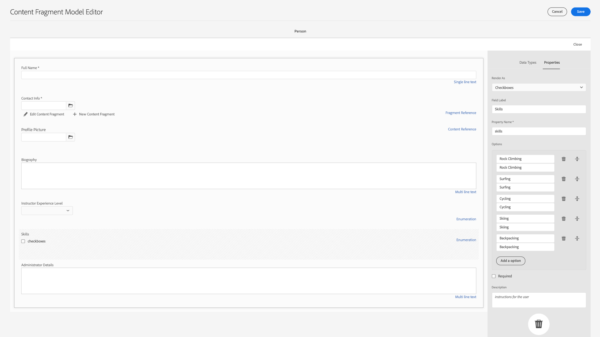
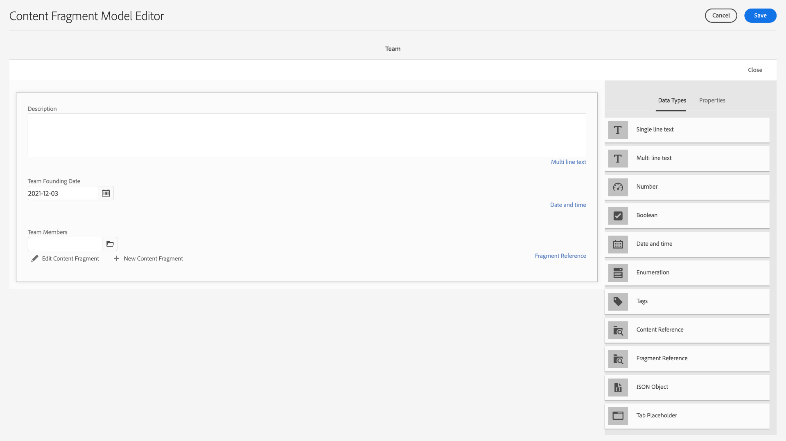

# 创建内容片段模型 {#create-content-fragment-models}

本章介绍创建五个内容片段模型的步骤：

* **联系信息**
* **地址**
* **人员**
* **位置**
* **团队**

内容片段模型允许定义内容类型之间的关系并保留此类关系，例如架构。 使用嵌套片段引用、各种内容数据类型和选项卡类型进行可视内容组织。 更高级的数据类型，如选项卡占位符、片段引用、JSON对象以及日期和时间数据类型。

本章还介绍如何增强内容引用（如图像）的验证规则。

## 先决条件 {#prerequisites}

这是一个高级教程。 在继续本章之前，请确保您已完成[快速设置](../quick-setup/cloud-service.md)。 确保您也阅读了前[概述](../overview.md)章以了解有关高级教程设置的更多信息。

## 目标 {#objectives}

* 创建内容片段模型。
* 为模型添加选项卡占位符、日期和时间、JSON对象、片段引用和内容引用。
* 将验证添加到内容引用。

## 内容片段模型概述 {#content-fragment-model-overview}

以下视频简要介绍了内容片段模型以及在本教程中如何使用它们。

>[!VIDEO](https://video.tv.adobe.com/v/340037?quality=12&learn=on)

## 创建内容片段模型 {#create-models}

让我们为WKND应用程序创建一些内容片段模型。 如果您需要有关创建内容片段模型的基本介绍，请参阅[基本教程](../multi-step/content-fragment-models.md)中的相应章节。

1. 导航到&#x200B;**工具** > **常规** > **内容片段模型**。

   

1. 选择&#x200B;**WKND共享**&#x200B;以查看站点的现有内容片段模型列表。

### 联系信息模型 {#contact-info-model}

接下来，创建一个包含人员或地点联系人信息的模型。

1. 选择右上角的&#x200B;**创建**。

1. 为模型指定“联系信息”标题，然后选择&#x200B;**创建**。 在出现的成功模式中，选择&#x200B;**打开**&#x200B;以编辑新创建的模型。

1. 首先将&#x200B;**单行文本**&#x200B;字段拖动到模型上。 在&#x200B;**属性**&#x200B;选项卡中为其指定&#x200B;**字段标签**“电话”。 属性名称自动填写为`phone`。 选中此复选框可使字段&#x200B;**为必填**。

1. 导航到&#x200B;**数据类型**&#x200B;选项卡，然后在“电话”字段下添加另一个&#x200B;**单行文本**&#x200B;字段。 请为其指定“电子邮件”的&#x200B;**字段标签**，并将其设置为&#x200B;**必填**。

Adobe Experience Manager附带一些内置的验证方法。 这些验证方法允许您向内容片段模型中的特定字段添加治理规则。 在这种情况下，让我们添加一个验证规则，以确保用户在填写此字段时只能输入有效的电子邮件地址。 在&#x200B;**验证类型**&#x200B;下拉列表下，选择&#x200B;**电子邮件**。

您完成的内容片段模型应如下所示：

完成后，选择&#x200B;**保存**&#x200B;以确认您的更改并关闭内容片段模型编辑器。

### 地址模型 {#address-model}

接下来，为地址创建模型。

1. 从&#x200B;**WKND共享**&#x200B;中，从右上角选择&#x200B;**创建**。

1. 输入“地址”标题，然后选择&#x200B;**创建**。 在出现的成功模式中，选择&#x200B;**打开**&#x200B;以编辑新创建的模型。

1. 将&#x200B;**单行文本**&#x200B;字段拖放到模型上，并赋予其&#x200B;**字段标签**“街道地址”。 然后属性名称将作为`streetAddress`填充。 选中&#x200B;**必需**&#x200B;复选框。

1. 重复上述步骤并向模型添加四个“单行文本”字段。 使用以下标签：

   * 城市
   * 状态
   * 邮政编码
   * 国家/地区

1. 选择&#x200B;**保存**&#x200B;以保存对地址模型的更改。

   已完成的“地址”片段模型应如下所示：
   

### 人员模型 {#person-model}

接下来，创建一个包含人员信息的模型。

1. 选择右上角的&#x200B;**创建**。

1. 将模型标题命名为“人员”，然后选择&#x200B;**创建**。 在出现的成功模式中，选择&#x200B;**打开**&#x200B;以编辑新创建的模型。

1. 首先将&#x200B;**单行文本**&#x200B;字段拖动到模型上。 为其指定&#x200B;**字段标签**“全名”。 属性名称自动填写为`fullName`。 选中此复选框可使字段&#x200B;**为必填**。

   

1. 内容片段模型可以在其他模型中引用。 导航到&#x200B;**数据类型**&#x200B;选项卡，然后拖放&#x200B;**片段引用**&#x200B;字段并为其提供“联系人信息”标签。

1. 在&#x200B;**属性**&#x200B;选项卡的&#x200B;**允许的内容片段模型**&#x200B;字段下，选择文件夹图标，然后选择之前创建的&#x200B;**联系信息**&#x200B;片段模型。

1. 添加一个&#x200B;**内容引用**&#x200B;字段，并为其提供“个人资料图片”的&#x200B;**字段标签**。 选择&#x200B;**根路径**&#x200B;下的文件夹图标以打开路径选择模式。 通过选择&#x200B;**content** > **Assets**，然后选中&#x200B;**WKND Shared**&#x200B;的复选框，选择根路径。 使用右上方的&#x200B;**选择**&#x200B;按钮保存路径。 最终文本路径应为`/content/dam/wknd-shared`。

   

1. 在&#x200B;**仅接受指定的内容类型**&#x200B;下，选择“图像”。

   

1. 要限制图像文件大小和尺寸，请查看内容引用字段的一些验证选项。

   在&#x200B;**仅接受指定的文件大小**&#x200B;下，选择“小于或等于”，其他字段显示在下方。
   

1. 对于&#x200B;**最大值**，输入“5”，对于&#x200B;**选择单位**，选择“兆字节(MB)”。 此验证仅允许选择指定大小的图像。

1. 在&#x200B;**仅接受指定的图像宽度**&#x200B;下，选择“最大宽度”。 在出现的&#x200B;**最大（像素）**&#x200B;字段中，输入“10000”。 为&#x200B;**选择相同的选项仅接受指定的图像高度**。

   这些验证可确保添加的图像不超过指定的值。 验证规则现在应当如下所示：

   

1. 添加一个&#x200B;**多行文本**&#x200B;字段，并为其提供“传记”的&#x200B;**字段标签**。 将&#x200B;**默认类型**&#x200B;下拉列表保留为默认的“富文本”选项。

   

1. 导航到&#x200B;**数据类型**&#x200B;选项卡，然后将&#x200B;**枚举**&#x200B;字段拖到“个人简历”下。 选择&#x200B;**下拉列表**&#x200B;并为其指定“讲师体验级别”的&#x200B;**字段标签**，而不是默认的&#x200B;**呈现为**&#x200B;选项。 输入一系列讲师体验级别选项，如&#x200B;_专家、高级、中级_。

1. 接下来，拖动“讲师体验级别”下的另一个&#x200B;**枚举**&#x200B;字段，并在&#x200B;**呈现为**&#x200B;选项下选择“复选框”。 为其指定&#x200B;**字段标签**“技能”。 学习攀岩、冲浪、骑自行车、滑雪和背包等不同技能。 选项标签和选项值应匹配如下：

   

1. 最后，使用&#x200B;**多行文本**&#x200B;字段创建“管理员详细信息”字段标签。

选择&#x200B;**保存**&#x200B;以确认您的更改并关闭内容片段模型编辑器。

### 位置模型 {#location-model}

下一个内容片段模型描述了物理位置。 此模型使用制表符占位符。 选项卡占位符通过对内容进行分类，有助于分别在模型编辑器和片段编辑器中整理数据类型。 每个占位符在内容片段编辑器中创建一个选项卡，类似于Internet浏览器中的选项卡。 位置模型应有两个选项卡：“位置详细信息”和“位置地址”。

1. 与以前一样，选择&#x200B;**创建**&#x200B;以创建另一个内容片段模型。 对于“模型标题”，输入“位置”。 在出现的成功模式中选择&#x200B;**创建**，然后选择&#x200B;**打开**。

1. 向模型添加&#x200B;**制表符占位符**&#x200B;字段并将其标记为“位置详细信息”。

1. 拖放&#x200B;**单行文本**&#x200B;并将其标记为“名称”。 在此字段标签下方，添加一个&#x200B;**多行文本**&#x200B;字段并将其标记为“描述”。

1. 接下来，添加&#x200B;**片段引用**&#x200B;字段并将其标记为“联系信息”。 在“属性”选项卡的&#x200B;**允许的内容片段模型**&#x200B;下，选择&#x200B;**文件夹图标**，然后选择之前创建的“联系信息”片段模型。

1. 在“联系人信息”下添加&#x200B;**内容引用**&#x200B;字段。 将其标记为“Location Image”。 在&#x200B;**仅接受指定的内容类型**&#x200B;下，**根路径**&#x200B;应为`/content/dam/wknd-shared.`，请选择“图像”。

1. 让我们在“位置图像”下添加一个&#x200B;**JSON对象**&#x200B;字段。 由于此数据类型比较灵活，因此可用于显示要包含在内容中的任何数据。 在这种情况下，JSON对象用于显示有关天气的信息。 将JSON对象标记为“按季节显示天气”。 在&#x200B;**属性**&#x200B;选项卡中，添加&#x200B;**描述**，以便用户能够清楚地在此处输入哪些数据：“有关按季节（春季、夏季、秋季和冬季）的事件位置天气的JSON数据。”

   

1. 要创建“位置地址”选项卡，请向模型添加&#x200B;**选项卡占位符**&#x200B;字段，并将其标记为“位置地址”。

1. 拖放&#x200B;**片段引用**&#x200B;字段，从“属性”选项卡将其标记为“地址”，然后在&#x200B;**允许的内容片段模型**&#x200B;下选择&#x200B;**地址**&#x200B;模型。

1. 选择&#x200B;**保存**&#x200B;以确认您的更改并关闭内容片段模型编辑器。 已完成的库位模型应如下所示：

   

### 团队模型 {#team-model}

最后，创建一个描述人员团队的模型。

1. 从&#x200B;**WKND共享**&#x200B;页面中，选择&#x200B;**创建**&#x200B;以制作另一个内容片段模型。 对于“模型标题”，输入“团队”。 与之前一样，在显示的成功模式中选择&#x200B;**创建**，然后选择&#x200B;**打开**。

1. 向表单添加&#x200B;**多行文本**&#x200B;字段。 在&#x200B;**字段标签**&#x200B;下，输入“描述”。

1. 向模型添加&#x200B;**日期和时间**&#x200B;字段，并将其标记为“团队创建日期”。 在这种情况下，请保持将默认&#x200B;**类型**&#x200B;设置为“Date”，但请注意，也可以使用“Date &amp; Time”或“Time”。

   

1. 导航到&#x200B;**数据类型**&#x200B;选项卡。 在“团队创建日期”下方，添加&#x200B;**片段引用**。 在&#x200B;**呈现为**&#x200B;下拉列表中，选择“多字段”。 对于&#x200B;**字段标签**，输入“团队成员”。 此字段链接到之前创建的&#x200B;_人员_&#x200B;模型。 由于数据类型是多字段的，因此可以添加多个人员片段，从而能够创建一组人员。

   

1. 在&#x200B;**允许的内容片段模型**&#x200B;下，使用文件夹图标打开“选择路径”模式窗口，然后选择&#x200B;**人员**&#x200B;模型。 使用&#x200B;**选择**&#x200B;按钮保存路径。

   

1. 选择&#x200B;**保存**&#x200B;以确认您的更改并关闭内容片段模型编辑器。

## 向冒险模型添加片段引用 {#fragment-references}

与团队模型具有对人员模型的片段引用类似，必须从冒险模型引用团队和位置模型，才能在WKND应用程序中显示这些新模型。

1. 从&#x200B;**WKND共享**&#x200B;页面中，选择&#x200B;**冒险**&#x200B;模型，然后从顶部导航中选择&#x200B;**编辑**。

   

1. 在表单底部的“What to Bring”下方，添加&#x200B;**片段引用**&#x200B;字段。 输入“位置”的&#x200B;**字段标签**。 在&#x200B;**允许的内容片段模型**&#x200B;下，选择&#x200B;**位置**&#x200B;模型。

   

1. 添加一个或多个&#x200B;**片段引用**&#x200B;字段并将其标记为“讲师团队”。 在&#x200B;**允许的内容片段模型**&#x200B;下，选择&#x200B;**团队**&#x200B;模型。

   

1. 添加另一个&#x200B;**片段引用**&#x200B;字段并将其标记为“管理员”。

   

1. 选择&#x200B;**保存**&#x200B;以确认您的更改并关闭内容片段模型编辑器。

## 最佳实践 {#best-practices}

有一些与创建内容片段模型相关的最佳实践：

* 创建映射到UX组件的模型。 例如，WKND应用程序具有用于冒险、文章和位置的内容片段模型。 您还可以添加标题、促销活动或免责声明。 每个示例都构成一个特定的UX组件。

* 创建尽可能少的模型。 通过限制模型数量，您可以最大限度地重复使用并简化内容管理。

* 根据需要深度嵌套内容片段模型，但仅在需要时进行嵌套。 回想一下，嵌套是通过片段引用或内容引用完成的。 假设最多有5层嵌套。

## 恭喜！ {#congratulations}

恭喜！您现在添加了选项卡，使用日期和时间以及JSON对象数据类型，并了解了关于片段和内容引用的更多信息。 您还添加了内容引用验证规则。

## 后续步骤 {#next-steps}

本系列的下一章将介绍如何根据您在本章中创建的模型创作内容片段[&#128279;](/help/headless-tutorial/graphql/advanced-graphql/author-content-fragments.md)。 了解如何使用本章介绍的数据类型以及创建文件夹策略来限制可以在资源文件夹中创建哪些内容片段模型。

虽然它是本教程的可选内容，但请确保在真实的生产环境中发布所有内容。 有关AEM中“创作”和“发布”环境的审查，请参阅
[AEM无头和GraphQL视频系列](/help/headless-tutorial/graphql/video-series/author-publish-architecture.md)。
