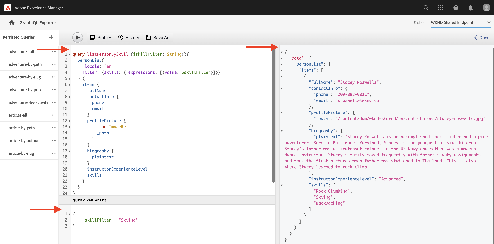

# 探索AEM GraphQL API

AEM中的GraphQL API允许您向下游应用程序公开内容片段数据。 在基础教程[多步骤GraphQL教程](../multi-step/explore-graphql-api.md)中，您使用了GraphiQL Explorer来测试和优化GraphQL查询。

在本章中，您使用GraphiQL Explorer定义更高级的查询，以收集您在[上一章](../advanced-graphql/author-content-fragments.md)中创建的内容片段的数据。

## 先决条件 {#prerequisites}

本文档是多部分教程的一部分。 在继续本章之前，请确保已完成前几章。

## 目标 {#objectives}

在本章中，您将学习如何：

* 使用查询变量筛选包含引用的内容片段列表
* 筛选片段引用中的内容
* 从多行文本字段查询内联内容和片段引用
* 使用指令查询
* 查询JSON对象内容类型

## 使用GraphiQL资源管理器


[GraphiQL Explorer](https://experienceleague.adobe.com/docs/experience-manager-cloud-service/content/headless/graphql-api/graphiql-ide.html?lang=zh-Hans)工具使开发人员能够针对当前AEM环境中的内容创建和测试查询。 GraphiQL工具还使用户能够&#x200B;**保留或保存**&#x200B;查询，以供生产设置中的客户端应用程序使用。

接下来，使用内置的GraphiQL Explorer探索AEM的GraphQL API的强大功能。

1. 从AEM“开始”屏幕中，导航到&#x200B;**工具** > **常规** > **GraphQL查询编辑器**。

   

>[!IMPORTANT]
>
>在中，某些版本的AEM (6.X.X) GraphiQL Explorer （又称GraphiQL IDE）工具需要手动安装，请按照此处[&#128279;](../how-to/install-graphiql-aem-6-5.md)的说明进行操作。

1. 在右上角，确保终结点设置为&#x200B;**WKND共享终结点**。 更改此处的&#x200B;_终结点_&#x200B;下拉列表值会在左上角显示现有&#x200B;_持久查询_。

   

这会将所有查询的范围限定为在&#x200B;**WKND共享**&#x200B;项目中所创建的模型。


## 使用查询变量筛选内容片段列表

在上一个[多步骤GraphQL教程](../multi-step/explore-graphql-api.md)中，您定义并使用了一些基本的持久查询来获取内容片段数据。 在这里，您可以展开此知识，并通过将变量传递给持久查询来筛选内容片段数据。

在开发客户端应用程序时，通常需要根据动态参数筛选内容片段。 AEM GraphQL API允许您在查询中将这些参数作为变量传递，以避免在运行时在客户端构建字符串。 有关GraphQL变量的更多信息，请参阅[GraphQL文档](https://graphql.org/learn/queries/#variables)。

在本例中，查询所有具有特定技能的讲师。

1. 在GraphiQL IDE中，将以下查询粘贴到左侧面板中：

   ```graphql
   query listPersonBySkill ($skillFilter: String!){
     personList(
       _locale: "en"
       filter: {skills: {_expressions: [{value: $skillFilter}]}}
     ) {
       items {
         fullName
         contactInfo {
           phone
           email
         }
         profilePicture {
           ... on ImageRef {
             _path
           }
         }
         biography {
           plaintext
         }
         instructorExperienceLevel
         skills
       }
     }
   }
   ```

   上面的`listPersonBySkill`查询接受一个变量(`skillFilter`)，该变量是必需的`String`。 此查询对所有人员内容片段执行搜索，并根据`skills`字段和在`skillFilter`中传递的字符串筛选它们。

   `listPersonBySkill`包含`contactInfo`属性，该属性是对在上一章中定义的联系人信息模型的片段引用。 联系人信息模型包含`phone`和`email`字段。 查询中必须至少存在其中一个字段，才能正确执行。

   ```graphql
   contactInfo {
           phone
           email
         }
   ```

1. 接下来，让我们定义`skillFilter`并获得所有熟练掌握滑雪的讲师。 将以下JSON字符串粘贴到GraphiQL IDE的“查询变量”面板中：

   ```json
   {
       "skillFilter": "Skiing"
   }
   ```

1. 执行查询。 结果应类似于以下内容：

   ```json
   {
     "data": {
       "personList": {
         "items": [
           {
             "fullName": "Stacey Roswells",
             "contactInfo": {
               "phone": "209-888-0011",
               "email": "sroswells@wknd.com"
             },
             "profilePicture": {
               "_path": "/content/dam/wknd-shared/en/contributors/stacey-roswells.jpg"
             },
             "biography": {
               "plaintext": "Stacey Roswells is an accomplished rock climber and alpine adventurer. Born in Baltimore, Maryland, Stacey is the youngest of six children. Stacey's father was a lieutenant colonel in the US Navy and mother was a modern dance instructor. Stacey's family moved frequently with father's duty assignments and took the first pictures when father was stationed in Thailand. This is also where Stacey learned to rock climb."
             },
             "instructorExperienceLevel": "Advanced",
             "skills": [
               "Rock Climbing",
               "Skiing",
               "Backpacking"
             ]
           }
         ]
       }
     }
   }
   ```

按顶部菜单中的&#x200B;**播放**&#x200B;按钮执行查询。 您应该会看到上一章内容片段的结果：



## 筛选片段引用中的内容

AEM GraphQL API允许您查询嵌套的内容片段。 在上一章中，您为冒险内容片段添加了三个新片段引用： `location`、`instructorTeam`和`administrator`。 现在，让我们为具有特定名称的任何管理员筛选所有冒险。

>[!CAUTION]
>
>仅允许一个模型作为此查询的引用，才能正确执行。

1. 在GraphiQL IDE中，将以下查询粘贴到左侧面板中：

   ```graphql
   query getAdventureAdministratorDetailsByAdministratorName ($name: String!){
     adventureList(
     _locale: "en"
       filter: {administrator: {fullName: {_expressions: [{value: $name}]}}}
     ) {
       items {
         title
         administrator {
           fullName
           contactInfo {
             phone
             email
           }
           administratorDetails {
             json
           }
         }
       }
     }
   }
   ```

1. 接下来，将以下JSON字符串粘贴到“查询变量”面板中：

   ```json
   {
       "name": "Jacob Wester"
   }
   ```

   `getAdventureAdministratorDetailsByAdministratorName`查询筛选`fullName`“Jacob Wester”的任何`administrator`的所有冒险，跨两个嵌套内容片段返回信息：冒险和讲师。

1. 执行查询。 结果应类似于以下内容：

   ```json
   {
     "data": {
       "adventureList": {
         "items": [
           {
             "title": "Yosemite Backpacking",
             "administrator": {
               "fullName": "Jacob Wester",
               "contactInfo": {
                 "phone": "209-888-0000",
                 "email": "jwester@wknd.com"
               },
               "administratorDetails": {
                 "json": [
                   {
                     "nodeType": "paragraph",
                     "content": [
                       {
                         "nodeType": "text",
                         "value": "Jacob Wester has been coordinating backpacking adventures for three years."
                       }
                     ]
                   }
                 ]
               }
             }
           }
         ]
       }
     }
   }
   ```

## 从多行文本字段中查询内联引用 {#query-rte-reference}

AEM GraphQL API允许您在多行文本字段中查询内容和片段引用。 在上一章中，您已将两个引用类型添加到Yosemite团队内容片段的&#x200B;**Description**&#x200B;字段中。 现在，让我们检索这些引用。

1. 在GraphiQL IDE中，将以下查询粘贴到左侧面板中：

   ```graphql
   query getTeamByAdventurePath ($fragmentPath: String!){
     adventureByPath (_path: $fragmentPath) {
       item {
         instructorTeam {
           _metadata {
             stringMetadata {
               name
               value
             }
         }
           teamFoundingDate
           description {
             plaintext
           }
         }
       }
       _references {
         ... on ImageRef {
           __typename
           _path
         }
         ... on LocationModel {
           __typename
           _path
           name
           address {
             streetAddress
             city
             zipCode
             country
           }
           contactInfo {
             phone
             email
           }
         }
       }
     }
   }
   ```

   `getTeamByAdventurePath`查询按路径筛选所有冒险并返回特定冒险的`instructorTeam`片段引用的数据。

   `_references`是系统生成的字段，用于显示引用，包括插入到多行文本字段中的引用。

   `getTeamByAdventurePath`查询检索多个引用。 首先，它使用内置`ImageRef`对象检索作为内容引用插入到多行文本字段中的`_path`和`__typename`图像。 接下来，它使用`LocationModel`检索插入到同一字段中的位置内容片段的数据。

   查询还包括`_metadata`字段。 这允许您检索团队内容片段的名称，并稍后在WKND应用程序中显示它。

1. 接下来，将以下JSON字符串粘贴到“查询变量”面板中，以获取Yosemite背包冒险：

   ```json
   {
       "fragmentPath": "/content/dam/wknd-shared/en/adventures/yosemite-backpacking/yosemite-backpacking"
   }
   ```

1. 执行查询。 结果应类似于以下内容：

   ```json
   {
     "data": {
       "adventureByPath": {
         "item": {
           "instructorTeam": {
             "_metadata": {
               "stringMetadata": [
                 {
                   "name": "title",
                   "value": "Yosemite Team"
                 },
                 {
                   "name": "description",
                   "value": ""
                 }
               ]
             },
             "teamFoundingDate": "2016-05-24",
             "description": {
               "plaintext": "\n\nThe team of professional adventurers and hiking instructors working in Yosemite National Park.\n\nYosemite Valley Lodge"
             }
           }
         },
         "_references": [
           {
             "__typename": "LocationModel",
             "_path": "/content/dam/wknd-shared/en/adventures/locations/yosemite-valley-lodge/yosemite-valley-lodge",
             "name": "Yosemite Valley Lodge",
             "address": {
               "streetAddress": "9006 Yosemite Lodge Drive",
               "city": "Yosemite National Park",
               "zipCode": "95389",
               "country": "United States"
             },
             "contactInfo": {
               "phone": "209-992-0000",
               "email": "yosemitelodge@wknd.com"
             }
           },
           {
             "__typename": "ImageRef",
             "_path": "/content/dam/wknd-shared/en/adventures/teams/yosemite-team/team-yosemite-logo.png"
           }
         ]
       }
     }
   }
   ```

   `_references`字段显示徽标图像以及插入到&#x200B;**描述**&#x200B;字段中的Yosemite Valley Lodge内容片段。


## 使用指令查询

有时，在开发客户端应用程序时，您需要有条件地更改查询的结构。 在这种情况下，AEM GraphQL API允许您使用GraphQL指令，以便根据提供的条件更改查询的行为。 有关GraphQL指令的详细信息，请参阅[GraphQL文档](https://graphql.org/learn/queries/#directives)。

在[上一节](#query-rte-reference)中，您已了解如何在多行文本字段中查询内联引用。 已从`plaintext`格式的`description`字段中检索内容。 接下来，我们展开该查询并使用指令有条件地检索`json`格式的`description`。

1. 在GraphiQL IDE中，将以下查询粘贴到左侧面板中：

   ```graphql
   query getTeamByAdventurePath ($fragmentPath: String!, $includeJson: Boolean!){
     adventureByPath(_path: $fragmentPath) {
       item {
         instructorTeam {
           _metadata{
             stringMetadata{
               name
               value
             }
           }
           teamFoundingDate
           description {
             plaintext
             json @include(if: $includeJson)
           }
         }
       }
       _references {
         ... on ImageRef {
           __typename
           _path
         }
         ... on LocationModel {
           __typename
           _path
           name
           address {
             streetAddress
             city
             zipCode
             country
           }
           contactInfo {
             phone
             email
           }
         }
       }
     }
   }
   ```

   上述查询接受另一个变量(`includeJson`)，该变量是必需的`Boolean`，也称为查询的指令。 指令可用于根据`includeJson`中传递的布尔值有条件地以`json`格式包含`description`字段中的数据。

1. 接下来，将以下JSON字符串粘贴到“查询变量”面板中：

   ```json
   {
     "fragmentPath": "/content/dam/wknd-shared/en/adventures/yosemite-backpacking/yosemite-backpacking",
     "includeJson": false
   }
   ```

1. 执行查询。 您应获得与[上节中相同的结果，了解如何在多行文本字段](#query-rte-reference)中查询内联引用。

1. 将`includeJson`指令更新为`true`并再次执行查询。 结果应类似于以下内容：

   ```json
   {
     "data": {
       "adventureByPath": {
         "item": {
           "instructorTeam": {
             "_metadata": {
               "stringMetadata": [
                 {
                   "name": "title",
                   "value": "Yosemite Team"
                 },
                 {
                   "name": "description",
                   "value": ""
                 }
               ]
             },
             "teamFoundingDate": "2016-05-24",
             "description": {
               "plaintext": "\n\nThe team of professional adventurers and hiking instructors working in Yosemite National Park.\n\nYosemite Valley Lodge",
               "json": [
                 {
                   "nodeType": "paragraph",
                   "content": [
                     {
                       "nodeType": "reference",
                       "data": {
                         "path": "/content/dam/wknd-shared/en/adventures/teams/yosemite-team/team-yosemite-logo.png",
                         "mimetype": "image/png"
                       }
                     }
                   ]
                 },
                 {
                   "nodeType": "paragraph",
                   "content": [
                     {
                       "nodeType": "text",
                       "value": "The team of professional adventurers and hiking instructors working in Yosemite National Park."
                     }
                   ]
                 },
                 {
                   "nodeType": "paragraph",
                   "content": [
                     {
                       "nodeType": "reference",
                       "data": {
                         "href": "/content/dam/wknd-shared/en/adventures/locations/yosemite-valley-lodge/yosemite-valley-lodge",
                         "type": "fragment"
                       },
                       "value": "Yosemite Valley Lodge"
                     }
                   ]
                 }
               ]
             }
           }
         },
         "_references": [
           {
             "__typename": "LocationModel",
             "_path": "/content/dam/wknd-shared/en/adventures/locations/yosemite-valley-lodge/yosemite-valley-lodge",
             "name": "Yosemite Valley Lodge",
             "address": {
               "streetAddress": "9006 Yosemite Lodge Drive",
               "city": "Yosemite National Park",
               "zipCode": "95389",
               "country": "United States"
             },
             "contactInfo": {
               "phone": "209-992-0000",
               "email": "yosemitelodge@wknd.com"
             }
           },
           {
             "__typename": "ImageRef",
             "_path": "/content/dam/wknd-shared/en/adventures/teams/yosemite-team/team-yosemite-logo.png"
           }
         ]
       }
     }
   }
   ```

## 查询JSON对象内容类型

请记住，在关于创作内容片段的上一章中，您已将一个JSON对象添加到&#x200B;**按季列出的天气**&#x200B;字段中。 现在，让我们在位置内容片段中检索该数据。

1. 在GraphiQL IDE中，将以下查询粘贴到左侧面板中：

   ```graphql
   query getLocationDetailsByLocationPath ($fragmentPath: String!) {
     locationByPath(_path: $fragmentPath) {
       item {
         name
         description {
           json
         }
         contactInfo {
           phone
           email
         }
         locationImage {
           ... on ImageRef {
             _path
           }
         }
         weatherBySeason
         address {
           streetAddress
           city
           state
           zipCode
           country
         }
       }
     }
   }
   ```

1. 接下来，将以下JSON字符串粘贴到“查询变量”面板中：

   ```json
   {
     "fragmentPath": "/content/dam/wknd-shared/en/adventures/locations/yosemite-national-park/yosemite-national-park"
   }
   ```

1. 执行查询。 结果应类似于以下内容：

   ```json
   {
     "data": {
       "locationByPath": {
         "item": {
           "name": "Yosemite National Park",
           "description": {
             "json": [
               {
                 "nodeType": "paragraph",
                 "content": [
                   {
                     "nodeType": "text",
                     "value": "Yosemite National Park is in California's Sierra Nevada mountains. It's famous for its gorgeous waterfalls, giant sequoia trees, and iconic views of El Capitan and Half Dome cliffs."
                   }
                 ]
               },
               {
                 "nodeType": "paragraph",
                 "content": [
                   {
                     "nodeType": "text",
                     "value": "Hiking and camping are the best ways to experience Yosemite. Numerous trails provide endless opportunities for adventure and exploration."
                   }
                 ]
               }
             ]
           },
           "contactInfo": {
             "phone": "209-999-0000",
             "email": "yosemite@wknd.com"
           },
           "locationImage": {
             "_path": "/content/dam/wknd-shared/en/adventures/locations/yosemite-national-park/yosemite-national-park.jpeg"
           },
           "weatherBySeason": {
             "summer": "81 / 89°F",
             "fall": "56 / 83°F",
             "winter": "46 / 51°F",
             "spring": "57 / 71°F"
           },
           "address": {
             "streetAddress": "9010 Curry Village Drive",
             "city": "Yosemite Valley",
             "state": "CA",
             "zipCode": "95389",
             "country": "United States"
           }
         }
       }
     }
   }
   ```

   `weatherBySeason`字段包含在上一章中添加的JSON对象。

## 一次查询所有内容

到目前为止，已执行多个查询来说明AEM GraphQL API的功能。

同一数据只能通过单个查询进行检索，此查询稍后在客户端应用程序中用于检索其他信息，例如位置、团队名称、冒险的团队成员：

```graphql
query getAdventureDetailsBySlug($slug: String!) {
  adventureList(filter: {slug: {_expressions: [{value: $slug}]}}) {
    items {
      _path
      title
      activity
      adventureType
      price
      tripLength
      groupSize
      difficulty
      primaryImage {
        ... on ImageRef {
          _path
          mimeType
          width
          height
        }
      }
      description {
        html
        json
      }
      itinerary {
        html
        json
      }
      location {
        _path
        name
        description {
          html
          json
        }
        contactInfo {
          phone
          email
        }
        locationImage {
          ... on ImageRef {
            _path
          }
        }
        weatherBySeason
        address {
          streetAddress
          city
          state
          zipCode
          country
        }
      }
      instructorTeam {
        _metadata {
          stringMetadata {
            name
            value
          }
        }
        teamFoundingDate
        description {
          json
        }
        teamMembers {
          fullName
          contactInfo {
            phone
            email
          }
          profilePicture {
            ... on ImageRef {
              _path
            }
          }
          instructorExperienceLevel
          skills
          biography {
            html
          }
        }
      }
      administrator {
        fullName
        contactInfo {
          phone
          email
        }
        biography {
          html
        }
      }
    }
    _references {
      ... on ImageRef {
        _path
        mimeType
      }
      ... on LocationModel {
        _path
        __typename
      }
    }
  }
}


# in Query Variables
{
  "slug": "yosemite-backpacking"
}
```

## 恭喜！

恭喜！您现在已测试高级查询，以收集您在上一章中创建的内容片段的数据。

## 后续步骤

在[下一章](/help/headless-tutorial/graphql/advanced-graphql/graphql-persisted-queries.md)中，您将了解如何持久GraphQL查询，以及为什么在应用程序中使用持久查询是最佳实践。
