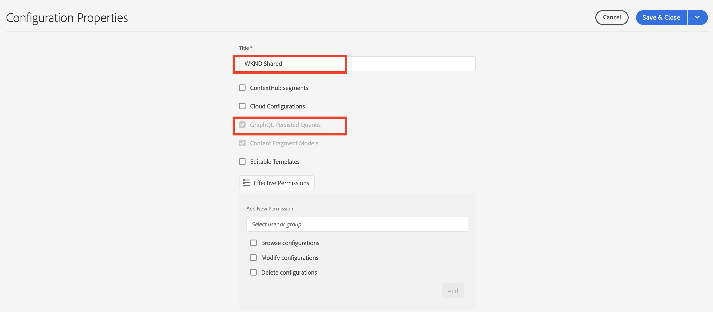

# 持久GraphQL查询

持久化查询是存储在Adobe Experience Manager(AEM)服务器上的查询。 客户端可以发送包含查询名称的HTTPGET请求以执行该请求。 这种方法的好处是可缓存。 虽然客户端GraphQL查询也可以使用HTTPPOST请求执行（无法缓存），但持久查询可通过HTTP缓存或CDN进行缓存，从而提高性能。 持久化查询允许您简化请求并提高安全性，因为您的查询封装在服务器上，并且AEM管理员完全控制这些请求。 使用AEM GraphQL API时，最佳做法是强烈建议使用持久化查询。

在上一章中，您探索了一些高级GraphQL查询来收集WKND应用程序的数据。 在本章中，您将将这些查询保留到AEM、更新它们，并了解如何对保留的查询使用缓存控制。

## 前提条件 {#prerequisites}

本文档是多部分教程的一部分。 在继续处理本章之前，请确保已完成前几章。

本教程使用 [邮递员](https://www.postman.com/) 执行HTTP请求。 在开始本章之前，请确保您已注册服务。 本教程还要求您了解Postman应用程序的工作知识，例如如何设置集合、创建变量和发出请求。 请参阅Postman文档(位于 [构建请求](https://learning.postman.com/docs/sending-requests/requests/) 和 [发送您的第一个请求](https://learning.postman.com/docs/getting-started/sending-the-first-request/) 有关如何在应用程序中发出API请求的更多详细信息。

在本章中，将保留上一章中探索的查询到AEM。 您可以下载包含这些标准GraphQL查询的文本文件 [此处](assets/graphql-persisted-queries/advanced-concepts-aem-headless-graphql-queries.txt) 供参考。

## 目标 {#objectives}

在本章中，了解如何：

* 使用参数保留GraphQL查询
* 更新持久化查询
* 对保留查询使用缓存控制参数

## 持久化查询概述

此视频概述了如何保留GraphQL查询、更新查询以及使用缓存控制。

>[!VIDEO](https://video.tv.adobe.com/v/340036/?quality=12&learn=on)

## 启用保留查询

首先，确保在AEM实例中为WKND Site项目启用保留查询。

1. 导航到 **工具** > **常规** > **配置浏览器**.

1. 选择 **WKND站点**，然后选择 **属性** ，以打开配置属性。

   

   在配置属性页面上，您应会看到 **GraphQL永久查询** 权限。

   

## 导入Postman集合

为了更便于阅读教程，提供了Postman收藏集。 或者，命令行工具，如 `curl` 可以使用。

1. 下载并安装 [邮递员](https://www.postman.com/)
1. 下载 [AdvancedConceptsofAEMHeadless.postman_collection.json](/help/headless-tutorial/graphql/advanced-graphql/assets/tutorial-files/AdvancedConceptsofAEMHeadless.postman_collection.json)
1. 打开Postman应用程序
1. 选择 **文件** > **导入** > **上传文件** 选择 `AdvancedConceptsofAEMHeadless.postman_collection.json` 来导入收藏集。

   

### 身份验证

要针对AEM创作实例发送查询，需要进行身份验证。 本教程基于AEMas a Cloud Service环境，并将载体身份验证与开发令牌结合使用。 要为Postman集合配置身份验证，请执行以下步骤：

1. 要获取开发令牌，请导航到云开发人员控制台，打开 **集成** ，然后选择 **获取本地开发令牌**.

   

1. 在您的Postman收藏集中，导航到 **身份验证** 选项卡，选择 **载体令牌** 在 **类型** 下拉菜单。

   

1. 在 **令牌** 字段。 您可以通过变量传递令牌，如下一节中所述。

   

### 变量 {#variables}

您可以通过Postman集合中的变量传递身份验证令牌和URI组件等值，以简化该过程。 在本教程中，请使用以下步骤创建变量：

1. 导航到 **变量** 选项卡，并创建以下变量：

   | 变量 | 值 |
   | --- | --- |
   | `AEM_SCHEME` | `https` |
   | `AEM_AUTH_TOKEN` | （您的开发令牌） |
   | `AEM_HOST` | (您的AEM实例的主机名) |
   | `AEM_PROJECT` | `wknd` |

1. 您还可以为要创建的每个持久查询添加变量。 在本教程中，保留以下查询： `getAdventureAdministratorDetailsByAdministratorName`, `getTeamByAdventurePath`, `getLocationDetailsByLocationPath`, `getTeamMembersByAdventurePath`, `getLocationPathByAdventurePath`和 `getTeamLocationByLocationPath`.

   创建以下变量：

   * `AEM_GET_ADVENTURE_ADMINISTRATOR_DETAILS_BY_ADMINISTRATOR_NAME` : `adventure-administrator-details-by-administrator-name`
   * `AEM_GET_ADVENTURE_ADMINISTRATOR_DETAILS_BY_ADMINISTRATOR_NAME` : `adventure-administrator-details-by-administrator-name`
   * `AEM_GET_TEAM_LOCATION_BY_LOCATION_PATH` : `team-location-by-location-path`
   * `AEM_GET_TEAM_MEMBERS_BY_ADVENTURE_PATH` : `team-members-by-adventure-path`
   * `AEM_GET_LOCATION_DETAILS_BY_LOCATION_PATH` : `location-details-by-location-path`
   * `AEM_GET_LOCATION_PATH_BY_ADVENTURE_PATH` : `location-path-by-adventure-path`
   * `AEM_GET_TEAM_BY_ADVENTURE_PATH` : `team-by-adventure-path`

   完成后， **变量** 选项卡，其外观应类似于以下内容：

   

## 使用参数保留GraphQL查询

在 [AEM无头和GraphQL视频系列](../video-series/graphql-persisted-queries.md)，您学习了如何创建持久GraphQL查询。 在此部分中，让我们使用参数保留并执行GraphQL查询。

### 创建持久查询 {#create-persisted-query}

在本例中，我们将保留 `getAdventureAdministratorDetailsByAdministratorName` 查询。

>[!NOTE]
>
>HTTPPUT方法用于创建持久查询，HTTPPOST方法用于更新该查询。

1. 首先，在您的Postman集合中添加新请求。 选择HTTPPUT方法以创建持久查询，并使用以下请求URI:

   ```plaintext
   {{AEM_SCHEME}}://{{AEM_HOST}}/graphql/persist.json/{{AEM_PROJECT}}/{{AEM_GET_ADVENTURE_ADMINISTRATOR_DETAILS_BY_ADMINISTRATOR_NAME}}
   ```

   请注意，URI使用 `/graphql/persist.json` 操作。

1. 粘贴 `getAdventureAdministratorDetailsByAdministratorName` 在请求正文中查询GraphQL。 请注意，它是带有变量的标准GraphQL查询 `name` 需要 `String`.

   

1. 执行请求。 您应会收到以下响应：

   

   您已成功创建名为的持久查询 `adventure-administrator-details-by-administrator-name`.

### 执行持久查询

让我们执行您创建的保留查询。

1. 使用以下请求URI在您的Postman集合中创建新GET请求：

   ```plaintext
   {{AEM_SCHEME}}://{{AEM_HOST}}/graphql/execute.json/{{AEM_PROJECT}}/{{AEM_GET_ADVENTURE_ADMINISTRATOR_DETAILS_BY_ADMINISTRATOR_NAME}}
   ```

   请注意，请求URI现在包含 `execute.json` 操作。

   如果按原样执行此请求，则会引发错误，因为查询需要变量 `name`. 必须将此变量作为参数传递到请求URI中。

   

1. 接下来，检索名为Jacob Wester的管理员。 持久GraphQL查询的参数必须与先前的URI组件分隔为 `;` 并在将它们传递到请求URI之前对其进行编码。 在浏览器控制台中，执行以下命令：

   ```js
   encodeURIComponent(";name=Jacob Wester")
   ```

   

1. 从控制台中复制结果，并将其粘贴到请求URI的末尾的Postman中。 您应具有以下请求URI:

   ```plaintext
   {{AEM_SCHEME}}://{{AEM_HOST}}/graphql/execute.json/{{AEM_PROJECT}}/{{AEM_GET_ADVENTURE_ADMINISTRATOR_DETAILS_BY_ADMINISTRATOR_NAME}}%3Bname%3DJacob%20Wester
   ```

1. 执行GET请求。 您应会收到以下响应：

   

现在，您已使用参数创建并执行一个持久GraphQL查询。

您可以按照上述步骤，从 [文本文件](assets/graphql-persisted-queries/advanced-concepts-aem-headless-graphql-queries.txt) 使用您在 [本章开头](#variables).

完整 [邮递员集合](/help/headless-tutorial/graphql/advanced-graphql/assets/tutorial-files/AdvancedConceptsofAEMHeadless.postman_collection.json) 也可下载和导入。

## 更新持久化查询

使用PUT请求创建持久查询时，必须使用POST请求来更新现有的持久查询。 在本教程中，让我们更新名为 `adventure-administrator-details-by-administrator-name` 创建的 [上一部分](#create-persisted-query).

1. 复制上一部分中用于PUT请求的选项卡。 在副本中，将HTTP方法更改为POST。

1. 在GraphQL查询中，让我们删除 `plaintext` 格式 `administratorDetails` 字段。

   

1. 执行请求。 您应该收到以下响应：

   

您现在已更新 `adventure-administrator-details-by-administrator-name` 保留查询。 如果进行了更改，请务必始终在AEM中更新GraphQL查询。

## 在保留查询中传递缓存控制参数 {#cache-control-all-adventures}

AEM GraphQL API允许您向查询添加缓存控制参数以提高性能。

使用 `getAllAdventureDetails` 查询。 查询响应较大，控制其非常有用 `age` 在缓存中。

此持久查询稍后用于更新 [客户端应用程序](/help/headless-tutorial/graphql/advanced-graphql/client-application-integration.md).

1. 在您的Postman集合中，创建新变量：

   ```plaintext
   AEM_GET_ALL_AT_ONCE: all-adventure-details
   ```

1. 创建新PUT请求以保留此查询。

1. 在 **正文** ，请选择 **原始** 数据类型。

   

1. 要在查询中使用缓存控制，您需要将查询包装在JSON结构中，并在末尾添加缓存控制参数。 将以下查询复制并粘贴到请求正文中：

   ```json
   {
   "query": " query getAllAdventureDetails($fragmentPath: String!) { adventureByPath(_path: $fragmentPath){ item { _path adventureTitle adventureActivity adventureType adventurePrice adventureTripLength adventureGroupSize adventureDifficulty adventurePrice adventurePrimaryImage{ ...on ImageRef{ _path mimeType width height } } adventureDescription { html json } adventureItinerary { html json } location { _path name description { html json } contactInfo{ phone email } locationImage{ ...on ImageRef{ _path } } weatherBySeason address{ streetAddress city state zipCode country } } instructorTeam { _metadata{ stringMetadata{ name value } } teamFoundingDate description { json } teamMembers { fullName contactInfo { phone email } profilePicture{ ...on ImageRef { _path } } instructorExperienceLevel skills biography { html } } } administrator { fullName contactInfo { phone email } biography { html } } } _references { ...on ImageRef { _path mimeType } ...on LocationModel { _path __typename } } } }", 
   "cache-control": { "max-age": 300 }
   }
   ```

   >[!CAUTION]
   >
   >封装的查询不得包含换行符。

   您的请求现在应如下所示：

   

1. 执行请求。 您应会收到相应的响应，指示 `all-adventure-details` 已成功创建持久查询。

   

## 恭喜！

恭喜！ 您现在已学习如何通过参数保留GraphQL查询、更新持久化查询，以及将缓存控制参数与持久化查询一起使用。

## 下面的步骤

在 [下一章](/help/headless-tutorial/graphql/advanced-graphql/client-application-integration.md)，您将在WKND应用程序中实施对保留查询的请求。

虽然在本教程中它是可选的，但请确保在实际生产环境中发布所有内容。 有关AEM中的创作和发布环境的查看，请参阅 [AEM无头和GraphQL视频系列](../video-series/author-publish-architecture.md).