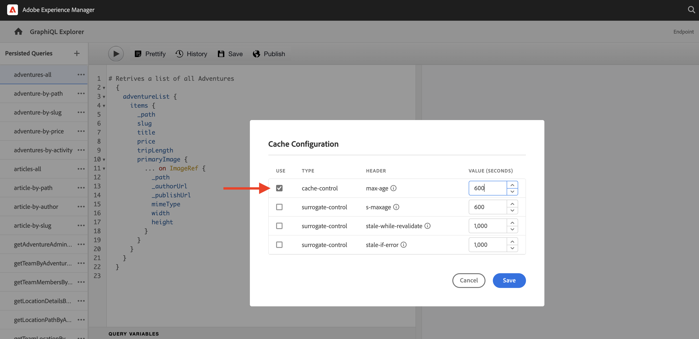

# 持久 GraphQL 查询

持久化查询是存储在Adobe Experience Manager(AEM)服务器上的查询。 客户端可以发送包含查询名称的HTTPGET请求以执行该请求。 这种方法的好处是可缓存。 虽然客户端GraphQL查询也可以使用HTTPPOST请求执行（无法缓存），但持久查询可通过HTTP缓存或CDN进行缓存，从而提高性能。 持久化查询允许您简化请求并提高安全性，因为您的查询封装在服务器上，并且AEM管理员完全控制这些请求。 是 **最佳实践，强烈推荐** 使用AEM GraphQL API时使用持久查询。

在上一章中，您探索了一些高级GraphQL查询来收集WKND应用程序的数据。 在本章中，您将查询保留到AEM，并了解如何对保留的查询使用缓存控制。

## 前提条件 {#prerequisites}

本文档是多部分教程的一部分。 请确保 [上一章节](explore-graphql-api.md) 已完成，然后才能继续处理本章。

## 目标 {#objectives}

在本章中，了解如何：

* 使用参数保留GraphQL查询
* 对保留查询使用缓存控制参数

## 审阅 _GraphQL持久查询_ 配置设置

让我们回顾一下 _GraphQL持久查询_ 在AEM实例中为WKND Site项目启用。

1. 导航到 **工具** > **常规** > **配置浏览器**.

1. 选择 **WKND共享**，然后选择 **属性** ，以打开配置属性。 在配置属性页面上，您应会看到 **GraphQL永久查询** 权限。

   

## 使用内置GraphQL资源管理器工具保留GraphQL查询

在此部分中，让我们保留稍后在客户端应用程序中用于获取和渲染Adventure内容片段数据的GraphQL查询。

1. 在GraphiQL资源管理器中输入以下查询：

   ```graphql
   query getAdventureDetailsBySlug($slug: String!) {
   adventureList(filter: {slug: {_expressions: [{value: $slug}]}}) {
       items {
       _path
       title
       activity
       adventureType
       price
       tripLength
       groupSize
       difficulty
       primaryImage {
           ... on ImageRef {
           _path
           mimeType
           width
           height
           }
       }
       description {
           html
           json
       }
       itinerary {
           html
           json
       }
       location {
           _path
           name
           description {
           html
           json
           }
           contactInfo {
           phone
           email
           }
           locationImage {
           ... on ImageRef {
               _path
           }
           }
           weatherBySeason
           address {
           streetAddress
           city
           state
           zipCode
           country
           }
       }
       instructorTeam {
           _metadata {
           stringMetadata {
               name
               value
           }
           }
           teamFoundingDate
           description {
           json
           }
           teamMembers {
           fullName
           contactInfo {
               phone
               email
           }
           profilePicture {
               ... on ImageRef {
               _path
               }
           }
           instructorExperienceLevel
           skills
           biography {
               html
           }
           }
       }
       administrator {
           fullName
           contactInfo {
           phone
           email
           }
           biography {
           html
           }
       }
       }
       _references {
       ... on ImageRef {
           _path
           mimeType
       }
       ... on LocationModel {
           _path
           __typename
       }
       }
   }
   }
   ```

   在保存查询之前，请验证查询是否可用。

1. 下一步点按另存为，然后输入 `adventure-details-by-slug` 作为查询名称。

   

## 通过对特殊字符进行编码来使用变量执行持久查询

让我们了解客户端应用程序如何通过对特殊字符进行编码来执行带有变量的持久查询。

要执行持久查询，客户端应用程序使用以下语法发出GET请求：

```
GET <AEM_HOST>/graphql/execute.json/<Project-Config-Name>/<Persisted-Query-Name>
```

执行保留查询 _变量_，则上述语法将更改为：

```
GET <AEM_HOST>/graphql/execute.json/<Project-Config-Name>/<Persisted-Query-Name>;variable1=value1;variable2=value2
```

必须转换特殊字符(如分号(;)、等号(=)、斜杠(/)和空格)，才能使用相应的UTF-8编码。

通过运行 `getAllAdventureDetailsBySlug` 从命令行终端查询，我们将在操作中查看这些概念。

1. 打开GraphiQL资源管理器，然后单击 **省略号** (...) `getAllAdventureDetailsBySlug`，然后单击 **复制URL**. 将复制的URL粘贴到文本键盘中，如下所示：

   ```code
       http://<AEM_HOST>/graphql/execute.json/wknd-shared/getAllAdventureDetailsBySlug;slug=
   ```

1. 添加 `yosemite-backpacking` 作为变量值

   ```code
       http://<AEM_HOST>/graphql/execute.json/wknd-shared/getAllAdventureDetailsBySlug;slug=yosemite-backpacking
   ```

1. 对分号(;)和等号(=)特殊字符进行编码

   ```code
       http://<AEM_HOST>/graphql/execute.json/wknd-shared/getAllAdventureDetailsBySlug%3Bslug%3Dyosemite-backpacking
   ```

1. 打开命令行终端并使用 [卷曲](https://curl.se/) 运行查询

   ```shell
   $ curl -X GET http://<AEM_HOST>/graphql/execute.json/wknd-shared/getAllAdventureDetailsBySlug%3Bslug%3Dyosemite-backpacking
   ```

>[!TIP]
>
>    如果针对AEM创作环境运行上述查询，则必须发送凭据。 请参阅 [本地开发访问令牌](https://experienceleague.adobe.com/docs/experience-manager-learn/getting-started-with-aem-headless/authentication/local-development-access-token.html) 来演示 [调用AEM API](https://experienceleague.adobe.com/docs/experience-manager-cloud-service/content/implementing/developing/generating-access-tokens-for-server-side-apis.html#calling-the-aem-api) 以了解文档详细信息。

另外，请查阅 [如何执行持久查询](https://experienceleague.adobe.com/docs/experience-manager-cloud-service/content/headless/graphql-api/persisted-queries.html#execute-persisted-query), [使用查询变量](https://experienceleague.adobe.com/docs/experience-manager-cloud-service/content/headless/graphql-api/persisted-queries.html#query-variables)和 [对查询URL进行编码，以供应用程序使用](https://experienceleague.adobe.com/docs/experience-manager-cloud-service/content/headless/graphql-api/persisted-queries.html#encoding-query-url) 了解客户端应用程序持久执行的查询。

## 更新保留查询中的缓存控制参数 {#cache-control-all-adventures}

AEM GraphQL API允许您为查询更新默认的缓存控制参数，以提高性能。 默认的缓存控制值为：

* 对于客户端（例如，浏览器），默认为60秒(maxage=60)TTL

* 对于调度程序和CDN，默认为7200秒(s-maxage=7200)TTL;也称为共享缓存

使用 `adventures-all` 查询以更新cache-control参数。 查询响应较大，控制其非常有用 `age` 在缓存中。 此持久查询稍后用于更新 [客户端应用程序](/help/headless-tutorial/graphql/advanced-graphql/client-application-integration.md).

1. 打开GraphiQL资源管理器，然后单击 **省略号** (...)，然后单击永久查询旁边的 **标题** 打开 **缓存配置** 模式窗口。

   


1. 在 **缓存配置** 模式窗口，更新 `max-age` 标题值到 `600 `秒（10分钟），然后单击 **保存**

   


审阅 [缓存保留的查询](https://experienceleague.adobe.com/docs/experience-manager-cloud-service/content/headless/graphql-api/persisted-queries.html#caching-persisted-queries) 有关默认缓存控制参数的详细信息。


## 恭喜！

恭喜！您现在已学习如何通过参数保留GraphQL查询、更新持久化查询，以及将缓存控制参数与持久化查询一起使用。

## 下面的步骤

在 [下一章](/help/headless-tutorial/graphql/advanced-graphql/client-application-integration.md)，您将在WKND应用程序中实施对保留查询的请求。
