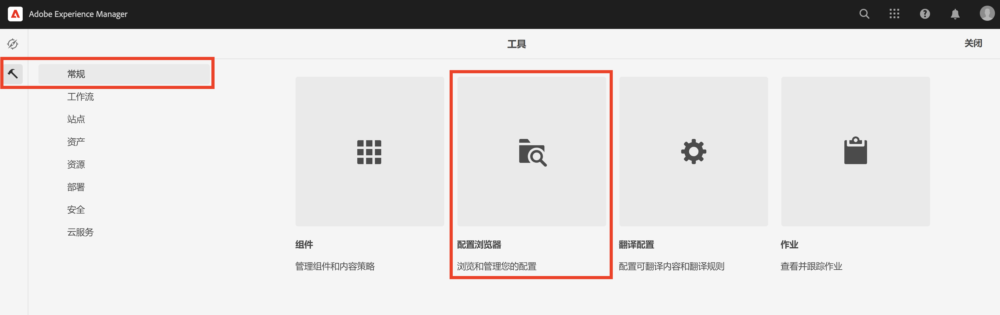
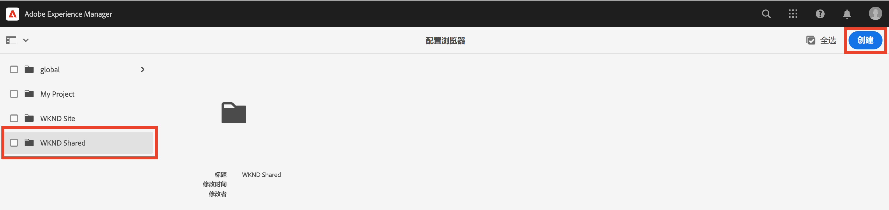
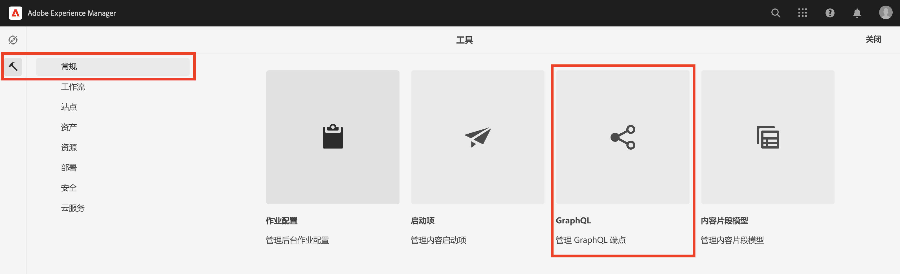
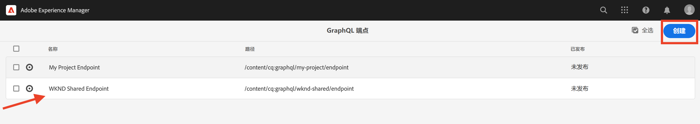
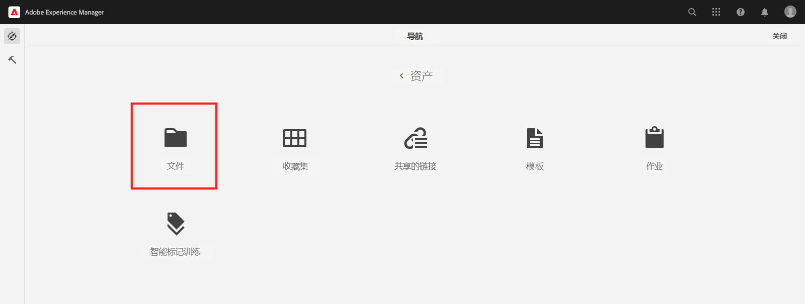
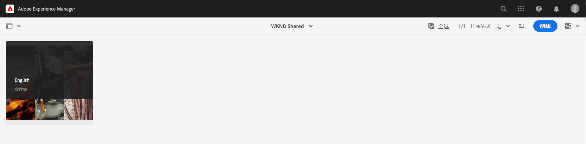
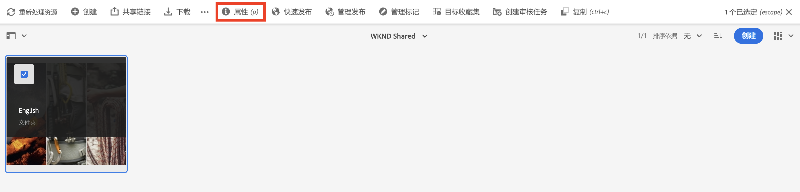
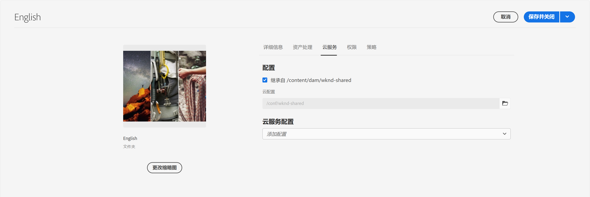

# AEM Headless的高级概念

{{aem-headless-trials-promo}}

此端到端教程继续介绍[基础教程](../multi-step/overview.md)，其中涵盖了Adobe Experience Manager (AEM) Headless和GraphQL的基础知识。 该高级教程说明了使用内容片段模型、内容片段和AEM GraphQL持久查询的深入方面，包括在客户端应用程序中使用GraphQL持久查询。

## 先决条件

完成[AEM as a Cloud Service快速设置](../quick-setup/cloud-service.md)以配置您的AEM as a Cloud Service环境。

强烈建议您先完成前[个基本教程](../multi-step/overview.md)和[个视频系列](../video-series/modeling-basics.md)教程，然后再继续此高级教程。 虽然您可以使用本地AEM环境完成本教程，但本教程仅介绍AEM as a Cloud Service的工作流。

>[!CAUTION]
>
>如果您无权访问AEM as a Cloud Service环境，则可以使用本地SDK](https://experienceleague.adobe.com/docs/experience-manager-learn/getting-started-with-aem-headless/graphql/quick-setup/local-sdk.html)完成[AEM Headless快速设置。 但是，请务必注意，某些产品UI页面（例如内容片段导航）是不同的。

## 目标

本教程涵盖以下主题：

* 使用验证规则和更高级的数据类型（如选项卡占位符、嵌套片段引用、JSON对象以及日期和时间数据类型）创建内容片段模型。
* 处理嵌套内容和片段引用时创作内容片段，并为内容片段创作治理配置文件夹策略。
* 使用带有变量和指令的AEM查询来探索GraphQL GraphQL API功能。
* 在AEM中使用参数保留GraphQL查询，并了解如何将缓存控制参数用于保留查询。
* 使用AEM Headless JavaScript SDK将有关持久查询的请求集成到示例WKND GraphQL React应用程序中。

## AEM Headless的高级概念概述

以下视频提供了本教程中涵盖的概念的高级概述。 本教程包括使用更高级的数据类型定义内容片段模型、嵌套内容片段以及在AEM中保留GraphQL查询。

>[!VIDEO](https://video.tv.adobe.com/v/340035?quality=12&learn=on)

>[!CAUTION]
>
>此视频（时间2:25）介绍了如何通过包管理器安装GraphiQL查询编辑器以探索GraphQL查询。 但是，在较新版本的AEM as Cloud Service中，提供了内置&#x200B;**GraphiQL Explorer**，因此无需安装包。 有关详细信息，请参阅[使用GraphiQL IDE](https://experienceleague.adobe.com/docs/experience-manager-cloud-service/content/headless/graphql-api/graphiql-ide.html)。

## 项目设置

WKND站点项目具有所有必需的配置，因此您可以在完成[快速设置](../quick-setup/cloud-service.md)后立即启动教程。 本节仅重点介绍在创建您自己的AEM Headless项目时可以使用的一些重要步骤。

### 审查现有配置

在AEM中开始任何新项目的第一步是创建其配置（作为工作区）并创建GraphQL API端点。 要查看或创建配置，请导航到&#x200B;**工具** > **常规** > **配置浏览器**。

请注意，已经为教程创建了`WKND Shared`站点配置。 要为您自己的项目创建配置，请选择右上角的&#x200B;**创建**，并完成显示的创建配置模式中的表单。

### 审查GraphQL API端点

接下来，您必须配置要将GraphQL查询发送到的目标的API端点。 若要查看现有端点或创建端点，请导航到&#x200B;**工具** > **常规** > **GraphQL**。

请注意，`WKND Shared Endpoint`已创建。 要为项目创建端点，请选择右上角的&#x200B;**创建**&#x200B;并遵循工作流程。

>[!NOTE]
>
> 保存端点后，您将看到一个关于访问安全控制台的模式窗口，如果您希望配置对端点的访问，通过该模式可调整安全设置。 但是，安全权限本身并不在本教程的涵盖范围内。 有关详细信息，请参阅[AEM文档](https://experienceleague.adobe.com/docs/experience-manager-65/administering/security/security.html)。

### 查看WKND内容结构和语言根文件夹

明确定义的内容结构是AEM Headless实施成功的关键。 它有助于内容的可扩展性、可用性和权限管理。

语言根文件夹是使用ISO语言代码作为其名称（如EN或FR）的文件夹。 AEM翻译管理系统使用这些文件夹定义内容的主要语言和内容翻译的语言。

转到&#x200B;**导航** > **Assets** > **文件**。

导航到&#x200B;**WKND共享**&#x200B;文件夹。 观察标题为“English”和名称为“EN”的文件夹。 此文件夹是WKND站点项目的语言根文件夹。

对于您自己的项目，请在配置中创建语言根文件夹。 有关更多详细信息，请参阅[创建文件夹](/help/headless-tutorial/graphql/advanced-graphql/author-content-fragments.md#create-folders)部分。

### 将配置分配给嵌套文件夹

最后，必须将项目配置分配给语言根文件夹。 通过此分配，可基于在您的项目配置中定义的内容片段模型创建内容片段。

要将语言根文件夹分配给配置，请选择该文件夹，然后在顶部导航栏中选择&#x200B;**属性**。

接下来，导航到&#x200B;**云服务**&#x200B;选项卡，并在&#x200B;**云配置**&#x200B;字段中选择文件夹图标。

在显示的模式窗口中，选择您之前创建的配置以为其分配语言根文件夹。

### 最佳实践

以下是在AEM中创建自己的项目时的最佳实践：

* 在建模文件夹层级时应考虑本地化和翻译。 换句话说，语言文件夹应该嵌套在配置文件夹中，这样可以轻松地翻译这些配置文件夹中的内容。
* 文件夹层次结构应保持扁平且简单明了。 避免在以后移动或重命名文件夹和片段，尤其是在发布以供实时使用之后，因为它更改了可能影响片段引用和GraphQL查询的路径。

## 入门和解决方案包

有两个AEM **包**&#x200B;可用，可以通过[包管理器](/help/headless-tutorial/graphql/advanced-graphql/author-content-fragments.md#sample-content)进行安装

* 本教程稍后将使用[Advanced-GraphQL-Tutorial-Starter-Package-1.1.zip](/help/headless-tutorial/graphql/advanced-graphql/assets/tutorial-files/Advanced-GraphQL-Tutorial-Starter-Package-1.1.zip)，其中包含示例图像和文件夹。
* [Advanced-GraphQL-Tutorial-Solution-Package-1.2.zip](/help/headless-tutorial/graphql/advanced-graphql/assets/tutorial-files/Advanced-GraphQL-Tutorial-Solution-Package-1.2.zip)包含第1-4章的最终解决方案，包括新的内容片段模型、内容片段和持久的GraphQL查询。 对于希望直接跳转到[客户端应用程序集成](/help/headless-tutorial/graphql/advanced-graphql/client-application-integration.md)章节的人非常有用。

[React应用程序 — 高级教程 — WKND Adventures](https://github.com/adobe/aem-guides-wknd-graphql/blob/main/advanced-tutorial/README.md)项目可用于查看和探索示例应用程序。 此示例应用程序通过调用持久化的AEM查询从GraphQL检索内容，并在沉浸式体验中呈现该内容。

## 快速入门

要开始使用此高级教程，请执行以下步骤：

1. 使用[AEM as a Cloud Service](../quick-setup/cloud-service.md)设置开发环境。
1. 开始有关[创建内容片段模型](/help/headless-tutorial/graphql/advanced-graphql/create-content-fragment-models.md)的教程一章。
