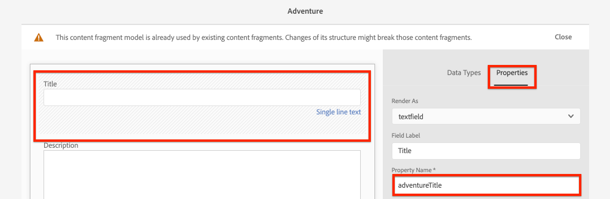
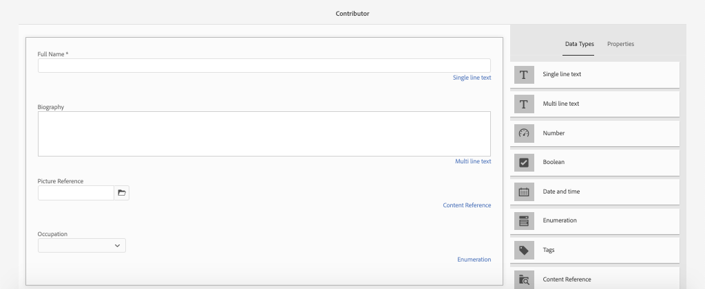

# 定义内容片段模型{#content-fragment-models}

>[!CAUTION]
>
> 针对内容片段投放的AEM GraphQL API将于2021年初发布。
> 相关文档可供预览使用。

在本章中，学习如何使用&#x200B;**内容片段模型**&#x200B;建模内容和构建模式。 您将检查现有模型并创建新模型。 您还将了解可用于将模式定义为模型一部分的不同数据类型。

在本章中，您将为&#x200B;**参与者**&#x200B;创建一个新模型，该模型是为那些作为WKND品牌的一部分创作杂志和冒险内容的用户创建的数据模型。

## 前提条件 {#prerequisites}

这是一个多部分教程，假定[快速设置](./setup.md)中概述的步骤已完成。

## 目标{#objectives}

* 创建新内容片段模型。
* 确定可用的数据类型和构建模型的验证选项。
* 了解内容片段模型如何为内容片段定义&#x200B;****&#x200B;数据模式和创作模板。

## 内容片段模型概述{#overview}

>[!VIDEO](https://video.tv.adobe.com/v/22452/?quality=12&learn=on)

以上视频概括介绍了如何使用内容片段模型。

## Inspect冒险内容片段模型

在上一章中，对多个Adventures内容片段进行了编辑并在外部应用程序上显示。 让我们检查Adventure Content Fragment模型，了解这些片段的基础数据模式。

1. 从&#x200B;**AEM开始**&#x200B;菜单导航到&#x200B;**工具** > **资产** **内容片段模型**。

   

1. 导航到&#x200B;**WKND Site**&#x200B;文件夹，将指针悬停在&#x200B;**Adventure**&#x200B;内容片段模型上，然后单击&#x200B;**Edit**&#x200B;图标（铅笔）以打开模型。

   

1. 这会打开&#x200B;**内容片段模型编辑器**。 请注意，定义冒险模型的字段包括不同的&#x200B;**数据类型**，如&#x200B;**单行文本**、**多行文本**、**明细列表**&#x200B;和&#x200B;**内容引用**。

1. 编辑器的右列列表可用的&#x200B;**数据类型**，这些数据类型定义用于创作内容片段的表单字段。

1. 在主面板中选择&#x200B;**标题**&#x200B;字段。 在右侧列中，单击&#x200B;**属性**&#x200B;选项卡：

   

   观察&#x200B;**属性名称**&#x200B;字段设置为`adventureTitle`。 这定义保留到AEM的属性的名称。 **属性名称**&#x200B;还定义此属性的&#x200B;**键**&#x200B;名称，作为数据模式的一部分。 当内容片段数据通过GraphQL API公开时，将使用此&#x200B;**键**。

   >[!CAUTION]
   >
   > 从模型派生&#x200B;**内容片段后，修改字段**&#x200B;的&#x200B;**属性名称**&#x200B;具有下游效果。 现有片段中的字段值将不再被引用，GraphQL公开的数据模式将发生更改，从而影响现有应用程序。

1. 在&#x200B;**属性**&#x200B;选项卡中向下滚动，并视图&#x200B;**验证类型**&#x200B;下拉列表。

   

   开箱即用的表单验证适用于&#x200B;**电子邮件**&#x200B;和&#x200B;**URL**。 也可以使用常规表达式定义&#x200B;**Custom**&#x200B;验证。

1. 单击&#x200B;**取消**&#x200B;以关闭内容片段模型编辑器。

## 创建参与者模型

接下来，为&#x200B;**Contributor**&#x200B;创建新模型，该模型是为那些作为WKND品牌一部分创作杂志和冒险内容的用户创建的数据模型。

1. 单击右上角的&#x200B;**创建**&#x200B;以启动&#x200B;**创建模型**&#x200B;向导。
1. 对于&#x200B;**模型标题**，输入：**参与者**&#x200B;并单击&#x200B;**创建**

   

   单击&#x200B;**打开**&#x200B;以打开新创建的模型。

1. 将&#x200B;**单行文本**&#x200B;元素拖放到主面板上。 在&#x200B;**属性**&#x200B;选项卡上输入以下属性：

   * **字段标签**: **全名**
   * **属性名称**: `fullName`
   * 检查&#x200B;**必需**

   

1. 单击&#x200B;**数据类型**&#x200B;选项卡，将&#x200B;**多行文本**&#x200B;字段拖放到&#x200B;**全名**&#x200B;字段下方。 输入以下属性：

   * **字段标签**: **传记**
   * **属性名称**: `biographyText`
   * **默认类型**: **富文本**

1. 单击&#x200B;**数据类型**&#x200B;选项卡并拖放&#x200B;**内容引用**&#x200B;字段。 输入以下属性：

   * **字段标签**: **图片参考**
   * **属性名称**: `pictureReference`
   * **根路径**: `/content/dam/wknd`

   配置&#x200B;**根路径**&#x200B;时，可以单击&#x200B;**文件夹**&#x200B;图标以调出模式来选择路径。 这将限制作者可用于填充路径的文件夹。

   

1. 为&#x200B;**图片引用**&#x200B;添加验证，以便只能使用&#x200B;**图像**&#x200B;的内容类型填充字段。

   

1. 单击&#x200B;**数据类型**&#x200B;选项卡，将&#x200B;**明细列表**&#x200B;数据类型拖放到&#x200B;**图片引用**&#x200B;字段下。 输入以下属性：

   * **字段标签**: **职业**
   * **属性名称**: `occupation`

1. 使用&#x200B;**添加选项**&#x200B;按钮添加多个&#x200B;**选项**。 对&#x200B;**选项标签**&#x200B;和&#x200B;**选项值**&#x200B;使用相同的值：

   **艺术家**、影 **响者**、摄 **影师**、旅 **行者**、 **** **、YouTube Bue**

   

1. 最终的&#x200B;**Contributor**&#x200B;型号应当如下：

   

1. 单击&#x200B;**保存**&#x200B;以保存更改。

## 启用参与者模型

内容片段模型首次创建时默认为&#x200B;**草稿**&#x200B;状态。 这允许用户在&#x200B;**之前优化内容片段模型**，允许作者使用它。 请记住，修改模型中字段的&#x200B;**属性名称**&#x200B;会更改基础数据模式，并会对现有片段和外部应用程序产生显着的下游影响。 建议仔细规划用于字段&#x200B;**属性名称**&#x200B;的命名约定。

1. 请注意，**Contributor**&#x200B;型号当前处于&#x200B;**Draft**&#x200B;状态。

1. 将鼠标悬停在卡上并单击&#x200B;**启用**&#x200B;图标，启用&#x200B;**参与者模型**:

   

## 恭喜！{#congratulations}

祝贺您，您刚刚创建了您的第一个内容片段模型！

## 后续步骤{#next-steps}

在下一章[创作内容片段模型](author-content-fragments.md)中，您将根据内容片段模型创建和编辑新的内容片段。 您还将学习如何创建内容片段的变体。