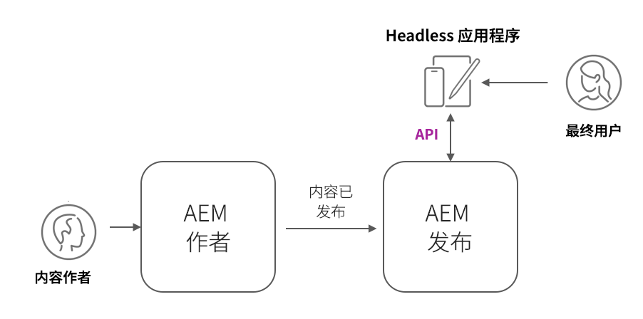

# AEM Headless部署

AEM Headless客户端部署采用多种形式；AEM托管的SPA、外部SPA、网站、移动应用程序，甚至服务器到服务器进程。

根据客户端及其部署方式，AEM Headless部署有不同的注意事项。

## AEM服务架构

在探索部署注意事项之前，必须了解AEM逻辑体系结构以及AEMas a Cloud Service服务层的分离和作用。 AEMas a Cloud Service由两个逻辑服务组成：

+ __AEM创作__ 是团队用于创建、协作和发布内容片段（和其他资产）的服务。
+ __AEM发布__ 是已发布的服务。将复制内容片段（和其他资产）以供一般使用。
+ __AEM预览__ 是一项模拟AEM Publish行为的服务，但其内容已发布到以供预览或审阅。 AEM预览适用于内部受众，而非用于内容的常规交付。 根据所需的工作流，AEM预览的使用是可选的。

典型AEMas a Cloud ServiceHeadless部署架构_

以生产容量运行的AEM Headless客户端通常会与AEM Publish（其中包含已批准的已发布内容）交互。 与AEM Author交互的客户需要特别小心，因为AEM Author在默认情况下是安全的，所有请求都需要获得授权，并且可能还包含正在进行的工作或未批准的内容。

## Headless客户端部署

    <!-- Single-page App (SPA) -->
    

       

           

               <figure class="image is-16by9">
                   
               </figure>
           

           

               

                   
<a href="./spa.md" title="单页应用程序(SPA)">单页应用程序(SPA)</a>

                   
了解单页应用程序(SPA)的部署注意事项。

                   <a href="./spa.md" class="spectrum-Button spectrum-Button--outline spectrum-Button--primary spectrum-Button--sizeM">
                       学习
                   </a>
               

           

       

    

<!-- Web component/JS -->

   

       

           <figure class="image is-16by9">
               
           </figure>
       

       

           

               
<a href="./web-component.md" title="Web组件/JS">Web组件/JS</a>

               
了解Web组件和基于浏览器的JavaScript Headless使用者的部署注意事项。

               <a href="./web-component.md" class="spectrum-Button spectrum-Button--outline spectrum-Button--primary spectrum-Button--sizeM">
                   学习
               </a>
           

       

   

<!-- Mobile apps -->

   

       

           <figure class="image is-16by9">
               
           </figure>
       

       

           

               
<a href="./mobile.md" title="移动应用程序">移动应用程序</a>

               
了解移动应用程序的部署注意事项。

               <a href="./mobile.md" class="spectrum-Button spectrum-Button--outline spectrum-Button--primary spectrum-Button--sizeM">
                   学习
               </a>
           

       

   

<!-- Server-to-server apps -->

   

       

           <figure class="image is-16by9">
               
           </figure>
       

       

           

               
<a href="./server-to-server.md" title="服务器到服务器应用程序">服务器到服务器应用程序</a>

               
了解服务器到服务器应用程序的部署注意事项

               <a href="./server-to-server.md" class="spectrum-Button spectrum-Button--outline spectrum-Button--primary spectrum-Button--sizeM">
                   学习
               </a>
           

       

   

