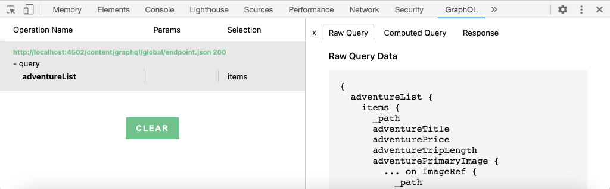
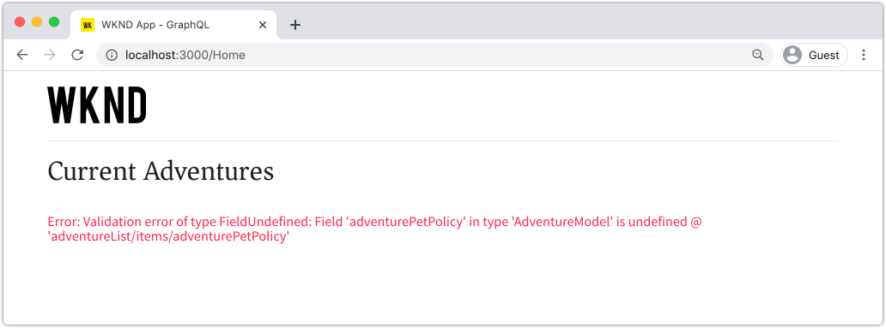

# 查询AEM从外部应用程序使用GraphQL

>[!CAUTION]
>
> 针对内容片段投放的AEM GraphQL API将于2021年初发布。
> 相关文档可供预览使用。

在本章中，我们将探讨如何使用AEM GraphQL API在外部应用程序中提升体验。

本教程使用一个简单的React应用程序来查询和显示AEM GraphQL API公开的Adventure内容。 使用React的功能大多不重要，任何平台的任何框架都可以编写耗用的外部应用程序。

## 前提条件

这是一个多部分教程，假定已完成前面部分中概述的步骤。

_本章中的IDE屏幕截图来自 [Visual Studio代码](https://code.visualstudio.com/)_

或者，安装浏览器扩展（如[GraphQL Network](https://chrome.google.com/webstore/detail/graphql-network/igbmhmnkobkjalekgiehijefpkdemocm)），以便能够视图有关GraphQL查询的更多详细信息。

## 目标

本章将学习如何：

* 开始并了解示例React应用程序的功能
* 了解如何从外部应用程序调用AEM GraphQL端点
* 定义GraphQL查询以按活动筛选冒险内容片段列表
* 更新React应用程序以提供控件通过GraphQL进行筛选，GraphQL是活动的冒险列表

## 开始React应用程序

由于本章侧重于开发客户端以在GraphQL上使用内容片段，因此必须下载示例[WKND GraphQL React应用程序源代码并在本地机器上设置](./setup.md#react-app)，并且[AEM SDK作为作者服务](./setup.md#aem-sdk)运行，并安装了[示例WKND站点](./setup.md#wknd-site)。

在[快速设置](./setup.md)一章中，将更详细地介绍启动React应用程序，但可以按照以下简略说明操作：

1. 如果尚未克隆示例WKND GraphQL React应用程序，请从[Github.com](https://github.com/adobe/aem-guides-wknd-graphql)中克隆该示例

   ```shell
   $ git clone --branch tutorial/react git@github.com:adobe/aem-guides-wknd-graphql.git
   ```

1. 在IDE中打开WKND GraphQL React应用程序

   

1. 从命令行导航到`react-app`文件夹
1. 开始WKND GraphQL React应用程序，方法是从项目根（`react-app`文件夹）执行以下命令

   ```shell
   $ cd aem-guides-wknd-graphql/react-app
   $ npm start
   ```

1. 请在[http://localhost:3000/](http://localhost:3000/)查看应用程序。 示例React应用程序包含两个主要部分：

   * 家庭体验充当WKND Adventures的索引，但使用GraphQL查询AEM中的&#x200B;__Adventure__&#x200B;内容片段。 在本章中，我们将修改此视图以支持按活动筛选冒险。

      

   * 探险详细信息体验，使用GraphQL查询特定&#x200B;__冒险__&#x200B;内容片段，并显示更多数据点。

      

1. 使用浏览器的开发工具和浏览器扩展（如[GraphQL Network](https://chrome.google.com/webstore/detail/graphql-network/igbmhmnkobkjalekgiehijefpkdemocm)）检查发送到AEM的GraphQL查询及其JSON响应。 此方法可用于监控GraphQL请求和响应，确保它们得到正确表述，并且其响应符合预期。

   

   *从React应用程序发送到AEM的GraphQL查询*

   

   *AEM对React应用程序的JSON响应*

   查询和响应应与GraphiQL IDE中显示的内容相匹配。

   >[!NOTE]
   >
   > 在开发过程中，React应用程序配置为通过webpack开发服务器将HTTP请求代理到AEM。 React应用程序正在向`http://localhost:3000`发出请求，该请求将它们代理到在`http://localhost:4502`上运行的AEM作者服务。 有关详细信息，请查看文件`src/setupProxy.js`和`env.development`。
   >
   > 在非开发场景中，React应用程序将直接配置为向AEM发出请求。

## 浏览应用程序的GraphQL代码

1. 在IDE中，打开文件`src/api/useGraphQL.js`。

   这是[React Effect Hook](https://reactjs.org/docs/hooks-overview.html#effect-hook)，用于监听应用程序的`query`的更改，更改时向AEM GraphQL端点发出HTTPPOST请求，并将JSON响应返回到应用程序。

   只要React应用程序需要进行GraphQL查询，它就会调用此自定义`useGraphQL(query)`挂接，并传入GraphQL以发送到AEM。

   此挂接使用简单的`fetch`模块发出HTTPPOSTGraphQL请求，但其他模块（如[Apollo GraphQL客户端](https://www.apollographql.com/docs/react/)）也可以使用类似的模块。

1. 在IDE中打开`src/components/Adventures.js`，它负责家庭视图的冒险列表，并查看`useGraphQL`挂接的调用。

   此代码将默认`query`设置为`allAdventuresQuery`，如此文件中定义的lowerdown。

   ```javascript
   const [query, setQuery] = useState(allAdventuresQuery);
   ```

   ......每当`query`变量发生变化时，都会调用`useGraphQL`挂接，这反过来会对AEM执行GraphQL查询，将JSON返回到`data`变量，然后用于呈现冒险列表。

   ```javascript
   const { data, errorMessage } = useGraphQL(query);
   ```

   `allAdventuresQuery`是文件中定义的常量GraphQL查询，它查询所有Adventure Content Fragments，不进行任何过滤，并且只返回需要渲染主视图的数据点。

   ```javascript
   const allAdventuresQuery = `
   {
       adventureList {
         items {
           _path
           adventureTitle
           adventurePrice
           adventureTripLength
           adventurePrimaryImage {
           ... on ImageRef {
               _path
               mimeType
               width
               height
             }
           }
         }
     }
   }
   `;
   ```

1. 打开`src/components/AdventureDetail.js`，该组件负责显示冒险详细信息体验。 此视图请求特定内容片段，使用其JCR路径作为其唯一id，并呈现提供的详细信息。

   与`Adventures.js`类似，自定义`useGraphQL` React Hook被重新用于对AEM执行该GraphQL查询。

   内容片段的路径从组件的`props`顶部收集，用于指定要查询的内容片段。

   ```javascript
   const contentFragmentPath = props.location.pathname.substring(props.match.url.length);
   ```

   ...并且GraphQL参数化查询是使用`adventureDetailQuery(..)`函数构建的，并传递给`useGraphQL(query)`，后者针对AEM执行GraphQL查询并将结果返回给`data`变量。

   ```javascript
   const { data, errorMessage } = useGraphQL(adventureDetailQuery(contentFragmentPath));
   ```

   `adventureDetailQuery(..)`函数只需包装一个过滤GraphQL查询，它使用AEM `<modelName>ByPath`语法来查询由其JCR路径标识的单个内容片段，并返回呈现冒险详细信息所需的所有指定数据点。

   ```javascript
   function adventureDetailQuery(_path) {
   return `{
       adventureByPath (_path: "${_path}") {
         item {
           _path
           adventureTitle
           adventureActivity
           adventureType
           adventurePrice
           adventureTripLength
           adventureGroupSize
           adventureDifficulty
           adventurePrice
           adventurePrimaryImage {
               ... on ImageRef {
               _path
               mimeType
               width
               height
               }
           }
           adventureDescription {
               html
           }
           adventureItinerary {
               html
           }
         }
       }
   }
   `;
   }
   ```

## 创建参数化GraphQL查询

接下来，让我们修改React应用程序，以执行参数化、过滤GraphQL查询，这些视图通过冒险的活动限制家庭。

1. 在IDE中，打开文件：`src/components/Adventures.js`。 此文件表示家庭体验的冒险组件，该组件用于查询并显示冒险卡。
1. Inspect函数`filterQuery(activity)`（未使用），但已准备好构建一个GraphQL查询,过滤器`activity`冒险。

请注意，参数`activity`作为`adventureActivity`字段`filter`的一部分注入到GraphQL查询中，要求该字段的值与参数的值匹配。

    &quot;
    javascriptfunction filterQuery(活动){
    return 
    {
    adventures(filter:{
    adventureActivity:{
    _表达式:[
    {
    value:“${活动
    
    
    }
    ){
    
    }
    
    
    
    项
    {2012年
    
    
    
    
    2014年
    初
    初级
    初
    级
    初
    级邮
    本……

1. 更新React Adventures组件的`return`语句，以添加调用新参数化`filterQuery(activity)`的按钮，为列表提供冒险。

   ```javascript
   function Adventures() {
       ...
       return (
           <div className="adventures">
   
           {/* Add these three new buttons that set the GraphQL query accordingly */}
   
           {/* The first button uses the default `allAdventuresQuery` */}
           <button onClick={() => setQuery(allAdventuresQuery)}>All</button>
   
           {/* The 2nd and 3rd button use the `filterQuery(..)` to filter by activity */}
           <button onClick={() => setQuery(filterQuery('Camping'))}>Camping</button>
           <button onClick={() => setQuery(filterQuery('Surfing'))}>Surfing</button>
   
           <ul className="adventure-items">
           ...
       )
   }
   ```

1. 保存更改并在Web浏览器中重新加载React应用程序。 三个新按钮显示在顶部，单击它们会自动将AEM重新查询到具有匹配活动的冒险内容片段。

   

1. 尝试为活动添加更多筛选按钮：`Rock Climbing`、`Cycling`和`Skiing`

## 处理GraphQL错误

GraphQL类型强，因此，如果查询无效，可返回有帮助的错误消息。 接下来，让我们模拟一个错误查询，看到返回的错误消息。

1. 重新打开文件`src/api/useGraphQL.js`。 Inspect以下代码片断查看错误处理：

   ```javascript
   //useGraphQL.js
   .then(({data, errors}) => {
           //If there are errors in the response set the error message
           if(errors) {
               setErrors(mapErrors(errors));
           }
           //Otherwise if data in the response set the data as the results
           if(data) {
               setData(data);
           }
       })
       .catch((error) => {
           setErrors(error);
       });
   ```

   检查响应，以查看其是否包含`errors`对象。 如果GraphQL查询存在问题，如基于模式的未定义字段，则AEM将发送`errors`对象。 如果没有`errors`对象，则设置并返回`data`。

   `window.fetch`包含一个`.catch`语句，用于&#x200B;*catch*&#x200B;任何常见错误，如无效HTTP请求或无法与服务器建立连接。

1. 打开文件`src/components/Adventures.js`。
1. 修改`allAdventuresQuery`以包含无效属性`adventurePetPolicy`:

   ```javascript
   /**
    * Query for all Adventures
    * adventurePetPolicy has been added beneath items
   */
   const allAdventuresQuery = `
   {
       adventureList {
         items {
           adventurePetPolicy
           _path
           adventureTitle
           adventurePrice
           adventureTripLength
           adventurePrimaryImage {
           ... on ImageRef {
               _path
               mimeType
               width
               height
           }
           }
         }
       }
   }
   `;
   ```

   我们知道`adventurePetPolicy`不是Adventure模型的一部分，因此这应会触发错误。

1. 保存更改并返回浏览器。 您应当看到如下错误消息：

   

   GraphQL API检测到`AdventureModel`中`adventurePetPolicy`未定义，并返回相应的错误消息。

1. Inspect来自AEM的响应使用浏览器的开发人员工具查看`errors` JSON对象：

   

   `errors`对象是详细的，包括有关格式错误查询的位置和错误分类的信息。

1. 返回至`Adventures.js`并还原查询更改，将应用程序返回到其正确状态。

## 恭喜！{#congratulations}

恭喜！ 您已成功探索示例WKND GraphQL React应用程序的代码并将其更新为使用参数化的、过滤的GraphQL查询，通过活动进行列表冒险！ 您还有机会探索一些基本的错误处理。

## 后续步骤{#next-steps}

在下一章[使用片段引用的高级数据建模](./fragment-references.md)中，您将学习如何使用片段引用功能在两个不同的内容片段之间建立关系。 您还将学习如何修改GraphQL查询以包括引用模型中的字段。
